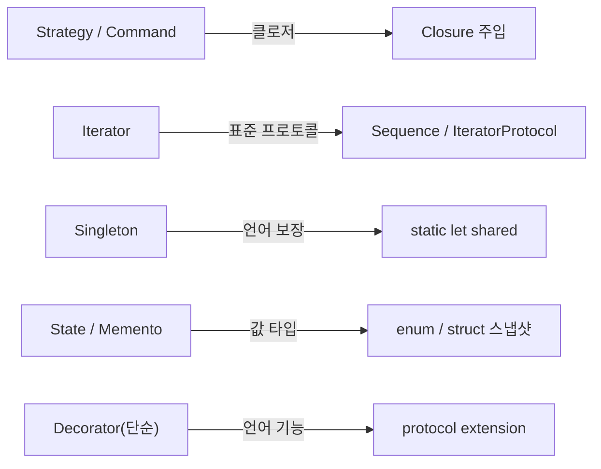

## 들어가며

이 글은 `OO-Design-Essential` 시리즈의 **3단계**입니다. 전체 흐름은 [OO-Design Essential Curriculum](/2026/06/19/oo-design-essential-curriculum.html)에서 확인할 수 있습니다.

2단계 [GoF Design Patterns: 23개 패턴의 정전](/2026/06/19/gof-design-patterns.html)에서 우리는 23개 패턴의 "정전(canon)"을 살펴봤습니다. 그런데 GoF의 *Design Patterns*(1994)는 **C++과 Smalltalk** 시대의 산물입니다. 당시 언어에는 일급 함수(first-class function)도, 강력한 제네릭도, 값 타입 중심의 불변성 모델도 없었습니다. 그래서 GoF 패턴 중 상당수는 사실 **"언어가 부족해서 클래스로 우회한 결과물"**이기도 합니다.

이 단계의 텍스트는 Florent Vilmart·Giordano Scalzo의 *Hands-On Design Patterns with Swift*입니다. 이 책의 핵심 주장은 단순합니다.

> **GoF 패턴은 현대 언어 기능으로 "재해석(re-interpret)"해야지, 글자 그대로 "복사(copy verbatim)"하면 안 된다.**

Strategy를 위해 매번 인터페이스와 구현 클래스를 만들 필요가 없습니다. Swift에서는 클로저 하나면 됩니다. Iterator를 직접 구현할 필요도 없습니다. `Sequence`/`IteratorProtocol`을 채택하면 `for-in`이 공짜로 따라옵니다. 즉, **패턴의 의도(intent)는 살리되, 구현(mechanism)은 언어가 제공하는 가장 자연스러운 도구로 바꾸는 것**이 이 글의 주제입니다.

그리고 이 질문은 자연스럽게 4단계로 이어집니다. "어떻게 구현하는가"를 넘어 "**왜 이렇게 설계해야 하는가**"로요. 4단계 [OO Software Construction: 계약에 의한 설계](/2026/06/19/object-oriented-software-construction.html)에서 Bertrand Meyer의 OO 원칙과 Design by Contract를 다룹니다.

<div class="post-summary-box" markdown="1">

### 📌 이 글에서 다루는 내용

#### 🔍 핵심 주제

- **언어 기능과 패턴**: Protocol·Generic·Closure로 고전 패턴을 더 가볍게 재구현한다
- **값 타입 시대의 패턴**: Struct/Enum 중심 설계와 불변성(Immutability)이 State·Memento를 바꾼다
- **함수형 영향**: 고차 함수와 클로저가 Strategy·Command 같은 행동 패턴을 통째로 대체한다
- **안티패턴·관용구**: 현대 언어에서 불필요해진 패턴과, 그 자리를 채우는 새 관용구

</div>

## 언어 기능과 패턴: Protocol·Generic·Closure로 재구현

GoF 패턴의 대부분은 "추상화 + 다형성"의 조합입니다. Swift에서는 이 조합을 **상속 계층(class hierarchy)** 대신 **프로토콜 + 제네릭**으로 표현하는 것이 더 자연스럽습니다.

### Strategy: 인터페이스 + 구현 클래스 → 클로저

고전 OO에서 Strategy는 `interface Strategy { execute() }`와 여러 구현 클래스로 만듭니다. Swift에서는 함수가 일급 값이므로, 전략 자체를 클로저로 주입하면 끝입니다.

```swift
// 고전: 프로토콜 + 구현 타입 (필요할 때는 이렇게도 가능)
protocol DiscountStrategy {
    func apply(to price: Double) -> Double
}

// 현대: 전략을 "클로저 타입"으로 선언 — 별도 클래스가 사라진다
struct Checkout {
    // (Double) -> Double 클로저가 곧 전략이다
    var discount: (Double) -> Double

    func total(of price: Double) -> Double {
        discount(price) // 어떤 전략이든 호출 방식은 동일
    }
}

let blackFriday = Checkout { $0 * 0.5 }   // 50% 할인 전략
let member      = Checkout { $0 - 1000 }  // 정액 할인 전략

print(blackFriday.total(of: 20000)) // 10000.0
print(member.total(of: 20000))      // 19000.0
```

구현 클래스 3개가 클로저 리터럴 1줄로 줄었습니다. 전략이 복잡해지면 그때 프로토콜로 승격하면 됩니다.

### Iterator: 직접 구현 → `Sequence` / `IteratorProtocol`

GoF Iterator의 의도는 "내부 표현을 노출하지 않고 순회"입니다. Swift는 이 의도를 표준 프로토콜로 박제해 두었습니다. `IteratorProtocol`만 채택하면 `for-in`, `map`, `filter`가 전부 따라옵니다.

```swift
// 피보나치 수열을 lazy하게 순회하는 시퀀스
struct Fibonacci: Sequence, IteratorProtocol {
    private var (current, next) = (0, 1)

    // next()만 구현하면 표준 라이브러리가 나머지를 채워준다
    mutating func next() -> Int? {
        defer { (current, next) = (next, current + next) }
        return current
    }
}

// for-in, prefix, map 등 컬렉션 API를 그대로 사용
for n in Fibonacci().prefix(6) {
    print(n) // 0 1 1 2 3 5
}
```

별도의 `FibonacciIterator` 클래스나 `hasNext()/next()` 쌍을 만들 필요가 없습니다. **패턴이 언어의 표준 프로토콜로 흡수된** 대표 사례입니다.

### Generic으로 타입 안전한 재사용

GoF 시절에는 `Object`/`void*`로 타입을 두루뭉술하게 다뤘지만, 제네릭은 같은 추상화를 **타입 안전하게** 표현합니다. 예를 들어 Factory Method도 제네릭 함수 하나로 단순화할 수 있습니다.

```swift
protocol Initializable { init() }

// 어떤 Initializable 타입이든 생성해 주는 제네릭 팩토리
func make<T: Initializable>(_ type: T.Type) -> T {
    T() // 컴파일 타임에 타입이 결정된다 — 캐스팅 불필요
}

struct Logger: Initializable { init() {} }
let logger = make(Logger.self) // 타입: Logger (런타임 캐스팅 없음)
```

## 값 타입 시대의 패턴: Struct/Enum 중심 설계와 불변성

Swift는 `struct`/`enum`이 **값 타입(value type)**이고, 기본적으로 복사 의미론(copy semantics)을 가집니다. 이 사실 하나가 여러 패턴의 모양을 바꿉니다.

### Memento: 깊은 복사 클래스 → 값 타입 스냅샷

GoF Memento는 "객체 상태를 캡슐화해 저장하고 나중에 복원"하는 패턴입니다. 고전 OO에서는 상태를 별도 Memento 클래스로 복사해야 했습니다. 값 타입에서는 **변수에 담는 순간 그것이 곧 스냅샷**입니다.

```swift
// 에디터 상태가 struct이므로, 값을 저장하면 그대로 스냅샷이 된다
struct EditorState {
    var text: String
    var cursor: Int
}

struct Editor {
    private(set) var state = EditorState(text: "", cursor: 0)
    private var history: [EditorState] = [] // Memento 스택

    mutating func type(_ s: String) {
        history.append(state)       // 변경 전 상태를 "복사"해 보관
        state.text += s
        state.cursor = state.text.count
    }

    mutating func undo() {
        guard let last = history.popLast() else { return }
        state = last                // 값 복사로 즉시 복원
    }
}

var editor = Editor()
editor.type("Hello")
editor.type(" Swift")
editor.undo()
print(editor.state.text) // "Hello"
```

별도 Memento/Caretaker 클래스 계층이 사라지고, **값 복사 = 스냅샷**이라는 언어 의미론이 패턴을 대신합니다.

### State: 클래스 다형성 → enum

GoF State는 각 상태를 클래스로 만들고 전이를 위임합니다. Swift에서는 상태가 유한하고 명확할 때 `enum`이 더 안전합니다. **연관 값(associated value)**으로 상태별 데이터까지 담을 수 있고, `switch`의 망라성(exhaustiveness) 검사가 누락된 전이를 컴파일 타임에 잡아줍니다.

```swift
enum DownloadState {
    case idle
    case downloading(progress: Double) // 상태마다 다른 데이터를 가질 수 있다
    case finished(url: URL)
    case failed(Error)

    // 전이 규칙을 한 곳에 모은다
    func next(_ event: Event) -> DownloadState {
        switch (self, event) {
        case (.idle, .start):               return .downloading(progress: 0)
        case (.downloading, .progress(let p)): return .downloading(progress: p)
        case (.downloading, .complete(let u)): return .finished(url: u)
        default:                            return self // 그 외 전이는 무시
        }
    }
    enum Event { case start, progress(Double), complete(URL) }
}
```

상태 클래스 4개 대신 `enum` 하나, 그리고 `switch`가 "이 상태에서 이 이벤트를 처리했는가"를 검증합니다.

### 불변성(Immutability)이 주는 안정성

값 타입을 `let`으로 선언하면 공유 가변 상태(shared mutable state)가 사라집니다. 이는 멀티스레드 환경에서 데이터 경합을 원천 차단하고, GoF Flyweight 같은 "공유 객체" 패턴의 동기화 고민을 상당 부분 없애줍니다. 변경이 필요하면 `mutating`으로 명시하거나 새 값을 만들면 되므로, **어디서 상태가 바뀌는지가 시그니처에 드러납니다.**

## 함수형 영향: 고차 함수와 클로저로 대체되는 행동 패턴

GoF의 Behavioral 패턴 상당수는 "행동(동작)을 객체로 캡슐화"합니다. 그런데 함수가 일급 값인 언어에서는, 행동을 캡슐화하는 가장 가벼운 단위가 바로 **클로저**입니다.

### Command: 명령 객체 → 클로저

Command 패턴은 "요청을 객체로 만들어 저장·취소·큐잉"합니다. Swift에서는 `() -> Void` 클로저 자체가 이미 캡슐화된 명령입니다.

```swift
// 명령 = 실행 가능한 클로저, 취소 = 그 역연산 클로저
struct Command {
    let execute: () -> Void
    let undo: () -> Void
}

final class Invoker {
    private var stack: [Command] = []

    func run(_ cmd: Command) {
        cmd.execute()
        stack.append(cmd) // undo를 위해 보관
    }
    func undoLast() {
        stack.popLast()?.undo()
    }
}

var balance = 0
let deposit = Command(
    execute: { balance += 100 },
    undo:    { balance -= 100 }
)
let invoker = Invoker()
invoker.run(deposit)  // balance == 100
invoker.undoLast()    // balance == 0
```

ConcreteCommand 클래스 계층이 클로저 쌍으로 압축됐습니다.

### Template Method: 상속 → 클로저 주입

Template Method는 알고리즘 골격을 상위 클래스에 두고 "변하는 단계"를 하위 클래스가 오버라이드합니다. 상속 대신, 변하는 단계를 **클로저 파라미터로 주입**하면 똑같은 의도를 합성(composition)으로 달성합니다.

```swift
// 골격은 고정, 변하는 부분(transform)만 주입받는다
func report(_ items: [Int], transform: (Int) -> String) -> String {
    let header = "=== Report ==="
    let body = items.map(transform).joined(separator: "\n") // 변하는 단계
    let footer = "Total: \(items.count)"
    return [header, body, footer].joined(separator: "\n")
}

let out = report([1, 2, 3]) { "• item \($0)" }
```

`map`/`reduce`/`filter`가 이미 고차 함수이므로, Template Method·Strategy·Visitor의 많은 사례가 표준 컬렉션 연산으로 흡수됩니다.

### Observer: 직접 구현 → Combine/AsyncSequence

Observer도 직접 구현할 수 있지만, 현대 Swift에서는 Combine의 `Publisher`나 `AsyncSequence`가 관찰 가능 흐름을 언어/프레임워크 차원에서 제공합니다. 의도("상태 변화 알림")는 그대로 두고, 구현은 표준 도구에 위임하는 것이 권장됩니다.

## 안티패턴·관용구: 불필요해진 패턴과 새 관용구

모든 GoF 패턴이 살아남는 것은 아닙니다. 언어가 그 자리를 채우면, 패턴을 고집하는 것이 오히려 **안티패턴**이 됩니다.

### 불필요해지거나 새 관용구로 대체되는 패턴



- **Singleton**: GoF의 이중 검사 잠금(double-checked locking)은 잊으세요. Swift의 `static let`은 **lazy하고 thread-safe하게 한 번만 초기화**됨이 언어로 보장됩니다. `static let shared = Manager()` 한 줄이 정답입니다. (다만 전역 가변 상태라는 설계적 위험은 그대로이니 남용은 금물입니다.)
- **Strategy / Command**: 위에서 봤듯 대부분 클로저로 흡수됩니다. 클래스 계층을 만드는 것은 전략에 상태·설정·테스트 더블이 많이 필요할 때로 미루세요.
- **Iterator**: 거의 항상 `Sequence` 채택으로 끝납니다. 직접 `next()` 짝을 손으로 만들 일은 드뭅니다.
- **Decorator(단순한 경우)**: 동작을 덧붙이는 단순 데코레이션은 `protocol extension`이나 함수 합성으로 충분할 때가 많습니다.

### 새로 등장한 관용구

```swift
// protocol-oriented: 기본 구현을 extension으로 제공 → 데코레이터/믹스인 대체
protocol Greetable { var name: String { get } }
extension Greetable {
    func greet() -> String { "Hi, \(name)" } // 기본 동작을 모든 채택 타입에 공급
}

// Result 타입: 성공/실패 분기를 값으로 표현 (예외 객체 패턴 대체)
func load(_ id: Int) -> Result<String, Error> {
    id > 0 ? .success("ok") : .failure(NSError(domain: "", code: -1))
}
```

`protocol`의 기본 구현(default implementation)은 다중 상속 없이 행동을 공유하게 해주고, `Result`·`Optional`·`enum`은 예외/널 분기를 **타입 시스템 안에서** 다루게 합니다. 이것이 *Hands-On Design Patterns with Swift*가 강조하는 핵심입니다. **패턴을 외우기보다, 언어가 무엇을 이미 제공하는지를 먼저 보라.**

### 그래도 패턴 지식이 필요한 이유

오해는 금물입니다. 패턴이 클로저 한 줄로 줄어든다고 해서 패턴 지식이 쓸모없어지는 것은 아닙니다. 오히려 **"이 클로저는 Strategy의 의도다"**라고 이름 붙일 수 있어야 동료와 설계를 논의할 수 있습니다. 패턴은 여전히 **공유 어휘(shared vocabulary)**입니다. 바뀐 것은 구현 메커니즘이지, 의도와 어휘가 아닙니다.

## 마무리

GoF 패턴은 C++/Smalltalk 시대의 제약을 우회하기 위한 "구현 레시피"이기도 했습니다. Swift처럼 프로토콜·제네릭·클로저·값 타입을 갖춘 현대 언어에서는 같은 **의도**를 훨씬 가볍게 표현할 수 있습니다. Strategy·Command는 클로저로, Iterator는 표준 프로토콜로, State·Memento는 enum·struct로, Singleton은 `static let`으로 재해석됩니다. 패턴을 글자 그대로 복사하면 오히려 과설계가 되고, 언어가 제공하는 관용구를 먼저 보면 코드가 단순해집니다. 그러면서도 패턴이라는 **공유 어휘**는 여전히 설계 대화의 기반으로 남습니다.

여기까지가 "**어떻게 구현하는가**"의 이야기였습니다. 다음 단계에서는 한 발 더 들어가 "**왜 이렇게 설계해야 하는가**"를 묻습니다. Bertrand Meyer의 OO 원칙과 Design by Contract(계약에 의한 설계)를 통해, 패턴과 구현을 지탱하는 더 근본적인 설계 철학으로 넘어갑니다.

### 다음 학습

- [OO-Design Essential Curriculum](/2026/06/19/oo-design-essential-curriculum.html) — 전체 학습 로드맵에서 현재 위치 확인하기
- 다시 보기 (2단계): [GoF Design Patterns: 23개 패턴의 정전](/2026/06/19/gof-design-patterns.html)
- 다음 단계 (4단계): [OO Software Construction: 계약에 의한 설계](/2026/06/19/object-oriented-software-construction.html)
