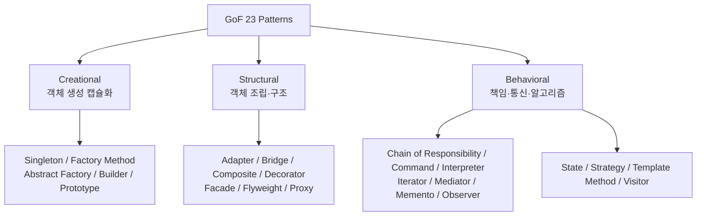
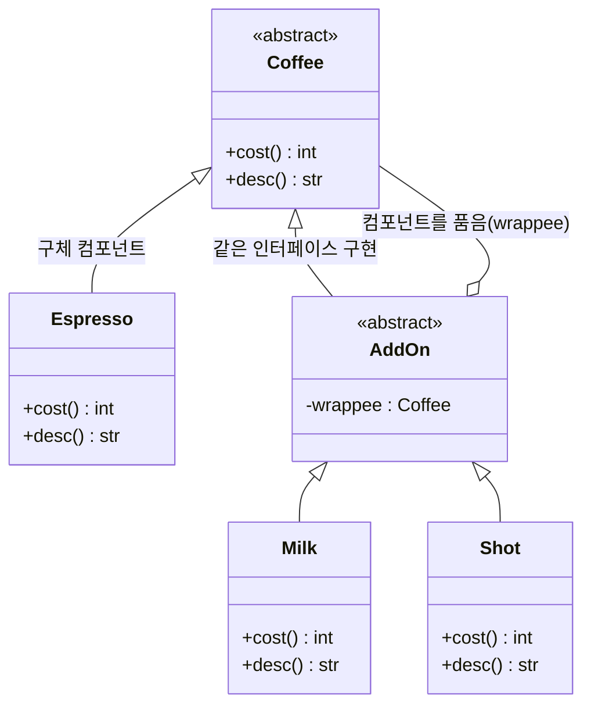

<figure class="post-figure post-figure--header">
<svg role="img" aria-label="GoF 23개 디자인 패턴을 세 가족으로 묶은 그림. 왼쪽은 생성 패턴으로, 거푸집에서 객체 하나를 빚어내는 모습으로 객체 생성의 캡슐화를 나타낸다. 가운데는 구조 패턴으로, 작은 블록들이 더 큰 구조로 조립되는 모습이다. 오른쪽은 행동 패턴으로, 여러 노드가 화살표로 연결되어 책임과 메시지를 주고받는 통신망으로 표현된다. 세 가족이 각각 생성 다섯 개, 구조 일곱 개, 행동 열한 개의 패턴을 담는다." viewBox="0 0 680 300" xmlns="http://www.w3.org/2000/svg">
  <title>GoF 23 패턴의 세 가족 — 생성(객체를 빚다) · 구조(조립하다) · 행동(협력하다)</title>

  <!-- ===== LEFT: Creational — mold shaping one object ===== -->
  <text x="116" y="26" text-anchor="middle" font-size="13" fill="currentColor" font-weight="700" opacity="0.78">생성 (Creational)</text>
  <text x="116" y="44" text-anchor="middle" font-size="9" fill="currentColor" opacity="0.7">객체를 어떻게 만드는가 · 5</text>
  <!-- mold / crucible -->
  <path d="M58 96 L174 96 L160 188 L72 188 Z" fill="var(--bg-light)" stroke="currentColor" stroke-width="2"/>
  <line x1="50" y1="96" x2="182" y2="96" stroke="var(--gold)" stroke-width="3"/>
  <!-- emerging forged object -->
  <rect x="98" y="118" width="36" height="36" rx="4" fill="var(--bg-panel)" stroke="var(--accent-color)" stroke-width="2.5"/>
  <line x1="116" y1="118" x2="116" y2="154" stroke="var(--accent-color)" stroke-width="1.5" opacity="0.6"/>
  <line x1="98" y1="136" x2="134" y2="136" stroke="var(--accent-color)" stroke-width="1.5" opacity="0.6"/>
  <!-- rising spark / shaping arrow -->
  <line x1="116" y1="112" x2="116" y2="82" stroke="var(--secondary-color)" stroke-width="2" marker-end="url(#gof-arrow)"/>
  <text x="116" y="214" text-anchor="middle" font-size="9.5" fill="currentColor" opacity="0.82" font-weight="700">거푸집에서 빚어냄</text>
  <text x="116" y="232" text-anchor="middle" font-size="8" fill="currentColor" opacity="0.65">Factory · Builder · Singleton …</text>

  <!-- divider -->
  <line x1="234" y1="56" x2="234" y2="240" stroke="currentColor" stroke-width="1" opacity="0.25"/>

  <!-- ===== MIDDLE: Structural — assembling blocks ===== -->
  <text x="340" y="26" text-anchor="middle" font-size="13" fill="currentColor" font-weight="700" opacity="0.78">구조 (Structural)</text>
  <text x="340" y="44" text-anchor="middle" font-size="9" fill="currentColor" opacity="0.7">객체를 어떻게 조립하는가 · 7</text>
  <!-- assembled composite -->
  <rect x="296" y="120" width="40" height="40" rx="3" fill="var(--bg-light)" stroke="currentColor" stroke-width="2"/>
  <rect x="340" y="120" width="40" height="40" rx="3" fill="var(--bg-light)" stroke="currentColor" stroke-width="2"/>
  <rect x="318" y="78" width="40" height="40" rx="3" fill="var(--bg-panel)" stroke="var(--accent-color)" stroke-width="2.5"/>
  <rect x="384" y="120" width="20" height="40" rx="3" fill="var(--bg-light)" stroke="var(--gold)" stroke-width="2"/>
  <!-- joints connecting them -->
  <line x1="336" y1="140" x2="340" y2="140" stroke="var(--secondary-color)" stroke-width="3"/>
  <line x1="338" y1="118" x2="338" y2="120" stroke="var(--secondary-color)" stroke-width="3"/>
  <line x1="380" y1="140" x2="384" y2="140" stroke="var(--secondary-color)" stroke-width="3"/>
  <text x="340" y="186" text-anchor="middle" font-size="9.5" fill="currentColor" opacity="0.82" font-weight="700">블록을 큰 구조로 조립</text>
  <text x="340" y="204" text-anchor="middle" font-size="8" fill="currentColor" opacity="0.65">Adapter · Decorator · Composite …</text>

  <!-- divider -->
  <line x1="446" y1="56" x2="446" y2="240" stroke="currentColor" stroke-width="1" opacity="0.25"/>

  <!-- ===== RIGHT: Behavioral — communicating nodes ===== -->
  <text x="566" y="26" text-anchor="middle" font-size="13" fill="currentColor" font-weight="700" opacity="0.78">행동 (Behavioral)</text>
  <text x="566" y="44" text-anchor="middle" font-size="9" fill="currentColor" opacity="0.7">객체가 어떻게 협력하는가 · 11</text>
  <!-- subject node -->
  <circle cx="566" cy="92" r="16" fill="var(--bg-panel)" stroke="var(--accent-color)" stroke-width="2.5"/>
  <text x="566" y="96" text-anchor="middle" font-size="8" fill="currentColor" font-weight="700">주체</text>
  <!-- observer / collaborator nodes -->
  <circle cx="500" cy="158" r="13" fill="var(--bg-light)" stroke="currentColor" stroke-width="2"/>
  <circle cx="566" cy="170" r="13" fill="var(--bg-light)" stroke="currentColor" stroke-width="2"/>
  <circle cx="632" cy="158" r="13" fill="var(--bg-light)" stroke="currentColor" stroke-width="2"/>
  <!-- notify arrows -->
  <line x1="554" y1="103" x2="508" y2="148" stroke="var(--secondary-color)" stroke-width="2" marker-end="url(#gof-arrow)"/>
  <line x1="566" y1="108" x2="566" y2="155" stroke="var(--secondary-color)" stroke-width="2" marker-end="url(#gof-arrow)"/>
  <line x1="578" y1="103" x2="624" y2="148" stroke="var(--secondary-color)" stroke-width="2" marker-end="url(#gof-arrow)"/>
  <text x="566" y="206" text-anchor="middle" font-size="9.5" fill="currentColor" opacity="0.82" font-weight="700">노드끼리 책임·통지</text>
  <text x="566" y="224" text-anchor="middle" font-size="8" fill="currentColor" opacity="0.65">Strategy · Observer · State …</text>

  <defs>
    <marker id="gof-arrow" markerWidth="8" markerHeight="8" refX="6" refY="4" orient="auto">
      <path d="M0,0 L8,4 L0,8 z" fill="var(--secondary-color)"/>
    </marker>
  </defs>
</svg>
<figcaption>GoF 23개 패턴은 <strong>목적</strong>에 따라 세 가족으로 갈린다 — <strong>생성</strong>(객체를 거푸집에서 빚어내듯 생성을 캡슐화), <strong>구조</strong>(작은 블록을 더 큰 구조로 조립), <strong>행동</strong>(노드들이 화살표로 책임과 통지를 주고받음). 어떤 변화를 흡수하려는지가 곧 어느 가족에서 패턴을 고를지를 정한다.</figcaption>
</figure>

## 들어가며

이 글은 `OO-Design-Essential` 시리즈의 **2단계**입니다. 전체 흐름은 [OO-Design Essential Curriculum](/2026/06/19/oo-design-essential-curriculum.html)에서 확인할 수 있습니다.

1단계 [Head First Design Patterns: 패턴의 직관](/2026/06/19/head-first-design-patterns.html)에서는 "왜 이 패턴이 필요한가"를 이야기와 그림으로 체득했습니다. 직관이 생겼다면 이제는 **정전(canon)** 으로 돌아갈 차례입니다. 직관은 패턴을 *떠올리게* 해주지만, 정확한 적용은 엄밀한 정의에서 나옵니다.

그 정전이 바로 Erich Gamma, Richard Helm, Ralph Johnson, John Vlissides — 흔히 **Gang of Four(GoF)** 라 불리는 네 저자의 *Design Patterns: Elements of Reusable Object-Oriented Software*(1994)입니다. 이 책은 재사용 가능한 객체지향 설계의 반복되는 해법 23가지를 카탈로그로 정리했고, 각 패턴을 다음과 같은 고정된 틀로 기술합니다.

- **의도(Intent)**: 이 패턴이 푸는 문제를 한 문장으로
- **구조(Structure)**: 참여 클래스/객체와 그 관계 (UML)
- **결과(Consequences)**: 얻는 것과 치르는 비용 — 트레이드오프

이 시리즈에서 GoF를 중심에 두는 이유가 여기 있습니다. 패턴 이름을 외우는 것이 아니라, **의도와 결과를 저울질하는 사고법**을 익히기 위함입니다. 이 사고법이 잡히면, 3단계 [Design Patterns with Swift: 현대 언어로 재해석](/2026/06/19/design-patterns-swift.html)에서 같은 패턴들이 클로저·프로토콜·옵셔널 같은 현대 언어 기능으로 어떻게 가벼워지는지를 비교하며 볼 수 있습니다.

<div class="post-summary-box" markdown="1">

### 📌 이 글에서 다루는 내용

#### 🔍 핵심 주제

- **생성 패턴(Creational)**: Singleton·Factory Method·Abstract Factory·Builder·Prototype — 객체 생성 과정을 캡슐화한다.
- **구조 패턴(Structural)**: Adapter·Bridge·Composite·Decorator·Facade·Flyweight·Proxy — 클래스/객체를 더 큰 구조로 조립한다.
- **행동 패턴(Behavioral) I**: Chain of Responsibility·Command·Interpreter·Iterator·Mediator — 객체 간 책임과 통신을 다룬다.
- **행동 패턴(Behavioral) II**: Memento·Observer·State·Strategy·Template Method·Visitor — 알고리즘과 상태 변화를 분리한다.
- **패턴 선택 기준**: 의도·결과·트레이드오프로 패턴을 고르고, 패턴 남용을 경계한다.

</div>

## 세 가족: 23개 패턴의 전체 지도

GoF는 패턴을 **목적(purpose)** 에 따라 세 가족으로 나눕니다. 생성 패턴은 *객체를 어떻게 만드는가*, 구조 패턴은 *객체를 어떻게 조립하는가*, 행동 패턴은 *객체가 어떻게 협력하고 책임을 나누는가*를 다룹니다.



### 생성 패턴(Creational) — 5개

| 패턴 | 의도 (Intent) |
| --- | --- |
| **Singleton** | 클래스의 인스턴스를 단 하나로 보장하고 전역 접근점을 제공한다. |
| **Factory Method** | 객체 생성을 서브클래스에 위임해, 어떤 클래스를 만들지를 늦춘다. |
| **Abstract Factory** | 구체 클래스를 명시하지 않고 관련 객체들의 **제품군**을 생성한다. |
| **Builder** | 복잡한 객체의 생성 과정과 표현을 분리해 단계별로 조립한다. |
| **Prototype** | 기존 인스턴스를 복제(clone)해 새 객체를 만든다. |

### 구조 패턴(Structural) — 7개

| 패턴 | 의도 (Intent) |
| --- | --- |
| **Adapter** | 호환되지 않는 인터페이스를 클라이언트가 기대하는 형태로 변환한다. |
| **Bridge** | 추상화와 구현을 분리해 둘이 독립적으로 변할 수 있게 한다. |
| **Composite** | 객체를 트리로 구성해 개별 객체와 복합 객체를 동일하게 다룬다. |
| **Decorator** | 상속 없이 객체에 책임(기능)을 동적으로 덧붙인다. |
| **Facade** | 복잡한 서브시스템에 단순한 통합 인터페이스를 제공한다. |
| **Flyweight** | 공유를 통해 다수의 미세 객체를 효율적으로 지원한다. |
| **Proxy** | 다른 객체에 대한 접근을 제어하는 대리자를 둔다. |

### 행동 패턴(Behavioral) — 11개

| 패턴 | 의도 (Intent) |
| --- | --- |
| **Chain of Responsibility** | 요청을 처리할 객체를 찾을 때까지 처리자 사슬을 따라 전달한다. |
| **Command** | 요청을 객체로 캡슐화해 큐잉·로깅·취소를 가능케 한다. |
| **Interpreter** | 언어의 문법을 표현하고 문장을 해석하는 인터프리터를 정의한다. |
| **Iterator** | 컬렉션의 내부 표현을 노출하지 않고 원소를 순차 접근한다. |
| **Mediator** | 객체 집합의 상호작용을 중재자로 캡슐화해 결합을 낮춘다. |
| **Memento** | 캡슐화를 깨지 않고 객체의 내부 상태를 저장·복원한다. |
| **Observer** | 한 객체의 상태 변화를 의존하는 객체들에 자동 통지한다. |
| **State** | 내부 상태에 따라 객체의 행동을 바꿔, 상태를 클래스로 표현한다. |
| **Strategy** | 알고리즘 군을 캡슐화해 런타임에 교체 가능하게 한다. |
| **Template Method** | 알고리즘의 골격을 정의하고 일부 단계를 서브클래스에 위임한다. |
| **Visitor** | 객체 구조를 바꾸지 않고 새로운 연산을 외부에서 추가한다. |

23개를 한 번에 외우려 하지 마십시오. 가족별 **의도의 결**을 잡는 것이 먼저입니다. 다음으로, 가족마다 대표 패턴 하나씩을 짧은 Python 코드로 손에 익혀 봅니다.

## 대표 구현 1 — Factory Method (생성)

객체 생성 자체를 메서드로 추상화하고, *무엇을* 만들지는 서브클래스가 결정합니다. 클라이언트는 구체 클래스를 몰라도 됩니다.

```python
from abc import ABC, abstractmethod

# Product 인터페이스
class Transport(ABC):
    @abstractmethod
    def deliver(self) -> str: ...

class Truck(Transport):
    def deliver(self) -> str:
        return "육로로 상자를 배송"

class Ship(Transport):
    def deliver(self) -> str:
        return "해상으로 컨테이너를 배송"

# Creator: 생성을 factory method로 위임
class Logistics(ABC):
    @abstractmethod
    def create_transport(self) -> Transport: ...  # 팩토리 메서드

    def plan(self) -> str:                          # 생성에 의존하는 공통 로직
        transport = self.create_transport()
        return transport.deliver()

class RoadLogistics(Logistics):
    def create_transport(self) -> Transport:
        return Truck()                              # 어떤 제품을 만들지 서브클래스가 결정

class SeaLogistics(Logistics):
    def create_transport(self) -> Transport:
        return Ship()

print(RoadLogistics().plan())  # 육로로 상자를 배송
print(SeaLogistics().plan())   # 해상으로 컨테이너를 배송
```

**결과(Consequences)**: 새 운송수단을 추가해도 `plan()`은 그대로입니다(개방-폐쇄). 대신 제품마다 Creator 서브클래스가 늘어 클래스 수가 증가하는 비용이 있습니다.

## 대표 구현 2 — Decorator (구조)

상속으로 기능을 늘리면 조합 폭발이 일어납니다. Decorator는 동일 인터페이스를 구현한 래퍼로 **런타임에** 책임을 겹겹이 쌓습니다. 핵심은 데코레이터(`AddOn`)가 컴포넌트(`Coffee`)를 *구현하는 동시에* 같은 컴포넌트 하나를 *품고 있다*는 점 — 이 자기참조 구조 덕분에 `Shot(Milk(Espresso()))`처럼 래퍼를 양파 껍질처럼 무한히 겹칠 수 있습니다.




```python
from abc import ABC, abstractmethod

class Coffee(ABC):                       # 공통 컴포넌트 인터페이스
    @abstractmethod
    def cost(self) -> int: ...
    @abstractmethod
    def desc(self) -> str: ...

class Espresso(Coffee):                  # 구체 컴포넌트
    def cost(self) -> int: return 3000
    def desc(self) -> str: return "에스프레소"

class AddOn(Coffee):                      # 데코레이터 기반 클래스
    def __init__(self, wrappee: Coffee):
        self._wrappee = wrappee          # 감싸는 대상을 보관

class Milk(AddOn):                        # 기능을 덧입히는 데코레이터
    def cost(self) -> int: return self._wrappee.cost() + 500
    def desc(self) -> str: return self._wrappee.desc() + " + 우유"

class Shot(AddOn):
    def cost(self) -> int: return self._wrappee.cost() + 700
    def desc(self) -> str: return self._wrappee.desc() + " + 샷추가"

order = Shot(Milk(Espresso()))           # 동적으로 책임을 합성
print(order.desc(), order.cost())        # 에스프레소 + 우유 + 샷추가 4200
```

**결과**: 옵션을 자유롭게 합성할 수 있어 유연합니다. 단, 작은 래퍼 객체가 많아져 디버깅 시 스택을 추적하기 번거롭다는 비용을 동반합니다.

## 대표 구현 3 — Observer (행동)

주체(Subject)의 상태가 바뀌면 등록된 관찰자(Observer)들이 자동으로 통지를 받습니다. 발행-구독의 원형입니다.

```python
class Subject:
    def __init__(self):
        self._observers = []             # 구독자 목록
        self._temp = 0

    def subscribe(self, observer):
        self._observers.append(observer)

    @property
    def temperature(self) -> int:
        return self._temp

    @temperature.setter
    def temperature(self, value: int):
        self._temp = value
        self._notify()                   # 상태 변경 시 자동 통지

    def _notify(self):
        for obs in self._observers:
            obs.update(self._temp)

class Display:                            # 관찰자
    def __init__(self, name): self.name = name
    def update(self, temp: int):
        print(f"[{self.name}] 현재 온도: {temp}도")

station = Subject()
station.subscribe(Display("거실"))
station.subscribe(Display("침실"))
station.temperature = 24                 # 두 디스플레이가 동시에 갱신
```

**결과**: 주체와 관찰자가 느슨하게 결합되어 관찰자를 자유롭게 추가/제거할 수 있습니다. 반대로 통지 순서가 보장되지 않고, 연쇄 갱신이 예기치 못한 부작용을 낳을 수 있다는 점은 주의해야 합니다.

## 패턴 선택 기준 — 의도·결과·트레이드오프로 고르기

패턴은 "멋있어서" 쓰는 것이 아니라, **눈앞의 변화 압력을 흡수하기 위해** 씁니다. 고를 때는 다음 순서로 자문하십시오.

1. **의도(Intent)부터**: 지금 내가 흡수하려는 변화가 무엇인가? "생성 방식이 바뀐다" → 생성 패턴, "인터페이스가 안 맞는다/구조를 조립한다" → 구조 패턴, "알고리즘·책임·상태가 바뀐다" → 행동 패턴.
2. **결과(Consequences)로 검증**: 후보 패턴이 무엇을 *주고* 무엇을 *빼앗는가*. Decorator는 유연함을 주는 대신 객체 수를 늘립니다. Singleton은 접근 편의를 주는 대신 전역 상태와 테스트 어려움을 떠안깁니다.
3. **트레이드오프 비교**: 비슷한 의도의 패턴이 둘 이상일 때 결과로 가른다. Strategy와 State는 구조가 닮았지만, *클라이언트가 알고리즘을 선택*하면 Strategy, *상태에 따라 자기 행동을 바꾸면* State입니다. Adapter와 Bridge도 의도가 다릅니다 — Adapter는 *이미 만들어진* 비호환 인터페이스를 사후에 맞추고, Bridge는 *설계 단계에서* 추상화와 구현을 분리해 둡니다.

### 패턴 남용 경계

패턴은 복잡성에 대한 **투자**입니다. 변화가 실제로 올 때만 본전을 뽑습니다.

- **YAGNI**: 미래의 가상 요구를 위해 미리 Abstract Factory를 깔면, 오지 않은 변화에 대한 추상화 비용만 남습니다. 변화가 *관찰될 때* 리팩터링으로 패턴을 도입하는 편이 안전합니다.
- **언어 기능과 겹치는가**: Python에서는 일급 함수가 곧 Strategy이고, 이터레이터 프로토콜이 Iterator입니다. 클래스 위계로 다시 만들지 말고 언어 관용구를 먼저 쓰십시오 — 이 관점이 3단계에서 더 선명해집니다.
- **이름 붙이기 ≠ 좋은 설계**: 모든 `FooFactory`, `BarManager`가 패턴은 아닙니다. 의도가 없는 패턴 이름은 오히려 의사소통을 흐립니다. 패턴은 *문제-해법-결과*의 묶음으로 호명할 때만 가치가 있습니다.

원칙은 하나입니다. **가장 단순한 해법에서 출발하고, 반복되는 변화가 고통을 줄 때 그 고통에 맞는 패턴을 도입한다.**

## 마무리

GoF의 23개 패턴은 외울 카탈로그가 아니라, 의도·구조·결과로 설계를 논하는 **공용어**입니다. 생성 패턴은 생성의 변화를, 구조 패턴은 조립의 변화를, 행동 패턴은 책임·알고리즘·상태의 변화를 흡수합니다. 어떤 패턴이든 선택의 기준은 같습니다 — 의도로 후보를 좁히고, 결과로 비용을 따지고, 트레이드오프로 최종 결정을 내리며, 변화가 오기 전엔 남용을 경계하는 것.

이 정전을 손에 익혔다면, 다음 질문은 자연스럽습니다. "그런데 이 패턴들 중 상당수는 현대 언어에선 더 간단하지 않나?" 맞습니다. 3단계 [Design Patterns with Swift: 현대 언어로 재해석](/2026/06/19/design-patterns-swift.html)에서는 클로저·프로토콜·옵셔널·제네릭이 Strategy·Iterator·Factory 같은 고전 패턴을 어떻게 더 가볍게 — 때로는 패턴의 형태조차 사라지게 — 만드는지를 비교하며 살펴봅니다.

### 다음 학습

- [OO-Design Essential Curriculum](/2026/06/19/oo-design-essential-curriculum.html) — 시리즈 전체 지도와 진행률
- [Head First Design Patterns: 패턴의 직관](/2026/06/19/head-first-design-patterns.html) — 1단계 다시 보기(직관 다지기)
- [Design Patterns with Swift: 현대 언어로 재해석](/2026/06/19/design-patterns-swift.html) — 3단계로 이어가기(현대 언어 재해석)
