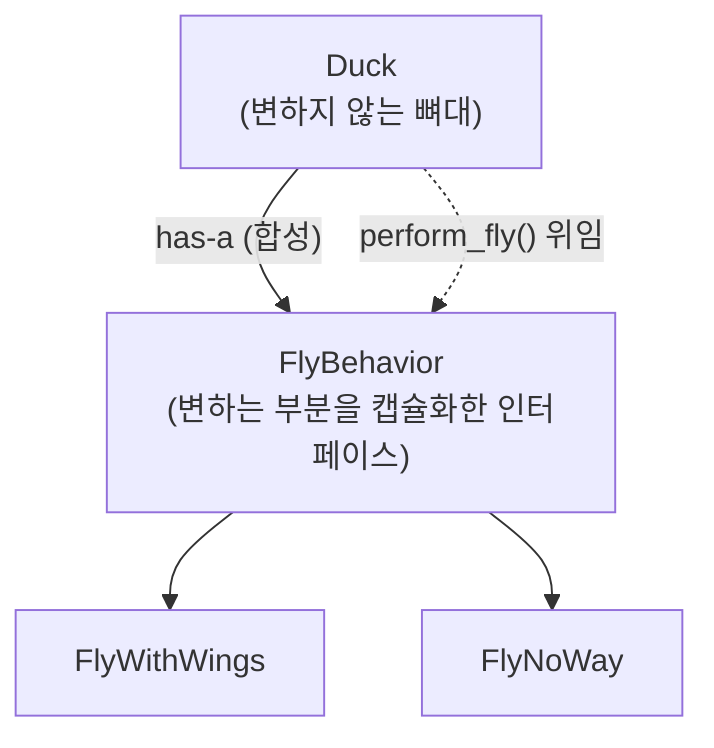
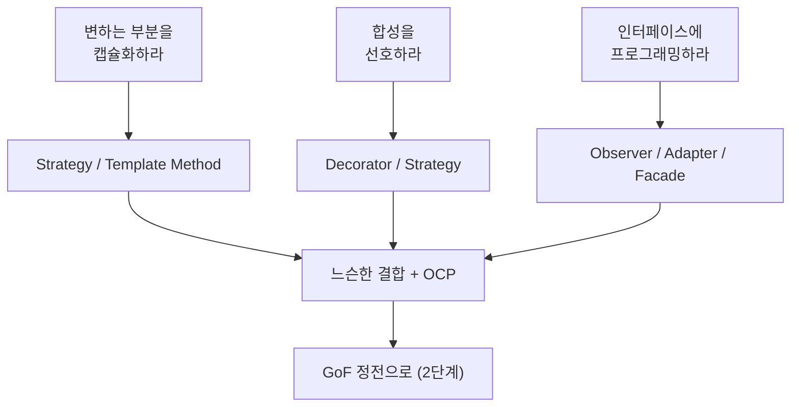

## 들어가며

이 글은 `OO-Design-Essential` 시리즈의 **1단계**입니다. 전체 학습 흐름은 [OO-Design Essential Curriculum](/2026/06/19/oo-design-essential-curriculum.html)에서 볼 수 있습니다.

본격적으로 GoF의 23개 패턴을 외우기 전에, 우리는 먼저 **패턴을 보는 눈**을 길러야 합니다. 패턴은 암기 대상이 아니라 "반복되는 설계 문제에 대한 검증된 해법"이며, 그 해법들 뒤에는 몇 안 되는 **설계 원칙(design principles)** 이 흐르고 있습니다. 이 원칙을 먼저 손에 쥐면, 나중에 마주칠 어떤 패턴도 "아, 이건 변하는 부분을 캡슐화하려는 시도구나"처럼 직관적으로 읽힙니다.

이 직관을 가장 친절하게 길러주는 책이 Eric Freeman & Elisabeth Robson의 *Head First Design Patterns* 입니다. 이 책은 패턴의 카탈로그를 나열하는 대신, 오리(Duck) 시뮬레이션 게임 같은 구체적인 예제로 "왜 이 설계가 망가지는가 → 어떤 원칙으로 고치는가 → 그 결과 어떤 패턴이 태어나는가"를 따라가게 합니다. **principle-first**, 원칙이 먼저인 접근입니다.

그래서 1단계의 목표는 명확합니다. 패턴 이름을 외우는 것이 아니라, 모든 패턴을 관통하는 설계 원칙을 체화하는 것. 이 토대가 잡히면 2단계 [GoF Design Patterns: 23개 패턴의 정전](/2026/06/19/gof-design-patterns.html)에서 정전(canon)을 만날 때 훨씬 수월하게 흡수할 수 있습니다.

<div class="post-summary-box" markdown="1">

### 📌 이 글에서 다루는 내용

#### 🔍 핵심 주제

- **OO 설계 원칙**: 변하는 부분 캡슐화, 합성 선호(Favor Composition), 인터페이스에 프로그래밍
- **생성·구조 패턴 입문**: Strategy, Observer, Decorator의 직관과 동기
- **팩토리 계열**: Simple Factory, Factory Method, Abstract Factory의 차이
- **행동 패턴 입문**: Command, Adapter, Facade, Template Method
- **설계 원칙 종합**: 느슨한 결합(Loose Coupling)과 OCP를 패턴으로 연결하기

</div>

## OO 설계 원칙: 모든 패턴의 뿌리

패턴을 공부하기 전에 반드시 손에 쥐어야 할 세 가지 원칙이 있습니다. 책의 거의 모든 챕터가 이 원칙들의 변주입니다.

### 변하는 부분을 캡슐화하라 (Encapsulate what varies)

**왜 중요한가?** 소프트웨어에서 유일하게 확실한 것은 "변한다"는 사실입니다. 요구사항은 바뀌고, 새 기능이 추가됩니다. 만약 변하는 부분과 변하지 않는 부분이 한 덩어리로 섞여 있으면, 작은 변경 하나가 코드 전체로 번집니다.

**개념.** 코드에서 자주 바뀌는 부분을 식별해, 바뀌지 않는 부분과 **분리**합니다. 변하는 부분은 별도의 클래스/인터페이스로 뽑아내 캡슐화합니다. 그러면 변경의 영향이 그 캡슐 안에 갇힙니다.

### 합성을 선호하라 (Favor Composition over Inheritance)

**왜 중요한가?** 상속은 "is-a" 관계를 표현하지만, 행동을 슈퍼클래스에 박아두면 서브클래스가 그 행동을 강제로 물려받습니다. 행동을 바꾸려면 컴파일 타임에 클래스 계층을 다시 설계해야 하죠. 경직됩니다.

**개념.** 상속(extends) 대신 **합성(has-a)** 으로 행동을 객체에 "주입"합니다. 행동을 멤버 객체로 들고 있으면, 런타임에 그 객체를 바꿔 끼워 행동을 동적으로 교체할 수 있습니다. 이것이 Strategy 패턴의 핵심 아이디어입니다.

### 인터페이스에 프로그래밍하라 (Program to an interface, not an implementation)

**왜 중요한가?** 구체 클래스에 직접 의존하면, 그 클래스가 바뀔 때마다 의존하는 모든 코드가 흔들립니다.

**개념.** 변수를 구체 타입이 아니라 **상위 타입(인터페이스/추상 클래스)** 으로 선언합니다. 호출하는 쪽은 "무엇을 할 수 있는지(인터페이스)"만 알고, "어떻게 하는지(구현)"는 모릅니다. 덕분에 구현을 자유롭게 교체할 수 있습니다.

```python
# 나쁜 예: 구체 구현에 직접 의존
class MallardDuck:
    def fly(self):
        print("날개로 난다")  # 행동이 클래스에 박혀 있음

# 좋은 예: 인터페이스에 프로그래밍 + 합성으로 주입
from abc import ABC, abstractmethod

class FlyBehavior(ABC):           # 변하는 부분을 인터페이스로 캡슐화
    @abstractmethod
    def fly(self): ...

class FlyWithWings(FlyBehavior):
    def fly(self): print("날개로 난다")

class FlyNoWay(FlyBehavior):
    def fly(self): print("날지 못한다")
```

## Strategy: 변하는 행동을 갈아 끼우는 패턴

**동기.** *Head First*의 간판 예제인 오리 시뮬레이션을 봅시다. 처음엔 `Duck` 슈퍼클래스에 `fly()`를 넣고 상속시켰더니, 날지 못하는 고무 오리(RubberDuck)까지 날아버리는 참사가 생깁니다. 상속으로 행동을 강제한 결과입니다.

**해법.** 위 세 원칙을 그대로 적용합니다. "나는 행동"과 "우는 행동"처럼 **변하는 부분**을 인터페이스로 캡슐화하고, `Duck`은 그 행동 객체를 **합성**으로 들고 있으면서 **인터페이스에 프로그래밍**합니다.

```python
class Duck:
    def __init__(self, fly_behavior: FlyBehavior):
        self.fly_behavior = fly_behavior      # 합성으로 행동 주입

    def perform_fly(self):
        self.fly_behavior.fly()               # 위임(delegate)

    def set_fly_behavior(self, behavior: FlyBehavior):
        self.fly_behavior = behavior          # 런타임에 행동 교체

# 사용
model_duck = Duck(FlyNoWay())                 # 처음엔 못 난다
model_duck.perform_fly()                       # "날지 못한다"
model_duck.set_fly_behavior(FlyWithWings())   # 로켓 장착!
model_duck.perform_fly()                       # "날개로 난다"
```

**정의.** Strategy 패턴은 알고리즘군(family of algorithms)을 정의하고 각각을 캡슐화하여 교체 가능하게 만듭니다. 알고리즘을 사용하는 클라이언트와 독립적으로 알고리즘을 변경할 수 있습니다.



이 한 장의 그림에 세 원칙이 모두 들어 있습니다. **변하는 부분을 인터페이스로 캡슐화**하고, **합성**으로 주입하며, `Duck`은 **인터페이스에 프로그래밍**합니다.

## Observer: 상태 변화를 느슨하게 알리는 패턴

**동기.** 기상 데이터가 바뀔 때마다 여러 디스플레이(현재 상태, 통계, 예보)를 갱신해야 한다고 합시다. 주체(Subject)가 각 디스플레이를 직접 호출하면, 새 디스플레이를 추가할 때마다 주체 코드를 고쳐야 합니다.

**해법.** 주체는 자신을 구독한 **관찰자(Observer)** 목록만 들고 있고, 상태가 바뀌면 인터페이스를 통해 일괄 통지합니다. 주체는 관찰자의 구체 타입을 모릅니다 — 오직 `Observer` 인터페이스만 압니다.

```python
class Observer(ABC):
    @abstractmethod
    def update(self, temp): ...

class WeatherData:                       # Subject
    def __init__(self):
        self._observers = []             # 관찰자 목록 (느슨한 결합)

    def register(self, o: Observer):
        self._observers.append(o)

    def set_temperature(self, temp):
        for o in self._observers:        # 인터페이스로만 통지
            o.update(temp)

class CurrentDisplay(Observer):
    def update(self, temp):
        print(f"현재 온도: {temp}도")
```

**원리.** Observer는 **느슨한 결합**의 교과서적 예입니다. 주체와 관찰자는 인터페이스로만 상호작용하므로, 한쪽을 바꿔도 다른 쪽이 흔들리지 않습니다. 관찰자를 추가/제거하는 데 주체 코드를 건드릴 필요가 없습니다 — 곧 보게 될 OCP의 실현입니다.

## Decorator: 상속 없이 책임을 덧입히는 패턴

**동기.** 커피(Beverage)에 우유, 시럽, 휘핑을 조합해 가격을 매겨야 합니다. 모든 조합을 서브클래스로 만들면 클래스가 폭발합니다(클래스 explosion).

**해법.** **데코레이터**가 원본 객체를 감싸고(wrap), 같은 인터페이스를 구현하면서 기능을 덧붙입니다. 감싼 객체에 위임한 뒤 자신의 책임을 더합니다. 핵심은 데코레이터 역시 `Beverage`이므로 다시 감쌀 수 있다는 점 — 합성으로 무한히 쌓입니다.

```python
class Beverage(ABC):
    @abstractmethod
    def cost(self): ...

class Espresso(Beverage):
    def cost(self): return 1.99

class CondimentDecorator(Beverage):      # 데코레이터도 Beverage
    def __init__(self, beverage: Beverage):
        self.beverage = beverage         # 감싼 대상을 합성으로 보유

class Mocha(CondimentDecorator):
    def cost(self):
        return self.beverage.cost() + 0.20   # 위임 + 자기 책임 추가

# 에스프레소 + 모카 + 모카 (런타임 조합)
drink = Mocha(Mocha(Espresso()))
print(drink.cost())                      # 2.39
```

**원리.** Decorator는 "클래스는 확장에는 열려 있고 변경에는 닫혀 있어야 한다"는 **OCP(Open-Closed Principle)** 를 정면으로 구현합니다. 기존 `Espresso` 코드를 단 한 줄도 고치지 않고 새 데코레이터를 추가하는 것만으로 기능을 확장합니다.

## 팩토리 계열: 객체 생성을 캡슐화하라

`new`(파이썬에선 생성자 호출)로 구체 클래스를 직접 만드는 순간, 우리는 "구현에 프로그래밍"하게 됩니다. 팩토리 계열은 **생성 자체를 캡슐화**해 이 의존을 끊습니다. 세 변형의 차이를 구분하는 것이 핵심입니다.

### Simple Factory (관용구)

엄밀히는 패턴이 아니라 관용구(idiom)입니다. 어떤 객체를 만들지 결정하는 `if/elif`를 한 곳(팩토리)에 모읍니다. 생성 분기가 흩어지지 않게 한곳에 캡슐화합니다.

```python
class PizzaFactory:
    def create(self, kind):              # 생성 분기를 한곳에 캡슐화
        if kind == "cheese":
            return CheesePizza()
        elif kind == "veggie":
            return VeggiePizza()
```

### Factory Method (패턴)

객체 생성을 **서브클래스로 위임**합니다. 슈퍼클래스는 "생성 메서드를 호출한다"는 골격만 정의하고, **어떤 구체 객체를 만들지는 서브클래스가 결정**합니다. "객체 생성을 서브클래스에게 미루는 메서드"라고 기억하면 됩니다.

```python
class PizzaStore(ABC):
    def order(self):
        pizza = self.create_pizza()      # 어떤 피자인지는 서브클래스가 결정
        pizza.bake()
        return pizza

    @abstractmethod
    def create_pizza(self): ...          # 팩토리 메서드

class NYPizzaStore(PizzaStore):
    def create_pizza(self): return CheesePizza()   # 서브클래스가 구체 결정
```

### Abstract Factory (패턴)

**관련된 객체군(family)** 을 통째로 생성하는 인터페이스를 제공합니다. Factory Method가 "하나의 제품"을 만든다면, Abstract Factory는 "서로 어울리는 여러 제품의 묶음"(예: 뉴욕식 도우 + 뉴욕식 소스 + 뉴욕식 치즈)을 일관되게 만듭니다. 차이의 핵심은 **상속(Factory Method) vs 합성(Abstract Factory)** 입니다. Factory Method는 서브클래싱으로 생성을 결정하고, Abstract Factory는 팩토리 객체를 합성으로 주입받습니다.

## 행동·구조 패턴 입문: Command, Adapter, Facade, Template Method

### Command — 요청을 객체로 캡슐화

**동기.** 리모컨 버튼이 "무엇을 할지"를 직접 알면, 버튼과 기기가 강하게 결합됩니다. **Command**는 "요청(동작)" 자체를 객체로 캡슐화합니다. 호출자(Invoker)는 명령 객체의 `execute()`만 호출하고, 그 명령이 실제로 무슨 일을 하는지는 모릅니다. 실행 취소(undo), 큐잉, 로깅이 자연스럽게 따라옵니다.

```python
class Command(ABC):
    @abstractmethod
    def execute(self): ...

class LightOnCommand(Command):
    def __init__(self, light): self.light = light
    def execute(self): self.light.on()   # 요청을 객체로 캡슐화

class RemoteControl:
    def press(self, command: Command):    # 무슨 명령인지 모른 채 실행
        command.execute()
```

### Adapter — 인터페이스를 변환

이미 있는 클래스의 인터페이스가 우리가 기대하는 것과 다를 때, **Adapter**가 둘 사이를 변환하는 어댑터(전기 콘센트 어댑터처럼)가 됩니다. 클라이언트가 기대하는 인터페이스로 감싸서, 호환되지 않는 클래스를 끼워 맞춥니다. 합성으로 대상을 감싸고 메서드 호출을 변환·위임합니다.

### Facade — 복잡한 서브시스템을 단순화

여러 클래스가 얽힌 복잡한 서브시스템(홈시어터: 프로젝터·앰프·DVD·조명) 앞에 **하나의 단순한 창구**를 놓습니다. `watch_movie()` 한 번이면 내부에서 여러 호출을 대신 조율합니다. 클라이언트를 서브시스템의 복잡함과 분리해 **느슨한 결합**을 만듭니다. (어댑터가 인터페이스를 "변환"한다면, 퍼사드는 인터페이스를 "단순화"한다는 점이 다릅니다.)

### Template Method — 알고리즘 골격을 고정

알고리즘의 뼈대를 슈퍼클래스에 정의하고, 일부 단계만 서브클래스가 채우도록 비워 둡니다. 커피와 차를 우리는 절차는 같고("물 끓이기 → 우리기 → 따르기 → 첨가물"), 중간의 "우리기"와 "첨가물"만 다릅니다.

```python
class CaffeineBeverage(ABC):
    def prepare(self):                   # 변하지 않는 골격(템플릿)
        self.boil_water()
        self.brew()                      # 변하는 단계는 서브클래스에 위임
        self.pour()

    @abstractmethod
    def brew(self): ...
    def boil_water(self): print("물을 끓인다")
    def pour(self): print("컵에 따른다")

class Tea(CaffeineBeverage):
    def brew(self): print("찻잎을 우린다")
```

여기서도 원칙은 동일합니다 — **변하는 단계만 캡슐화**해 서브클래스에 위임하고, 변하지 않는 흐름은 슈퍼클래스가 통제합니다(헐리우드 원칙: "먼저 연락하지 마세요, 우리가 연락하겠습니다").

## 설계 원칙 종합: 느슨한 결합과 OCP로 패턴을 꿰기

지금까지 본 패턴들이 제각각으로 보였다면, 두 개의 상위 원칙으로 다시 묶어 봅시다.

**느슨한 결합(Loose Coupling).** 서로 상호작용하는 객체들이 서로를 최소한으로만 알도록 설계합니다. Observer(주체↔관찰자), Command(호출자↔명령), Facade(클라이언트↔서브시스템)는 모두 인터페이스를 사이에 두어 결합을 느슨하게 만든 사례입니다. 결합이 느슨하면 한 부분의 변경이 다른 부분으로 번지지 않습니다.

**OCP(Open-Closed Principle).** "확장에는 열려 있고, 변경에는 닫혀 있어야 한다." 기존 코드를 고치지 않고 새 행동을 추가할 수 있어야 한다는 뜻입니다. Decorator(새 데코레이터 추가), Strategy(새 전략 추가), Observer(새 관찰자 추가)는 모두 OCP를 실현합니다.



이렇게 보면 패턴은 "외울 카탈로그"가 아니라 **원칙을 상황에 맞게 적용한 결과물**임이 분명해집니다. 새로운 패턴을 만나도 "이건 무엇을 캡슐화하려는가? 무엇을 느슨하게 묶는가? OCP를 어떻게 지키는가?"를 물으면 그 동기를 스스로 추론할 수 있습니다.

## 마무리

1단계의 핵심은 패턴 이름이 아니라 그 뒤의 **원칙**이었습니다. 세 가지 토대 원칙(변하는 부분 캡슐화 · 합성 선호 · 인터페이스에 프로그래밍)에서 출발해, Strategy로 행동을 갈아 끼우고, Observer로 변화를 느슨하게 알리고, Decorator로 상속 없이 책임을 덧입혔습니다. 팩토리 계열(Simple Factory · Factory Method · Abstract Factory)로 생성을 캡슐화하는 세 단계를 구분했고, Command · Adapter · Facade · Template Method로 행동·구조 패턴의 직관을 넓혔습니다. 마지막으로 모든 것을 **느슨한 결합**과 **OCP**라는 두 상위 원칙으로 꿰었습니다.

이제 패턴을 보는 직관이 생겼습니다. 다음 단계에서는 이 직관을 가지고 GoF의 23개 패턴이라는 **정전(canon)** 으로 들어가, 생성·구조·행동 세 분류 안에서 각 패턴의 정확한 의도와 협력 구조를 체계적으로 정리합니다.

### 다음 학습

- [OO-Design Essential Curriculum](/2026/06/19/oo-design-essential-curriculum.html) — 전체 시리즈 로드맵과 진행 현황
- [GoF Design Patterns: 23개 패턴의 정전](/2026/06/19/gof-design-patterns.html) — 2단계: GoF의 23개 패턴을 생성·구조·행동으로 정전화하기
