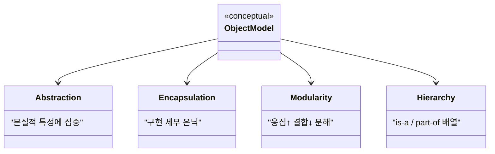
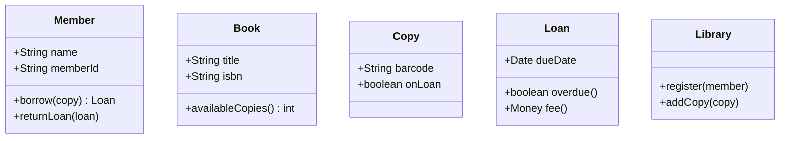
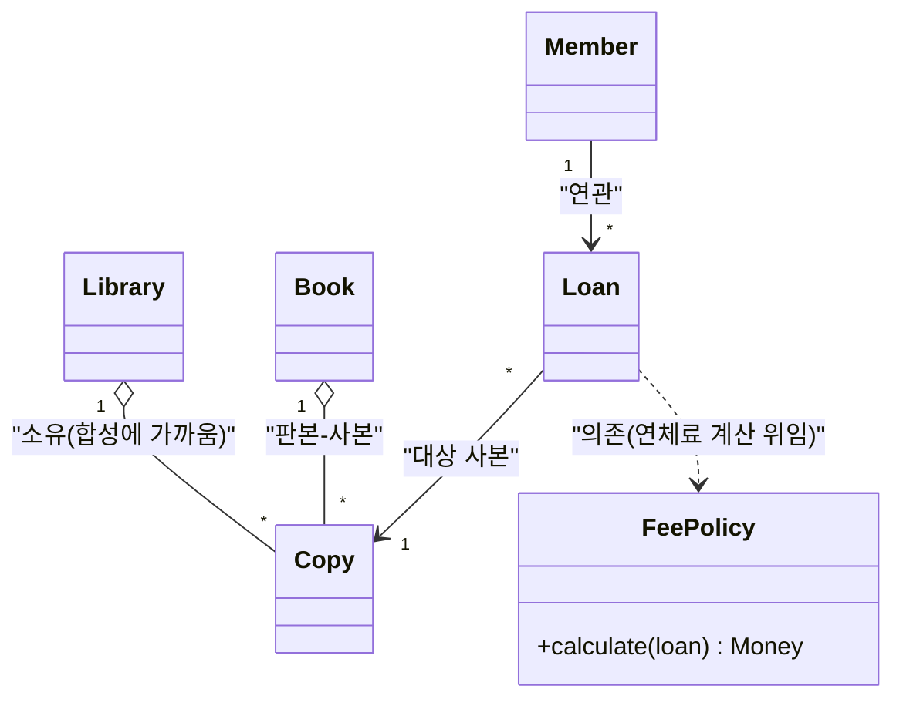
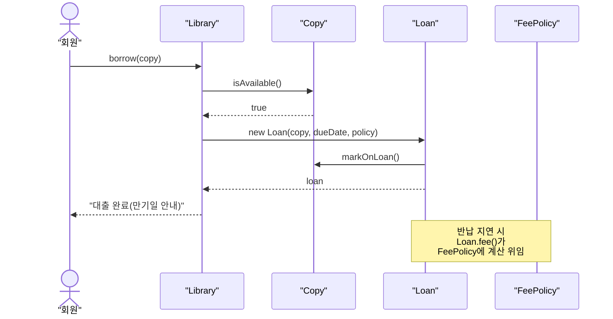
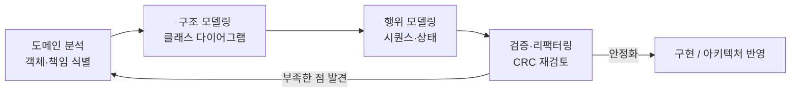
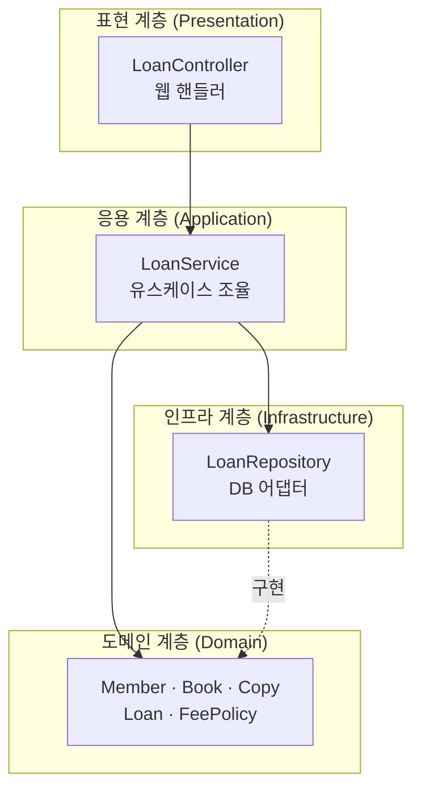

## 들어가며

이 글은 `OO-Design-Essential` 시리즈의 **5단계**입니다. 전체 학습 지도는 [OO-Design Essential Curriculum](/2026/06/19/oo-design-essential-curriculum.html)에서 확인할 수 있습니다.

4단계 [OO Software Construction: 계약에 의한 설계](/2026/06/19/object-oriented-software-construction.html)에서는 **하나의 클래스**를 어떻게 단단하게 만드는지를 다뤘습니다. 사전조건·사후조건·불변식으로 클래스의 책임 경계를 명확히 하고, 호출자와 구현자 사이의 "계약"을 설계의 단위로 삼았죠. 그런데 실제 소프트웨어는 잘 만들어진 클래스 하나로 끝나지 않습니다. 수십, 수백 개의 객체가 서로 협력하며 하나의 시스템을 이룹니다. 그 **전체를 어떻게 객체로 모델링할 것인가**가 이번 단계의 주제입니다.

이 단계의 길잡이는 Grady Booch, Robert A. Maksimchuk 등이 쓴 *Object-Oriented Analysis and Design with Applications, 3rd ed.* (보통 OOAD라고 부릅니다)입니다. 이 책은 객체지향이 단순한 문법 기능이 아니라 **복잡성을 다루는 방법론**임을 강조합니다. 큰 시스템을 의미 있는 객체들의 집합으로 분해하고, 그 객체들이 협력하는 구조를 UML로 그려가며 반복적으로 다듬는 과정 — 그것이 OOAD입니다.

이번 글에서 모델링한 객체들은 결국 누군가가 조립하고 연결해야 동작합니다. "이 객체가 저 객체에 의존한다"는 관계를 실제 코드에서 어떻게 깔끔하게 연결할지는 6단계 [Dependency Injection: 결합도를 다스리는 기술](/2026/06/19/dependency-injection.html)에서 이어집니다. 즉, 5단계가 **무엇을 만들지(모델)**라면, 6단계는 그것을 **애플리케이션 규모로 어떻게 조립할지(결합)**를 다룹니다.

<div class="post-summary-box" markdown="1">

### 📌 이 글에서 다루는 내용

#### 🔍 핵심 주제

- **객체 모델의 4요소**: 추상화·캡슐화·모듈성·계층구조라는 OO 모델링의 토대를 이해한다.
- **객체·클래스 식별**: 도메인 분석에서 명사·동사를 단서로 객체와 책임을 도출한다.
- **관계와 협력**: 연관·집합/합성·의존 관계와 책임 주도 설계(RDD), CRC 카드를 다룬다.
- **표기법과 프로세스**: UML로 구조와 행위를 모델링하고 반복적으로 설계를 다듬는다.
- **아키텍처적 시야**: 시스템 수준에서 모듈을 배치하고 패턴으로 큰 그림을 본다.

</div>

## 객체 모델의 4요소: 추상화·캡슐화·모듈성·계층구조

Booch는 객체지향 모델을 떠받치는 **네 가지 주요소(major elements)**를 제시합니다. 이 넷 중 하나라도 빠지면 "객체지향이라 부르기 어렵다"고 말할 만큼 근본적인 개념들입니다.

- **추상화(Abstraction)**: 객체가 다른 모든 객체와 구별되는 **본질적 특성**에 집중하고, 보는 사람의 관점에서 의미 있는 경계를 긋는 것. 도서관 도메인에서 `Book`은 "제목·저자·ISBN·대출 가능 여부"가 본질이지, 종이의 평량이나 인쇄 잉크는 아닙니다.
- **캡슐화(Encapsulation)**: 추상화가 약속한 행위를 구현하는 **세부사항을 숨기는 것**. 추상화가 "무엇(what)"이라면 캡슐화는 "어떻게(how)"를 격리합니다. 4단계의 계약(인터페이스)과 구현 분리가 바로 이 원리의 실천입니다.
- **모듈성(Modularity)**: 시스템을 **응집도 높고 결합도 낮은 모듈**들로 분해하는 것. 강하게 관련된 추상화는 한 모듈에 모으고, 모듈 사이의 의존은 최소화합니다.
- **계층구조(Hierarchy)**: 추상화들을 **순위나 순서로 배열**하는 것. 대표적으로 "is-a" 계층(상속)과 "part-of" 계층(집합/합성)이 있습니다.

이 넷에 더해 Booch는 **부요소(minor elements)**로 타이핑(typing), 동시성(concurrency), 영속성(persistence)을 듭니다. 부요소는 유용하지만 없어도 모델은 성립합니다. 우리가 집중할 것은 위 네 가지 주요소입니다.



## 객체·클래스 식별: 도메인 분석에서 객체와 책임 도출

좋은 모델은 도메인에서 출발합니다. Booch가 권하는 고전적 기법은 **도메인 서술(요구사항 문장)에서 명사와 동사를 뽑아내는 것**입니다. 명사는 후보 객체/속성이 되고, 동사는 후보 책임(연산)이 됩니다.

예시 도메인: **도서관 대출 시스템**.

> "회원(Member)은 도서관(Library)에 있는 책(Book)을 대출(Loan)할 수 있다. 한 권의 책에는 여러 사본(Copy)이 있고, 대출은 하나의 사본을 특정 회원에게 정해진 기간 동안 빌려준다. 연체되면 연체료를 부과한다."

여기서 명사를 추리면 `Member`, `Library`, `Book`, `Copy`, `Loan`이 후보 객체로 떠오르고, "대출한다", "연체료를 부과한다" 같은 동사가 책임으로 보입니다. 단, 명사를 무비판적으로 클래스로 승격하면 안 됩니다. 어떤 명사는 다른 객체의 **속성**일 뿐이고(예: "기간"은 `Loan`의 속성), 어떤 명사는 도메인 밖이라 모델에 넣지 않습니다.

식별의 핵심 질문은 다음과 같습니다.

- 이 후보는 **독립적인 정체성과 상태**를 갖는가? (그렇다면 객체)
- 이 후보는 다른 객체의 **세부 속성**에 불과한가? (그렇다면 속성으로 흡수)
- 이 후보가 **수행해야 할 책임**은 무엇인가? (연산으로 도출)

이렇게 추려낸 첫 클래스 모델은 다음과 같습니다. 식별 단계에서는 완벽함보다 **대화 가능한 초안**을 빠르게 만드는 것이 목적입니다.



## 관계와 협력: 연관·집합·의존, 책임 주도 설계(RDD)

객체를 식별했으면 그 다음은 **객체들이 어떻게 연결되고 협력하는가**입니다. UML 클래스 다이어그램에서 자주 쓰는 관계는 크게 세 가지입니다.

- **연관(Association)**: 두 객체가 서로를 알고 메시지를 주고받는 일반적 관계. 다중성(multiplicity)으로 "하나의 책에는 여러 사본"처럼 개수를 표현합니다.
- **집합/합성(Aggregation / Composition)**: "part-of" 관계. 집합은 부분이 전체와 독립적으로 존재할 수 있는 느슨한 소유, 합성은 전체가 사라지면 부분도 사라지는 강한 소유입니다. `Library`와 `Copy`는 합성에 가깝고, `Member`와 `Loan`은 연관입니다.
- **의존(Dependency)**: 한 객체가 다른 객체를 **일시적으로 사용**하는 약한 관계(예: 메서드 인자로만 잠깐 쓰는 경우). 점선 화살표로 표기하며, 결합도를 낮게 유지하고 싶을 때 의존으로 머무르게 하는 것이 좋습니다.



여기서 한 걸음 더 나아가면 **책임 주도 설계(Responsibility-Driven Design, RDD)**를 만납니다. RDD는 "이 객체는 어떤 **책임**을 지며, 그 책임을 다하기 위해 누구와 **협력**하는가?"를 설계의 중심에 둡니다. 데이터를 어디에 둘지가 아니라 **행위를 누가 책임질지**를 먼저 묻는 것이죠.

RDD의 실무 도구가 **CRC 카드**입니다. 카드 한 장에 다음 세 가지를 적습니다.

- **Class**: 클래스 이름
- **Responsibilities**: 이 클래스가 아는 것(knowing)과 하는 것(doing)
- **Collaborators**: 책임을 다하려 협력하는 다른 클래스

예를 들어 `Loan` 카드는 이렇게 채워집니다.

| Class | Responsibilities | Collaborators |
| --- | --- | --- |
| `Loan` | 만기일 보유, 연체 여부 판단, 연체료 계산 위임 | `Copy`, `FeePolicy` |

"연체료를 어떻게 계산하지?"라는 책임이 `Loan` 안에서 비대해지면, 그 책임을 `FeePolicy`라는 협력자에게 **위임**합니다. 이렇게 책임을 적절히 나누면 자연스럽게 단일 책임 원칙으로 수렴합니다. 코드로는 다음과 같은 위임 스케치가 됩니다.

```python
class Loan:
    def __init__(self, copy, due_date, fee_policy):
        self._copy = copy
        self._due_date = due_date
        self._fee_policy = fee_policy  # 협력자에게 책임을 위임

    def overdue(self, today):
        return today > self._due_date

    def fee(self, today):
        # 연체료 계산은 FeePolicy의 책임
        return self._fee_policy.calculate(self, today)
```

`Loan`은 "연체 여부"라는 본질만 알고, 정책적으로 변하기 쉬운 "요금 계산"은 `FeePolicy`에 맡깁니다. 책임을 객체에 잘 배분하면 변경의 충격이 한 곳에 고립됩니다.

## 표기법과 프로세스: UML로 구조·행위 모델링, 반복적 설계

모델을 **공유 가능한 언어**로 그리려면 표기법이 필요합니다. Booch가 합류해 표준화에 기여한 **UML(Unified Modeling Language)**이 그 공용어입니다. UML 다이어그램은 크게 두 갈래입니다.

- **구조(structural) 다이어그램**: 시스템의 정적 골격. 대표적으로 클래스 다이어그램, 컴포넌트 다이어그램, 배치(deployment) 다이어그램.
- **행위(behavioral) 다이어그램**: 시간에 따른 상호작용. 시퀀스 다이어그램, 상태 머신, 활동(activity) 다이어그램.

구조만으로는 "이 객체들이 실제로 어떻게 협력해 하나의 시나리오를 완성하는가"를 알 수 없습니다. 그래서 **행위 다이어그램**으로 협력을 검증합니다. 아래는 "회원이 사본을 대출한다" 유스케이스의 시퀀스 다이어그램입니다.



이 다이어그램을 그려보면 CRC 카드에서 누락된 협력이나 어색한 책임 배분이 드러납니다. 예컨대 "사본 가용성 확인을 `Library`가 해야 하나, `Copy`가 해야 하나?"라는 질문이 다이어그램 위에서 선명해집니다.

가장 중요한 점은 OOAD가 **한 번에 완성하는 폭포수 과정이 아니라는 것**입니다. Booch는 분석과 설계를 **반복적·점진적(iterative & incremental)** 과정으로 봅니다. 핵심 객체를 식별하고, 관계를 그리고, 시나리오로 검증하고, 모델을 고치는 사이클을 여러 번 돕니다.



## 아키텍처적 시야: 시스템 수준에서 패턴과 모듈 배치

개별 클래스 모델에서 한 단계 줌아웃하면 **아키텍처**가 보입니다. Booch가 강조하는 모듈성은 결국 "어떤 추상화들을 한 패키지/모듈에 모으고, 모듈 간 의존 방향을 어떻게 둘 것인가"라는 시스템 수준의 질문으로 이어집니다.

도서관 시스템을 모듈로 배치하면 다음과 같은 계층이 자연스럽습니다. 의존의 화살표가 **안쪽(도메인)으로 향하도록** 두는 것이 핵심입니다. 정책과 핵심 규칙은 안정적인 도메인 모듈에 두고, 변하기 쉬운 입출력(웹·DB)을 바깥에 둡니다.



여기서 인프라가 도메인을 향해 점선("구현")으로 의존하는 모습에 주목하세요. 도메인이 `LoanRepository` **인터페이스**를 선언하고, 인프라가 그 인터페이스를 **구현**합니다. 의존성 방향이 뒤집힌 이 구조가 바로 의존성 역전이며, 이를 실현하는 메커니즘이 다음 단계의 주제인 DI입니다.

아키텍처 수준에서는 또한 **설계 패턴**이 큰 그림의 어휘가 됩니다. `FeePolicy`를 교체 가능하게 둔 것은 Strategy 패턴이고, `LoanService`가 여러 도메인 객체를 조율하는 것은 일종의 Facade적 역할입니다. 패턴은 "검증된 협력 구조의 이름표"라서, 모델을 설명하고 공유할 때 강력한 공용어가 됩니다.

## 마무리

이번 단계에서는 시선을 **하나의 클래스에서 시스템 전체로** 넓혔습니다.

- 객체 모델의 토대인 **4요소**(추상화·캡슐화·모듈성·계층구조)를 정리했습니다.
- 도메인 서술에서 **명사·동사**를 단서로 객체와 책임을 식별했습니다.
- **연관·집합/합성·의존** 관계와 **책임 주도 설계(RDD)·CRC 카드**로 협력 구조를 설계했습니다.
- **UML** 구조·행위 다이어그램과 **반복적 프로세스**로 모델을 그리고 검증했습니다.
- 모듈 배치와 패턴으로 **아키텍처적 시야**를 확보했습니다.

여기까지 우리는 시스템을 "협력하는 객체들의 그물"로 모델링했습니다. 그런데 모델 속의 `Loan`은 `FeePolicy`를, `LoanService`는 `LoanRepository`를 필요로 합니다. 이 **의존 관계들을 누가, 어떻게 연결해 객체를 조립할 것인가** — 이것이 애플리케이션 규모에서 결합도를 다스리는 핵심 문제입니다. 다음 6단계에서는 **의존성 주입(DI)과 제어의 역전(IoC)**으로 이번에 모델링한 객체들을 느슨하게 조립하는 기술을 다룹니다.

### 다음 학습

- 전체 지도: [OO-Design Essential Curriculum](/2026/06/19/oo-design-essential-curriculum.html)
- 이전 단계 다시 보기(4단계): [OO Software Construction: 계약에 의한 설계](/2026/06/19/object-oriented-software-construction.html)
- 다음 단계(6단계): [Dependency Injection: 결합도를 다스리는 기술](/2026/06/19/dependency-injection.html)
