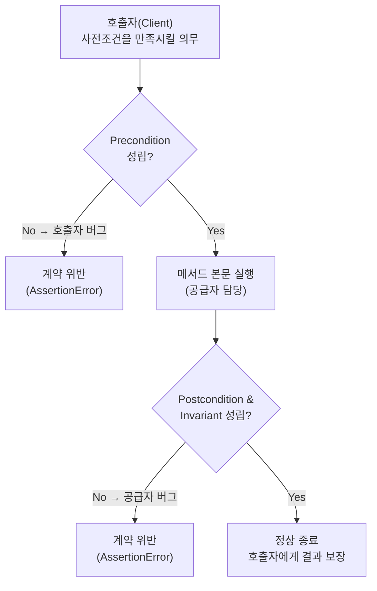

## 들어가며

이 글은 `OO-Design-Essential` 시리즈의 **4단계**입니다. 전체 학습 지도는 [OO-Design Essential Curriculum](/2026/06/19/oo-design-essential-curriculum.html)에서 확인할 수 있습니다.

3단계 [Design Patterns with Swift: 현대 언어로 재해석](/2026/06/19/design-patterns-swift.html)에서는 패턴을 **어떻게(HOW)** 구현하는지를 현대 언어 문법으로 살펴봤습니다. 패턴은 "이미 검증된 해법의 카탈로그"입니다. 하지만 카탈로그만으로는 답할 수 없는 질문이 남습니다. *왜* 이 인터페이스는 이렇게 생겨야 하는가? 한 클래스가 "올바르다"는 것은 무엇으로 보장되는가? 상속을 언제 써도 안전한가?

Bertrand Meyer의 *Object-Oriented Software Construction*(이하 OOSC)은 이 질문들에 답하기 위해 **패턴에서 원리(PRINCIPLES)로** 시선을 옮깁니다. 패턴이 "무엇을 만들까"라면, OOSC는 "무엇이 좋은 모듈인가"를 정의합니다. 그 중심에 **계약에 의한 설계(Design by Contract, DbC)** 가 있습니다. DbC는 클래스의 메서드를 단순한 코드 덩어리가 아니라, 호출자와 공급자 사이의 **법적 계약**으로 바라보게 만듭니다.

이 글에서 단일 클래스 수준의 신뢰성 원리를 정리하고 나면, 5단계 [OOAD with Applications: 시스템을 객체로 모델링](/2026/06/19/object-oriented-analysis-and-design.html)에서 Grady Booch와 함께 **여러 객체로 이루어진 시스템 전체**를 모델링하는 단계로 넘어갑니다. 즉 이번 단계는 "하나의 클래스를 어떻게 신뢰할 수 있게 만드는가"이고, 다음 단계는 "그런 클래스들을 어떻게 한 시스템으로 엮는가"입니다.

<div class="post-summary-box" markdown="1">

### 📌 이 글에서 다루는 내용

#### 🔍 핵심 주제

- **OO 원리**: 모듈성·정보 은닉·재사용성·확장성을 판단하는 기준
- **계약에 의한 설계(DbC)**: Precondition, Postcondition, Class Invariant의 정의와 역할
- **상속과 다형성**: LSP와 올바른 상속, 추상 클래스의 책임
- **예외와 신뢰성**: 계약 위반으로서의 예외, 방어적 프로그래밍과의 차이

</div>

## OO 원리: 좋은 모듈을 판단하는 기준

Meyer는 객체지향을 "클래스 문법을 쓰는 것"이 아니라 **모듈을 잘 나누고 잘 닫는 기술**로 정의합니다. 그가 제시하는 모듈성의 기준은 여러 가지지만, 실무에서 가장 중요한 네 가지는 다음과 같습니다.

- **모듈성(Modularity)**: 시스템이 자족적인(self-contained) 단위로 분해되는가? 모듈 간 연결은 적고(낮은 결합도), 모듈 안의 응집은 높아야 합니다. Meyer의 표현으로는 "few interfaces, small interfaces, explicit interfaces" — 연결은 적게, 인터페이스는 작게, 그리고 명시적으로.
- **정보 은닉(Information Hiding)**: 클라이언트가 알아야 할 것(공개 명세)과 몰라도 되는 것(구현)을 분리합니다. 공개되는 것은 "무엇을 하는가"이지 "어떻게 하는가"가 아닙니다. 계약은 바로 이 "무엇을"을 형식화한 것입니다.
- **재사용성(Reusability)**: 한 번 잘 만든 클래스를 여러 맥락에서 다시 쓸 수 있는가? 재사용은 계약이 명확할 때만 가능합니다. 명세 없이 코드만 가져다 쓰면 매번 내부를 다시 읽어야 하기 때문입니다.
- **확장성(Extensibility)**: 요구가 바뀔 때 기존 코드를 깨지 않고 확장할 수 있는가? Meyer의 **개방-폐쇄 원칙(Open-Closed Principle)** — 확장에는 열려 있고 수정에는 닫혀 있다 — 이 여기서 나왔습니다. 상속과 다형성이 확장성의 핵심 도구입니다.

이 기준들의 공통 토대가 "명세를 코드와 함께 둔다"는 발상이고, 그 구체적 장치가 DbC입니다.

## 계약에 의한 설계(DbC): 핵심 개념

소프트웨어 모듈을 비즈니스 계약처럼 생각해 봅시다. 계약에는 두 당사자가 있습니다.

- **호출자(Client / 호출하는 쪽)**: 서비스를 요청하는 쪽
- **공급자(Supplier / 메서드를 제공하는 쪽)**: 서비스를 수행하는 쪽

계약은 양쪽의 **권리(rights)** 와 **의무(obligations)** 를 명시합니다. 그리고 한쪽의 의무는 정확히 다른 쪽의 권리가 됩니다.

| 구분 | 의무(Obligation) | 권리(Right) |
| --- | --- | --- |
| **호출자** | Precondition을 만족시킨다 | Postcondition이 보장된다 |
| **공급자** | Postcondition을 달성한다 | Precondition을 가정해도 된다 |

DbC는 이 계약을 세 가지 단언(assertion)으로 형식화합니다.

- **Precondition(사전조건)**: 메서드 호출 *전에* 참이어야 하는 조건. 이를 만족시킬 책임은 **호출자**에게 있습니다.
- **Postcondition(사후조건)**: 메서드가 정상 종료된 *후에* 참이 되는 조건. 이를 보장할 책임은 **공급자**에게 있습니다.
- **Class Invariant(클래스 불변식)**: 객체가 안정 상태(stable state)일 때 항상 참인 조건. 모든 public 메서드는 진입 시 불변식을 가정하고, 종료 시 불변식을 복원합니다.

이 개념은 Eiffel 언어에서 `require`(precondition), `ensure`(postcondition), `invariant`(class invariant) 키워드로 언어 차원에 내장되어 있습니다. Python에는 그런 전용 문법이 없으므로 `assert`나 작은 헬퍼로 같은 의도를 표현합니다.

### Python으로 표현한 계약 헬퍼

```python
def require(condition: bool, message: str) -> None:
    """Precondition(사전조건): 호출자의 의무. 위반 시 호출 측 버그."""
    if not condition:
        raise AssertionError(f"Precondition violated: {message}")


def ensure(condition: bool, message: str) -> None:
    """Postcondition(사후조건): 공급자의 의무. 위반 시 구현 측 버그."""
    if not condition:
        raise AssertionError(f"Postcondition violated: {message}")


def invariant(condition: bool, message: str) -> None:
    """Class Invariant(불변식): 안정 상태에서 항상 참이어야 한다."""
    if not condition:
        raise AssertionError(f"Invariant violated: {message}")
```

세 함수는 거의 같지만, **메시지의 의미가 다릅니다.** Precondition 위반은 "호출자가 약속을 어겼다"는 신호이고, Postcondition·Invariant 위반은 "공급자(나)가 약속을 어겼다"는 신호입니다. 누구의 버그인지가 단언만으로 드러나는 것이 DbC의 큰 가치입니다.

### 예제: 계약을 갖춘 BankAccount

```python
class BankAccount:
    """잔액은 항상 0 이상이어야 한다 — 이것이 클래스 불변식이다."""

    def __init__(self, opening_balance: int = 0) -> None:
        require(opening_balance >= 0, "초기 잔액은 음수가 될 수 없다")
        self._balance = opening_balance
        self._check_invariant()  # 생성 직후에도 불변식은 성립해야 한다

    @property
    def balance(self) -> int:
        return self._balance

    def _check_invariant(self) -> None:
        invariant(self._balance >= 0, "잔액은 음수가 될 수 없다")

    def deposit(self, amount: int) -> None:
        # --- 계약: 사전조건 ---
        require(amount > 0, "입금액은 양수여야 한다")
        self._check_invariant()           # 진입 시 불변식 가정
        old_balance = self._balance

        self._balance += amount           # --- 본문(body) ---

        # --- 계약: 사후조건 ---
        ensure(self._balance == old_balance + amount,
               "잔액은 정확히 입금액만큼 늘어난다")
        self._check_invariant()           # 종료 시 불변식 복원

    def withdraw(self, amount: int) -> None:
        # 사전조건: 호출자는 "충분한 잔액"을 보장할 의무가 있다
        require(amount > 0, "출금액은 양수여야 한다")
        require(amount <= self._balance, "잔액보다 많이 출금할 수 없다")
        self._check_invariant()
        old_balance = self._balance

        self._balance -= amount

        ensure(self._balance == old_balance - amount,
               "잔액은 정확히 출금액만큼 줄어든다")
        self._check_invariant()
```

여기서 주목할 점은 `withdraw`가 잔액 부족을 **방어적으로 처리하지 않는다**는 것입니다. "잔액보다 많이 출금하지 않는다"는 호출자의 의무(precondition)로 못박았습니다. 덕분에 본문은 항상 잔액이 충분하다고 가정하고 단순하게 작성됩니다. 책임의 위치가 명확해진 것입니다.

### 계약 흐름 다이어그램



precondition이 통과하기 전까지는 공급자에게 아무 책임이 없고(입력이 잘못된 건 호출자 탓), precondition이 통과한 뒤에는 postcondition·invariant 달성이 전적으로 공급자 책임입니다. 이 경계선이 디버깅을 극적으로 단순하게 만듭니다.

## 상속과 다형성: LSP와 올바른 상속

다형성은 "같은 호출이 객체 종류에 따라 다르게 동작"하는 능력입니다. 그런데 자식 클래스가 부모의 자리를 대신할 때, 호출자가 믿고 있던 계약이 깨지면 안 됩니다. 이것을 형식화한 것이 **리스코프 치환 원칙(Liskov Substitution Principle, LSP)** 입니다.

> 부모 타입을 기대하는 모든 곳에 자식 타입을 넣어도 프로그램의 정당성이 깨지지 않아야 한다.

DbC의 언어로 옮기면 LSP는 두 개의 명확한 규칙이 됩니다.

- **자식은 사전조건을 강화(strengthen)하지 말 것** — 부모보다 더 까다로운 요구를 하면 안 됩니다. 부모를 믿고 호출하던 코드가 자식 앞에서 갑자기 거부당하기 때문입니다. 사전조건은 **같거나 약하게(weaker)** 만 바꿀 수 있습니다.
- **자식은 사후조건을 약화(weaken)하지 말 것** — 부모가 약속한 결과보다 덜 보장하면 안 됩니다. 호출자는 부모의 사후조건만큼은 항상 받을 자격이 있습니다. 사후조건은 **같거나 강하게(stronger)** 만 바꿀 수 있습니다.

한 문장으로: **"요구는 덜, 보장은 더(require no more, promise no less)."**

```python
class Rectangle:
    def set_size(self, width: int, height: int) -> None:
        require(width > 0 and height > 0, "변은 양수여야 한다")
        self._w, self._h = width, height
        ensure(self.area() == width * height, "넓이는 width*height")

    def area(self) -> int:
        return self._w * self._h


# 잘못된 상속: 사전조건을 강화한다 (width == height 강요)
class BadSquare(Rectangle):
    def set_size(self, width: int, height: int) -> None:
        # 부모는 width != height도 허용했는데, 여기서 막아버린다 → LSP 위반
        require(width == height, "정사각형은 두 변이 같아야 한다")
        super().set_size(width, height)
```

`BadSquare`는 `set_size(3, 5)`를 거부합니다. `Rectangle`을 기대하던 코드 입장에서는 멀쩡한 입력이 갑자기 깨지는 셈이니, 치환 불가능합니다. 정사각형은 직사각형의 *서브타입*이 아니라, 별도의 추상으로 모델링하는 편이 옳습니다.

### 추상 클래스의 역할

추상 클래스(또는 인터페이스)는 **구현 없이 계약만 선언**하는 자리입니다. "이 타입을 따른다면 이런 사전·사후조건을 지켜야 한다"는 약속의 틀을 제공하고, 실제 행동은 서브클래스에 위임합니다.

```python
from abc import ABC, abstractmethod


class Shape(ABC):
    @abstractmethod
    def area(self) -> float:
        """계약: 반환값은 항상 0 이상이다 (모든 도형이 지켜야 할 사후조건)."""
        ...


class Circle(Shape):
    def __init__(self, radius: float) -> None:
        require(radius >= 0, "반지름은 음수가 될 수 없다")
        self._r = radius

    def area(self) -> float:
        result = 3.14159 * self._r ** 2
        ensure(result >= 0, "넓이는 음수가 될 수 없다")  # 공통 계약 준수
        return result
```

추상 클래스는 "다형성의 공통 계약"을 한곳에 모읍니다. 호출자는 `Shape`만 알면 되고, 어떤 구체 도형이 오든 `area() >= 0`을 신뢰할 수 있습니다. 이것이 정보 은닉과 확장성을 동시에 만족시키는 방식입니다.

## 예외와 신뢰성: 계약 위반으로서의 예외

Meyer는 예외를 "계약을 지킬 수 없게 된 상황"으로 정의합니다. 즉 예외는 **누군가 약속을 어겼다**는 신호입니다. 공급자가 사후조건이나 불변식을 달성하지 못하면, 정상적으로 결과를 돌려줄 수 없으므로 예외를 던집니다.

이 관점에서 예외 처리에는 두 가지 정당한 선택지만 있습니다.

- **재시도(Retry)**: 다른 전략으로 계약을 다시 달성하려 시도한다.
- **실패(Failure / Organized Panic)**: 달성을 포기하고, 불변식을 복원한 뒤 호출자에게 예외를 전파한다. 이때도 객체는 안정 상태로 남아야 합니다.

핵심은, 예외를 "흔한 제어 흐름"으로 남용하지 않는다는 것입니다. 예외는 비정상의 신호이지, 평범한 분기 수단이 아닙니다.

### DbC vs 방어적 프로그래밍(Defensive Programming)

방어적 프로그래밍은 "내 입력을 믿지 말고, 모든 경계에서 다시 검사하라"는 전략입니다. 안전해 보이지만, Meyer는 이를 경계합니다. 같은 검사가 호출자와 공급자 양쪽에 중복되어 코드가 비대해지고, **책임의 위치가 흐려지기** 때문입니다. 누가 무엇을 보장하는지 명세가 없으면, 모두가 모든 것을 의심하게 됩니다.

```python
# 방어적 스타일: 누가 책임지는지 불명확, 검증이 본문에 섞여 코드가 비대
def transfer_defensive(src, dst, amount):
    if src is None or dst is None:
        return False                 # 조용한 실패 — 버그를 숨긴다
    if not isinstance(amount, int):
        return False
    if amount <= 0:
        return False
    if amount > src.balance:
        return False
    # ... 실제 로직은 방어 코드에 파묻힌다


# DbC 스타일: 책임을 계약으로 명시, 본문은 핵심 로직만 남는다
def transfer_by_contract(src: BankAccount, dst: BankAccount, amount: int) -> None:
    require(src is not None and dst is not None, "두 계좌 모두 존재해야 한다")
    require(amount > 0, "이체액은 양수여야 한다")
    require(amount <= src.balance, "잔액 내에서만 이체 가능하다")  # 호출자의 의무

    src.withdraw(amount)             # 본문은 순수하게 의도만 표현한다
    dst.deposit(amount)

    ensure(True, "두 계좌의 합은 보존된다(원하면 명시적으로 검증)")
```

두 방식의 차이를 정리하면 다음과 같습니다.

| 관점 | 방어적 프로그래밍 | 계약에 의한 설계(DbC) |
| --- | --- | --- |
| 검증 위치 | 모든 경계에서 중복 검사 | 책임 있는 한쪽이 한 번만 |
| 책임 소재 | 불명확(모두가 의심) | 계약으로 명시 |
| 실패 처리 | 조용히 false/None 반환 가능 | 계약 위반은 즉시 드러남 |
| 코드 가독성 | 방어 코드에 핵심 로직이 파묻힘 | 본문은 의도만 표현 |
| 디버깅 | 버그가 숨겨져 추적 어려움 | 호출자/공급자 버그가 분리됨 |

DbC라고 해서 입력 검증을 *전혀* 안 하는 것은 아닙니다. 신뢰할 수 없는 외부 입력(사용자 입력, 네트워크 데이터)은 시스템 **경계에서** 한 번 검증합니다. 그러나 일단 경계를 통과해 내부 객체들끼리 협력하는 영역에서는, 매번 다시 의심하는 대신 **계약을 믿고** 코드를 단순하게 유지합니다. "경계에서는 방어하고, 내부에서는 계약을 신뢰한다"가 균형점입니다.

## 마무리

Meyer의 OOSC는 패턴이라는 카탈로그에서 한 걸음 더 들어가, "무엇이 좋은 모듈인가"라는 **원리**를 제시합니다. 핵심을 다시 정리하면:

- **OO 원리**: 모듈성·정보 은닉·재사용성·확장성은 "명세를 코드와 함께 둔다"는 한 가지 발상으로 수렴하고, 개방-폐쇄 원칙으로 이어진다.
- **DbC**: 메서드를 호출자와 공급자의 계약으로 보고, Precondition(호출자 의무)·Postcondition(공급자 의무)·Class Invariant(안정 상태의 항상참)로 형식화한다.
- **상속과 LSP**: 올바른 상속은 "사전조건을 강화하지 말고 사후조건을 약화하지 말 것" — 요구는 덜, 보장은 더. 추상 클래스는 공통 계약을 모은다.
- **예외와 신뢰성**: 예외는 계약 위반의 신호이며, 방어적 프로그래밍의 중복·은폐 대신 책임을 명시하는 설계가 신뢰성을 높인다.

지금까지는 **하나의 클래스를 어떻게 신뢰할 수 있게 만드는가**에 집중했습니다. 그러나 실제 소프트웨어는 수많은 객체가 협력하는 시스템입니다. 다음 5단계에서는 Grady Booch와 함께, 단일 클래스의 원리에서 **시스템 수준의 객체지향 분석·설계(OOAD)** 로 시야를 넓혀, 도메인 전체를 객체로 모델링하는 방법을 다룹니다.

### 다음 학습

- [OO-Design Essential Curriculum](/2026/06/19/oo-design-essential-curriculum.html) — 전체 학습 지도와 진행률
- [Design Patterns with Swift: 현대 언어로 재해석](/2026/06/19/design-patterns-swift.html) — 3단계 다시 보기(패턴의 HOW)
- [OOAD with Applications: 시스템을 객체로 모델링](/2026/06/19/object-oriented-analysis-and-design.html) — 5단계로 이어가기(시스템 수준 모델링)
