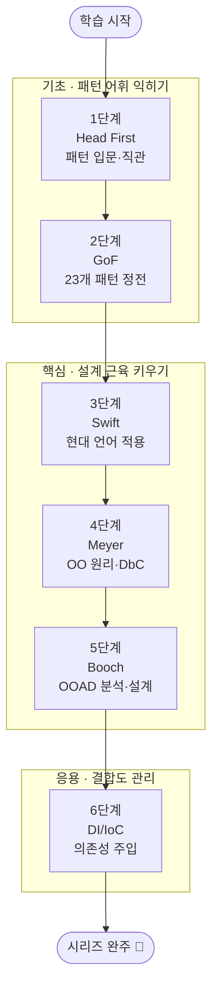

## 소개

좋은 소프트웨어와 그렇지 않은 소프트웨어를 가르는 가장 큰 변수는 문법 지식이 아니라 **설계 감각**입니다. 같은 기능을 구현하더라도 객체 사이의 책임을 어떻게 나누고, 변경에 어떻게 대응하며, 결합도(Coupling)를 어떻게 관리하느냐에 따라 코드의 수명은 극적으로 달라집니다. 디자인 패턴은 선배 엔지니어들이 수십 년간 반복해서 마주친 설계 문제와 그 검증된 해법을 이름 붙여 정리한 공용 어휘이며, 객체지향(Object-Oriented) 원리는 그 어휘를 떠받치는 토대입니다.

이 시리즈는 6권의 고전을 뼈대로 삼습니다. 입문서인 **Head First Design Patterns**(1·2판)로 패턴에 대한 직관을 쌓고, **Design Patterns(GoF)**로 23개 패턴의 정전(正典)을 다진 뒤, **Hands-On Design Patterns with Swift**로 현대 언어에서의 적용을 익힙니다. 이어 Bertrand Meyer의 **Object-Oriented Software Construction**으로 OO 원리와 계약에 의한 설계(Design by Contract)를, Grady Booch의 **Object-Oriented Analysis and Design with Applications(3rd ed.)**로 분석·설계(OOAD)를 배우고, 마지막으로 **Dependency Injection: Principles, Practices, and Patterns**으로 결합도 관리의 실전을 완성합니다.

이 글은 `OO-Design-Essential` 시리즈의 **마스터 로드맵**입니다. 각 책에서 정복할 학습 항목을 체크박스로 정리해 두었으며, 항목을 하나씩 끝낼 때마다 상세 포스트를 작성하고 체크박스를 채우는 **도장깨기** 방식으로 진행 상황을 추적합니다.

## 학습 흐름

6단계는 아래 순서대로 진행하는 것을 권장합니다. **기초**(패턴 직관·정전)로 어휘를 익히고, **핵심**(현대 언어 적용·OO 원리·분석 설계)으로 설계 근육을 키운 뒤, **응용**(DI/IoC로 결합도 관리)으로 마무리하는 흐름입니다.

## 학습 진행 현황

> 완료한 항목에는 상세 포스트 링크가 연결됩니다. 학습이 진행될 때마다 체크박스와 진행률을 갱신합니다.

- 현재 완료한 항목: **28개**
- 전체 항목: **28개**
- 진행률: **100%** 🎉

## 1단계: Head First Design Patterns — 패턴 입문·직관

Eric Freeman의 **Head First Design Patterns**(1·2판 모두 포함)은 디자인 패턴을 처음 만나는 사람에게 가장 친절한 입문서입니다. "상속보다 합성", "변하는 것을 캡슐화하라" 같은 설계 원칙을 그림과 이야기로 풀어내며, GoF를 읽기 전에 패턴의 **직관**을 기르는 단계로 가장 먼저 둡니다.

- [x] **OO 설계 원칙**: 변하는 부분 캡슐화, 합성 선호(Favor Composition), 인터페이스에 프로그래밍 — [[상세](/2026/06/19/head-first-design-patterns.html)]
- [x] **생성·구조 패턴 입문**: Strategy, Observer, Decorator의 직관과 동기 — [[상세](/2026/06/19/head-first-design-patterns.html)]
- [x] **팩토리 계열**: Simple Factory, Factory Method, Abstract Factory의 차이 — [[상세](/2026/06/19/head-first-design-patterns.html)]
- [x] **행동 패턴 입문**: Command, Adapter, Facade, Template Method — [[상세](/2026/06/19/head-first-design-patterns.html)]
- [x] **설계 원칙 종합**: 느슨한 결합(Loose Coupling)과 OCP를 패턴으로 연결하기 — [[상세](/2026/06/19/head-first-design-patterns.html)]

## 2단계: Design Patterns (GoF) — 23개 패턴 정전

Gamma, Helm, Johnson, Vlissides가 쓴 **Design Patterns: Elements of Reusable Object-Oriented Software**는 디자인 패턴의 정전입니다. 23개 패턴을 생성(Creational)·구조(Structural)·행동(Behavioral) 세 범주로 체계화하며, 각 패턴의 의도·구조·결과(Consequences)를 엄밀하게 정의합니다. 입문서로 직관을 얻은 뒤 이 책으로 어휘를 정확히 다집니다.

- [x] **생성 패턴(Creational)**: Singleton, Factory Method, Abstract Factory, Builder, Prototype — [[상세](/2026/06/19/gof-design-patterns.html)]
- [x] **구조 패턴(Structural)**: Adapter, Bridge, Composite, Decorator, Facade, Flyweight, Proxy — [[상세](/2026/06/19/gof-design-patterns.html)]
- [x] **행동 패턴(Behavioral) I**: Chain of Responsibility, Command, Interpreter, Iterator, Mediator — [[상세](/2026/06/19/gof-design-patterns.html)]
- [x] **행동 패턴(Behavioral) II**: Memento, Observer, State, Strategy, Template Method, Visitor — [[상세](/2026/06/19/gof-design-patterns.html)]
- [x] **패턴 선택 기준**: 의도·결과·트레이드오프로 패턴 고르기, 패턴 남용 경계 — [[상세](/2026/06/19/gof-design-patterns.html)]

## 3단계: Hands-On Design Patterns with Swift — 현대 언어 적용

GoF의 예제는 C++/Smalltalk 시대의 것이라, 현대 언어에서는 그대로 옮기기보다 **언어 기능에 맞춰 재해석**해야 합니다. **Hands-On Design Patterns with Swift**는 프로토콜, 제네릭, 클로저, 값 타입(Value Type) 등 현대 언어 기능으로 패턴을 어떻게 더 간결하게 구현하는지 보여 줍니다. 정전을 익힌 직후 실제 코드로 옮기는 단계입니다.

- [x] **언어 기능과 패턴**: Protocol·Generic·Closure로 패턴 재구현 — [[상세](/2026/06/19/design-patterns-swift.html)]
- [x] **값 타입 시대의 패턴**: Struct/Enum 중심 설계와 불변성(Immutability) — [[상세](/2026/06/19/design-patterns-swift.html)]
- [x] **함수형 영향**: 고차 함수와 클로저로 대체되는 행동 패턴 — [[상세](/2026/06/19/design-patterns-swift.html)]
- [x] **안티패턴·관용구**: 현대 언어에서 불필요해진 패턴과 새 관용구 — [[상세](/2026/06/19/design-patterns-swift.html)]

## 4단계: Object-Oriented Software Construction (Meyer) — OO 원리·DbC

Bertrand Meyer의 **Object-Oriented Software Construction**은 패턴 너머의 **원리**를 다룹니다. 객체지향이 왜 신뢰성·재사용성·확장성에 유리한지 이론적으로 파고들며, 그 핵심으로 **계약에 의한 설계(Design by Contract)** — 사전조건(Precondition)·사후조건(Postcondition)·불변식(Invariant) — 를 제시합니다. 패턴을 "왜 그렇게 설계하는가"의 관점에서 다시 바라보게 하는 단계입니다.

- [x] **OO 원리**: 모듈성·정보 은닉·재사용성·확장성의 기준 — [[상세](/2026/06/19/object-oriented-software-construction.html)]
- [x] **계약에 의한 설계(DbC)**: Precondition, Postcondition, Class Invariant — [[상세](/2026/06/19/object-oriented-software-construction.html)]
- [x] **상속과 다형성**: LSP와 올바른 상속, 추상 클래스의 역할 — [[상세](/2026/06/19/object-oriented-software-construction.html)]
- [x] **예외와 신뢰성**: 계약 위반으로서의 예외, 방어적 설계와의 차이 — [[상세](/2026/06/19/object-oriented-software-construction.html)]

## 5단계: Object-Oriented Analysis and Design with Applications (Booch) — OOAD 분석·설계

Grady Booch의 **Object-Oriented Analysis and Design with Applications(3rd ed.)**는 한 클래스를 넘어 **시스템 전체를 객체로 모델링**하는 방법을 다룹니다. 도메인을 분석해 객체를 식별하고, 책임을 배분하며, 협력 관계를 설계하는 OOAD 프로세스와 표기법(UML 포함)을 익히는 단계로, 패턴을 더 큰 그림 안에서 배치하는 안목을 길러 줍니다.

- [x] **객체 모델의 4요소**: 추상화·캡슐화·모듈성·계층구조 — [[상세](/2026/06/19/object-oriented-analysis-and-design.html)]
- [x] **객체·클래스 식별**: 도메인 분석에서 객체와 책임 도출 — [[상세](/2026/06/19/object-oriented-analysis-and-design.html)]
- [x] **관계와 협력**: 연관·집합·의존, 책임 주도 설계(RDD) — [[상세](/2026/06/19/object-oriented-analysis-and-design.html)]
- [x] **표기법과 프로세스**: UML로 구조·행위 모델링, 반복적 설계 — [[상세](/2026/06/19/object-oriented-analysis-and-design.html)]
- [x] **아키텍처적 시야**: 시스템 수준에서 패턴과 모듈 배치 — [[상세](/2026/06/19/object-oriented-analysis-and-design.html)]

## 6단계: Dependency Injection (van Deursen & Seemann) — DI/IoC·결합도 관리

마지막 단계는 좋은 객체 설계를 실제 애플리케이션 규모로 지탱하는 핵심 기술, **의존성 주입(Dependency Injection)**입니다. Steven van Deursen과 Mark Seemann의 책은 DI를 "프레임워크 사용법"이 아니라 **제어의 역전(IoC)과 결합도 관리의 원리**로 다룹니다. 앞 단계에서 배운 추상화·패턴을 어떻게 조립(Composition)하고 생명주기를 관리하는지 배우며 시리즈를 마무리합니다.

- [x] **DI의 본질**: 제어의 역전(IoC)과 의존성 주입의 차이, 왜 필요한가 — [[상세](/2026/06/19/dependency-injection.html)]
- [x] **주입 방식**: 생성자·메서드·속성 주입과 Composition Root — [[상세](/2026/06/19/dependency-injection.html)]
- [x] **DI 안티패턴**: Service Locator, Control Freak, 과도한 추상화 경계 — [[상세](/2026/06/19/dependency-injection.html)]
- [x] **생명주기·범위**: Singleton·Scoped·Transient와 객체 수명 관리 — [[상세](/2026/06/19/dependency-injection.html)]
- [x] **DI 컨테이너**: 컨테이너 활용과 Pure DI의 트레이드오프 — [[상세](/2026/06/19/dependency-injection.html)]

## 핵심 포인트

- **패턴은 목적이 아니라 어휘다**: 패턴을 외워서 끼워 맞추기보다, 풀려는 설계 문제를 먼저 정의하고 그 의도(Intent)에 맞는 패턴을 고르세요. 패턴 남용은 미적용만큼이나 해롭습니다.
- **원리가 패턴에 우선한다**: SOLID, 합성 선호, 계약에 의한 설계 같은 원리를 이해하면 새로운 상황에서 패턴을 변형하거나 직접 만들 수 있습니다. 패턴은 원리의 사례일 뿐입니다.
- **언어에 맞게 재해석하라**: GoF 예제를 그대로 베끼지 말고, 사용하는 언어의 클로저·제네릭·값 타입 같은 기능으로 더 단순하게 표현할 수 있는지 항상 따져 보세요.
- **결합도가 설계의 척도다**: 변경이 한 곳에서 멈추는지, 테스트가 쉬운지가 좋은 설계의 신호입니다. DI는 이 결합도를 의식적으로 관리하는 도구입니다.
- **분석과 설계를 분리해서 보라**: 어떤 객체가 존재해야 하는가(분석)와 그것을 어떻게 협력시킬 것인가(설계)는 다른 질문입니다. OOAD 단계에서 이 둘을 구분하는 습관을 들이세요.

## 추천 학습 순서

위 단계 번호 순서대로 진행하는 것을 권합니다. 그 이유는 다음과 같습니다.

1. **기초(1~2단계)** — 먼저 Head First로 패턴의 직관과 동기를 부담 없이 익힌 뒤, GoF 정전으로 23개 패턴의 정확한 정의와 분류를 다집니다. 직관 없이 정전부터 읽으면 추상적이고, 정전 없이 직관만 쌓으면 부정확합니다.
2. **핵심(3~5단계)** — Swift로 패턴을 현대 언어에서 실제로 구현해 보며 손에 익히고, Meyer로 "왜 그렇게 설계하는가"의 원리(특히 DbC)를 내면화한 뒤, Booch로 한 클래스를 넘어 시스템 전체를 객체로 모델링하는 시야를 확보합니다.
3. **응용(6단계)** — 앞에서 익힌 추상화와 패턴을 실제 애플리케이션 규모로 조립하는 마지막 관문으로 DI/IoC를 둡니다. 결합도 관리는 설계 지식이 충분히 쌓인 뒤에 배워야 그 가치를 온전히 체감할 수 있습니다.

각 단계는 앞 단계의 토대 위에 쌓이므로, 건너뛰기보다 순서대로 정복하며 체크박스를 채워 나가길 권합니다.

## 결론

객체지향 설계와 디자인 패턴은 한 번 읽고 끝나는 지식이 아니라, 코드를 쓸 때마다 꺼내 쓰는 **설계 어휘이자 사고의 습관**입니다. 이 6권의 고전을 순서대로 정복하면 패턴을 외우는 단계를 넘어, 문제 상황에서 적절한 추상화를 스스로 설계하고 결합도를 의식적으로 관리하는 엔지니어로 성장할 수 있습니다.

도장깨기를 시작할 준비가 되었다면, 1단계 Head First Design Patterns부터 첫 체크박스를 향해 나아가세요. 항목을 하나씩 정복할 때마다 상세 포스트를 작성하고 이 로드맵의 진행률을 갱신해 나가면 됩니다.

### 다음 학습 (Next Learning)

- [Testing-Refactoring Essential Curriculum](/2026/06/19/testing-refactoring-essential-curriculum.html) — TDD·리팩터링으로 좋은 객체지향 설계를 길러내기
- [Architecture Essential Curriculum](/2026/06/19/architecture-essential-curriculum.html) — 객체 설계에서 시스템 아키텍처로 확장 (DDD 등)
- [Craftsmanship Essential Curriculum](/2026/06/19/craftsmanship-essential-curriculum.html) — 설계 감각을 장인정신·기초로 확장
