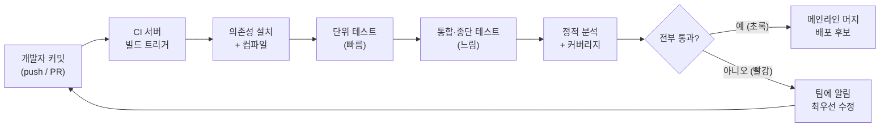

<figure class="post-figure post-figure--header">
<svg role="img" aria-label="Continuous Integration의 흐름을 한 장으로 담은 그림. 왼쪽에서 여러 개발자가 작은 단위로 자주 커밋하면 CI 서버가 빌드를 자동으로 트리거하고, 의존성 설치와 컴파일, 단위 테스트, 통합·종단 테스트, 정적 분석과 커버리지를 단계별 파이프라인으로 통과시킨다. 모두 통과하면 메인라인에 머지되어 배포 후보 산출물이 되고, 한 단계라도 실패하면 즉시 빨간 알림이 되어 커밋한 개발자에게 되돌아가 최우선으로 수정한 뒤 다시 커밋하는 루프를 이룬다." viewBox="0 0 680 300" xmlns="http://www.w3.org/2000/svg">
  <title>Continuous Integration — 잦은 커밋이 자동 파이프라인을 거쳐 초록(머지)이 되거나 빨강(즉시 수정 루프)으로 되돌아온다</title>

  <!-- ===== LEFT: developers commit frequently ===== -->
  <text x="56" y="24" text-anchor="middle" font-size="11" fill="currentColor" font-weight="700" opacity="0.75">잦은 커밋</text>
  <circle cx="38" cy="66" r="9" fill="none" stroke="currentColor" stroke-width="2"/>
  <circle cx="38" cy="108" r="9" fill="none" stroke="currentColor" stroke-width="2"/>
  <circle cx="38" cy="150" r="9" fill="none" stroke="currentColor" stroke-width="2"/>
  <text x="38" y="178" text-anchor="middle" font-size="8" fill="currentColor" opacity="0.7">개발자들</text>
  <line x1="50" y1="66" x2="96" y2="100" stroke="var(--secondary-color)" stroke-width="2" marker-end="url(#ci-arrow)"/>
  <line x1="50" y1="108" x2="96" y2="108" stroke="var(--secondary-color)" stroke-width="2" marker-end="url(#ci-arrow)"/>
  <line x1="50" y1="150" x2="96" y2="116" stroke="var(--secondary-color)" stroke-width="2" marker-end="url(#ci-arrow)"/>

  <!-- ===== CI server trigger ===== -->
  <rect x="100" y="88" width="74" height="44" rx="3" fill="var(--bg-panel)" stroke="var(--accent-color)" stroke-width="2.5"/>
  <text x="137" y="106" text-anchor="middle" font-size="9.5" fill="currentColor" font-weight="700">CI 서버</text>
  <text x="137" y="120" text-anchor="middle" font-size="8" fill="currentColor" opacity="0.8">빌드 트리거</text>

  <!-- ===== MIDDLE: pipeline stages (fast → slow) ===== -->
  <text x="386" y="24" text-anchor="middle" font-size="11" fill="currentColor" font-weight="700" opacity="0.75">자동 파이프라인 — 빠른 것부터, 실패하면 멈춤</text>
  <line x1="174" y1="110" x2="198" y2="110" stroke="var(--secondary-color)" stroke-width="2" marker-end="url(#ci-arrow)"/>
  <rect x="200" y="90" width="84" height="40" rx="3" fill="var(--bg-light)" stroke="currentColor" stroke-width="1.8"/>
  <text x="242" y="107" text-anchor="middle" font-size="8.5" fill="currentColor" font-weight="700">설치·컴파일</text>
  <text x="242" y="120" text-anchor="middle" font-size="7.5" fill="currentColor" opacity="0.75">단일 명령</text>
  <line x1="284" y1="110" x2="300" y2="110" stroke="var(--secondary-color)" stroke-width="2" marker-end="url(#ci-arrow)"/>
  <rect x="302" y="90" width="84" height="40" rx="3" fill="var(--bg-light)" stroke="var(--accent-color)" stroke-width="2"/>
  <text x="344" y="107" text-anchor="middle" font-size="8.5" fill="currentColor" font-weight="700">단위 테스트</text>
  <text x="344" y="120" text-anchor="middle" font-size="7.5" fill="currentColor" opacity="0.75">빠름</text>
  <line x1="386" y1="110" x2="402" y2="110" stroke="var(--secondary-color)" stroke-width="2" marker-end="url(#ci-arrow)"/>
  <rect x="404" y="90" width="84" height="40" rx="3" fill="var(--bg-light)" stroke="currentColor" stroke-width="1.8"/>
  <text x="446" y="107" text-anchor="middle" font-size="8.5" fill="currentColor" font-weight="700">통합·종단</text>
  <text x="446" y="120" text-anchor="middle" font-size="7.5" fill="currentColor" opacity="0.75">느림</text>
  <line x1="488" y1="110" x2="504" y2="110" stroke="var(--secondary-color)" stroke-width="2" marker-end="url(#ci-arrow)"/>
  <rect x="506" y="90" width="84" height="40" rx="3" fill="var(--bg-light)" stroke="currentColor" stroke-width="1.8"/>
  <text x="548" y="107" text-anchor="middle" font-size="8.5" fill="currentColor" font-weight="700">정적 분석</text>
  <text x="548" y="120" text-anchor="middle" font-size="7.5" fill="currentColor" opacity="0.75">+ 커버리지</text>

  <!-- gate -->
  <line x1="590" y1="110" x2="606" y2="110" stroke="var(--secondary-color)" stroke-width="2" marker-end="url(#ci-arrow)"/>
  <path d="M636,88 L658,110 L636,132 L614,110 Z" fill="var(--bg-panel)" stroke="var(--gold)" stroke-width="2"/>
  <text x="636" y="106" text-anchor="middle" font-size="8" fill="currentColor" font-weight="700">전부</text>
  <text x="636" y="117" text-anchor="middle" font-size="8" fill="currentColor" font-weight="700">통과?</text>

  <!-- ===== GREEN: merge / deploy candidate ===== -->
  <line x1="636" y1="132" x2="636" y2="178" stroke="var(--secondary-color)" stroke-width="2" marker-end="url(#ci-arrow)"/>
  <text x="600" y="158" text-anchor="middle" font-size="8" fill="currentColor" font-weight="700" opacity="0.85">예 · 초록</text>
  <rect x="556" y="180" width="118" height="44" rx="3" fill="var(--bg-panel)" stroke="var(--accent-color)" stroke-width="2.5"/>
  <text x="615" y="199" text-anchor="middle" font-size="9.5" fill="currentColor" font-weight="700">메인라인 머지</text>
  <text x="615" y="213" text-anchor="middle" font-size="8" fill="currentColor" opacity="0.8">배포 후보 산출물</text>

  <!-- ===== RED: broken build feedback loop back to developers ===== -->
  <text x="332" y="252" text-anchor="middle" font-size="11" fill="currentColor" font-weight="700" opacity="0.75">빨강이면 즉시 알림 → 최우선 수정 → 다시 커밋 (루프가 닫힌다)</text>
  <line x1="614" y1="110" x2="332" y2="110" stroke="var(--gold)" stroke-width="2" stroke-dasharray="5 4" opacity="0.85"/>
  <line x1="332" y1="110" x2="332" y2="268" stroke="var(--gold)" stroke-width="2" stroke-dasharray="5 4" opacity="0.85"/>
  <rect x="240" y="270" width="184" height="24" rx="3" fill="var(--bg-light)" stroke="var(--gold)" stroke-width="2"/>
  <text x="332" y="286" text-anchor="middle" font-size="8.5" fill="currentColor" font-weight="700">빨간 빌드 — 팀에 알림 · 최우선 수정</text>
  <line x1="240" y1="282" x2="44" y2="282" stroke="var(--gold)" stroke-width="2" stroke-dasharray="5 4" opacity="0.85"/>
  <line x1="44" y1="282" x2="44" y2="165" stroke="var(--gold)" stroke-width="2" stroke-dasharray="5 4" opacity="0.85" marker-end="url(#ci-arrow-gold)"/>

  <defs>
    <marker id="ci-arrow" markerWidth="8" markerHeight="8" refX="6" refY="4" orient="auto">
      <path d="M0,0 L8,4 L0,8 z" fill="var(--secondary-color)"/>
    </marker>
    <marker id="ci-arrow-gold" markerWidth="8" markerHeight="8" refX="6" refY="4" orient="auto">
      <path d="M0,0 L8,4 L0,8 z" fill="var(--gold)"/>
    </marker>
  </defs>
</svg>
<figcaption>CI 한 장 요약 — 여러 개발자가 <strong>작게 자주 커밋</strong>하면 CI 서버가 빌드를 자동 트리거하고, <strong>빠른 것(단위)부터 느린 것(통합·종단)·정적 분석</strong> 순의 파이프라인을 통과시킨다. 전부 통과하면 메인라인에 머지되어 배포 후보가 되고(초록), 한 단계라도 실패하면 곧장 알림이 되어 개발자에게 되돌아가 <strong>최우선으로 고친 뒤 다시 커밋</strong>하는 루프(금색 점선)를 이룬다.</figcaption>
</figure>

## 들어가며

이 글은 `Process-Essential` 시리즈의 **6단계**입니다. 전체 지도는 [Process Essential Curriculum](/2026/06/19/process-essential-curriculum.html)에서 확인할 수 있습니다.

5단계 [OOSE: 유스케이스 주도 개발](/2026/06/19/oose-use-case-driven.html)에서는 유스케이스가 분석·설계·구현·테스트를 어떻게 하나의 흐름으로 꿰는지를 살펴봤습니다. 그런데 아무리 좋은 설계와 테스트를 갖추더라도, 여러 사람이 각자의 브랜치에서 며칠씩 작업한 코드를 한꺼번에 합치는 순간 모든 가정이 무너지곤 합니다. 이른바 **통합 지옥(integration hell)** 입니다. Continuous Integration(CI)은 바로 이 통합 지옥을 정면으로 없애려는 실천이며, 2단계에서 다룬 [XP Explained: 변화를 끌어안는 애자일](/2026/06/19/extreme-programming-explained.html)의 핵심 실천 중 하나이기도 합니다. XP가 "통합은 미루지 말고 계속, 자주 하라"고 말했던 그 원칙을 도구와 자동화로 구체화한 것이 이 단계의 주제입니다.

이 글의 길잡이는 Paul Duvall, Steve Matyas, Andrew Glover가 쓴 *Continuous Integration: Improving Software Quality and Reducing Risk*입니다. 이 책은 CI를 단순한 "빌드 서버 설치"가 아니라, **소프트웨어 품질을 높이고 위험을 줄이는 일상적 실천**으로 정의합니다. 핵심 통찰은 단순합니다. 통합이 고통스러운 이유는 통합을 드물게 하기 때문이고, 고통스러운 일은 자주 할수록 덜 아파진다는 것입니다. 통합을 매 커밋마다 자동으로 하면, "합치는 일"은 더 이상 별도의 사건이 아니라 평범한 배경 작업이 됩니다.

그리고 이 모든 자동화·도구·실천을 한참 쌓고 나면 자연스럽게 떠오르는 질문이 있습니다. "그래서 방법론의 본질은 무엇인가?" 7단계 [Essence: 방법론 감옥에서 탈출하기](/2026/06/19/essentials-of-modern-software-engineering.html)는 그 메타 수준의 물음으로 우리를 데려갈 것입니다. 우선은 통합 지옥을 없애는 구체적 실천부터 차근히 살펴봅시다.

<div class="post-summary-box" markdown="1">

### 📌 이 글에서 다루는 내용

#### 🔍 핵심 주제

- **CI의 원칙**: 잦은 커밋, 자동 빌드, 빠른 피드백이 왜 통합 지옥을 없애는지
- **자동화된 빌드와 테스트**: 한 명령으로 끝나는 빌드 스크립트와 자동 테스트 스위트 구성
- **CI 서버와 파이프라인**: 빌드 트리거, 상태 가시화, 깨진 빌드에 대응하는 규율
- **품질 피드백**: 정적 분석·커버리지·데이터베이스 통합으로 넓히는 확장 실천
- **배포로의 연결**: CI에서 지속적 배포(Continuous Delivery)로 가는 길

</div>

## CI의 원칙: 잦은 커밋, 자동 빌드, 빠른 피드백

**왜 필요한가.** 통합 지옥의 진짜 원인은 "변경량 × 시간"입니다. 두 개발자가 일주일간 따로 작업하면, 합칠 때 충돌할 수 있는 코드의 양과 서로의 가정이 어긋날 가능성이 폭발적으로 늘어납니다. 반면 하루에도 여러 번 작은 단위로 합치면, 충돌은 작고 원인은 명확하며 즉시 고칠 수 있습니다. CI의 모든 실천은 이 단순한 산술을 자동화로 보장하려는 것입니다.

다음 그림은 그 산술을 두 개발자의 시간선으로 대비한 것입니다.

<figure class="post-figure">
<svg role="img" aria-label="잦은 통합과 늦은 통합을 두 시간선으로 비교한 그림. 위쪽 늦은 통합 시간선에서는 두 개발자가 일주일 내내 따로 작업한 큰 변경 덩어리가 마지막에 한 번에 부딪쳐, 충돌이 크고 원인이 뒤엉킨 통합 지옥이 된다. 아래쪽 잦은 통합 시간선에서는 같은 기간에 작은 단위로 여러 번 메인라인에 합쳐, 매번의 충돌이 작고 원인이 명확해 즉시 고칠 수 있다." viewBox="0 0 680 300" xmlns="http://www.w3.org/2000/svg">
  <title>잦은 통합 vs 늦은 통합 — 같은 변경량이라도 합치는 간격이 머지 고통의 크기를 가른다</title>

  <!-- ===== TOP: late integration (one big painful merge) ===== -->
  <text x="20" y="30" font-size="11" fill="currentColor" font-weight="700" opacity="0.8">늦은 통합 — 미뤘다가 한 번에</text>
  <text x="20" y="46" font-size="8.5" fill="currentColor" opacity="0.7">큰 변경 × 긴 시간 = 충돌도 크고 원인도 뒤엉킴</text>
  <!-- mainline timeline -->
  <line x1="40" y1="100" x2="600" y2="100" stroke="currentColor" stroke-width="1.5" opacity="0.4"/>
  <text x="20" y="104" font-size="8" fill="currentColor" opacity="0.7">메인</text>
  <!-- two long divergent branches -->
  <path d="M60,100 C200,60 460,60 596,98" fill="none" stroke="var(--secondary-color)" stroke-width="2.5"/>
  <path d="M60,100 C200,140 460,140 596,102" fill="none" stroke="var(--secondary-color)" stroke-width="2.5"/>
  <text x="300" y="58" text-anchor="middle" font-size="8" fill="currentColor" opacity="0.75">개발자 A — 일주일치 변경</text>
  <text x="300" y="148" text-anchor="middle" font-size="8" fill="currentColor" opacity="0.75">개발자 B — 일주일치 변경</text>
  <!-- big collision burst at the end -->
  <path d="M600,100 l16,-12 l-6,10 l14,-2 l-12,8 l13,6 l-16,-1 l5,12 l-13,-8 l-4,13 l-2,-14 l-11,9 l7,-13 l-15,2 l13,-7 l-15,-7 l16,1 z" fill="var(--bg-panel)" stroke="var(--gold)" stroke-width="2"/>
  <text x="610" y="103" text-anchor="middle" font-size="7.5" fill="currentColor" font-weight="700">충돌</text>
  <text x="636" y="84" font-size="9" fill="currentColor" font-weight="700" opacity="0.9">통합 지옥</text>

  <!-- divider -->
  <line x1="20" y1="170" x2="660" y2="170" stroke="currentColor" stroke-width="1" opacity="0.2"/>

  <!-- ===== BOTTOM: frequent integration (many tiny merges) ===== -->
  <text x="20" y="198" font-size="11" fill="currentColor" font-weight="700" opacity="0.8">잦은 통합 — 매일 작게 여러 번</text>
  <text x="20" y="214" font-size="8.5" fill="currentColor" opacity="0.7">작은 변경 × 짧은 간격 = 충돌이 작고 원인이 명확, 즉시 수정</text>
  <line x1="40" y1="262" x2="600" y2="262" stroke="currentColor" stroke-width="1.5" opacity="0.4"/>
  <text x="20" y="266" font-size="8" fill="currentColor" opacity="0.7">메인</text>
  <!-- repeated short hops touching mainline -->
  <g fill="none" stroke="var(--accent-color)" stroke-width="2.5">
    <path d="M70,262 q22,-22 44,0"/>
    <path d="M158,262 q22,-22 44,0"/>
    <path d="M246,262 q22,-22 44,0"/>
    <path d="M334,262 q22,-22 44,0"/>
    <path d="M422,262 q22,-22 44,0"/>
    <path d="M510,262 q22,-22 44,0"/>
  </g>
  <!-- small merge dots on the mainline -->
  <g fill="var(--gold)">
    <circle cx="114" cy="262" r="3.5"/>
    <circle cx="202" cy="262" r="3.5"/>
    <circle cx="290" cy="262" r="3.5"/>
    <circle cx="378" cy="262" r="3.5"/>
    <circle cx="466" cy="262" r="3.5"/>
    <circle cx="554" cy="262" r="3.5"/>
  </g>
  <text x="320" y="290" text-anchor="middle" font-size="8.5" fill="currentColor" opacity="0.8">작은 통합이 매일 반복 — 합치는 일이 사건이 아니라 배경 작업이 된다</text>
</svg>
<figcaption>같은 변경량이라도 <strong>합치는 간격</strong>이 고통의 크기를 가른다. 위처럼 미루면 두 갈래가 길게 벌어졌다가 마지막에 큰 충돌(통합 지옥)로 부딪치고, 아래처럼 작게 자주 합치면 매번의 충돌이 작고 원인이 명확해 즉시 고칠 수 있다. CI는 이 "작게 자주"를 자동화로 강제한다.</figcaption>
</figure>

CI는 보통 세 가지 원칙으로 요약됩니다.

- **잦은 커밋(commit frequently)**: 작동하는 작은 단위가 완성될 때마다 메인라인(main/trunk)에 통합합니다. 이상적으로는 하루에 한 번 이상. 오래 살아 있는 거대 브랜치는 통합을 미루는 함정입니다.
- **자동 빌드(automated build)**: 커밋이 들어오면 사람의 개입 없이 빌드가 돌아갑니다. "내 컴퓨터에서는 됐는데"라는 변명을 구조적으로 차단합니다.
- **빠른 피드백(fast feedback)**: 빌드와 테스트 결과가 몇 분 안에 돌아와야 합니다. 피드백이 늦으면 개발자는 이미 다른 작업으로 넘어가 있고, 깨진 빌드의 맥락을 잃어버립니다.

**구체적으로.** Martin Fowler가 정리한 CI의 핵심 규칙 중 하나는 "**메인라인을 절대 깨진 상태로 두지 않는다**"입니다. 빌드가 깨졌다면 그것을 고치는 일이 팀의 최우선 과제가 됩니다. 새 기능을 추가하는 것보다 빨간 빌드를 초록으로 되돌리는 것이 먼저입니다. 이 규율이 있어야 "메인라인은 항상 배포 가능한 상태"라는 신뢰가 유지됩니다.

## 자동화된 빌드와 테스트

**왜 필요한가.** CI가 작동하려면 "빌드"가 사람의 손이 필요 없는, 한 번의 명령으로 재현 가능한 절차여야 합니다. IDE 버튼을 눌러야만 되는 빌드, 특정 개발자만 아는 환경 설정에 의존하는 빌드는 자동화할 수 없습니다.

**개념.** 좋은 CI 빌드는 다음을 포함합니다. (1) 의존성 설치, (2) 컴파일/번들, (3) 자동 테스트 스위트 실행, (4) 정적 분석·커버리지 같은 품질 측정. 이 전체가 하나의 스크립트로 묶여 있어야 합니다. 핵심은 **단일 명령 빌드(single-command build)** 입니다.

예를 들어 로컬에서든 CI 서버에서든 똑같이 돌아가야 하는 명령은 이런 모습입니다.

```bash
# 의존성 설치 → 빌드 → 테스트를 한 흐름으로
npm ci                 # 잠금 파일 기반의 재현 가능한 설치
npm run build          # 컴파일/번들
npm test -- --coverage # 자동 테스트 + 커버리지 측정
```

자동 테스트 스위트는 CI의 심장입니다. 테스트가 없으면 "빌드가 통과했다"는 말은 "컴파일이 됐다"는 뜻에 불과합니다. 빠른 피드백을 위해 테스트는 보통 계층으로 나눕니다.

- **단위 테스트(unit test)**: 가장 빠르고 많아야 하는 층. 매 커밋마다 전부 실행.
- **통합 테스트(integration test)**: 컴포넌트 간 연결을 검증. 단위보다 느리지만 여전히 커밋 빌드에 포함하려 노력.
- **종단 테스트(end-to-end)**: 가장 느리고 깨지기 쉬운 층. 별도의 느린 단계로 분리해 빠른 피드백을 해치지 않게 합니다.

이렇게 "빠른 것 먼저, 느린 것 나중"으로 단계를 나누는 것이 뒤에서 다룰 파이프라인의 출발점입니다.

## CI 서버와 파이프라인

**왜 필요한가.** 개발자가 매번 손으로 빌드를 돌릴 수는 없습니다. 커밋이라는 이벤트에 반응해 자동으로 빌드를 트리거하고, 결과를 모두에게 보여 주는 중립적 주체가 필요합니다. 그것이 CI 서버(혹은 GitHub Actions·GitLab CI 같은 호스티드 러너)입니다.

**개념.** CI 서버의 역할은 세 가지입니다.

- **빌드 트리거(trigger)**: push/PR 같은 이벤트가 발생하면 자동으로 워크플로를 시작합니다.
- **상태 가시화(visibility)**: 빌드가 초록인지 빨강인지를 PR 화면, 배지, 알림으로 누구나 즉시 알 수 있게 합니다.
- **깨진 빌드 대응(broken build response)**: 빌드가 깨지면 책임자에게 알리고, 팀은 그것을 최우선으로 고칩니다.

**구체적 예시.** 아래는 체크아웃 → 설치 → 빌드 → 테스트를 수행하는 작고 일반적인 GitHub Actions 스타일 워크플로입니다.

```yaml
name: CI
on:
  push:
    branches: [main]
  pull_request:

jobs:
  build-and-test:
    runs-on: ubuntu-latest
    steps:
      - name: Checkout
        uses: actions/checkout@v4

      - name: Set up Node
        uses: actions/setup-node@v4
        with:
          node-version: "20"

      - name: Install dependencies
        run: npm ci

      - name: Build
        run: npm run build

      - name: Test (with coverage)
        run: npm test -- --coverage

      - name: Static analysis (lint)
        run: npm run lint
```

이 워크플로는 메인라인으로의 push와 모든 PR에서 자동으로 돌아갑니다. PR이 빨간 빌드라면 머지를 막도록 브랜치 보호 규칙을 걸면, "깨진 코드는 메인라인에 들어올 수 없다"는 원칙이 도구 수준에서 강제됩니다.

**파이프라인.** 여러 단계를 순서대로 엮은 것이 CI 파이프라인입니다. 앞 단계가 실패하면 뒤 단계로 넘어가지 않으므로, 빠르고 값싼 검증을 먼저 배치해 피드백 속도를 최대화합니다.



이 그림의 핵심은 화살표가 **개발자에게 빠르게 되돌아온다**는 점입니다. 빨간 빌드는 곧바로 알림이 되어 커밋한 사람에게 피드백되고, 그가 즉시 고친 뒤 다시 커밋하면서 루프가 닫힙니다.

## 품질 피드백: 정적 분석·커버리지·데이터베이스 통합

**왜 필요한가.** 테스트 통과만이 품질은 아닙니다. 컴파일되고 테스트가 초록이어도 코드 냄새, 보안 취약점, 검증되지 않은 영역이 숨어 있을 수 있습니다. CI는 "통합이 깨지지 않았는가"를 넘어 "품질이 어디로 가고 있는가"를 매 커밋마다 측정하는 자리로 확장됩니다.

**확장 실천.**

- **정적 분석(static analysis)**: 린터·타입 체커·보안 스캐너를 파이프라인에 넣어, 실행 없이도 발견 가능한 문제(미사용 변수, 위험한 패턴, 알려진 취약 의존성)를 자동으로 걸러냅니다.
- **코드 커버리지(coverage)**: 테스트가 실제로 어느 코드 경로를 거쳤는지 측정합니다. 커버리지는 목적이 아니라 신호입니다. 0%에 가까운 영역은 위험 지대를, 급격한 하락은 테스트 없이 추가된 코드를 알려 줍니다.
- **데이터베이스 통합(database integration)**: 책 *Continuous Integration*이 특히 강조하는 실천입니다. 스키마와 마이그레이션 스크립트도 코드처럼 버전 관리하고, CI 빌드 안에서 깨끗한 DB를 생성·마이그레이션·시드하여 "애플리케이션 + 데이터베이스"가 함께 통합되는지를 검증합니다. 데이터베이스를 빌드 바깥의 수작업으로 두면, 통합 지옥은 데이터 계층에서 그대로 부활합니다.

이런 측정값을 PR마다 코멘트·배지로 가시화하면, 품질은 분기 말의 회고가 아니라 매 커밋의 일상적 피드백이 됩니다. 앞의 워크플로에 `npm run lint` 단계를 넣고 커버리지 리포트를 업로드하는 것이 바로 이 확장의 첫걸음입니다.

## 배포로의 연결: CI에서 Continuous Delivery로

**왜 필요한가.** CI로 "메인라인은 항상 빌드되고 테스트를 통과한다"는 상태를 만들었다면, 다음 질문은 자연스럽습니다. "그렇다면 왜 배포는 여전히 드물고 고통스러운가?" 통합 지옥을 없앤 논리를 그대로 배포에 적용한 것이 **Continuous Delivery(CD)** 입니다.

**개념.** CD는 CI 파이프라인을 배포 가능한 산출물(artifact) 생산과 환경 승격(promotion)까지 확장합니다.

- **Continuous Integration**: 커밋마다 빌드·테스트로 메인라인을 항상 건강하게 유지.
- **Continuous Delivery**: 모든 통과한 빌드를 언제든 **배포 가능한** 상태로 자동 준비. 실제 운영 배포는 사람의 버튼 하나로.
- **Continuous Deployment**: 한 발 더 나아가, 통과한 빌드를 사람 개입 없이 운영까지 자동 배포.

핵심은 배포 절차 역시 빌드처럼 **자동화되고 재현 가능한 파이프라인**이라는 점입니다. CI에서 만든 단일 명령 빌드, 자동 테스트, 품질 게이트가 그대로 배포의 신뢰 기반이 됩니다. 즉 CI는 CD의 전제 조건입니다. 통합을 자주·자동으로 하지 않으면, 배포를 자주·자동으로 할 수 없습니다.

이 흐름을 한 문장으로 요약하면 이렇습니다. **잦은 통합 → 항상 초록인 메인라인 → 언제든 배포 가능한 산출물 → 버튼 하나의 릴리스.** 통합 지옥을 없앤 실천이 그대로 "배포 지옥"까지 없애는 길로 이어집니다.

## 마무리

Continuous Integration은 "통합을 별도의 사건에서 평범한 배경 작업으로 바꾸는" 실천입니다. 잦은 커밋·자동 빌드·빠른 피드백이라는 세 원칙으로 통합 지옥의 산술을 무너뜨리고, 단일 명령 빌드와 자동 테스트 스위트로 재현 가능성을 보장하며, CI 서버와 파이프라인으로 트리거·가시화·깨진 빌드 대응을 자동화합니다. 여기에 정적 분석·커버리지·데이터베이스 통합 같은 품질 피드백을 얹고, 같은 논리를 배포까지 확장하면 Continuous Delivery가 됩니다.

지금까지 시리즈는 방법론(애자일·XP·스크럼·OOSE)과 실천(CI)을 차례로 쌓아 왔습니다. 그렇다면 이 모든 방법론과 실천을 관통하는 **공통의 본질**은 무엇일까요? 7단계 [Essence: 방법론 감옥에서 탈출하기](/2026/06/19/essentials-of-modern-software-engineering.html)에서는 한 걸음 물러나, 방법론을 메타 수준에서 바라보며 "어떤 방법론을 쓰든 변하지 않는 것"을 탐구합니다.

### 다음 학습

- [Process Essential Curriculum](/2026/06/19/process-essential-curriculum.html) — 시리즈 전체 지도와 진행 현황
- [OOSE: 유스케이스 주도 개발](/2026/06/19/oose-use-case-driven.html) — 5단계 다시 보기
- [Essence: 방법론 감옥에서 탈출하기](/2026/06/19/essentials-of-modern-software-engineering.html) — 7단계로 이어가기
