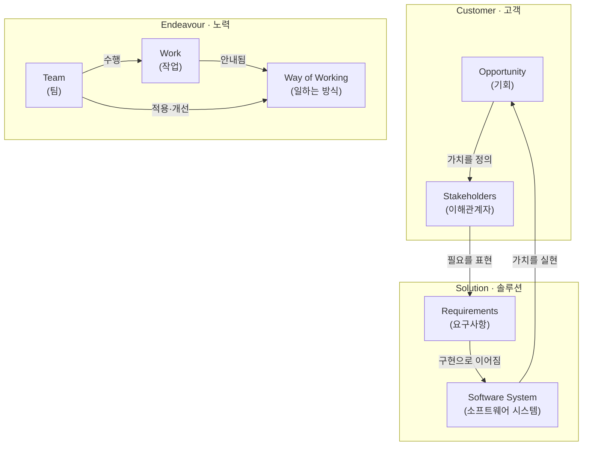
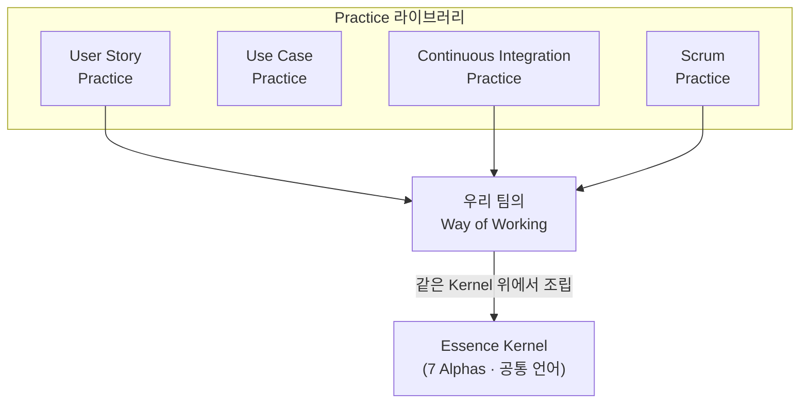

## 들어가며

이 글은 `Process-Essential` 시리즈의 **7단계이자 마지막**입니다. 시리즈의 큰 그림은 [Process Essential Curriculum](/2026/06/19/process-essential-curriculum.html)에서 다시 확인할 수 있습니다.

바로 앞 [6단계](/2026/06/19/continuous-integration.html)에서 우리는 **Continuous Integration**으로 "통합 지옥(Integration Hell)"을 없애는 구체적 실천을 배웠습니다. 자동 빌드, 빠른 피드백, 작은 통합 단위 — 이 모든 것은 결국 **팀이 일하는 방식(Way of Working)**을 개선하기 위한 하나의 실천일 뿐입니다. 그렇다면 질문이 생깁니다. CI는 XP의 실천일까요, Scrum과도 함께 쓸 수 있을까요? Kanban 팀이 CI를 도입하면 그건 무슨 방법론이 되는 걸까요?

이 질문들이 바로 마지막 단계의 출발점입니다. Ivar Jacobson을 비롯한 저자들의 *The Essentials of Modern Software Engineering*(2019)은 이 혼란에 정면으로 답합니다. 이 책의 핵심에는 **SEMAT**(Software Engineering Method and Theory) 운동과 그 산출물인 **Essence** 표준(OMG에서 채택)이 있습니다.

저자들의 진단은 도발적입니다. 우리 업계는 수십 년간 **"방법론 전쟁(Method War)"**에 갇혀 있었습니다. Waterfall vs Agile, Scrum vs Kanban, XP vs RUP — 각 진영은 자신의 방법론을 종교처럼 신봉하고, 팀은 특정 방법론의 용어와 규칙에 갇힙니다. 저자들은 이를 **"방법론 감옥(Method Prison)"**이라고 부릅니다. 감옥에 갇힌 팀은 "우리는 Scrum을 한다"는 정체성에 매여, 정작 자신들에게 필요한 실천을 자유롭게 조합하지 못합니다.

Essence의 제안은 단순하고 강력합니다. 모든 소프트웨어 개발에는 방법론과 무관하게 **공통된 본질**이 존재한다. 그 본질을 작은 공통 기반(**Kernel**)으로 추려내고, 구체적인 방법은 **실천(Practice)**이라는 레고 블록으로 그 위에 자유롭게 조립하자. 그러면 우리는 방법론의 이름이 아니라 **실제 진행 상태**로 팀을 이야기할 수 있게 됩니다.

이 글로 `Process-Essential` 시리즈가 완성됩니다. 일곱 권의 책이 가리키던 방향이 어떻게 하나로 모이는지, 마지막에 함께 정리하겠습니다.

<div class="post-summary-box" markdown="1">

### 📌 이 글에서 다루는 내용

#### 🔍 핵심 주제

- **방법론 감옥 탈출**: 방법론 전쟁을 넘어서는 Essence의 문제의식과, 이름이 아닌 본질로 개발을 바라보는 시각
- **공통 기반(Kernel)과 알파(Alpha)**: 모든 개발에 공통된 본질을 추린 Kernel과, 진행 상태를 추적하는 일곱 개의 Alpha
- **실천(Practice)의 조합**: 방법을 레고처럼 조립하기 — Practice 라이브러리에서 필요한 블록만 골라 자신만의 Way of Working 만들기
- **팀의 상태 점검**: Alpha 카드로 진행 상황을 시각화하고, "지금 어디에 있고 다음에 무엇을 할지"를 함께 정하기

</div>

## 방법론 감옥에서 탈출하기

### 왜 문제인가

방법론은 본래 팀을 돕기 위한 도구입니다. 그런데 현실에서는 도구가 주인이 됩니다. "그건 Scrum의 방식이 아니야", "Kanban에는 스프린트가 없어"처럼, 팀의 대화가 **방법론의 규칙을 지키는지**에 대한 논쟁으로 변질됩니다. 정작 "우리가 만들려는 게 이해관계자에게 가치가 있는가"라는 본질적 질문은 뒤로 밀립니다.

저자들이 지적하는 더 깊은 문제는 **방법론들이 서로 비교 불가능하다**는 점입니다. 각 방법론은 자기만의 용어, 자기만의 다이어그램, 자기만의 역할 정의를 갖습니다. Scrum의 "Sprint"와 XP의 "Iteration"은 같은가 다른가? 두 방법론을 함께 쓰는 팀은 이 차이를 매번 통역해야 합니다. 공통 언어가 없기 때문입니다.

### Essence의 답

Essence는 "또 하나의 방법론"이 아닙니다. 오히려 **모든 방법론을 표현할 수 있는 공통 언어(common ground)**를 지향합니다. 마치 화학에서 수많은 물질을 소수의 원소로 환원하듯, Essence는 모든 개발 방법을 소수의 공통 요소로 환원합니다.

이 사고 전환의 핵심은 다음 한 문장입니다.

> 우리는 "어떤 방법론을 쓰는가"가 아니라, **"지금 개발이 어디까지 진행되었는가"**를 이야기해야 한다.

방법론의 이름은 정체성이 아니라 선택일 뿐입니다. 감옥의 문은 사실 열려 있었고, Essence는 그 문 밖에 공통의 지도를 펼쳐 둡니다.

## 공통 기반(Kernel)과 알파(Alpha)

### Kernel: 모든 개발의 공통 본질

Essence의 심장은 **Kernel**입니다. Kernel은 "어떤 소프트웨어 개발이든 반드시 다루어야 하는 최소한의 본질"을 추려낸 것입니다. 여기에는 방법론에 종속된 구체적 실천(예: 스탠드업, 페어 프로그래밍)이 **들어 있지 않습니다**. 오직 본질만 담깁니다.

Kernel은 세 가지 **관심 영역(Area of Concern)**으로 나뉩니다.

- **Customer(고객)**: 소프트웨어가 사용되고 가치를 만들어내는 세계
- **Solution(솔루션)**: 만들어지고 있는 소프트웨어 그 자체
- **Endeavour(노력)**: 그 소프트웨어를 만드는 팀과 활동

### 일곱 개의 Alpha

각 관심 영역 안에는 **Alpha**가 있습니다. Alpha는 "Abstract-Level Progress Health Attribute"의 약자로, 개발에서 **진행 상태와 건강을 추적해야 하는 본질적 대상**을 뜻합니다. 명사이되, 손에 잡히는 산출물(Work Product)이 아니라 **상태가 변해가는 추상적 대상**이라는 점이 핵심입니다.

Kernel에는 정확히 **일곱 개의 Alpha**가 있습니다.



이 일곱 Alpha는 어떤 방법론을 쓰든 항상 존재합니다. Waterfall이든 Scrum이든 "요구사항(Requirements)"은 있고, "팀(Team)"은 있으며, "일하는 방식(Way of Working)"은 있습니다. 방법론마다 부르는 이름과 강조점이 다를 뿐, 본질은 같습니다.

### Alpha의 상태(State)

Alpha가 진정으로 강력한 이유는 각 Alpha가 **명확하게 정의된 상태(State)의 진행 경로**를 갖기 때문입니다. 상태는 순서대로 진행하며, 각 상태에는 그 상태에 도달했는지 판단하는 **체크리스트**가 달려 있습니다.

예를 들어 **Requirements Alpha**는 다음 여섯 상태를 거칩니다.

```text
Requirements Alpha — 상태 진행

  Conceived   (착안됨)
      │   이해관계자가 새 시스템의 필요에 합의했다
      ▼
  Bounded     (범위가 정해짐)
      │   요구사항의 목적과 범위가 분명해졌다
      ▼
  Coherent    (일관됨)
      │   요구사항이 서로 모순 없이 일관된 그림을 이룬다
      ▼
  Acceptable  (수용 가능함)
      │   이해관계자가 이 요구사항이면 받아들일 만하다고 본다
      ▼
  Addressed   (충족 작업 중)
      │   충분한 요구사항이 구현되어 가치가 보이기 시작한다
      ▼
  Fulfilled   (완전히 충족됨)
          이해관계자가 기대한 요구사항이 모두 충족되었다
```

여기서 우리가 [3단계 User Stories](/2026/06/19/process-essential-curriculum.html)와 [4단계 Use Cases](/2026/06/19/process-essential-curriculum.html)에서 배운 요구사항 기법들이 어디에 위치하는지 보입니다. 스토리든 유스케이스든, 그것은 Requirements Alpha를 **Conceived에서 Fulfilled로 진행시키기 위한 도구**입니다. 도구는 바뀌어도, 추적해야 하는 본질적 상태는 같습니다.

마찬가지로 **Way of Working Alpha**는 Principles Established → Foundation Established → In Use → In Place → Working Well → Retired의 경로를 갖습니다. 이 경로에 우리가 1~6단계에서 배운 모든 실천이 한 자리씩 차지합니다. CI를 도입해 "In Use" 상태로 가고, 회고를 통해 "Working Well"로 발전시키는 식입니다.

## 실천(Practice)의 조합: 레고처럼 방법 만들기

### Kernel만으로는 부족하다

Kernel은 의도적으로 비어 있습니다. "요구사항을 Bounded 상태로 만들어라"고 말하지만, **어떻게** 만드는지는 말하지 않습니다. 그 "어떻게"를 채우는 것이 **Practice(실천)**입니다.

Practice는 특정 목표를 달성하기 위한, 재사용 가능하고 자기완결적인 방법의 조각입니다. 예를 들면 다음과 같습니다.

- **User Story Practice**: 요구사항을 스토리로 잘게 쪼개 진행하는 방법 (3단계와 연결)
- **Use Case Practice**: 시스템과의 상호작용 흐름으로 요구사항을 다루는 방법 (4단계와 연결)
- **Continuous Integration Practice**: 잦은 통합으로 Software System을 건강하게 진행시키는 방법 (6단계와 연결)
- **Scrum Practice**: 스프린트와 백로그로 Work와 Team을 운영하는 방법

### 블록처럼 조립한다

핵심은 이 Practice들이 모두 **같은 Kernel 위에서 같은 Alpha를 진행시킨다**는 점입니다. 그래서 서로 다른 출신의 Practice를 자유롭게 조합할 수 있습니다.



위 예시 팀은 "Scrum + User Story + CI"를 골라 자신만의 Way of Working을 조립했습니다. 이것은 "Scrum을 한다"는 정체성에 갇힌 것이 아니라, **필요한 블록을 의도적으로 선택**한 결과입니다. 내일 이 팀에게 Use Case가 더 적합해지면, User Story 블록을 빼고 Use Case 블록을 끼우면 됩니다. 나머지 구조는 그대로입니다 — 모두 같은 Kernel 위에 서 있으니까요.

이것이 바로 **방법론 감옥에서의 탈출**입니다. 방법론은 미리 포장된 고정 세트가 아니라, **상황에 맞게 조립하고 진화시키는 살아 있는 무엇**이 됩니다.

## 팀의 상태 점검: Alpha 카드로 보는 진행

### 추상을 손에 잡히게: Alpha State Card

Alpha와 상태가 아무리 잘 정의되어 있어도, 팀이 매일 쓰지 않으면 죽은 이론입니다. Essence는 이를 위해 **Alpha State Card**라는 물리적/시각적 도구를 제공합니다. 각 카드 앞면에는 Alpha 이름과 현재 상태, 뒷면에는 그 상태에 도달했는지 판단하는 체크리스트가 있습니다.

팀은 테이블 위에 일곱 장의 카드를 펼쳐 놓고 묻습니다.

```text
오늘의 상태 점검 (예시)

  Opportunity ........ Value Established      ✔ 다음: Viable
  Stakeholders ....... Involved              ✔ 다음: In Agreement
  Requirements ....... Coherent              ◐ 진행 중 → Acceptable
  Software System .... Architecture Selected  ◐ 진행 중 → Demonstrable
  Work ............... Started               ✔ 다음: Under Control
  Team ............... Performing            ✔ 안정적
  Way of Working ..... In Use                ◐ 개선 중 → Working Well
```

### "다음 행동"이 자연스럽게 나온다

이 단순한 점검이 강력한 이유는, 상태를 보면 **다음에 무엇을 해야 하는지**가 거의 자동으로 드러나기 때문입니다. 위 예시에서 Requirements가 "Coherent"에 머물러 있다면, 팀의 다음 초점은 "이해관계자가 수용 가능하다고 동의하게 만드는 것(→ Acceptable)"입니다. Software System이 "Architecture Selected"라면, 다음은 "데모 가능한 형태로 만드는 것(→ Demonstrable)"입니다.

이것은 [회고](/2026/06/19/process-essential-curriculum.html)나 스프린트 계획에 곧바로 연결됩니다. "우리가 Way of Working을 In Use에서 Working Well로 올리려면, 회고에서 어떤 실천을 더 다듬어야 할까?" 같은 대화가 자연스럽게 생깁니다. 방법론의 의식(ceremony)을 형식적으로 따르는 대신, **본질적 진행에 집중하는 대화**로 회의가 바뀝니다.

핵심은, 진행이 더디게 느껴지는 막연한 불안을 **구체적 상태와 다음 행동**으로 번역해 준다는 점입니다. 팀은 "잘 되고 있나?"라는 모호한 질문 대신, "일곱 Alpha 중 어느 것이 뒤처졌고, 그것을 한 칸 전진시키려면 무엇이 필요한가?"라는 답할 수 있는 질문을 갖게 됩니다.

## 마무리

이번 마지막 단계에서 우리는 **Essence와 SEMAT**를 통해 방법론을 바라보는 한 차원 높은 시각을 얻었습니다. 끝없는 방법론 전쟁이 만든 **방법론 감옥**을 진단하고, 모든 개발에 공통된 본질을 추린 **Kernel**과 진행을 추적하는 **일곱 개의 Alpha**(Opportunity, Stakeholders, Requirements, Software System, Work, Team, Way of Working)를 배웠습니다. 그리고 구체적 방법을 **Practice라는 레고 블록**으로 조립하고, **Alpha 카드**로 팀의 상태를 점검해 다음 행동을 끌어내는 법을 살펴봤습니다. Essence는 방법론을 버리라고 말하지 않습니다. 다만 그것을 **이름이 아니라 본질로, 정체성이 아니라 도구로** 다루라고 말합니다.

그리고 이로써 `Process-Essential` 시리즈 전체가 완성됩니다. 🎉 일곱 권의 책이 그려온 하나의 큰 이야기를 되짚어 보겠습니다. **Pressman**은 소프트웨어 공학이라는 큰 그림과 프로세스의 필요성을 가르쳐 우리에게 지도를 주었고, **Beck**의 XP는 그 위에 용기·소통·피드백·단순성이라는 가치를 새겨 프로세스에 영혼을 불어넣었습니다. **Cohn**은 요구사항을 사용자 스토리로 잘게 쪼개 협업과 대화로 전환했고, **Cockburn**은 유스케이스로 시스템과 사용자의 상호작용을 명료하게 구조화했습니다. **Jacobson**의 OOSE는 그 요구사항을 객체지향 설계와 잇는 다리를 놓았고, **Duvall**의 Continuous Integration은 그 모든 것을 매일 통합하며 살아 움직이게 하는 실천적 엔진을 제공했습니다. 마지막으로 **Essence**는 이 모든 방법을 한 언어 위에 세워, 우리가 감옥에서 벗어나 필요한 것을 자유롭게 조립하도록 해주었습니다. 결국 일곱 권은 한 가지 진실을 가리킵니다 — **좋은 프로세스와 좋은 요구사항은 따로 있는 두 기술이 아니라, "가치 있는 소프트웨어를 함께 만들어가는 하나의 장인 기술(craft)의 두 얼굴"이라는 것**입니다.

### 다음 학습

이 글은 `Process-Essential` 시리즈의 마지막 단계이므로 다음 단계는 없습니다. 대신 시리즈를 마무리하며 아래 길들을 권합니다.

- 전체 로드맵 다시 보기: [Process Essential Curriculum](/2026/06/19/process-essential-curriculum.html)
- 이전 단계 다시 보기 (6단계): [Continuous Integration: 통합 지옥을 없애는 실천](/2026/06/19/continuous-integration.html)
- 형제 커리큘럼 — 설계의 본질로: [Architecture Essential Curriculum](/2026/06/19/architecture-essential-curriculum.html)
- 형제 커리큘럼 — 코드 품질의 본질로: [Testing-Refactoring Essential Curriculum](/2026/06/19/testing-refactoring-essential-curriculum.html)
