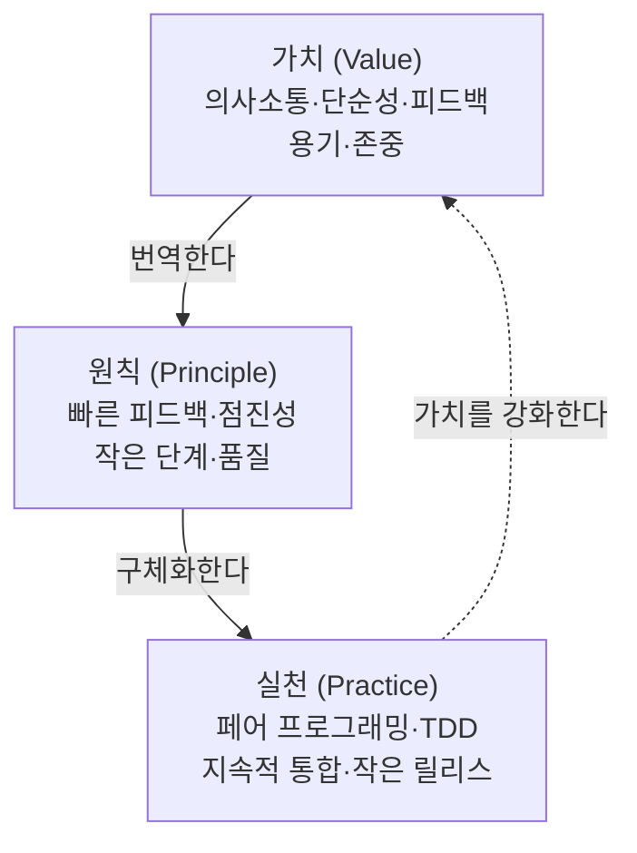
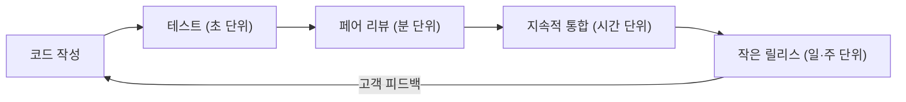
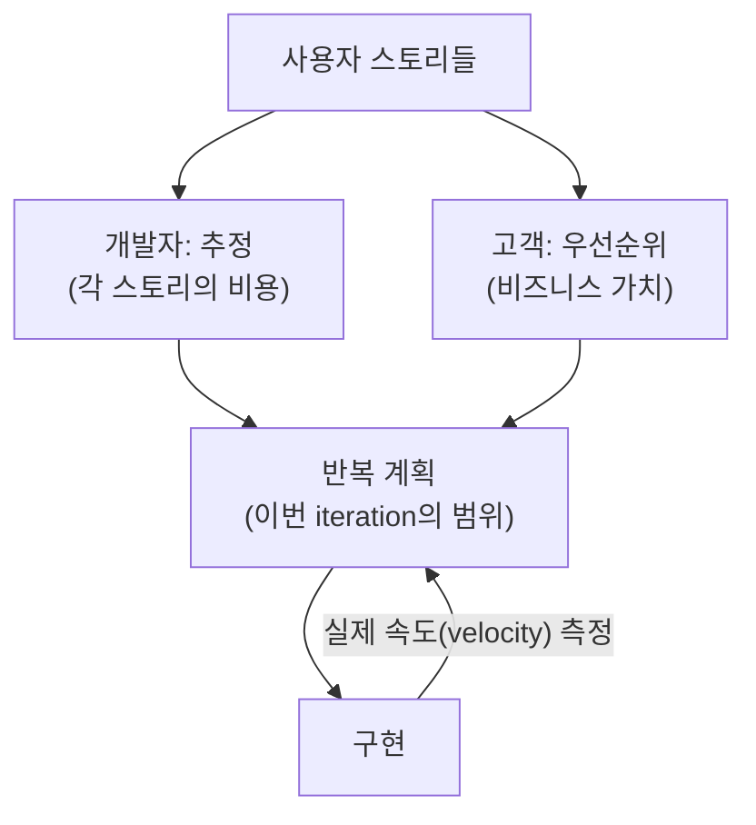

## 들어가며

이 글은 `Process-Essential` 시리즈의 **2단계**입니다. 전체 지도는 [Process Essential Curriculum](/2026/06/19/process-essential-curriculum.html)에서 확인할 수 있습니다.

1단계 [Software Engineering: 분야의 지형도를 그리다](/2026/06/19/software-engineering-practitioners-approach.html)에서는 Pressman의 시선으로 소프트웨어 공학이라는 분야 전체의 지형도를 그렸습니다. 프로세스, 모델링, 품질, 관리가 어떻게 맞물리는지 큰 그림을 잡았다면, 이제는 그 지도 위에서 **하나의 구체적인 방법론**으로 줌인할 차례입니다.

그 방법론이 바로 **XP(Extreme Programming)**, 그리고 그것을 정의한 책이 Kent Beck의 *Extreme Programming Explained: Embrace Change*(1999, 2판 2004)입니다. XP는 1990년대 후반, 무겁고 문서 중심적인 전통 프로세스가 변화 앞에서 자주 무너지는 것을 본 실무자들이 내놓은 답입니다. 책의 부제이자 핵심 명제는 단 한 문장으로 요약됩니다.

> **변화를 끌어안기(Embrace Change).**

전통적 사고는 "요구사항 변경은 비용이고 위험이니 미리 막아야 한다"고 봅니다. XP는 정반대로 갑니다. 변화는 소프트웨어 개발의 **본질이자 피할 수 없는 상수**이므로, 변화를 적으로 두고 싸우는 대신 변화가 싸지도록 시스템과 팀과 프로세스를 설계하자는 것입니다. 이 발상의 전환이 XP의 모든 실천을 떠받칩니다.

이번 글에서는 XP를 떠받치는 **가치·원칙·실천**의 3층 구조, 그것을 작동시키는 **짧은 피드백 루프**, "변화를 끌어안기"를 가능케 하는 **변경 비용 곡선과 점진적 설계**, 그리고 고객과 개발자가 함께 계획을 짜는 **계획 게임(Planning Game)**을 차례로 살펴봅니다. 이어서 3단계 [User Stories Applied: 대화로서의 요구사항](/2026/06/19/user-stories-applied.html)에서는 이 계획 게임의 입력이 되는 "사용자 스토리"를 깊게 파고들게 됩니다.

<div class="post-summary-box" markdown="1">

### 📌 이 글에서 다루는 내용

#### 🔍 핵심 주제

- **가치·원칙·실천의 3층 구조**: 의사소통·단순성·피드백·용기·존중이라는 가치와 이를 실천으로 잇는 사다리
- **짧은 피드백 루프**: 작은 릴리스, 지속적 통합, 페어 프로그래밍이 만드는 빠른 학습 사이클
- **변화를 끌어안기**: 변경 비용 곡선을 평평하게 만드는 점진적 설계(Incremental Design)
- **계획 게임(Planning Game)**: 고객과 개발자가 역할을 나눠 함께 짜는 반복 계획

</div>

## 가치·원칙·실천: XP의 3층 구조

### 왜 3층인가

"XP가 뭐냐"고 물으면 흔히 페어 프로그래밍이나 TDD 같은 **실천(Practice)**부터 떠올립니다. 하지만 Beck은 실천만 따라 하면 XP의 정신을 놓친다고 경고합니다. 실천은 상황에 따라 바뀔 수 있는 **표면**일 뿐이고, 그 아래에는 변하지 않는 **가치(Value)**와, 가치를 실천으로 번역해 주는 **원칙(Principle)**이 있기 때문입니다.

- **가치**: "무엇이 중요한가"에 대한 신념. 추상적이라 그대로는 실행할 수 없다.
- **실천**: 매일 하는 구체적 행동. 명확하지만, 왜 하는지를 모르면 형식만 남는다.
- **원칙**: 가치와 실천 사이의 다리. 추상적 가치를 구체적 행동으로 번역하는 판단 기준.



### 다섯 가지 가치

XP 2판은 다섯 가지 핵심 가치를 제시합니다.

- **의사소통(Communication)**: 대부분의 프로젝트 문제는 "누군가 누군가에게 무언가를 말하지 않아서" 생긴다. XP는 두꺼운 문서 대신 **대면 대화, 함께 짜는 코드, 같은 공간**으로 의사소통을 극대화한다.
- **단순성(Simplicity)**: "지금 동작하는 가장 단순한 것"을 만든다. 미래를 위한 과도한 일반화는 오히려 변화를 비싸게 만든다.
- **피드백(Feedback)**: 시스템·고객·팀으로부터 정보를 **자주, 빠르게** 받는다. 늦은 피드백은 비싼 피드백이다.
- **용기(Courage)**: 두려움 때문에 미루지 않는다. 잘못된 설계를 과감히 버리고, 어려운 진실을 솔직히 말한다.
- **존중(Respect)**: 위 네 가지를 떠받치는 토대. 서로의 기여와 사람됨을 존중하지 않으면 어떤 실천도 작동하지 않는다.

### 가치를 잇는 실천들

이 가치들은 따로 노는 슬로건이 아니라 실천을 통해 서로를 강화합니다. 예를 들어 **페어 프로그래밍**은 의사소통(둘이 끊임없이 대화)·피드백(즉각적인 코드 리뷰)·용기(혼자보다 과감해짐)를 동시에 충족시킵니다. **TDD**는 피드백(테스트가 즉시 옳고 그름을 알려줌)과 단순성(테스트를 통과하는 최소 코드만 작성)을 함께 만족시킵니다. 하나의 실천이 여러 가치를 떠받치고, 여러 실천이 하나의 가치를 떠받치는 **그물 구조**가 XP의 강건함을 만듭니다.

## 짧은 피드백 루프: XP를 작동시키는 심장

### 왜 짧아야 하는가

피드백의 가치는 단순합니다. 잘못된 길로 한 걸음 갔을 때 알아차리는 것과, 100걸음 가서 알아차리는 것의 비용 차이는 막대합니다. XP의 거의 모든 실천은 **이 피드백 루프를 가능한 한 짧게 만드는 장치**로 이해할 수 있습니다.



루프의 안쪽으로 갈수록 주기가 짧고, 바깥으로 갈수록 주기가 깁니다. 핵심은 가장 안쪽 루프(테스트, 페어)에서 최대한 많은 오류를 걸러, 가장 바깥쪽 루프(릴리스)에 도달하는 결함을 줄이는 것입니다.

### 작은 릴리스(Small Releases)

큰 빅뱅 릴리스 대신 **작고 자주** 출시합니다. 작은 릴리스는 고객이 실제로 동작하는 소프트웨어를 빨리 손에 쥐게 하고, "이게 정말 원하던 것인가"라는 가장 중요한 피드백을 조기에 끌어옵니다. 또한 한 번에 출시되는 변경의 양이 작으니, 문제가 생겼을 때 원인을 좁히기도 쉽습니다.

### 지속적 통합(Continuous Integration)

각자 며칠씩 따로 작업한 뒤 한꺼번에 합치면, 통합 시점에 충돌과 회귀가 폭발합니다("integration hell"). XP는 **하루에도 여러 번** 변경을 메인라인에 통합하고, 그때마다 전체 테스트를 돌립니다. 통합 단위가 작을수록 깨졌을 때의 진단·복구 비용이 작아집니다. 이것이 오늘날 CI 파이프라인 문화의 직접적 뿌리입니다.

### 페어 프로그래밍(Pair Programming)

두 사람이 한 화면에서 함께 코딩합니다. 한 명(driver)은 키보드를, 다른 한 명(navigator)은 전략과 검토를 맡고 수시로 역할을 바꿉니다. 페어는 **리뷰를 작성 시점으로 당겨** 피드백 루프를 분 단위로 줄입니다. 코드 품질, 지식 공유(버스 팩터 완화), 집중력 유지라는 부수 효과도 큽니다. 인건비가 두 배라는 우려가 흔하지만, 결함 발견을 앞당겨 후반 비용을 줄이므로 전체로는 손해가 아니라는 것이 XP의 주장입니다.

## 변화를 끌어안기: 변경 비용 곡선과 점진적 설계

### 전통적 변경 비용 곡선

XP가 등장하기 전 지배적인 믿음은 **"변경 비용은 시간에 따라 기하급수적으로 증가한다"**는 것이었습니다. 요구사항 단계에서 1이면, 설계에서 10, 코딩에서 100, 운영 후에는 1000이라는 식의 곡선이죠. 이 믿음이 옳다면, 합리적 대응은 단 하나입니다. **앞단에서 모든 것을 확정하고(big design up front), 이후 변경을 최대한 막는 것.** 전통적 폭포수 사고의 논리적 귀결입니다.

```text
변경 비용
  ^
  |                                   *  (전통적 가정: 지수 곡선)
  |                              *
  |                        *
  |                 *
  |          *
  |    *
  | *  *  *  *  *  *  *  *  *  *  *  *   (XP의 목표: 평평한 곡선)
  +-------------------------------------> 시간(개발 단계)
   요구  설계  코딩  테스트  운영
```

### XP의 도박: 곡선을 평평하게

Beck의 통찰은 도발적입니다. **변경 비용 곡선이 가파른 것은 자연법칙이 아니라, 우리가 일하는 방식의 결과**라는 것입니다. 자동화된 테스트, 단순한 설계, 지속적 통합, 깨끗한 코드를 갖춘다면, 운영 중에 요구사항이 바뀌어도 변경 비용을 **낮고 평평하게** 유지할 수 있습니다. 곡선이 평평해지면 "앞단에서 다 확정"할 필요가 사라집니다. 필요한 만큼만 결정하고, 나머지는 정보가 쌓였을 때 결정하는 것이 더 합리적이 됩니다. 이것이 "변화를 끌어안기"의 경제학적 근거입니다.

### 점진적 설계(Incremental Design)

평평한 곡선을 떠받치는 실천이 점진적 설계입니다. 전통적 방식이 "설계 → 구현"의 순서로 한 번에 큰 설계를 확정한다면, XP는 **설계를 시스템의 생애 내내 조금씩, 지속적으로** 진화시킵니다.

- **YAGNI(You Aren't Gonna Need It)**: 지금 당장 필요하지 않은 일반화·추상화는 만들지 않는다. 미래 추측에 드는 비용이 변화를 비싸게 만든다.
- **리팩터링(Refactoring)**: 동작을 바꾸지 않으면서 구조를 개선한다. 테스트가 안전망이 되어 "과감히 고치는 용기"를 뒷받침한다.
- **단순 설계의 규칙**: 모든 테스트를 통과하고, 의도를 드러내며, 중복이 없고, 가능한 한 작을 것.

핵심은 **설계 결정을 "가장 적절한 시점", 즉 가장 많은 정보를 가진 시점으로 미루는 것**입니다. 점진적 설계는 게으름이 아니라, 불확실성 아래에서 결정을 최적의 순간에 내리는 전략입니다.

## 계획 게임(Planning Game): 함께 짜는 반복 계획

### 비즈니스와 기술의 역할 분담

소프트웨어 계획에는 두 종류의 결정이 섞여 있습니다. "무엇을, 어떤 순서로, 언제까지 만들 것인가"라는 **비즈니스 결정**과, "그것을 만드는 데 얼마나 걸리고 어떤 위험이 있는가"라는 **기술 결정**입니다. 둘을 한 사람이 다 내리면 충돌이 생깁니다. 계획 게임은 이 둘을 깔끔하게 나눕니다.

- **고객(비즈니스)**이 결정하는 것: 스토리의 **우선순위**, 릴리스의 범위, 무엇을 먼저 할지.
- **개발자(기술)**가 결정하는 것: 각 스토리의 **추정(estimate)**, 기술적 위험, 무엇이 함께 가야 하는지.



### 추정·우선순위·속도

계획 게임은 추측이 아니라 **측정**에 기댑니다. 개발자가 각 스토리를 상대적 크기로 추정하면, 고객은 가치 기준으로 우선순위를 매깁니다. 한 반복(iteration)이 끝나면 팀이 실제로 완료한 양, 즉 **속도(velocity)**를 측정하고, 다음 반복은 "지난번에 해낸 만큼만 약속한다(yesterday's weather)"는 단순한 규칙으로 계획합니다. 영웅적 야근으로 부풀린 약속 대신, **데이터에 근거한 지속 가능한 계획**을 세우는 것입니다.

### 변화를 받아들이는 계획

계획 게임의 진짜 강점은 변화에 대한 태도입니다. 우선순위는 매 반복마다 **다시 협상**됩니다. 시장이 바뀌거나 새로운 학습이 생기면, 고객은 다음 반복에서 스토리 순서를 자유롭게 바꿀 수 있습니다. 계획은 한 번 박제하는 문서가 아니라, **매 반복 갱신되는 살아 있는 합의**입니다. 이렇게 계획 자체가 "변화를 끌어안는" 도구가 됩니다.

## 마무리

XP는 단순히 페어 프로그래밍이나 TDD 같은 기법의 묶음이 아니라, **"변화를 끌어안기"라는 하나의 명제**를 가치·원칙·실천의 3층 구조로 구현한 방법론입니다. 다섯 가치(의사소통·단순성·피드백·용기·존중)가 신념의 토대를 깔고, 원칙이 그것을 행동으로 번역하며, 작은 릴리스·지속적 통합·페어 프로그래밍 같은 실천이 **짧은 피드백 루프**를 만들어 냅니다. 그 결과 변경 비용 곡선이 평평해지고, 점진적 설계로 결정을 가장 정보가 많은 순간까지 미룰 수 있게 됩니다. 그리고 계획 게임이 고객과 개발자의 역할을 나눠 매 반복 갱신되는 살아 있는 계획을 만듭니다.

이 모든 흐름의 출발점에는 작은 단위의 요구사항, 즉 **사용자 스토리**가 있습니다. 계획 게임이 추정하고 우선순위를 매기는 그 "스토리"는 정확히 무엇이고, 어떻게 쓰고 쪼개고 대화로 다루어야 할까요? 다음 단계에서 그 질문을 깊게 파고듭니다.

### 다음 학습

- 시리즈 전체 지도: [Process Essential Curriculum](/2026/06/19/process-essential-curriculum.html)
- 다시 보기 (1단계): [Software Engineering: 분야의 지형도를 그리다](/2026/06/19/software-engineering-practitioners-approach.html)
- 다음 단계 (3단계): [User Stories Applied: 대화로서의 요구사항](/2026/06/19/user-stories-applied.html)
