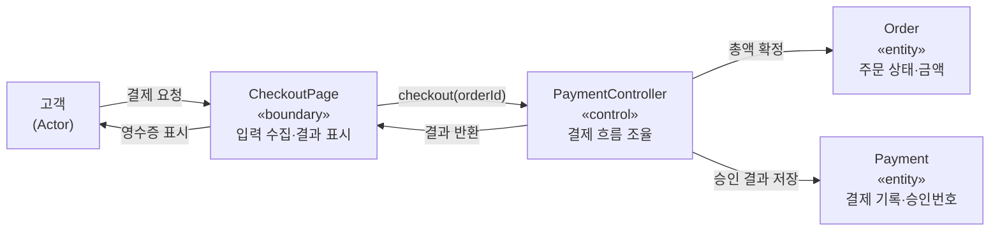

## 들어가며

이 글은 `Process-Essential` 시리즈의 **5단계**입니다. 전체 학습 경로는 [Process Essential Curriculum](/2026/06/19/process-essential-curriculum.html)에서 확인할 수 있습니다.

4단계 [Writing Effective Use Cases: 목표 중심 시나리오](/2026/06/19/writing-effective-use-cases.html)에서는 Alistair Cockburn의 관점으로 **유스케이스를 어떻게 잘 쓰는가**를 다뤘습니다. 목표(goal) 중심으로 주 성공 시나리오와 확장(extension)을 기술하고, 적절한 추상화 수준을 고르는 실무 작법이 핵심이었습니다. 그런데 한 가지 질문이 남습니다. 그렇다면 **유스케이스라는 개념 자체는 어디서 왔으며, 잘 쓴 유스케이스가 그다음 단계의 설계와 코드에 어떻게 흘러 들어가는가?**

그 출발점이 바로 이번 글의 주제인 Ivar Jacobson의 *Object-Oriented Software Engineering: A Use Case Driven Approach*(1992)입니다. 흔히 **OOSE**라고 부르는 이 책은 "use case"라는 단어와 **유스케이스 주도(use-case driven)** 개발이라는 사상을 처음으로 체계화해 세상에 내놓은 원형(原型)입니다. Cockburn의 작법이 "어떻게 쓰는가"라면, Jacobson의 OOSE는 "유스케이스를 **개발 프로세스 전체의 척추(backbone)** 로 삼는다"는 더 큰 그림을 제시합니다.

이번 글에서 우리는 유스케이스의 기원, 유스케이스가 분석·설계로 이어지는 추적성(traceability), 분석 객체를 경계·제어·엔티티(Boundary-Control-Entity)로 나누는 방법, 그리고 유스케이스 시나리오를 테스트 케이스로 연결하는 흐름까지 살펴봅니다. 이렇게 "요구사항의 혈통(lineage)"을 끝까지 추적하는 사고는 6단계 [Continuous Integration: 통합 지옥을 없애는 실천](/2026/06/19/continuous-integration.html)에서 다룰 **현대적 자동화 실천**으로 자연스럽게 이어집니다. 추적성을 사람이 머리로 유지하던 시대에서, 매 커밋마다 자동으로 검증하는 시대로 넘어가는 다리인 셈입니다.

<div class="post-summary-box" markdown="1">

### 📌 이 글에서 다루는 내용

#### 🔍 핵심 주제

- **유스케이스의 기원**: OOSE(1992)에서 "use case"와 use-case driven 사상이 등장한 배경과 핵심 아이디어
- **유스케이스 주도 프로세스**: 요구사항에서 분석·설계로 이어지는 추적성(Traceability)을 만드는 방법
- **분석 객체 모델**: 경계·제어·엔티티(Boundary-Control-Entity) 관점으로 시스템을 분해하기
- **유스케이스에서 테스트로**: 시나리오의 각 단계를 테스트 케이스로 연결하기

</div>

## 유스케이스의 기원: OOSE는 왜 등장했나

**왜 중요한가.** 1980년대 후반, 객체지향 분석/설계(OOAD)는 "객체를 잘 찾자"는 데 집중하고 있었습니다. 명사를 뽑아 클래스로, 동사를 뽑아 메서드로 만드는 식이었죠. 그러나 이 접근에는 결정적 공백이 있었습니다. **사용자가 시스템으로 무엇을 달성하려는가**, 즉 시스템의 외부 가치가 모델 어디에도 명시적으로 남지 않았습니다. 그 결과 "기술적으로는 깔끔하지만 사용자가 원하는 일을 못 하는" 시스템이 흔했습니다.

**개념.** Jacobson은 에릭슨(Ericsson)에서 대규모 통신 시스템을 만들며 얻은 경험을 바탕으로, 스웨덴어 *användningsfall*("사용 사례")을 영어 **use case**로 옮겨 개념화했습니다. 유스케이스의 핵심 정의는 다음과 같습니다.

> 유스케이스는 **하나의 액터(actor)** 가 시스템과 상호작용하여 **관찰 가능한 가치 있는 결과**를 얻기까지의 완결된 행위 흐름이다.

여기서 두 가지가 결정적입니다.

- **액터 중심**: 시스템 내부 구조가 아니라, 외부에서 시스템을 사용하는 역할(사람·외부 시스템)에서 출발합니다.
- **가치 단위**: 유스케이스는 "버튼을 누른다" 같은 조각이 아니라, "주문을 결제한다"처럼 **사용자에게 의미 있는 한 덩어리**의 목표를 표현합니다. 이 점은 4단계에서 본 Cockburn의 goal-level 개념과 정확히 같은 뿌리입니다.

**구체적 예시.** 온라인 서점을 생각해 봅시다. OOSE 이전이라면 곧장 `Book`, `Order`, `Customer` 클래스부터 그렸을 것입니다. OOSE는 먼저 **유스케이스 다이어그램**으로 외부 경계를 그립니다.

```text
[고객]  ──▶  ( 도서 검색 )
[고객]  ──▶  ( 장바구니 담기 )
[고객]  ──▶  ( 주문 결제 )
[관리자] ──▶  ( 재고 보충 )
( 주문 결제 ) ──«include»──▶ ( 결제 수단 검증 )
```

이 그림이 던지는 메시지는 분명합니다. **"시스템이 존재하는 이유는 이 유스케이스들을 수행하기 위해서다."** 객체는 그다음에, 이 유스케이스들을 **실현(realize)** 하기 위해 도출됩니다. 이것이 "use-case driven"의 의미입니다. 객체가 유스케이스를 끌고 가는 게 아니라, **유스케이스가 객체 모델을 끌고 갑니다.**

## 유스케이스 주도 프로세스: 추적성의 척추

**왜 중요한가.** 소프트웨어 프로젝트가 망가지는 흔한 방식은 "왜 이 코드가 여기 있지?"라는 질문에 아무도 답하지 못하는 상태입니다. 요구사항·설계·코드·테스트가 각자 따로 진화하면, 요구가 바뀌었을 때 **어디를 고쳐야 하는지** 추적할 수 없습니다. OOSE의 가장 큰 기여는 이 단절을 메우는 **추적성(traceability)** 의 척추를 세운 것입니다.

**개념.** OOSE는 개발을 하나의 모델에서 멈추지 않고, **여러 모델을 차례로 쌓되 각 모델이 앞 모델로 거슬러 추적되도록** 구성합니다. Jacobson이 제시한 모델 사슬은 대략 다음과 같습니다.

```text
요구사항 모델     →  분석 모델       →  설계 모델        →  구현       →  테스트 모델
(유스케이스)         (B-C-E 객체)       (구체 클래스)        (코드)        (유스케이스별 테스트)
   │                    │                   │                 │               │
   └────────────── 모두 같은 유스케이스로 추적 가능 ─────────────────────────┘
```

핵심은 **유스케이스가 이 모든 단계를 관통하는 식별자(identity)** 역할을 한다는 점입니다.

- 분석 단계의 각 협력(collaboration)은 **어떤 유스케이스를 실현하는지** 명시합니다.
- 설계 클래스는 분석 객체에서 정제되므로, 거꾸로 어떤 유스케이스에 봉사하는지 추적됩니다.
- 테스트 케이스는 유스케이스의 시나리오에서 파생됩니다.

**구체적 예시.** "주문 결제" 유스케이스가 추적성의 척추를 따라 흘러가는 모습입니다.

| 단계 | 산출물 | "주문 결제"의 흔적 |
| --- | --- | --- |
| 요구사항 | 유스케이스 기술서 | 주 성공 시나리오 + 결제 실패 확장 |
| 분석 | B-C-E 협력 | `ResultPage`(경계) · `PaymentController`(제어) · `Order`, `Payment`(엔티티) |
| 설계 | 클래스 다이어그램 | `StripeGateway`, `OrderRepository` 등으로 정제 |
| 테스트 | 테스트 스위트 | "정상 결제", "잔액 부족", "타임아웃" 케이스 |

요구가 "포인트 결제를 추가하자"로 바뀌면, **유스케이스 → 확장 추가 → 제어 객체 수정 → 신규 테스트 케이스** 순으로 변경 경로가 한눈에 보입니다. 추적성이 없다면 이 변경은 코드베이스 전체를 뒤지는 고고학 작업이 되었을 것입니다.

## 분석 객체 모델: 경계·제어·엔티티(B-C-E)

**왜 중요한가.** 유스케이스는 "무엇을"을 말하지만, 그것을 "어떻게" 실현할지는 아직 비어 있습니다. 곧장 구현 클래스로 뛰어들면 UI 기술, 비즈니스 규칙, 데이터 저장이 한 덩어리로 엉켜 변경에 취약해집니다. OOSE는 분석 단계에서 객체를 **세 가지 책임 유형(stereotype)** 으로 나눠 관심사를 분리합니다. 이것이 그 유명한 **Boundary-Control-Entity** 패턴이며, 훗날 MVC, 클린 아키텍처, 헥사고날 아키텍처의 직접적 조상입니다.

**개념.**

- **Boundary(경계)**: 시스템과 액터 사이의 접점. 화면, API 엔드포인트, 외부 시스템 어댑터처럼 **외부와 통신하는 방법이 바뀌면 함께 바뀌는** 객체입니다.
- **Control(제어)**: 하나의 유스케이스 흐름을 **조율(orchestrate)** 하는 객체. 시나리오의 단계 순서, 분기, 트랜잭션 경계를 담당합니다. "유스케이스 한 개 ≈ 제어 객체 한 개"로 시작하는 것이 OOSE의 권장 출발점입니다.
- **Entity(엔티티)**: 장기적으로 유지되는 핵심 도메인 정보와 규칙. UI나 유스케이스가 바뀌어도 **잘 변하지 않는** 안정적 개념(`Order`, `Customer`, `Book`)입니다.

이 분류의 묘미는 **변화의 축이 다르다**는 점입니다. UI가 바뀌면 Boundary가, 업무 절차가 바뀌면 Control이, 도메인 규칙이 바뀌면 Entity가 흔들립니다. 책임을 분리해 두면 한 종류의 변화가 다른 종류로 번지지 않습니다.

**구체적 예시 — "주문 결제"의 협력.**



흐름을 코드 스케치로 옮기면 책임 분리가 더 선명해집니다.

```python
# Entity: 변하지 않는 도메인 정보와 규칙을 보유
class Order:
    def __init__(self, items):
        self.items = items
        self.status = "PENDING"

    def total(self) -> int:
        # 비즈니스 규칙(금액 계산)은 엔티티가 책임진다
        return sum(i.price * i.qty for i in self.items)

    def mark_paid(self):
        self.status = "PAID"


class Payment:  # 결제 결과를 장기 보관하는 엔티티
    def __init__(self, order_id, amount, approval_no):
        self.order_id = order_id
        self.amount = amount
        self.approval_no = approval_no


# Control: 하나의 유스케이스("주문 결제") 흐름을 조율
class PaymentController:
    def __init__(self, gateway, payments):
        self.gateway = gateway      # 외부 결제 게이트웨이(경계 성격의 협력자)
        self.payments = payments    # 엔티티 저장소

    def checkout(self, order: Order):
        amount = order.total()                 # 1) 총액 확정 (Entity에 위임)
        approval = self.gateway.charge(amount)  # 2) 승인 요청
        if not approval.ok:                     # 확장: 결제 실패 분기
            return {"ok": False, "reason": approval.reason}
        order.mark_paid()                       # 3) 상태 전이 (Entity에 위임)
        self.payments.save(Payment(order.id, amount, approval.no))
        return {"ok": True, "approval": approval.no}


# Boundary: 액터와의 접점. 입력을 받고 결과를 표현하는 일만 담당
class CheckoutPage:
    def __init__(self, controller: PaymentController):
        self.controller = controller

    def on_pay_clicked(self, order: Order):
        result = self.controller.checkout(order)  # 흐름 제어는 Control에 위임
        if result["ok"]:
            self.render(f"결제 완료: 승인번호 {result['approval']}")
        else:
            self.render(f"결제 실패: {result['reason']}")

    def render(self, message: str):
        print(message)  # 실제로는 화면/응답으로 출력
```

`CheckoutPage`는 결제가 **어떻게** 일어나는지 모르고, `Order`는 화면이 무엇인지 모릅니다. 흐름의 지식은 오직 `PaymentController`에 모여 있습니다. 덕분에 UI를 웹에서 모바일로 바꿔도, 게이트웨이를 교체해도, 영향 범위가 한 유형에 국한됩니다.

## 유스케이스에서 테스트로: 시나리오를 테스트 케이스로

**왜 중요한가.** 추적성의 사슬은 테스트에서 닫혀야 비로소 가치를 발휘합니다. "이 유스케이스가 정말로 동작하는가?"를 검증하지 못하면, 앞에서 쌓은 모델들은 그저 문서일 뿐입니다. OOSE는 **유스케이스를 검증의 기본 단위**로 삼습니다. 즉, 잘 쓴 시나리오는 그 자체가 **테스트 설계서**입니다.

**개념.** 유스케이스 기술서의 구조가 곧 테스트 케이스의 구조로 사상(mapping)됩니다.

- **주 성공 시나리오(main success scenario)** → 정상 경로(happy path) 테스트 한 건 이상.
- **각 확장/대안 흐름(extension)** → 해당 분기를 강제로 발생시키는 테스트 한 건씩.
- **사전 조건(precondition)** → 테스트의 setup/fixture.
- **사후 조건(postcondition) / 보장(guarantee)** → 테스트의 단언(assertion).

이렇게 하면 "테스트를 무엇부터 짜야 하나"라는 막막함이 사라집니다. **시나리오의 분기 개수가 곧 최소 테스트 개수**의 출발점이 됩니다.

**구체적 예시.** "주문 결제" 유스케이스의 시나리오를 테스트로 펼쳐 봅니다.

```text
유스케이스: 주문 결제
사전조건: 장바구니에 1개 이상 항목이 있다 → [fixture: 항목 2개 담긴 Order]

주 성공 시나리오
  1. 고객이 결제를 요청한다
  2. 시스템이 총액을 계산한다
  3. 시스템이 결제를 승인받는다
  4. 시스템이 주문을 PAID로 전이하고 영수증을 보여준다
사후조건: Order.status == "PAID", Payment 기록이 저장됨

확장
  3a. 잔액 부족으로 승인 실패  → 주문 상태 유지, 실패 사유 표시
  3b. 게이트웨이 타임아웃       → 재시도 안내, 주문 상태 유지
```

이 시나리오는 다음 테스트 매트릭스로 곧장 번역됩니다.

| 시나리오 단계 | 테스트 케이스 | 핵심 단언(assertion) |
| --- | --- | --- |
| 주 성공 1–4 | `test_정상_결제` | `status == "PAID"`, `Payment` 저장됨 |
| 확장 3a | `test_잔액_부족_시_상태_유지` | `status == "PENDING"`, 실패 사유 노출 |
| 확장 3b | `test_타임아웃_시_재시도_안내` | `status == "PENDING"`, 재시도 메시지 |

테스트 코드로 옮기면 시나리오와 일대일로 대응합니다.

```python
def test_정상_결제():
    order = Order(items=[Item(10000, 1), Item(5000, 1)])  # 사전조건(fixture)
    controller = PaymentController(FakeGateway(ok=True, no="A1"), InMemoryPayments())
    result = controller.checkout(order)                    # 주 성공 시나리오 실행
    assert result["ok"] is True                            # 사후조건
    assert order.status == "PAID"


def test_잔액_부족_시_상태_유지():
    order = Order(items=[Item(10000, 1)])
    controller = PaymentController(FakeGateway(ok=False, reason="잔액 부족"), InMemoryPayments())
    result = controller.checkout(order)                    # 확장 3a 강제 발생
    assert result["ok"] is False
    assert order.status == "PENDING"                       # 상태가 유지되는지 검증
```

여기서 추적성이 끝까지 닫힙니다. **요구(유스케이스) → 분석(B-C-E) → 설계/코드(Controller) → 테스트(시나리오별 케이스)** 가 하나의 식별자로 연결됩니다. 어떤 테스트가 깨졌을 때 "이건 어느 유스케이스의 어느 분기 문제다"라고 즉시 말할 수 있고, 반대로 요구가 바뀌면 "어느 테스트를 추가/수정해야 하는가"가 자명해집니다.

## 마무리

OOSE의 통찰을 한 문장으로 줄이면 이렇습니다. **유스케이스를 개발의 척추로 세우면, 요구사항부터 테스트까지 하나의 혈통으로 추적할 수 있다.** 우리는 use case라는 개념의 기원과 "use-case driven"의 의미를 짚었고, 유스케이스가 분석·설계·테스트를 관통하는 추적성을 만든다는 점을 보았습니다. 분석 단계에서는 경계·제어·엔티티로 책임을 분리해 변화의 축을 갈라놓았고, 마지막으로 시나리오의 주 흐름과 확장을 테스트 케이스로 펼쳐 추적성의 사슬을 닫았습니다.

그런데 Jacobson 시대에는 이 추적성을 **사람이 머리와 문서로** 유지했습니다. 모델이 커지고 팀이 늘면 "마지막으로 모두를 합쳐 보니 모든 게 깨져 있더라"는 통합 지옥(integration hell)이 기다리고 있었죠. 다음 단계에서는 이 요구사항-테스트의 혈통을 **매 변경마다 자동으로 검증**하는 현대적 실천으로 넘어갑니다. 즉, 유스케이스에서 도출한 테스트들을 사람이 가끔 돌리는 게 아니라, 통합과 동시에 끊임없이 돌리는 방식입니다.

### 다음 학습

- 시리즈 전체 경로: [Process Essential Curriculum](/2026/06/19/process-essential-curriculum.html)
- 이전 단계 다시 보기 (4단계): [Writing Effective Use Cases: 목표 중심 시나리오](/2026/06/19/writing-effective-use-cases.html)
- 다음 단계 (6단계): [Continuous Integration: 통합 지옥을 없애는 실천](/2026/06/19/continuous-integration.html)
