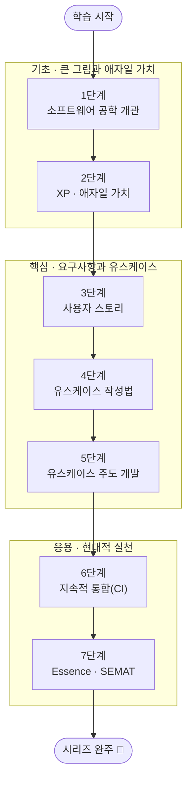

<figure class="post-figure post-figure--header">
<svg role="img" aria-label="Process-Essential 7단계 학습 여정을 왼쪽에서 오른쪽으로 오르는 세 단의 계단으로 그린 그림. 가장 낮은 단은 기초로 1단계 소프트웨어 공학 개관과 2단계 XP·애자일 가치가 놓이고, 가운데 단은 핵심으로 3단계 사용자 스토리, 4단계 유스케이스 작성법, 5단계 유스케이스 주도 개발이 놓이며, 가장 높은 단은 응용으로 6단계 지속적 통합(CI)과 7단계 Essence·SEMAT가 놓인다. 계단 전체를 가로지르며 프로세스 축과 요구사항 축이라는 두 줄기가 함께 오르고, 마지막에 완주 깃발이 꽂혀 있다." viewBox="0 0 680 320" xmlns="http://www.w3.org/2000/svg">
  <title>Process-Essential 학습 여정 — 기초(공학·애자일)에서 핵심(요구사항·유스케이스)을 거쳐 응용(CI·Essence)까지 오르는 7단계 계단</title>

  <!-- ===== two through-line axes climbing across all stages ===== -->
  <text x="40" y="34" font-size="11.5" fill="currentColor" font-weight="700" opacity="0.8">프로세스 · 요구사항 두 축이 함께 오른다</text>
  <line x1="44" y1="264" x2="606" y2="120" stroke="var(--secondary-color)" stroke-width="2.5" stroke-dasharray="2 5" opacity="0.7"/>
  <line x1="44" y1="276" x2="606" y2="132" stroke="var(--accent-color)" stroke-width="2.5" stroke-dasharray="2 5" opacity="0.7"/>

  <!-- ===== FOUNDATION step (lowest) ===== -->
  <rect x="36" y="206" width="192" height="84" rx="4" fill="var(--bg-light)" stroke="currentColor" stroke-width="1.8"/>
  <text x="132" y="226" text-anchor="middle" font-size="11" fill="currentColor" font-weight="700" opacity="0.75">기초 · 큰 그림과 애자일 가치</text>
  <rect x="48" y="234" width="80" height="46" rx="3" fill="var(--bg-panel)" stroke="currentColor" stroke-width="1.6"/>
  <text x="88" y="252" text-anchor="middle" font-size="9.5" fill="currentColor" font-weight="700">1단계</text>
  <text x="88" y="266" text-anchor="middle" font-size="8" fill="currentColor" opacity="0.85">공학 개관</text>
  <rect x="136" y="234" width="80" height="46" rx="3" fill="var(--bg-panel)" stroke="currentColor" stroke-width="1.6"/>
  <text x="176" y="252" text-anchor="middle" font-size="9.5" fill="currentColor" font-weight="700">2단계</text>
  <text x="176" y="266" text-anchor="middle" font-size="8" fill="currentColor" opacity="0.85">XP·애자일</text>

  <!-- ===== CORE step (middle) ===== -->
  <rect x="236" y="138" width="284" height="84" rx="4" fill="var(--bg-light)" stroke="currentColor" stroke-width="1.8"/>
  <text x="378" y="158" text-anchor="middle" font-size="11" fill="currentColor" font-weight="700" opacity="0.75">핵심 · 요구사항과 유스케이스</text>
  <rect x="248" y="166" width="80" height="46" rx="3" fill="var(--bg-panel)" stroke="currentColor" stroke-width="1.6"/>
  <text x="288" y="184" text-anchor="middle" font-size="9.5" fill="currentColor" font-weight="700">3단계</text>
  <text x="288" y="198" text-anchor="middle" font-size="8" fill="currentColor" opacity="0.85">사용자 스토리</text>
  <rect x="336" y="166" width="80" height="46" rx="3" fill="var(--bg-panel)" stroke="currentColor" stroke-width="1.6"/>
  <text x="376" y="184" text-anchor="middle" font-size="9.5" fill="currentColor" font-weight="700">4단계</text>
  <text x="376" y="198" text-anchor="middle" font-size="8" fill="currentColor" opacity="0.85">유스케이스</text>
  <rect x="424" y="166" width="80" height="46" rx="3" fill="var(--bg-panel)" stroke="currentColor" stroke-width="1.6"/>
  <text x="464" y="184" text-anchor="middle" font-size="9.5" fill="currentColor" font-weight="700">5단계</text>
  <text x="464" y="198" text-anchor="middle" font-size="8" fill="currentColor" opacity="0.85">UC 주도</text>

  <!-- ===== APPLY step (highest) ===== -->
  <rect x="428" y="70" width="216" height="84" rx="4" fill="var(--bg-light)" stroke="var(--accent-color)" stroke-width="2.2"/>
  <text x="536" y="90" text-anchor="middle" font-size="11" fill="currentColor" font-weight="700" opacity="0.75">응용 · 현대적 실천</text>
  <rect x="440" y="98" width="92" height="46" rx="3" fill="var(--bg-panel)" stroke="currentColor" stroke-width="1.6"/>
  <text x="486" y="116" text-anchor="middle" font-size="9.5" fill="currentColor" font-weight="700">6단계</text>
  <text x="486" y="130" text-anchor="middle" font-size="8" fill="currentColor" opacity="0.85">지속적 통합</text>
  <rect x="540" y="98" width="92" height="46" rx="3" fill="var(--bg-panel)" stroke="currentColor" stroke-width="1.6"/>
  <text x="586" y="116" text-anchor="middle" font-size="9.5" fill="currentColor" font-weight="700">7단계</text>
  <text x="586" y="130" text-anchor="middle" font-size="8" fill="currentColor" opacity="0.85">Essence</text>

  <!-- ===== summit flag (완주) ===== -->
  <line x1="600" y1="70" x2="600" y2="34" stroke="var(--gold)" stroke-width="2.5"/>
  <path d="M600,36 L632,44 L600,52 z" fill="var(--gold)" stroke="var(--gold)" stroke-width="1"/>
  <text x="596" y="28" text-anchor="end" font-size="10" fill="currentColor" font-weight="700">완주 🎉</text>

  <!-- ===== climb arrows between steps ===== -->
  <path d="M226,224 L246,210" fill="none" stroke="var(--gold)" stroke-width="2.5" marker-end="url(#pe-arrow)"/>
  <path d="M514,156 L534,142" fill="none" stroke="var(--gold)" stroke-width="2.5" marker-end="url(#pe-arrow)"/>

  <defs>
    <marker id="pe-arrow" markerWidth="9" markerHeight="9" refX="6" refY="4.5" orient="auto">
      <path d="M0,0 L9,4.5 L0,9 z" fill="var(--gold)"/>
    </marker>
  </defs>
</svg>
<figcaption>7단계 학습 여정을 오르는 세 단의 계단 — <strong>기초</strong>(공학 개관·XP 애자일 가치)에서 <strong>핵심</strong>(사용자 스토리·유스케이스·UC 주도 개발)을 거쳐 <strong>응용</strong>(지속적 통합·Essence)으로 올라간다. 계단 전체를 가로지르는 두 줄기는 이 시리즈가 함께 다지는 <strong>프로세스</strong>와 <strong>요구사항</strong> 두 축으로, 마지막에 완주 깃발이 꽂힌다.</figcaption>
</figure>

## 소개

좋은 코드를 짜는 능력만으로는 좋은 소프트웨어가 만들어지지 않습니다. "무엇을 만들 것인가"를 정의하는 **요구사항(Requirements)**, 그 요구사항을 작동하는 결과물로 흘려보내는 **프로세스(Process)**가 함께 단단해야 합니다. 애자일은 이 두 축을 무겁게 만들지 않으면서도 변화에 유연하게 대응하는 방법을 제시하며, 그 뿌리에는 수십 년에 걸쳐 검증된 고전들이 있습니다.

이 커리큘럼은 그 뼈대가 되는 7권의 책을 한 단계씩 정복하는 학습 트랙입니다. **기초**에서 Pressman으로 소프트웨어 공학의 큰 그림을, Beck으로 애자일의 가치와 실천을 익힙니다. **핵심**에서는 Cohn의 사용자 스토리, Cockburn의 유스케이스 작성법, 그리고 Jacobson의 OOSE로 요구사항을 다루는 세 가지 관점을 깊이 파고듭니다. **응용**에서는 Duvall의 CI로 현대적 통합 실천을, Jacobson의 Essence로 "방법론 감옥"을 벗어나는 사고법을 배웁니다.

이 글은 `Process-Essential` 시리즈의 **마스터 로드맵**입니다. 각 책의 핵심 항목을 정복할 때마다 체크박스를 채우고 상세 포스트를 연결하는 **도장깨기** 방식으로 진행 상황을 추적합니다. 완료한 항목이 늘어날수록 진행률이 차오르는 모습을 나침반 삼아 한 단계씩 나아가 보세요.

## 학습 흐름

7단계는 아래 순서대로 진행하는 것을 권장합니다. **기초**(공학의 큰 그림·애자일 가치)로 토대를 다지고, **핵심**(요구사항·유스케이스)으로 무엇을 만들지 정의하는 힘을 기른 뒤, **응용**(CI·Essence)으로 현대적 실천과 방법론을 보는 눈을 완성하는 흐름입니다.

## 학습 진행 현황

> 완료한 항목에는 상세 포스트 링크가 연결됩니다. 학습이 진행될 때마다 체크박스와 진행률을 갱신합니다.

- 현재 완료한 항목: **32개**
- 전체 항목: **32개**
- 진행률: **100%** 🎉

## 1단계: Software Engineering: A Practitioner's Approach (Roger Pressman) — 소프트웨어 공학 개관

소프트웨어 공학 전반을 다루는 교과서적 고전입니다. 프로세스 모델, 요구사항, 설계, 품질, 관리까지 분야의 지형도를 한눈에 그려 주어, 이후 단계에서 만날 세부 주제들이 전체 어디에 위치하는지 가늠하는 좌표가 됩니다.

- [x] **소프트웨어 프로세스**: 프로세스 모델의 의미와 폭포수·반복·점진 모델 비교 — [[상세](/2026/06/19/software-engineering-practitioners-approach.html)]
- [x] **요구사항 공학(Requirements Engineering)**: 도출·분석·명세·검증의 전체 흐름 — [[상세](/2026/06/19/software-engineering-practitioners-approach.html)]
- [x] **설계와 품질**: 설계 원칙과 품질 속성, 그리고 검증·확인(V&V)의 개념 — [[상세](/2026/06/19/software-engineering-practitioners-approach.html)]
- [x] **프로세스와 프로젝트 관리**: 추정·일정·위험 관리의 기본 어휘 — [[상세](/2026/06/19/software-engineering-practitioners-approach.html)]
- [x] **분야의 지형도**: 이후 단계(XP·스토리·유스케이스·CI)가 전체에서 차지하는 위치 파악 — [[상세](/2026/06/19/software-engineering-practitioners-approach.html)]

## 2단계: Extreme Programming Explained: Embrace Change (Kent Beck) — XP와 애자일 가치

애자일의 정수를 담은 책으로, 변화를 적으로 보지 않고 끌어안는(Embrace Change) 태도를 제시합니다. 가치-원칙-실천으로 이어지는 구조를 통해, 짧은 피드백 루프가 어떻게 소프트웨어 개발의 비용 곡선을 바꾸는지 배웁니다.

- [x] **가치·원칙·실천**: 의사소통·단순성·피드백·용기·존중과 이를 잇는 실천들 — [[상세](/2026/06/19/extreme-programming-explained.html)]
- [x] **짧은 피드백 루프**: 작은 릴리스, 지속적 통합, 페어 프로그래밍의 효과 — [[상세](/2026/06/19/extreme-programming-explained.html)]
- [x] **변화를 끌어안기**: 변경 비용 곡선과 점진적 설계(Incremental Design) — [[상세](/2026/06/19/extreme-programming-explained.html)]
- [x] **계획 게임(Planning Game)**: 고객과 개발자가 함께 짜는 반복 계획 — [[상세](/2026/06/19/extreme-programming-explained.html)]

## 3단계: User Stories Applied (Mike Cohn) — 사용자 스토리

요구사항을 가벼운 대화의 약속으로 다루는 사용자 스토리 기법을 설명합니다. "카드·대화·확인(Card, Conversation, Confirmation)" 3C와 INVEST 기준을 통해, 무겁지 않으면서도 검증 가능한 요구사항 단위를 만드는 법을 익힙니다.

- [x] **스토리의 3C**: Card(카드)·Conversation(대화)·Confirmation(확인) — [[상세](/2026/06/19/user-stories-applied.html)]
- [x] **INVEST 기준**: 좋은 스토리의 6가지 속성과 적용법 — [[상세](/2026/06/19/user-stories-applied.html)]
- [x] **스토리 분할(Splitting)**: 큰 에픽을 작고 가치 있는 단위로 쪼개기 — [[상세](/2026/06/19/user-stories-applied.html)]
- [x] **추정과 계획**: 스토리 포인트, 속도(Velocity), 릴리스 계획 — [[상세](/2026/06/19/user-stories-applied.html)]
- [x] **인수 조건(Acceptance Criteria)**: 완료의 정의와 테스트로 이어지는 확인 — [[상세](/2026/06/19/user-stories-applied.html)]

## 4단계: Writing Effective Use Cases (Alistair Cockburn) — 유스케이스 작성법

시스템과 사용자의 상호작용을 목표 중심으로 서술하는 유스케이스 작성법을 다룹니다. 주 성공 시나리오와 확장(예외) 흐름을 구분하고, 목표 수준과 범위를 명확히 함으로써 읽기 쉽고 검증 가능한 요구사항 문서를 만드는 법을 배웁니다.

- [x] **목표 중심 서술**: 액터(Actor)와 목표(Goal), 주 액터·지원 액터 구분 — [[상세](/2026/06/19/writing-effective-use-cases.html)]
- [x] **주 성공 시나리오와 확장**: Main Success Scenario와 Extension(예외) 흐름 — [[상세](/2026/06/19/writing-effective-use-cases.html)]
- [x] **목표 수준과 범위**: Summary·User-goal·Subfunction 수준, 시스템 경계 정의 — [[상세](/2026/06/19/writing-effective-use-cases.html)]
- [x] **전제·보장 조건**: Preconditions와 Guarantees로 계약 명세하기 — [[상세](/2026/06/19/writing-effective-use-cases.html)]
- [x] **스토리와 유스케이스의 관계**: 언제 무엇을 쓸지에 대한 판단 기준 — [[상세](/2026/06/19/writing-effective-use-cases.html)]

## 5단계: Object-Oriented Software Engineering: A Use Case Driven Approach (Ivar Jacobson) — 유스케이스 주도 개발

1992년 출간된 이 책은 유스케이스라는 개념의 기원이자, 유스케이스를 출발점으로 분석·설계·구현·테스트를 일관되게 끌고 가는 "유스케이스 주도(Use Case Driven)" 개발의 원형을 제시합니다. 요구사항이 어떻게 객체 모델과 테스트로 흘러내려 가는지 그 계보를 이해하는 단계입니다.

- [x] **유스케이스의 기원**: 개념이 등장한 배경과 핵심 아이디어 — [[상세](/2026/06/19/oose-use-case-driven.html)]
- [x] **유스케이스 주도 프로세스**: 요구사항에서 분석·설계로 이어지는 추적성(Traceability) — [[상세](/2026/06/19/oose-use-case-driven.html)]
- [x] **분석 객체 모델**: 경계·제어·엔티티(Boundary-Control-Entity) 관점의 분해 — [[상세](/2026/06/19/oose-use-case-driven.html)]
- [x] **유스케이스에서 테스트로**: 시나리오를 테스트 케이스로 연결하기 — [[상세](/2026/06/19/oose-use-case-driven.html)]

## 6단계: Continuous Integration (Paul Duvall et al.) — 지속적 통합(CI)

XP의 핵심 실천인 지속적 통합을 본격적으로 다룹니다. 코드를 자주 통합하고 자동으로 빌드·테스트함으로써 "통합 지옥"을 없애는 메커니즘과, 신뢰할 수 있는 빌드 파이프라인을 세우는 실천 원칙을 배웁니다.

- [x] **CI의 원칙**: 잦은 커밋, 자동 빌드, 빠른 피드백의 의미 — [[상세](/2026/06/19/continuous-integration.html)]
- [x] **자동화된 빌드와 테스트**: 빌드 스크립트와 자동 테스트 스위트 구성 — [[상세](/2026/06/19/continuous-integration.html)]
- [x] **CI 서버와 파이프라인**: 빌드 트리거, 상태 가시화, 깨진 빌드 대응 — [[상세](/2026/06/19/continuous-integration.html)]
- [x] **품질 피드백**: 정적 분석·커버리지·데이터베이스 통합 등 확장 실천 — [[상세](/2026/06/19/continuous-integration.html)]
- [x] **배포로의 연결**: CI에서 지속적 배포(Continuous Delivery)로 가는 길 — [[상세](/2026/06/19/continuous-integration.html)]

## 7단계: The Essentials of Modern Software Engineering (Ivar Jacobson et al.) — Essence와 SEMAT

특정 방법론에 갇히지 않고 모든 개발에 공통된 본질을 다루는 Essence/SEMAT 사고법을 제시합니다. 방법론을 실천(Practice)들의 조합으로 보고, 팀의 상태를 알파(Alpha)로 추적함으로써 "방법론 감옥(Method Prison)"에서 벗어나는 관점을 익힙니다.

- [x] **방법론 감옥에서 탈출**: 방법론 전쟁을 넘어서는 Essence의 문제의식 — [[상세](/2026/06/19/essentials-of-modern-software-engineering.html)]
- [x] **공통 기반(Kernel)과 알파(Alpha)**: 모든 개발에 공통된 본질과 진행 상태 추적 — [[상세](/2026/06/19/essentials-of-modern-software-engineering.html)]
- [x] **실천(Practice)의 조합**: 방법을 레고처럼 조립하기, Practice 라이브러리 — [[상세](/2026/06/19/essentials-of-modern-software-engineering.html)]
- [x] **팀의 상태 점검**: 알파 카드로 진행 상황을 시각화하고 다음 행동 정하기 — [[상세](/2026/06/19/essentials-of-modern-software-engineering.html)]

## 핵심 포인트

- **프로세스와 요구사항은 한 쌍입니다**: "어떻게 일할 것인가(프로세스)"와 "무엇을 만들 것인가(요구사항)"는 분리되지 않습니다. 두 축을 함께 단단히 다지세요.
- **가벼움이 곧 애자일은 아닙니다**: 사용자 스토리(가벼움)와 유스케이스(상세함)는 대립이 아니라 상황에 맞게 고르는 도구입니다. 둘의 장단을 모두 익히세요.
- **요구사항은 추적 가능해야 합니다**: 스토리·유스케이스가 테스트와 설계로 연결될 때 비로소 변화에 강한 개발이 됩니다(3·4·5단계의 공통 주제).
- **실천은 피드백으로 작동합니다**: XP와 CI의 힘은 모두 짧고 자동화된 피드백 루프에서 나옵니다.
- **방법론을 도구로 보세요**: Essence는 "정답 방법론"을 강요하지 않습니다. 실천을 조합하고 팀 상태를 점검하는 메타적 시야를 기르세요.

## 추천 학습 순서

먼저 1단계 Pressman으로 분야 전체의 지도를 그려 길을 잃지 않을 좌표를 확보하고, 2단계 Beck으로 애자일의 가치와 짧은 피드백 루프라는 핵심 신념을 세웁니다. 이어 핵심 묶음에서는 가벼운 사용자 스토리(3단계 Cohn)로 요구사항을 다루는 감각을 먼저 익힌 뒤, 더 상세한 유스케이스 작성법(4단계 Cockburn)으로 정밀도를 높이고, 그 개념의 기원이자 추적성을 강조하는 OOSE(5단계 Jacobson)로 뿌리를 이해하는 순서가 자연스럽습니다. 마지막 응용 묶음에서는 XP의 실천을 구체화하는 CI(6단계 Duvall)를 손에 익힌 뒤, 모든 방법론을 메타적으로 바라보는 Essence(7단계 Jacobson)로 시야를 넓히며 마무리합니다.

## 결론

7권의 고전은 각자 다른 시대와 관점에서 쓰였지만, "변화에 유연하면서도 무엇을 만들지 명확히 한다"는 하나의 목표를 향합니다. 큰 그림에서 애자일 가치로, 다시 요구사항을 다루는 세 가지 기법으로, 그리고 현대적 실천과 메타적 시야로 이어지는 이 흐름을 따라가면 프로세스와 요구사항이라는 두 축을 함께 단단하게 세울 수 있습니다.

이 로드맵을 나침반 삼아 각 단계를 하나씩 정복하고, 완료할 때마다 체크박스를 채워 진행 상황을 시각적으로 확인해 보세요. 한 권 한 권 도장을 깰 때마다 "코드를 짜는 개발자"에서 "올바른 것을 만드는 엔지니어"로 한 걸음씩 나아가게 될 것입니다.

### 다음 학습 (Next Learning)

- [Testing-Refactoring Essential Curriculum](/2026/06/19/testing-refactoring-essential-curriculum.html) — XP·CI를 떠받치는 TDD·리팩터링
- [Architecture Essential Curriculum](/2026/06/19/architecture-essential-curriculum.html) — 요구사항에서 아키텍처로
- [OO-Design Essential Curriculum](/2026/06/19/oo-design-essential-curriculum.html) — 유스케이스에서 객체 설계로
