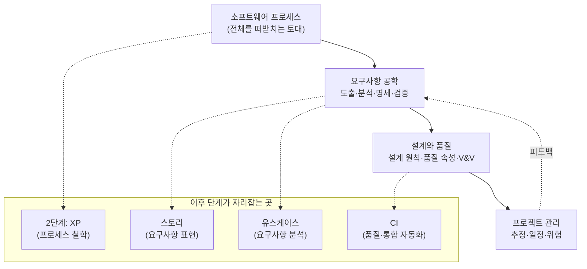
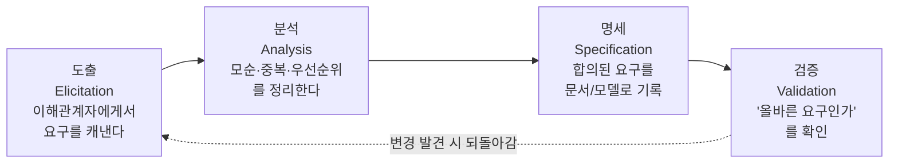

<figure class="post-figure post-figure--header">
<svg role="img" aria-label="소프트웨어 공학의 전체 지형도를 한 장에 담은 그림. 맨 아래에 '소프트웨어 프로세스'라는 폭넓은 토대 띠가 깔리고, 그 위에 요구사항 공학·설계와 품질·프로젝트 관리 세 개의 활동 봉우리가 솟아 있다. 세 봉우리를 가로지르는 점선 리본이 활동들 사이를 오가는 피드백 되먹임을 나타낸다. 토대 띠 아래에는 폭포수·반복·점진이라는 세 가지 프로세스 리듬이 작게 표시된다." viewBox="0 0 680 320" xmlns="http://www.w3.org/2000/svg">
  <title>소프트웨어 공학의 지형도 — 프로세스 토대 위에 요구·설계/품질·관리가 얹히고 피드백으로 묶인다</title>

  <text x="340" y="26" text-anchor="middle" font-size="13" fill="currentColor" font-weight="700" opacity="0.8">소프트웨어 공학의 지형도</text>

  <!-- ===== feedback ribbon weaving across the three peaks ===== -->
  <path d="M118,118 C220,70 300,150 380,104 C460,60 540,150 600,104" fill="none" stroke="var(--secondary-color)" stroke-width="2" stroke-dasharray="5 5" opacity="0.85"/>
  <text x="600" y="92" text-anchor="end" font-size="9" fill="currentColor" opacity="0.7">피드백 되먹임</text>

  <!-- ===== three activity peaks ===== -->
  <!-- Requirements -->
  <rect x="64" y="120" width="160" height="86" rx="4" fill="var(--bg-light)" stroke="currentColor" stroke-width="2"/>
  <text x="144" y="150" text-anchor="middle" font-size="13" fill="currentColor" font-weight="700">요구사항 공학</text>
  <text x="144" y="170" text-anchor="middle" font-size="9.5" fill="currentColor" opacity="0.8">도출 · 분석</text>
  <text x="144" y="186" text-anchor="middle" font-size="9.5" fill="currentColor" opacity="0.8">명세 · 검증</text>

  <!-- Design and Quality -->
  <rect x="244" y="120" width="160" height="86" rx="4" fill="var(--bg-light)" stroke="var(--accent-color)" stroke-width="2.5"/>
  <text x="324" y="150" text-anchor="middle" font-size="13" fill="currentColor" font-weight="700">설계와 품질</text>
  <text x="324" y="170" text-anchor="middle" font-size="9.5" fill="currentColor" opacity="0.8">설계 원칙 · 품질 속성</text>
  <text x="324" y="186" text-anchor="middle" font-size="9.5" fill="currentColor" opacity="0.8">검증 · 확인 (V&amp;V)</text>

  <!-- Project Management -->
  <rect x="424" y="120" width="160" height="86" rx="4" fill="var(--bg-light)" stroke="currentColor" stroke-width="2"/>
  <text x="504" y="150" text-anchor="middle" font-size="13" fill="currentColor" font-weight="700">프로젝트 관리</text>
  <text x="504" y="170" text-anchor="middle" font-size="9.5" fill="currentColor" opacity="0.8">추정 · 일정</text>
  <text x="504" y="186" text-anchor="middle" font-size="9.5" fill="currentColor" opacity="0.8">위험 관리</text>

  <!-- ===== process foundation band ===== -->
  <rect x="48" y="224" width="584" height="44" rx="5" fill="var(--bg-panel)" stroke="var(--gold)" stroke-width="2.5"/>
  <text x="340" y="251" text-anchor="middle" font-size="14" fill="currentColor" font-weight="700">소프트웨어 프로세스 — 전체를 떠받치는 토대</text>

  <!-- little legs from peaks to foundation -->
  <line x1="144" y1="206" x2="144" y2="224" stroke="currentColor" stroke-width="1.5" opacity="0.55"/>
  <line x1="324" y1="206" x2="324" y2="224" stroke="currentColor" stroke-width="1.5" opacity="0.55"/>
  <line x1="504" y1="206" x2="504" y2="224" stroke="currentColor" stroke-width="1.5" opacity="0.55"/>

  <!-- ===== three process rhythms under the foundation ===== -->
  <text x="138" y="294" text-anchor="middle" font-size="10" fill="currentColor" opacity="0.85" font-weight="700">폭포수</text>
  <text x="340" y="294" text-anchor="middle" font-size="10" fill="currentColor" opacity="0.85" font-weight="700">반복</text>
  <text x="542" y="294" text-anchor="middle" font-size="10" fill="currentColor" opacity="0.85" font-weight="700">점진</text>
  <text x="234" y="294" text-anchor="middle" font-size="10" fill="currentColor" opacity="0.5">·</text>
  <text x="441" y="294" text-anchor="middle" font-size="10" fill="currentColor" opacity="0.5">·</text>
  <text x="340" y="312" text-anchor="middle" font-size="8.5" fill="currentColor" opacity="0.6">토대를 흐르는 세 가지 리듬</text>
</svg>
<figcaption>이 글의 지형도 한 장 요약 — 맨 아래 <strong>소프트웨어 프로세스</strong>가 전체를 떠받치는 토대이고, 그 위에 <strong>요구사항 공학 · 설계와 품질 · 프로젝트 관리</strong> 세 활동이 얹힌다. 활동들은 한 방향이 아니라 점선 리본처럼 <strong>피드백</strong>으로 서로 오간다. 토대를 흐르는 리듬이 폭포수 · 반복 · 점진이다.</figcaption>
</figure>

## 들어가며

이 글은 `Process-Essential` 시리즈의 **1단계**입니다. 시리즈 전체 계획은 [Process Essential Curriculum](/2026/06/19/process-essential-curriculum.html)에서 확인할 수 있습니다.

특정 기법을 깊게 파기 전에, 먼저 **분야의 지도를 그리는 일**이 왜 중요할까요? 소프트웨어 공학은 코딩이라는 한 점이 아니라, 요구사항을 캐내고(elicitation), 설계로 옮기고, 품질을 검증하고, 일정과 위험을 관리하는 거대한 활동의 묶음입니다. 어느 한 기법(예: TDD, 유스케이스, CI)을 배울 때 "이게 전체에서 어디쯤인가?"를 모르면, 도구는 손에 쥐었지만 지도 없이 숲을 헤매는 것과 같습니다. 그래서 1단계는 의도적으로 **survey(개관)** 성격을 가집니다. 세부 기법은 2단계 이후에 하나씩 정복하되, 지금은 큰 그림을 머릿속에 박아 둡니다.

길잡이로 삼는 책은 Roger S. Pressman의 *Software Engineering: A Practitioner's Approach*입니다. 이 책은 수십 년간 대학과 현업에서 표준 교과서로 쓰인 고전으로, 소프트웨어 공학을 **프로세스(process) → 모델링(modeling) → 품질과 관리(quality & management)**라는 층위로 나누어 체계적으로 다룹니다. "Practitioner's Approach"라는 부제처럼, 이론을 위한 이론이 아니라 실무자가 매일 마주치는 활동을 정돈하는 데 초점이 있습니다. 우리는 이 책의 뼈대를 빌려 시리즈 전체의 좌표계를 세웁니다.

이 지도를 다 그리고 나면, **2단계: [XP Explained: 변화를 끌어안는 애자일](/2026/06/19/extreme-programming-explained.html)**로 내려가 "변화를 적으로 보지 않고 끌어안는" 구체적인 프로세스 철학을 살펴봅니다. 즉 1단계가 대륙 전체의 지도라면, 2단계는 그 안의 한 도시를 확대해 들어가는 셈입니다.

<div class="post-summary-box" markdown="1">

### 📌 이 글에서 다루는 내용

#### 🔍 핵심 주제

- **소프트웨어 프로세스**: 프로세스 모델의 의미와 폭포수·반복·점진 모델 비교
- **요구사항 공학(Requirements Engineering)**: 도출·분석·명세·검증의 전체 흐름
- **설계와 품질**: 설계 원칙과 품질 속성, 그리고 검증·확인(V&V)의 개념
- **프로세스와 프로젝트 관리**: 추정·일정·위험 관리의 기본 어휘
- **분야의 지형도**: 이후 단계(XP·스토리·유스케이스·CI)가 전체에서 차지하는 위치 파악

</div>

## 분야의 지형도: 전체 활동을 한 장으로

세부로 들어가기 전에 전체 그림부터 봅시다. Pressman은 소프트웨어 공학을 **프로세스라는 토대 위에 모델링·관리·품질 활동이 얹히는 구조**로 설명합니다. 아래 다이어그램은 이 시리즈가 다룰 영역을 한 장에 담은 것입니다.



이 지도에서 기억할 핵심은 두 가지입니다. 첫째, **모든 활동은 프로세스라는 토대 위에서 일어난다**는 것. 둘째, 화살표는 한 방향이 아니라 **피드백 루프**를 그린다는 것입니다. 요구사항이 설계를 낳고, 설계가 관리 계획을 낳지만, 그 과정에서 발견된 사실이 다시 요구사항을 수정합니다. 이 "되먹임"이 폭포수와 반복형을 가르는 본질입니다.

이후 단계들의 위치도 미리 짚어 둡니다. 2단계 XP는 **프로세스** 영역의 한 학파이고, 사용자 스토리와 유스케이스는 **요구사항** 영역을 표현·분석하는 두 가지 도구이며, CI는 **품질** 영역을 자동화하는 실천입니다. 이렇게 좌표를 잡아 두면, 앞으로 배울 각 기법이 따로 노는 지식이 아니라 한 지도 위의 지명으로 연결됩니다.

## 소프트웨어 프로세스: 프로세스 모델이란 무엇인가

**왜 중요한가.** 같은 요구사항이라도 "어떤 순서와 리듬으로 일할 것인가"에 따라 결과의 위험과 속도가 완전히 달라집니다. 프로세스 모델은 바로 그 "일하는 방식의 설계도"입니다. 모델 없이 일하면 매번 즉흥적으로 순서를 정하게 되고, 무엇이 끝났는지·무엇이 남았는지 가늠하기 어렵습니다.

**개념.** 프로세스 모델은 소프트웨어를 만드는 활동(요구·설계·구현·테스트·배포)을 **언제·어떤 순서로·얼마나 반복하며** 수행할지 규정하는 틀입니다.

Pressman은 이 프로세스를 더 큰 그림 안에 놓습니다. 소프트웨어 공학은 **품질에 대한 헌신을 바닥에 깔고, 그 위에 프로세스 → 방법 → 도구가 층층이 쌓이는 구조**라는 것입니다. 아래층이 윗층을 떠받칩니다. 도구는 방법을 자동화하고, 방법은 프로세스가 정한 순서를 채우며, 프로세스는 품질이라는 토대 위에서만 의미를 갖습니다.

<figure class="post-figure">
<svg role="img" aria-label="Pressman이 말하는 소프트웨어 공학의 네 계층을 아래에서 위로 쌓은 그림. 맨 아래는 모든 것을 떠받치는 가장 넓은 토대인 '품질 초점'이고, 그 위에 '프로세스' 계층, 다시 그 위에 '방법' 계층, 맨 위에 가장 좁은 '도구' 계층이 차례로 얹힌다. 위로 갈수록 구체적이고 좁아지며, 각 층은 바로 아래층에 기댄다는 것을 위쪽 화살표가 나타낸다." viewBox="0 0 560 300" xmlns="http://www.w3.org/2000/svg">
  <title>소프트웨어 공학의 네 계층 — 품질 초점(토대) → 프로세스 → 방법 → 도구</title>

  <text x="280" y="24" text-anchor="middle" font-size="12" fill="currentColor" font-weight="700" opacity="0.8">소프트웨어 공학의 네 계층</text>

  <!-- Tools (top, narrowest) -->
  <rect x="190" y="44" width="180" height="40" rx="4" fill="var(--bg-light)" stroke="currentColor" stroke-width="2"/>
  <text x="280" y="62" text-anchor="middle" font-size="12" fill="currentColor" font-weight="700">도구 (Tools)</text>
  <text x="280" y="78" text-anchor="middle" font-size="8.5" fill="currentColor" opacity="0.8">방법을 자동화 · 지원</text>

  <!-- Methods -->
  <rect x="140" y="100" width="280" height="40" rx="4" fill="var(--bg-light)" stroke="currentColor" stroke-width="2"/>
  <text x="280" y="118" text-anchor="middle" font-size="12" fill="currentColor" font-weight="700">방법 (Methods)</text>
  <text x="280" y="134" text-anchor="middle" font-size="8.5" fill="currentColor" opacity="0.8">"어떻게" — 분석·설계·구현·테스트 기법</text>

  <!-- Process -->
  <rect x="90" y="156" width="380" height="40" rx="4" fill="var(--bg-light)" stroke="var(--accent-color)" stroke-width="2.5"/>
  <text x="280" y="174" text-anchor="middle" font-size="12" fill="currentColor" font-weight="700">프로세스 (Process)</text>
  <text x="280" y="190" text-anchor="middle" font-size="8.5" fill="currentColor" opacity="0.8">"언제·어떤 순서로" — 활동을 묶는 골격</text>

  <!-- Quality focus (bottom, widest foundation) -->
  <rect x="40" y="212" width="480" height="48" rx="4" fill="var(--bg-panel)" stroke="var(--gold)" stroke-width="2.5"/>
  <text x="280" y="232" text-anchor="middle" font-size="13" fill="currentColor" font-weight="700">품질 초점 (Quality Focus)</text>
  <text x="280" y="249" text-anchor="middle" font-size="8.5" fill="currentColor" opacity="0.85">모든 것을 떠받치는 토대 — 품질에 대한 헌신</text>

  <!-- "rests on" arrows pointing up -->
  <g opacity="0.6">
    <line x1="280" y1="212" x2="280" y2="198" stroke="var(--secondary-color)" stroke-width="2" marker-end="url(#sl-arrow)"/>
    <line x1="280" y1="156" x2="280" y2="142" stroke="var(--secondary-color)" stroke-width="2" marker-end="url(#sl-arrow)"/>
    <line x1="280" y1="100" x2="280" y2="86" stroke="var(--secondary-color)" stroke-width="2" marker-end="url(#sl-arrow)"/>
  </g>
  <text x="498" y="160" text-anchor="end" font-size="8.5" fill="currentColor" opacity="0.6">위로 갈수록 구체적</text>
  <text x="62" y="282" text-anchor="start" font-size="8.5" fill="currentColor" opacity="0.6">아래층이 윗층을 떠받친다</text>

  <defs>
    <marker id="sl-arrow" markerWidth="8" markerHeight="8" refX="6" refY="4" orient="auto">
      <path d="M0,0 L8,4 L0,8 z" fill="var(--secondary-color)"/>
    </marker>
  </defs>
</svg>
<figcaption>Pressman의 소프트웨어 공학 계층 — 맨 아래 <strong>품질 초점</strong>이 모든 것을 떠받치는 토대이고, 그 위로 <strong>프로세스</strong>(언제·어떤 순서로) → <strong>방법</strong>(어떻게) → <strong>도구</strong>(자동화)가 점점 구체적으로 좁아지며 쌓인다. 아래층 없이는 윗층이 설 수 없다. 이 글이 말하는 "프로세스라는 토대"는 바로 이 두 번째 계층이다.</figcaption>
</figure>

대표적인 세 모델을 비교해 봅니다.

| 모델 | 핵심 아이디어 | 강점 | 약점 | 잘 맞는 상황 |
|------|---------------|------|------|--------------|
| 폭포수(Waterfall) | 단계를 한 번씩 순차 진행 | 단순·문서화 명확 | 변경에 취약, 늦은 피드백 | 요구가 고정·명확할 때 |
| 반복(Iterative) | 전체를 여러 번 돌며 정제 | 위험을 일찍 노출 | 반복 관리 비용 | 요구 이해가 점차 깊어질 때 |
| 점진(Incremental) | 동작하는 일부를 조금씩 더함 | 조기 가치 전달 | 아키텍처 일관성 주의 | 빠른 출시·부분 인도가 필요할 때 |

세 모델의 차이는 "같은 활동을 어떤 **리듬**으로 배치하는가"에 있습니다. 아래 그림은 요구·설계·구현·테스트라는 같은 블록을 세 모델이 시간 축에서 어떻게 다르게 흘려보내는지 보여 줍니다.

<figure class="post-figure">
<svg role="img" aria-label="폭포수·반복·점진 세 프로세스 모델을 시간 축에서 비교한 그림. 위쪽 폭포수는 요구·설계·구현·테스트 네 블록이 왼쪽에서 오른쪽으로 한 줄로 단 한 번씩 순차 배치되고, 맨 끝에서야 인도가 일어난다. 가운데 반복은 같은 네 블록 묶음이 여러 번 반복되며 한 바퀴마다 정제가 쌓이고, 인도는 마지막에 한 번 일어난다. 아래쪽 점진은 매 반복 묶음이 끝날 때마다 동작하는 조각을 인도하여, 사용자에게 일찍 그리고 여러 번 가치를 전달한다." viewBox="0 0 680 320" xmlns="http://www.w3.org/2000/svg">
  <title>폭포수 vs 반복 vs 점진 — 같은 활동 블록의 서로 다른 시간 배치(리듬)</title>

  <!-- time axis hint -->
  <text x="40" y="22" text-anchor="start" font-size="10" fill="currentColor" opacity="0.6">시간 →</text>

  <!-- ===== WATERFALL ===== -->
  <text x="40" y="56" text-anchor="start" font-size="12" fill="currentColor" font-weight="700">폭포수</text>
  <text x="118" y="56" text-anchor="start" font-size="8.5" fill="currentColor" opacity="0.7">한 번씩 순차 — 인도는 맨 끝</text>
  <g font-size="9" font-weight="700">
    <rect x="40" y="64" width="92" height="26" rx="3" fill="var(--bg-light)" stroke="currentColor" stroke-width="1.6"/>
    <text x="86" y="81" text-anchor="middle" fill="currentColor">요구</text>
    <rect x="138" y="64" width="92" height="26" rx="3" fill="var(--bg-light)" stroke="currentColor" stroke-width="1.6"/>
    <text x="184" y="81" text-anchor="middle" fill="currentColor">설계</text>
    <rect x="236" y="64" width="92" height="26" rx="3" fill="var(--bg-light)" stroke="currentColor" stroke-width="1.6"/>
    <text x="282" y="81" text-anchor="middle" fill="currentColor">구현</text>
    <rect x="334" y="64" width="92" height="26" rx="3" fill="var(--bg-light)" stroke="currentColor" stroke-width="1.6"/>
    <text x="380" y="81" text-anchor="middle" fill="currentColor">테스트</text>
  </g>
  <line x1="426" y1="77" x2="452" y2="77" stroke="var(--secondary-color)" stroke-width="2" marker-end="url(#wm-arrow)"/>
  <g font-size="8.5" font-weight="700">
    <rect x="454" y="64" width="58" height="26" rx="3" fill="var(--bg-panel)" stroke="var(--gold)" stroke-width="2"/>
    <text x="483" y="81" text-anchor="middle" fill="currentColor">인도 ★</text>
  </g>

  <line x1="40" y1="110" x2="640" y2="110" stroke="currentColor" stroke-width="1" opacity="0.2"/>

  <!-- ===== ITERATIVE ===== -->
  <text x="40" y="144" text-anchor="start" font-size="12" fill="currentColor" font-weight="700">반복</text>
  <text x="118" y="144" text-anchor="start" font-size="8.5" fill="currentColor" opacity="0.7">여러 바퀴 정제 — 인도는 마지막에 한 번</text>
  <g font-size="8.5" font-weight="700">
    <!-- iteration 1 -->
    <rect x="40" y="152" width="120" height="26" rx="3" fill="var(--bg-light)" stroke="var(--accent-color)" stroke-width="1.8"/>
    <text x="100" y="169" text-anchor="middle" fill="currentColor">요구·설계·구현·테스트</text>
    <text x="100" y="192" text-anchor="middle" font-size="8" font-weight="400" fill="currentColor" opacity="0.7">반복 1</text>
    <!-- iteration 2 -->
    <rect x="172" y="152" width="120" height="26" rx="3" fill="var(--bg-light)" stroke="var(--accent-color)" stroke-width="1.8"/>
    <text x="232" y="169" text-anchor="middle" fill="currentColor">요구·설계·구현·테스트</text>
    <text x="232" y="192" text-anchor="middle" font-size="8" font-weight="400" fill="currentColor" opacity="0.7">반복 2 (정제)</text>
    <!-- iteration 3 -->
    <rect x="304" y="152" width="120" height="26" rx="3" fill="var(--bg-light)" stroke="var(--accent-color)" stroke-width="1.8"/>
    <text x="364" y="169" text-anchor="middle" fill="currentColor">요구·설계·구현·테스트</text>
    <text x="364" y="192" text-anchor="middle" font-size="8" font-weight="400" fill="currentColor" opacity="0.7">반복 3 (정제)</text>
  </g>
  <line x1="424" y1="165" x2="450" y2="165" stroke="var(--secondary-color)" stroke-width="2" marker-end="url(#wm-arrow)"/>
  <g font-size="8.5" font-weight="700">
    <rect x="452" y="152" width="58" height="26" rx="3" fill="var(--bg-panel)" stroke="var(--gold)" stroke-width="2"/>
    <text x="481" y="169" text-anchor="middle" fill="currentColor">인도 ★</text>
  </g>

  <line x1="40" y1="212" x2="640" y2="212" stroke="currentColor" stroke-width="1" opacity="0.2"/>

  <!-- ===== INCREMENTAL ===== -->
  <text x="40" y="246" text-anchor="start" font-size="12" fill="currentColor" font-weight="700">점진</text>
  <text x="118" y="246" text-anchor="start" font-size="8.5" fill="currentColor" opacity="0.7">매 반복마다 동작하는 조각을 인도 — 조기·반복 전달</text>
  <g font-size="8.5" font-weight="700">
    <rect x="40" y="254" width="120" height="26" rx="3" fill="var(--bg-light)" stroke="var(--accent-color)" stroke-width="1.8"/>
    <text x="100" y="271" text-anchor="middle" fill="currentColor">요구·설계·구현·테스트</text>
    <rect x="172" y="254" width="120" height="26" rx="3" fill="var(--bg-light)" stroke="var(--accent-color)" stroke-width="1.8"/>
    <text x="232" y="271" text-anchor="middle" fill="currentColor">요구·설계·구현·테스트</text>
    <rect x="304" y="254" width="120" height="26" rx="3" fill="var(--bg-light)" stroke="var(--accent-color)" stroke-width="1.8"/>
    <text x="364" y="271" text-anchor="middle" fill="currentColor">요구·설계·구현·테스트</text>
  </g>
  <!-- per-increment deliveries -->
  <g font-size="8" font-weight="700">
    <line x1="100" y1="280" x2="100" y2="296" stroke="var(--secondary-color)" stroke-width="1.8" marker-end="url(#wm-arrow)"/>
    <text x="100" y="312" text-anchor="middle" fill="var(--gold)">인도 ★</text>
    <line x1="232" y1="280" x2="232" y2="296" stroke="var(--secondary-color)" stroke-width="1.8" marker-end="url(#wm-arrow)"/>
    <text x="232" y="312" text-anchor="middle" fill="var(--gold)">인도 ★</text>
    <line x1="364" y1="280" x2="364" y2="296" stroke="var(--secondary-color)" stroke-width="1.8" marker-end="url(#wm-arrow)"/>
    <text x="364" y="312" text-anchor="middle" fill="var(--gold)">인도 ★</text>
  </g>

  <defs>
    <marker id="wm-arrow" markerWidth="8" markerHeight="8" refX="6" refY="4" orient="auto">
      <path d="M0,0 L8,4 L0,8 z" fill="var(--secondary-color)"/>
    </marker>
  </defs>
</svg>
<figcaption>같은 활동 블록(요구·설계·구현·테스트)의 서로 다른 <strong>리듬</strong> — <strong>폭포수</strong>는 한 번씩 순차로 흘러 맨 끝에 한 번 인도하고, <strong>반복</strong>은 같은 묶음을 여러 바퀴 돌며 정제해 마지막에 인도하며, <strong>점진</strong>은 매 반복마다 동작하는 조각을 인도해 가치를 조기에 여러 번 전달한다. 현대 애자일은 반복+점진의 결합이다.</figcaption>
</figure>

**구체적인 예.** 결제 시스템을 만든다고 합시다. 폭포수라면 "모든 요구사항을 다 받고 → 전체를 설계하고 → 구현 → 테스트"를 한 번 거칩니다. 반면 반복형은 "기본 카드 결제만 먼저 한 바퀴 돌려 동작시키고, 다음 반복에서 환불·할부를 더하며 매번 요구·설계·테스트를 재검토"합니다. 점진형은 거기에 더해 매 반복의 산출물을 **실제로 인도 가능한 조각**으로 만들어 사용자에게 일찍 내보냅니다. 현대 애자일(2단계 XP 포함)은 본질적으로 반복+점진의 결합입니다.

## 요구사항 공학: 도출·분석·명세·검증의 흐름

**왜 중요한가.** 소프트웨어 실패의 가장 큰 원인은 "코드를 잘못 짜서"가 아니라 "**틀린 것을 만들어서**"인 경우가 많습니다. 요구사항 공학은 만들기 전에 "무엇을 만들 것인가"를 제대로 합의하는 활동이며, 여기서 생긴 오류는 뒤로 갈수록 수정 비용이 기하급수로 커집니다.

**개념.** 요구사항 공학은 보통 네 단계의 흐름으로 정리됩니다.



- **도출(Elicitation)**: 인터뷰·관찰·워크숍으로 이해관계자의 진짜 필요를 끌어냅니다. "고객이 말한 것"과 "고객이 진짜 원하는 것"은 종종 다릅니다.
- **분석(Analysis)**: 끌어낸 요구들 사이의 충돌·중복을 걸러내고, 기능/비기능 요구를 구분하며 우선순위를 매깁니다.
- **명세(Specification)**: 합의 결과를 추적 가능한 형태(문서, 모델, 또는 뒤에서 배울 사용자 스토리·유스케이스)로 기록합니다.
- **검증(Validation)**: 명세된 요구가 **실제로 이해관계자가 원하는 것**인지 확인합니다. (이는 뒤의 V&V 중 Validation에 해당합니다.)

**구체적인 예.** "주문 내역을 보고 싶다"는 한 문장은 도출의 출발점일 뿐입니다. 분석을 거치면 "어떤 기간? 어떤 상태의 주문? 정렬 기준은?"이 드러나고, 명세 단계에서 이를 유스케이스나 스토리로 박제합니다. 검증 단계에서 실제 운영팀에게 보여 주면 "환불 진행 중 주문도 보여야 한다"는 누락이 발견되어 다시 도출로 돌아갑니다. 이 되먹임 화살표가 요구사항 공학의 심장입니다. 표현·분석 도구인 **사용자 스토리**와 **유스케이스**는 시리즈 후반 단계에서 깊게 다룹니다.

## 설계와 품질: 설계 원칙·품질 속성·V&V

**왜 중요한가.** 무엇을 만들지(요구) 정했다면, 이제 "어떻게 구조화할 것인가"가 남습니다. 설계는 요구사항을 구현 가능한 청사진으로 옮기는 다리이고, 품질은 그 다리가 오래 견딜지를 결정합니다.

**설계 원칙.** Pressman은 좋은 설계의 공통 원칙으로 추상화(abstraction), 모듈화(modularity), 정보 은닉(information hiding), 관심사 분리(separation of concerns), 응집도↑·결합도↓ 등을 듭니다. 핵심 직관은 "변경이 한 곳에 갇히도록 만든다"입니다. 결합이 느슨하고 응집이 높으면, 한 요구가 바뀌어도 흔들리는 코드의 범위가 작아집니다.

**품질 속성.** 품질은 기능이 "있느냐"가 아니라 "얼마나 잘 작동하느냐"의 문제입니다. 대표적인 비기능 속성을 정리하면 다음과 같습니다.

| 품질 속성 | 묻는 질문 |
|-----------|-----------|
| 정확성(Correctness) | 명세대로 정확히 동작하는가 |
| 신뢰성(Reliability) | 주어진 조건에서 꾸준히 동작하는가 |
| 성능(Performance) | 충분히 빠르고 자원을 아끼는가 |
| 유지보수성(Maintainability) | 고치고 확장하기 쉬운가 |
| 보안성(Security) | 위협에 견디는가 |
| 사용성(Usability) | 사용자가 쉽게 쓰는가 |

**검증과 확인(V&V).** 품질을 말할 때 빠지지 않는 짝이 **Verification**과 **Validation**입니다. 한 줄로 구분하면 이렇습니다.

```text
Verification (검증): "Are we building the product right?"
                     → 명세대로 올바르게 만들었는가 (산출물 ↔ 명세)
Validation  (확인): "Are we building the right product?"
                     → 애초에 올바른 것을 만들었는가 (산출물 ↔ 사용자 요구)
```

**구체적인 예.** 코드 리뷰·단위 테스트·정적 분석은 주로 Verification입니다. "명세에 적힌 대로 동작하는가"를 봅니다. 반면 사용자 시연·베타 테스트·인수 테스트는 Validation입니다. "이게 진짜 고객이 원한 것인가"를 봅니다. 둘 다 통과해야 품질이 보장됩니다. 명세대로 완벽히 만들었지만(Verification 통과) 애초에 틀린 것을 명세했다면(Validation 실패) 제품은 실패합니다. 이 V&V를 자동화·상시화하는 실천이 시리즈 뒤에서 다룰 **CI(Continuous Integration)**입니다.

## 프로세스와 프로젝트 관리: 추정·일정·위험의 어휘

**왜 중요한가.** 기술이 완벽해도 일정이 무너지거나 위험을 놓치면 프로젝트는 실패합니다. 관리는 "언제·얼마의 자원으로 끝낼 수 있는가, 무엇이 우리를 무너뜨릴 수 있는가"를 다루는 영역입니다. 실무 대화에 끼려면 최소한의 어휘가 필요합니다.

**기본 어휘.**

- **추정(Estimation)**: 규모(예: 기능점수, 스토리 포인트)와 노력(인-월, person-month), 비용을 가늠합니다. 추정은 예언이 아니라 **불확실성을 명시한 추측**임을 잊지 않는 것이 중요합니다.
- **일정(Scheduling)**: 작업을 분해(WBS)하고 의존성을 따져 순서를 잡습니다. 임계 경로(critical path)와 마일스톤(milestone)이 핵심 개념입니다.
- **위험 관리(Risk Management)**: 위험을 **식별 → 분석(발생 확률 × 영향) → 우선순위 → 완화 계획**의 순서로 다룹니다. "일어날지도 모르는 나쁜 일"을 미리 적어 두는 것만으로도 절반은 관리됩니다.

**구체적인 예.** "3개월 안에 출시"라는 일정이 있다면, 먼저 기능을 작업 단위로 쪼개 각 단위에 노력을 추정하고(추정), 의존성을 따져 임계 경로를 찾고(일정), "결제 PG사 API 문서가 부실해 연동이 늦어질 수 있음 — 확률 중·영향 상 → 1주차에 PoC로 검증"처럼 위험을 표로 관리합니다(위험 관리). 애자일(2단계 XP)은 이 관리를 **짧은 반복과 지속적 추정 보정**으로 녹여내는 방식이라는 점을, 지금은 좌표만 잡아 둡니다.

## 마무리

1단계에서 우리는 세부 기법 대신 **분야 전체의 지도**를 그렸습니다. 핵심을 다시 모으면 이렇습니다. (1) 모든 활동은 **프로세스**라는 토대 위에서 일어나고, 폭포수·반복·점진은 그 토대의 서로 다른 리듬이다. (2) **요구사항 공학**은 도출·분석·명세·검증의 되먹임 루프로 "올바른 것"을 합의한다. (3) **설계와 품질**은 요구를 견고한 구조로 옮기며, V&V로 "올바르게 / 올바른 것을" 만들었는지 점검한다. (4) **프로젝트 관리**는 추정·일정·위험의 어휘로 이 모든 것이 제때 끝나도록 지킨다. 그리고 앞으로 배울 XP·스토리·유스케이스·CI가 이 지도 위 어디에 놓이는지도 미리 표시해 두었습니다.

이제 지도를 펼쳐 두었으니, 그 위의 한 학파를 확대해 볼 차례입니다. 다음 단계에서는 **변화를 비용이 아니라 자연스러운 현실로 받아들이는** 프로세스 철학, XP(eXtreme Programming)로 내려갑니다. 폭포수가 변화를 억누르려 했다면, XP는 짧은 반복과 피드백으로 변화를 끌어안습니다.

### 다음 학습

- [Process Essential Curriculum](/2026/06/19/process-essential-curriculum.html) — 시리즈 전체 로드맵과 진행 현황
- **2단계** → [XP Explained: 변화를 끌어안는 애자일](/2026/06/19/extreme-programming-explained.html) — 프로세스 영역을 확대해, 변화를 환영하는 애자일 철학을 깊게 다룹니다
