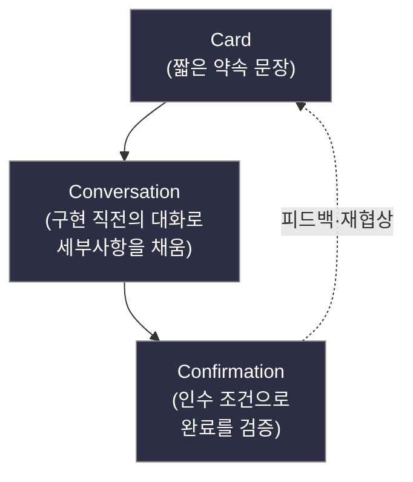
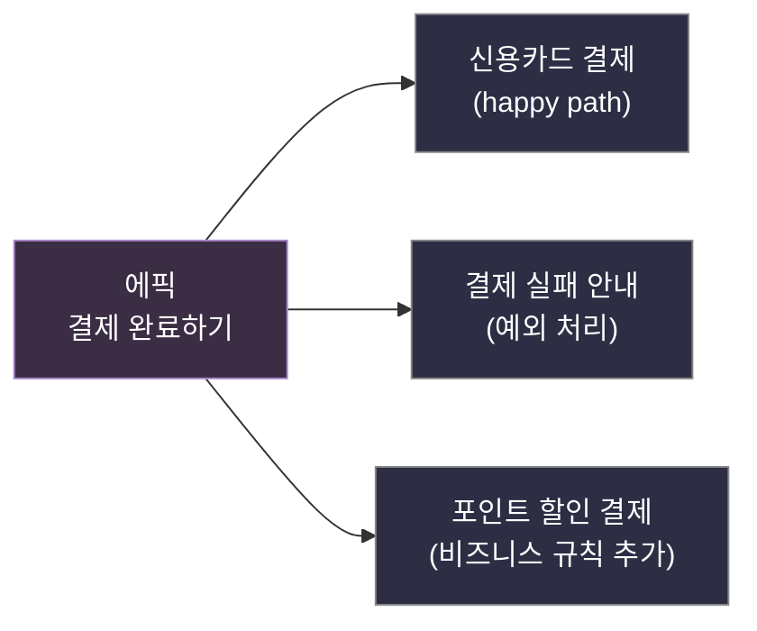

## 들어가며

이 글은 `Process-Essential` 시리즈의 **3단계**입니다. 전체 학습 지도는 [Process Essential Curriculum](/2026/06/19/process-essential-curriculum.html)에서 확인할 수 있습니다.

[2단계: XP Explained: 변화를 끌어안는 애자일](/2026/06/19/extreme-programming-explained.html)에서 우리는 변화를 비용이 아니라 환영해야 할 신호로 받아들이는 가치(Values)와 실천법(Practices)을 살펴봤습니다. XP의 핵심에는 "요구사항은 미리 다 알 수 없으니, 짧은 주기로 대화하며 발견한다"는 믿음이 깔려 있었습니다. 그렇다면 그 요구사항을 **무엇에 담아** 팀과 주고받을까요? 두꺼운 명세서일까요, 아니면 더 가벼운 무엇일까요?

이 질문에 대한 애자일 진영의 대표적인 답이 Mike Cohn의 *User Stories Applied: For Agile Software Development*(2004)입니다. 이 책의 가장 중요한 통찰은 **사용자 스토리는 완결된 요구사항 문서가 아니라, "나중에 대화하자"는 약속(promise for a conversation)**이라는 점입니다. 카드 한 장에 적힌 짧은 문장은 모든 세부사항을 담으려는 시도가 아닙니다. 오히려 세부사항을 일부러 비워 두고, 그 빈칸을 개발 직전의 살아 있는 대화로 채우려는 의도적인 설계입니다. 명세를 적게 쓰는 것이 게으름이 아니라 전략인 셈입니다.

스토리는 가볍습니다(lightweight). 그래서 빠르게 쓰고, 쉽게 버리고, 자유롭게 쪼갤 수 있습니다. 하지만 가벼움에는 한계도 있습니다. 복잡한 예외 흐름이나 단계별 상호작용을 정밀하게 기술해야 할 때는 더 구조화된 도구가 필요합니다. 그것이 바로 다음 단계인 [4단계: Writing Effective Use Cases: 목표 중심 시나리오](/2026/06/19/writing-effective-use-cases.html)에서 다룰 **유스케이스(Use Case)**입니다. 스토리가 "대화의 시작점"이라면 유스케이스는 "대화의 정밀한 기록"입니다. 이 글에서는 그 가벼운 출발점인 스토리를 제대로 다루는 법을 배웁니다.

<div class="post-summary-box" markdown="1">

### 📌 이 글에서 다루는 내용

#### 🔍 핵심 주제

- **스토리의 3C**: Card·Conversation·Confirmation — 스토리를 구성하는 세 요소와 균형
- **INVEST 기준**: 좋은 스토리가 갖춰야 할 6가지 속성과 실전 적용법
- **스토리 분할(Splitting)**: 큰 에픽을 작고 가치 있는 단위로 쪼개는 패턴
- **추정과 계획**: 스토리 포인트, 속도(Velocity), 릴리스 계획의 연결 고리
- **인수 조건(Acceptance Criteria)**: 완료의 정의를 테스트로 이어 가는 확인 단계

</div>

## 사용자 스토리란 무엇인가: 형식보다 의도

먼저 가장 흔히 보는 스토리 템플릿부터 보겠습니다. Mike Cohn이 대중화한 표준 형식은 다음과 같습니다.

```text
<역할>로서 <목표>를 원한다. 그래야 <가치>.

(원문: As a <role>, I want <goal>, so that <benefit>.)
```

세 칸의 의미는 분명합니다.

- **역할(role)**: 누가 이 기능을 원하는가. 일반적인 "사용자"가 아니라 구체적인 페르소나일수록 좋습니다.
- **목표(goal)**: 무엇을 하고 싶은가. **어떻게(how)**가 아니라 **무엇(what)**을 적습니다.
- **가치(benefit)**: 왜 그것을 원하는가. 이 칸이 비어 있으면 그 스토리는 만들 이유가 없는 기능일 수 있습니다.

구체적인 예를 봅시다.

```text
정기 구독자로서 다음 결제일을 미리 확인하고 싶다.
그래야 잔액이 부족해 구독이 끊기는 일을 막을 수 있다.
```

여기서 핵심은 "결제일 화면에 캘린더 위젯을 띄우고 D-3에 푸시 알림을 보낸다" 같은 **구현 방법을 적지 않았다**는 점입니다. 그 방법은 개발 직전의 대화에서 결정합니다. 스토리는 의도(intent)를 붙들고, 해법(solution)은 열어 둡니다. 이 절제가 스토리의 본질입니다.

## 스토리의 3C: Card · Conversation · Confirmation

Ron Jeffries가 정리한 **3C**는 스토리가 단순한 한 줄짜리 문장이 아니라는 사실을 설명하는 가장 좋은 모델입니다. 스토리는 세 가지가 모여 비로소 완성됩니다.

### Card (카드)

스토리는 물리적이든 디지털이든 **작은 카드**에 담길 만큼 짧아야 합니다. 카드에는 앞서 본 한두 문장과, 뒷면에 인수 조건 메모 정도가 들어갑니다. 카드의 크기 자체가 "여기에 모든 걸 적지 말라"는 강제 장치입니다. 카드는 기억의 토큰(token)일 뿐, 완전한 명세가 아닙니다.

### Conversation (대화)

세부사항은 카드가 아니라 **대화**에서 살아납니다. 개발자·기획자·테스터가 스토리를 구현하기 직전에 모여 "이 경우엔 어떻게 동작해야 하죠?"를 묻고 답합니다. 이 대화야말로 스토리의 진짜 내용물입니다. 문서로 미리 박제하지 않기 때문에, 그 사이에 바뀐 상황을 반영할 수 있습니다. XP의 "변화를 끌어안기"가 요구사항 수준에서 구현되는 지점입니다.

### Confirmation (확인)

대화만으로는 "다 됐다"는 합의에 도달했는지 알 수 없습니다. 그래서 **확인**, 즉 인수 조건(Acceptance Criteria)이 필요합니다. "이 조건들을 통과하면 이 스토리는 완료"라는 약속을 미리 정해 두면, 개발이 끝났을 때 객관적으로 검증할 수 있습니다.

세 요소의 관계는 다음과 같이 그릴 수 있습니다.



카드가 대화를 부르고, 대화가 확인 기준을 낳고, 확인 결과가 다시 카드를 재협상하게 만듭니다. 3C는 일방통행이 아니라 순환입니다.

## INVEST: 좋은 스토리의 6가지 속성

모든 스토리가 좋은 스토리는 아닙니다. Bill Wake가 제안한 **INVEST** 체크리스트는 스토리의 품질을 점검하는 6개의 렌즈입니다.

### Independent (독립적)

스토리끼리 가능한 한 의존하지 않아야 합니다. A를 먼저 끝내야만 B를 시작할 수 있다면, 우선순위 조정과 추정이 어려워집니다. 의존성이 강하면 두 스토리를 합치거나, 의존성이 사라지도록 다시 쪼개는 것을 고려합니다.

### Negotiable (협상 가능)

스토리는 고정된 계약이 아니라 협상의 출발점입니다. 카드에 세부사항을 너무 빽빽하게 적으면 협상의 여지가 사라집니다. "무엇을"만 담고 "어떻게"는 대화에 남겨 두는 이유가 바로 이 속성 때문입니다.

### Valuable (가치 있는)

모든 스토리는 **사용자 또는 고객에게 가치**를 주어야 합니다. "데이터베이스 인덱스를 추가한다" 같은 순수 기술 작업은 그 자체로 스토리가 되기 어렵습니다. 대신 "검색 결과가 1초 안에 뜨길 원한다. 그래야 이탈하지 않는다"처럼 가치로 번역합니다.

### Estimable (추정 가능)

팀이 크기를 가늠할 수 있어야 합니다. 추정이 불가능하다면 보통 (1) 도메인 지식이 부족하거나, (2) 기술적으로 불확실하거나, (3) 스토리가 너무 큰 경우입니다. 이럴 때는 학습을 위한 **스파이크(spike)**를 먼저 두거나 스토리를 분할합니다.

### Small (작은)

한 이터레이션 안에 끝낼 수 있을 만큼 작아야 합니다. 너무 크면 추정 오차가 커지고 피드백이 늦어집니다. 작게 유지하는 기술이 다음에 볼 "분할"입니다.

### Testable (테스트 가능)

완료 여부를 객관적으로 검증할 수 있어야 합니다. "빠르게 동작한다"는 테스트할 수 없지만 "검색 응답이 95퍼센타일 기준 800ms 이하"는 테스트할 수 있습니다. Testable 속성은 곧 인수 조건으로 이어집니다.

INVEST는 통과/실패를 가르는 시험이 아니라, 스토리를 다듬을 때 던지는 질문 모음으로 쓰는 것이 좋습니다. "이 스토리, 독립적인가? 가치가 분명한가? 테스트할 수 있나?"를 습관처럼 묻는 것입니다.

## 스토리 분할: 에픽을 작고 가치 있게 쪼개기

큰 스토리, 즉 한 이터레이션에 담기 어려운 스토리를 **에픽(epic)**이라 부릅니다. 에픽은 그대로 개발할 수 없으니 작은 스토리로 분할해야 합니다. 분할의 황금률은 **"각 조각이 여전히 사용자 가치를 가질 것"**입니다. 화면 레이어, 비즈니스 로직, DB 레이어처럼 **기술 계층으로 가르는 수평 분할은 피합니다**. 각 조각이 단독으로는 아무 가치가 없기 때문입니다. 대신 가치를 보존하는 **수직 분할**을 사용합니다.

자주 쓰는 분할 패턴은 다음과 같습니다.

- **워크플로 단계로 분할**: "주문 전 과정"을 "장바구니 담기 → 결제 → 영수증 발송"으로 쪼갬
- **비즈니스 규칙으로 분할**: 먼저 "신용카드 결제"만, 다음 이터레이션에 "포인트·쿠폰"
- **단순/복잡 케이스로 분할**: 정상 흐름(happy path)을 먼저, 예외 처리를 별도 스토리로
- **데이터 변형으로 분할**: 국내 배송 먼저, 해외 배송은 나중에

예를 들어 다음 에픽을 봅시다.

```text
[에픽] 쇼핑몰 회원으로서 결제를 완료하고 싶다.
       그래야 상품을 구매할 수 있다.
```

이를 가치를 유지한 채 분할하면 다음과 같습니다.

```text
[스토리 1] 회원으로서 신용카드로 결제하고 싶다.
           그래야 가장 익숙한 수단으로 빠르게 살 수 있다.

[스토리 2] 회원으로서 결제 실패 시 명확한 안내를 받고 싶다.
           그래야 무엇을 고쳐야 하는지 알고 다시 시도할 수 있다.

[스토리 3] 회원으로서 적립 포인트로 결제 금액을 할인받고 싶다.
           그래야 모아 둔 혜택을 실제로 쓸 수 있다.
```

세 스토리 모두 단독으로 릴리스해도 사용자에게 의미가 있습니다. 분할 과정을 그림으로 보면 다음과 같습니다.



분할은 INVEST의 Small을 달성하는 핵심 기법이며, 동시에 우선순위를 더 잘게 매겨 **가장 가치 있는 것부터** 만들 수 있게 해 줍니다.

## 추정과 계획: 스토리 포인트, 속도, 릴리스 계획

스토리를 잘 쪼갰다면 이제 "언제 끝나는가"를 답할 차례입니다. 애자일 추정의 핵심은 **시간이 아니라 상대적 크기로 추정한다**는 점입니다.

### 스토리 포인트 (Story Points)

스토리 포인트는 절대 시간(예: "3일")이 아니라 **상대적 규모**를 나타내는 단위입니다. 작업량·복잡도·불확실성을 종합한 추상적 크기입니다. 흔히 피보나치 수열(1, 2, 3, 5, 8, 13, 20, ...)을 변형해 쓰는데, 큰 숫자일수록 간격을 넓혀 "클수록 추정이 부정확하다"는 사실을 자연스럽게 반영합니다. 기준 스토리 하나를 정해 두고 "그것보다 두 배쯤 크다면 더블"처럼 비교로 매깁니다. 시간이 아니라 크기로 추정하면, 개인별 속도 차이나 그날의 컨디션에 흔들리지 않는다는 장점이 있습니다.

### 속도 (Velocity)

**속도**는 한 이터레이션에 팀이 실제로 완료한 스토리 포인트의 합입니다. 미리 정하는 목표치가 아니라, 지나간 이터레이션에서 **관측된 실측값**이라는 점이 중요합니다. 추정은 어차피 틀리지만, 속도가 그 오차를 흡수합니다. 추정이 일관되게 1.3배 컸다면 속도도 그만큼 낮게 측정되어 결국 계획이 맞아 들어갑니다.

### 릴리스 계획 (Release Planning)

릴리스 계획은 간단한 산수로 시작합니다.

```text
남은 작업량 ÷ 팀 속도 = 남은 이터레이션 수

예) 백로그 합계 120 포인트, 최근 3개 이터레이션 평균 속도 20 포인트/iteration
    120 ÷ 20 = 6 이터레이션 → 약 12주(2주 단위 기준) 후 완료 예상
```

여기서 두 가지 계획 방식이 갈립니다. **날짜를 고정**하면 그 안에 넣을 수 있는 스토리 수가 정해지고, **범위를 고정**하면 끝나는 날짜가 정해집니다. 어느 쪽이든 우선순위가 높은 스토리부터 채우는 것이 원칙입니다. 가치가 큰 것을 먼저 만들면, 도중에 멈춰도 가장 중요한 것은 이미 손에 들어와 있습니다.

## 인수 조건: 완료의 정의를 테스트로 잇기

3C의 마지막 C인 Confirmation, 즉 **인수 조건(Acceptance Criteria)**은 "이 스토리가 완료되었다"를 객관적으로 판정하는 조건 목록입니다. 보통 카드 뒷면에 메모 형태로 적고, 대화를 거치며 구체화합니다.

앞서 본 결제 실패 스토리에 인수 조건을 붙여 봅시다.

```text
[스토리] 회원으로서 결제 실패 시 명확한 안내를 받고 싶다.
         그래야 무엇을 고쳐야 하는지 알고 다시 시도할 수 있다.

[인수 조건]
- 카드 한도 초과로 실패하면 "한도를 초과했습니다" 메시지를 보여 준다.
- 카드 정보가 틀리면 어떤 필드가 잘못됐는지 표시한다.
- 실패 후에도 장바구니 내용은 그대로 유지된다.
- 실패 사유와 시각이 로그에 기록된다.
```

이 조건들은 자연스럽게 **테스트 케이스**로 번역됩니다. INVEST의 Testable이 여기서 결실을 맺습니다. 많은 팀이 이 인수 조건을 Given-When-Then 형식으로 더 구조화하기도 합니다.

```text
Given 한도가 소진된 신용카드로 결제를 시도하면
When  결제 요청을 보냈을 때
Then  "한도를 초과했습니다" 메시지가 표시되고
And   장바구니 내용은 그대로 유지된다.
```

이렇게 적어 두면 그대로 자동화 테스트의 명세가 됩니다. 인수 조건은 단순한 체크리스트를 넘어, 개발의 목표이자 회귀 테스트의 씨앗이 됩니다. "완료의 정의(Definition of Done)"가 문장으로 존재하므로, 끝났는지 아닌지를 두고 벌어지는 소모적인 논쟁이 사라집니다.

## 마무리

사용자 스토리는 명세서가 아니라 **대화를 위한 약속**입니다. 짧은 카드(Card)로 약속을 던지고, 구현 직전의 대화(Conversation)로 세부를 채우며, 인수 조건(Confirmation)으로 완료를 검증합니다. 이 3C를 INVEST 렌즈로 다듬으면 좋은 스토리가 되고, 큰 에픽은 가치를 보존하는 분할로 작아집니다. 스토리 포인트와 속도는 그 작은 단위들을 현실적인 릴리스 계획으로 엮어 줍니다.

다만 스토리는 의도적으로 가볍기 때문에, 여러 단계를 거치는 복잡한 상호작용이나 촘촘한 예외 흐름을 정밀하게 기술하는 데는 한계가 있습니다. 바로 그 빈틈을 메우는 도구가 다음 단계의 **유스케이스(Use Case)**입니다. 스토리가 "무엇을 누구를 위해, 왜"를 가볍게 붙든다면, 유스케이스는 "그 목표를 달성하기까지의 단계와 분기"를 자세히 기록합니다. 둘은 경쟁자가 아니라 **상호 보완**하는 도구입니다. 가벼움이 필요할 땐 스토리를, 정밀함이 필요할 땐 유스케이스를 꺼내 씁니다.

### 다음 학습

- [Process Essential Curriculum](/2026/06/19/process-essential-curriculum.html) — 전체 학습 지도에서 현재 위치 확인하기
- (다시 보기) [XP Explained: 변화를 끌어안는 애자일](/2026/06/19/extreme-programming-explained.html) — 스토리가 자라난 토양인 XP의 가치와 실천법
- (다음 단계) [Writing Effective Use Cases: 목표 중심 시나리오](/2026/06/19/writing-effective-use-cases.html) — 스토리의 정밀한 짝, 목표 중심 시나리오 기술법
