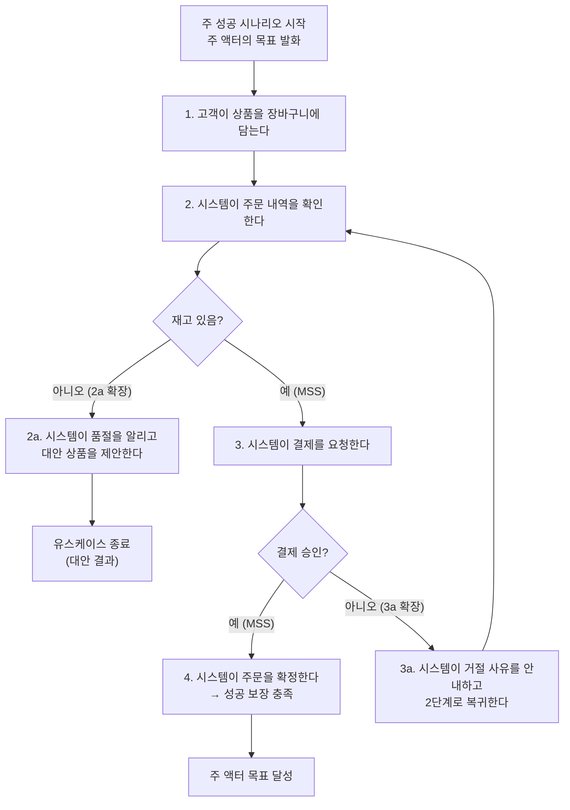

## 들어가며

이 글은 `Process-Essential` 시리즈의 **4단계**입니다. 전체 흐름은 [Process Essential Curriculum](/2026/06/19/process-essential-curriculum.html)에서 확인할 수 있습니다.

3단계 [User Stories Applied: 대화로서의 요구사항](/2026/06/19/user-stories-applied.html)에서는 요구사항을 "대화를 여는 약속"으로 다루는 가벼운(lightweight) 접근을 살펴봤습니다. User Story는 `As a … I want … so that …` 한 문장으로 의도를 포착하고, 세부 사항은 구현 직전의 대화로 채웁니다. 빠르고 유연하지만, 시스템이 사용자의 목표를 실제로 어떤 단계를 거쳐 달성하는지, 그리고 그 과정에서 무엇이 잘못될 수 있는지를 한 문장은 담아내지 못합니다.

그 빈자리를 채우는 것이 **유스케이스(Use Case)** 입니다. 이 글은 Alistair Cockburn의 고전 *Writing Effective Use Cases*(2000)를 길잡이로 삼습니다. Cockburn은 유스케이스를 "어떤 액터(actor)가 특정 목표(goal)를 달성하기 위해 시스템과 상호작용하는 방식을, 성공과 실패의 모든 경로를 포함해 서술한 것"으로 정의합니다. 핵심은 **목표 중심(goal-oriented)** 이라는 점입니다. 화면이나 버튼이 아니라 "사용자가 무엇을 이루려 하는가"에서 출발해, 그 목표가 어떻게 이루어지는지(주 성공 시나리오)와 어떻게 어긋날 수 있는지(확장)를 함께 기술합니다.

유스케이스는 User Story보다 무겁지만, 그만큼 흐름과 예외를 명시적으로 드러냅니다. 그리고 이 형식의 뿌리는 5단계에서 다룰 [OOSE: 유스케이스 주도 개발](/2026/06/19/oose-use-case-driven.html)에 있습니다. Ivar Jacobson이 OOSE(1992)에서 use case라는 개념과 use-case driven development를 처음 제시했고, Cockburn은 그 작성 실무를 정련했습니다. 이번 글에서 "어떻게 쓰는가"를 익히면, 다음 글에서 "왜 그것이 개발 전체를 이끄는가"가 자연스럽게 이어집니다.

<div class="post-summary-box" markdown="1">

### 📌 이 글에서 다루는 내용

#### 🔍 핵심 주제

- **목표 중심 서술**: 액터(Actor)와 목표(Goal)에서 출발하고, 주 액터와 지원 액터를 구분합니다.
- **주 성공 시나리오와 확장**: 정상 흐름(Main Success Scenario)과 예외 흐름(Extension)을 함께 명세합니다.
- **목표 수준과 범위**: Summary·User-goal·Subfunction 수준과 시스템 경계(범위)를 정의합니다.
- **전제·보장 조건**: Preconditions와 Guarantees로 유스케이스를 계약(contract)처럼 명세합니다.
- **스토리와 유스케이스의 관계**: 언제 User Story를, 언제 유스케이스를 쓸지 판단하는 기준을 정리합니다.

</div>

## 목표 중심 서술: 액터와 목표에서 시작하기

유스케이스를 망치는 가장 흔한 방법은 UI에서 시작하는 것입니다. "사용자가 로그인 버튼을 누른다 → 폼이 뜬다 → 이메일을 입력한다 …" 이런 서술은 구현 세부에 묶여 화면이 바뀌면 같이 무너집니다.

Cockburn의 처방은 단순합니다. **항상 액터의 목표에서 출발하라.** 액터(Actor)는 시스템 밖에서 시스템과 상호작용하는 주체(사람, 외부 시스템, 시간 등)이고, 목표(Goal)는 그 액터가 이루려는 결과입니다. 유스케이스의 이름은 "구매하기", "환불 신청하기", "주문 추적하기"처럼 **능동태 동사 + 목표 명사** 꼴로 짓습니다. 이름만 봐도 누가 무엇을 원하는지 드러나야 합니다.

### 주 액터와 지원 액터

액터는 역할로 구분합니다.

- **주 액터(Primary Actor)**: 유스케이스를 촉발하고, 그 목표가 달성되면 가치를 얻는 액터입니다. "환불 신청하기"의 주 액터는 고객입니다. 유스케이스는 언제나 주 액터의 목표 관점에서 서술합니다.
- **지원 액터(Supporting Actor, 보조 액터)**: 시스템이 목표를 이루기 위해 도움을 청하는 외부 주체입니다. 결제 게이트웨이, 이메일 발송 서비스, 신용평가 기관 등이 여기 속합니다. 이들은 시스템의 요청에 응답할 뿐, 흐름을 주도하지 않습니다.

이 구분이 중요한 이유는 **관점의 일관성** 때문입니다. 흐름을 쓰다 보면 어느새 "결제 시스템이 승인을 보낸다"처럼 외부 시스템 시점으로 새기 쉽습니다. 주 액터를 고정해두면 "시스템이 결제 시스템에 승인을 요청하고 응답을 받는다"처럼 우리 시스템(SuD, System under Discussion)을 주어로 둔 일관된 서술을 유지할 수 있습니다.

## 목표 수준과 범위: 바다 표면(sea-level) 비유

목표에는 크기가 있습니다. "기업을 운영한다"와 "비밀번호를 검증한다"를 같은 문서에 같은 무게로 쓸 수는 없습니다. Cockburn은 이를 **바다 표면(sea-level)** 비유로 정리합니다. 사용자의 핵심 목표를 수면(바다 표면)에 두고, 더 큰 목표는 위로, 더 작은 단계는 아래로 배치합니다.

- ☁️ **Summary 수준(하늘색·구름)**: 여러 user-goal을 묶는 큰 목표. 시간 단위가 길고 맥락을 제공합니다. 예: "고객 주문을 처리한다"(주문 → 결제 → 배송 → 정산을 포괄).
- 🌊 **User-goal 수준(바다색·물결)**: 핵심 수준. 한 명의 주 액터가 한 번 앉은 자리에서 끝낼 수 있는 의미 있는 목표. 예: "상품을 구매한다", "환불을 신청한다". 대부분의 유스케이스는 여기에 위치해야 합니다.
- 🐟 **Subfunction 수준(물고기·조개)**: user-goal을 이루기 위한 하위 단계. 예: "신용카드를 검증한다", "주소를 자동완성한다". 너무 잘게 쪼개면 문서가 폭발하므로, 여러 유스케이스에서 반복되거나 복잡할 때만 별도로 분리합니다.

수준을 의식하면 한 유스케이스 안에서 추상화 단계가 뒤섞이는 것을 막을 수 있습니다. 주 성공 시나리오의 각 단계는 대체로 같은 수준(보통 sea-level 바로 한 단계 아래)에서 균일하게 기술되어야 읽기 좋습니다.

### 범위: 시스템 경계 정의하기

**범위(Scope)** 는 "우리가 설계 책임을 지는 시스템은 어디까지인가"를 정합니다. 같은 "결제하기"라도 범위가 결제 모듈인지, 전체 쇼핑몰인지, 회사 전체 비즈니스인지에 따라 무엇이 안에 있고(검은 상자로 다룰 우리 시스템) 무엇이 밖에 있는지(액터로 다룰 외부)가 달라집니다. 범위를 명시하면 "이 시스템이 직접 하는 일"과 "외부에 위임하는 일"의 경계가 분명해지고, 지원 액터와의 인터페이스가 자연스럽게 드러납니다.

## 주 성공 시나리오와 확장

유스케이스의 심장은 두 부분입니다.

**주 성공 시나리오(Main Success Scenario, MSS)** 는 모든 것이 잘 풀렸을 때 목표가 달성되는 단 하나의 정상 경로입니다. 번호가 매겨진 단계로, 각 단계는 "누가 무엇을 한다"는 완결된 평서문입니다. 조건 분기("만약 …")는 본문에 넣지 않습니다. 분기는 모두 확장으로 빠집니다. 그래서 MSS는 항상 짧고 곧게 읽힙니다.

**확장(Extensions)** 은 정상 경로에서 벗어나는 모든 조건과 그 처리입니다. MSS의 단계 번호에 알파벳을 붙여(`2a`, `3a`, `3b` …) "어느 지점에서 어떤 조건이 발생하면 어떻게 대응하는가"를 적습니다. 확장은 다시 MSS로 복귀하거나, 대안 결과로 유스케이스를 종료합니다. 실무에서 요구사항의 진짜 무게는 대부분 이 확장에 실려 있습니다 — 검증 실패, 재고 부족, 결제 거절, 타임아웃 등 "잘못될 수 있는 모든 것"이 여기 모입니다.



위 다이어그램에서 가운데 굵은 줄기가 MSS이고, 옆으로 새는 가지가 확장입니다. `3a`처럼 일부 확장은 흐름으로 복귀(재시도)하고, `2a`처럼 일부는 대안 결과로 종료합니다.

## 전제·보장 조건: 유스케이스를 계약으로 보기

유스케이스는 시작과 끝을 명확히 하는 **계약(contract)** 으로 읽을 수 있습니다. 이를 가능하게 하는 것이 전제와 보장입니다.

- **전제 조건(Preconditions)**: 유스케이스가 시작되기 전에 반드시 참이라고 시스템이 **신뢰하는** 것. 따라서 본문에서 다시 검사하지 않습니다. 예: "사용자가 이미 로그인되어 있다." 로그인 자체를 검증하는 단계는 MSS에 등장하지 않습니다 — 그건 다른(또는 상위) 유스케이스의 책임입니다.
- **최소 보장(Minimal Guarantees)**: 유스케이스가 어떻게 끝나든(실패하더라도) 시스템이 지키는 약속. 예: "어떤 경우에도 모든 시도는 감사 로그(audit log)에 기록된다." 이는 보안·정합성의 마지노선입니다.
- **성공 보장(Success Guarantees)**: 주 성공 시나리오가 완료되었을 때 추가로 참이 되는 것. 예: "주문이 확정되고 재고가 차감되며 영수증이 발송된다."

전제는 "들어올 때의 가정", 보장은 "나갈 때의 약속"입니다. 둘을 명시하면 유스케이스끼리 가정/약속으로 맞물려 큰 흐름을 구성할 수 있고, 본문에서 불필요한 방어 로직 서술을 덜어내 핵심 흐름이 선명해집니다.

### 완성된 유스케이스 템플릿(한국어)

아래는 위 요소를 모두 채운 user-goal 수준 유스케이스의 전형적인 형식입니다.

```text
유스케이스 이름: 온라인으로 상품 구매하기
범위(Scope): 쇼핑몰 주문 시스템 (SuD)
수준(Level): User-goal (🌊 바다 표면)
주 액터(Primary Actor): 고객(Customer)
지원 액터(Supporting Actors): 결제 게이트웨이, 재고 시스템, 이메일 발송 서비스

전제 조건(Preconditions):
  - 고객이 인증되어 로그인된 상태이다.
  - 장바구니에 1개 이상의 상품이 담겨 있다.

최소 보장(Minimal Guarantees):
  - 결제가 확정되지 않으면 고객에게 어떤 청구도 발생하지 않는다.
  - 모든 주문 시도는 시각·결과와 함께 감사 로그에 기록된다.

성공 보장(Success Guarantees):
  - 주문이 확정되고 주문 번호가 부여된다.
  - 구매 수량만큼 재고가 차감된다.
  - 영수증과 주문 확인 메일이 고객에게 발송된다.

주 성공 시나리오(Main Success Scenario):
  1. 고객이 결제를 요청한다.
  2. 시스템이 주문 내역과 총액을 표시한다.
  3. 시스템이 재고 시스템에 재고를 확인한다.
  4. 고객이 배송지와 결제 수단을 선택한다.
  5. 시스템이 결제 게이트웨이에 결제 승인을 요청한다.
  6. 결제 게이트웨이가 승인을 반환한다.
  7. 시스템이 재고를 차감하고 주문을 확정한다.
  8. 시스템이 주문 확인 메일을 발송하고 주문 번호를 안내한다.

확장(Extensions):
  2a. 장바구니 상품 중 일부가 판매 중지됨:
    2a1. 시스템이 해당 상품을 표시하고 제거를 요청한다.
    2a2. 고객이 제거하면 2단계로 복귀한다.
  3a. 재고 부족:
    3a1. 시스템이 품절을 알리고 가능 수량 또는 대안 상품을 제안한다.
    3a2. 고객이 수량을 조정하면 2단계로 복귀한다.
    3a3. 고객이 취소하면 유스케이스를 종료한다(대안 결과).
  6a. 결제 거절:
    6a1. 시스템이 거절 사유를 안내한다.
    6a2. 고객이 다른 결제 수단을 선택하면 5단계로 복귀한다.
  6b. 결제 게이트웨이 응답 타임아웃:
    6b1. 시스템이 결제 상태를 재조회한다.
    6b2. 미확정이면 주문을 보류로 표시하고 최소 보장에 따라 청구 없이 종료한다.
```

이 한 장에 목표, 시스템 경계, 정상 흐름, 그리고 현실에서 마주칠 거의 모든 예외가 담깁니다. 개발자·QA·기획자가 같은 문서를 보고 합의할 수 있다는 점이 유스케이스의 가장 큰 힘입니다.

## 스토리와 유스케이스의 관계: 언제 무엇을 쓸까

User Story와 유스케이스는 경쟁자가 아니라 **다른 해상도의 도구**입니다.

| 기준 | User Story (3단계) | Use Case (이 글) |
| --- | --- | --- |
| 형식 | 한 문장 + 대화 | 구조화된 시나리오 문서 |
| 강점 | 빠른 백로그·우선순위·반복 | 흐름·예외·경계의 명시 |
| 예외 처리 | 인수 조건/대화로 보강 | 확장으로 체계적 기술 |
| 적합한 상황 | 변동이 잦고 협업이 긴밀한 팀 | 흐름이 복잡·규제·외부 연동이 많은 영역 |

판단 기준은 대략 이렇습니다.

- **User Story로 충분한 경우**: 흐름이 단순하고, 팀이 같은 맥락을 공유하며, 세부는 대화로 빠르게 좁힐 수 있을 때. 예외가 적고 변경이 잦은 일반 기능.
- **유스케이스가 필요한 경우**: 결제·인증·정산처럼 예외 경로가 많고, 외부 시스템(지원 액터)과 얽히며, 규제나 감사 추적이 요구되어 "잘못될 수 있는 모든 것"을 빠짐없이 적어야 할 때. 여러 팀이 같은 경계를 공유해야 할 때.

실무에서는 둘을 함께 씁니다. Epic/Story로 백로그를 운영하면서, 핵심적이고 위험한 흐름만 user-goal 수준 유스케이스로 정밀하게 못 박는 방식이 흔합니다. 가벼움(스토리)과 엄밀함(유스케이스)을 상황에 따라 섞는 감각이 곧 요구사항 설계 역량입니다.

## 마무리

유스케이스는 "어떤 액터가 어떤 목표를 이루는가"에서 출발해, 정상 경로(주 성공 시나리오)와 모든 일탈(확장)을 함께 적는 목표 중심 서술입니다. 목표 수준(Summary·User-goal·Subfunction)과 범위로 추상화와 경계를 잡고, 전제(Preconditions)와 보장(Minimal/Success Guarantees)으로 시작과 끝을 계약처럼 못 박습니다. User Story가 대화를 여는 약속이라면, 유스케이스는 그 대화의 결과를 흐름과 예외까지 빠짐없이 봉인하는 청사진입니다.

이 형식의 진짜 가치는 단지 문서화에 있지 않습니다. 유스케이스가 분석·설계·테스트·개발 전체를 이끌도록 만든 사고방식 — 바로 use-case driven development — 가 그 뿌리입니다. 다음 글에서는 이 모든 형식의 기원인 Ivar Jacobson의 OOSE로 거슬러 올라가, 유스케이스가 어떻게 시스템 전체를 추동하는 엔진이 되는지를 살펴봅니다.

### 다음 학습

- [Process Essential Curriculum](/2026/06/19/process-essential-curriculum.html) — 전체 학습 로드맵에서 현재 위치 확인하기
- 다시 보기(3단계): [User Stories Applied: 대화로서의 요구사항](/2026/06/19/user-stories-applied.html) — 가벼운 요구사항과 비교하기
- 다음(5단계): [OOSE: 유스케이스 주도 개발](/2026/06/19/oose-use-case-driven.html) — 유스케이스의 기원과 use-case driven development
