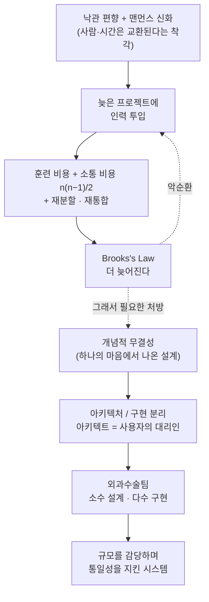

<figure class="post-figure post-figure--header">
<svg role="img" aria-label="언덕 위 오크 전쟁 지휘관이 거대한 공성 병기가 지어지는 현장을 내려다보는 그림. 병기 아래로는 수많은 오크 일꾼이 몰려들지만 서로 붉은 소통 선(n(n-1)/2)으로 뒤엉키고, 그 무게에 병기는 수직 기준선에서 더 기울어진다 — 사람을 더하면 더 늦어진다(Brooks's Law). 지휘관은 한 손에 통일된 설계도(개념적 무결성)를 들고, 그 설계도에서 병기 꼭대기로 단 하나의 빛나는 금빛 청사진 라인이 흐른다." viewBox="0 0 720 380" xmlns="http://www.w3.org/2000/svg">
  <title>맨먼스 신화 — 사람을 더할수록 뒤엉키고 기우는 공성 병기, 그러나 하나의 마음에서 나온 설계도가 그것을 붙든다</title>

  <!-- ground band -->
  <rect x="0" y="330" width="720" height="50" fill="var(--bg-sunken)" opacity="0.6"/>
  <line x1="0" y1="330" x2="720" y2="330" stroke="currentColor" stroke-width="1.5" opacity="0.5"/>

  <!-- ===== single unified blueprint line (conceptual integrity) ===== -->
  <path d="M168,196 C300,120 440,96 566,150" fill="none" stroke="var(--gold)" stroke-width="3" stroke-linecap="round" opacity="0.95"/>
  <path d="M168,196 C300,120 440,96 566,150" fill="none" stroke="var(--gold-bright)" stroke-width="1" stroke-dasharray="1 7" stroke-linecap="round"/>
  <text x="352" y="104" text-anchor="middle" font-size="11" fill="var(--gold)" font-weight="700">개념적 무결성 · 하나의 설계</text>

  <!-- ===== left hill + orc warlord commander ===== -->
  <path d="M0,332 Q70,262 150,268 Q206,272 244,332 Z" fill="var(--bg-light)" stroke="currentColor" stroke-width="1.6"/>
  <!-- commander silhouette -->
  <g fill="currentColor">
    <rect x="106" y="214" width="24" height="40" rx="4"/>
    <rect x="108" y="252" width="8" height="18" rx="2"/>
    <rect x="120" y="252" width="8" height="18" rx="2"/>
    <circle cx="118" cy="198" r="12"/>
  </g>
  <!-- black topknot -->
  <path d="M118,187 q3,-13 8,-16 q-2,9 1,14" fill="currentColor" opacity="0.85"/>
  <!-- planted axe (Gorehowl) -->
  <line x1="98" y1="196" x2="98" y2="256" stroke="currentColor" stroke-width="3"/>
  <path d="M98,198 q-16,4 -18,16 q14,-4 18,-6 z" fill="var(--steel)" stroke="currentColor" stroke-width="1.2"/>
  <!-- arm + held blueprint scroll (the unified design) -->
  <line x1="128" y1="222" x2="150" y2="204" stroke="currentColor" stroke-width="4" stroke-linecap="round"/>
  <rect x="146" y="188" width="30" height="24" rx="2" fill="var(--bg-panel)" stroke="var(--gold)" stroke-width="1.8"/>
  <line x1="151" y1="196" x2="171" y2="196" stroke="var(--gold)" stroke-width="1.2" opacity="0.8"/>
  <line x1="151" y1="201" x2="171" y2="201" stroke="var(--gold)" stroke-width="1.2" opacity="0.8"/>
  <line x1="151" y1="206" x2="165" y2="206" stroke="var(--gold)" stroke-width="1.2" opacity="0.8"/>

  <!-- ===== the great siege engine — leaning off the plumb line ===== -->
  <!-- upright plumb reference (where it should stand) -->
  <line x1="556" y1="150" x2="556" y2="300" stroke="currentColor" stroke-width="1.4" stroke-dasharray="4 5" opacity="0.45"/>
  <!-- tilted engine body -->
  <g stroke="currentColor" stroke-width="2" fill="var(--bg-light)">
    <path d="M496,300 L618,300 L602,150 L536,164 Z"/>
  </g>
  <!-- scaffold cross-beams -->
  <g stroke="currentColor" stroke-width="1.3" opacity="0.7">
    <line x1="512" y1="252" x2="612" y2="243"/>
    <line x1="524" y1="206" x2="608" y2="199"/>
    <line x1="536" y1="164" x2="602" y2="300"/>
    <line x1="602" y1="150" x2="496" y2="300"/>
  </g>
  <!-- wheels -->
  <circle cx="518" cy="308" r="16" fill="var(--bg-sunken)" stroke="currentColor" stroke-width="2"/>
  <circle cx="596" cy="308" r="16" fill="var(--bg-sunken)" stroke="currentColor" stroke-width="2"/>
  <!-- horde banner at the tilted top -->
  <line x1="536" y1="164" x2="530" y2="128" stroke="currentColor" stroke-width="2"/>
  <path d="M530,130 L510,136 L530,148 Z" fill="var(--accent-color)"/>
  <!-- tilt arrow: it tips further -->
  <path d="M636,176 q22,26 10,66" fill="none" stroke="var(--accent-color)" stroke-width="2.2" marker-end="url(#mmm-tip)"/>
  <text x="662" y="196" font-size="10.5" fill="var(--accent-color)" font-weight="700">더 기운다</text>

  <!-- ===== swarming workers tangled in communication paths (n(n-1)/2) ===== -->
  <g stroke="var(--accent-color)" stroke-width="1.3" opacity="0.85">
    <line x1="360" y1="300" x2="410" y2="296"/>
    <line x1="360" y1="300" x2="365" y2="332"/>
    <line x1="360" y1="300" x2="415" y2="330"/>
    <line x1="360" y1="300" x2="388" y2="312"/>
    <line x1="360" y1="300" x2="440" y2="314"/>
    <line x1="410" y1="296" x2="365" y2="332"/>
    <line x1="410" y1="296" x2="415" y2="330"/>
    <line x1="410" y1="296" x2="388" y2="312"/>
    <line x1="410" y1="296" x2="440" y2="314"/>
    <line x1="365" y1="332" x2="415" y2="330"/>
    <line x1="365" y1="332" x2="388" y2="312"/>
    <line x1="365" y1="332" x2="440" y2="314"/>
    <line x1="415" y1="330" x2="388" y2="312"/>
    <line x1="415" y1="330" x2="440" y2="314"/>
    <line x1="388" y1="312" x2="440" y2="314"/>
  </g>
  <g fill="var(--secondary-color)" stroke="currentColor" stroke-width="1.2">
    <circle cx="360" cy="300" r="7"/>
    <circle cx="410" cy="296" r="7"/>
    <circle cx="365" cy="332" r="7"/>
    <circle cx="415" cy="330" r="7"/>
    <circle cx="388" cy="312" r="7"/>
    <circle cx="440" cy="314" r="7"/>
  </g>
  <text x="398" y="360" text-anchor="middle" font-size="11" fill="var(--accent-color)" font-weight="700">소통 폭발 · n(n−1)/2</text>

  <defs>
    <marker id="mmm-tip" markerWidth="9" markerHeight="9" refX="6" refY="4.5" orient="auto">
      <path d="M0,0 L9,4.5 L0,9 z" fill="var(--accent-color)"/>
    </marker>
  </defs>
</svg>
<figcaption>언덕 위 지휘관이 든 <strong>단 하나의 설계도</strong>에서 병기 꼭대기로 흐르는 금빛 선이 <strong>개념적 무결성</strong> — 하나의 마음에서 나온 통일된 설계다. 그러나 그 아래로 일꾼이 몰릴수록 소통 경로는 <strong>n(n−1)/2</strong>로 붉게 뒤엉키고, 공성 병기(대형 소프트웨어)는 수직 기준선에서 오히려 더 기운다 — <strong>사람을 더하면 더 늦어진다(Brooks's Law)</strong>.</figcaption>
</figure>

## 왜 50년 전 책을 지금 읽는가

Fred Brooks의 *The Mythical Man-Month*는 1975년에 나왔다. 저자가 IBM에서 **OS/360**이라는 당대 최대의 소프트웨어 프로젝트를 이끌며 겪은 실패와 교훈을 16편(초판 15편 + 에필로그)의 에세이로 풀어낸 책이다. 반세기가 지나 언어도, 하드웨어도, 방법론도 모두 바뀌었지만 이 책이 여전히 "소프트웨어 공학의 성경"으로 불리는 이유는 하나다 — Brooks가 다룬 것은 **기술이 아니라 사람과 조직, 그리고 복잡성**이기 때문이다. 컴파일러는 늙지만 인간의 소통 비용과 낙관 편향은 늙지 않는다.

`Process-Essential` 시리즈가 Pressman의 큰 그림에서 XP·요구사항·CI·Essence로 이어졌다면, 이 책은 그 모든 프로세스 논의의 **뿌리이자 원형**이다. 애자일이 답하려 했던 질문 — "왜 소프트웨어 프로젝트는 늘 늦고, 인력을 더 투입해도 왜 나아지지 않는가" — 을 처음으로 정면에서 해부한 책이 바로 이것이다.

## 타르 구덩이: 프로그래밍의 기쁨과 괴로움

책은 선사시대 짐승들이 빠져 허우적대던 **타르 구덩이(The Tar Pit)** 이미지로 시작한다. 거대 소프트웨어 프로젝트는 그 타르 구덩이와 같아서, 아무리 힘센 짐승도 발이 엉키면 빠져나오지 못한다. Brooks는 먼저 우리가 만드는 것의 실체를 구분한다.

- 혼자 짜서 혼자 쓰는 **프로그램(Program)**을,
- 남이 쓸 수 있도록 일반화·문서화·테스트한 **프로그래밍 제품(Programming Product)** 으로 만들면 약 **3배**,
- 다른 시스템과 맞물려 돌아가도록 인터페이스를 맞추고 통합·검증한 **프로그래밍 시스템(Programming System)** 으로 만들면 다시 약 **3배**,
- 둘 다인 **프로그래밍 시스템 제품(Programming Systems Product)** 은 결국 **약 9배**의 노력이 든다.

"동작하는 코드"와 "제품"은 9배 차이다. 많은 일정 재앙이 이 9배를 1배로 착각하는 데서 시작한다. 그러면서도 프로그래밍에는 고유한 기쁨이 있다 — 무언가를 만드는 창조의 기쁨, 쓸모의 기쁨, 퍼즐을 푸는 기쁨, 늘 새로 배우는 기쁨, 그리고 **순수한 사고의 재료(thought-stuff)** 로 짓는다는 점. 동시에 괴로움도 있다. 완벽해야 하고, 목표와 자원을 남이 정하며, 남의 프로그램에 의존하고, 설계는 즐겁지만 디버깅은 지루하며, 완성될 즈음이면 이미 낡아 있다.

## 맨먼스라는 신화

이 책의 제목이자 가장 유명한 논지다. **맨먼스(man-month)** — "사람 × 개월" — 은 일의 크기를 재는 단위로 쓰이지만, Brooks는 이것이 **위험하고 기만적인 신화**라고 못 박는다. 비용은 사람 수와 개월 수의 곱에 비례할지 몰라도, **진척(progress)은 그렇지 않다.** 사람과 시간이 교환 가능한 것은 작업을 쪼갤 수 있고 서로 소통이 필요 없을 때뿐이다 — 밀 수확이나 목화 따기가 그렇다. 소프트웨어는 아니다.

이 책의 척추는 두 축으로 갈린다 — 사람을 더할수록 무너지는 **악순환**(왼쪽)과, 하나의 설계로 그것을 붙드는 **해법**(오른쪽)이다.

Brooks는 소통 비용을 정량화한다. 작업을 나누되 부분들이 서로 소통해야 한다면, 노력에 **훈련 비용**(작업자 수에 비례해 선형 증가)과 **상호소통 비용**이 더해진다. 그리고 이 상호소통 비용은 최악이다 — n명이 서로 조율해야 한다면 소통 경로는 **n(n−1)/2**로 늘어난다. 3명은 2명의 3배, 4명은 2명의 6배. 그래서 소프트웨어처럼 부분들이 복잡하게 얽힌 일에서는, 인력을 더하는 순간 소통 비용이 분업의 이득을 잡아먹고 **일정을 단축이 아니라 연장**시킨다.

여기서 그 유명한 비유가 나온다.

> **아이를 낳는 데는 아홉 달이 걸린다. 몇 명의 여성을 배정하든 마찬가지다.**
> (The bearing of a child takes nine months, no matter how many women are assigned.)

순차적 제약이 있는 일은 인력을 아무리 늘려도 시간이 줄지 않는다. 소프트웨어의 상당 부분 — 특히 디버깅 — 이 이런 성질을 갖는다.

### 일정은 어디서 무너지는가

Brooks는 일정 실패의 근원으로 **낙관(Optimism)** 을 지목한다. "이번엔 반드시 돌 거야", "방금 마지막 버그를 잡았어" — 프로그래머는 천성이 낙관주의자다. 코드라는 매질이 너무 유연해서(순수 사고의 재료라서) 구현이 쉬울 거라 기대하지만, 정작 우리 아이디어가 불완전하기에 버그가 생긴다. 단일 작업이라면 낙관이 확률적으로 상쇄되지만, 수백 개 작업이 사슬처럼 이어진 대형 프로젝트에서는 "모든 게 잘 풀릴" 확률이 **0에 수렴한다.**

그가 제시한 경험칙 일정 배분은 지금 봐도 도발적이다.

- **1/3** — 계획(planning)
- **1/6** — 코딩(coding)
- **1/4** — 컴포넌트 테스트와 초기 시스템 테스트
- **1/4** — 전체 시스템 테스트(모든 컴포넌트가 손에 있을 때)

즉 **디버깅·테스트에 절반**, 추정하기 쉬운 코딩엔 고작 **6분의 1**. 대부분의 프로젝트가 테스트 시간을 절반 잡지 않지만, *실제로는* 절반을 쓴다. 문제는 그 지연이 **일정 막바지, 납기 직전에야** 드러난다는 것 — "나쁜 소식이 늦게, 예고 없이" 도착한다.

### 브룩스의 법칙

늦은 프로젝트에 인력을 더하면 어떻게 될까? 새 사람은 (아무리 유능해도) 훈련이 필요하고, 이미 3분할된 작업을 다시 쪼개야 하며, 시스템 테스트는 길어진다. 그래서 **더 많은 불을 끄려 기름을 붓는 격**이 된다. Brooks는 이를 "과도하게 단순화하여" 하나의 법칙으로 압축한다.

> **늦은 소프트웨어 프로젝트에 인력을 더하면 더 늦어진다.**
> (Adding manpower to a late software project makes it later.)

이것이 **브룩스의 법칙(Brooks's Law)** 이다. 소프트웨어 관리에서 가장 자주 인용되고, 가장 자주 무시되는 문장.

## 개념적 무결성 — 이 책의 심장

일정과 인력이 표면이라면, 그 밑에 흐르는 이 책의 진짜 심장은 **개념적 무결성(Conceptual Integrity)** 이다. Brooks는 랭스(Reims) 대성당을 든다. 유럽의 많은 대성당은 세대마다 건축가가 바뀌며 양식이 뒤섞였지만, 랭스는 여러 세대의 건축가들이 **각자 자기 아이디어를 희생해** 하나의 통일된 설계를 지켜냈다. 보는 이를 감동시키는 것은 개별 장식이 아니라 그 **설계의 통일성**이다.

그리고 그는 단언한다.

> **개념적 무결성은 시스템 설계에서 가장 중요한 고려사항이다.**
> (Conceptual integrity is *the* most important consideration in system design.)

좋은 기능이 잔뜩 있지만 서로 조율되지 않은 시스템보다, 일부 기능을 빠뜨리더라도 **하나의 일관된 아이디어 집합**을 반영하는 시스템이 낫다. 시스템의 사용 편의성을 결정하는 것은 기능도, 단순성도 아닌 그 둘의 비율 — **기능 대 개념적 복잡도의 비율**이다. 단순함(simplicity)만으로는 부족하다. Algol 68처럼 개념 수는 적어도 실제로 조합해 쓰기 어려우면 그것은 **직관적(straightforward)** 이지 않다. 진정한 편의성은 개념적 무결성에서 나온다.

### 아키텍처와 구현의 분리

개념적 무결성은 "설계가 **하나의 마음** 또는 **의견이 일치하는 소수의 마음**에서 나와야 한다"고 요구한다. 하지만 일정 압박은 많은 손을 필요로 한다. 이 모순을 푸는 첫 번째 열쇠가 **아키텍처(architecture)와 구현(implementation)의 분리**다.

- **아키텍처**는 *무엇이(what)* 일어나는가 — 사용자 인터페이스의 완전하고 상세한 명세(프로그래밍 매뉴얼).
- **구현**은 *어떻게(how)* 그 일이 만들어지는가.

Blaauw의 비유대로 시계의 아키텍처는 문자판·바늘·태엽 손잡이(사용자가 보는 것)이고, 구현은 케이스 안에서 벌어지는 일이다. 아이는 손목시계든 교회 종탑이든 같은 방식으로 시간을 읽는다. **아키텍트는 사용자의 대리인(the user's agent)** 으로서, 판매자나 제작자의 이해가 아니라 오직 사용자의 이익을 위해 전문 지식을 쏟는 사람이다.

### 귀족정인가, 민주정인가

그렇다면 소수의 아키텍트가 "귀족"이 되어 다수의 구현자를 억누르는 것 아닌가? Brooks의 답은 **"그렇기도 하고 아니기도 하다"** 이다.

- **그렇다** — 개념을 통제할 소수가 필요하고, 그것은 사과할 필요 없는 귀족정이다. 누군가는 개념을 지켜야 한다.
- **아니다** — 외부 명세를 짜는 일이 구현을 설계하는 일보다 더 창의적인 것은 아니다. 구현 역시 **일급의 창조 행위**이며, 오히려 아키텍처라는 제약이 구현자의 창의성을 특정 지점에 집중시킨다.

그가 인용하는 아포리즘이 정곡을 찌른다 — **"형식은 해방시킨다(Form is liberating)."** 예산과 형식의 제약이 예술을 억압하기는커녕 오히려 창의를 자극한다. Bach가 매주 정해진 형식의 칸타타를 써냈듯이. Cornell에서 PL/C 컴파일러를 만든 Conway의 말처럼, "언어를 개선하지 않고 그대로 구현하기로 했다 — 논쟁에 모든 노력을 뺏길 테니까."

## 소수가 설계하되, 많은 손으로 짓기

개념적 무결성을 지키면서도 규모를 감당하는 두 번째 열쇠가 **팀 구성**이다. Brooks는 Harlan Mills의 **외과수술팀(The Surgical Team)** 아이디어를 소개한다. 수술팀이 열 명이라고 열 명이 다 칼을 잡지 않는다. 한 명의 **외과의(수석 프로그래머)** 가 집도하고, 나머지는 부조종사·관리자·편집자·프로그램 사서·툴스미스·테스터·언어 변호사(language lawyer)로서 그를 **뒷받침**한다. 이렇게 하면 소수의 마음이 설계의 통일성을 유지하면서도 전체 생산성을 끌어올릴 수 있다.

그리고 아키텍트가 경계해야 할 함정이 **두 번째 시스템 효과(The Second-System Effect)** 다. 사람이 설계하는 두 번째 시스템이 가장 위험하다. 첫 시스템에서 아껴 두었던 온갖 기능과 장식을 두 번째에 다 쏟아부으려는 유혹 때문이다. 절제되었던 첫 설계와 달리, 두 번째 시스템은 과잉설계로 부풀어 오른다. 노련한 아키텍트는 이 유혹을 알아채고 스스로를 규율한다.

## 소통과 일정: 프로젝트는 어떻게 늦는가

Brooks는 **바벨탑(Why Did the Tower of Babel Fail?)** 을 인류 최초의 실패한 대형 프로젝트로 읽는다. 명확한 목표, 인력, 재료, 시간, 기술이 다 있었는데도 무너진 이유는 단 하나 — **소통과 조직의 실패**. 사람이 늘수록 소통은 기하급수로 어려워지고, 프로젝트 워크북과 문서화로 이를 붙들지 않으면 팀은 서로 다른 언어를 쓰게 된다.

그렇다면 **프로젝트는 어떻게 1년이나 늦어지는가?** 그의 답은 서늘하다.

> **하루에 하루씩.**
> (One day at a time.)

거대한 지연은 한 번의 태풍이 아니라, 눈에 잘 안 띄는 하루짜리 슬립이 매일 쌓여 만들어진다. 그래서 **마일스톤은 구체적이고 날카롭고 모호하지 않아야(concrete, sharp, unambiguous)** 한다 — "90% 완료" 같은 물렁한 마일스톤은 재앙의 온상이다. 관리자는 "작은 슬립을 무시하지 말라(Take no small slips)"는 원칙으로 매일의 지연을 직시해야 한다.

## 버리기 위한 시제품, 변화를 위한 설계

Brooks는 화학 공정의 **파일럿 플랜트(pilot plant)** 를 든다. 실험실에서 성공한 공정을 곧바로 대규모 공장에 옮기면 반드시 실패한다. 그래서 엔지니어는 **버릴 것을 전제로** 파일럿 플랜트를 짓는다. 소프트웨어도 똑같다.

> **하나는 버릴 셈으로 계획하라. 어차피 버리게 될 테니까.**
> (Plan to throw one away; you will, anyhow.)

첫 시스템은 배움의 도구다. 문제는 버리느냐 마느냐가 아니라 그것을 **미리 계획하느냐**다. 그리고 더 깊은 통찰 — **유일한 상수는 변화 그 자체(the only constancy is change itself)** 이다. 그러니 시스템을 변화에 대비해 설계하고, 조직 또한 변화에 대비해 구성하라. 요구사항은 바뀌고, 설계도 바뀌고, 사람도 바뀐다.

## 분석: 왜 여전히 유효한가

**애자일은 브룩스의 답장이다.** XP의 짧은 피드백 루프, 작은 릴리스, 지속적 통합은 모두 "낙관은 사슬 끝에서 0에 수렴한다"는 맨먼스의 진단에 대한 처방으로 읽을 수 있다. 애자일은 Brooks의 문제의식을 부정한 게 아니라 **계승**했다. [XP Explained](/2026/06/19/extreme-programming-explained.html)의 "변화를 끌어안기"는 Brooks의 "유일한 상수는 변화"의 실천판이고, [Essence·SEMAT](/2026/06/19/essentials-of-modern-software-engineering.html)가 방법론을 실천의 조합으로 본 것은 Brooks의 실용주의와 맞닿는다.

**개념적 무결성은 AI 시대에 오히려 더 중요해진다.** 코드를 하루 수천 줄씩 생성할 수 있게 되자, 병목은 "짜는 능력"이 아니라 "**무엇을 짤지, 그리고 그 조각들이 하나의 마음에서 나온 것처럼 일관되게 유지되는지**"로 옮겨갔다. antirez가 [코드가 아니라 아이디어를 통제하라](/2026/08/12/control-the-ideas-not-the-code.html)고 했을 때, 그가 말한 "아이디어의 통제"는 Brooks의 **개념적 무결성을 지키는 아키텍트**의 다른 이름이다. 생성량이 폭발할수록 통일된 설계 개념을 쥔 소수의 마음은 더 귀해진다.

**브룩스의 법칙은 조직에도 적용된다.** "인력을 더하면 더 늦어진다"는 통찰은, 늦은 프로젝트뿐 아니라 어떤 규모의 팀이든 소통 경로가 n(n−1)/2로 폭발한다는 구조적 사실에서 나온다. 그래서 현대의 "두 판 피자 팀(two-pizza team)", 마이크로서비스의 팀 분할, [콘웨이의 법칙](/2026/06/19/software-engineering-practitioners-approach.html) 논의는 모두 맨먼스의 소통 비용 방정식 위에 서 있다.

## 요약

- **맨먼스는 신화다** — 비용은 사람×시간에 비례하지만 진척은 그렇지 않다. 소통 비용이 n(n−1)/2로 폭발하기 때문이다.
- **브룩스의 법칙** — 늦은 프로젝트에 인력을 더하면 더 늦어진다.
- **개념적 무결성이 심장이다** — 시스템 설계에서 가장 중요한 것은 통일된 설계 개념. 기능이 아니라 기능 대 개념적 복잡도의 비율이 편의성을 결정한다.
- **아키텍처와 구현을 분리하라** — 아키텍트는 사용자의 대리인. "형식은 해방시킨다."
- **소수가 설계하고 다수가 짓는다** — 외과수술팀. 두 번째 시스템 효과를 경계하라.
- **프로젝트는 하루에 하루씩 늦는다** — 마일스톤은 날카롭고 모호하지 않게.
- **하나는 버릴 셈으로 계획하라** — 변화가 유일한 상수다.

Brooks 스스로 인정했듯 이 책은 "만병통치약(silver bullet)"을 팔지 않는다. 소프트웨어 공학의 타르 구덩이는 앞으로도 오래도록 끈적일 것이다. 다만 그 구덩이의 지형을 정확히 그려 준 첫 지도가 바로 이 책이며, 50년이 지난 지금도 우리는 여전히 이 지도를 들고 걷는다.

### 다음 학습 (Next Learning)

- [Process Essential Curriculum](/2026/06/19/process-essential-curriculum.html) — 이 책이 뿌리내린 프로세스·요구사항 시리즈의 마스터 로드맵
- [XP Explained](/2026/06/19/extreme-programming-explained.html) — 맨먼스의 진단에 대한 애자일의 처방
- [Essence · SEMAT](/2026/06/19/essentials-of-modern-software-engineering.html) — 방법론을 실천의 조합으로 보는 메타적 시야
- [코드가 아니라 아이디어를 통제하라](/2026/08/12/control-the-ideas-not-the-code.html) — 개념적 무결성의 AI 시대 재해석
