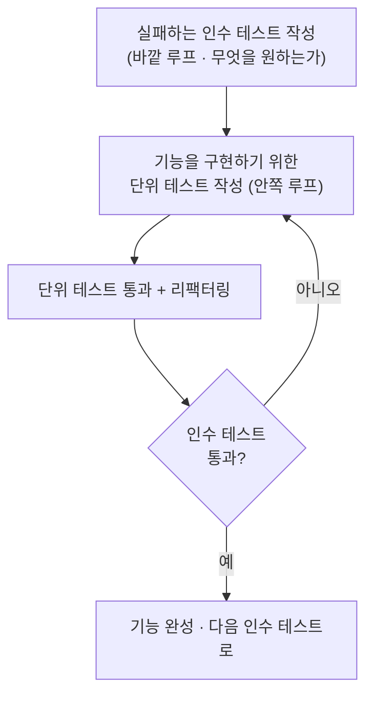

<figure class="post-figure post-figure--header">
<svg role="img" aria-label="GOOS의 이중 루프 TDD를 한 장으로 담은 그림. 왼쪽 큰 원은 인수 테스트가 도는 바깥 루프로 '무엇을 원하는가'를 시스템 경계에서 빨간 막대로 표현하고, 그 안에 작은 원으로 단위 테스트가 도는 안쪽 루프가 들어 있어 빠르게 Red-Green-Refactor를 반복한다. 안쪽 루프가 여러 번 돌아 바깥 루프 하나를 초록으로 통과시킨다. 오른쪽에는 바깥(인수 테스트)에서 안쪽(객체)으로 화살표가 내려가며, 가장 바깥 OrderService 객체가 아직 구현되지 않은 협력자들을 mock으로 발견하고, 그 발견된 역할이 다음 안쪽 작업이 되어 객체들이 한 겹씩 자라난다." viewBox="0 0 680 300" xmlns="http://www.w3.org/2000/svg">
  <title>GOOS — 이중 루프 TDD(바깥 인수 테스트 루프 + 안쪽 단위 테스트 루프)로 객체를 outside-in으로 키운다</title>

  <!-- ===== LEFT: double-loop (outer acceptance loop wraps inner unit loop) ===== -->
  <text x="150" y="24" text-anchor="middle" font-size="12" fill="currentColor" font-weight="700" opacity="0.75">이중 루프 TDD</text>

  <!-- outer acceptance loop -->
  <circle cx="150" cy="160" r="100" fill="none" stroke="var(--accent-color)" stroke-width="2.5" stroke-dasharray="7 5"/>
  <!-- outer loop direction arrow -->
  <path d="M 150 60 A 100 100 0 0 1 218 90" fill="none" stroke="var(--accent-color)" stroke-width="2.5" marker-end="url(#goos-arrow-accent)"/>
  <text x="150" y="50" text-anchor="middle" font-size="10.5" fill="currentColor" font-weight="700">바깥 루프 · 인수 테스트</text>
  <text x="150" y="276" text-anchor="middle" font-size="8.5" fill="currentColor" opacity="0.8">"무엇을 원하는가" · 한동안 Red</text>

  <!-- inner unit loop -->
  <circle cx="150" cy="160" r="52" fill="var(--bg-light)" stroke="var(--secondary-color)" stroke-width="2.5"/>
  <path d="M 150 108 A 52 52 0 0 1 186 124" fill="none" stroke="var(--secondary-color)" stroke-width="2.5" marker-end="url(#goos-arrow-secondary)"/>
  <text x="150" y="150" text-anchor="middle" font-size="9.5" fill="currentColor" font-weight="700">안쪽 루프</text>
  <text x="150" y="164" text-anchor="middle" font-size="8" fill="currentColor" opacity="0.85">단위 테스트</text>
  <text x="150" y="178" text-anchor="middle" font-size="7.5" fill="currentColor" opacity="0.7">Red→Green→Refactor</text>
  <text x="150" y="225" text-anchor="middle" font-size="8" fill="currentColor" opacity="0.75">안쪽이 여러 번 돌아</text>
  <text x="150" y="237" text-anchor="middle" font-size="8" fill="currentColor" opacity="0.75">바깥 하나를 Green으로</text>

  <!-- divider -->
  <line x1="300" y1="40" x2="300" y2="262" stroke="currentColor" stroke-width="1" opacity="0.25"/>

  <!-- ===== RIGHT: outside-in growth — mock discovers roles, objects grow inward ===== -->
  <text x="500" y="24" text-anchor="middle" font-size="12" fill="currentColor" font-weight="700" opacity="0.75">Outside-In 성장</text>

  <!-- outer boundary object -->
  <rect x="396" y="46" width="208" height="40" rx="3" fill="var(--bg-panel)" stroke="var(--accent-color)" stroke-width="2.5"/>
  <text x="500" y="64" text-anchor="middle" font-size="9.5" fill="currentColor" font-weight="700">인수 테스트 · 시스템 경계</text>
  <text x="500" y="78" text-anchor="middle" font-size="7.5" fill="currentColor" opacity="0.8">바깥에서 시작</text>

  <!-- arrow down -->
  <line x1="500" y1="86" x2="500" y2="106" stroke="var(--secondary-color)" stroke-width="2" marker-end="url(#goos-arrow-secondary)"/>
  <text x="566" y="100" text-anchor="middle" font-size="7.5" fill="currentColor" opacity="0.7">한 겹 안쪽</text>

  <!-- OrderService -->
  <rect x="420" y="108" width="160" height="36" rx="3" fill="var(--bg-light)" stroke="currentColor" stroke-width="2"/>
  <text x="500" y="131" text-anchor="middle" font-size="10" fill="currentColor" font-weight="700">OrderService</text>

  <!-- arrows to mocked collaborators -->
  <line x1="466" y1="144" x2="440" y2="170" stroke="var(--secondary-color)" stroke-width="2" marker-end="url(#goos-arrow-secondary)"/>
  <line x1="534" y1="144" x2="560" y2="170" stroke="var(--secondary-color)" stroke-width="2" marker-end="url(#goos-arrow-secondary)"/>
  <text x="500" y="162" text-anchor="middle" font-size="7.5" fill="currentColor" opacity="0.75">mock으로 역할 발견</text>

  <!-- mocked collaborators (dashed = not yet implemented) -->
  <rect x="372" y="172" width="120" height="40" rx="3" fill="var(--bg-panel)" stroke="var(--gold)" stroke-width="2" stroke-dasharray="5 4"/>
  <text x="432" y="190" text-anchor="middle" font-size="8.5" fill="currentColor" font-weight="700">PaymentGateway</text>
  <text x="432" y="203" text-anchor="middle" font-size="7" fill="currentColor" opacity="0.8">charge(order) · mock</text>
  <rect x="508" y="172" width="120" height="40" rx="3" fill="var(--bg-panel)" stroke="var(--gold)" stroke-width="2" stroke-dasharray="5 4"/>
  <text x="568" y="190" text-anchor="middle" font-size="8.5" fill="currentColor" font-weight="700">Notifier</text>
  <text x="568" y="203" text-anchor="middle" font-size="7" fill="currentColor" opacity="0.8">notify(...) · mock</text>

  <!-- next cycle hint -->
  <text x="500" y="240" text-anchor="middle" font-size="8" fill="currentColor" opacity="0.75">발견된 역할 = 다음 안쪽 작업</text>
  <text x="500" y="256" text-anchor="middle" font-size="8.5" fill="currentColor" opacity="0.85" font-weight="700">→ 객체가 한 겹씩 자란다 (grow)</text>

  <defs>
    <marker id="goos-arrow-secondary" markerWidth="8" markerHeight="8" refX="6" refY="4" orient="auto">
      <path d="M0,0 L8,4 L0,8 z" fill="var(--secondary-color)"/>
    </marker>
    <marker id="goos-arrow-accent" markerWidth="8" markerHeight="8" refX="6" refY="4" orient="auto">
      <path d="M0,0 L8,4 L0,8 z" fill="var(--accent-color)"/>
    </marker>
  </defs>
</svg>
<figcaption>GOOS 한 장 요약 — 왼쪽은 <strong>이중 루프 TDD</strong>(바깥은 인수 테스트가 "무엇을 원하는가"를 한동안 Red로 잡아 두는 큰 루프, 그 안의 작은 루프에서 단위 테스트 Red-Green-Refactor가 빠르게 여러 번 돌아 바깥 하나를 Green으로 통과시킴), 오른쪽은 <strong>outside-in 성장</strong>(가장 바깥 OrderService부터 시작해 아직 없는 협력자를 mock으로 역할만 발견하고, 그 역할이 다음 안쪽 작업이 되어 객체가 한 겹씩 자라남).</figcaption>
</figure>

## 들어가며

이 글은 `Testing-Refactoring-Essential` 시리즈의 **4단계이자 마지막**입니다. 앞선 3단계 [Refactoring: 동작을 지키며 설계를 개선하는 규율](/2026/06/19/refactoring-improving-design.html)에서는 이미 존재하는 코드의 구조를 동작을 깨뜨리지 않은 채 안전하게 다듬는 규율을 익혔습니다. 이번에는 그 위에서 한 걸음 더 나아가, **처음부터 테스트가 설계를 이끌게 하는** 접근, 즉 Freeman & Pryce의 *Growing Object-Oriented Software, Guided by Tests*(이하 GOOS)가 제시하는 mock 기반 outside-in TDD를 다룹니다. 리팩터링이 "이미 있는 코드를 다듬는 칼"이라면, GOOS는 "아직 없는 코드를 길러내는 흙"입니다.

GOOS의 핵심 통찰은 단순합니다. **객체지향 시스템은 한꺼번에 설계되는 것이 아니라, 테스트의 안내를 받으며 자라난다(grow)**는 것입니다. 우리는 시스템을 바깥(인수 테스트)에서부터 시작해 안쪽(단위 테스트)으로 내려가며, 협력하는 객체들의 역할(role)과 그들이 주고받는 메시지(message)를 mock으로 먼저 발견합니다. 전체 로드맵은 [Testing-Refactoring Essential Curriculum](/2026/06/19/testing-refactoring-essential-curriculum.html)에서 확인할 수 있습니다. 이 글은 시리즈의 마지막 단계로, 2단계 회고에서 예고했던 London(mockist) 스타일을 실전으로 펼쳐 시리즈를 매듭짓습니다.

<div class="post-summary-box" markdown="1">

### 📌 이 글에서 다루는 내용

#### 🔍 핵심 주제

- **Walking Skeleton**: 가장 얇은 end-to-end 슬라이스로 배포 파이프라인부터 먼저 세우기
- **Outside-In TDD**: 인수 테스트(바깥)에서 시작해 단위 테스트(안쪽)로 내려가며 설계하기
- **Mock으로 협력 설계 (Tell, Don't Ask)**: 역할·책임·메시지를 테스트로 발견하기
- **테스트 가능성 = 좋은 설계**: "listening to the tests"로 설계 결함을 조기에 감지하기
- **테스트 유지보수성**: 명확한 이름·구조로 회귀 가능한 테스트 작성하기

</div>

## Walking Skeleton: 배포 파이프라인부터 세운다

대부분의 프로젝트는 "도메인 로직부터 완성한 뒤 나중에 배포를 붙이자"는 유혹에 빠집니다. GOOS는 정반대를 권합니다. **가장 먼저 만들어야 할 것은 가장 얇은 end-to-end 슬라이스**, 곧 Walking Skeleton입니다.

Walking Skeleton은 "거의 아무 기능도 없지만, 시스템의 모든 주요 구성 요소를 한 줄로 꿰뚫고 실제로 빌드·배포·실행되는 가장 작은 구현"을 뜻합니다. 예를 들어 웹 서비스라면, 화면에서 버튼 하나를 누르면 서버를 거쳐 DB에 한 줄이 기록되고 다시 화면에 결과가 표시되는 정도의 흐름 하나면 충분합니다. 로직은 비어 있어도 됩니다. 중요한 건 **배포·통합·실행의 인프라가 첫날부터 살아 있다**는 것입니다.

왜 이것이 그토록 중요할까요? 통합과 배포는 프로젝트에서 가장 위험하고 가장 늦게 드러나는 문제이기 때문입니다. Walking Skeleton은 이 위험을 프로젝트 첫날로 끌어당깁니다. 동시에 **첫 번째 인수 테스트를 실행할 수 있는 환경**을 만들어 주므로, 이후 모든 outside-in 사이클의 출발점이 됩니다.

> Walking Skeleton의 목표는 "기능"이 아니라 "흐름"입니다. 무엇을 계산하느냐가 아니라, 시스템의 끝에서 끝까지가 연결되어 실제로 돌아가는지를 증명하는 것이 핵심입니다.

## Outside-In TDD: 바깥에서 안쪽으로 설계한다

Walking Skeleton이 깔리면, 본격적인 개발은 **두 겹의 루프**로 진행됩니다.



**바깥 루프(인수 테스트)**는 "사용자가 무엇을 원하는가"를 시스템 경계에서 표현합니다. 이 테스트는 한동안 빨간 막대(red)로 머무릅니다. 그 빨간 테스트를 통과시키기 위해 우리는 **안쪽 루프(단위 테스트)**로 내려가, 필요한 객체를 하나씩 TDD로 길러냅니다.

여기서 "outside-in"의 진짜 의미가 드러납니다. 우리는 **가장 바깥의 객체(예: `OrderService`)부터 작성**합니다. 그런데 그 객체는 아직 존재하지 않는 협력자들(예: 결제 게이트웨이, 알림 발송기)을 필요로 합니다. 이때 그 협력자들을 **구현하지 않고 mock으로 세워 둔 채**, 바깥 객체가 협력자에게 "어떤 메시지를 보내야 하는가"를 먼저 결정합니다. 즉 구현이 아니라 **인터페이스(역할)를 테스트가 발견**하게 하는 것입니다. 이렇게 발견된 역할이 다음 단계의 작업 목록이 되고, 우리는 한 겹씩 안쪽으로 내려가며 시스템을 완성합니다.

## Mock으로 협력 설계: 역할·책임·메시지 (Tell, Don't Ask)

GOOS의 가장 독창적인 기여는 **mock을 "설계 도구"로 사용**한다는 점입니다. 흔히 mock을 "DB나 네트워크 같은 느린 의존성을 끊는 트릭"으로만 생각하지만, GOOS에서 mock의 목적은 다릅니다. mock은 **아직 존재하지 않는 협력 객체의 역할과, 그 객체에게 보낼 메시지를 먼저 설계하기 위한 수단**입니다. 이 스타일을 흔히 **mockist(런던파, London School)** TDD라 부릅니다.

이때 설계의 나침반이 되는 원칙이 **"Tell, Don't Ask"**입니다. 객체에게서 데이터를 꺼내 와(ask) 호출자가 직접 판단하지 말고, 객체에게 "이렇게 해 달라"고 명령(tell)하라는 것입니다. 객체가 상태를 노출하는 대신 행동을 노출할 때, 협력은 "메시지 교환"이 되고 시스템은 자율적인 객체들의 망(network)으로 자랍니다.

> 원서 GOOS는 Java + jMock 기반으로 예제를 전개합니다. 아래에서는 같은 사고방식을 Python의 `unittest.mock`으로 옮겨 보겠습니다. 도구는 다르지만 "메시지를 먼저 설계한다"는 핵심은 동일합니다.

### Worked Example: OrderService를 outside-in으로 키우기

주문을 처리하는 `OrderService`를 만든다고 합시다. 주문을 처리하려면 (1) 결제를 청구하고 (2) 고객에게 알림을 보내야 합니다. 우리는 아직 결제 게이트웨이도, 알림 발송기도 구현하지 않았습니다. 그래도 괜찮습니다. **`OrderService`가 그들에게 보낼 메시지를 테스트로 먼저 정의**하면 됩니다. 아래 그림은 이때 mock이 어떻게 "협력자의 인터페이스를 발견"하는 도구가 되는지를 보여 줍니다.

<figure class="post-figure">
<svg role="img" aria-label="mock이 협력자의 인터페이스를 발견하는 과정을 보여 주는 그림. 가운데에 아직 구현되지 않은 OrderService 객체가 있고, 위쪽 'ask, 데이터를 꺼내 직접 판단'에는 가위표가 쳐져 있다. 아래쪽 'tell, 협력자에게 명령'이 선택되어, OrderService에서 두 개의 mock 협력자로 메시지 화살표가 나간다. 왼쪽 mock은 charge(order) 메시지를, 오른쪽 mock은 notify(customer, message) 메시지를 받는다. 두 mock은 아직 구현이 없는 점선 상자이며, 거기 적힌 메시지 시그니처가 곧 PaymentGateway와 Notifier라는 새 역할의 인터페이스가 되어 다음 사이클의 작업 목록이 된다." viewBox="0 0 640 320" xmlns="http://www.w3.org/2000/svg">
  <title>mock = 인터페이스 발견 도구 — "Tell, Don't Ask"로 협력자의 역할·메시지를 먼저 설계한다</title>

  <!-- Ask path (rejected) -->
  <rect x="180" y="24" width="280" height="34" rx="3" fill="var(--bg-panel)" stroke="currentColor" stroke-width="1.5" opacity="0.55"/>
  <text x="320" y="45" text-anchor="middle" font-size="9.5" fill="currentColor" opacity="0.75">Ask · 데이터를 꺼내 호출자가 직접 판단</text>
  <!-- cross-out -->
  <line x1="186" y1="28" x2="454" y2="54" stroke="var(--accent-color)" stroke-width="2.2"/>
  <line x1="454" y1="28" x2="186" y2="54" stroke="var(--accent-color)" stroke-width="2.2"/>
  <text x="500" y="45" text-anchor="middle" font-size="8.5" fill="var(--accent-color)" font-weight="700">지양</text>

  <!-- central object (not yet implemented) -->
  <rect x="232" y="92" width="176" height="48" rx="4" fill="var(--bg-light)" stroke="currentColor" stroke-width="2.2"/>
  <text x="320" y="113" text-anchor="middle" font-size="11" fill="currentColor" font-weight="700">OrderService</text>
  <text x="320" y="129" text-anchor="middle" font-size="8" fill="currentColor" opacity="0.8">아직 미구현 · place(order)</text>

  <!-- Tell label -->
  <text x="320" y="166" text-anchor="middle" font-size="9.5" fill="var(--secondary-color)" font-weight="700">Tell · 협력자에게 "해 달라"고 명령</text>

  <!-- message arrows out to collaborators -->
  <line x1="288" y1="140" x2="172" y2="206" stroke="var(--secondary-color)" stroke-width="2.2" marker-end="url(#mk-arrow)"/>
  <line x1="352" y1="140" x2="468" y2="206" stroke="var(--secondary-color)" stroke-width="2.2" marker-end="url(#mk-arrow)"/>
  <text x="206" y="184" text-anchor="middle" font-size="8.5" fill="currentColor" font-weight="700" opacity="0.85">charge(order)</text>
  <text x="438" y="184" text-anchor="middle" font-size="8.5" fill="currentColor" font-weight="700" opacity="0.85">notify(...)</text>

  <!-- mocked collaborator: PaymentGateway -->
  <rect x="56" y="210" width="200" height="58" rx="4" fill="var(--bg-panel)" stroke="var(--gold)" stroke-width="2.2" stroke-dasharray="6 4"/>
  <text x="156" y="232" text-anchor="middle" font-size="10" fill="currentColor" font-weight="700">PaymentGateway (mock)</text>
  <text x="156" y="248" text-anchor="middle" font-size="8" fill="currentColor" opacity="0.85">발견된 역할 · charge(order)</text>
  <text x="156" y="261" text-anchor="middle" font-size="7.5" fill="currentColor" opacity="0.7">구현은 다음 사이클로</text>

  <!-- mocked collaborator: Notifier -->
  <rect x="384" y="210" width="200" height="58" rx="4" fill="var(--bg-panel)" stroke="var(--gold)" stroke-width="2.2" stroke-dasharray="6 4"/>
  <text x="484" y="232" text-anchor="middle" font-size="10" fill="currentColor" font-weight="700">Notifier (mock)</text>
  <text x="484" y="248" text-anchor="middle" font-size="8" fill="currentColor" opacity="0.85">발견된 역할 · notify(customer, msg)</text>
  <text x="484" y="261" text-anchor="middle" font-size="7.5" fill="currentColor" opacity="0.7">구현은 다음 사이클로</text>

  <!-- bottom takeaway -->
  <text x="320" y="296" text-anchor="middle" font-size="9.5" fill="currentColor" font-weight="700">mock = 가짜 객체가 아니라 "협력 관계에 대한 명세"</text>
  <text x="320" y="311" text-anchor="middle" font-size="8" fill="currentColor" opacity="0.75">검증하는 것은 구현이 아니라 상호작용(interaction)</text>

  <defs>
    <marker id="mk-arrow" markerWidth="8" markerHeight="8" refX="6" refY="4" orient="auto">
      <path d="M0,0 L8,4 L0,8 z" fill="var(--secondary-color)"/>
    </marker>
  </defs>
</svg>
<figcaption>mock으로 협력 인터페이스를 발견하는 outside-in 설계 — 데이터를 꺼내 직접 판단하는 <strong>Ask</strong>를 버리고, 미구현 <code>OrderService</code>가 협력자에게 <strong>Tell</strong>(명령)하면, 그 메시지(<code>charge(order)</code>·<code>notify(...)</code>)가 곧 <code>PaymentGateway</code>·<code>Notifier</code>라는 새 <strong>역할의 인터페이스</strong>로 발견된다. 두 협력자는 아직 점선(미구현) — 구현은 다음 사이클로 미룬다.</figcaption>
</figure>

```python
# test_order_service.py
import unittest
from unittest.mock import Mock

from order_service import OrderService, Order


class OrderServiceTest(unittest.TestCase):
    def test_주문_처리시_결제를_청구하고_고객에게_알린다(self):
        # 협력자(역할)를 아직 구현하지 않은 채 mock으로 세운다.
        # 이 mock들이 곧 PaymentGateway, Notifier의 "인터페이스 발견"이다.
        payment_gateway = Mock(name="PaymentGateway")
        notifier = Mock(name="Notifier")

        order = Order(customer="alice", amount=12_000)
        service = OrderService(payment_gateway, notifier)

        service.place(order)

        # Tell, Don't Ask: 데이터를 꺼내 비교하지 않고,
        # "협력자에게 이런 메시지를 보냈는가"를 검증한다.
        payment_gateway.charge.assert_called_once_with(order)
        notifier.notify.assert_called_once_with(
            "alice", "주문이 정상 처리되었습니다."
        )
```

이 테스트를 쓰는 순간, 우리는 코드를 한 줄도 구현하지 않고 **두 개의 역할과 그 메시지 시그니처를 설계**해 버렸습니다. `PaymentGateway`는 `charge(order)`를, `Notifier`는 `notify(customer, message)`를 이해해야 한다는 계약이 테스트에 박제된 것입니다. 이제 이 빨간 테스트를 통과시키는 가장 단순한 구현을 작성합니다.

```python
# order_service.py
from dataclasses import dataclass


@dataclass
class Order:
    customer: str
    amount: int


class OrderService:
    def __init__(self, payment_gateway, notifier):
        # 생성자 주입: 협력자(역할)를 외부에서 받는다.
        self._payment_gateway = payment_gateway
        self._notifier = notifier

    def place(self, order: Order) -> None:
        # Ask가 아니라 Tell: 협력자에게 "해 달라"고 명령한다.
        self._payment_gateway.charge(order)
        self._notifier.notify(
            order.customer, "주문이 정상 처리되었습니다."
        )
```

`OrderService`는 결제가 "어떻게" 일어나는지, 알림이 "어떻게" 발송되는지 전혀 모릅니다. 오직 **무엇을 시킬지(메시지)만** 압니다. 이것이 outside-in이 만들어내는 느슨한 결합입니다. 협력자의 구체 구현(`StripeGateway`, `EmailNotifier` 등)은 다음 사이클에서 각자의 단위 테스트로 길러내면 됩니다 — 바깥에서 안쪽으로 한 겹 더 내려간 것입니다.

여기서 mock이 단지 "가짜 객체"가 아니라 **협력 관계에 대한 명세**임에 주목하세요. `assert_called_once_with`는 "이 객체는 협력자에게 이런 메시지를, 이런 인자로, 이만큼 보낸다"는 설계 결정을 검증합니다. 구현이 아니라 **상호작용(interaction)**을 테스트하는 것이 mockist 스타일의 본질입니다.

### 한 걸음 더: 실패 경로의 메시지도 설계한다

협력 설계는 정상 경로에서 끝나지 않습니다. 결제가 실패하면 알림 메시지도 달라져야 합니다. 이 역시 mock으로 "어떤 메시지를 보낼지"를 먼저 결정합니다.

```python
    def test_결제_실패시_고객에게_실패를_알린다(self):
        payment_gateway = Mock(name="PaymentGateway")
        payment_gateway.charge.side_effect = PaymentDeclined  # 협력자의 행동을 지정
        notifier = Mock(name="Notifier")

        service = OrderService(payment_gateway, notifier)
        service.place(Order(customer="bob", amount=9_000))

        notifier.notify.assert_called_once_with(
            "bob", "결제가 거절되어 주문이 취소되었습니다."
        )
```

테스트가 요구하는 대로 `OrderService.place`에 예외 처리 분기를 추가하면, 우리는 실패 경로의 협력 메시지까지 설계를 마친 셈이 됩니다. **테스트가 다음에 무엇을 구현할지 알려주는** outside-in의 리듬입니다.

### 경고: "mock everything" 안티패턴

mock은 강력하지만 남용하면 독이 됩니다. **모든 것을 mock으로 감싸면**, 테스트는 구현 세부에 들러붙어 작은 변경에도 깨지는(brittle) 부서지기 쉬운 테스트가 되고, 정작 객체들이 함께 동작하는지는 검증하지 못합니다. GOOS의 권고는 명확합니다. mock은 **당신이 소유하고 설계 중인 "역할" 경계에만** 사용하세요. 값 객체(value object)나 표준 라이브러리, 단순한 데이터 구조까지 mock으로 대체하면 안 됩니다. "Only mock types you own"이라는 격언이 바로 이 경계를 지키라는 뜻입니다.

## 테스트 가능성 = 좋은 설계: listening to the tests

GOOS의 부제로 삼아도 될 만큼 중요한 통찰이 **"listening to the tests"**입니다. 테스트를 작성하기가 **유난히 어렵다면, 그것은 테스트의 문제가 아니라 설계의 문제**라는 신호입니다. 테스트는 설계 품질을 비추는 거울입니다.

구체적으로, 다음과 같은 "테스트의 고통"은 설계 결함의 징후입니다.

- **mock이 너무 많이 필요하다** → 객체가 협력자를 너무 많이 안다. 책임이 과도하거나(God Object) 결합이 강하다는 신호입니다.
- **mock을 또 다른 mock이 반환해야 한다(mock이 mock을 낳는다)** → 객체가 협력자의 내부를 깊이 파고든다(디미터 법칙 위반). "Tell, Don't Ask"가 깨진 자리입니다.
- **준비(setup) 코드가 거대하다** → 객체를 쓰려면 너무 많은 맥락이 필요하다. 의존성 주입이나 책임 분리가 필요합니다.
- **무엇을 검증할지 애매하다** → 객체의 책임이 흐릿하다는 뜻입니다.

이 신호들이 보이면 구현을 비틀어 테스트를 억지로 통과시키지 말고, **설계로 되돌아가** 역할을 다시 나누고 메시지를 다시 정의해야 합니다. 즉 테스트하기 쉬운 구조를 향해 설계를 바꾸는 것입니다. 이렇게 테스트를 "들으며" 설계를 교정하는 과정이 GOOS가 말하는 진짜 outside-in TDD입니다.

## 테스트 유지보수성: 회귀 가능한 테스트 작성하기

마지막으로, 테스트는 한 번 통과시키고 버리는 일회용이 아닙니다. 수년간 함께 살아가며 **회귀(regression)를 잡아 주는 자산**이어야 합니다. 그러려면 테스트 자체의 가독성과 유지보수성이 생산 코드만큼 중요합니다.

- **이름으로 의도를 말하라**: `test_1`, `test_order` 같은 이름 대신 `test_결제_실패시_고객에게_실패를_알린다`처럼 **행동과 기대를 한 문장으로** 담습니다. 테스트 이름만 읽어도 시스템의 명세가 보여야 합니다.
- **Given-When-Then 구조를 지켜라**: 준비(given) → 행동(when) → 검증(then)의 세 블록을 시각적으로 분리하면, 무엇을 테스트하는지가 한눈에 들어옵니다. 위 예제의 `Mock` 준비 → `service.place(...)` → `assert_called_once_with`가 정확히 이 구조입니다.
- **한 테스트는 한 가지만 검증하라**: 하나의 테스트가 깨졌을 때 "무엇이 잘못됐는가"가 즉시 드러나도록, 검증의 초점을 하나로 모읍니다.
- **테스트 헬퍼로 의도를 드러내라**: 반복되는 준비 코드는 의미 있는 이름의 빌더/팩토리(`an_order_for("alice")` 같은)로 추출해, 테스트가 **무엇을** 검증하는지에 집중하게 합니다.

좋은 테스트 이름과 구조는 단지 미관의 문제가 아닙니다. 6개월 뒤 빨간 막대를 마주한 당신(또는 동료)이 **그 실패의 의미를 즉시 이해하고 고칠 수 있는가**를 결정합니다. 유지보수 가능한 테스트만이 진짜 안전망입니다.

## 마무리

GOOS가 전하는 메시지는 한 문장으로 압축됩니다. **"좋은 객체지향 설계는 테스트의 안내를 받으며 자란다."** Walking Skeleton으로 배포 파이프라인이라는 토양을 먼저 다지고, 인수 테스트(바깥)에서 단위 테스트(안쪽)로 내려가는 outside-in 리듬을 타며, mock으로 협력 객체의 역할과 메시지를 먼저 설계합니다. 이때 mock은 의존성을 끊는 트릭이 아니라 "Tell, Don't Ask"에 기반한 **설계 도구**이며, 테스트하기 어렵다는 고통은 설계를 교정하라는 신호("listening to the tests")입니다.

여기에 더해, 명확한 이름과 Given-When-Then 구조를 갖춘 회귀 가능한 테스트는 시스템을 수년간 안전하게 진화시키는 자산이 됩니다. 다만 "mock everything"의 유혹을 경계하고, 당신이 소유한 역할 경계에만 mock을 쓰는 절제가 필요합니다. 3단계의 리팩터링이 이미 있는 코드를 다듬는 규율이었다면, 마지막 4단계의 GOOS는 처음부터 좋은 구조가 자라나게 하는 규율입니다.

이로써 `Testing-Refactoring-Essential` 시리즈를 완주했습니다 🎉. ①정전(*TDD By Example*)에서 Red-Green-Refactor의 호흡을, ②회고(*Seven Years After*)에서 TDD를 도그마가 아닌 도구로 보는 시각을, ③*Refactoring*에서 구조를 안전하게 개선하는 카탈로그를, 그리고 ④*GOOS*에서 테스트로 OO 시스템을 길러내는 실전을 얻었습니다. 네 권을 관통하는 한 문장은 이것입니다 — **테스트는 변경을 두렵지 않게 만들고, 두렵지 않은 변경만이 설계를 계속 진화시킨다.**

### 다음 학습

- [Testing-Refactoring Essential Curriculum](/2026/06/19/testing-refactoring-essential-curriculum.html) — 전체 로드맵 다시 보기
- [Refactoring: 동작을 지키며 설계를 개선하는 규율](/2026/06/19/refactoring-improving-design.html) — 3단계 다시 보기
- [OO-Design Essential Curriculum](/2026/06/19/oo-design-essential-curriculum.html) — 테스트가 길러낸 설계 감각을 객체지향 설계로 확장
- [Process Essential Curriculum](/2026/06/19/process-essential-curriculum.html) — TDD·CI가 속한 애자일 실천으로 확장
