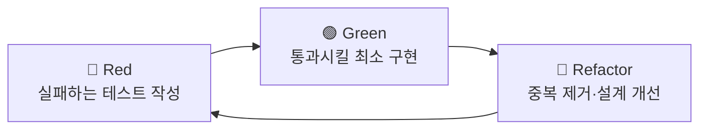

<figure class="post-figure post-figure--header">
<svg role="img" aria-label="TDD의 Red-Green-Refactor 사이클을 한 장에 담은 그림. 세 박자가 시계 방향 원을 이룬다. 위쪽 Red는 실패하는 테스트를 먼저 쓰는 단계로 X 표시가 붙은 빨간 막대, 오른쪽 아래 Green은 테스트를 통과시키는 최소 구현 단계로 체크 표시가 붙은 초록 막대, 왼쪽 아래 Refactor는 초록을 유지한 채 중복을 제거하고 설계를 다듬는 정리 단계의 빗자루 모양이다. 가운데에는 항상 초록으로 돌아오는 짧은 거리를 유지하라는 짧은 보폭 표시가 있고, 세 단계는 화살표로 끝없이 순환한다." viewBox="0 0 680 300" xmlns="http://www.w3.org/2000/svg">
  <title>TDD 사이클 — Red(실패 테스트) → Green(최소 구현) → Refactor(정리) → 다시 Red</title>

  <!-- ===== cyclic arrows between the three beats ===== -->
  <!-- Red(top) -> Green(bottom-right) -->
  <path d="M 408 92 A 150 150 0 0 1 452 210" fill="none" stroke="var(--secondary-color)" stroke-width="2.5" marker-end="url(#tdd-arrow)"/>
  <!-- Green(bottom-right) -> Refactor(bottom-left) -->
  <path d="M 388 248 A 150 150 0 0 1 292 248" fill="none" stroke="var(--secondary-color)" stroke-width="2.5" marker-end="url(#tdd-arrow)"/>
  <!-- Refactor(bottom-left) -> Red(top) -->
  <path d="M 228 210 A 150 150 0 0 1 272 92" fill="none" stroke="var(--secondary-color)" stroke-width="2.5" marker-end="url(#tdd-arrow)"/>

  <!-- ===== center: short-distance / baby-steps marker ===== -->
  <circle cx="340" cy="170" r="46" fill="var(--bg-light)" stroke="currentColor" stroke-width="1.5" opacity="0.85"/>
  <text x="340" y="162" text-anchor="middle" font-size="11" fill="currentColor" font-weight="700">짧은 보폭</text>
  <text x="340" y="180" text-anchor="middle" font-size="9" fill="currentColor" opacity="0.8">언제나 초록으로</text>
  <text x="340" y="194" text-anchor="middle" font-size="9" fill="currentColor" opacity="0.8">돌아올 거리</text>

  <!-- ===== Red node (top) ===== -->
  <circle cx="340" cy="58" r="42" fill="var(--bg-panel)" stroke="var(--accent-color)" stroke-width="3"/>
  <!-- failing-test bar with X -->
  <rect x="318" y="40" width="44" height="10" rx="2" fill="none" stroke="var(--accent-color)" stroke-width="2.5"/>
  <line x1="324" y1="34" x2="334" y2="44" stroke="var(--accent-color)" stroke-width="2.5"/>
  <line x1="334" y1="34" x2="324" y2="44" stroke="var(--accent-color)" stroke-width="2.5"/>
  <text x="340" y="72" text-anchor="middle" font-size="13" fill="currentColor" font-weight="700">Red</text>
  <text x="340" y="118" text-anchor="middle" font-size="10" fill="currentColor" opacity="0.85" font-weight="700">실패하는 테스트 먼저</text>

  <!-- ===== Green node (bottom-right) ===== -->
  <circle cx="486" cy="232" r="42" fill="var(--bg-panel)" stroke="var(--secondary-color)" stroke-width="3"/>
  <!-- passing-test bar with check -->
  <rect x="464" y="214" width="44" height="10" rx="2" fill="none" stroke="var(--secondary-color)" stroke-width="2.5"/>
  <path d="M 470 219 L 476 225 L 488 211" fill="none" stroke="var(--secondary-color)" stroke-width="2.5" stroke-linecap="round" stroke-linejoin="round"/>
  <text x="486" y="246" text-anchor="middle" font-size="13" fill="currentColor" font-weight="700">Green</text>
  <text x="486" y="292" text-anchor="middle" font-size="10" fill="currentColor" opacity="0.85" font-weight="700">통과시킬 최소 구현</text>

  <!-- ===== Refactor node (bottom-left) ===== -->
  <circle cx="194" cy="232" r="42" fill="var(--bg-panel)" stroke="var(--gold)" stroke-width="3"/>
  <!-- broom / tidy-up motif -->
  <line x1="206" y1="208" x2="186" y2="226" stroke="var(--gold)" stroke-width="2.5" stroke-linecap="round"/>
  <path d="M 186 226 L 176 234 M 184 228 L 175 237 M 182 230 L 174 240" stroke="var(--gold)" stroke-width="2" stroke-linecap="round"/>
  <text x="194" y="246" text-anchor="middle" font-size="13" fill="currentColor" font-weight="700">Refactor</text>
  <text x="194" y="292" text-anchor="middle" font-size="10" fill="currentColor" opacity="0.85" font-weight="700">중복 제거·설계 개선</text>

  <defs>
    <marker id="tdd-arrow" markerWidth="9" markerHeight="9" refX="6.5" refY="4.5" orient="auto">
      <path d="M0,0 L9,4.5 L0,9 z" fill="var(--secondary-color)"/>
    </marker>
  </defs>
</svg>
<figcaption>TDD의 심장은 <strong>세 박자의 순환</strong> — <strong>Red</strong>(실패하는 테스트를 먼저 쓰고) → <strong>Green</strong>(통과시킬 최소 구현으로 초록 막대를 만들고) → <strong>Refactor</strong>(초록을 유지한 채 중복을 걷어내) → 다시 Red. 가운데의 <strong>짧은 보폭</strong>은 언제나 초록으로 돌아올 수 있는 거리를 유지하라는 이 책의 핵심 규율이다.</figcaption>
</figure>

## 들어가며

이 글은 `Testing-Refactoring-Essential` 시리즈의 **1단계**입니다. 전체 학습 흐름이 궁금하다면 먼저 [Testing-Refactoring Essential Curriculum](/2026/06/19/testing-refactoring-essential-curriculum.html)에서 네 권의 고전으로 짜인 로드맵을 확인하세요.

1단계의 텍스트는 TDD의 정전(正典)인 Kent Beck의 *Test-Driven Development By Example*입니다. 이 책의 핵심은 거창한 이론이 아니라 **리듬**입니다. 실패하는 테스트를 먼저 쓰고(Red), 그것을 통과시키는 최소한의 코드를 짜고(Green), 중복을 걷어내(Refactor) 다시 처음으로 돌아오는 짧은 사이클을 몸에 새기는 것이죠. Beck의 표현을 빌리면 TDD는 "두려움을 지루함으로 바꾸는" 기술입니다.

이 글에서는 책의 고전 예제인 **Money(다중 통화)** 예제를 Python과 `pytest`로 재현하며 그 리듬을 직접 따라가 봅니다. 다음 글은 같은 저자 Kent Beck의 회고 [TDD, 7년 후: 회고와 현대적 관점](/2026/06/19/tdd-seven-years-after.html)으로 이어지며, 정전으로 배운 이 사이클을 수년의 실천으로 다듬은 시각에서 다시 읽습니다.

<div class="post-summary-box" markdown="1">

### 📌 이 글에서 다루는 내용

#### 🔍 핵심 주제

- **Red-Green-Refactor 사이클**: 실패 테스트 → 최소 구현 → 정리로 이어지는 짧은 리듬을 체화
- **Test-First**: 코드보다 먼저 "의도"를 테스트라는 실행 가능한 명세로 표현
- **Baby Steps · Fake It · Triangulation**: 상수를 그대로 반환하는 가짜 구현에서 두 번째 예제로 일반화까지
- **To-Do List**: 떠오르는 작업을 적어 두고 한 번에 하나씩 처리해 집중을 잃지 않는 법
- **xUnit 패턴**: 테스트 러너가 `setUp → test → tearDown`을 호출하는 원리

</div>

## Red-Green-Refactor 사이클

TDD의 심장은 세 박자로 이루어진 사이클입니다.

- **Red**: 아직 존재하지 않는 동작에 대해 실패하는 테스트를 먼저 작성합니다. 테스트가 빨갛게(실패) 떠야 합니다. 컴파일/임포트조차 안 되는 것도 정당한 Red입니다.
- **Green**: 그 테스트를 통과시키는 **가장 빠르고 단순한** 코드를 짭니다. 이 단계의 목표는 "올바른 설계"가 아니라 "초록 막대(green bar)"입니다. 죄책감 없이 상수를 반환해도 됩니다.
- **Refactor**: 초록 상태를 유지한 채 중복을 제거하고 이름을 다듬어 설계를 개선합니다. 테스트가 안전망 역할을 하므로 두려움 없이 구조를 바꿀 수 있습니다.

이 세 박자의 핵심은 **항상 초록으로 돌아올 수 있는 짧은 거리**를 유지하는 것입니다. 빨간 상태로 오래 머물수록 불안이 커지고 디버깅 비용이 늘어납니다.



## 테스트 우선(Test-First): 의도를 먼저 적는다

TDD에서 테스트는 사후 검증 도구가 아니라 **설계 행위**입니다. 코드를 쓰기 전에 테스트를 쓰면, 우리는 자연스럽게 "이 객체를 **어떻게 쓰고 싶은가**"를 먼저 결정하게 됩니다. 즉 테스트는 구현이 정해지기 전에 API(사용법)를 먼저 그려 보는 스케치입니다.

Money 예제의 출발점도 마찬가지입니다. 우리는 아직 `Dollar` 클래스가 없지만, 그것을 **어떻게 쓰고 싶은지**를 먼저 테스트로 적습니다. "5달러에 2를 곱하면 10달러가 되어야 한다"는 의도를 코드로 옮기는 것이죠.

> *원서는 같은 개념을 Java(Money)와 Python(xUnit) 두 파트로 나눠 보여 줍니다. 이 글은 두 파트를 모두 Python + `pytest`로 통일해 재현합니다.*

```python
# test_money.py — 아직 Dollar 클래스는 존재하지 않는다. 의도를 먼저 적는다.
def test_multiplication():
    five = Dollar(5)        # 5달러를 만들고
    five.times(2)           # 2를 곱하면
    assert five.amount == 10  # 결과 금액은 10이어야 한다
```

이 테스트는 당연히 실패합니다(`Dollar`가 없으니 임포트조차 안 됩니다). 이것이 정당한 **Red**입니다. 우리는 실패를 확인함으로써 "테스트 자체가 제대로 동작한다"는 사실을 검증합니다.

## To-Do List: 떠오르는 작업을 흘려보내지 않기

테스트를 쓰다 보면 머릿속에 곁가지 작업들이 계속 떠오릅니다. "곱셈 결과를 새 객체로 반환해야 하지 않나?", "통화가 다르면 어떻게 더하지?" 같은 것들이죠. 이걸 그 자리에서 다 처리하려 하면 사이클이 무너집니다.

Beck의 처방은 단순합니다. **할 일 목록(To-Do List)에 적어 두고, 지금 하는 하나에만 집중**합니다. 처리할 항목은 평범한 글씨로, 끝낸 항목은 줄을 그어(또는 체크로) 표시합니다.

```text
To-Do List
[x] $5 * 2 = $10        ← 지금 처리 중
[ ] amount를 private으로 (객체가 amount를 직접 노출하지 않게)
[ ] Dollar 동치(equality) 비교
[ ] $5 + $10 CHF = $10 (환율 2:1)
[ ] Dollar/Franc 중복 제거 → Money로 통합
```

이 목록은 작업 기억(working memory)을 외부화해 주는 장치입니다. 새 아이디어는 목록에 던져 두고, 우리는 **언제나 한 번에 하나의 빨간 테스트**만 다룹니다.

## 작은 보폭(Baby Steps): Fake It에서 시작하기

이제 Red를 Green으로 바꿀 차례입니다. 여기서 초보가 흔히 저지르는 실수는 곧바로 "올바른" 구현을 시도하는 것입니다. TDD는 정반대를 권합니다. **테스트를 통과시키는 가장 뻔뻔한 코드**부터 짭니다. 이것이 **Fake It**(가짜 구현)입니다.

```python
# money.py — 통과만 시키는 가장 단순한(=가짜) 구현
class Dollar:
    def __init__(self, amount):
        self.amount = amount

    def times(self, multiplier):
        # 상수 10을 그대로 박아 넣는다. 일단 초록 막대가 목표다.
        self.amount = 10
```

`self.amount = 10`은 명백히 틀린 구현이지만, 테스트는 **통과**합니다. 이게 바로 Green입니다. "이렇게 가짜로 짜도 되나?" 싶은 불편함이 정상입니다. 이 불편함이 다음 단계를 이끕니다.

가짜 구현이 가치 있는 이유는 두 가지입니다. 첫째, **초록 막대라는 안전한 기준점**을 즉시 확보합니다. 둘째, 이제 "10이라는 상수를 어떻게 진짜 계산으로 일반화할까?"라는 **명확한 다음 질문**이 생깁니다. 막연한 설계 고민이 구체적 작업으로 좁혀지는 것이죠.

## Triangulation: 두 번째 예제로 일반화 강제하기

가짜 구현을 진짜로 끌어올리는 한 가지 기법이 **Triangulation(삼각측량)**입니다. 두 점이 있어야 직선을 그을 수 있듯, **예제가 둘 이상일 때** 비로소 올바른 일반화의 방향이 강제됩니다. 그래서 두 번째 테스트를 추가합니다.

```python
# test_money.py — 두 번째 예제를 추가해 일반화를 강제한다
def test_multiplication():
    five = Dollar(5)
    five.times(2)
    assert five.amount == 10

def test_multiplication_by_three():
    five = Dollar(5)
    five.times(3)          # 다른 배수
    assert five.amount == 15  # 상수 10으로는 통과할 수 없다
```

`self.amount = 10`은 이제 두 번째 테스트에서 깨집니다(Red). 두 예제를 동시에 만족시키려면 상수로는 불가능하고, 진짜 곱셈이 필요합니다. 이렇게 **두 번째 점**이 일반화를 끌어냅니다.

```python
# money.py — 두 예제를 모두 통과시키는 진짜 구현
class Dollar:
    def __init__(self, amount):
        self.amount = amount

    def times(self, multiplier):
        # 상수를 amount * multiplier로 일반화한다
        self.amount = self.amount * multiplier
```

> 실무에서는 일반화가 자명할 때 Triangulation 없이 곧바로 진짜 구현(Obvious Implementation)으로 점프하기도 합니다. Fake It → Triangulation은 **확신이 없을 때** 안전하게 일반화로 건너가는 다리입니다.

세 전략은 "얼마나 확신하느냐"라는 **자신감의 눈금** 위에 놓입니다. 확신이 낮을수록 보폭을 줄여 가짜 구현에서 출발하고, 확신이 높을수록 곧바로 진짜 구현으로 건너뜁니다.

<figure class="post-figure">
<svg role="img" aria-label="가짜 구현, 삼각측량, 명백한 구현 세 전략을 자신감의 눈금 위에 배치한 그림. 왼쪽 끝은 확신이 낮은 구간으로 상수를 그대로 반환하는 가짜 구현, 가운데는 두 번째 예제를 추가해 일반화를 강제하는 삼각측량, 오른쪽 끝은 확신이 높은 구간으로 곧바로 진짜 코드를 쓰는 명백한 구현이다. 아래에는 왼쪽으로 갈수록 보폭이 작고 안전하며 오른쪽으로 갈수록 보폭이 크고 빠르다는 화살표가 있다." viewBox="0 0 680 250" xmlns="http://www.w3.org/2000/svg">
  <title>구현 전략의 스펙트럼 — Fake It · Triangulation · Obvious Implementation을 자신감 눈금 위에 배치</title>

  <!-- confidence axis -->
  <text x="340" y="26" text-anchor="middle" font-size="12" fill="currentColor" font-weight="700" opacity="0.75">자신감(확신)의 눈금</text>
  <line x1="60" y1="48" x2="620" y2="48" stroke="currentColor" stroke-width="2" marker-end="url(#tri-arrow)"/>
  <text x="60" y="40" text-anchor="start" font-size="9" fill="currentColor" opacity="0.8">낮음</text>
  <text x="612" y="40" text-anchor="end" font-size="9" fill="currentColor" opacity="0.8">높음</text>

  <!-- ===== Fake It (left) ===== -->
  <rect x="56" y="70" width="180" height="92" rx="4" fill="var(--bg-panel)" stroke="var(--accent-color)" stroke-width="2.5"/>
  <text x="146" y="92" text-anchor="middle" font-size="12" fill="currentColor" font-weight="700">Fake It</text>
  <text x="146" y="108" text-anchor="middle" font-size="9" fill="currentColor" opacity="0.85">가짜 구현</text>
  <text x="146" y="130" text-anchor="middle" font-size="9.5" fill="currentColor" font-weight="700">return 10</text>
  <text x="146" y="148" text-anchor="middle" font-size="8.5" fill="currentColor" opacity="0.8">상수를 박아 초록부터</text>

  <!-- ===== Triangulation (center) ===== -->
  <rect x="250" y="70" width="180" height="92" rx="4" fill="var(--bg-panel)" stroke="var(--gold)" stroke-width="2.5"/>
  <text x="340" y="92" text-anchor="middle" font-size="12" fill="currentColor" font-weight="700">Triangulation</text>
  <text x="340" y="108" text-anchor="middle" font-size="9" fill="currentColor" opacity="0.85">삼각측량</text>
  <text x="340" y="130" text-anchor="middle" font-size="9.5" fill="currentColor" font-weight="700">예제 2개 → 일반화</text>
  <text x="340" y="148" text-anchor="middle" font-size="8.5" fill="currentColor" opacity="0.8">두 번째 점이 방향을 강제</text>

  <!-- ===== Obvious Implementation (right) ===== -->
  <rect x="444" y="70" width="180" height="92" rx="4" fill="var(--bg-panel)" stroke="var(--secondary-color)" stroke-width="2.5"/>
  <text x="534" y="92" text-anchor="middle" font-size="12" fill="currentColor" font-weight="700">Obvious Impl.</text>
  <text x="534" y="108" text-anchor="middle" font-size="9" fill="currentColor" opacity="0.85">명백한 구현</text>
  <text x="534" y="130" text-anchor="middle" font-size="9.5" fill="currentColor" font-weight="700">amount * mult</text>
  <text x="534" y="148" text-anchor="middle" font-size="8.5" fill="currentColor" opacity="0.8">곧바로 진짜 코드</text>

  <!-- step-size gradient note -->
  <line x1="146" y1="186" x2="534" y2="186" stroke="var(--secondary-color)" stroke-width="2" stroke-dasharray="4 4"/>
  <circle cx="146" cy="186" r="4" fill="var(--accent-color)"/>
  <circle cx="340" cy="186" r="6" fill="var(--gold)"/>
  <circle cx="534" cy="186" r="9" fill="var(--secondary-color)"/>
  <text x="146" y="214" text-anchor="middle" font-size="9" fill="currentColor" opacity="0.85">작은 보폭 · 가장 안전</text>
  <text x="340" y="214" text-anchor="middle" font-size="9" fill="currentColor" opacity="0.85">중간 보폭</text>
  <text x="534" y="214" text-anchor="middle" font-size="9" fill="currentColor" opacity="0.85">큰 보폭 · 가장 빠름</text>
  <text x="340" y="236" text-anchor="middle" font-size="9" fill="currentColor" opacity="0.7">확신이 낮을수록 왼쪽에서 출발 → 확신이 서면 오른쪽으로 점프</text>

  <defs>
    <marker id="tri-arrow" markerWidth="9" markerHeight="9" refX="6.5" refY="4.5" orient="auto">
      <path d="M0,0 L9,4.5 L0,9 z" fill="currentColor"/>
    </marker>
  </defs>
</svg>
<figcaption>구현 전략은 하나의 <strong>스펙트럼</strong>이다 — <strong>Fake It</strong>(상수를 박아 초록부터 확보) → <strong>Triangulation</strong>(두 번째 예제로 일반화를 강제) → <strong>Obvious Implementation</strong>(곧바로 진짜 코드). 확신이 낮을수록 보폭을 줄여 왼쪽에서 출발하고, 확신이 서면 오른쪽으로 점프한다. 점의 크기는 한 번에 내딛는 보폭을 뜻한다.</figcaption>
</figure>

## Refactor: 동치(equality)와 부수효과 제거

테스트는 초록입니다. 이제 세 번째 박자인 Refactor 차례입니다. 현재 `times`가 **자기 자신의 상태를 바꾸는(부수효과)** 점이 거슬립니다. `five.times(2)`를 두 번 호출하면 결과가 누적돼 버립니다. To-Do List에 적어 둔 대로, `times`가 **새 객체를 반환**하도록 바꾸고 싶습니다. 그러려면 먼저 두 `Dollar`를 비교할 **동치**가 필요합니다.

값 객체(value object)는 동일성이 아니라 **값**으로 같아야 합니다. 동치 테스트를 먼저 작성합니다(Red).

```python
# test_money.py — 값으로 같은지 비교하는 동치를 먼저 명세한다
def test_equality():
    assert Dollar(5) == Dollar(5)   # 같은 금액이면 같다
    assert Dollar(5) != Dollar(6)   # 다른 금액이면 다르다
```

```python
# money.py — __eq__로 값 동치를 구현(여기서도 Triangulation: ==와 != 두 점)
class Dollar:
    def __init__(self, amount):
        self.amount = amount

    def times(self, multiplier):
        # 부수효과 대신 새 Dollar를 반환한다(불변 값 객체로 전환)
        return Dollar(self.amount * multiplier)

    def __eq__(self, other):
        return self.amount == other.amount
```

이제 `times`는 새 객체를 돌려주므로 테스트도 자연스럽게 따라옵니다.

```python
# test_money.py — 곱셈이 새 객체를 반환하도록 의도를 갱신
def test_multiplication():
    five = Dollar(5)
    assert five.times(2) == Dollar(10)   # 새 객체끼리 값으로 비교
    assert five.times(3) == Dollar(15)
```

## Money로의 일반화: 중복이 설계를 부른다

원서의 다음 흐름은 `Franc`(스위스 프랑) 같은 통화를 추가하면서 `Dollar`와의 **중복**을 발견하고, 공통 상위 개념인 `Money`로 끌어올리는 것입니다. 여기서 핵심 교훈은 **중복 제거가 곧 설계**라는 점입니다. 두 클래스의 `__eq__`와 `times`가 똑같아지는 순간, 그 중복이 "이걸 하나로 합쳐라"라고 설계 방향을 알려 줍니다.

```python
# money.py — Dollar/Franc의 중복을 Money로 끌어올린다
class Money:
    def __init__(self, amount, currency):
        self.amount = amount
        self.currency = currency        # 통화를 값에 포함시켜 일반화

    def times(self, multiplier):
        return Money(self.amount * multiplier, self.currency)

    def __eq__(self, other):
        # 금액과 통화가 모두 같아야 같은 값
        return self.amount == other.amount and self.currency == other.currency

    @staticmethod
    def dollar(amount):
        return Money(amount, "USD")     # 팩토리: 사용처는 구체 클래스를 몰라도 된다

    @staticmethod
    def franc(amount):
        return Money(amount, "CHF")
```

```python
# test_money.py — 통화까지 포함한 동치/곱셈 명세
def test_currency():
    assert Money.dollar(5).currency == "USD"
    assert Money.franc(5).currency == "CHF"

def test_equality():
    assert Money.dollar(5) == Money.dollar(5)
    assert Money.dollar(5) != Money.franc(5)   # 금액이 같아도 통화가 다르면 다르다
```

이 과정이 보여 주듯, TDD에서 설계는 **미리 완성해 두는 것이 아니라 사이클을 돌리며 자라나는 것**입니다. `$5 + $10 CHF` 같은 통화 간 덧셈(Bank·Expression)은 같은 리듬으로 To-Do List를 하나씩 비워 가며 키워 나가면 됩니다.

## xUnit 패턴: 테스트 러너는 어떻게 동작하나

원서의 2부는 흥미롭게도 **테스트 프레임워크 자체를 TDD로 만드는** 내용입니다. `pytest`나 `unittest` 같은 도구가 마법처럼 느껴지지만, 핵심 골격(xUnit 패턴)은 의외로 단순합니다. 러너는 각 테스트마다 다음 순서를 호출합니다.

1. **`setUp`**: 테스트가 쓸 깨끗한 환경(fixture)을 준비한다.
2. **test 메서드**: 실제 검증을 수행한다.
3. **`tearDown`**: 테스트가 남긴 자원을 정리해 다음 테스트에 영향이 없게 한다.

여기서 중요한 원칙은 **테스트 격리(isolation)**입니다. 각 테스트는 자신만의 `setUp`으로 시작하므로 실행 순서에 의존하지 않습니다. 골격을 아주 단순화하면 이렇게 생겼습니다.

```python
# 미니 xUnit: 러너가 setUp → test → tearDown을 순서대로 호출한다
class TestCase:
    def __init__(self, name):
        self.name = name        # 실행할 테스트 메서드 이름

    def set_up(self):
        pass                    # 하위 클래스가 fixture 준비를 오버라이드

    def tear_down(self):
        pass                    # 하위 클래스가 정리 로직을 오버라이드

    def run(self):
        self.set_up()                       # 1) 준비
        method = getattr(self, self.name)
        method()                            # 2) 테스트 본문 실행
        self.tear_down()                    # 3) 정리 (실패해도 보장하려면 try/finally)
```

`pytest`의 fixture, `unittest`의 `setUp`/`tearDown`도 결국 이 패턴의 정교한 확장입니다. 이 원리를 알면 프레임워크가 "왜 각 테스트마다 fixture를 새로 만드는가"를 직관적으로 이해하게 됩니다.

```bash
# 작성한 테스트는 pytest 한 줄로 돌린다
pytest test_money.py -v
```

## 마무리

TDD는 테스트 기법이기 이전에 **설계 기법**입니다. 실패 테스트로 의도를 먼저 적고(Red), 가짜 구현이라도 빠르게 초록을 만든 뒤(Green), 중복을 제거하며 설계를 키워 가는(Refactor) 리듬을 반복합니다. Fake It으로 부담 없이 출발해 Triangulation으로 일반화를 강제하고, To-Do List로 집중을 지키며, 떠오르는 중복을 신호 삼아 `Dollar`를 `Money`로 키워 냈습니다. Money 예제가 보여 준 것은 "설계를 미리 다 끝내지 않아도, 작은 보폭이 결국 좋은 구조로 수렴한다"는 점입니다.

핵심은 **항상 초록으로 돌아올 수 있는 작은 거리**를 유지하는 것입니다. 이 정전을 손에 익혔다면, 다음 글에서는 같은 저자가 수년의 실천 뒤에 남긴 회고를 통해 "규칙"이 아니라 "효과"로 TDD를 다시 보는 성숙한 시각을 챙길 차례입니다.

### 다음 학습

- [Testing-Refactoring Essential Curriculum](/2026/06/19/testing-refactoring-essential-curriculum.html) — 전체 로드맵 다시 보기
- [TDD, 7년 후: 회고와 현대적 관점](/2026/06/19/tdd-seven-years-after.html) — 2단계: TDD를 수년간 실천한 뒤의 회고와 현대적 관점
