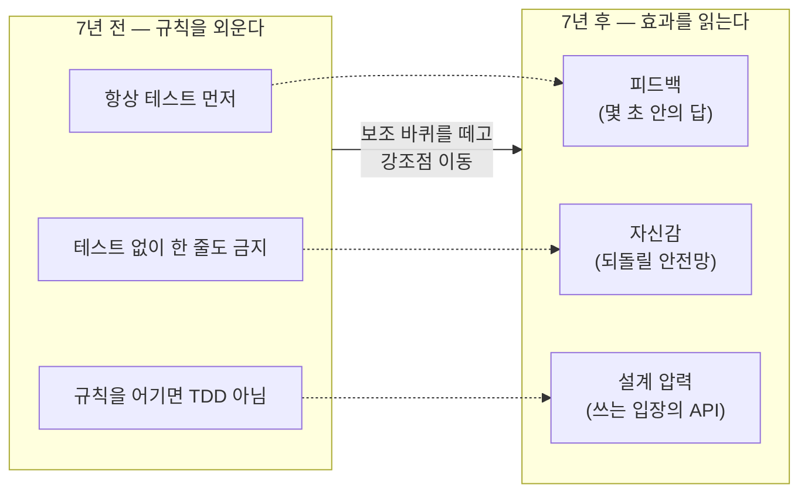

<figure class="post-figure post-figure--header">
<svg role="img" aria-label="TDD를 맹신이나 배척의 이분법이 아니라, 비용과 가치를 저울질해 맥락에 맞게 적용하는 도구로 보는 그림. 왼쪽에는 한쪽 접시에 테스트를 갖추는 비용, 다른 접시에 피드백·자신감·설계 압력이라는 가치를 올린 저울이 있고, 오른쪽에는 끄기(skip)와 켜기(always) 사이를 잇는 눈금 막대 위에서 바늘이 가운데의 적정 지점을 가리키며 TDD가 켜고 끄는 스위치가 아니라 스펙트럼임을 보여 준다." viewBox="0 0 680 300" xmlns="http://www.w3.org/2000/svg">
  <title>TDD는 도그마가 아니라 도구 — 비용 대 가치를 저울질하고(왼쪽), on/off가 아닌 스펙트럼으로 적용한다(오른쪽)</title>

  <!-- ===== LEFT: cost vs value balance scale ===== -->
  <text x="170" y="26" text-anchor="middle" font-size="12" fill="currentColor" font-weight="700" opacity="0.75">비용 대 가치를 저울질</text>

  <!-- stand -->
  <line x1="170" y1="70" x2="170" y2="232" stroke="currentColor" stroke-width="2.5"/>
  <rect x="146" y="232" width="48" height="10" rx="2" fill="var(--bg-light)" stroke="currentColor" stroke-width="2"/>
  <!-- pivot + beam (tilted slightly toward value = right pan lower) -->
  <circle cx="170" cy="70" r="4" fill="var(--gold)" stroke="currentColor" stroke-width="1.5"/>
  <line x1="92" y1="62" x2="248" y2="78" stroke="currentColor" stroke-width="2.5"/>

  <!-- left pan: cost -->
  <line x1="92" y1="62" x2="92" y2="96" stroke="currentColor" stroke-width="1.5"/>
  <path d="M70 96 a22 12 0 0 0 44 0 z" fill="var(--bg-light)" stroke="currentColor" stroke-width="2"/>
  <rect x="74" y="112" width="36" height="26" rx="3" fill="var(--bg-light)" stroke="var(--secondary-color)" stroke-width="2"/>
  <text x="92" y="129" text-anchor="middle" font-size="9" fill="currentColor" font-weight="700">비용</text>
  <text x="92" y="156" text-anchor="middle" font-size="7.5" fill="currentColor" opacity="0.75">작성·실행·유지</text>

  <!-- right pan: value (sits lower → weighs more) -->
  <line x1="248" y1="78" x2="248" y2="118" stroke="currentColor" stroke-width="1.5"/>
  <path d="M222 118 a26 13 0 0 0 52 0 z" fill="var(--bg-panel)" stroke="var(--accent-color)" stroke-width="2.2"/>
  <rect x="216" y="136" width="64" height="44" rx="3" fill="var(--bg-light)" stroke="var(--accent-color)" stroke-width="2.2"/>
  <text x="248" y="152" text-anchor="middle" font-size="9" fill="currentColor" font-weight="700">가치</text>
  <text x="248" y="165" text-anchor="middle" font-size="7.5" fill="currentColor" opacity="0.85">피드백·자신감</text>
  <text x="248" y="176" text-anchor="middle" font-size="7.5" fill="currentColor" opacity="0.85">설계 압력</text>

  <!-- divider -->
  <line x1="360" y1="44" x2="360" y2="236" stroke="currentColor" stroke-width="1" opacity="0.25"/>

  <!-- ===== RIGHT: TDD as a spectrum dial, not on/off ===== -->
  <text x="520" y="26" text-anchor="middle" font-size="12" fill="currentColor" font-weight="700" opacity="0.75">스위치가 아니라 스펙트럼</text>

  <!-- spectrum track -->
  <line x1="408" y1="120" x2="632" y2="120" stroke="currentColor" stroke-width="3" opacity="0.55"/>
  <!-- ticks -->
  <g stroke="currentColor" stroke-width="1.5" opacity="0.5">
    <line x1="408" y1="112" x2="408" y2="128"/>
    <line x1="464" y1="114" x2="464" y2="126"/>
    <line x1="520" y1="110" x2="520" y2="130"/>
    <line x1="576" y1="114" x2="576" y2="126"/>
    <line x1="632" y1="112" x2="632" y2="128"/>
  </g>
  <!-- end labels -->
  <text x="408" y="150" text-anchor="middle" font-size="9" fill="currentColor" font-weight="700">끄기</text>
  <text x="408" y="162" text-anchor="middle" font-size="7.5" fill="currentColor" opacity="0.75">일회성·탐색</text>
  <text x="632" y="150" text-anchor="middle" font-size="9" fill="currentColor" font-weight="700">언제나</text>
  <text x="632" y="162" text-anchor="middle" font-size="7.5" fill="currentColor" opacity="0.75">도그마</text>

  <!-- needle pointing to the judged sweet spot (slightly right of center) -->
  <line x1="520" y1="120" x2="544" y2="80" stroke="var(--accent-color)" stroke-width="3" marker-end="url(#tdd-tip)"/>
  <circle cx="520" cy="120" r="6" fill="var(--gold)" stroke="currentColor" stroke-width="1.8"/>
  <rect x="494" y="56" width="100" height="24" rx="3" fill="var(--bg-panel)" stroke="var(--gold)" stroke-width="2"/>
  <text x="544" y="72" text-anchor="middle" font-size="9" fill="currentColor" font-weight="700">어디에 얼마나</text>

  <!-- bottom note -->
  <text x="520" y="206" text-anchor="middle" font-size="9.5" fill="currentColor" opacity="0.8" font-weight="700">하느냐 마느냐가 아니라 — 어디에 얼마나</text>
  <text x="520" y="224" text-anchor="middle" font-size="8" fill="currentColor" opacity="0.7">비용이 가치를 앞서면 줄이고, 가치가 비용을 앞서면 늘린다</text>

  <defs>
    <marker id="tdd-tip" markerWidth="9" markerHeight="9" refX="5" refY="4.5" orient="auto">
      <path d="M0,0 L9,4.5 L0,9 z" fill="var(--accent-color)"/>
    </marker>
  </defs>
</svg>
<figcaption>이 회고의 한 줄 — TDD는 <strong>도그마가 아니라 도구</strong>다. 한쪽에는 테스트를 갖추는 <strong>비용</strong>, 다른 쪽에는 피드백·자신감·설계 압력이라는 <strong>가치</strong>를 올려 저울질하고(왼쪽), 켜고 끄는 스위치가 아니라 <strong>끄기↔언제나</strong> 사이의 스펙트럼 위에서 "어디에 얼마나" 적용할지를 고른다(오른쪽).</figcaption>
</figure>

## 들어가며

이 글은 `Testing-Refactoring-Essential` 시리즈의 **2단계**입니다. 앞선 1단계 [TDD By Example: 테스트가 이끄는 설계 (Red-Green-Refactor)](/2026/06/19/tdd-by-example.html)에서 우리는 Red-Green-Refactor라는 정전(正典)의 리듬을 배웠습니다. 규칙을 익혔다면, 곧바로 같은 저자가 그 규칙을 수년간 실천한 뒤의 회고를 듣는 것이 좋습니다. 이번 글은 TDD를 "규칙의 묶음"이 아니라 "효과를 얻는 도구"로 다시 세우고, 뒤이어 배울 *Refactoring*과 *GOOS*가 왜 필요한지를 미리 가리킵니다.

기준이 되는 텍스트는 Kent Beck이 *Test-Driven Development By Example* 출간 이후 수년의 실천을 돌아보며 남긴 회고(*TDD - Seven Years After* 결의 글들)입니다. 1단계에서 정전(正典)으로 배운 Red-Green-Refactor를, 실전에서 깎이고 다듬어진 시각으로 다시 읽는 셈입니다. 전체 지도는 [Testing-Refactoring Essential Curriculum](/2026/06/19/testing-refactoring-essential-curriculum.html)에서 확인할 수 있습니다. 다음 3단계는 [Refactoring: 동작을 지키며 설계를 개선하는 규율](/2026/06/19/refactoring-improving-design.html)로 이어집니다.

<div class="post-summary-box" markdown="1">

### 📌 이 글에서 다루는 내용

#### 🔍 핵심 주제

- **TDD에 대한 회고**: 원칙이 실전에서 어떻게 다듬어졌는지, TDD가 실제로 주는 것(피드백·자신감·설계 압력)과 흔히 도는 오해들
- **테스트 더블 트레이드오프 (London vs Classicist)**: 상호작용 검증과 상태 검증의 대비, 같은 단위를 두 스타일로 테스트해 보며 찾는 균형점
- **TDD를 언제 적용할지**: always-TDD 도그마를 넘어서, test desiderata(빠름·격리·결정성 등)로 비용과 가치를 따져 선택하는 판단력

</div>

## TDD에 대한 회고: 원칙은 실전에서 어떻게 다듬어졌나

처음 TDD를 배울 때 우리는 규칙을 외웁니다. "항상 실패하는 테스트를 먼저 짜라", "테스트 없이는 한 줄도 쓰지 마라". 규칙은 입문자에게 필요한 보조 바퀴입니다. 그러나 수년을 실천하고 나면, Beck 본인의 회고가 그렇듯, 강조점이 규칙에서 **그 규칙이 주는 효과**로 옮겨 갑니다.

7년 전과 후의 시선 변화는 이렇게 요약됩니다 — 강조점이 *외워야 할 규칙*에서 *얻어야 할 효과*로 이동합니다.



### TDD가 실제로 주는 세 가지

- **피드백(Feedback)**: TDD의 본질은 "지금 내가 짠 코드가 의도대로 동작하는가"에 대한 답을 *몇 초 안에* 받는 것입니다. 사이클이 짧을수록 잘못된 가정이 멀리 가기 전에 잡힙니다. 디버깅에 쏟던 긴 시간을, 짧은 검증의 반복으로 바꿉니다.
- **자신감(Confidence)**: 초록 막대가 켜져 있다는 사실은 "되돌릴 안전망이 있다"는 심리적 토대를 만듭니다. 자신감은 곧 변경의 속도입니다. 두려움이 줄면 리팩터링을 미루지 않게 되고, 코드는 계속 진화할 수 있습니다.
- **설계 압력(Design Pressure)**: 이것이 가장 과소평가되는 효과입니다. 테스트를 *먼저* 쓰려면 그 단위를 어떻게 호출할지를 먼저 정해야 합니다. 즉 TDD는 사용자 입장에서 API를 설계하도록 강제합니다. "테스트하기 어렵다"는 거의 항상 "설계가 어딘가 굳어 있다"는 신호입니다.

세 가지 중 무엇을 가장 원하느냐가 그날의 TDD 스타일을 결정합니다. 빠른 피드백이 급하면 보폭을 잘게, 설계를 탐색 중이면 인터페이스부터 거칠게 그려 봅니다.

### 흔한 오해들

- **"TDD = 100% 커버리지"**: 커버리지는 부산물이지 목표가 아닙니다. 숫자를 채우려 의미 없는 테스트를 늘리면, 테스트는 자산이 아니라 부채가 됩니다.
- **"테스트를 먼저 쓰면 항상 느려진다"**: 단기적으로는 타이핑이 늘지만, 디버깅·수동 검증·회귀 버그에 드는 시간을 합산하면 대개 역전됩니다. 단, 이것은 *맥락에 따라 다릅니다*(뒤의 판단 절에서 다룹니다).
- **"TDD를 하면 설계가 저절로 좋아진다"**: TDD는 설계 *압력*을 줄 뿐, 설계 *감각*까지 주지는 않습니다. 압력에 어떻게 응답할지는 여전히 사람의 몫입니다. 그래서 다음 단계의 [Refactoring](/2026/06/19/refactoring-improving-design.html)과 OO 설계 지식(4단계 GOOS)이 함께 필요합니다.
- **"규칙을 어기면 TDD가 아니다"**: 성숙한 실천가는 규칙을 *상황에 맞춰* 휘어 씁니다. 때로는 구현부터 짜고 사후에 테스트를 붙이기도 합니다. 중요한 건 의식(儀式)이 아니라 위 세 가지 효과를 얻고 있느냐입니다.

## 테스트 더블의 트레이드오프: London vs Classicist

TDD의 가장 오래된 논쟁은 "협력 객체를 어떻게 다룰 것인가"입니다. 두 학파가 있습니다.

- **London(mockist) 스타일**: 테스트 대상(SUT)을 협력 객체로부터 **격리**합니다. 협력자를 mock으로 대체하고, "SUT가 협력자에게 *올바른 메시지를 보냈는가*"라는 **상호작용(interaction)**을 검증합니다. 뒤이어 만날 4단계 GOOS가 이 계열의 대표이며, 거기서 이 스타일을 본격적인 실전으로 다룹니다.
- **Classicist(Detroit/state-based) 스타일**: 가능하면 협력 객체의 **실제 구현**을 함께 쓰고, 외부 효과(DB, 네트워크)처럼 진짜 곤란한 경계에만 더블을 둡니다. "동작이 끝난 뒤 *상태가 기대대로인가*"라는 **상태(state)**를 검증합니다.

### 같은 단위, 두 스타일

동일한 `OrderService`를 두 방식으로 테스트해 차이를 대비해 봅니다. `OrderService`는 재고를 확인해 차감하고 주문을 저장하는 단위입니다.

```python
# 테스트 대상 (SUT)과 협력 객체들 — 두 스타일이 공유하는 코드
class OutOfStockError(Exception):
    pass

class OrderService:
    def __init__(self, inventory, repository):
        self._inventory = inventory      # 재고 협력 객체
        self._repository = repository    # 저장소 협력 객체

    def place(self, sku, qty):
        # 재고가 모자라면 거절
        if self._inventory.available(sku) < qty:
            raise OutOfStockError(sku)
        self._inventory.reserve(sku, qty)   # 재고 차감(부수효과)
        order = {"sku": sku, "qty": qty}
        self._repository.save(order)        # 주문 저장(부수효과)
        return order
```

**① London(mockist): mock으로 상호작용 검증**

```python
from unittest.mock import Mock

def test_place_order_london():
    # 협력 객체를 모두 mock으로 대체해 SUT를 격리한다
    inventory = Mock()
    inventory.available.return_value = 10   # 재고 충분하다고 약속(stub)
    repository = Mock()

    service = OrderService(inventory, repository)
    service.place("ABC", 3)

    # "어떤 메시지를 보냈는가"를 검증한다 — 상호작용 검증
    inventory.reserve.assert_called_once_with("ABC", 3)
    repository.save.assert_called_once_with({"sku": "ABC", "qty": 3})
```

**② Classicist(Detroit): 실제 객체로 상태 검증**

```python
# 메모리 상에서 실제로 동작하는 단순 구현 — 테스트용 실객체
class InMemoryInventory:
    def __init__(self, stock):
        self._stock = dict(stock)
    def available(self, sku):
        return self._stock.get(sku, 0)
    def reserve(self, sku, qty):
        self._stock[sku] -= qty           # 실제로 재고를 깎는다

class InMemoryRepository:
    def __init__(self):
        self.saved = []
    def save(self, order):
        self.saved.append(order)          # 실제로 저장한다

def test_place_order_classicist():
    inventory = InMemoryInventory({"ABC": 10})
    repository = InMemoryRepository()

    service = OrderService(inventory, repository)
    service.place("ABC", 3)

    # "결과 상태가 기대대로인가"를 검증한다 — 상태 검증
    assert inventory.available("ABC") == 7   # 재고가 실제로 줄었다
    assert repository.saved == [{"sku": "ABC", "qty": 3}]
```

### 무엇이 다른가

- **결합도**: London 테스트는 `reserve`/`save`라는 *호출 시그니처와 순서*에 묶입니다. 협력 방식을 바꾸면(예: `reserve`를 `decrement`로 개명) 동작이 같아도 테스트가 깨집니다. Classicist 테스트는 *최종 상태*만 보므로 내부 협력을 리팩터링해도 살아남습니다.
- **설계 피드백**: London은 협력 *관계*를 먼저 설계하게 강제합니다. "이 객체는 누구에게 무엇을 시키는가"가 테스트에 드러나, 역할(role) 중심 설계로 이끕니다(4단계 GOOS에서 직접 보게 될 강점입니다). 대신 과하면 "테스트가 구현을 거울처럼 베끼는" 상태가 됩니다.
- **격리 vs 진짜성**: London은 협력자가 아직 없어도, 느려도, 비결정적이어도 SUT를 테스트할 수 있습니다. Classicist는 실객체를 쓰므로 더 진짜에 가깝지만, 그만큼 협력자를 함께 준비해야 합니다.

### 균형점

실전의 합의는 대략 이렇습니다. **순수한 도메인 로직과 값 객체는 Classicist로**(상태 검증이 더 견고하고 리팩터링에 강함), **외부 세계와의 경계와 부수효과 — DB, 결제 게이트웨이, 메시지 발행 등 — 는 mock으로**(여기선 "어떤 메시지를 보냈는가"가 바로 명세이고, 실객체를 쓰기엔 느리고 비결정적). mock은 의존성을 끊는 트릭이 아니라 *협력의 계약을 표현하는 도구*라는 것이 핵심입니다. mock이 자꾸 늘어난다면, 그것은 "테스트가 듣고 있는 설계 신호"일 수 있습니다 — 객체가 너무 많은 협력자에게 명령하고 있다는 뜻입니다.

## TDD를 언제 적용할지: always-TDD를 넘어서

성숙한 회고의 결론은 의외로 단순합니다. **TDD는 도그마가 아니라 도구다.** "항상 TDD"라는 구호는 입문자를 훈련시키는 데는 유용하지만, 그 자체가 목표가 되면 비용을 무시한 미신이 됩니다. 진짜 기술은 *언제 쓰고 언제 줄일지*를 비용과 가치로 판단하는 데 있습니다.

### test desiderata — 좋은 테스트의 성질

Beck은 "테스트를 먼저 쓰느냐"보다 "테스트가 어떤 성질을 갖느냐"가 더 본질이라고 말합니다. 우리가 실제로 원하는 성질(desiderata)은 다음과 같습니다.

- **빠름(Fast)**: 자주 돌릴 수 있어야 피드백 루프가 살아 있습니다.
- **격리(Isolated)**: 다른 테스트나 실행 순서에 영향받지 않아야 실패가 곧 원인을 가리킵니다.
- **결정성(Deterministic)**: 같은 입력이면 항상 같은 결과. 가끔 깨지는(flaky) 테스트는 신뢰를 갉아먹습니다.
- **행동을 검증(Behavioral)**: 구현 세부가 아니라 의도한 동작을 검증해야 리팩터링에 살아남습니다.
- **글로 읽힘(Readable)·자동(Automated)·작성/실행 비용 낮음**: 명세이자 문서로 쓰일 수 있어야 합니다.

이 성질들은 종종 서로 충돌합니다. 예컨대 *진짜성*을 높이려 실객체를 쓰면 *빠름*과 *격리*가 떨어집니다. 그래서 위의 London vs Classicist 선택도, 추상적 우열이 아니라 **이 성질들 사이의 트레이드오프를 그 상황에서 어떻게 저울질하느냐**의 문제입니다.

### 비용·가치로 따지는 판단 기준

TDD가 강하게 빛나는 곳과, 비용이 가치를 앞서는 곳은 다릅니다. 그 경계를 한 장으로 보면 — 가로축은 *틀렸을 때 치르는 비용*, 세로축은 *코드가 살아남는 기간*입니다. 둘 다 큰 영역에서 TDD의 안전망이 싸게 느껴집니다.

<figure class="post-figure">
<svg role="img" aria-label="TDD를 어디에 얼마나 적용할지를 두 축으로 나눈 사분면 그림. 가로축은 코드가 틀렸을 때 치르는 비용으로 왼쪽이 낮고 오른쪽이 높으며, 세로축은 코드가 살아남는 기간으로 아래가 짧고 위가 길다. 오른쪽 위 영역(고비용·장수명)은 TDD가 강하게 빛나는 영역으로 가격 계산·상태 기계·파서·회귀가 치명적인 코드가 놓이고, 왼쪽 아래 영역(저비용·단명)은 신중히 적용하는 영역으로 탐색적 프로토타입·UI 픽셀 조정·일회성 스크립트가 놓인다. 대각선은 비용과 가치가 균형을 이루는 손익분기선을 나타낸다." viewBox="0 0 680 360" xmlns="http://www.w3.org/2000/svg">
  <title>TDD를 어디에 얼마나 — 틀렸을 때의 비용(가로) × 코드의 수명(세로)으로 가른 판단 지도</title>

  <!-- axes -->
  <line x1="90" y1="300" x2="640" y2="300" stroke="currentColor" stroke-width="2" marker-end="url(#tdd-axis)"/>
  <line x1="90" y1="300" x2="90" y2="36" stroke="currentColor" stroke-width="2" marker-end="url(#tdd-axis)"/>
  <text x="370" y="338" text-anchor="middle" font-size="11" fill="currentColor" font-weight="700">틀렸을 때 치르는 비용  →</text>
  <text x="58" y="170" text-anchor="middle" font-size="11" fill="currentColor" font-weight="700" transform="rotate(-90 58 170)">코드가 살아남는 기간  →</text>

  <!-- break-even diagonal: cost balances value -->
  <line x1="120" y1="300" x2="610" y2="60" stroke="var(--gold)" stroke-width="2" stroke-dasharray="6 5"/>
  <text x="540" y="84" text-anchor="end" font-size="8.5" fill="currentColor" opacity="0.75" font-weight="700" transform="rotate(-26 540 84)">손익분기 — 비용 ≈ 가치</text>

  <!-- top-right zone: TDD shines -->
  <rect x="372" y="64" width="252" height="118" rx="4" fill="var(--bg-light)" stroke="var(--accent-color)" stroke-width="2.4" opacity="0.95"/>
  <text x="498" y="86" text-anchor="middle" font-size="11" fill="currentColor" font-weight="700">TDD가 강하게 빛난다</text>
  <text x="498" y="106" text-anchor="middle" font-size="9" fill="currentColor" opacity="0.9">가격 계산 · 상태 기계 · 파서</text>
  <text x="498" y="122" text-anchor="middle" font-size="9" fill="currentColor" opacity="0.9">오래 살아 반복 변경되는 코드</text>
  <text x="498" y="138" text-anchor="middle" font-size="9" fill="currentColor" opacity="0.9">회귀가 치명적인 영역</text>
  <text x="498" y="160" text-anchor="middle" font-size="8" fill="currentColor" opacity="0.7">→ 안전망이 싸게 느껴진다</text>

  <!-- bottom-left zone: apply with care -->
  <rect x="108" y="192" width="244" height="100" rx="4" fill="var(--bg-light)" stroke="var(--secondary-color)" stroke-width="2.2"/>
  <text x="230" y="214" text-anchor="middle" font-size="11" fill="currentColor" font-weight="700">신중히 적용한다</text>
  <text x="230" y="234" text-anchor="middle" font-size="9" fill="currentColor" opacity="0.9">탐색적 프로토타입</text>
  <text x="230" y="250" text-anchor="middle" font-size="9" fill="currentColor" opacity="0.9">UI 픽셀 조정 · 일회성 스크립트</text>
  <text x="230" y="272" text-anchor="middle" font-size="8" fill="currentColor" opacity="0.7">→ 핵심 로직만 떼어 테스트하는 절충</text>

  <defs>
    <marker id="tdd-axis" markerWidth="8" markerHeight="8" refX="6" refY="4" orient="auto">
      <path d="M0,0 L8,4 L0,8 z" fill="currentColor"/>
    </marker>
  </defs>
</svg>
<figcaption>TDD를 <strong>하느냐 마느냐</strong>가 아니라 <strong>어디에 얼마나</strong> — 틀렸을 때의 비용(가로)과 코드의 수명(세로)이 둘 다 큰 오른쪽 위에서 TDD가 강하게 빛나고, 둘 다 작은 왼쪽 아래에서는 의식보다 절충이 낫다. 점선은 비용과 가치가 맞먹는 손익분기선이다.</figcaption>
</figure>

- **TDD가 잘 맞는 경우**: 명세가 비교적 분명하고 로직이 까다로운 도메인(가격 계산, 상태 기계, 파서), 오래 살아남아 반복 변경될 코드, 회귀가 치명적인 영역, 인터페이스를 먼저 설계하고 싶을 때.
- **신중히 적용할 경우**: 탐색적 프로토타입처럼 *무엇을 만들지 자체가 불확실*할 때(테스트가 굳히기엔 너무 일찍), UI 픽셀 조정처럼 검증보다 눈으로 보는 게 빠른 작업, 곧 버릴 일회성 스크립트. 이런 곳에서도 핵심 로직만큼은 테스트로 떼어내는 절충이 가능합니다.

판단의 요령은 이렇습니다. **"이 코드가 틀렸을 때 치르는 비용"과 "테스트를 갖추는 비용"을 견줘 보라.** 전자가 크면 TDD의 안전망이 싸게 느껴지고, 후자가 크고 코드가 곧 사라질 거라면 굳이 의식을 치를 필요가 없습니다. TDD를 *하느냐 마느냐*의 이분법이 아니라, 어디에 *얼마나* 적용할지의 스펙트럼으로 보는 것 — 그것이 7년 후의 시각입니다.

## 마무리

1단계에서 정전을 배우자마자 곧장 그 정전의 회고를 들은 셈입니다. 우리는 TDD가 실제로 주는 세 가지(피드백·자신감·설계 압력), London vs Classicist라는 테스트 더블의 오랜 논쟁, 그리고 "TDD를 *하느냐 마느냐*가 아니라 *어디에 얼마나* 적용하느냐"라는 성숙한 판단 기준을 얻었습니다. 무엇보다 중요한 결론은 하나입니다 — **TDD는 도그마가 아니라 도구다.**

이 회고는 그 자체로 끝이 아니라 다음 두 단계를 가리키는 이정표입니다. TDD가 설계 *압력*은 주되 설계 *감각*까지 주지는 않는다면, 그 감각은 어디서 오는가? 바로 이어지는 3단계 [Refactoring: 동작을 지키며 설계를 개선하는 규율](/2026/06/19/refactoring-improving-design.html)의 카탈로그와, 4단계 [GOOS: 테스트로 키우는 객체지향 소프트웨어](/2026/06/19/growing-oo-software-guided-by-tests.html)의 실전 OO 설계입니다. 규칙을 외우던 자리를 효과를 읽는 눈이 대신하기 시작했다면, 이제 그 눈으로 구조를 개선하는 도구들을 손에 쥘 차례입니다.

### 다음 학습

- [Testing-Refactoring Essential Curriculum](/2026/06/19/testing-refactoring-essential-curriculum.html) — 전체 로드맵 다시 보기
- [TDD By Example: 테스트가 이끄는 설계 (Red-Green-Refactor)](/2026/06/19/tdd-by-example.html) — 1단계 다시 보기
- [Refactoring: 동작을 지키며 설계를 개선하는 규율](/2026/06/19/refactoring-improving-design.html) — 3단계: 안전한 구조 개선의 카탈로그
- [GOOS: 테스트로 키우는 객체지향 소프트웨어](/2026/06/19/growing-oo-software-guided-by-tests.html) — 4단계: 실전 OO·mock으로 시스템 키우기
