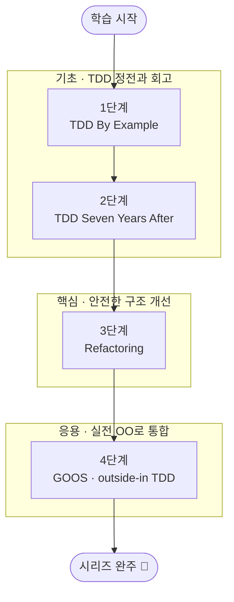

<figure class="post-figure post-figure--header">
<svg role="img" aria-label="테스트와 리팩터링을 한 장으로 묶은 그림. 왼쪽 위에는 Red-Green-Refactor 사이클이 빨강 막대(실패)에서 초록 막대(통과)를 거쳐 다듬기로 돌아오는 순환 화살표로 그려진다. 가운데 아래에는 테스트가 만드는 안전망이 그물코로 펼쳐지고, 그 위에서 거칠게 쌓인 코드 블록이 가지런한 블록으로 리팩터링되며 설계가 다듬어진다. 오른쪽에는 네 권의 고전이 1단계 TDD By Example, 2단계 Seven Years After, 3단계 Refactoring, 4단계 GOOS 순서로 오르막 계단처럼 쌓여 있다." viewBox="0 0 680 300" xmlns="http://www.w3.org/2000/svg">
  <title>Testing-Refactoring Essential — Red-Green-Refactor 사이클 · 테스트가 떠받치는 안전망 위의 리팩터링 · 네 권의 고전 여정</title>

  <!-- ===== LEFT-TOP: Red-Green-Refactor cycle ===== -->
  <text x="108" y="22" text-anchor="middle" font-size="12" fill="currentColor" font-weight="700" opacity="0.75">사이클</text>
  <!-- cycle ring -->
  <circle cx="108" cy="86" r="44" fill="none" stroke="currentColor" stroke-width="1.6" stroke-dasharray="4 4" opacity="0.5"/>
  <!-- Red (fail) -->
  <rect x="78" y="40" width="60" height="18" rx="3" fill="var(--bg-light)" stroke="var(--accent-color)" stroke-width="2.4"/>
  <text x="108" y="53" text-anchor="middle" font-size="9" fill="currentColor" font-weight="700">Red 실패</text>
  <!-- Green (pass) -->
  <rect x="118" y="100" width="58" height="18" rx="3" fill="var(--bg-light)" stroke="var(--secondary-color)" stroke-width="2.4"/>
  <text x="147" y="113" text-anchor="middle" font-size="9" fill="currentColor" font-weight="700">Green 통과</text>
  <!-- Refactor (clean) -->
  <rect x="40" y="100" width="58" height="18" rx="3" fill="var(--bg-light)" stroke="var(--gold)" stroke-width="2.4"/>
  <text x="69" y="113" text-anchor="middle" font-size="9" fill="currentColor" font-weight="700">Refactor</text>
  <!-- arrows around the ring -->
  <path d="M138 52 A44 44 0 0 1 150 96" fill="none" stroke="var(--secondary-color)" stroke-width="2" marker-end="url(#tr-arrow)"/>
  <path d="M118 116 A44 44 0 0 1 96 116" fill="none" stroke="var(--secondary-color)" stroke-width="2" marker-end="url(#tr-arrow)"/>
  <path d="M66 96 A44 44 0 0 1 78 54" fill="none" stroke="var(--secondary-color)" stroke-width="2" marker-end="url(#tr-arrow)"/>
  <text x="108" y="158" text-anchor="middle" font-size="9.5" fill="currentColor" opacity="0.8" font-weight="700">작은 보폭으로 순환</text>

  <!-- ===== BOTTOM-CENTER: safety net + refactoring (messy -> tidy) ===== -->
  <text x="300" y="22" text-anchor="middle" font-size="12" fill="currentColor" font-weight="700" opacity="0.75">안전망 위의 리팩터링</text>
  <!-- messy stacked blocks (before) -->
  <rect x="208" y="62" width="40" height="14" rx="2" fill="var(--bg-light)" stroke="currentColor" stroke-width="1.6" transform="rotate(-6 228 69)"/>
  <rect x="214" y="78" width="40" height="14" rx="2" fill="var(--bg-light)" stroke="currentColor" stroke-width="1.6" transform="rotate(5 234 85)"/>
  <rect x="204" y="94" width="40" height="14" rx="2" fill="var(--bg-light)" stroke="currentColor" stroke-width="1.6" transform="rotate(-3 224 101)"/>
  <text x="226" y="128" text-anchor="middle" font-size="8.5" fill="currentColor" opacity="0.8">거친 구조</text>
  <!-- transform arrow -->
  <line x1="262" y1="86" x2="318" y2="86" stroke="var(--secondary-color)" stroke-width="2.4" marker-end="url(#tr-arrow)"/>
  <text x="290" y="78" text-anchor="middle" font-size="8" fill="currentColor" opacity="0.85" font-weight="700">동작 보존</text>
  <!-- tidy aligned blocks (after) -->
  <rect x="330" y="60" width="46" height="14" rx="2" fill="var(--bg-light)" stroke="var(--accent-color)" stroke-width="2"/>
  <rect x="330" y="78" width="46" height="14" rx="2" fill="var(--bg-light)" stroke="var(--accent-color)" stroke-width="2"/>
  <rect x="330" y="96" width="46" height="14" rx="2" fill="var(--bg-light)" stroke="var(--accent-color)" stroke-width="2"/>
  <text x="353" y="128" text-anchor="middle" font-size="8.5" fill="currentColor" opacity="0.8">다듬은 설계</text>
  <!-- safety net (test net) under both -->
  <g stroke="var(--gold)" stroke-width="1.6" opacity="0.9">
    <line x1="196" y1="150" x2="392" y2="150"/>
    <line x1="208" y1="150" x2="200" y2="172"/>
    <line x1="232" y1="150" x2="224" y2="172"/>
    <line x1="256" y1="150" x2="248" y2="172"/>
    <line x1="280" y1="150" x2="272" y2="172"/>
    <line x1="304" y1="150" x2="296" y2="172"/>
    <line x1="328" y1="150" x2="320" y2="172"/>
    <line x1="352" y1="150" x2="344" y2="172"/>
    <line x1="376" y1="150" x2="368" y2="172"/>
    <line x1="200" y1="161" x2="384" y2="161"/>
  </g>
  <text x="300" y="186" text-anchor="middle" font-size="9.5" fill="currentColor" opacity="0.8" font-weight="700">테스트 = 변경의 안전망</text>

  <!-- divider -->
  <line x1="430" y1="36" x2="430" y2="196" stroke="currentColor" stroke-width="1" opacity="0.25"/>

  <!-- ===== RIGHT: four classics as ascending staircase ===== -->
  <text x="556" y="22" text-anchor="middle" font-size="12" fill="currentColor" font-weight="700" opacity="0.75">네 권의 여정</text>
  <!-- step 1 -->
  <rect x="452" y="150" width="92" height="40" rx="3" fill="var(--bg-light)" stroke="currentColor" stroke-width="1.8"/>
  <text x="498" y="167" text-anchor="middle" font-size="9" fill="currentColor" font-weight="700">1 · TDD</text>
  <text x="498" y="180" text-anchor="middle" font-size="7.5" fill="currentColor" opacity="0.8">By Example</text>
  <!-- step 2 -->
  <rect x="478" y="116" width="92" height="40" rx="3" fill="var(--bg-light)" stroke="currentColor" stroke-width="1.8"/>
  <text x="524" y="133" text-anchor="middle" font-size="9" fill="currentColor" font-weight="700">2 · 7 Years</text>
  <text x="524" y="146" text-anchor="middle" font-size="7.5" fill="currentColor" opacity="0.8">After 회고</text>
  <!-- step 3 -->
  <rect x="504" y="82" width="92" height="40" rx="3" fill="var(--bg-light)" stroke="var(--secondary-color)" stroke-width="2"/>
  <text x="550" y="99" text-anchor="middle" font-size="9" fill="currentColor" font-weight="700">3 · Refactoring</text>
  <text x="550" y="112" text-anchor="middle" font-size="7.5" fill="currentColor" opacity="0.8">구조 개선</text>
  <!-- step 4 -->
  <rect x="530" y="48" width="98" height="40" rx="3" fill="var(--bg-panel)" stroke="var(--gold)" stroke-width="2.4"/>
  <text x="579" y="65" text-anchor="middle" font-size="9" fill="currentColor" font-weight="700">4 · GOOS</text>
  <text x="579" y="78" text-anchor="middle" font-size="7.5" fill="currentColor" opacity="0.8">실전 OO · mock</text>
  <!-- climbing arrows -->
  <line x1="540" y1="150" x2="552" y2="134" stroke="var(--secondary-color)" stroke-width="2" marker-end="url(#tr-arrow)"/>
  <line x1="566" y1="116" x2="578" y2="100" stroke="var(--secondary-color)" stroke-width="2" marker-end="url(#tr-arrow)"/>
  <line x1="592" y1="82" x2="604" y2="66" stroke="var(--secondary-color)" stroke-width="2" marker-end="url(#tr-arrow)"/>
  <text x="556" y="208" text-anchor="middle" font-size="9.5" fill="currentColor" opacity="0.8" font-weight="700">기초 → 핵심 → 응용</text>

  <defs>
    <marker id="tr-arrow" markerWidth="8" markerHeight="8" refX="6" refY="4" orient="auto">
      <path d="M0,0 L8,4 L0,8 z" fill="var(--secondary-color)"/>
    </marker>
  </defs>
</svg>
<figcaption>이 커리큘럼의 한 장 요약 — 왼쪽은 <strong>Red-Green-Refactor</strong> 사이클(실패→통과→다듬기를 작은 보폭으로 순환), 가운데는 <strong>테스트가 떠받치는 안전망</strong> 위에서 거친 구조를 동작 보존한 채 다듬는 리팩터링, 오른쪽은 네 권의 고전을 <strong>기초→핵심→응용</strong>으로 오르는 학습 여정(① TDD By Example · ② Seven Years After · ③ Refactoring · ④ GOOS).</figcaption>
</figure>

## 소개

테스트와 리팩터링은 "한 번 잘 짠 코드"를 "계속 변화할 수 있는 코드"로 바꾸는 엔지니어링의 핵심 실천입니다. 테스트는 변경에 대한 안전망(Safety Net)을 만들어 주고, 리팩터링은 그 안전망 위에서 동작을 바꾸지 않은 채 설계를 개선하게 해 줍니다. 이 둘이 맞물릴 때 비로소 코드는 두려움 없이 진화할 수 있습니다. 그래서 테스트와 리팩터링은 특정 언어나 프레임워크에 종속되지 않는, 모든 개발자가 평생 갈고닦아야 할 보편 역량입니다.

이 분야의 뼈대는 네 권의 고전입니다. Kent Beck의 *Test-Driven Development By Example*은 Red-Green-Refactor 사이클의 정전(正典)을, 같은 저자의 *TDD - Seven Years After*는 그 정전을 수년간 실천한 뒤의 회고와 현대적 관점을, Martin Fowler의 *Refactoring*은 코드 냄새(code smells)와 안전한 변형 카탈로그를, 그리고 Freeman & Pryce의 *Growing Object-Oriented Software, Guided by Tests*(GOOS)는 목(mock) 기반 outside-in TDD로 객체지향 시스템을 키우는 실전을 제공합니다.

이 글은 `Testing-Refactoring-Essential` 시리즈의 **마스터 로드맵**입니다. 네 권의 책을 각각 한 단계로 삼아 기초·핵심·응용으로 묶었으며, 각 항목을 정복할 때마다 체크박스를 채워 나가는 **도장깨기** 방식으로 진행 상황을 추적합니다.

## 학습 흐름

네 단계는 아래 순서대로 진행하는 것을 권장합니다. **기초**(TDD의 정전과 그 회고)로 토대와 사고방식을 함께 다지고, **핵심**(안전한 구조 개선)으로 설계 감각을 채운 뒤, **응용**(실전 OO·mock으로 시스템 키우기)으로 모든 실천을 통합하는 흐름입니다. 1단계의 정전과 2단계의 회고를 나란히 읽어 TDD를 "규칙"이 아닌 "효과"로 보는 시각을 먼저 갖추는 것이 핵심입니다.

## 학습 진행 현황

> 완료한 항목에는 상세 포스트 링크가 연결됩니다. 학습이 진행될 때마다 체크박스와 진행률을 갱신합니다.

- 현재 완료한 항목: **18개**
- 전체 항목: **18개**
- 진행률: **100%** 🎉

## 1단계: Test-Driven Development By Example (Kent Beck) — TDD 사이클의 토대

TDD의 정전입니다. 실패하는 테스트부터 작성하고(Red), 통과시키는 최소한의 코드를 짠 뒤(Green), 중복을 제거하는(Refactor) 짧은 사이클을 몸에 익힙니다. "두려움을 지루함으로 바꾸는" 작은 보폭의 개발이 핵심입니다.

- [x] **Red-Green-Refactor 사이클**: 실패하는 테스트 → 최소 구현 → 정리의 리듬 체화 — [[상세](/2026/06/19/tdd-by-example.html)]
- [x] **테스트 우선(Test-First)**: 코드보다 먼저 의도를 테스트로 표현하기 — [[상세](/2026/06/19/tdd-by-example.html)]
- [x] **작은 보폭(Baby Steps)과 Fake It / Triangulation**: 가짜 구현에서 일반화로 나아가는 전략 — [[상세](/2026/06/19/tdd-by-example.html)]
- [x] **할 일 목록(To-Do List)**: 떠오르는 작업을 적어 두고 한 번에 하나씩 처리 — [[상세](/2026/06/19/tdd-by-example.html)]
- [x] **xUnit 패턴**: 테스트 프레임워크가 동작하는 원리를 직접 구현하며 이해 — [[상세](/2026/06/19/tdd-by-example.html)]

## 2단계: Kent Beck Style TDD - Seven Years After — 회고와 현대적 관점

TDD를 수년간 실천한 뒤의 회고와 현대적 심화 관점을 다룹니다. 정전으로 배운 Red-Green-Refactor를 "규칙"이 아니라 "효과"로 다시 보고, TDD를 도그마가 아닌 도구로 바라보며 언제·어떻게 적용할지 스스로 판단하는 성숙한 시각을 기릅니다. 이 회고는 "TDD는 설계 압력은 주되 설계 감각까지 주지는 않는다"고 짚으며, 자연스럽게 다음 두 단계(구조 개선과 실전 OO)의 필요성을 가리킵니다.

- [x] **TDD에 대한 회고**: 원칙이 실전에서 어떻게 다듬어졌는지 되짚기 — [[상세](/2026/06/19/tdd-seven-years-after.html)]
- [x] **테스트 더블의 트레이드오프**: London vs Classicist, mock 사용의 균형점 — [[상세](/2026/06/19/tdd-seven-years-after.html)]
- [x] **TDD를 언제 적용할지**: 비용·가치를 따져 실용적으로 선택하는 판단력 — [[상세](/2026/06/19/tdd-seven-years-after.html)]

## 3단계: Refactoring (Martin Fowler) — 안전한 구조 개선

동작을 바꾸지 않고 내부 구조를 개선하는 규율을 배웁니다. 어떤 신호(code smells)가 개선을 요구하는지 식별하고, 작은 단계로 검증 가능한 변형(refactoring)을 안전하게 적용하는 방법을 익힙니다.

- [x] **리팩터링의 정의와 원칙**: 동작 보존, 작은 단계, 테스트로 보호 — [[상세](/2026/06/19/refactoring-improving-design.html)]
- [x] **코드 냄새(Code Smells)**: Long Method, Large Class, Duplicated Code, Feature Envy 등 식별 — [[상세](/2026/06/19/refactoring-improving-design.html)]
- [x] **기본 리팩터링 카탈로그**: Extract Function, Inline, Rename, Move 등 핵심 변형 — [[상세](/2026/06/19/refactoring-improving-design.html)]
- [x] **캡슐화·계층 정리**: 데이터/상속 구조를 다루는 리팩터링 — [[상세](/2026/06/19/refactoring-improving-design.html)]
- [x] **테스트가 떠받치는 리팩터링**: 안전망 위에서 변형을 반복하는 워크플로우 — [[상세](/2026/06/19/refactoring-improving-design.html)]

## 4단계: Growing Object-Oriented Software, Guided by Tests (Freeman & Pryce) — 실전 OO · mock · outside-in

목(mock)을 활용한 outside-in TDD로 객체지향 시스템을 "키워 나가는" 실전을 다룹니다. 인수 테스트로 바깥에서 시작해 협력 객체 간의 역할(role)과 메시지를 설계하며 좋은 OO 구조로 수렴시킵니다. 가장 통합적이고 실전적인 단계로, 앞선 세 단계의 모든 실천을 하나로 모아 시리즈를 마무리합니다.

- [x] **Walking Skeleton**: 가장 얇은 end-to-end 슬라이스로 배포 파이프라인부터 세우기 — [[상세](/2026/06/19/growing-oo-software-guided-by-tests.html)]
- [x] **Outside-In TDD**: 인수 테스트(바깥) → 단위 테스트(안쪽)로 내려가며 설계 — [[상세](/2026/06/19/growing-oo-software-guided-by-tests.html)]
- [x] **Mock으로 협력 설계**: 역할·책임·메시지를 테스트로 발견(Tell, Don't Ask) — [[상세](/2026/06/19/growing-oo-software-guided-by-tests.html)]
- [x] **테스트 가능성 = 좋은 설계**: 듣기 좋은 테스트(listening to the tests)로 설계 결함 감지 — [[상세](/2026/06/19/growing-oo-software-guided-by-tests.html)]
- [x] **테스트 유지보수성**: 명확한 테스트 이름·구조로 회귀 가능한 테스트 작성 — [[상세](/2026/06/19/growing-oo-software-guided-by-tests.html)]

## 핵심 포인트

- **테스트가 먼저, 설계는 따라온다**: TDD는 테스트 기법이기 이전에 설계 기법입니다. 테스트하기 어렵다면 그것은 설계 신호입니다.
- **작은 보폭이 가장 빠르다**: 큰 점프 대신 항상 초록 막대(green)로 돌아올 수 있는 작은 단계를 유지하세요.
- **리팩터링과 기능 추가를 섞지 말 것**: 모자 두 개를 동시에 쓰지 마세요. 지금이 리팩터링인지 기능 추가인지 늘 명확히 구분합니다.
- **냄새를 신호로**: 코드 냄새는 "무엇을 고칠지"가 아니라 "어디를 살펴볼지"를 알려 주는 단서입니다.
- **mock은 설계 도구**: mock은 협력 객체의 역할과 메시지를 먼저 설계하기 위한 수단이지, 단지 의존성을 끊는 트릭이 아닙니다.
- **도그마가 아닌 도구**: TDD는 맹신할 교리가 아니라, 맥락에 맞춰 취사선택하는 도구입니다.

## 추천 학습 순서

먼저 ①*TDD By Example*로 Red-Green-Refactor의 기본기를 손에 익히는 것이 출발점입니다. 사이클을 몸으로 알아야 이후 모든 단계가 자연스럽게 이어지기 때문입니다. 곧바로 ②*TDD - Seven Years After*를 이어 읽어, 같은 저자가 그 정전을 수년간 실천한 뒤의 회고로 "규칙"이 아닌 "효과"를 보는 성숙한 시각을 함께 챙깁니다. 이 회고는 "TDD는 설계 압력을 줄 뿐 설계 감각까지 주지는 않는다"고 짚으며 자연스럽게 다음 두 권을 가리킵니다. 그래서 ③*Refactoring*으로 냄새를 식별하고 안전하게 구조를 개선하는 카탈로그를 갖춘 뒤, 마지막으로 ④*GOOS*로 mock 기반 outside-in TDD를 실전 OO 시스템에 적용하며 모든 실천을 통합합니다. 즉 **정전과 회고(기초) → 구조 개선(핵심) → 실전 OO 통합(응용)** 순서가 가장 매끄러운 경로입니다.

## 결론

테스트와 리팩터링은 한 번 배우고 끝나는 지식이 아니라, 매일의 코딩에서 반복하며 다듬어 가는 습관입니다. 네 권의 고전은 각각 사이클의 토대, 성숙한 회고, 구조 개선의 카탈로그, 그리고 실전 OO 설계라는 서로 다른 결을 채워 줍니다.

이 커리큘럼을 나침반 삼아 한 단계씩 정복하고, 완료할 때마다 체크박스를 채워 나가며 진행 상황을 시각적으로 확인해 보세요. 도장을 모두 깨고 나면, 두려움 없이 코드를 바꾸는 엔지니어로 한 단계 성장해 있을 것입니다.

### 다음 학습 (Next Learning)

- [OO-Design Essential Curriculum](/2026/06/19/oo-design-essential-curriculum.html) — 테스트가 길러내는 좋은 객체지향 설계
- [Process Essential Curriculum](/2026/06/19/process-essential-curriculum.html) — TDD·CI가 속한 애자일 실천
- [Craftsmanship Essential Curriculum](/2026/06/19/craftsmanship-essential-curriculum.html) — 테스트·리팩터링을 떠받치는 장인정신
