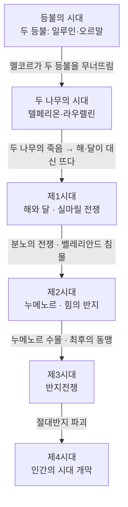

<figure class="post-figure post-figure--header">
<picture>
  <source type="image/webp" srcset="/assets/images/lore/middle-earth-ages-640.webp 640w, /assets/images/lore/middle-earth-ages-1024.webp 1024w, /assets/images/lore/middle-earth-ages-1536.webp 1536w" sizes="(max-width: 800px) 100vw, 760px">
  
</picture>
<figcaption>은빛·금빛 <strong>두 나무</strong>가 세계의 한쪽을 밝히고, 반대쪽은 별빛만 남은 어둠에 잠긴다 — 톨킨 세계의 시대는 이렇게 <strong>빛</strong>으로 나뉜다. 빛이 꺼지고 새로 켜질 때마다 한 시대가 저물고 다음 시대가 열린다.</figcaption>
</figure>

<figure class="post-figure">
<svg role="img" aria-label="중간계 시대를 빛으로 구분해 한 줄로 정리한 그림. 왼쪽에서 오른쪽으로 다섯 칸이 흐른다. 첫째 등불의 시대(두 등불의 빛), 둘째 두 나무의 시대(은·금 두 나무), 셋째 제1시대(해와 달의 등장·실마릴 전쟁), 넷째 제2시대(누메노르와 힘의 반지), 다섯째 제3시대(반지전쟁). 각 칸 위에는 그 시대를 밝히는 빛의 종류가, 아래에는 그 시대를 끝낸 사건이 적혀 있다." viewBox="0 0 700 340" xmlns="http://www.w3.org/2000/svg">
  <title>빛의 연대기 — 두 등불에서 두 나무로, 두 나무에서 해·달로 흐르는 시대</title>

  <text x="350" y="24" text-anchor="middle" font-size="11" fill="currentColor" font-weight="700" opacity="0.75">세계를 밝힌 빛으로 나눈 다섯 시대</text>

  <!-- 등불의 시대 -->
  <rect x="34" y="44" width="122" height="150" rx="4" fill="var(--bg-light)" stroke="currentColor" stroke-width="1.5" opacity="0.6"/>
  <text x="95" y="66" text-anchor="middle" font-size="10.5" fill="currentColor" font-weight="700">등불의 시대</text>
  <rect x="44" y="78" width="102" height="72" rx="3" fill="var(--bg-panel)" stroke="var(--gold)" stroke-width="1.8"/>
  <text x="95" y="104" text-anchor="middle" font-size="18" opacity="0.9">🏮</text>
  <text x="95" y="126" text-anchor="middle" font-size="7.5" fill="currentColor" opacity="0.85">두 등불</text>
  <text x="95" y="138" text-anchor="middle" font-size="7.5" fill="currentColor" opacity="0.85">일루인·오르말</text>
  <text x="95" y="174" text-anchor="middle" font-size="7" fill="currentColor" opacity="0.7">끝: 멜코르가</text>
  <text x="95" y="185" text-anchor="middle" font-size="7" fill="currentColor" opacity="0.7">등불을 무너뜨림</text>

  <!-- 두 나무의 시대 -->
  <rect x="164" y="44" width="122" height="150" rx="4" fill="var(--bg-light)" stroke="currentColor" stroke-width="1.5" opacity="0.6"/>
  <text x="225" y="66" text-anchor="middle" font-size="10.5" fill="currentColor" font-weight="700">두 나무의 시대</text>
  <rect x="174" y="78" width="102" height="72" rx="3" fill="var(--bg-panel)" stroke="var(--secondary-color)" stroke-width="1.8"/>
  <text x="225" y="104" text-anchor="middle" font-size="18" opacity="0.9">🌳</text>
  <text x="225" y="126" text-anchor="middle" font-size="7.5" fill="currentColor" opacity="0.85">텔페리온·라우렐린</text>
  <text x="225" y="138" text-anchor="middle" font-size="7.5" fill="currentColor" opacity="0.85">엘프의 각성</text>
  <text x="225" y="174" text-anchor="middle" font-size="7" fill="currentColor" opacity="0.7">끝: 두 나무의 죽음</text>
  <text x="225" y="185" text-anchor="middle" font-size="7" fill="currentColor" opacity="0.7">실마릴 도난</text>

  <!-- 제1시대 -->
  <rect x="294" y="44" width="122" height="150" rx="4" fill="var(--bg-light)" stroke="currentColor" stroke-width="1.5" opacity="0.6"/>
  <text x="355" y="66" text-anchor="middle" font-size="10.5" fill="currentColor" font-weight="700">제1시대</text>
  <rect x="304" y="78" width="102" height="72" rx="3" fill="var(--bg-panel)" stroke="var(--gold)" stroke-width="1.8"/>
  <text x="355" y="104" text-anchor="middle" font-size="18" opacity="0.9">☀️</text>
  <text x="355" y="126" text-anchor="middle" font-size="7.5" fill="currentColor" opacity="0.85">해와 달의 등장</text>
  <text x="355" y="138" text-anchor="middle" font-size="7.5" fill="currentColor" opacity="0.85">실마릴 전쟁</text>
  <text x="355" y="174" text-anchor="middle" font-size="7" fill="currentColor" opacity="0.7">끝: 분노의 전쟁</text>
  <text x="355" y="185" text-anchor="middle" font-size="7" fill="currentColor" opacity="0.7">벨레리안드 침몰</text>

  <!-- 제2시대 -->
  <rect x="424" y="44" width="122" height="150" rx="4" fill="var(--bg-light)" stroke="currentColor" stroke-width="1.5" opacity="0.6"/>
  <text x="485" y="66" text-anchor="middle" font-size="10.5" fill="currentColor" font-weight="700">제2시대</text>
  <rect x="434" y="78" width="102" height="72" rx="3" fill="var(--bg-panel)" stroke="currentColor" stroke-width="1.6"/>
  <text x="485" y="104" text-anchor="middle" font-size="18" opacity="0.9">🌊</text>
  <text x="485" y="126" text-anchor="middle" font-size="7.5" fill="currentColor" opacity="0.85">누메노르</text>
  <text x="485" y="138" text-anchor="middle" font-size="7.5" fill="currentColor" opacity="0.85">힘의 반지</text>
  <text x="485" y="174" text-anchor="middle" font-size="7" fill="currentColor" opacity="0.7">끝: 누메노르 수몰</text>
  <text x="485" y="185" text-anchor="middle" font-size="7" fill="currentColor" opacity="0.7">최후의 동맹</text>

  <!-- 제3시대 -->
  <rect x="554" y="44" width="122" height="150" rx="4" fill="var(--bg-light)" stroke="var(--accent-color)" stroke-width="2.2" opacity="0.9"/>
  <text x="615" y="66" text-anchor="middle" font-size="10.5" fill="currentColor" font-weight="700">제3시대</text>
  <rect x="564" y="78" width="102" height="72" rx="3" fill="var(--bg-panel)" stroke="var(--gold)" stroke-width="2.2"/>
  <text x="615" y="104" text-anchor="middle" font-size="18" opacity="0.95">💍</text>
  <text x="615" y="126" text-anchor="middle" font-size="7.5" fill="currentColor" opacity="0.85">반지전쟁</text>
  <text x="615" y="138" text-anchor="middle" font-size="7.5" fill="currentColor" opacity="0.85">호빗·반지의 제왕</text>
  <text x="615" y="174" text-anchor="middle" font-size="7" fill="currentColor" opacity="0.7">끝: 절대반지 파괴</text>
  <text x="615" y="185" text-anchor="middle" font-size="7" fill="currentColor" opacity="0.7">제4시대 개막</text>

  <!-- flow arrows -->
  <line x1="156" y1="119" x2="164" y2="119" stroke="var(--secondary-color)" stroke-width="2.4" marker-end="url(#age-arrow)"/>
  <line x1="286" y1="119" x2="294" y2="119" stroke="var(--secondary-color)" stroke-width="2.4" marker-end="url(#age-arrow)"/>
  <line x1="416" y1="119" x2="424" y2="119" stroke="var(--secondary-color)" stroke-width="2.4" marker-end="url(#age-arrow)"/>
  <line x1="546" y1="119" x2="554" y2="119" stroke="var(--secondary-color)" stroke-width="2.4" marker-end="url(#age-arrow)"/>

  <text x="350" y="228" text-anchor="middle" font-size="10" fill="currentColor" opacity="0.85" font-weight="700">빛이 꺼지고 새 빛이 켜질 때마다 — 한 시대가 저물고 다음 시대가 열린다</text>

  <!-- book band -->
  <rect x="34" y="252" width="382" height="26" rx="3" fill="var(--bg-panel)" stroke="var(--secondary-color)" stroke-width="1.6"/>
  <text x="225" y="269" text-anchor="middle" font-size="8.5" fill="currentColor" font-weight="700">실마릴리온 — 등불의 시대부터 제2시대까지</text>
  <rect x="554" y="252" width="122" height="26" rx="3" fill="var(--bg-panel)" stroke="var(--gold)" stroke-width="1.8"/>
  <text x="615" y="269" text-anchor="middle" font-size="8.5" fill="currentColor" font-weight="700">호빗·반지의 제왕</text>
  <line x1="416" y1="265" x2="554" y2="265" stroke="currentColor" stroke-width="1.2" opacity="0.4" stroke-dasharray="4 3"/>

  <text x="350" y="308" text-anchor="middle" font-size="8.5" fill="currentColor" opacity="0.7">세 권의 책이 이 연대기의 어느 구간을 비추는가</text>

  <defs>
    <marker id="age-arrow" markerWidth="8" markerHeight="8" refX="6" refY="4" orient="auto">
      <path d="M0,0 L8,4 L0,8 z" fill="var(--secondary-color)"/>
    </marker>
  </defs>
</svg>
<figcaption>이 글의 한 장 요약 — 톨킨 세계의 시대는 <strong>세계를 밝힌 빛</strong>으로 나뉜다. <strong>두 등불</strong> → <strong>두 나무</strong> → <strong>해와 달</strong>로 광원이 바뀔 때마다 시대가 갈리고, 각 시대는 결정적 파국(등불의 붕괴 · 두 나무의 죽음 · 벨레리안드 침몰 · 누메노르 수몰 · 절대반지 파괴)으로 끝난다.</figcaption>
</figure>

## 소개

앞선 두 편에서 우리는 세계가 **어떻게** 태어났는지(하위창조)와 **무엇으로** 태어났는지(음악)를 보았습니다. 이제 세계에 **시간이 흐르기 시작**합니다. 이 글은 `Middle-earth-Lore` 시리즈의 3단계로, 방대한 사건들을 **연대기의 골격** 위에 꿰어 세우는 작업입니다. 인물과 지명을 외우기 전에, 먼저 "언제 무슨 일이 있었는가"라는 **못**을 박아 두면 나머지 지식이 걸릴 자리가 생깁니다.

톨킨의 연대기에는 다른 신화에서 보기 힘든 우아한 장치가 하나 있습니다. **시대가 '빛'으로 구분된다**는 점입니다. 세계를 밝히는 광원이 **두 등불 → 두 나무 → 해와 달**로 바뀔 때마다 한 시대가 끝나고 다음 시대가 열립니다. 그리고 그 광원은 언제나 **악에 의해 파괴되면서** 다음 시대로 넘어갑니다. 즉 톨킨의 연대기는 곧 **빛이 줄어드는 역사** — 점점 희미해지는 세계의 이야기입니다.

## 한눈에 보기

세계의 큰 줄기는 다섯 시대로 이어집니다. 각 시대를 밝힌 빛과, 그 시대를 끝낸 사건을 한 축에 꿰면 다음과 같습니다.

세 권의 책은 이 흐름의 서로 다른 구간을 비춥니다. **실마릴리온**은 등불의 시대부터 제2시대까지의 먼 과거 전체를, **호빗**과 **반지의 제왕**은 마지막 구간인 제3시대의 끝자락만을 다룹니다. 아래에서 이 다섯 시대를 하나씩 짚습니다.

## 태초의 빛 — 등불의 시대와 두 나무의 시대

세계 Eä가 존재하기 시작했을 때, 발라들은 아직 형태 없는 세계를 **살 수 있는 땅으로 다듬는 일**부터 시작합니다. 이 태초의 시간을 밝힌 것이 두 개의 광원이었습니다.

**등불의 시대(Years of the Lamps).** 장인 발라 **아울레**가 거대한 두 개의 등불 — 북쪽의 **일루인(Illuin)** 과 남쪽의 **오르말(Ormal)** — 을 만들어 세웠고, 그 빛 아래 세계가 처음으로 푸르러집니다. 발라들은 세계 한가운데 **알마렌(Almaren)** 섬에 거처를 두고 세계를 가꿉니다. 그러나 어둠으로 물러나 있던 **멜코르**가 기습해 두 등불을 무너뜨립니다. 등불이 쓰러지며 그 불길이 땅을 뒤엎어 세계의 지형이 통째로 뒤틀리고, 첫 번째 시대가 파국으로 끝납니다. 톨킨 세계의 **"빛의 파괴가 곧 시대의 종말"** 이라는 공식이 여기서 처음 성립합니다.

**두 나무의 시대(Years of the Trees).** 발라들은 파괴된 세계 전체를 다시 밝히는 대신, 서쪽 끝의 축복받은 땅 **아만(발리노르)** 으로 물러나 그곳만을 밝히기로 합니다. 야반나가 노래로 두 그루의 나무 — 은빛의 **텔페리온(Telperion)** 과 금빛의 **라우렐린(Laurelin)** — 을 자라게 하니, 이 **두 나무**가 발리노르를 번갈아 밝힙니다. 이때부터 빛은 오직 서쪽 신들의 땅에만 있고, **중간계는 오직 별빛 아래** 남습니다. 그리고 바로 그 별빛 아래, 동쪽 호수 **쿠이비에넨(Cuiviénen)** 에서 **엘프가 처음 눈을 뜹니다.** 엘프를 "별의 백성"이라 부르고 별의 여왕 **바르다(엘베레스)** 를 가장 사랑하는 이유가 여기 있습니다 — 그들이 깨어나 처음 본 것이 별이었기 때문입니다.

<figure class="post-figure">
<svg role="img" aria-label="빛의 계보를 설명하는 그림. 맨 위 '두 나무'의 은·금 빛에서 아래로 세 갈래가 뻗는다. 왼쪽은 '실마릴' — 페아노르가 두 나무의 빛을 세 보석에 가둔 것. 가운데는 '해와 달' — 죽은 두 나무의 마지막 꽃과 열매로 만든 것. 오른쪽은 '어둠' — 멜코르가 두 나무를 죽인 것. 맨 아래에 '두 나무의 빛은 사라졌지만, 실마릴과 해·달 속에 조각으로 살아남았다'는 설명이 있다." viewBox="0 0 660 300" xmlns="http://www.w3.org/2000/svg">
  <title>빛의 계보 — 두 나무의 빛은 실마릴과 해·달 속에 조각으로 살아남는다</title>

  <!-- source: Two Trees -->
  <rect x="240" y="26" width="180" height="58" rx="5" fill="var(--bg-panel)" stroke="var(--gold)" stroke-width="2.4"/>
  <text x="330" y="50" text-anchor="middle" font-size="18">🌳</text>
  <text x="330" y="72" text-anchor="middle" font-size="10.5" fill="currentColor" font-weight="700">두 나무 — 세계의 원천 빛</text>

  <!-- three descents -->
  <line x1="300" y1="84" x2="120" y2="128" stroke="var(--secondary-color)" stroke-width="2" marker-end="url(#lg-arrow)"/>
  <line x1="330" y1="84" x2="330" y2="128" stroke="var(--gold)" stroke-width="2" marker-end="url(#lg-arrow)"/>
  <line x1="360" y1="84" x2="540" y2="128" stroke="var(--accent-color)" stroke-width="2.2" marker-end="url(#lg-arrow)"/>

  <!-- 실마릴 -->
  <rect x="34" y="132" width="176" height="86" rx="5" fill="var(--bg-panel)" stroke="var(--secondary-color)" stroke-width="2"/>
  <text x="122" y="158" text-anchor="middle" font-size="18">💎</text>
  <text x="122" y="180" text-anchor="middle" font-size="10" fill="currentColor" font-weight="700">실마릴</text>
  <text x="122" y="197" text-anchor="middle" font-size="7.5" fill="currentColor" opacity="0.8">페아노르가 빛을</text>
  <text x="122" y="208" text-anchor="middle" font-size="7.5" fill="currentColor" opacity="0.8">세 보석에 가둠</text>

  <!-- 해와 달 -->
  <rect x="242" y="132" width="176" height="86" rx="5" fill="var(--bg-panel)" stroke="var(--gold)" stroke-width="2"/>
  <text x="330" y="158" text-anchor="middle" font-size="18">☀️</text>
  <text x="330" y="180" text-anchor="middle" font-size="10" fill="currentColor" font-weight="700">해와 달</text>
  <text x="330" y="197" text-anchor="middle" font-size="7.5" fill="currentColor" opacity="0.8">죽은 나무의 마지막</text>
  <text x="330" y="208" text-anchor="middle" font-size="7.5" fill="currentColor" opacity="0.8">꽃과 열매로 만듦</text>

  <!-- 어둠 -->
  <rect x="450" y="132" width="176" height="86" rx="5" fill="var(--bg-panel)" stroke="var(--accent-color)" stroke-width="2.2"/>
  <text x="538" y="158" text-anchor="middle" font-size="18">🌑</text>
  <text x="538" y="180" text-anchor="middle" font-size="10" fill="currentColor" font-weight="700">어둠</text>
  <text x="538" y="197" text-anchor="middle" font-size="7.5" fill="currentColor" opacity="0.8">멜코르가 두 나무를</text>
  <text x="538" y="208" text-anchor="middle" font-size="7.5" fill="currentColor" opacity="0.8">독으로 죽임</text>

  <text x="330" y="256" text-anchor="middle" font-size="9.5" fill="currentColor" font-weight="700" opacity="0.9">두 나무의 빛은 사라졌지만 — 실마릴과 해·달 속에 조각으로 살아남는다</text>
  <text x="330" y="278" text-anchor="middle" font-size="8" fill="currentColor" opacity="0.7">그래서 페아노르의 실마릴은 '세계에 남은 마지막 순수한 빛'이 되어, 모두가 탐하는 물건이 된다</text>

  <defs>
    <marker id="lg-arrow" markerWidth="8" markerHeight="8" refX="6" refY="4" orient="auto">
      <path d="M0,0 L8,4 L0,8 z" fill="currentColor" opacity="0.7"/>
    </marker>
  </defs>
</svg>
<figcaption><strong>빛의 계보</strong> — 두 나무의 빛은 세 갈래로 갈린다. 페아노르가 <strong>실마릴</strong>에 가둔 조각, 죽은 나무가 마지막으로 낳은 <strong>해와 달</strong>, 그리고 멜코르가 삼킨 <strong>어둠</strong>. 두 나무가 죽은 뒤 실마릴이 '세계에 남은 유일한 순수한 빛'이 되기에, 다음 시대의 모든 비극이 이 보석에서 시작된다.</figcaption>
</figure>

## 제1시대 — 해와 달, 그리고 실마릴 전쟁

두 나무의 시대는 한 번의 도둑질로 끝납니다. 놀도르 엘프의 위대한 장인 **페아노르(Fëanor)** 가 두 나무의 빛을 세 개의 보석 **실마릴(Silmaril)** 에 가두어 담자, 멜코르는 거대 거미 **웅골리안트**와 손잡고 **두 나무를 독으로 죽이고 실마릴을 훔쳐** 중간계로 달아납니다. 이 사건으로 발리노르마저 어둠에 잠기고, 엘프들은 그를 **모르고스("세계의 검은 적")** 라 부르게 됩니다.

빛을 잃은 발라들은 죽어 가는 두 나무에게서 **마지막 꽃 하나와 열매 하나**를 거두어, 그것으로 **달과 해**를 빚어 하늘에 띄웁니다. 우리에게 익숙한 이 해와 달이 처음 떠오른 순간이 바로 **제1시대의 시작**이자, **인간(둘째 자손)이 깨어난** 시점입니다. 엘프가 별빛의 백성이라면, 인간은 해의 백성입니다.

이 시대의 골격은 **실마릴을 되찾으려는 전쟁**입니다. 페아노르와 그 아들들은 실마릴을 되찾겠다며 **되돌릴 수 없는 맹세**를 하고 중간계로 건너와, 모르고스의 요새가 있는 중간계 북서부 지역 **벨레리안드(Beleriand)** — 청색산맥(에레드 루인) 서쪽의 땅 — 에서 수백 년에 걸친 전쟁을 벌입니다. 이것이 뒤에 이어질 이야기(4·6단계)에서 자세히 다룰 실마릴리온의 중심 서사입니다. 전쟁은 대부분 패배로 점철되지만, 끝내 발라들이 직접 개입한 **분노의 전쟁(War of Wrath)** 에서 모르고스가 세계 밖으로 축출됩니다. 그러나 그 싸움의 여파가 얼마나 컸던지 — **벨레리안드 전역(중간계 북서부)이 바다에 잠기며** 제1시대가 끝납니다. 벨레리안드는 중간계와 떨어진 별개 대륙이 아니라 한 대륙의 북서쪽 자락이었고, 청색산맥 동쪽의 본토는 그대로 남아 우리가 아는 제3시대 중간계가 됩니다. 다시 한 번, 한 시대의 종말은 지도를 통째로 바꿔 놓습니다.

## 제2시대 — 누메노르와 힘의 반지

모르고스는 사라졌지만 그의 가장 유능했던 부하 **사우론(Sauron)** 이 남았습니다. 제2시대는 이 **두 번째 어둠의 군주**가 부상하는 시대입니다.

발라들은 모르고스와의 전쟁에서 자신들을 도운 인간들에게 보상으로 서쪽 바다 한가운데 별 모양의 섬 **누메노르(Númenor)** 를 하사합니다. 누메노르인은 뛰어난 항해사로 번영하며 보통 인간보다 훨씬 긴 수명을 누립니다. 그러나 그들에게는 **아만(불사의 땅)으로 항해하는 것만은 금지**되어 있었습니다 — 죽음은 인간에게 내린 저주가 아니라 에루의 '선물'이지만, 그들은 점차 불멸을 갈망하게 됩니다.

한편 중간계에서는 사우론이 아름다운 모습으로 엘프 세공사들에게 접근해, 함께 **힘의 반지(Rings of Power)** 를 만들도록 꾑니다. 그리고 몰래 운명의 산 불길 속에서 **절대반지(One Ring)** 를 주조해, 다른 모든 반지를 지배하려 합니다. 이 반지들의 이야기와 절대반지의 본질은 6단계(핵심 사물)에서 따로 깊이 다룹니다.

제2시대는 두 개의 파국으로 마무리됩니다. 첫째, 사우론은 오만해진 누메노르를 부추겨 **불사의 땅 아만을 무력으로 침공**하게 만들고, 이에 에루가 직접 개입해 **누메노르 섬 전체를 바닷속으로 침몰**시킵니다(**아칼라베스, Akallabêth**). 이때 세계의 형태 자체가 바뀌어, 평평했던 세계가 **둥글게** 되고 아만은 필멸자가 닿을 수 없는 곳으로 떨어져 나갑니다. 살아남은 충직한 누메노르인들은 중간계로 피신해 **곤도르**와 **아르노르** 왕국을 세웁니다(반지의 제왕에서 아라고른의 혈통이 여기서 나옵니다). 둘째, 엘프와 인간의 **최후의 동맹(Last Alliance)** 이 사우론을 무너뜨리고 이실두르가 그의 손가락에서 절대반지를 잘라 냅니다 — 그러나 반지를 파괴하지 않고 차지하면서, 다음 시대의 비극이 예약됩니다.

## 제3시대 — 반지전쟁으로 가는 길

우리가 가장 잘 아는 **호빗**과 **반지의 제왕**이 놓이는 시대입니다. 앞선 네 시대가 이 마지막 시대를 위한 긴 준비였다고 해도 지나치지 않습니다.

최후의 동맹 직후 이실두르가 강에서 습격당해 죽으면서, 절대반지는 강바닥에 **잃어버려집니다.** 반지는 수천 년을 잠들었다가 **골룸**의 손에 들어가고, 다시 우연히 호빗 **빌보**에게 발견됩니다 — 이것이 『호빗』의 사건입니다. 그동안 사우론은 형체 없는 그림자로 서서히 힘을 되찾아 다시 일어서고, 잃어버린 절대반지를 되찾으려 합니다. 빌보에게서 반지를 물려받은 **프로도**가 그것을 유일하게 파괴할 수 있는 곳 — 반지가 만들어진 **운명의 산** 불길 — 으로 가져가 없애는 여정이 곧 『반지의 제왕』의 **반지전쟁(War of the Ring)** 입니다.

절대반지가 파괴되면서 사우론은 완전히 소멸하고, **제3시대가 끝납니다.** 마법과 엘프의 시대가 저물고, 엘프들은 서쪽 바다 너머로 떠나며, 아라고른이 인간의 왕으로 즉위하면서 **제4시대 — 인간의 시대** 가 열립니다. 톨킨 세계 전체가 "빛이 줄어드는 역사"라 했던 이유가 여기서 완성됩니다. 두 나무의 찬란한 빛에서 시작한 세계는, 이제 마법이 물러나고 평범한 인간들이 자기 힘으로 살아가는 세계가 됩니다.

## 지리로 본 시대 — 사라지는 땅

톨킨의 연대기에는 또 하나의 특징이 있습니다. **큰 시대가 끝날 때마다 땅덩어리 하나가 바다에 잠긴다**는 것입니다. 제1시대는 중간계 북서부 **벨레리안드**(청색산맥 서쪽)의 침몰로, 제2시대는 섬 왕국 **누메노르**의 수몰로 끝났습니다. 그래서 톨킨의 지도는 시대마다 다시 그려야 합니다 — **지리가 곧 연대기**인 셈입니다.

<figure class="post-figure">
<picture>
  <source type="image/webp" srcset="/assets/images/lore/middle-earth-ages-map-640.webp 640w, /assets/images/lore/middle-earth-ages-map-1024.webp 1024w, /assets/images/lore/middle-earth-ages-map-1536.webp 1536w" sizes="(max-width: 800px) 100vw, 760px">
  
</picture>
<figcaption>물에 잠긴 시대의 지도 — 오른쪽 <strong>온전한 중간계 본토</strong>에 이어진 채 서쪽 바다에 잠긴 <strong>벨레리안드</strong>(본디 중간계 북서부, 청색산맥 서쪽)와, 그 남쪽에 수몰한 <strong>누메노르</strong>(별 모양 섬)가 유령처럼 비친다. 맨 왼쪽 안개 너머로 멀어지는 것이 필멸자가 닿을 수 없게 된 <strong>아만</strong>이다. <em>(공식 지도를 옮긴 것이 아니라 콘셉트에 맞춰 새로 생성한 원본 삽화)</em></figcaption>
</figure>

아래 개념도는 그 변화를 시대별로 다시 도식화한 것입니다(상대적 위치와 사라진 땅만을 나만의 표현으로 새로 그린 것입니다).

<figure class="post-figure">
<svg role="img" aria-label="시대에 따라 지도가 바뀌는 과정을 세 칸으로 나눈 개념도. 각 칸은 왼쪽에 축복의 땅 아만, 오른쪽에 하나의 큰 대륙 중간계, 그 사이에 바다가 있다. 첫째 칸 제1시대에는 그 대륙의 북서부가 벨레리안드로 표시되어 본토와 하나로 이어져 있고, 둘 사이에 청색산맥이 경계로 그려진다. 둘째 칸 제2시대에는 북서부 벨레리안드만 바다에 잠겨 사라지고 본토는 그대로 남으며, 바다에 별 모양 섬 누메노르가 새로 생긴다. 셋째 칸 제3시대에는 누메노르마저 수몰되고 아만은 둥글게 바뀐 세계 밖으로 떨어져 나가, 결국 중간계 본토만 남는다." viewBox="0 0 720 340" xmlns="http://www.w3.org/2000/svg">
  <title>시대별 지형 변화 — 하나의 대륙에서 땅이 하나씩 떨어져 나간다</title>

  <text x="360" y="22" text-anchor="middle" font-size="11" fill="currentColor" font-weight="700" opacity="0.75">시대가 끝날 때마다 땅 하나가 떨어져 나간다</text>

  <!-- ===== Panel A: 제1시대 ===== -->
  <text x="120" y="46" text-anchor="middle" font-size="10.5" fill="currentColor" font-weight="700">제1시대</text>
  <rect x="15" y="54" width="210" height="180" rx="5" fill="var(--bg-light)" stroke="currentColor" stroke-width="1.4" opacity="0.9"/>
  <!-- 아만 (west strip) -->
  <path d="M15 54 L52 54 L44 234 L15 234 Z" fill="var(--bg-panel)" stroke="var(--secondary-color)" stroke-width="1.6"/>
  <text x="30" y="148" text-anchor="middle" font-size="7.5" fill="currentColor" opacity="0.8" transform="rotate(-90 30 148)">아만</text>
  <!-- 중간계 본토 (east, part of the same continent) -->
  <path d="M131 72 L170 74 L210 88 L222 140 L212 200 L160 222 L128 206 L112 175 L129 150 Z" fill="var(--bg-panel)" stroke="currentColor" stroke-width="1.5"/>
  <text x="176" y="150" text-anchor="middle" font-size="8" fill="currentColor" opacity="0.85">중간계</text>
  <!-- 벨레리안드 = 같은 대륙의 북서부 (highlighted) -->
  <path d="M131 72 L120 70 L72 84 L84 116 L100 140 L129 150 Z" fill="var(--bg-light)" stroke="var(--gold)" stroke-width="2.2"/>
  <text x="93" y="110" text-anchor="middle" font-size="7.5" fill="currentColor" font-weight="700">벨레리안드</text>
  <!-- 청색산맥 = 경계(fault) -->
  <line x1="131" y1="73" x2="129" y2="149" stroke="var(--accent-color)" stroke-width="1.6" stroke-dasharray="3 3"/>
  <text x="150" y="118" font-size="6" fill="currentColor" opacity="0.7">청색산맥</text>
  <text x="120" y="252" text-anchor="middle" font-size="7.5" fill="currentColor" opacity="0.8">벨레리안드 = 중간계 북서부 (하나의 대륙)</text>

  <!-- arrow A→B -->
  <line x1="228" y1="144" x2="252" y2="144" stroke="var(--secondary-color)" stroke-width="2.4" marker-end="url(#mp-arrow)"/>

  <!-- ===== Panel B: 제2시대 ===== -->
  <text x="360" y="46" text-anchor="middle" font-size="10.5" fill="currentColor" font-weight="700">제2시대</text>
  <rect x="255" y="54" width="210" height="180" rx="5" fill="var(--bg-light)" stroke="currentColor" stroke-width="1.4" opacity="0.9"/>
  <!-- 아만 -->
  <path d="M255 54 L292 54 L284 234 L255 234 Z" fill="var(--bg-panel)" stroke="var(--secondary-color)" stroke-width="1.6"/>
  <text x="270" y="148" text-anchor="middle" font-size="7.5" fill="currentColor" opacity="0.8" transform="rotate(-90 270 148)">아만</text>
  <!-- 중간계 본토 (북서부만 잘려 나간 뒤) -->
  <path d="M371 72 L410 74 L450 88 L462 140 L452 200 L400 222 L368 206 L352 175 L369 150 Z" fill="var(--bg-panel)" stroke="currentColor" stroke-width="1.5"/>
  <text x="416" y="150" text-anchor="middle" font-size="8" fill="currentColor" opacity="0.85">중간계</text>
  <!-- 벨레리안드 침몰 (북서부만, dashed ghost) -->
  <path d="M371 72 L360 70 L312 84 L324 116 L340 140 L369 150 Z" fill="none" stroke="currentColor" stroke-width="1.4" stroke-dasharray="3 3" opacity="0.4"/>
  <text x="345" y="100" text-anchor="middle" font-size="7" fill="currentColor" opacity="0.5">벨레리안드</text>
  <text x="345" y="112" text-anchor="middle" font-size="6.5" fill="currentColor" opacity="0.5">(북서부 침몰)</text>
  <!-- 누메노르 (star island, highlighted) -->
  <path d="M330 168 L336 182 L350 184 L339 194 L342 208 L330 200 L318 208 L321 194 L310 184 L324 182 Z" fill="var(--bg-panel)" stroke="var(--gold)" stroke-width="2"/>
  <text x="330" y="224" text-anchor="middle" font-size="7.5" fill="currentColor" font-weight="700">누메노르</text>
  <text x="360" y="252" text-anchor="middle" font-size="7.5" fill="currentColor" opacity="0.8">북서부만 침몰 · 누메노르 융성</text>

  <!-- arrow B→C -->
  <line x1="468" y1="144" x2="492" y2="144" stroke="var(--secondary-color)" stroke-width="2.4" marker-end="url(#mp-arrow)"/>

  <!-- ===== Panel C: 제3시대 ===== -->
  <text x="600" y="46" text-anchor="middle" font-size="10.5" fill="currentColor" font-weight="700">제3시대</text>
  <rect x="495" y="54" width="210" height="180" rx="5" fill="var(--bg-light)" stroke="var(--accent-color)" stroke-width="1.8" opacity="0.95"/>
  <!-- 아만 세계 밖으로 (dashed, split away) -->
  <path d="M495 54 L520 54 L512 234 L495 234 Z" fill="none" stroke="currentColor" stroke-width="1.4" stroke-dasharray="3 3" opacity="0.5"/>
  <text x="507" y="148" text-anchor="middle" font-size="6.5" fill="currentColor" opacity="0.55" transform="rotate(-90 507 148)">아만(닿을 수 없음)</text>
  <line x1="524" y1="60" x2="524" y2="228" stroke="currentColor" stroke-width="1.2" stroke-dasharray="2 4" opacity="0.5"/>
  <!-- 중간계 본토 (유일하게 남은 땅, highlighted) -->
  <path d="M611 72 L650 74 L690 88 L702 140 L692 200 L640 222 L608 206 L592 175 L609 150 Z" fill="var(--bg-panel)" stroke="var(--gold)" stroke-width="2"/>
  <text x="646" y="150" text-anchor="middle" font-size="8" fill="currentColor" font-weight="700">중간계</text>
  <!-- 누메노르 수몰 -->
  <path d="M570 168 L576 182 L590 184 L579 194 L582 208 L570 200 L558 208 L561 194 L550 184 L564 182 Z" fill="none" stroke="currentColor" stroke-width="1.3" stroke-dasharray="3 3" opacity="0.4"/>
  <text x="570" y="224" text-anchor="middle" font-size="6.5" fill="currentColor" opacity="0.5">누메노르 (수몰)</text>
  <text x="600" y="252" text-anchor="middle" font-size="7.5" fill="currentColor" opacity="0.8">누메노르 수몰 · 세계가 둥글게</text>

  <text x="360" y="292" text-anchor="middle" font-size="10" fill="currentColor" opacity="0.85" font-weight="700">북서부(벨레리안드) → 누메노르 → 아만마저 멀어지고 — 끝내 중간계 본토만 남는다</text>
  <text x="360" y="312" text-anchor="middle" font-size="8" fill="currentColor" opacity="0.7">하나의 대륙에서 땅이 하나씩 떨어져 나간다 — 지리가 곧 연대기다</text>

  <defs>
    <marker id="mp-arrow" markerWidth="8" markerHeight="8" refX="6" refY="4" orient="auto">
      <path d="M0,0 L8,4 L0,8 z" fill="var(--secondary-color)"/>
    </marker>
  </defs>
</svg>
<figcaption><strong>시대별 지형 변화</strong> — <strong>벨레리안드는 별개 대륙이 아니라 중간계의 북서부</strong>다(청색산맥이 경계). <strong>제1시대</strong>엔 그 북서부가 벨레리안드였고, <strong>제2시대</strong>엔 <strong>그 부분만</strong> 바다에 잠기고 본토는 그대로 남으며 누메노르 섬이 솟았고, <strong>제3시대</strong>엔 누메노르마저 수몰하고 아만은 둥글게 바뀐 세계 밖으로 떨어져 나간다. <em>(공식 지도를 옮긴 것이 아니라 상대적 위치만 도식화한 원본 개념도)</em></figcaption>
</figure>

## 시대 요약

| 시대 | 세계의 빛 | 중심 사건 | 시대를 끝낸 파국 |
| --- | --- | --- | --- |
| 등불의 시대 | 두 등불(일루인·오르말) | 발라들이 세계를 다듬음 | 멜코르가 두 등불을 무너뜨림 |
| 두 나무의 시대 | 두 나무(텔페리온·라우렐린) | 엘프의 각성, 실마릴 제작 | 두 나무의 죽음·실마릴 도난 |
| 제1시대 | 해와 달 | 인간의 각성, 실마릴 전쟁 | 분노의 전쟁, 벨레리안드 침몰 |
| 제2시대 | 해와 달 | 누메노르, 힘의 반지·절대반지 | 누메노르 수몰, 최후의 동맹 |
| 제3시대 | 해와 달 | 반지전쟁(호빗·반지의 제왕) | 절대반지 파괴 → 제4시대 |

## 핵심 포인트

- **시대는 빛으로 나뉜다**: 두 등불 → 두 나무 → 해와 달. 세계를 밝히는 광원이 바뀔 때마다 시대가 갈린다. 이 축 하나만 잡으면 방대한 연대기가 다섯 칸으로 정리된다.
- **빛의 파괴가 곧 종말이다**: 등불의 붕괴, 두 나무의 죽음 — 광원의 파괴는 언제나 악의 소행이며, 그때마다 한 시대가 끝난다. 톨킨의 역사는 '빛이 줄어드는 역사'다.
- **파국은 지도를 바꾼다**: 벨레리안드의 침몰(제1시대 끝), 누메노르의 수몰(제2시대 끝)처럼, 큰 시대는 대륙 하나가 사라지며 끝난다. 지리가 곧 연대기다.
- **악은 세대를 잇는다**: 최초의 적 모르고스가 축출된 자리를 그의 부하 사우론이 이어받는다. 제1시대의 실마릴과 제2·3시대의 절대반지는 같은 구조의 비극을 반복한다.
- **세 권의 책은 이 축의 서로 다른 구간이다**: 실마릴리온은 등불의 시대~제2시대 전체를, 호빗·반지의 제왕은 마지막 제3시대만을 비춘다.

## 결론

톨킨의 연대기는 왕과 전쟁의 목록이 아니라, **빛이 어떻게 태어나고 잃어버려지는가**에 관한 이야기입니다. 두 나무의 찬란한 빛에서 시작해, 그 빛이 실마릴에 갇히고 해와 달로 흩어지고 마침내 마법이 세계에서 물러나기까지 — 다섯 시대는 하나의 긴 황혼입니다. 이 골격을 손에 쥐면, 앞으로 만날 어떤 사건도 "몇 번째 시대, 어떤 빛 아래"라는 좌표에 걸 수 있습니다.

이제 시간의 축을 세웠으니, 다음 편부터는 이 세계를 **살아가는 자들**로 시선을 옮깁니다. 4단계에서는 엘프·인간·드워프·호빗·오르크가 각각 이 연대기 어디에서 태어났고, 에루의 창조 순서 안에서 어떤 운명을 짊어졌는지를 정리합니다.

### 다음 학습 (Next Learning)

- [중간계 세계관 정복 로드맵](/2026/08/24/middle-earth-lore-roadmap.html) — 이 시리즈의 마스터 로드맵
- [음악에서 태어난 세계: 에루, 아이누, 그리고 창세의 불협화음](/2026/08/24/middle-earth-creation-myth.html) — 2단계 창세 신화
- **4단계: 종족 — 이 세계를 살아가는 자들** — 엘프·인간·드워프·호빗·오르크의 기원과 운명 *(작성 예정)*
