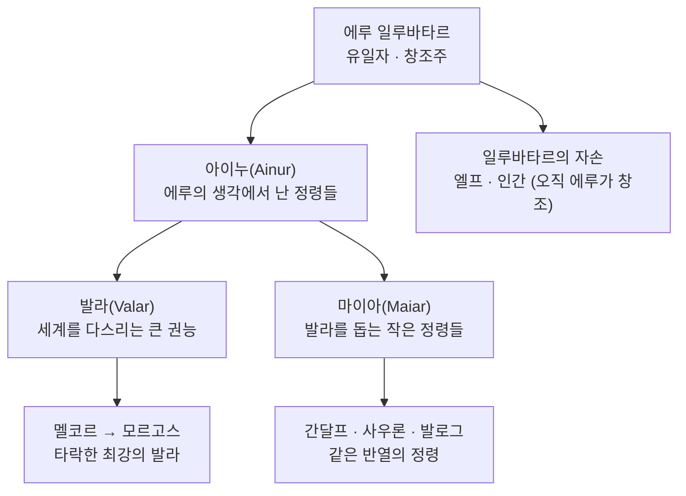

<figure class="post-figure post-figure--header">
<picture>
  <source type="image/webp" srcset="/assets/images/lore/middle-earth-creation-myth-640.webp 640w, /assets/images/lore/middle-earth-creation-myth-1024.webp 1024w, /assets/images/lore/middle-earth-creation-myth-1536.webp 1536w" sizes="(max-width: 800px) 100vw, 760px">
  
</picture>
<figcaption>노래하는 <strong>아이누</strong>의 원 한가운데서 세계 <strong>Eä</strong>가 앰버빛 음악으로 빚어진다. 오른쪽 홀로 떨어진 그림자 — <strong>멜코르</strong> — 가 검은 불협화음을 뿜지만, 그 소란마저 끝내 하나의 노래로 감싸인다.</figcaption>
</figure>

<figure class="post-figure">
<svg role="img" aria-label="음악에서 세계가 태어나는 그림. 왼쪽 '에루의 주제'에서 세 갈래 소리의 물결이 오른쪽으로 흐른다. 두 갈래는 매끄러운 조화의 파동이고, 한 갈래는 들쭉날쭉한 멜코르의 불협화음이다. 세 갈래는 오른쪽 가운데의 둥근 세계 'Eä'로 모여 하나의 세계를 이룬다." viewBox="0 0 700 300" xmlns="http://www.w3.org/2000/svg">
  <title>아이눌린달레 — 조화와 불협화음이 함께 짜여 하나의 세계(Eä)가 된다</title>

  <!-- source: Eru's theme -->
  <circle cx="86" cy="150" r="42" fill="var(--bg-panel)" stroke="var(--gold)" stroke-width="2.4"/>
  <text x="86" y="146" text-anchor="middle" font-size="20" opacity="0.9">🎵</text>
  <text x="86" y="170" text-anchor="middle" font-size="8.5" fill="currentColor" font-weight="700">에루의 주제</text>

  <!-- two harmonious themes -->
  <path d="M132 118 Q168 96 204 118 T276 118 T348 118 T420 118" fill="none" stroke="var(--secondary-color)" stroke-width="2.4" opacity="0.85"/>
  <path d="M132 150 Q168 128 204 150 T276 150 T348 150 T420 150" fill="none" stroke="currentColor" stroke-width="2" opacity="0.6"/>
  <!-- Melkor's discord (jagged) -->
  <path d="M132 200 L168 178 L196 224 L228 174 L262 226 L298 176 L334 224 L372 182 L420 202" fill="none" stroke="var(--accent-color)" stroke-width="2.6"/>
  <text x="250" y="252" text-anchor="middle" font-size="8" fill="currentColor" opacity="0.8">멜코르의 불협화음</text>
  <text x="250" y="104" text-anchor="middle" font-size="8" fill="currentColor" opacity="0.8">아이누의 조화</text>

  <!-- converge to the world Eä -->
  <line x1="420" y1="118" x2="486" y2="146" stroke="currentColor" stroke-width="1.4" opacity="0.5" marker-end="url(#cm-arrow)"/>
  <line x1="420" y1="150" x2="486" y2="150" stroke="currentColor" stroke-width="1.4" opacity="0.5" marker-end="url(#cm-arrow)"/>
  <line x1="420" y1="202" x2="486" y2="156" stroke="currentColor" stroke-width="1.4" opacity="0.5" marker-end="url(#cm-arrow)"/>

  <circle cx="562" cy="150" r="70" fill="var(--bg-light)" stroke="var(--accent-color)" stroke-width="2.6" opacity="0.95"/>
  <text x="562" y="142" text-anchor="middle" font-size="22" opacity="0.9">🌍</text>
  <text x="562" y="166" text-anchor="middle" font-size="12" fill="currentColor" font-weight="700">Eä</text>
  <text x="562" y="182" text-anchor="middle" font-size="7.5" fill="currentColor" opacity="0.8">존재하는 세계</text>

  <text x="350" y="288" text-anchor="middle" font-size="10" fill="currentColor" opacity="0.85" font-weight="700">조화도 불협화음도 — 결국 하나의 음악으로 짜여 세계가 된다</text>

  <defs>
    <marker id="cm-arrow" markerWidth="8" markerHeight="8" refX="6" refY="4" orient="auto">
      <path d="M0,0 L8,4 L0,8 z" fill="currentColor" opacity="0.6"/>
    </marker>
  </defs>
</svg>
<figcaption>톨킨의 창세는 <strong>음악</strong>이다. 유일자 <strong>에루</strong>의 주제에서 아이누의 <strong>조화</strong>와 멜코르의 <strong>불협화음</strong>이 함께 흐르고, 그 모든 것이 하나의 노래로 짜여 <strong>세계 Eä</strong>가 된다 — 악조차 결국 더 큰 설계의 일부가 된다는 이 세계관의 첫 열쇠다.</figcaption>
</figure>

## 소개

대부분의 신화는 세계가 **말**이나 **빛**에서 시작한다고 말합니다("빛이 있으라"). 톨킨은 다릅니다. 그의 세계는 **음악**에서 태어납니다. 이 선택은 단순한 미학이 아니라, 톨킨 세계관 전체를 관통하는 세계관적 선언입니다 — 세계는 하나의 **작품(약보)** 이며, 그 안의 선과 악, 조화와 갈등은 모두 애초에 **하나의 노래로 짜여** 있다는 것.

이 글은 `Middle-earth-Lore` 시리즈의 2단계로, 세계의 **맨 처음**을 다룹니다. 세 가지를 정리합니다.

- **에루와 아이누** — 유일자 창조주, 그리고 그가 자신의 생각으로 지은 첫 존재들.
- **아이눌린달레(Ainulindalë)** — 음악으로서의 창조와, 그 안에 끼어든 멜코르의 불협화음.
- **발라와 마이아** — 세계를 다스리는 큰 권능(발라)과 그들을 돕는 정령(마이아). 그리고 왜 **간달프·사우론·발로그가 본디 같은 반열**인지.

## 한눈에 보기

창세 신화를 이해하는 뼈대는 **존재의 위계**입니다. 맨 위에 유일자 에루가 있고, 그 아래로 아이누 — 세계에 들어온 큰 권능(발라)과 작은 정령(마이아) — 가 있으며, 엘프와 인간은 이 정령들이 만든 것이 아니라 **오직 에루만이 창조**한 별개의 존재입니다.

이 그림 하나만 머릿속에 넣어 두면, 앞으로 등장할 거의 모든 신적 존재의 자리를 짚을 수 있습니다.

## 에루 일루바타르와 아이누

맨 처음에는 **에루(Eru)**, 곧 **일루바타르(Ilúvatar)** 만이 있었습니다. "에루"는 *유일자(The One)*, "일루바타르"는 *만물의 아버지(All-father)* 라는 뜻입니다. 톨킨의 세계는 여러 신이 다투는 다신교가 아니라, 명백히 **한 분의 창조주** 위에 세워진 세계입니다. 이 점이 그리스·북유럽 신화와 결정적으로 다릅니다.

에루는 홀로 있는 **시간 밖의 공간(Timeless Halls)** 에서, 자신의 생각으로 **아이누(Ainur)** — "거룩한 이들" — 를 지어냅니다. 아이누는 천사에 가까운 정령적 존재로, 각자 에루의 마음 중 **일부만**을 이해하도록 태어났습니다. 어떤 이는 바람을, 어떤 이는 물을, 어떤 이는 자라나는 것을 유독 깊이 이해하는 식입니다. 이 "부분적 이해"가 뒤에 각 발라가 맡을 영역이 되고, 동시에 갈등의 씨앗이 됩니다 — 자기가 이해한 부분을 전부라 여기는 순간 오만이 시작되기 때문입니다.

<figure class="post-figure">
<picture>
  <source type="image/webp" srcset="/assets/images/lore/middle-earth-creation-myth-eru-ainur-640.webp 640w, /assets/images/lore/middle-earth-creation-myth-eru-ainur-1024.webp 1024w, /assets/images/lore/middle-earth-creation-myth-eru-ainur-1536.webp 1536w" sizes="(max-width: 800px) 100vw, 760px">
  
</picture>
<figcaption>시간 밖의 궁정 — 형체 없는 빛의 근원 <strong>에루</strong>에게서 <strong>아이누</strong>가 형체를 얻어 태어난다. 저마다 에루의 마음 중 <strong>일부만</strong>을 두른 채, 뒷날 각자가 다스릴 영역(바람·물·불·자라는 것)의 기운을 어렴풋이 품고 있다.</figcaption>
</figure>

## 아이눌린달레 — 음악으로서의 창조

에루는 아이누에게 하나의 **주제(theme)** 를 제시하고, 그것으로 노래할 것을 명합니다. 이것이 **아이눌린달레(Ainulindalë)** — *아이누의 음악* 입니다. 아이누들은 저마다 이해한 바를 얹어 거대한 화음을 이루어 갑니다. 이 음악은 단순한 노래가 아니라 **앞으로 존재할 세계의 설계도**입니다.

그런데 아이누 중 가장 강하고 재능이 뛰어났던 **멜코르(Melkor)** 가, 에루의 주제 대신 **자기만의 생각**을 음악에 짜 넣기 시작합니다. 자신의 영광을 키우고 스스로 무언가를 창조하려는 욕망이었습니다. 그의 소리는 주위와 어긋나며 **불협화음(discord)** 을 일으키고, 일부 아이누가 거기에 휩쓸려 화음이 어지러워집니다.

에루의 대응이 이 세계관의 핵심입니다. 그는 멜코르의 불협화음을 지우지 않습니다. 대신 **새로운 주제를 두 번 더** 일으켜, 멜코르의 소란마저 더 크고 깊은 음악의 일부로 감싸 버립니다. 그리고 선언합니다 — 그 어떤 것도 **자신에게서 비롯되지 않은 것은 없으며**, 에루에게 대적하려는 자조차 결국 *그가 상상조차 못 한 더 놀라운 것을 빚어내는 도구*가 될 뿐이라고. 즉 **악은 세계를 망치려 하지만, 끝내는 자기도 모르게 더 큰 선(善)에 복무하게 된다**는 것. 톨킨 세계 전체를 떠받치는 이 낙관 — 신정론(theodicy) — 이 창세의 첫 장면에 이미 심겨 있습니다.

<figure class="post-figure">
<svg role="img" aria-label="마이아 반열을 설명하는 그림. 위쪽에 '마이아 — 발라를 돕도록 지어진 같은 반열의 정령들'이라는 제목이 있고, 그 아래 세 개의 카드가 나란히 있다. 왼쪽 간달프(올로린), 가운데 사우론(본디 아울레의 마이아), 오른쪽 발로그(불의 정령). 셋 모두 같은 마이아 반열임을 아래 괄호가 묶어 준다. 맨 아래에 '모리아 다리에서 맞선 간달프와 발로그는 본디 같은 종류의 존재'라는 설명이 있다." viewBox="0 0 660 260" xmlns="http://www.w3.org/2000/svg">
  <title>마이아 반열 — 간달프·사우론·발로그는 본디 같은 종류의 정령이다</title>

  <text x="330" y="26" text-anchor="middle" font-size="11" fill="currentColor" font-weight="700">마이아(Maiar) — 발라를 돕도록 지어진 같은 반열의 정령들</text>

  <!-- Gandalf -->
  <rect x="34" y="48" width="180" height="96" rx="5" fill="var(--bg-panel)" stroke="var(--secondary-color)" stroke-width="2"/>
  <text x="124" y="76" text-anchor="middle" font-size="20">🧙</text>
  <text x="124" y="102" text-anchor="middle" font-size="11" fill="currentColor" font-weight="700">간달프</text>
  <text x="124" y="120" text-anchor="middle" font-size="8" fill="currentColor" opacity="0.8">본명 올로린 · 파견된 마법사</text>
  <text x="124" y="134" text-anchor="middle" font-size="8" fill="currentColor" opacity="0.8">선의 편</text>

  <!-- Sauron -->
  <rect x="240" y="48" width="180" height="96" rx="5" fill="var(--bg-panel)" stroke="var(--accent-color)" stroke-width="2.2"/>
  <text x="330" y="76" text-anchor="middle" font-size="20">👁️</text>
  <text x="330" y="102" text-anchor="middle" font-size="11" fill="currentColor" font-weight="700">사우론</text>
  <text x="330" y="120" text-anchor="middle" font-size="8" fill="currentColor" opacity="0.8">본디 아울레의 마이아 → 타락</text>
  <text x="330" y="134" text-anchor="middle" font-size="8" fill="currentColor" opacity="0.8">두 번째 어둠의 군주</text>

  <!-- Balrog -->
  <rect x="446" y="48" width="180" height="96" rx="5" fill="var(--bg-panel)" stroke="var(--accent-color)" stroke-width="2.2"/>
  <text x="536" y="76" text-anchor="middle" font-size="20">🔥</text>
  <text x="536" y="102" text-anchor="middle" font-size="11" fill="currentColor" font-weight="700">발로그</text>
  <text x="536" y="120" text-anchor="middle" font-size="8" fill="currentColor" opacity="0.8">불과 그림자의 정령 → 타락</text>
  <text x="536" y="134" text-anchor="middle" font-size="8" fill="currentColor" opacity="0.8">모르고스의 부하</text>

  <!-- unifying brace -->
  <line x1="124" y1="158" x2="536" y2="158" stroke="currentColor" stroke-width="1.4" opacity="0.5"/>
  <line x1="124" y1="152" x2="124" y2="158" stroke="currentColor" stroke-width="1.4" opacity="0.5"/>
  <line x1="330" y1="152" x2="330" y2="158" stroke="currentColor" stroke-width="1.4" opacity="0.5"/>
  <line x1="536" y1="152" x2="536" y2="158" stroke="currentColor" stroke-width="1.4" opacity="0.5"/>
  <line x1="330" y1="158" x2="330" y2="170" stroke="currentColor" stroke-width="1.4" opacity="0.5"/>
  <text x="330" y="188" text-anchor="middle" font-size="9.5" fill="currentColor" font-weight="700">모두 마이아 — 태생은 같은 반열의 정령</text>

  <text x="330" y="224" text-anchor="middle" font-size="9" fill="currentColor" opacity="0.85">모리아 다리에서 맞선 간달프와 발로그는 — 본디 같은 종류의 존재다</text>
  <text x="330" y="242" text-anchor="middle" font-size="8" fill="currentColor" opacity="0.7">차이를 만든 것은 태생이 아니라, 어느 노래를 따랐는가다</text>
</svg>
<figcaption><strong>마이아 반열</strong> — 간달프(올로린), 사우론, 발로그는 태생이 모두 같은 마이아다. 이들을 갈라놓은 것은 힘의 크기가 아니라 <strong>어느 편의 음악을 따랐는가</strong>다.</figcaption>
</figure>

음악이 끝나자 에루는 아이누에게 그 노래가 그려 낸 **세계의 환영(vision)** 을 보여 주고, 마침내 한 마디로 그것에 실재를 부여합니다 — **"Eä!"**, 곧 *"있으라"*. 이로써 상상 속 노래였던 것이 실제로 존재하는 세계, **Eä(존재하는 세계)** 가 됩니다. 여기에 생명과 독립된 존재를 부여하는 힘이 **'꺼지지 않는 불꽃(Flame Imperishable, 비밀의 불)'** 인데, 이것은 오직 에루에게만 있습니다. 멜코르가 그토록 갈망하며 허공을 뒤졌으나 끝내 찾지 못한 것이 바로 이 불꽃입니다 — **악은 비틀고 흉내 낼 수는 있어도, 무(無)에서 진짜 생명을 창조하지는 못한다**는 원칙이 여기서 못 박힙니다.

## 발라와 마이아 — 세계에 들어온 자들

노래를 마친 아이누 중 일부는 자신이 부른 세계를 **직접 빚고 다스리기 위해** Eä 안으로 내려갑니다. 이들 가운데 큰 권능을 지닌 이들을 **발라(Valar, "세계의 권능들")**, 그들을 돕는 작은 정령들을 **마이아(Maiar)** 라 부릅니다. 발라는 흔히 **열넷(7 남·7 여)** 으로 헤아리며, 타락하기 전의 멜코르를 넣으면 열다섯입니다.

<figure class="post-figure">
<picture>
  <source type="image/webp" srcset="/assets/images/lore/middle-earth-creation-myth-valar-council-640.webp 640w, /assets/images/lore/middle-earth-creation-myth-valar-council-1024.webp 1024w, /assets/images/lore/middle-earth-creation-myth-valar-council-1536.webp 1536w" sizes="(max-width: 800px) 100vw, 760px">
  
</picture>
<figcaption>발마르의 <strong>심판의 원(Ring of Doom)</strong> — 세계에 내려온 큰 권능 <strong>발라</strong>가 회합한다. 만웨(바람)·바르다(별)·울모(바다)·아울레(대장장이)·야반나(생명)·만도스(운명)가 저마다 다스릴 영역의 상징을 두른 채, 세계의 운명을 의논한다.</figcaption>
</figure>

| 발라 | 영역 | 비고 |
| --- | --- | --- |
| 만웨(Manwë) | 바람·하늘 | 발라의 왕, 에루의 뜻에 가장 가까움 |
| 바르다(Varda) | 별빛 | 만웨의 배우자, 엘프가 **엘베레스**로 경배 |
| 울모(Ulmo) | 바다·물 | 홀로 다니며 중간계를 늘 굽어봄 |
| 아울레(Aulë) | 대지·장인 | **드워프를 몰래 빚음**, 사우론·사루만의 옛 주인 |
| 야반나(Yavanna) | 자라는 것 | 아울레의 배우자, **두 나무**를 만듦 |
| 만도스(Mandos) | 죽음·운명 | 죽은 자의 혼을 지킴, 예언을 선고 |
| 니엔나(Nienna) | 슬픔·연민 | 간달프(올로린)가 연민을 배운 스승 |
| 멜코르(Melkor) | — | 가장 강했던 발라, 뒤에 **모르고스** |

마이아는 수가 많고 대개 이름 없이 발라를 섬기지만, 그중 몇은 중간계 역사에서 결정적 역할을 합니다. 그리고 여기에 톨킨 세계관의 가장 인상적인 반전이 있습니다 — **간달프·사우론·발로그가 모두 같은 마이아 반열**이라는 사실입니다(위 그림). 간달프(본명 **올로린**)는 제3시대에 인간 노인의 모습으로 파견된 **이스타리(마법사)** 중 하나이고, 사우론은 본디 장인 발라 **아울레의 마이아**였다가 멜코르에게 넘어갔으며, 발로그는 불과 그림자의 마이아가 타락한 존재입니다. 모리아의 다리에서 맞붙은 간달프와 발로그가 그토록 팽팽했던 이유가 여기 있습니다 — 둘은 **본디 같은 종류의 정령**이었던 것입니다.

<figure class="post-figure">
<picture>
  <source type="image/webp" srcset="/assets/images/lore/middle-earth-creation-myth-maiar-clash-640.webp 640w, /assets/images/lore/middle-earth-creation-myth-maiar-clash-1024.webp 1024w, /assets/images/lore/middle-earth-creation-myth-maiar-clash-1536.webp 1536w" sizes="(max-width: 800px) 100vw, 760px">
  
</picture>
<figcaption>같은 <strong>마이아</strong>, 정반대의 길 — 잿빛 마법사 <strong>간달프</strong>(올로린)와 불·그림자의 <strong>발로그</strong>가 카잣둠의 다리에서 맞선다. 태생은 같은 반열의 정령이나, <strong>어느 노래를 따랐는가</strong>가 하나는 은빛으로 하나는 화염으로 갈라놓았다.</figcaption>
</figure>

## 핵심 포인트

- **세계는 음악이다**: 톨킨의 창세는 말이 아니라 노래에서 시작한다. 세계는 하나의 작품이며, 그 안의 모든 갈등은 애초에 한 곡으로 짜여 있다.
- **유일자 위의 위계**: 맨 위에 창조주 에루가 있고, 그 아래 아이누(발라·마이아)가 있다. 다신교가 아니라 한 창조주 아래의 천사적 위계다.
- **악조차 설계의 일부다**: 에루는 멜코르의 불협화음을 지우지 않고 더 큰 음악으로 감싼다. 악은 세계를 망치려 하지만 끝내 더 큰 선에 복무한다 — 이 신정론이 세계 전체의 낙관을 떠받친다.
- **악은 창조하지 못한다**: 생명을 주는 '꺼지지 않는 불꽃'은 오직 에루에게 있다. 멜코르·사우론은 이미 있는 것을 비틀 뿐, 무에서 창조하지 못한다.
- **태생이 아니라 선택이 가른다**: 간달프·사우론·발로그는 같은 마이아다. 이들을 선과 악으로 가른 것은 힘이나 태생이 아니라 어느 노래를 따랐는가라는 선택이다.

## 결론

톨킨 세계의 첫 장면은 하나의 거대한 합창입니다. 그리고 그 합창 안에는 이미 이 세계의 모든 것 — 창조주의 뜻, 정령들의 위계, 악의 기원, 그리고 악조차 끝내 선에 복무하리라는 약속 — 이 씨앗으로 심겨 있습니다. 이 창세 신화를 손에 쥐면, 앞으로 만날 발라·마이아·엘프의 자리가 모두 제 못에 걸립니다.

이제 세계가 존재하기 시작했습니다. 다음 편에서는 이 세계에 **시간이 흐르기 시작하는 순간** — 등불과 두 나무의 시대에서 제1·2·3시대로 이어지는 연대기의 골격 — 을 세웁니다.

### 다음 학습 (Next Learning)

- [중간계 세계관 정복 로드맵](/2026/08/24/middle-earth-lore-roadmap.html) — 이 시리즈의 마스터 로드맵
- [하나의 세계, 세 권의 책: 톨킨 레젠다리움과 하위창조](/2026/08/24/middle-earth-legendarium-overview.html) — 1단계 세계관 개요
- [빛의 연대기: 등불과 두 나무에서 세 시대로](/2026/08/24/middle-earth-ages-chronology.html) — 3단계 시대 구분 (완료)
