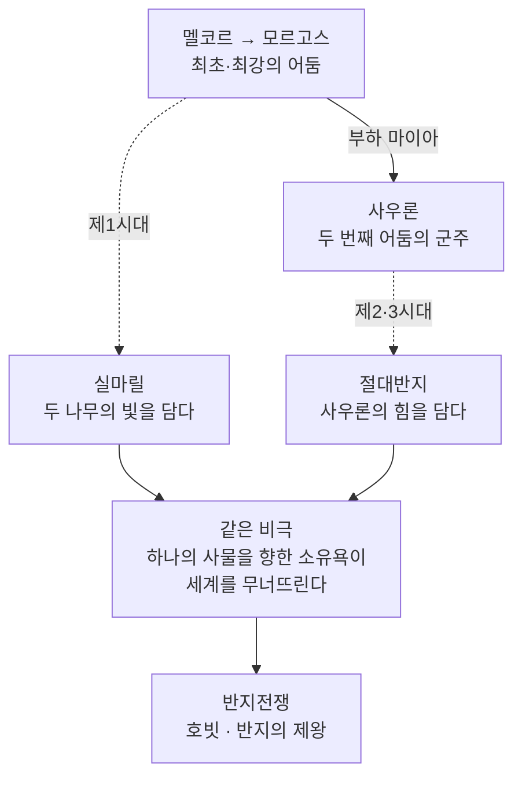

<figure class="post-figure post-figure--header">
<picture>
  <source type="image/webp" srcset="/assets/images/lore/middle-earth-enemy-640.webp 640w, /assets/images/lore/middle-earth-enemy-1024.webp 1024w, /assets/images/lore/middle-earth-enemy-1536.webp 1536w" sizes="(max-width: 800px) 100vw, 760px">
  
</picture>
<figcaption>불의 산 용암 위에 떠오른 <strong>절대반지</strong>, 그 뒤의 <strong>어둠의 탑</strong>과 두 겹의 그림자 — 작은 것이 <strong>사우론</strong>, 그 위로 흐릿하게 겹친 거대한 것이 최초의 어둠 <strong>모르고스</strong>다. 악은 하나의 계보이고, 그 계보는 늘 <strong>하나의 사물</strong>로 응축된다.</figcaption>
</figure>

<figure class="post-figure">
<svg role="img" aria-label="악의 계보와 두 사물을 병렬로 보여 주는 그림. 위쪽에 두 어둠의 군주 — 최초·최강의 모르고스와 그 부하였던 사우론 — 이 화살표로 이어진다. 아래쪽에는 두 개의 사물이 나란히 놓인다. 왼쪽은 제1시대의 실마릴로 두 나무의 빛을 담았고, 오른쪽은 제2·3시대의 절대반지로 사우론의 힘을 담았다. 두 사물 아래에는 '하나의 사물을 향한 소유욕이 세계를 무너뜨린다'는 같은 비극이 놓이고, 그것이 반지전쟁으로 이어진다." viewBox="0 0 700 360" xmlns="http://www.w3.org/2000/svg">
  <title>악의 계보와 두 개의 보석 — 반복되는 하나의 비극</title>

  <text x="350" y="24" text-anchor="middle" font-size="11" fill="currentColor" font-weight="700" opacity="0.75">두 어둠의 군주, 두 개의 사물, 하나의 비극</text>

  <!-- 두 군주 -->
  <rect x="120" y="40" width="200" height="58" rx="5" fill="var(--bg-panel)" stroke="var(--accent-color)" stroke-width="2.2"/>
  <text x="220" y="64" text-anchor="middle" font-size="10" fill="currentColor" font-weight="700">모르고스 (멜코르)</text>
  <text x="220" y="82" text-anchor="middle" font-size="7.5" fill="currentColor" opacity="0.85">최초·최강의 어둠 · 제1시대</text>
  <line x1="320" y1="69" x2="380" y2="69" stroke="var(--accent-color)" stroke-width="2.2" marker-end="url(#en-arrow)"/>
  <text x="350" y="60" text-anchor="middle" font-size="7" fill="currentColor" opacity="0.75">부하 마이아</text>
  <rect x="380" y="40" width="200" height="58" rx="5" fill="var(--bg-panel)" stroke="var(--accent-color)" stroke-width="1.8"/>
  <text x="480" y="64" text-anchor="middle" font-size="10" fill="currentColor" font-weight="700">사우론</text>
  <text x="480" y="82" text-anchor="middle" font-size="7.5" fill="currentColor" opacity="0.85">두 번째 어둠의 군주 · 제2·3시대</text>

  <!-- 두 사물 -->
  <line x1="220" y1="98" x2="180" y2="140" stroke="currentColor" stroke-width="1.4" opacity="0.5" stroke-dasharray="4 3" marker-end="url(#en-soft)"/>
  <line x1="480" y1="98" x2="520" y2="140" stroke="currentColor" stroke-width="1.4" opacity="0.5" stroke-dasharray="4 3" marker-end="url(#en-soft)"/>

  <rect x="60" y="146" width="240" height="92" rx="5" fill="var(--bg-light)" stroke="var(--secondary-color)" stroke-width="2"/>
  <text x="180" y="172" text-anchor="middle" font-size="20">💎</text>
  <text x="180" y="196" text-anchor="middle" font-size="10" fill="currentColor" font-weight="700">실마릴 (제1시대)</text>
  <text x="180" y="214" text-anchor="middle" font-size="7.5" fill="currentColor" opacity="0.85">두 나무의 빛을 담다</text>
  <text x="180" y="228" text-anchor="middle" font-size="7.5" fill="currentColor" opacity="0.85">순수·창조의 결정</text>

  <rect x="400" y="146" width="240" height="92" rx="5" fill="var(--bg-light)" stroke="var(--gold)" stroke-width="2.2"/>
  <text x="520" y="172" text-anchor="middle" font-size="20">💍</text>
  <text x="520" y="196" text-anchor="middle" font-size="10" fill="currentColor" font-weight="700">절대반지 (제2·3시대)</text>
  <text x="520" y="214" text-anchor="middle" font-size="7.5" fill="currentColor" opacity="0.85">사우론의 힘·의지를 담다</text>
  <text x="520" y="228" text-anchor="middle" font-size="7.5" fill="currentColor" opacity="0.85">지배의 도구</text>

  <!-- 같은 비극 -->
  <line x1="180" y1="238" x2="330" y2="272" stroke="currentColor" stroke-width="1.6" opacity="0.6" marker-end="url(#en-soft)"/>
  <line x1="520" y1="238" x2="370" y2="272" stroke="currentColor" stroke-width="1.6" opacity="0.6" marker-end="url(#en-soft)"/>
  <rect x="180" y="278" width="340" height="46" rx="5" fill="var(--bg-panel)" stroke="var(--accent-color)" stroke-width="2"/>
  <text x="350" y="300" text-anchor="middle" font-size="9" fill="currentColor" font-weight="700">같은 비극 — 하나의 사물을 향한 소유욕</text>
  <text x="350" y="316" text-anchor="middle" font-size="8" fill="currentColor" opacity="0.85">이 세계를 무너뜨린다</text>

  <line x1="350" y1="324" x2="350" y2="342" stroke="var(--gold)" stroke-width="2" marker-end="url(#en-arrow)"/>
  <text x="350" y="356" text-anchor="middle" font-size="9" fill="currentColor" font-weight="700" opacity="0.9">→ 반지전쟁 (호빗 · 반지의 제왕)</text>

  <defs>
    <marker id="en-arrow" markerWidth="8" markerHeight="8" refX="6" refY="4" orient="auto">
      <path d="M0,0 L8,4 L0,8 z" fill="var(--accent-color)"/>
    </marker>
    <marker id="en-soft" markerWidth="8" markerHeight="8" refX="6" refY="4" orient="auto">
      <path d="M0,0 L8,4 L0,8 z" fill="currentColor" opacity="0.6"/>
    </marker>
  </defs>
</svg>
<figcaption>이 글의 한 장 요약 — 악은 <strong>모르고스 → 사우론</strong>으로 이어지는 하나의 계보이고, 각 시대는 그 악이 응축된 <strong>하나의 사물</strong>을 갖는다. 제1시대의 <strong>실마릴</strong>과 제2·3시대의 <strong>절대반지</strong>는 성격이 정반대지만, <strong>하나의 사물을 향한 소유욕이 세계를 무너뜨린다</strong>는 같은 비극을 반복하며 반지전쟁으로 이어진다.</figcaption>
</figure>

## 소개

지금까지 우리는 세계가 어떻게 태어났고(1·2단계), 어떤 시대를 거쳤으며(3단계), 누가 살아가고(4단계) 어디에서 벌어지는지(5단계)를 보았습니다. 마지막으로 남은 질문은 하나입니다 — **무엇과 싸우는가?**

톨킨 세계의 악은 산발적인 괴물들의 집합이 아니라 **하나의 계보**입니다. 최초의 어둠 **모르고스**에서 그의 부하 **사우론**으로 이어지고, 각 시대는 그 악이 응축된 **하나의 상징적 사물**을 갖습니다. 이 글은 `Middle-earth-Lore` 시리즈의 마지막 6단계로, **악의 계보**와 **핵심 사물**(실마릴·절대반지)을 함께 정리하며, 이 아카이브를 『호빗』과 『반지의 제왕』 본편으로 연결합니다.

## 한눈에 보기

악을 이해하는 뼈대는 **"군주 → 사물 → 비극"의 반복**입니다. 두 어둠의 군주가 각자의 시대에 하나의 사물을 남기고, 그 사물을 향한 소유욕이 언제나 같은 방식으로 세계를 무너뜨립니다.

두 사물의 성격은 정반대입니다 — 실마릴은 **순수한 빛**을 담았고, 절대반지는 **악 그 자체**를 담았습니다. 그런데도 두 이야기의 결말이 같다는 것, 바로 여기에 톨킨이 말하려는 바가 있습니다.

## 두 어둠의 군주 — 모르고스에서 사우론으로

**모르고스(멜코르).** 창세의 음악에서 가장 강하고 재능이 뛰어났던 아이누가, 에루의 주제 대신 자기 뜻을 짜 넣으며 최초의 불협화음을 일으킨 존재입니다(2단계). 그는 **최초이자 가장 강한 어둠**으로, 세계 전체에 악을 흩뿌렸습니다. 톨킨은 흥미로운 표현을 씁니다 — 모르고스는 자신의 힘을 **세계라는 물질 전체에 녹여** 부어 넣었기에, 아르다 자체가 어느 정도 그의 손에 오염되었다고("모르고스의 반지" 개념 — 세계 전체가 그의 반지인 셈). 그만큼 그의 악은 **분산적**입니다. 제1시대 끝 분노의 전쟁에서 그는 세계 밖으로 축출됩니다(3단계).

**사우론.** 본디 장인 발라 아울레의 **마이아**였다가 모르고스에게 넘어간 존재입니다(2단계). 그는 모르고스보다 **본질적으로 약합니다.** 그러나 바로 그 약함이 그를 더 위험하게 만듭니다 — 모르고스처럼 힘을 세계 전체에 흩뿌리는 대신, 사우론은 **한 점에 집중**합니다. 교활하고 인내심 강하며, 아름다운 모습으로 사람을 꾀는 데 능합니다. 스승이 규모의 어둠이었다면, 사우론은 **집중과 계략의 어둠**입니다. 그리고 그 집중의 극단이 바로 절대반지입니다.

두 군주를 관통하는 것은 앞선 단계들에서 반복된 원칙입니다 — **악은 창조하지 못하고**(2·4단계), **지배하려 할 뿐**입니다. 모르고스는 세계를 오염시켜 지배하려 했고, 사우론은 반지로 모든 의지를 하나로 묶어 지배하려 했습니다. 규모는 줄었지만 본질은 같습니다.

## 두 개의 보석 — 실마릴과 절대반지

각 어둠의 시대에는 그 시대를 상징하는 **하나의 사물**이 있습니다.

**실마릴(제1시대).** 놀도르 엘프의 장인 **페아노르**가 두 나무의 빛(3단계)을 가두어 만든 세 개의 보석입니다. 그 자체는 **순수하고 아름다운 창조물** — 세계에 남은 마지막 신성한 빛의 결정입니다. 비극은 사물이 아니라 **그것을 향한 마음**에서 옵니다. 모르고스가 실마릴을 훔치자, 페아노르는 **되돌릴 수 없는 맹세**를 하고 그것을 되찾으려 합니다. 그 맹세가 동족살해와 배신, 파멸을 부르며 제1시대 전체를 피로 물들입니다. 세 실마릴은 결국 아무도 갖지 못한 채 **하늘(별)·바다·땅속**으로 흩어집니다.

**절대반지(제2·3시대).** 사우론이 운명의 산 불길 속에서 만든 반지입니다(3·5단계). 실마릴과 정반대로, 이것은 **악 그 자체를 담은** 사물입니다 — 사우론이 다른 반지들을 지배하려고 **자기 힘과 의지의 상당 부분을 부어 넣었기** 때문입니다. 그래서 절대반지는 단순한 도구가 아니라 **사우론의 일부**입니다. 이 사물 역시 소유하려는 자를 파멸시킵니다 — 이실두르에서 골룸, 보로미르까지, 반지를 탐한 자는 모두 무너집니다.

| | 실마릴 | 절대반지 |
| --- | --- | --- |
| 만든 이 | 페아노르 (엘프) | 사우론 |
| 담긴 것 | 두 나무의 빛 (순수·창조) | 사우론의 힘·의지 (지배) |
| 시대 | 제1시대 | 제2·3시대 |
| 비극의 방식 | 되찾으려는 맹세 → 동족살해 | 소유·지배욕 → 타락 |
| 결말 | 하늘·바다·땅으로 흩어짐 | 운명의 산에서 파괴 |

두 사물은 성격이 정반대지만 **같은 이야기**를 합니다 — 세계를 망치는 것은 대개 노골적인 정복욕이 아니라, **하나의 대상을 붙들고 놓지 않으려는 '소유하려는 사랑'**이라는 것. 페아노르는 자신이 만든 아름다움에 대한 집착으로, 반지의 소유자들은 힘에 대한 갈망으로 무너집니다. 실마릴이 '선한 것을 향한 잘못된 사랑'이라면, 절대반지는 '악을 향한 사랑'입니다 — 그러나 결말은 같습니다.

## 절대반지의 본질 — 왜 반드시 불에 던져야 했나

절대반지의 가장 중요한 성질은 **사우론이 자기 힘을 그 안에 부어 넣었다**는 것입니다. 이 하나의 설정이 『반지의 제왕』의 모든 전략을 결정합니다.

<figure class="post-figure">
<svg role="img" aria-label="절대반지의 본질을 설명하는 그림. 왼쪽 사우론이 자기 힘의 상당 부분을 화살표로 절대반지에 부어 넣는다. 그 결과 반지와 사우론의 운명이 하나로 묶인다. 오른쪽은 그 결론 — 반지를 운명의 산 불에 파괴하면 사우론도 함께 소멸한다. 그래서 반지는 쓰거나 숨기는 것이 아니라 반드시 만들어진 불에 되던져야 한다." viewBox="0 0 680 260" xmlns="http://www.w3.org/2000/svg">
  <title>절대반지의 본질 — 사우론의 힘을 담은 그릇, 그래서 파괴가 곧 소멸</title>

  <!-- 사우론 -->
  <rect x="34" y="70" width="150" height="110" rx="6" fill="var(--bg-panel)" stroke="var(--accent-color)" stroke-width="2.2"/>
  <text x="109" y="112" text-anchor="middle" font-size="22">👁️</text>
  <text x="109" y="140" text-anchor="middle" font-size="9.5" fill="currentColor" font-weight="700">사우론</text>
  <text x="109" y="158" text-anchor="middle" font-size="7.5" fill="currentColor" opacity="0.8">자기 힘·의지를 부어 넣음</text>

  <!-- 힘 이전 화살표 -->
  <line x1="186" y1="125" x2="268" y2="125" stroke="var(--gold)" stroke-width="2.6" marker-end="url(#rn-arrow)"/>
  <text x="227" y="114" text-anchor="middle" font-size="7.5" fill="currentColor" opacity="0.8">힘의 이전</text>

  <!-- 절대반지 -->
  <circle cx="345" cy="125" r="46" fill="var(--bg-light)" stroke="var(--gold)" stroke-width="3"/>
  <circle cx="345" cy="125" r="28" fill="none" stroke="var(--gold)" stroke-width="2" opacity="0.6"/>
  <text x="345" y="120" text-anchor="middle" font-size="18">💍</text>
  <text x="345" y="150" text-anchor="middle" font-size="8" fill="currentColor" font-weight="700">절대반지</text>

  <!-- 운명이 하나로 묶임 -->
  <text x="345" y="196" text-anchor="middle" font-size="8" fill="currentColor" opacity="0.85" font-weight="700">= 사우론의 일부 (운명이 하나로 묶임)</text>

  <!-- 결론 -->
  <line x1="422" y1="125" x2="504" y2="125" stroke="var(--accent-color)" stroke-width="2.4" marker-end="url(#rn-arrow2)"/>
  <rect x="512" y="70" width="150" height="110" rx="6" fill="var(--bg-panel)" stroke="var(--accent-color)" stroke-width="2"/>
  <text x="587" y="108" text-anchor="middle" font-size="20">🌋</text>
  <text x="587" y="134" text-anchor="middle" font-size="9" fill="currentColor" font-weight="700">불에 파괴</text>
  <text x="587" y="152" text-anchor="middle" font-size="7.5" fill="currentColor" opacity="0.8">= 사우론도 소멸</text>
  <text x="587" y="166" text-anchor="middle" font-size="7" fill="currentColor" opacity="0.7">만들어진 그 불에서만</text>

  <text x="340" y="238" text-anchor="middle" font-size="9" fill="currentColor" opacity="0.85" font-weight="700">쓰거나 숨기는 것이 아니라 — 반드시 운명의 산 불에 되던져야 한다</text>
</svg>
<figcaption><strong>절대반지의 본질</strong> — 사우론이 자기 힘을 반지에 부어 넣었기에, 반지와 사우론의 <strong>운명은 하나로 묶여</strong> 있다. 그래서 반지를 쓰거나 숨기는 것으로는 승리할 수 없고 — 만들어진 <strong>운명의 산 불</strong>에 되던져 파괴해야만 사우론이 완전히 소멸한다. 프로도의 여정이 향한 곳이 왜 하필 그 산이었는지가 여기서 설명된다.</figcaption>
</figure>

바로 이 성질 때문에, 현자들은 반지를 **쓰지도, 숨기지도, 바다에 던지지도** 않기로 합니다. 반지를 사용하면 결국 사우론의 의지에 물들고(간달프·갈라드리엘조차 거부한 이유), 숨겨 두면 언젠가 발견됩니다. 사우론을 완전히 끝낼 유일한 길은 그의 힘이 담긴 반지를 **만들어진 바로 그 불 — 운명의 산 — 에 되던지는 것**뿐입니다. 프로도의 불가능해 보이는 여정(5단계의 지리를 서에서 남동으로 거스르는 길)이 반드시 그곳을 향해야 했던 이유가 여기 있습니다.

## 반지전쟁으로 — 이 계보의 끝

이제 앞선 모든 단계가 한 점으로 모입니다. 최후의 동맹에서 사우론이 무너지고 이실두르가 반지를 잘라 냈지만, 파괴하지 않고 차지하면서 비극이 예약되었습니다(3단계). 반지는 이실두르의 죽음과 함께 잃어버려졌다가, 골룸을 거쳐 호빗 **빌보**에게 발견됩니다 — 이것이 『호빗』입니다. 그리고 빌보에게서 반지를 물려받은 **프로도**가 그것을 운명의 산에 파괴하러 가는 여정이 『반지의 제왕』의 **반지전쟁**입니다.

반지가 파괴되는 순간 사우론은 완전히 소멸하고, 그와 함께 **제3시대가 끝나며 마법과 엘프의 시대가 저뭅니다**(3단계). 모르고스에서 시작된 긴 어둠의 계보가, 한 호빗의 손에서 마침내 끝나는 것입니다. 세계를 구한 것이 가장 강한 영웅이 아니라 가장 작고 소박한 존재라는 것(4단계의 호빗) — 이것이 톨킨이 이 방대한 계보의 끝에 놓아둔 대답입니다.

## 핵심 포인트

- **악은 하나의 계보다**: 모르고스에서 사우론으로. 스승은 규모의 어둠(세계 전체에 힘을 흩뿌림), 제자는 집중의 어둠(하나의 반지에 힘을 응축). 본질은 같고 방식만 다르다.
- **각 시대는 하나의 사물로 응축된다**: 제1시대의 실마릴, 제2·3시대의 절대반지. 시대의 악은 언제나 하나의 상징적 사물로 나타난다.
- **소유욕이 세계를 무너뜨린다**: 실마릴(선한 빛)과 절대반지(악)는 성격이 정반대지만, 하나의 사물을 붙들려는 소유욕이 파멸을 부른다는 비극은 동일하다.
- **반지는 사우론의 일부다**: 사우론이 자기 힘을 반지에 부어 넣었기에, 반지 파괴가 곧 사우론의 소멸이다. 이 설정이 『반지의 제왕』의 모든 전략을 결정한다.
- **가장 작은 자가 계보를 끝낸다**: 모르고스에서 시작된 어둠의 계보를, 힘이 아니라 소박함으로 반지에 저항한 호빗이 끝낸다.

## 결론 — 시리즈를 마치며

여섯 단계를 거쳐 우리는 톨킨의 중간계를 **시간·종족·공간·악**이라는 네 축으로 정리했습니다. 창세의 음악(1·2단계)에서 시작해, 빛으로 나뉘는 시대(3단계)와 그 세계를 살아가는 자들(4단계), 그들이 선 무대(5단계), 그리고 그 무대를 관통하는 악의 계보(6단계)까지 — 흩어져 보이던 이름과 노래가 이제 하나의 구조 위에 제자리를 찾았기를 바랍니다.

톨킨 세계를 관통하는 가장 깊은 주제는 어쩌면 이것입니다 — **악은 스스로 아무것도 창조하지 못하고, 있는 것을 비틀어 소유하려 할 뿐이며, 그 소유욕이 언제나 자기 자신을 무너뜨린다.** 창세의 불협화음이 더 큰 음악에 감싸였듯(2단계), 모르고스의 오염도 사우론의 반지도 끝내 실패합니다. 그리고 그 실패를 완성하는 것은 위대한 힘이 아니라, 연민과 소박함 같은 작은 것들입니다.

이로써 `Middle-earth-Lore` 시리즈를 마칩니다. 이 아카이브가 『실마릴리온』·『호빗』·『반지의 제왕』을 하나의 세계로 꿰어 읽는 지도가 되기를, 그리고 앞으로 `Lore` 서고에 더해질 다른 세계관들의 든든한 첫 장(章)이 되기를 바랍니다.

### 다음 학습 (Next Learning)

- [중간계 세계관 정복 로드맵](/2026/08/24/middle-earth-lore-roadmap.html) — 이 시리즈의 마스터 로드맵 (완결)
- [세계의 무대: 축복의 땅 아만에서 제3시대 중간계까지](/2026/08/24/middle-earth-geography.html) — 5단계 지리
- [음악에서 태어난 세계: 에루, 아이누, 그리고 창세의 불협화음](/2026/08/24/middle-earth-creation-myth.html) — 2단계 창세 신화 (악의 기원)
