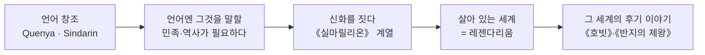

<figure class="post-figure post-figure--header">
<picture>
  <source type="image/webp" srcset="/assets/images/lore/middle-earth-legendarium-overview-640.webp 640w, /assets/images/lore/middle-earth-legendarium-overview-1024.webp 1024w, /assets/images/lore/middle-earth-legendarium-overview-1536.webp 1536w" sizes="(max-width: 800px) 100vw, 760px">
  
</picture>
<figcaption>펼친 책에서 <strong>중간계</strong>가 피어오른다 — 흰 탑, 불의 산, 초록 언덕까지. 톨킨의 <strong>하위창조</strong>를 형상화한 장면으로, 글로 쓰인 언어와 이야기가 <strong>내적 일관성을 갖춘 하나의 세계</strong>를 빚어내는 이 글의 주제를 담았다.</figcaption>
</figure>

<figure class="post-figure">
<svg role="img" aria-label="세 권의 책이 하나의 세계를 비추는 그림. 왼쪽에 크기가 다른 세 권의 책 — 실마릴리온(신화), 반지의 제왕(서사시), 호빗(동화) — 이 놓여 있고, 각 책에서 뻗어 나온 빛줄기가 오른쪽 가운데의 둥근 세계(아르다)로 모인다. 세 권은 서로 다른 이야기가 아니라 한 세계를 비추는 세 개의 창임을 나타낸다." viewBox="0 0 700 300" xmlns="http://www.w3.org/2000/svg">
  <title>세 권의 책, 하나의 세계 — 서로 다른 톤과 규모로 같은 아르다를 비춘다</title>

  <!-- three books on the left, different sizes = different scope -->
  <rect x="48" y="40" width="150" height="46" rx="4" fill="var(--bg-panel)" stroke="var(--gold)" stroke-width="2.2"/>
  <text x="123" y="60" text-anchor="middle" font-size="10" fill="currentColor" font-weight="700">실마릴리온</text>
  <text x="123" y="76" text-anchor="middle" font-size="7.5" fill="currentColor" opacity="0.8">신화 · 세계의 뿌리</text>

  <rect x="56" y="122" width="134" height="42" rx="4" fill="var(--bg-panel)" stroke="var(--secondary-color)" stroke-width="2"/>
  <text x="123" y="141" text-anchor="middle" font-size="10" fill="currentColor" font-weight="700">반지의 제왕</text>
  <text x="123" y="156" text-anchor="middle" font-size="7.5" fill="currentColor" opacity="0.8">서사시 · 세계의 운명</text>

  <rect x="66" y="200" width="114" height="38" rx="4" fill="var(--bg-panel)" stroke="currentColor" stroke-width="1.8"/>
  <text x="123" y="218" text-anchor="middle" font-size="10" fill="currentColor" font-weight="700">호빗</text>
  <text x="123" y="232" text-anchor="middle" font-size="7.5" fill="currentColor" opacity="0.8">동화 · 한 사람의 모험</text>

  <!-- converging light beams to the world orb -->
  <line x1="198" y1="63" x2="452" y2="140" stroke="var(--gold)" stroke-width="1.8" opacity="0.7" marker-end="url(#ov-arrow)"/>
  <line x1="190" y1="143" x2="452" y2="150" stroke="var(--secondary-color)" stroke-width="1.8" opacity="0.7" marker-end="url(#ov-arrow)"/>
  <line x1="180" y1="219" x2="452" y2="162" stroke="currentColor" stroke-width="1.6" opacity="0.55" marker-end="url(#ov-arrow)"/>

  <!-- the one world -->
  <circle cx="540" cy="150" r="72" fill="var(--bg-light)" stroke="var(--accent-color)" stroke-width="2.6" opacity="0.95"/>
  <circle cx="540" cy="150" r="72" fill="none" stroke="currentColor" stroke-width="0.8" opacity="0.3"/>
  <text x="540" y="142" text-anchor="middle" font-size="22" opacity="0.9">🌍</text>
  <text x="540" y="166" text-anchor="middle" font-size="11" fill="currentColor" font-weight="700">아르다</text>
  <text x="540" y="182" text-anchor="middle" font-size="8" fill="currentColor" opacity="0.8">하나의 세계</text>

  <text x="350" y="288" text-anchor="middle" font-size="10" fill="currentColor" opacity="0.85" font-weight="700">세 권은 서로 다른 이야기가 아니라 — 하나의 세계를 비추는 세 개의 창(窓)이다</text>

  <defs>
    <marker id="ov-arrow" markerWidth="8" markerHeight="8" refX="6" refY="4" orient="auto">
      <path d="M0,0 L8,4 L0,8 z" fill="currentColor" opacity="0.7"/>
    </marker>
  </defs>
</svg>
<figcaption>같은 세계 <strong>아르다(Arda)</strong>를 세 권의 책이 서로 다른 <strong>톤과 규모</strong>로 비춘다. <strong>실마릴리온</strong>은 세계의 뿌리를 신화로, <strong>반지의 제왕</strong>은 그 세계의 운명을 서사시로, <strong>호빗</strong>은 한 사람의 모험을 동화로 그린다.</figcaption>
</figure>

## 소개

『반지의 제왕』을 덮고 나면 이상한 허기가 남습니다. 이야기는 끝났는데, **세계는 아직 끝나지 않은 것 같은** 느낌. 곤도르의 왕가는 어디서 왔고, 엘프들은 왜 서쪽 바다로 떠나며, 간달프가 흘리듯 말하는 "옛날 옛적"의 전쟁들은 대체 무엇이었을까. 이 허기의 정체는 분명합니다 — 톨킨(J.R.R. Tolkien)은 소설 한 편을 쓴 것이 아니라 **세계 하나를 지었고**, 우리가 읽은 것은 그 세계의 극히 일부이기 때문입니다.

이 글은 `Middle-earth-Lore` 시리즈의 첫 상세 편으로, 세부 사건에 들어가기 전에 **전체 지형**을 먼저 잡습니다. 세 가지 질문에 답합니다.

- **실마릴리온·호빗·반지의 제왕은 서로 어떤 관계인가?** — 왜 이들을 "하나의 세계"로 읽어야 하는가.
- **톨킨은 어떤 원리로 이 세계를 지었는가?** — 그의 창작 철학 **하위창조(sub-creation)**.
- **이 방대한 세계는 어떻게 만들어졌는가?** — 언어에서 신화로 자라난 **레젠다리움(Legendarium)** 의 형성 과정.

## 한눈에 보기

톨킨 세계관을 이해하는 가장 중요한 열쇠는 순서가 거꾸로라는 사실입니다. 보통은 이야기를 먼저 떠올리고 배경을 붙이지만, 톨킨은 **언어를 먼저 만들고**, 그 언어를 말할 민족과 역사가 필요해서 **신화를 지었으며**, 그 신화가 자라 하나의 세계가 된 뒤에야 그 세계의 후기(後期)를 무대로 한 이야기들 — 호빗과 반지의 제왕 — 을 써 내려갔습니다.

이 순서를 알면, 왜 반지의 제왕이 그토록 깊은 배경을 가졌는지가 설명됩니다. 배경이 이야기를 위해 급조된 것이 아니라, **이야기가 이미 존재하던 세계 위에 얹힌 것**이기 때문입니다.

## 하나의 세계, 세 권의 책

세 권은 장르도 톤도 분량도 다릅니다. 하지만 이 차이는 **다른 세계라서가 아니라, 같은 세계를 다른 높이에서 바라봤기 때문**에 생깁니다. 세계사(신화)를 내려다보면 실마릴리온이 되고, 한 종족의 운명을 따라가면 반지의 제왕이 되며, 한 개인의 모험에 카메라를 붙이면 호빗이 됩니다.

| 축 | 실마릴리온 | 호빗 | 반지의 제왕 |
| --- | --- | --- | --- |
| 장르·톤 | 신화·전설 (장중한 고문체) | 어린이 동화 (다정한 화자) | 영웅 서사시 (비장·웅장) |
| 다루는 시대 | 창세 ~ 제1시대 (+ 제2시대 요약) | 제3시대 후기 | 제3시대 말 |
| 시점·규모 | 신과 엘프, 세계 전체의 역사 | 빌보 한 사람의 모험 | 여러 시점, 세계의 운명 |
| 집필·출간 | 평생 집필, **사후 1977년** 편집 출간 | **1937년** | **1954–55년** |
| 세계 속 위치 | 세계의 **뿌리** | 반지가 발견되는 **계기** | 뿌리 위에 선 **대서사** |

여기서 가장 흥미로운 역설은 **출간 순서와 세계 내 시간 순서가 정반대**라는 점입니다. 세계의 가장 오래된 이야기(실마릴리온)가 **가장 늦게**(1977년, 톨킨 사후 아들 크리스토퍼가 편집) 세상에 나왔고, 가장 가벼운 동화(호빗)가 **가장 먼저**(1937년) 나왔습니다. 독자는 세계의 끝자락(제3시대)부터 만나 점점 더 깊은 과거로 거슬러 올라가게 됩니다 — 마치 오래된 도시를 걷다가 발밑의 지층을 하나씩 발견하듯이.

그래서 읽는 순서에 정답은 없습니다. **호빗 → 반지의 제왕 → 실마릴리온**은 톨킨이 독자에게 세계를 열어 보인 순서(가벼운 모험에서 깊은 신화로)이고, **실마릴리온 → 반지의 제왕**은 세계의 시간을 따라가는 순서입니다. 다만 어느 쪽으로 읽든, 세 권이 **하나의 연속된 세계**라는 사실을 잊지 않는 것이 핵심입니다.

## 하위창조 — 톨킨이 세계를 지은 원리

톨킨은 자신이 하는 일을 단순한 "상상"이나 "공상"이라 부르지 않았습니다. 그는 1939년 강연이자 에세이인 **「요정 이야기에 관하여(On Fairy-Stories)」** 에서 자신만의 개념을 세웁니다 — **하위창조(sub-creation)**.

핵심 논리는 이렇습니다. 우리가 사는 현실을 **1차 세계(Primary World)** 라 한다면, 이야기꾼은 그 안에서 **2차 세계(Secondary World)** 를 짓는 **하위창조자(sub-creator)** 입니다. 이 2차 세계가 성공하려면 단 하나의 조건이 필요합니다 — **"현실의 내적 일관성(the inner consistency of reality)"**. 즉 그 세계 안에서 모든 것이 자기 법칙에 맞아떨어져야 합니다.

<figure class="post-figure">
<svg role="img" aria-label="하위창조의 구조를 나타낸 그림. 왼쪽 '1차 세계(현실)' 안에 작가가 있고, 작가에게서 '하위창조'라는 화살표가 오른쪽 '2차 세계'로 뻗는다. 2차 세계 안에는 자기 법칙에 따라 정합적으로 돌아가는 작은 세계가 있으며, 그 핵심 조건으로 '내적 일관성'이 적혀 있다. 아래쪽에서 독자가 '2차 신뢰'라는 화살표를 따라 2차 세계 안으로 들어간다." viewBox="0 0 660 280" xmlns="http://www.w3.org/2000/svg">
  <title>하위창조 — 작가가 내적 일관성을 갖춘 2차 세계를 짓고, 독자는 2차 신뢰로 그 안에 들어간다</title>

  <!-- Primary world -->
  <rect x="30" y="40" width="230" height="150" rx="6" fill="var(--bg-light)" stroke="currentColor" stroke-width="1.6" opacity="0.6"/>
  <text x="145" y="64" text-anchor="middle" font-size="11" fill="currentColor" font-weight="700">1차 세계 (현실)</text>
  <circle cx="145" cy="118" r="26" fill="var(--bg-panel)" stroke="currentColor" stroke-width="1.6"/>
  <text x="145" y="124" text-anchor="middle" font-size="18">✍️</text>
  <text x="145" y="164" text-anchor="middle" font-size="8.5" fill="currentColor" opacity="0.85">작가 = 하위창조자</text>

  <!-- sub-creation arrow -->
  <line x1="262" y1="115" x2="392" y2="115" stroke="var(--gold)" stroke-width="2.6" marker-end="url(#sc-arrow)"/>
  <text x="327" y="106" text-anchor="middle" font-size="9" fill="currentColor" font-weight="700">하위창조</text>
  <text x="327" y="128" text-anchor="middle" font-size="7" fill="currentColor" opacity="0.75">sub-creation</text>

  <!-- Secondary world -->
  <rect x="398" y="30" width="232" height="170" rx="6" fill="var(--bg-light)" stroke="var(--accent-color)" stroke-width="2.2" opacity="0.9"/>
  <text x="514" y="54" text-anchor="middle" font-size="11" fill="currentColor" font-weight="700">2차 세계 (Secondary World)</text>
  <circle cx="514" cy="112" r="34" fill="var(--bg-panel)" stroke="var(--secondary-color)" stroke-width="2"/>
  <text x="514" y="118" text-anchor="middle" font-size="22">🌍</text>
  <text x="514" y="170" text-anchor="middle" font-size="9" fill="currentColor" font-weight="700">내적 일관성</text>
  <text x="514" y="184" text-anchor="middle" font-size="7.5" fill="currentColor" opacity="0.8">inner consistency of reality</text>

  <!-- reader enters via secondary belief -->
  <text x="330" y="238" text-anchor="middle" font-size="16">🧑‍🤝‍🧑</text>
  <text x="330" y="258" text-anchor="middle" font-size="8.5" fill="currentColor" opacity="0.85">독자</text>
  <path d="M355 236 Q460 236 505 152" fill="none" stroke="var(--secondary-color)" stroke-width="2.2" stroke-dasharray="5 4" marker-end="url(#sc-arrow)"/>
  <text x="470" y="222" text-anchor="middle" font-size="9" fill="currentColor" font-weight="700">2차 신뢰 (Secondary Belief)</text>

  <defs>
    <marker id="sc-arrow" markerWidth="9" markerHeight="9" refX="7" refY="4.5" orient="auto">
      <path d="M0,0 L9,4.5 L0,9 z" fill="var(--secondary-color)"/>
    </marker>
  </defs>
</svg>
<figcaption><strong>하위창조</strong>의 구조 — 작가는 <strong>내적 일관성</strong>을 갖춘 2차 세계를 짓고, 독자는 "믿기로 애쓰는" 것이 아니라 그 세계 안에 들어가 자연스럽게 <strong>2차 신뢰</strong>를 품는다.</figcaption>
</figure>

톨킨은 여기서 한 걸음 더 나아가, 흔히 말하는 **"불신의 자발적 유예(willing suspension of disbelief)"** 를 오히려 실패의 신호라고 봤습니다. 좋은 2차 세계 안에서 독자는 억지로 불신을 참는 것이 아니라, 그 세계에 있는 동안 자연스럽게 그것을 **참(true)으로 받아들인다**는 것입니다. 그는 이 상태를 **2차 신뢰(Secondary Belief)** 라 불렀습니다. 우리가 반지의 제왕을 읽으며 중간계의 지리와 족보를 "사실"처럼 느끼는 이유가 바로 이것입니다.

톨킨에게 이 하위창조는 단순한 오락이 아니라 인간의 근원적 활동이었습니다. 그는 「요정 이야기에 관하여」에서 인간이 이야기를 지어내는 것을 **창조주를 닮은 본성의 발현**으로 해석했고("우리는 창조된 그 정도만큼 창조한다"는 유명한 취지의 구절), 좋은 요정 이야기가 주는 것으로 **회복(Recovery)·탈출(Escape)·위안(Consolation)**, 그리고 절망의 끝에서 갑자기 찾아오는 기쁜 반전 — 그가 만든 말 **에우카타스트로페(eucatastrophe)** — 를 꼽았습니다. 반지의 제왕에서 독수리가 날아드는 순간, 실마릴리온의 비극 사이로 비치는 희망의 빛은 모두 이 개념의 구현입니다.

## 언어에서 신화로 — 레젠다리움의 형성

톨킨이 이토록 정합적인 세계를 지을 수 있었던 근원에는 그의 본업이 있습니다. 그는 옥스퍼드의 **문헌학자(philologist)** — 고대 영어와 게르만 언어를 연구하는 학자였습니다. 그에게 언어는 취미가 아니라 사고의 뿌리였고, 그는 십 대 시절부터 **직접 언어를 발명**했습니다. 핀란드어에서 영감을 받은 고귀한 요정어 **퀘냐(Quenya)**, 웨일스어의 소리를 닮은 **신다린(Sindarin)** 이 대표적입니다.

여기서 톨킨 특유의 순서가 나옵니다. 그는 언어 하나가 살아 있으려면 **그 언어를 말하는 민족과, 그 민족이 겪은 역사와 전설이 있어야 한다**고 느꼈습니다. 훗날 서한에서 그는 이야기들이 언어를 위한 무대로서 만들어졌다는 취지로 회고합니다 — 보통의 작가와 정반대로, **세계가 이야기를 위해 존재한 것이 아니라 이야기가 언어를 위해 존재**한 셈입니다.

이 씨앗은 아주 일찍 심겼습니다. 1차 세계대전 무렵부터 쓰기 시작한 **『잃어버린 이야기들의 책(The Book of Lost Tales)』** 이 훗날 실마릴리온의 재료가 되었고, 톨킨은 여기에 **"영국을 위한 신화(a mythology for England)"** 를 만들겠다는 포부를 담았습니다 — 그리스·북유럽에는 있지만 잉글랜드에는 없다고 그가 느낀, 한 나라의 뿌리를 이루는 전설 체계 말입니다.

정작 대중에게 문을 연 것은 우연에 가까웠습니다. 채점을 하다 백지에 무심코 적은 한 문장("땅속 어느 굴에 호빗이 살고 있었다")에서 **호빗**이 시작되었고, 이는 처음엔 레젠다리움과 다소 독립적인 동화였습니다. 그런데 출판사가 후속작을 요청하자, 톨킨은 호빗의 속편을 쓰려다 그것을 자신이 평생 지어 온 거대한 신화와 **연결**해 버립니다. 그 결과가 **반지의 제왕** — 동화의 문법으로 시작해 신화의 무게로 끝나는 작품 — 입니다. 반지의 제왕이 유독 깊게 느껴지는 이유는, 그 밑에 이미 수십 년간 자라 온 실마릴리온의 지층이 깔려 있었기 때문입니다.

## 핵심 포인트

- **세 권은 한 세계다**: 실마릴리온·호빗·반지의 제왕은 장르가 다를 뿐 같은 세계 아르다를 서로 다른 높이에서 비춘다. 따로 읽어도 좋지만, 하나로 꿸 때 각 작품의 깊이가 온전히 드러난다.
- **출간 순서 ≠ 세계 시간 순서**: 세계의 가장 오래된 이야기(실마릴리온)가 가장 늦게 출간됐다. 독자는 세계의 황혼(제3시대)부터 만나 과거로 거슬러 올라간다.
- **하위창조가 원리다**: 톨킨의 세계는 "내적 일관성"을 갖춘 2차 세계이며, 독자는 억지로 믿는 게 아니라 자연스러운 2차 신뢰로 그 안에 들어간다. 이것이 중간계가 "실재처럼" 느껴지는 이유다.
- **언어가 먼저였다**: 톨킨은 언어를 만들고 그것을 담을 세계를 지었다. 세계가 이야기를 위한 배경이 아니라, 이야기가 언어를 위한 무대였다는 거꾸로 된 순서가 이 세계의 밀도를 만든다.
- **뿌리가 서사를 떠받친다**: 반지의 제왕의 무게감은 그 아래 깔린 실마릴리온의 역사에서 나온다. 다음 편부터 그 뿌리 — 창세 신화 — 로 내려간다.

## 결론

톨킨의 중간계를 즐기는 첫 번째 요령은 **"이건 한 세계다"** 라는 태도를 갖는 것입니다. 세 권의 책은 서로 다른 문(門)일 뿐, 그 너머는 하나의 땅으로 이어져 있습니다. 그리고 그 땅이 그토록 단단한 이유는 톨킨이 그것을 **하위창조** — 내적 일관성을 갖춘 2차 세계 — 로 지었고, 심지어 **언어를 먼저 만든 뒤 그것을 담기 위해** 세계를 빚었기 때문입니다.

이제 전체 지형을 잡았으니, 다음 편에서는 이 세계의 **맨 처음** — 에루 일루바타르의 음악에서 세계가 태어나는 창세 신화 — 로 내려갑니다. 로드맵의 1단계를 정복했습니다. 다음은 2단계, 창세입니다.

### 다음 학습 (Next Learning)

- [중간계 세계관 정복 로드맵](/2026/08/24/middle-earth-lore-roadmap.html) — 이 시리즈의 마스터 로드맵으로 돌아가기
- [음악에서 태어난 세계: 에루, 아이누, 그리고 창세의 불협화음](/2026/08/24/middle-earth-creation-myth.html) — 에루와 아이누, 아이눌린달레 (2단계 창세 신화)
