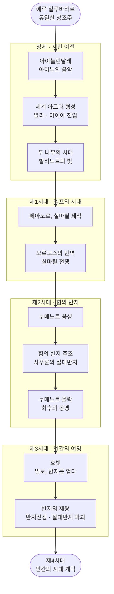

<figure class="post-figure post-figure--header">
<picture>
  <source type="image/webp" srcset="/assets/images/lore/middle-earth-lore-roadmap-640.webp 640w, /assets/images/lore/middle-earth-lore-roadmap-1024.webp 1024w, /assets/images/lore/middle-earth-lore-roadmap-1536.webp 1536w" sizes="(max-width: 800px) 100vw, 760px">
  
</picture>
<figcaption>제3시대의 황혼, 한 순찰자가 중간계 전체를 굽어본다 — 왼쪽 <strong>미나스 티리스</strong>(곤도르의 흰 도시)와 오른쪽 <strong>모르도르</strong>(어둠의 탑·불의 산) 사이, 하늘의 <strong>반지 형상 후광</strong>이 흩어진 시대들을 하나로 묶는다. 이 시리즈가 정리할 '하나의 세계'다.</figcaption>
</figure>

<figure class="post-figure">
<svg role="img" aria-label="톨킨 중간계 세계관을 한 장으로 묶은 그림. 왼쪽에서 오른쪽으로 네 개의 시대가 흐른다. 첫 칸 '창세'에는 에루의 음악(아이눌린달레)에서 세계가 태어나고, 둘째 칸 '제1시대'에는 실마릴을 둘러싼 전쟁, 셋째 칸 '제2시대'에는 힘의 반지 주조와 누메노르, 마지막 칸 '제3시대'에는 절대반지를 파괴하는 반지전쟁이 놓인다. 아래 띠에는 세 권의 책 — 실마릴리온·호빗·반지의 제왕 — 이 각각 어느 시대를 다루는지 대응된다." viewBox="0 0 700 340" xmlns="http://www.w3.org/2000/svg">
  <title>중간계 레젠다리움 — 창세의 음악에서 반지전쟁까지 흐르는 하나의 세계</title>

  <!-- top axis: the flow of Ages -->
  <text x="350" y="26" text-anchor="middle" font-size="11" fill="currentColor" font-weight="700" opacity="0.75">시간의 흐름 — 하나의 세계, 네 개의 시대</text>
  <line x1="40" y1="44" x2="660" y2="44" stroke="currentColor" stroke-width="1.6" opacity="0.5" marker-end="url(#me-flow)"/>

  <!-- STAGE: 창세 -->
  <rect x="40" y="60" width="140" height="150" rx="4" fill="var(--bg-light)" stroke="currentColor" stroke-width="1.5" opacity="0.6"/>
  <text x="110" y="82" text-anchor="middle" font-size="11" fill="currentColor" font-weight="700">창세</text>
  <text x="110" y="98" text-anchor="middle" font-size="7.5" fill="currentColor" opacity="0.8">시간 이전 · 나무의 시대</text>
  <rect x="52" y="110" width="116" height="86" rx="3" fill="var(--bg-panel)" stroke="var(--gold)" stroke-width="2"/>
  <text x="110" y="132" text-anchor="middle" font-size="20" opacity="0.9">🎵</text>
  <text x="110" y="156" text-anchor="middle" font-size="8.5" fill="currentColor" font-weight="700">아이눌린달레</text>
  <text x="110" y="170" text-anchor="middle" font-size="7" fill="currentColor" opacity="0.8">에루와 아이누의</text>
  <text x="110" y="181" text-anchor="middle" font-size="7" fill="currentColor" opacity="0.8">음악에서 세계가 태어남</text>

  <!-- STAGE: 제1시대 -->
  <rect x="196" y="60" width="140" height="150" rx="4" fill="var(--bg-light)" stroke="currentColor" stroke-width="1.5" opacity="0.6"/>
  <text x="266" y="82" text-anchor="middle" font-size="11" fill="currentColor" font-weight="700">제1시대</text>
  <text x="266" y="98" text-anchor="middle" font-size="7.5" fill="currentColor" opacity="0.8">엘프의 시대 · 벨레리안드</text>
  <rect x="208" y="110" width="116" height="86" rx="3" fill="var(--bg-panel)" stroke="var(--secondary-color)" stroke-width="2"/>
  <text x="266" y="132" text-anchor="middle" font-size="20" opacity="0.9">💎</text>
  <text x="266" y="156" text-anchor="middle" font-size="8.5" fill="currentColor" font-weight="700">실마릴 전쟁</text>
  <text x="266" y="170" text-anchor="middle" font-size="7" fill="currentColor" opacity="0.8">모르고스 대 엘프,</text>
  <text x="266" y="181" text-anchor="middle" font-size="7" fill="currentColor" opacity="0.8">세 보석을 둘러싼 비극</text>

  <!-- STAGE: 제2시대 -->
  <rect x="352" y="60" width="140" height="150" rx="4" fill="var(--bg-light)" stroke="currentColor" stroke-width="1.5" opacity="0.6"/>
  <text x="422" y="82" text-anchor="middle" font-size="11" fill="currentColor" font-weight="700">제2시대</text>
  <text x="422" y="98" text-anchor="middle" font-size="7.5" fill="currentColor" opacity="0.8">누메노르 · 힘의 반지</text>
  <rect x="364" y="110" width="116" height="86" rx="3" fill="var(--bg-panel)" stroke="currentColor" stroke-width="1.8"/>
  <text x="422" y="132" text-anchor="middle" font-size="20" opacity="0.9">🌊</text>
  <text x="422" y="156" text-anchor="middle" font-size="8.5" fill="currentColor" font-weight="700">반지 주조</text>
  <text x="422" y="170" text-anchor="middle" font-size="7" fill="currentColor" opacity="0.8">사우론의 계략,</text>
  <text x="422" y="181" text-anchor="middle" font-size="7" fill="currentColor" opacity="0.8">누메노르의 몰락</text>

  <!-- STAGE: 제3시대 -->
  <rect x="508" y="60" width="152" height="150" rx="4" fill="var(--bg-light)" stroke="var(--accent-color)" stroke-width="2.2" opacity="0.9"/>
  <text x="584" y="82" text-anchor="middle" font-size="11" fill="currentColor" font-weight="700">제3시대</text>
  <text x="584" y="98" text-anchor="middle" font-size="7.5" fill="currentColor" opacity="0.8">인간의 여명 · 반지전쟁</text>
  <rect x="520" y="110" width="128" height="86" rx="3" fill="var(--bg-panel)" stroke="var(--gold)" stroke-width="2.2"/>
  <text x="584" y="132" text-anchor="middle" font-size="20" opacity="0.95">💍</text>
  <text x="584" y="156" text-anchor="middle" font-size="8.5" fill="currentColor" font-weight="700">반지전쟁</text>
  <text x="584" y="170" text-anchor="middle" font-size="7" fill="currentColor" opacity="0.8">절대반지 파괴,</text>
  <text x="584" y="181" text-anchor="middle" font-size="7" fill="currentColor" opacity="0.8">제3시대의 종막</text>

  <!-- flow arrows between stages -->
  <line x1="180" y1="135" x2="196" y2="135" stroke="var(--secondary-color)" stroke-width="2.4" marker-end="url(#me-arrow)"/>
  <line x1="336" y1="135" x2="352" y2="135" stroke="var(--secondary-color)" stroke-width="2.4" marker-end="url(#me-arrow)"/>
  <line x1="492" y1="135" x2="508" y2="135" stroke="var(--secondary-color)" stroke-width="2.4" marker-end="url(#me-arrow)"/>

  <!-- book band -->
  <text x="40" y="248" font-size="9.5" fill="currentColor" font-weight="700" opacity="0.75">세 권의 책이 다루는 시대</text>
  <rect x="40" y="258" width="296" height="26" rx="3" fill="var(--bg-panel)" stroke="var(--secondary-color)" stroke-width="1.6"/>
  <text x="188" y="275" text-anchor="middle" font-size="8.5" fill="currentColor" font-weight="700">실마릴리온 — 창세 · 제1시대 · 제2시대</text>
  <rect x="508" y="258" width="152" height="26" rx="3" fill="var(--bg-panel)" stroke="var(--gold)" stroke-width="1.8"/>
  <text x="584" y="275" text-anchor="middle" font-size="8.5" fill="currentColor" font-weight="700">호빗 · 반지의 제왕</text>
  <line x1="336" y1="271" x2="508" y2="271" stroke="currentColor" stroke-width="1.2" opacity="0.4" stroke-dasharray="4 3"/>

  <text x="350" y="312" text-anchor="middle" font-size="10" fill="currentColor" opacity="0.85" font-weight="700">세 권은 서로 다른 이야기가 아니라 — 한 세계의 서로 다른 시대를 비추는 창(窓)이다</text>

  <defs>
    <marker id="me-arrow" markerWidth="8" markerHeight="8" refX="6" refY="4" orient="auto">
      <path d="M0,0 L8,4 L0,8 z" fill="var(--secondary-color)"/>
    </marker>
    <marker id="me-flow" markerWidth="9" markerHeight="9" refX="7" refY="4.5" orient="auto">
      <path d="M0,0 L9,4.5 L0,9 z" fill="currentColor"/>
    </marker>
  </defs>
</svg>
<figcaption>이 시리즈의 한 장 요약 — 톨킨의 세계는 <strong>창세(에루의 음악)</strong> → <strong>제1시대(실마릴 전쟁)</strong> → <strong>제2시대(힘의 반지·누메노르)</strong> → <strong>제3시대(반지전쟁)</strong>로 흐르는 하나의 연대기다. 아래 띠는 세 권의 책이 각각 어느 시대를 비추는지 보여 준다. <strong>실마릴리온</strong>은 창세부터 제2시대까지의 먼 과거를, <strong>호빗</strong>과 <strong>반지의 제왕</strong>은 그 세계의 황혼인 제3시대 말을 다룬다.</figcaption>
</figure>

## 소개

『반지의 제왕』을 처음 읽은 사람은 종종 이런 인상을 받습니다. **이 세계는 이야기보다 훨씬 크다.** 프로도가 걷는 길목마다 낡은 노래, 잊힌 왕국, 이름만 남은 영웅이 등장하고, 간달프는 마치 이미 수천 년을 살아온 사람처럼 과거를 이야기합니다. 그럴 수밖에 없습니다. 톨킨(J.R.R. Tolkien)은 소설을 쓰기 위해 세계를 만든 것이 아니라, **평생에 걸쳐 세계를 만들고 그 세계의 한 시대를 소설로 옮겨 적었기** 때문입니다.

그가 창조한 이 거대한 신화 체계를 흔히 **레젠다리움(Legendarium)** 이라고 부릅니다. 창세 신화인 『실마릴리온(The Silmarillion)』, 어린이를 위한 모험담 『호빗(The Hobbit)』, 그리고 대서사시 『반지의 제왕(The Lord of the Rings)』은 각각 다른 톤과 분량을 가졌지만, 실은 **하나의 세계(아르다, Arda)에서 벌어지는 서로 다른 시대의 이야기**입니다. 세 권을 따로 읽으면 세 편의 판타지지만, 하나로 꿰어 읽으면 창세부터 종말까지 이어지는 한 편의 연대기가 됩니다.

이 글은 `Middle-earth-Lore` 시리즈의 **마스터 로드맵**입니다. 방대한 세계관을 **시대 · 종족 · 지리 · 악의 계보 · 핵심 사물**이라는 축으로 나누고, 각 축을 하나씩 상세 포스트로 정리하는 **도장깨기** 방식으로 아카이브를 채워 나갑니다. 원문(저작권 보호 대상)을 옮겨 적는 대신, 세계의 **구조와 의미를 분석·해설**하는 데 초점을 둡니다.

> 이 로드맵은 이 위키에 새로 신설한 최상위 카테고리 **`Lore`** 의 첫 세계관입니다. 앞으로 다른 소설·게임의 세계관도 각각 하나의 서브카테고리(`[Lore, <세계관>]`)로 이 아카이브에 더해질 예정입니다. 중간계는 그 출발점입니다.

## 한눈에 보기

톨킨 세계관의 **척추**는 시간의 흐름입니다. 세계가 어떻게 태어났고, 악이 어떻게 등장했으며, 그 악을 물리치기까지 어떤 시대가 이어졌는지 — 이 큰 줄기 하나만 잡으면 나머지 지식이 걸릴 못이 생깁니다.

세 권의 책은 이 흐름 위 서로 다른 지점을 비춥니다. **실마릴리온**은 창세부터 제2시대까지(엘프와 신들의 먼 과거)를, **호빗**과 **반지의 제왕**은 세계가 이미 늙어버린 제3시대의 끝자락을 다룹니다. 프로도의 여정이 그토록 무겁게 느껴지는 이유는, 그 뒤에 수천 년의 실패와 희생이 쌓여 있기 때문입니다.

## 이 아카이브의 구조

세계관을 무작정 시간순으로만 훑으면 인물과 지명에 금세 파묻힙니다. 그래서 이 시리즈는 하나의 세계를 **다섯 개의 렌즈**로 나눠 정리합니다. 각 렌즈가 아래 도장깨기 단계에 대응합니다.

- **시대(Ages)** — 세계의 뼈대가 되는 연대기. 언제 무슨 일이 있었는가.
- **종족(Races)** — 엘프·인간·드워프·호빗·엔트·오르크. 누가 이 세계를 살아가는가.
- **지리(Geography)** — 발리노르·벨레리안드·누메노르·중간계. 어디에서 벌어지는가.
- **악의 계보(The Enemy)** — 모르고스에서 사우론, 그리고 절대반지로. 무엇과 싸우는가.
- **핵심 사물(Artifacts)** — 실마릴과 힘의 반지. 세계를 움직이는 물건들.

## 정리 진행 현황

> 완료한 항목에는 상세 포스트 링크가 연결됩니다. 아카이브가 채워질 때마다 체크박스와 진행률을 갱신합니다.

- 현재 완료한 항목: **5개**
- 전체 항목: **6개**
- 진행률: **83%**

## 1단계: 세계관 개요 — 하나의 세계, 세 권의 책

가장 먼저 **레젠다리움 전체의 지도**를 그립니다. 실마릴리온·호빗·반지의 제왕이 어떻게 하나의 세계를 이루는지, 그리고 톨킨이 이 모든 것을 지탱하기 위해 세운 창작 철학 — **하위창조(sub-creation)**, 즉 작가가 스스로 믿을 수 있는 '2차 세계(Secondary World)'를 짓는다는 개념 — 을 먼저 짚습니다.

- [x] **세 권의 관계**: 실마릴리온(신화) · 호빗(모험담) · 반지의 제왕(서사시)이 한 세계를 비추는 방식 — [[상세](/2026/08/24/middle-earth-legendarium-overview.html)]
- [x] **하위창조(Sub-creation)**: 톨킨의 창작 철학과 「요정 이야기에 관하여」 — [[상세](/2026/08/24/middle-earth-legendarium-overview.html)]
- [x] **레젠다리움의 형성**: 언어에서 신화로 — 세계가 만들어진 순서 — [[상세](/2026/08/24/middle-earth-legendarium-overview.html)]

## 2단계: 창세 신화 — 음악에서 태어난 세계

톨킨의 창세는 독특합니다. 세계는 말이나 빛이 아니라 **음악**에서 태어납니다. 유일신 **에루 일루바타르(Eru Ilúvatar)** 가 천사 같은 존재 **아이누(Ainur)** 에게 주제를 주고, 그들이 함께 부른 노래(**아이눌린달레, Ainulindalë**)가 곧 세계의 설계도가 됩니다. 이 신화가 이후 모든 선과 악의 뿌리를 설명합니다.

- [x] **에루와 아이누**: 유일신, 그리고 그가 지은 천사적 존재들 — [[상세](/2026/08/24/middle-earth-creation-myth.html)]
- [x] **아이눌린달레**: 음악으로서의 창조, 그리고 멜코르의 불협화음 — [[상세](/2026/08/24/middle-earth-creation-myth.html)]
- [x] **발라와 마이아**: 세계를 다스리는 신적 존재들(발라)과 그 부하들(마이아) — 간달프·사우론·발로그의 정체 — [[상세](/2026/08/24/middle-earth-creation-myth.html)]

## 3단계: 시대 구분 — 세계의 연대기

세계의 큰 줄기를 시대별로 정리합니다. **등불의 시대 → 두 나무의 시대 → 제1·2·3시대**로 이어지는 흐름과, 각 시대의 결정적 사건(실마릴 전쟁, 누메노르 몰락, 반지전쟁)을 한 축에 꿰어 세계관의 골격을 세웁니다.

- [x] **태초의 시대**: 등불의 시대와 두 나무의 시대 — [[상세](/2026/08/24/middle-earth-ages-chronology.html)]
- [x] **제1시대**: 실마릴과 모르고스 전쟁, 벨레리안드의 침몰 — [[상세](/2026/08/24/middle-earth-ages-chronology.html)]
- [x] **제2·3시대**: 누메노르의 흥망, 힘의 반지, 그리고 반지전쟁으로 가는 길 — [[상세](/2026/08/24/middle-earth-ages-chronology.html)]

## 4단계: 종족 — 이 세계를 살아가는 자들

중간계를 채우는 종족들을 정리합니다. 각 종족은 단순한 판타지 클리셰가 아니라 **에루의 창조 순서와 운명** 속에서 고유한 의미를 가집니다. 불멸의 **엘프**(첫째로 태어난 자), 필멸의 **인간**(에루의 '선물'로서 죽음을 가진 자), 아울레가 몰래 빚은 **드워프**, 그리고 톨킨이 사랑한 소박한 **호빗**까지.

- [x] **엘프와 인간**: 불멸과 필멸 — 첫째 자손과 둘째 자손의 운명 — [[상세](/2026/08/24/middle-earth-races.html)]
- [x] **드워프·엔트·호빗**: 창조 밖에서 태어난 종족들 — [[상세](/2026/08/24/middle-earth-races.html)]
- [x] **오르크와 타락**: 악은 창조하지 못하고 비틀 뿐 — 오르크의 기원 문제 — [[상세](/2026/08/24/middle-earth-races.html)]

## 5단계: 지리 — 세계의 무대

세계의 공간을 정리합니다. 신들이 사는 축복의 땅 **아만(발리노르)**, 제1시대의 무대였다가 바다에 잠긴 **벨레리안드**, 인간의 영광과 오만이 함께 무너진 섬 **누메노르**, 그리고 우리가 잘 아는 **중간계(엔도르)**. 지리는 곧 역사입니다 — 땅이 가라앉고 바다가 밀려온 자리마다 한 시대가 끝났습니다.

- [x] **아만과 중간계**: 축복의 땅과 필멸의 땅, 그리고 갈라진 바다 — [[상세](/2026/08/24/middle-earth-geography.html)]
- [x] **누메노르**: 인간에게 주어진 섬 왕국과 그 몰락 — [[상세](/2026/08/24/middle-earth-geography.html)]
- [x] **제3시대의 지도**: 곤도르·로한·모르도르·샤이어 — 반지의 제왕의 무대 — [[상세](/2026/08/24/middle-earth-geography.html)]

## 6단계: 악의 계보와 핵심 사물 — 무엇과 싸우는가

마지막으로 세계를 관통하는 **악의 계보**와, 그 악이 탐한 **핵심 사물**을 함께 정리하며 로드맵을 반지의 제왕 본편으로 연결합니다. 최초의 악 **모르고스(멜코르)** 에서 그의 부하였던 **사우론**으로 이어지는 흐름, 그리고 두 시대를 각각 상징하는 물건 — 제1시대의 **실마릴**과 제2·3시대의 **절대반지** — 이 어떻게 같은 이야기(탐욕이 세계를 망가뜨린다)를 반복하는지 봅니다.

- [ ] **모르고스에서 사우론으로**: 두 어둠의 군주와 악의 본질
- [ ] **실마릴과 절대반지**: 두 시대를 상징하는 사물, 그리고 반복되는 비극
- [ ] **반지전쟁으로**: 호빗과 반지의 제왕이 이 계보의 어디에 놓이는가

## 핵심 포인트

- **하나의 세계로 읽어라**: 세 권은 별개의 작품이 아니라 한 세계의 서로 다른 시대다. 반지의 제왕의 무게감은 그 뒤에 쌓인 실마릴리온의 역사에서 나온다.
- **음악이 곧 설계도다**: 톨킨의 창세는 음악에서 시작한다. 세계의 선과 악, 예정된 조화와 그 안의 불협화음이 모두 이 창세 신화에 씨앗으로 심겨 있다.
- **악은 창조하지 못한다**: 톨킨 세계에서 악(모르고스·사우론)은 새로운 것을 만들지 못하고 이미 있는 것을 비틀고 타락시킬 뿐이다. 오르크·절대반지의 본질이 여기에 있다.
- **탐욕은 반복된다**: 실마릴을 둘러싼 제1시대의 비극과 절대반지를 둘러싼 제3시대의 비극은 같은 구조다. 세계를 망치는 것은 대개 정복욕이 아니라 '소유하려는 사랑'이다.
- **지리는 역사다**: 벨레리안드의 침몰, 누메노르의 수몰처럼 톨킨의 지도는 시대가 끝날 때마다 바뀐다. 지명 하나에 한 시대의 흥망이 담겨 있다.

## 결론

톨킨의 중간계는 한 번 읽고 덮는 이야기가 아니라, 읽을 때마다 더 깊은 층이 드러나는 **세계**입니다. 그 세계를 온전히 즐기는 가장 좋은 방법은, 개별 사건을 외우기 전에 **전체 구조 — 시대·종족·지리·악의 계보 — 라는 못을 먼저 박아 두는 것**입니다. 그 위에 세부 지식을 하나씩 걸면, 흩어져 보이던 이름과 노래가 제자리를 찾아갑니다.

이 로드맵은 그 못을 박는 작업입니다. 1단계 세계관 개요부터 시작해, 항목을 하나씩 정복할 때마다 상세 포스트를 작성하고 이 로드맵의 진행률을 갱신해 나가겠습니다. 반지의 제왕을 필두로 한 이 아카이브가 앞으로 다른 세계관들까지 품는 `Lore` 서고의 첫 장(章)이 되기를 바랍니다.

### 다음 학습 (Next Learning)

- [하나의 세계, 세 권의 책: 톨킨 레젠다리움과 하위창조](/2026/08/24/middle-earth-legendarium-overview.html) — 1단계 세계관 개요 (완료)
- [음악에서 태어난 세계: 에루, 아이누, 그리고 창세의 불협화음](/2026/08/24/middle-earth-creation-myth.html) — 2단계 창세 신화 (완료)
- [빛의 연대기: 등불과 두 나무에서 세 시대로](/2026/08/24/middle-earth-ages-chronology.html) — 3단계 시대 구분 (완료)
- [불멸과 필멸 사이: 엘프·인간·드워프·호빗, 그리고 오르크의 기원](/2026/08/24/middle-earth-races.html) — 4단계 종족 (완료)
- [세계의 무대: 축복의 땅 아만에서 제3시대 중간계까지](/2026/08/24/middle-earth-geography.html) — 5단계 지리 (완료)
- **6단계: 악의 계보와 핵심 사물** — 모르고스에서 사우론으로, 실마릴에서 절대반지로 *(작성 예정)*
