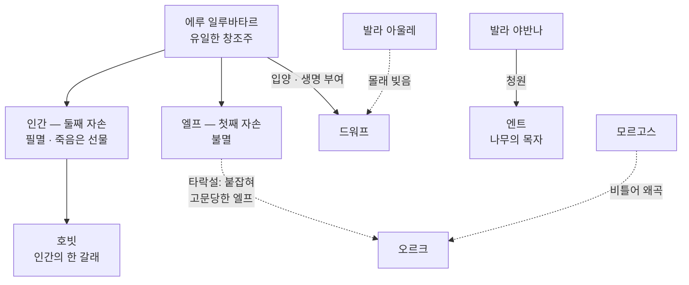

<figure class="post-figure post-figure--header">
<picture>
  <source type="image/webp" srcset="/assets/images/lore/middle-earth-races-640.webp 640w, /assets/images/lore/middle-earth-races-1024.webp 1024w, /assets/images/lore/middle-earth-races-1536.webp 1536w" sizes="(max-width: 800px) 100vw, 760px">
  
</picture>
<figcaption>황혼의 선돌 앞에 선 중간계의 <strong>자유민</strong> — 불멸의 <strong>엘프</strong>, 필멸의 <strong>인간</strong>, 단단한 <strong>드워프</strong>, 작은 <strong>호빗</strong>. 오른쪽 어둠에 몰린 <strong>오르크</strong>는 새로 창조된 종족이 아니라, 이들 중 누군가가 <strong>비틀려 만들어진</strong> 존재다.</figcaption>
</figure>

<figure class="post-figure">
<svg role="img" aria-label="중간계 종족을 세 갈래로 나눈 그림. 왼쪽 칸 '에루의 직접 창조 — 일루바타르의 자손'에는 불멸의 엘프와 필멸의 인간이 있다. 가운데 칸 '창조의 곁가지 — 에루가 받아들임'에는 드워프·엔트·호빗이 있다. 오른쪽 칸 '악의 왜곡 — 창조가 아님'에는 오르크가 있다. 아래에 '에루만이 진짜 생명을 준다 — 악은 이미 있는 것을 비틀 뿐'이라는 설명이 있다." viewBox="0 0 700 320" xmlns="http://www.w3.org/2000/svg">
  <title>중간계의 종족 — 직접 창조 · 곁가지 · 왜곡</title>

  <text x="350" y="24" text-anchor="middle" font-size="11" fill="currentColor" font-weight="700" opacity="0.75">누가 이 세계를 살아가는가 — 세 갈래의 종족</text>

  <!-- Col 1: 에루의 직접 창조 -->
  <rect x="24" y="42" width="200" height="210" rx="5" fill="var(--bg-light)" stroke="var(--gold)" stroke-width="2" opacity="0.95"/>
  <text x="124" y="62" text-anchor="middle" font-size="9.5" fill="currentColor" font-weight="700">에루의 직접 창조</text>
  <text x="124" y="76" text-anchor="middle" font-size="7.5" fill="currentColor" opacity="0.8">일루바타르의 자손</text>
  <rect x="38" y="88" width="172" height="70" rx="4" fill="var(--bg-panel)" stroke="var(--secondary-color)" stroke-width="1.8"/>
  <text x="124" y="112" text-anchor="middle" font-size="16">🧝</text>
  <text x="124" y="132" text-anchor="middle" font-size="9" fill="currentColor" font-weight="700">엘프 — 첫째 자손</text>
  <text x="124" y="148" text-anchor="middle" font-size="7.5" fill="currentColor" opacity="0.8">불멸 · 세계에 묶임</text>
  <rect x="38" y="166" width="172" height="70" rx="4" fill="var(--bg-panel)" stroke="currentColor" stroke-width="1.6"/>
  <text x="124" y="190" text-anchor="middle" font-size="16">🧑</text>
  <text x="124" y="210" text-anchor="middle" font-size="9" fill="currentColor" font-weight="700">인간 — 둘째 자손</text>
  <text x="124" y="226" text-anchor="middle" font-size="7.5" fill="currentColor" opacity="0.8">필멸 · 죽음은 '선물'</text>

  <!-- Col 2: 창조의 곁가지 -->
  <rect x="250" y="42" width="200" height="210" rx="5" fill="var(--bg-light)" stroke="var(--secondary-color)" stroke-width="1.8" opacity="0.9"/>
  <text x="350" y="62" text-anchor="middle" font-size="9.5" fill="currentColor" font-weight="700">창조의 곁가지</text>
  <text x="350" y="76" text-anchor="middle" font-size="7.5" fill="currentColor" opacity="0.8">에루가 받아들이거나 허락함</text>
  <rect x="264" y="88" width="172" height="46" rx="4" fill="var(--bg-panel)" stroke="currentColor" stroke-width="1.4"/>
  <text x="350" y="107" text-anchor="middle" font-size="8.5" fill="currentColor" font-weight="700">🪓 드워프</text>
  <text x="350" y="123" text-anchor="middle" font-size="7" fill="currentColor" opacity="0.8">아울레가 빚고 · 에루가 입양</text>
  <rect x="264" y="140" width="172" height="46" rx="4" fill="var(--bg-panel)" stroke="currentColor" stroke-width="1.4"/>
  <text x="350" y="159" text-anchor="middle" font-size="8.5" fill="currentColor" font-weight="700">🌲 엔트</text>
  <text x="350" y="175" text-anchor="middle" font-size="7" fill="currentColor" opacity="0.8">야반나의 청 · 나무의 목자</text>
  <rect x="264" y="192" width="172" height="46" rx="4" fill="var(--bg-panel)" stroke="currentColor" stroke-width="1.4"/>
  <text x="350" y="211" text-anchor="middle" font-size="8.5" fill="currentColor" font-weight="700">🧑‍🌾 호빗</text>
  <text x="350" y="227" text-anchor="middle" font-size="7" fill="currentColor" opacity="0.8">인간의 한 갈래</text>

  <!-- Col 3: 악의 왜곡 -->
  <rect x="476" y="42" width="200" height="210" rx="5" fill="var(--bg-light)" stroke="var(--accent-color)" stroke-width="2" opacity="0.9"/>
  <text x="576" y="62" text-anchor="middle" font-size="9.5" fill="currentColor" font-weight="700">악의 왜곡</text>
  <text x="576" y="76" text-anchor="middle" font-size="7.5" fill="currentColor" opacity="0.8">창조가 아니라 비틀림</text>
  <rect x="490" y="100" width="172" height="120" rx="4" fill="var(--bg-panel)" stroke="var(--accent-color)" stroke-width="2"/>
  <text x="576" y="136" text-anchor="middle" font-size="18">👹</text>
  <text x="576" y="162" text-anchor="middle" font-size="9" fill="currentColor" font-weight="700">오르크</text>
  <text x="576" y="180" text-anchor="middle" font-size="7.5" fill="currentColor" opacity="0.8">모르고스가 이미 있는</text>
  <text x="576" y="192" text-anchor="middle" font-size="7.5" fill="currentColor" opacity="0.8">종족을 비틀어 만듦</text>
  <text x="576" y="208" text-anchor="middle" font-size="7" fill="currentColor" opacity="0.7">(엘프 타락설 등)</text>

  <text x="350" y="278" text-anchor="middle" font-size="10" fill="currentColor" opacity="0.85" font-weight="700">진짜 생명을 주는 힘은 오직 에루에게 있다</text>
  <text x="350" y="298" text-anchor="middle" font-size="8" fill="currentColor" opacity="0.7">그래서 악은 새 종족을 창조하지 못하고 — 이미 있는 것을 비틀 뿐이다</text>
</svg>
<figcaption>이 글의 한 장 요약 — 중간계의 종족은 세 갈래다. <strong>에루가 직접 지은 자손</strong>(엘프·인간), <strong>창조의 곁가지</strong>(드워프·엔트·호빗), 그리고 <strong>악이 비틀어 만든 존재</strong>(오르크). 이 구분의 열쇠는 창세 신화의 원칙 — <strong>진짜 생명은 오직 에루가 준다</strong> — 이다.</figcaption>
</figure>

## 소개

판타지에 익숙한 독자에게 엘프·드워프·오르크는 낯익은 얼굴입니다. 오늘날 거의 모든 판타지가 이 종족들을 등장시키니까요. 하지만 그 원형이 바로 톨킨이고, **톨킨의 종족은 클리셰가 아니라 신학**입니다. 각 종족은 "뾰족귀에 활을 잘 쏘는 종족" 같은 특성 묶음이 아니라, **창세 신화 속 창조의 순서와 운명** 안에서 고유한 자리를 갖습니다. 누가 그들을 만들었는가, 죽는가 죽지 않는가, 세계가 끝나면 어디로 가는가 — 이 질문들이 각 종족의 정체를 정의합니다.

이 글은 `Middle-earth-Lore` 시리즈의 4단계로, 세계를 살아가는 자들을 정리합니다. 앞선 3단계에서 세운 시간의 축 위에, 이제 **인물의 축**을 세우는 셈입니다. 핵심 질문은 하나입니다 — **누가 이 세계를 만들었고, 누가 그 안에서 살아가며, 무엇이 그들을 갈라놓는가?**

## 한눈에 보기

종족을 이해하는 뼈대는 **"누가 그들에게 생명을 주었는가"** 입니다. 창세 신화(2단계)에서 보았듯, **진짜 생명을 부여하는 힘(꺼지지 않는 불꽃)은 오직 에루에게** 있습니다. 그래서 모든 종족의 계보는 결국 에루로 수렴하거나, 그러지 못하면 '왜곡'으로 분류됩니다.

실선은 **에루가 직접 준 생명**, 점선은 **다른 존재의 손길(허락·왜곡)** 입니다. 오르크에게로 향하는 화살표에 실선이 하나도 없다는 점 — 그것이 이 계보도의 핵심입니다.

## 첫째 자손과 둘째 자손 — 엘프와 인간

에루가 창세의 음악에 담아 두었다가 **직접 세상에 낸 존재**를 **일루바타르의 자손(Children of Ilúvatar)** 이라 부릅니다. 여기에는 오직 두 종족 — 엘프와 인간 — 만이 속합니다. 나머지 종족은 모두 이 둘의 갈래이거나, 곁가지이거나, 왜곡입니다.

**엘프(첫째 자손, Firstborn).** 엘프는 두 나무의 시대에 동쪽 호수 쿠이비에넨에서 **별빛 아래 처음 깨어났습니다**(3단계 참조). 그들의 결정적 특징은 **불멸**입니다 — 늙거나 병들어 죽지 않으며, 그들의 생명은 **세계(아르다)가 존속하는 한** 이어집니다. 육신이 죽임을 당해도 혼은 만도스의 궁정으로 갔다가 다시 태어날 수 있습니다. 그러나 이 불멸은 축복이자 짐입니다. 엘프는 세계에 **묶여 있어** 세계를 떠날 수 없고, 시대가 흐를수록 쌓이는 상실과 기억을 고스란히 견뎌야 합니다. 제3시대 말 엘프들이 서녘으로 배를 타고 떠나는 것은, 늙어 버린 세계에서 그들의 시간이 다했기 때문입니다.

**인간(둘째 자손, Secondborn).** 인간은 **제1시대의 첫 해돋이와 함께** 동쪽 힐도리엔에서 깨어났습니다(3단계). 인간의 결정적 특징은 **필멸** — 죽음입니다. 그런데 톨킨은 이 죽음을 저주가 아니라 **에루가 인간에게만 준 선물(the Gift of Men)** 로 설정합니다. 엘프가 세계에 영원히 묶이는 것과 달리, 인간은 죽으면 **세계 밖으로 완전히 떠나** 에루에게로 갑니다 — 그 너머가 어디인지는 발라들조차 알지 못합니다. 세계에 얽매이지 않을 자유, 그것이 선물의 의미입니다. 그러나 인간은 점차 죽음을 **두려워**하게 되고, 바로 이 두려움을 모르고스와 사우론이 파고듭니다(누메노르의 몰락이 그 정점입니다 — 3단계). 불멸을 갈망하다 파멸한다는 이 주제가 톨킨 세계의 인간을 규정합니다.

<figure class="post-figure">
<svg role="img" aria-label="엘프와 인간의 운명을 대비한 그림. 왼쪽 엘프는 '불멸'로, 죽어도 세계 안 만도스의 궁정에 머물며 세계에 영원히 묶인다. 오른쪽 인간은 '필멸'로, 죽으면 세계 밖으로 완전히 떠난다. 가운데 화살표가 두 운명이 갈라지는 지점을 보여 준다. 아래에 '엘프는 세계에 묶이고, 인간은 세계를 떠난다 — 죽음은 인간에게 주어진 선물'이라는 설명이 있다." viewBox="0 0 680 260" xmlns="http://www.w3.org/2000/svg">
  <title>불멸과 필멸 — 엘프는 세계에 묶이고, 인간은 세계를 떠난다</title>

  <!-- world boundary -->
  <rect x="30" y="46" width="380" height="150" rx="6" fill="var(--bg-light)" stroke="currentColor" stroke-width="1.4" opacity="0.8"/>
  <text x="220" y="66" text-anchor="middle" font-size="8.5" fill="currentColor" opacity="0.7" font-weight="700">세계(아르다)의 안</text>

  <!-- 엘프 -->
  <rect x="52" y="80" width="150" height="96" rx="5" fill="var(--bg-panel)" stroke="var(--secondary-color)" stroke-width="2"/>
  <text x="127" y="106" text-anchor="middle" font-size="16">🧝</text>
  <text x="127" y="128" text-anchor="middle" font-size="9.5" fill="currentColor" font-weight="700">엘프 · 불멸</text>
  <text x="127" y="145" text-anchor="middle" font-size="7.5" fill="currentColor" opacity="0.8">죽어도 만도스의 궁정으로</text>
  <text x="127" y="158" text-anchor="middle" font-size="7.5" fill="currentColor" opacity="0.8">→ 세계에 영원히 묶임</text>
  <path d="M127 176 A 70 40 0 0 1 127 80" fill="none" stroke="var(--secondary-color)" stroke-width="1.4" stroke-dasharray="4 3" opacity="0.7"/>

  <!-- 인간 -->
  <rect x="238" y="80" width="150" height="96" rx="5" fill="var(--bg-panel)" stroke="currentColor" stroke-width="1.6"/>
  <text x="313" y="106" text-anchor="middle" font-size="16">🧑</text>
  <text x="313" y="128" text-anchor="middle" font-size="9.5" fill="currentColor" font-weight="700">인간 · 필멸</text>
  <text x="313" y="145" text-anchor="middle" font-size="7.5" fill="currentColor" opacity="0.8">죽으면 세계 밖으로</text>
  <text x="313" y="158" text-anchor="middle" font-size="7.5" fill="currentColor" opacity="0.8">→ 에루에게로 (선물)</text>

  <!-- exit arrow to outside -->
  <line x1="410" y1="120" x2="500" y2="120" stroke="var(--gold)" stroke-width="2.4" marker-end="url(#rc-arrow)"/>
  <text x="455" y="110" text-anchor="middle" font-size="7.5" fill="currentColor" opacity="0.8">죽음 = 선물</text>
  <rect x="506" y="86" width="150" height="68" rx="5" fill="var(--bg-panel)" stroke="var(--gold)" stroke-width="1.8" stroke-dasharray="5 3"/>
  <text x="581" y="116" text-anchor="middle" font-size="8.5" fill="currentColor" font-weight="700">세계 밖 · 미지</text>
  <text x="581" y="132" text-anchor="middle" font-size="7" fill="currentColor" opacity="0.75">발라도 모르는 곳</text>

  <text x="340" y="228" text-anchor="middle" font-size="9.5" fill="currentColor" font-weight="700" opacity="0.9">엘프는 세계에 묶이고, 인간은 세계를 떠난다</text>
  <text x="340" y="246" text-anchor="middle" font-size="8" fill="currentColor" opacity="0.7">불멸은 축복이자 짐이고, 죽음은 저주가 아니라 인간에게 주어진 자유다</text>

  <defs>
    <marker id="rc-arrow" markerWidth="8" markerHeight="8" refX="6" refY="4" orient="auto">
      <path d="M0,0 L8,4 L0,8 z" fill="var(--gold)"/>
    </marker>
  </defs>
</svg>
<figcaption><strong>불멸과 필멸</strong> — 톨킨 세계에서 죽음은 벌이 아니다. 엘프는 <strong>불멸</strong>이기에 세계가 끝날 때까지 그 안에 묶이지만, 인간은 죽어 <strong>세계 밖으로</strong> 떠난다 — 이 떠남이 곧 에루가 인간에게만 준 '선물'이다. 이 선물을 두려워하고 거부한 데서 인간의 비극이 시작된다.</figcaption>
</figure>

## 창조의 곁가지 — 드워프·엔트·호빗

일루바타르의 자손 둘 외에, 에루가 **직접 계획하지는 않았지만 결국 받아들인** 종족들이 있습니다.

**드워프.** 장인 발라 **아울레**가 자손들이 깨어나기를 기다리다 못해, 스스로 **드워프의 조상 일곱을 몰래 빚었습니다.** 에루가 이를 알고 꾸짖자 아울레는 순순히 파괴하려 했고, 그 겸손을 본 에루가 오히려 드워프에게 **진짜 생명을 부여해 자식으로 받아들였습니다.** 다만 엘프가 첫째 자손인 질서를 지키기 위해, 드워프를 **엘프가 깨어난 뒤까지 잠재워** 두었습니다. 드워프가 완고하고, 자기 종족에 충실하며, 사우론의 반지에도 쉽게 지배되지 않는 강인함을 지닌 이유가 여기 있습니다 — 그들은 **대장장이 신의 손에서 나온 자손**입니다.

**엔트.** 아울레가 드워프를 만들었다는 사실을 알게 된 그의 배우자 **야반나**(자라는 것들의 수호자)는, 드워프가 나무를 마구 베어 낼 것을 걱정해 에루에게 청원합니다. 이에 응답으로 태어난 것이 **나무의 목자, 엔트**입니다. 숲을 지키는 이 거대하고 느린 존재들은, 창조의 균형을 맞추려는 야반나의 사랑에서 비롯되었습니다.

**호빗.** 우리가 가장 사랑하는 이 작은 종족은, 사실 **별개의 종족이 아니라 인간의 한 갈래**입니다. 기원은 명확히 기록되지 않았지만, 톨킨은 호빗을 인간과 가까운 친족으로 두었습니다. 흥미로운 것은 그 **소박함이 곧 강함**이라는 점입니다 — 권력을 탐하지 않는 평범함 덕분에, 호빗은 절대반지의 유혹에 인간이나 엘프보다 훨씬 오래 버팁니다. 세계를 구하는 것이 위대한 영웅이 아니라 작은 호빗이라는 톨킨의 선택은, 이 종족 설정에 이미 담겨 있습니다.

## 비틀린 자들 — 오르크와 '악은 창조하지 못한다'

마지막으로 **오르크**입니다. 오르크는 이 목록에서 유일하게 **에루로 이어지는 계보가 없는** 종족입니다. 그리고 바로 그 사실이, 창세 신화(2단계)에서 못 박았던 원칙과 정확히 맞물립니다 — **악은 무(無)에서 새 생명을 창조하지 못한다.** 진짜 생명을 주는 꺼지지 않는 불꽃은 오직 에루에게 있으므로, 모르고스가 할 수 있는 최선은 **이미 있는 것을 붙잡아 비틀고 타락시키는 것**뿐입니다.

<figure class="post-figure">
<svg role="img" aria-label="오르크의 기원을 설명하는 그림. 왼쪽에 온전한 엘프가 있고, 가운데 '모르고스의 감옥 — 고문과 왜곡'이라는 어두운 상자를 지나면, 오른쪽에 비틀린 오르크가 된다. 위에는 '악은 새로 창조하지 못하고, 이미 있는 것을 비틀 뿐'이라는 원칙이 적혀 있다." viewBox="0 0 680 220" xmlns="http://www.w3.org/2000/svg">
  <title>오르크의 기원 — 창조가 아니라 왜곡</title>

  <text x="340" y="28" text-anchor="middle" font-size="10" fill="currentColor" font-weight="700" opacity="0.8">악은 새로 창조하지 못한다 — 이미 있는 것을 비틀 뿐이다</text>

  <!-- 엘프 (원형) -->
  <rect x="40" y="56" width="150" height="110" rx="6" fill="var(--bg-panel)" stroke="var(--secondary-color)" stroke-width="2"/>
  <text x="115" y="98" text-anchor="middle" font-size="22">🧝</text>
  <text x="115" y="126" text-anchor="middle" font-size="9.5" fill="currentColor" font-weight="700">엘프 (온전한 자손)</text>
  <text x="115" y="144" text-anchor="middle" font-size="7.5" fill="currentColor" opacity="0.8">에루가 지은 생명</text>

  <!-- 감옥 (왜곡) -->
  <line x1="196" y1="111" x2="248" y2="111" stroke="var(--accent-color)" stroke-width="2.4" marker-end="url(#or-arrow)"/>
  <rect x="256" y="60" width="168" height="102" rx="6" fill="var(--bg-light)" stroke="var(--accent-color)" stroke-width="2.2" stroke-dasharray="6 3"/>
  <text x="340" y="98" text-anchor="middle" font-size="20">⛓️</text>
  <text x="340" y="124" text-anchor="middle" font-size="9" fill="currentColor" font-weight="700">모르고스의 감옥</text>
  <text x="340" y="142" text-anchor="middle" font-size="7.5" fill="currentColor" opacity="0.85">오랜 고문과 왜곡</text>
  <line x1="432" y1="111" x2="484" y2="111" stroke="var(--accent-color)" stroke-width="2.4" marker-end="url(#or-arrow)"/>

  <!-- 오르크 (결과) -->
  <rect x="492" y="56" width="150" height="110" rx="6" fill="var(--bg-panel)" stroke="var(--accent-color)" stroke-width="2.2"/>
  <text x="567" y="98" text-anchor="middle" font-size="22">👹</text>
  <text x="567" y="126" text-anchor="middle" font-size="9.5" fill="currentColor" font-weight="700">오르크 (비틀린 존재)</text>
  <text x="567" y="144" text-anchor="middle" font-size="7.5" fill="currentColor" opacity="0.8">새 창조가 아닌 왜곡</text>

  <text x="340" y="196" text-anchor="middle" font-size="8" fill="currentColor" opacity="0.7">가장 널리 알려진 설: 붙잡힌 엘프를 비틀어 만들었다 (톨킨도 끝내 확정하지 못한 문제)</text>

  <defs>
    <marker id="or-arrow" markerWidth="8" markerHeight="8" refX="6" refY="4" orient="auto">
      <path d="M0,0 L8,4 L0,8 z" fill="var(--accent-color)"/>
    </marker>
  </defs>
</svg>
<figcaption><strong>오르크의 기원</strong> — 오르크는 새로 창조된 종족이 아니라 <strong>비틀린 존재</strong>다. 가장 널리 알려진 설명은 <em>모르고스가 붙잡은 엘프를 오랜 세월 고문·왜곡해 만들었다</em>는 것. 창조의 능력이 없는 악이 할 수 있는 유일한 '창작'은 이런 왜곡뿐이라는, 세계관의 핵심 원칙을 보여 준다.</figcaption>
</figure>

가장 널리 알려진 설명은 『실마릴리온』의 것으로, **모르고스가 해가 뜨기 전 어둠 속에서 붙잡은 엘프들을 오랜 세월 고문하고 왜곡해 오르크를 만들었다**는 것입니다. 그러나 톨킨 자신은 이 기원을 끝까지 불편해했고, 만년에는 대안(타락한 인간설, 짐승에 가까운 존재설, 하급 정령이 깃든 껍데기설 등)을 여럿 고민했습니다 — 어느 것도 완전히 확정하지 못한 채 남겼습니다. 이 **미결의 고민** 자체가 의미심장합니다. "선한 창조주가 지은 세계에서 악한 종족은 어떻게 존재할 수 있는가"라는 신학적 난제를, 톨킨은 값싸게 봉합하지 않았습니다. 확실한 것은 하나입니다 — **오르크조차 본디 무언가 온전한 것이었고, 악은 그것을 망가뜨렸을 뿐 새로 만들지는 못했다**는 것.

## 종족 요약

| 종족 | 기원 | 수명 | 핵심 |
| --- | --- | --- | --- |
| 엘프 | 에루가 직접 창조 (첫째 자손) | 불멸 (세계에 묶임) | 별빛의 백성, 상실을 견디다 서녘으로 |
| 인간 | 에루가 직접 창조 (둘째 자손) | 필멸 | 죽음 = 세계를 떠나는 '선물', 그러나 두려워함 |
| 호빗 | 인간의 한 갈래 | 필멸 (인간과 유사) | 소박함이 곧 반지에 대한 강함 |
| 드워프 | 아울레가 빚고 에루가 입양 | 유한 (장수) | 대장장이 신의 자손, 완고하고 강인 |
| 엔트 | 야반나의 청원 → 에루 | 매우 장수 | 나무의 목자, 창조의 균형 |
| 오르크 | 모르고스가 비틀어 만듦 (엘프 타락설) | 필멸 | 창조가 아닌 왜곡 — 악의 무능의 증거 |

## 핵심 포인트

- **종족은 특성이 아니라 계보다**: 톨킨의 종족은 "능력치 묶음"이 아니라 창조의 순서와 운명으로 정의된다. 누가 생명을 주었는가가 그 종족의 정체다.
- **일루바타르의 자손은 둘뿐**: 에루가 직접 낸 종족은 엘프(첫째)와 인간(둘째)뿐이다. 나머지는 갈래이거나 곁가지이거나 왜곡이다.
- **죽음은 저주가 아니라 선물**: 엘프의 불멸은 세계에 묶이는 짐이고, 인간의 필멸은 세계를 떠나는 자유다. 이 선물을 두려워한 데서 인간의 비극이 나온다.
- **곁가지도 결국 에루가 생명을 준다**: 드워프는 아울레가 빚었지만 진짜 생명은 에루가 부여했다. 창조의 권능은 끝까지 유일자에게만 있다.
- **악은 창조하지 못한다**: 오르크에게는 에루로 이어지는 계보가 없다. 악이 할 수 있는 것은 이미 있는 것을 비트는 왜곡뿐 — 이 원칙이 오르크 기원 문제의 핵심이다.

## 결론

중간계의 종족을 가르는 진짜 기준은 뾰족귀나 키가 아니라 **생명의 출처와 죽음의 운명**입니다. 에루가 직접 지은 자손(엘프·인간), 그가 받아들인 곁가지(드워프·엔트·호빗), 그리고 악이 비틀어 만든 왜곡(오르크) — 이 세 갈래를 손에 쥐면, 어떤 종족을 만나든 "누가 생명을 주었고, 죽으면 어디로 가는가"라는 좌표에 놓을 수 있습니다. 그리고 그 좌표는 언제나 창세 신화의 원칙 하나로 되돌아갑니다 — **진짜 생명은 오직 에루가 준다.**

다음 편에서는 이 종족들이 **살아가는 무대** — 축복의 땅 아만, 바다에 잠긴 벨레리안드와 누메노르, 그리고 제3시대 중간계의 지리 — 를 본격 지도와 함께 정리합니다.

### 다음 학습 (Next Learning)

- [중간계 세계관 정복 로드맵](/2026/08/24/middle-earth-lore-roadmap.html) — 이 시리즈의 마스터 로드맵
- [빛의 연대기: 등불과 두 나무에서 세 시대로](/2026/08/24/middle-earth-ages-chronology.html) — 3단계 시대 구분
- [세계의 무대: 축복의 땅 아만에서 제3시대 중간계까지](/2026/08/24/middle-earth-geography.html) — 5단계 지리
