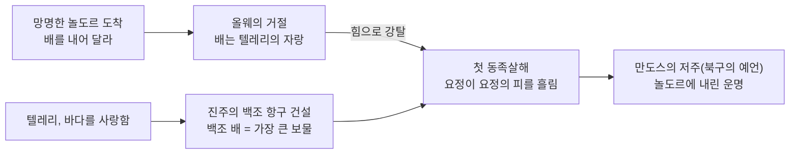

<figure class="post-figure post-figure--header">
<picture>
  <source type="image/webp" srcset="/assets/images/lore/middle-earth-city-alqualonde-640.webp 640w, /assets/images/lore/middle-earth-city-alqualonde-1024.webp 1024w, /assets/images/lore/middle-earth-city-alqualonde-1536.webp 1536w" sizes="(max-width: 800px) 100vw, 760px">
  
</picture>
<figcaption>백조의 항구 <strong>알콸론데</strong> — 진주로 지은 하얀 도시와, 항구 입구를 이룬 거대한 <strong>바위 아치</strong>. 그 아래 금빛 부리의 <strong>백조 배</strong>들이 물 위에 떠 있고, 방파제의 등불이 바다에 어린다. 진주를 두른 이는 텔레리의 왕. <em>(공식 이미지를 옮긴 것이 아니라 콘셉트에 맞춰 새로 생성한 원본 삽화)</em></figcaption>
</figure>

<figure class="post-figure">
<svg role="img" aria-label="알콸론데에서 가장 아름다운 백조 배를 두고 첫 동족살해가 벌어졌음을 좌우로 비교한 개념도. 왼쪽은 평화로운 진주 항구로, 바위 아치 아래 백조 모양 배들이 떠 있고 등불이 밝다. 화살표를 지나 오른쪽은 같은 항구지만, 놀도르가 배를 강탈하며 방파제에 붉은 피가 번지고 배 하나가 끌려 나간다. 요정이 요정의 피를 흘린 첫 사건임을 보여 준다." viewBox="0 0 700 300" xmlns="http://www.w3.org/2000/svg">
  <title>알콸론데 — 가장 아름다운 백조 배를 두고 벌어진 첫 동족살해</title>

  <text x="350" y="22" text-anchor="middle" font-size="11" fill="currentColor" font-weight="700" opacity="0.75">같은 항구, 뒤바뀐 얼굴 — 텔레리의 자랑이 첫 핏자국이 되다</text>

  <!-- BEFORE: peaceful pearl harbor -->
  <rect x="34" y="60" width="256" height="150" rx="5" fill="var(--bg-panel)" stroke="var(--secondary-color)" stroke-width="1.6"/>
  <text x="162" y="80" text-anchor="middle" font-size="9.5" fill="currentColor" font-weight="700">처음 — 백조의 항구</text>
  <!-- rock arch -->
  <path d="M70,170 Q90,110 130,110 Q170,110 190,170" fill="none" stroke="currentColor" stroke-width="2.4" opacity="0.7"/>
  <text x="130" y="104" text-anchor="middle" font-size="6.5" fill="currentColor" opacity="0.7">바위 아치</text>
  <!-- water -->
  <rect x="46" y="172" width="232" height="30" rx="2" fill="var(--bg-light)" opacity="0.7"/>
  <!-- swan ships -->
  <path d="M96,176 q10,-10 20,0 q-4,8 -18,6 z" fill="var(--secondary-color)" opacity="0.4" stroke="var(--secondary-color)" stroke-width="1"/>
  <circle cx="118" cy="170" r="2.2" fill="var(--gold)"/>
  <path d="M150,178 q11,-11 22,0 q-4,9 -20,6 z" fill="var(--secondary-color)" opacity="0.4" stroke="var(--secondary-color)" stroke-width="1"/>
  <circle cx="174" cy="171" r="2.2" fill="var(--gold)"/>
  <text x="215" y="182" text-anchor="middle" font-size="9">🦢</text>
  <!-- lamps -->
  <circle cx="60" cy="150" r="3" fill="var(--gold)" opacity="0.8"/>
  <circle cx="264" cy="150" r="3" fill="var(--gold)" opacity="0.8"/>
  <text x="162" y="200" text-anchor="middle" font-size="6.5" fill="currentColor" opacity="0.8">진주 도시 · 금빛 부리의 백조 배</text>

  <!-- arrow -->
  <line x1="298" y1="135" x2="352" y2="135" stroke="var(--accent-color)" stroke-width="2.6" marker-end="url(#al-arrow)"/>
  <text x="325" y="126" text-anchor="middle" font-size="7" fill="currentColor" opacity="0.85" font-weight="700">놀도르</text>
  <text x="325" y="152" text-anchor="middle" font-size="6.5" fill="currentColor" opacity="0.8">배를 강탈</text>

  <!-- AFTER: kinslaying -->
  <rect x="360" y="60" width="306" height="150" rx="5" fill="var(--bg-light)" stroke="var(--accent-color)" stroke-width="1.8"/>
  <text x="513" y="80" text-anchor="middle" font-size="9.5" fill="currentColor" font-weight="700">그 뒤 — 첫 동족살해</text>
  <!-- same arch -->
  <path d="M396,170 Q416,110 456,110 Q496,110 516,170" fill="none" stroke="currentColor" stroke-width="2.2" opacity="0.55"/>
  <rect x="372" y="172" width="286" height="30" rx="2" fill="var(--bg-panel)" opacity="0.7"/>
  <!-- ship dragged out -->
  <path d="M560,176 q12,-12 24,0 q-4,10 -22,6 z" fill="var(--secondary-color)" opacity="0.35" stroke="var(--secondary-color)" stroke-width="1"/>
  <circle cx="586" cy="169" r="2.2" fill="var(--gold)"/>
  <line x1="558" y1="182" x2="616" y2="182" stroke="var(--accent-color)" stroke-width="1.6" marker-end="url(#al-arrow)"/>
  <text x="600" y="200" text-anchor="middle" font-size="6.5" fill="currentColor" opacity="0.8">배가 끌려 나감</text>
  <!-- blood on the quay -->
  <ellipse cx="440" cy="188" rx="16" ry="6" fill="var(--accent-color)" opacity="0.7"/>
  <ellipse cx="470" cy="193" rx="9" ry="4" fill="var(--accent-color)" opacity="0.55"/>
  <text x="452" y="176" text-anchor="middle" font-size="6.5" fill="currentColor" opacity="0.85" font-weight="700">방파제에 번진 피</text>

  <text x="350" y="240" text-anchor="middle" font-size="9.5" fill="currentColor" opacity="0.85" font-weight="700">요정이 요정의 피를 흘린 첫 사건 — 그 무기는 정복욕이 아니라 '배를 갖겠다'는 마음이었다</text>
  <text x="350" y="262" text-anchor="middle" font-size="8.5" fill="currentColor" opacity="0.7">이 피가 놀도르에게 만도스의 저주(북구의 예언)를 불러온다</text>

  <defs>
    <marker id="al-arrow" markerWidth="8" markerHeight="8" refX="6" refY="4" orient="auto">
      <path d="M0,0 L8,4 L0,8 z" fill="var(--accent-color)"/>
    </marker>
  </defs>
</svg>
<figcaption>이 글의 한 장 요약 — 알콸론데는 <strong>같은 항구의 두 얼굴</strong>이다. 처음엔 바위 아치 아래 <strong>백조 배</strong>가 떠 있는 텔레리의 평화로운 진주 항구였다. 망명을 떠난 <strong>놀도르</strong>가 그 배를 힘으로 빼앗으려 하자, 방파제 위에서 <strong>요정 역사 최초의 동족살해</strong>가 벌어진다. 무기가 된 것은 정복욕이 아니라 '가장 아름다운 것을 갖겠다'는 마음이었고, 이 피가 놀도르에게 <strong>만도스의 저주</strong>를 불러온다.</figcaption>
</figure>

## 소개

앞 편 티리온에서 요정들은 두 나무의 빛을 등지고 망명을 결심했습니다. 이번 **알콸론데(Alqualondë)** 는 그 발걸음이 **곧바로 첫 피를 부른** 현장입니다. 바다를 사랑한 요정 텔레리가 진주로 지은 이 아름다운 항구에서, 요정이 요정의 피를 흘린 **역사상 최초의 동족살해**가 벌어집니다. 그것도 정복이나 증오가 아니라, 오직 **배 몇 척을 갖겠다는 마음** 때문에.

이 글은 `Middle-earth-Lore` 시리즈 **7단계 '주요 도시'** 편에서 아만을 다루는 세 번째 편입니다. 발마르(빛을 값없이 흘려보낸 신들의 도시), 티리온(빛을 향해 세운 요정 도시)에 이어, 알콸론데는 **빛을 등진 발걸음이 첫 피에 이르는** 자리입니다. 이 백조의 항구가 어떤 곳이었고, 그 가장 아름다운 배가 어떻게 첫 동족살해의 이유가 됐는지를 정리합니다.

## 한눈에 보기

알콸론데를 이해하는 열쇠는 **백조 배**입니다 — 위 도표가 보여 주듯, 텔레리가 가진 가장 아름다운 보물이 바로 그 배였고, 첫 동족살해가 벌어진 이유 또한 그 배였습니다. 도시의 자랑이 그대로 도시의 비극이 됩니다.

| 항목 | 내용 |
| --- | --- |
| **이름 뜻** | 알콸론데("Alqualondë", '백조의 항구') |
| **종족·시대** | 바다를 사랑한 요정 **텔레리** · **두 나무의 시대** |
| **위치** | 아만 해안 엘다마르, 티리온 북쪽 바닷가 |
| **랜드마크** | 항구 입구의 거대한 **자연 바위 아치**, 진주로 지은 도시, 방파제의 등불 |
| **다스리는 이** | 텔레리의 왕 **올웨** (도리아스 싱골 왕의 형제) |
| **가장 큰 보물** | **백조 배** — 백조 모양으로 깎아 금빛 부리를 단 하얀 배들 |
| **핵심 사건** | 놀도르의 배 요구 → 올웨의 거절 → **첫 동족살해** → 만도스의 저주 |

## 바다의 요정과 백조의 항구 — 구조

세 요정 갈래 가운데 **텔레리(Teleri)** 는 여정에 가장 늦었고, 바다를 가장 사랑한 이들이었습니다. 이들은 아만 해안에 자리 잡아, 파도와 별빛 곁에서 살았습니다. 발라 중 바다의 권능인 울모와 그의 부하 옷세에게서 배와 바다를 배웠고, 마침내 해안에 자신들의 도시 **알콸론데** — '백조의 항구' — 를 세웠습니다.

이 도시의 인상을 이루는 것들은 이렇습니다.

- **바위 아치** — 항구의 입구는 바다가 오랜 세월 깎아 만든 거대한 **자연 바위 아치**였습니다. 배들은 이 아치를 지나 항구를 드나들었습니다.
- **진주의 도시** — 텔레리는 바다에서 건진 진주와, 놀도르가 선물한 보석으로 도시를 지었습니다. 방파제와 집들이 진주로 빛났고, 밤이면 등불이 물 위에 어렸습니다.
- **백조 배** — 텔레리의 자랑 중 자랑은 그들의 배였습니다. **백조 모양**으로 깎아 부리는 금으로, 눈은 금과 흑옥으로 장식한 하얀 배들이었습니다. 텔레리는 이 배들을 자신들의 모든 작품 중 가장 사랑했습니다.

이 '가장 사랑한 배'가, 곧 이 도시 최대의 비극을 부르는 이유가 됩니다.

## 첫 동족살해 — 배를 두고 흐른 피

<figure class="post-figure">
<picture>
  <source type="image/webp" srcset="/assets/images/lore/middle-earth-city-alqualonde-birdview-640.webp 640w, /assets/images/lore/middle-earth-city-alqualonde-birdview-1024.webp 1024w, /assets/images/lore/middle-earth-city-alqualonde-birdview-1536.webp 1536w" sizes="(max-width: 800px) 100vw, 760px">
  
</picture>
<figcaption><strong>알콸론데 전경</strong> — 만을 따라 굽어 앉은 진주빛 항구. 입구의 거대한 <strong>바위 아치</strong> 아래 <strong>백조 배</strong>들이 떠 있고, 부두를 따라 등불이 물에 어린다. 뒤로는 산맥과 두 나무의 희미한 빛, 앞으로는 별빛 바다. 해도 달도 없는 시대다. <em>(콘셉트에 맞춰 새로 생성한 원본 삽화)</em></figcaption>
</figure>

앞 편에서 본 대로, 티리온을 떠난 **페아노르와 놀도르**는 중간계로 건너가려 했습니다. 그러나 아만과 중간계 사이에는 넓은 바다가 있었고, 그것을 건널 배는 텔레리의 백조 배뿐이었습니다. 놀도르는 알콸론데로 와서 배를 내어 달라고 청합니다.

텔레리의 왕 **올웨**는 거절합니다. 그 배들은 텔레리가 가장 사랑하는 작품이었고, 무엇보다 발라들의 뜻을 거스르는 이 망명에 손을 보태고 싶지 않았기 때문입니다. **"이 배는 우리에게 놀도르의 보석과 같은 것"** 이라며, 그는 순순히 내어 줄 수 없다고 말합니다.

그러자 페아노르의 놀도르는 **힘으로 배를 빼앗으려** 합니다. 텔레리가 부두에서 이를 막아서자, 놀도르는 칼을 뽑아 그들을 베고 배를 강탈합니다. 이것이 **알콸론데의 동족살해(첫 동족살해)** 입니다 — 세계가 생긴 이래 **요정이 요정의 피를 흘린 최초의 사건**. 무장하지 않은 뱃사람이 많던 텔레리 쪽이 크게 스러졌고, 진주의 방파제가 같은 종족의 피로 물들었습니다.

<figure class="post-figure">
<picture>
  <source type="image/webp" srcset="/assets/images/lore/middle-earth-city-alqualonde-kinslaying-640.webp 640w, /assets/images/lore/middle-earth-city-alqualonde-kinslaying-1024.webp 1024w, /assets/images/lore/middle-earth-city-alqualonde-kinslaying-1536.webp 1536w" sizes="(max-width: 800px) 100vw, 760px">
  
</picture>
<figcaption><strong>알콸론데의 동족살해</strong> — 진주로 빛나던 방파제 위, 칼을 뽑은 <strong>놀도르</strong>가 노와 창으로 배를 지키려는 <strong>텔레리</strong> 뱃사람들을 베며 전진한다. 전경에선 <strong>백조 배</strong> 한 척이 밧줄에 끌려 항구 밖으로 강탈되고, 그 금빛 부리가 등불에 번득인다. 두 나무가 죽어 별만 남은 첫 어둠 아래, <strong>요정이 요정의 피를 흘린 최초의 순간</strong> — 무기가 된 것은 미움이 아니라 '가장 아름다운 것을 갖겠다'는 마음이었다. <em>(콘셉트에 맞춰 새로 생성한 원본 삽화)</em></figcaption>
</figure>

이 사건이 놀도르에게 남긴 것은 배 몇 척이 아니라 **지울 수 없는 저주**였습니다. 아만을 떠나는 놀도르 앞에 발라 만도스의 사자가 나타나 **북구의 예언(만도스의 저주)** 을 선포합니다 — 너희가 흘린 동족의 피가 너희를 따라다닐 것이며, 배신과 좌절이 너희 일을 그르치리라는 것. 실제로 제1시대 내내 놀도르의 영광은 늘 이 첫 피의 그림자 아래 놓입니다. 페아노르의 아들들이 훗날 두 번째·세 번째 동족살해를 거듭하는 것도 이 저주의 연장입니다.

한편 이 참극에 몸서리친 일부 놀도르 — 특히 핀아르핀과 그를 따르는 무리 — 는 발걸음을 돌려 아만으로 되돌아갑니다. 같은 도시에서 어떤 이는 피를 흘리고, 어떤 이는 그 피를 보고 돌아선 것입니다.

## 상징과 의미 — 아름다움을 빼앗을 때

알콸론데가 이 세계에서 갖는 의미는, 이 도시가 아만 3부작의 **하강을 완성하는 자리**라는 데 있습니다.

- **빛을 받음 → 등짐 → 피 흘림** — 발마르에서 빛은 값없이 주어졌고, 티리온에서 요정은 그 빛을 등졌으며, 알콸론데에서 마침내 **피를 흘립니다.** 세 도시를 잇달아 보면, 놀도르의 타락이 어떻게 한 걸음씩 깊어졌는지가 또렷합니다. 알콸론데는 그 하강의 밑바닥, 돌이킬 수 없는 선을 넘는 지점입니다.
- **아름다움을 소유하려는 죄** — 이 시리즈가 반복하는 주제가 여기서 가장 날카롭게 드러납니다. 첫 동족살해의 무기는 정복욕이나 증오가 아니라, **'가장 아름다운 것(배)을 갖겠다'는 마음**이었습니다. 실마릴을 향한 페아노르의 집착과 정확히 같은 죄입니다 — 톨킨 세계에서 파멸을 부르는 것은 대개 미움이 아니라 **소유하려는 사랑**입니다.
- **되돌아설 수 있었던 자리** — 핀아르핀이 발걸음을 돌린 것은, 이 참극조차 **선택의 문제**였음을 보여 줍니다. 같은 피를 보고도 누구는 나아가 저주를 짊어졌고 누구는 돌아서 용서를 얻었습니다. 알콸론데는 '어쩔 수 없었다'가 아니라 '그럼에도 그렇게 했다'는 것을 기록하는 도시입니다.

## 결론

알콸론데는 가장 아름다운 것을 두고 첫 피가 흐른 도시입니다. 바다를 사랑한 텔레리가 진주와 백조 배로 지은 이 항구는, 바로 그 배 때문에 요정 역사 최초의 동족살해를 겪습니다. 빛을 값없이 받던 발마르에서 시작해, 그 빛을 등진 티리온을 지나, 알콸론데에서 요정은 같은 종족의 피를 흘리며 돌이킬 수 없는 선을 넘습니다. 이 첫 피가 부른 만도스의 저주는 제1시대 내내 놀도르를 따라다니고, 그들의 모든 영광에 그림자를 드리웁니다.

다음 편에서는 그 저주를 짊어진 채 바다를 건넌 놀도르가, 중간계에 세운 가장 위대하고 가장 비극적인 도시로 갑니다 — 산속에 숨겨진 요정 왕국, 그 함락이 제1시대 최대의 비극으로 기록된 **곤돌린(Gondolin)** 입니다. 빛을 등지고 온 자들이 어둠 속에서 어떤 아름다움을 세웠고, 어떻게 배신으로 무너지는지를 보게 될 것입니다.

### 다음 학습 (Next Learning)

- [투나 언덕의 하얀 도시, 티리온: 빛을 향해 세우고, 빛을 등지고 떠나다](/2026/08/25/middle-earth-city-tirion.html) — 망명이 시작된 도시 (주요 도시 편)
- [종소리의 황금 도시, 발마르: 두 나무의 빛 아래 선 신들의 수도](/2026/08/25/middle-earth-city-valmar.html) — 아만 3부작의 시작 (주요 도시 편)
- [악의 계보와 두 개의 보석: 모르고스에서 사우론으로, 실마릴에서 절대반지로](/2026/08/24/middle-earth-enemy-and-artifacts.html) — 페아노르의 맹세와 저주 (6단계)
- [에워두른 산맥의 숨은 도시, 곤돌린: 완벽한 은신을 무너뜨린 하나의 배신](/2026/08/25/middle-earth-city-gondolin.html) — 산속에 숨겨진 요정 왕국, 제1시대 최대의 비극 (주요 도시 편)
