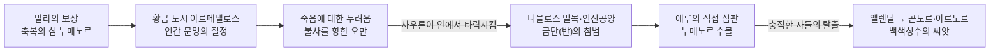

<figure class="post-figure post-figure--header">
<picture>
  <source type="image/webp" srcset="/assets/images/lore/middle-earth-city-armenelos-640.webp 640w, /assets/images/lore/middle-earth-city-armenelos-1024.webp 1024w, /assets/images/lore/middle-earth-city-armenelos-1536.webp 1536w" sizes="(max-width: 800px) 100vw, 760px">
  
</picture>
<figcaption>황금의 도시 <strong>아르메넬로스</strong> — 축복의 섬 <strong>누메노르</strong>의 수도이자 인간 문명의 절정. 성산 <strong>메넬타르마</strong> 앞에 흰 대리석과 금빛 도시가 서고, 왕궁 뜰에는 은빛 <strong>백색성수 니믈로스</strong>가 자란다. 위대한 항해자들의 배가 항구를 메운다. <em>(공식 이미지를 옮긴 것이 아니라 콘셉트에 맞춰 새로 생성한 원본 삽화)</em></figcaption>
</figure>

<figure class="post-figure">
<svg role="img" aria-label="아르메넬로스가 축복받은 인간 도시에서 오만으로 금단을 침범하다 신의 심판으로 수몰되고, 충직한 자들만 백색성수의 씨앗과 함께 동쪽으로 탈출했음을 보여 주는 개념도. 왼쪽에는 금단의 땅 아만과 그 경계(발라의 금지)가 있고, 가운데에는 성산과 백색성수를 품은 황금 섬 누메노르가 있다. 붉은 화살이 섬에서 서쪽 금단의 경계를 넘어 뻗고, 위에서 큰 파도가 섬을 덮어 가라앉힌다. 오른쪽으로는 아홉 척의 배가 백색성수 씨앗을 싣고 동쪽 중간계로 달아난다." viewBox="0 0 700 300" xmlns="http://www.w3.org/2000/svg">
  <title>아르메넬로스 — 죽음을 거부한 오만이 금단을 넘고, 신의 심판이 섬을 삼키다</title>

  <text x="350" y="20" text-anchor="middle" font-size="11" fill="currentColor" font-weight="700" opacity="0.75">가장 축복받은 인간의 도시 — 죽음을 거부한 오만이 신의 심판을 부르다</text>

  <!-- Aman (forbidden west) + the Ban -->
  <rect x="22" y="66" width="70" height="150" fill="var(--secondary-color)" opacity="0.09"/>
  <line x1="97" y1="62" x2="97" y2="218" stroke="var(--secondary-color)" stroke-width="2" stroke-dasharray="4 4"/>
  <text x="57" y="236" text-anchor="middle" font-size="7.5" fill="currentColor" opacity="0.8" font-weight="700">금단의 땅 아만</text>
  <text x="57" y="247" text-anchor="middle" font-size="6.5" fill="currentColor" opacity="0.7">(불사의 땅)</text>

  <!-- sea -->
  <g stroke="var(--secondary-color)" stroke-width="1.3" opacity="0.5" fill="none">
    <path d="M104,214 q14,-6 28,0 t28,0 t28,0 t28,0 t28,0 t28,0 t28,0 t28,0 t28,0 t28,0 t28,0 t28,0 t28,0 t28,0"/>
  </g>

  <!-- Númenor: blessed golden island -->
  <circle cx="252" cy="66" r="13" fill="var(--gold)" opacity="0.3"/>
  <path d="M158,214 Q234,150 310,214 Z" fill="var(--bg-panel)" stroke="currentColor" stroke-width="1.5"/>
  <path d="M216,176 L234,120 L252,176 Z" fill="currentColor" opacity="0.5"/>
  <g fill="var(--bg-light)" stroke="currentColor" stroke-width="0.8" opacity="0.9">
    <rect x="196" y="192" width="8" height="14"/><rect x="208" y="196" width="7" height="10"/>
    <rect x="262" y="194" width="8" height="12"/>
  </g>
  <circle cx="228" cy="196" r="3" fill="var(--gold)"/>
  <text x="234" y="234" text-anchor="middle" font-size="8" fill="currentColor" font-weight="700" opacity="0.9">아르메넬로스 (황금 도시)</text>
  <text x="234" y="245" text-anchor="middle" font-size="6.5" fill="currentColor" opacity="0.75">메넬타르마 · 백색성수</text>

  <!-- pride reaching west, crossing the Ban -->
  <line x1="200" y1="150" x2="100" y2="118" stroke="var(--accent-color)" stroke-width="2.4" stroke-dasharray="5 3" marker-end="url(#ar-out)"/>
  <text x="150" y="98" text-anchor="middle" font-size="7.5" fill="currentColor" font-weight="700" opacity="0.85">불사를 향한 오만</text>
  <text x="150" y="109" text-anchor="middle" font-size="6.5" fill="currentColor" opacity="0.7">금단(반)을 넘다</text>

  <!-- Eru's judgment: the drowning wave -->
  <line x1="330" y1="70" x2="272" y2="168" stroke="var(--accent-color)" stroke-width="3" marker-end="url(#ar-doom)"/>
  <path d="M170,206 q16,-14 32,0 t32,0 t32,0 t32,0" fill="none" stroke="var(--secondary-color)" stroke-width="2.2" opacity="0.85"/>
  <text x="356" y="66" text-anchor="middle" font-size="8" fill="currentColor" font-weight="700" opacity="0.85">에루의 직접 심판</text>
  <text x="356" y="77" text-anchor="middle" font-size="6.5" fill="currentColor" opacity="0.7">섬이 바다에 잠기다</text>

  <!-- escape east: nine ships → Middle-earth with the White Tree seedling -->
  <g stroke="currentColor" stroke-width="1.2" fill="var(--bg-light)" opacity="0.9">
    <path d="M360,206 l16,0 l-3,7 l-10,0 z"/><path d="M392,204 l16,0 l-3,7 l-10,0 z"/><path d="M424,206 l16,0 l-3,7 l-10,0 z"/>
  </g>
  <g stroke="currentColor" stroke-width="1" opacity="0.7">
    <line x1="368" y1="206" x2="368" y2="196"/><line x1="400" y1="204" x2="400" y2="194"/><line x1="432" y1="206" x2="432" y2="196"/>
  </g>
  <line x1="448" y1="202" x2="520" y2="200" stroke="currentColor" stroke-width="1.6" opacity="0.6" marker-end="url(#ar-ship)"/>
  <path d="M528,214 Q556,188 584,214 Z" fill="var(--bg-panel)" stroke="currentColor" stroke-width="1.3"/>
  <circle cx="556" cy="192" r="3.4" fill="var(--gold)"/>
  <path d="M556,192 L556,182" stroke="var(--gold)" stroke-width="1.4"/>
  <text x="470" y="232" text-anchor="middle" font-size="7.5" fill="currentColor" font-weight="700" opacity="0.85">충직한 자들 → 곤도르·아르노르</text>
  <text x="470" y="243" text-anchor="middle" font-size="6.5" fill="currentColor" opacity="0.7">(백색성수 니믈로스의 씨앗)</text>

  <text x="350" y="290" text-anchor="middle" font-size="7.5" fill="currentColor" opacity="0.7">가장 높이 오른 인간의 도시가, 죽음을 받아들이지 못해 가장 깊이 가라앉았다</text>

  <defs>
    <marker id="ar-out" markerWidth="8" markerHeight="8" refX="6" refY="4" orient="auto"><path d="M0,0 L8,4 L0,8 z" fill="var(--accent-color)"/></marker>
    <marker id="ar-doom" markerWidth="8" markerHeight="8" refX="6" refY="4" orient="auto"><path d="M0,0 L8,4 L0,8 z" fill="var(--accent-color)"/></marker>
    <marker id="ar-ship" markerWidth="7" markerHeight="7" refX="5" refY="3.5" orient="auto"><path d="M0,0 L7,3.5 L0,7 z" fill="currentColor"/></marker>
  </defs>
</svg>
<figcaption>이 글의 한 장 요약 — 아르메넬로스는 발라가 인간에게 상으로 준 <strong>축복의 섬</strong> 누메노르의 황금 수도, 인간 문명의 절정이었다. 그러나 <strong>죽음을 거부하는 오만</strong>에 사로잡혀 사우론에게 안에서 타락하고, 마침내 불사를 빼앗으려 <strong>금단의 경계(반)</strong>를 넘어 아만으로 함대를 몰았다. 그 순간 <strong>에루의 직접 심판</strong>이 내려 섬 전체가 바다에 잠겼고, 오직 <strong>충직한 자들</strong>만이 백색성수의 씨앗을 싣고 동쪽 중간계로 탈출해 훗날의 곤도르·아르노르를 세운다.</figcaption>
</figure>

## 소개

앞 편 앙반드에서 모르고스가 무너지고 제1시대가 끝났습니다. 이제 무대는 **제2시대**로 넘어갑니다. 이번 **아르메넬로스(Armenelos)** 는 그 새 시대의 문을 여는 도시 — 모르고스에 맞서 싸운 인간들에게 발라가 상으로 준 축복의 섬 **누메노르**의 수도입니다.

이 글은 `Middle-earth-Lore` 시리즈 **7단계 '주요 도시'** 편에서 **제2시대**를 다루는 첫 편입니다. 이 황금 도시가 어떻게 인간 문명의 절정에 올랐는지, 왜 그 절정이 **죽음을 거부하는 오만**으로 기울었는지, 그리고 그 오만이 어떻게 사우론의 타락과 신의 심판을 거쳐 **바다 밑으로 사라졌는지**를 정리합니다. 그리고 그 폐허에서 살아남은 한 줄기가 어떻게 앞서 본 곤도르로 이어지는지도 함께 봅니다.

## 한눈에 보기

아르메넬로스를 이해하는 열쇠는 **축복과 오만**입니다 — 위 도표가 보여 주듯, 이 도시는 인간이 오를 수 있는 가장 높은 문명의 정점이었습니다. 그러나 죽음을 받아들이지 못한 오만이 금단의 경계를 넘게 하고, 그 침범이 신의 직접 심판을 불러 섬을 통째로 수몰시킵니다. 앙반드가 밖에서 세계의 권능에 부서졌다면, 아르메넬로스는 **안에서 타락한 뒤 스스로 금단을 넘어** 심판을 자초했습니다.

| 항목 | 내용 |
| --- | --- |
| **이름 뜻** | 아르메넬로스("Armenelos", '왕들의 도시' · 황금의 아르메넬로스) |
| **종족·시대** | 누메노르인(에다인의 후손) · **제2시대** 축복의 섬 누메노르 |
| **위치** | 섬 한복판 성산 **메넬타르마** 기슭, 왕들의 수도 |
| **특징** | 인간 문명의 절정, 위대한 항해자들 / 왕궁 뜰의 **백색성수 니믈로스** / 성산 메넬타르마에서 에루 경배 |
| **핵심 갈등** | 죽음(인간의 선물)에 대한 두려움 → 불사를 향한 오만, **왕의 사람들 vs 충직한 자들** |
| **핵심 사건** | 사우론의 볼모 위장 → 안에서 타락(니믈로스 벌목·인신공양) → 아르파라존의 아만 침공(**반**을 깸) → 에루의 심판, **누메노르 수몰(아칼라베스)** |
| **남은 것** | 엘렌딜과 충직한 자들의 탈출 → **곤도르·아르노르** 건국, 백색성수의 씨앗 |

## 축복의 섬, 황금의 도시 — 아르메넬로스

제1시대가 끝나고, 발라들은 모르고스에 맞서 끝까지 싸운 인간들 — **에다인** — 에게 상을 내립니다. 바다 가운데 새로 별 모양의 섬을 솟아 올려 **누메노르**라 이름하고, 그들을 그리로 이주시킨 것입니다. 누메노르인은 여느 인간보다 훨씬 오래 살고, 키가 크며, 지혜롭고, 무엇보다 뛰어난 **항해자**가 되었습니다.

그 섬의 한복판, 성산 **메넬타르마** 기슭에 세운 수도가 **아르메넬로스**, '왕들의 도시'이자 '황금의 아르메넬로스'입니다. 이 도시는 인간이 이룰 수 있는 문명의 **절정**을 상징합니다.

- **메넬타르마('하늘 기둥')** — 섬 중앙의 거대한 성산. 그 정상에서 누메노르인은 유일신 **에루 일루바타르**를 경배했습니다. 신전도 조각상도 없이, 오직 침묵과 경외로 드리는 예배였습니다.
- **백색성수 니믈로스** — 왕궁 안뜰에는 은빛으로 빛나는 한 그루 백색성수 **니믈로스**가 자랐습니다. 이 나무는 앞서 티리온에서 본 백색성수 **갈라실리온**의 후손 — 곧 발리노르 두 나무의 혈통을 잇는 나무였습니다. 축복받은 빛의 기억이 인간의 도시에까지 이어진 상징입니다.
- **위대한 항해자들** — 아르메넬로스의 항구에는 높은 돛의 배들이 늘어섰고, 누메노르인은 중간계 곳곳으로 항해해 그곳의 인간들에게 문명을 전하는 스승 같은 존재가 됩니다.

축복받은 땅, 긴 수명, 뛰어난 재능 — 누메노르인은 인간이면서도 거의 요정에 가까운 삶을 누렸습니다. 그러나 딱 하나, 그들에게 허락되지 않은 것이 있었습니다.

## 죽음이라는 선물, 그리고 오만 — 반(反)의 그늘

<figure class="post-figure">
<picture>
  <source type="image/webp" srcset="/assets/images/lore/middle-earth-city-armenelos-birdview-640.webp 640w, /assets/images/lore/middle-earth-city-armenelos-birdview-1024.webp 1024w, /assets/images/lore/middle-earth-city-armenelos-birdview-1536.webp 1536w" sizes="(max-width: 800px) 100vw, 760px">
  
</picture>
<figcaption><strong>누메노르 전경</strong> — 바다 한복판의 다섯 갈래 별 모양 섬, 그 중앙에 성산 <strong>메넬타르마</strong>가 솟고 기슭에 황금 도시 <strong>아르메넬로스</strong>가 자리한다. 서쪽 수평선 너머로 어렴풋이 빛나는 것이 <strong>닿을 수 없는 불사의 땅</strong> — 누메노르인이 결코 항해해서는 안 될 금단의 경계다. <em>(콘셉트에 맞춰 새로 생성한 원본 삽화)</em></figcaption>
</figure>

누메노르인에게 허락되지 않은 것은 **불사(不死)** 였습니다. 그들은 여느 인간보다 오래 살았지만, 끝내는 죽는 **필멸의 존재**였습니다. 톨킨 세계에서 죽음은 저주가 아니라 에루가 인간에게만 준 **선물** — 세계의 굴레를 벗어나는 자유 — 입니다. 그러나 누메노르인은 점차 이 선물을 저주로 여기게 됩니다.

여기에 하나의 금기가 겹칩니다. 발라들은 누메노르인에게 서쪽 **불사의 땅 아만으로는 항해하지 말라**는 단 하나의 금지 — **발라의 금지(반)** — 를 두었습니다. 눈앞에 불사의 땅을 두고도 그리로 갈 수 없다는 이 경계가, 죽음에 대한 두려움과 맞물려 점점 큰 원망으로 자랍니다.

- **죽음에 대한 원망** — 누메노르가 강성해지고 부유해질수록, 사람들은 요정의 불사를 시기하고 자신의 죽음을 못 견뎌 했습니다. 그들은 더 오래 살기를, 끝내는 죽지 않기를 갈망했습니다.
- **두 갈래로 갈라진 백성** — 이 원망 속에 백성은 둘로 나뉩니다. 반과 발라를 원망하며 힘을 좇는 **왕의 사람들**과, 여전히 발라에 충직하고 요정과 벗하며 죽음을 선물로 받아들이는 **충직한 자들(엘렌딜리)**.

가장 축복받은 인간들이, 바로 그 축복의 유일한 한계 — 죽음 — 앞에서 오만해진 것입니다. 이 균열이 도시를 안에서부터 무너뜨릴 틈이 됩니다.

## 안에서 무너뜨린 자 — 사우론과 니믈로스

그 틈으로 파고든 것이 **사우론**입니다. 모르고스의 첫 부관이었던 그는 제2시대 중간계에서 세력을 키우다, 누메노르의 마지막 왕 **아르파라존**의 압도적인 함대 앞에 스스로 볼모를 자처하며 아르메넬로스로 들어옵니다. 그리고 이 도시 안에서, 앙반드를 밖에서 부순 그 어떤 군대보다 효과적으로 누메노르를 무너뜨립니다 — **안에서, 말과 유혹으로.**

<figure class="post-figure">
<picture>
  <source type="image/webp" srcset="/assets/images/lore/middle-earth-city-armenelos-sauron-640.webp 640w, /assets/images/lore/middle-earth-city-armenelos-sauron-1024.webp 1024w, /assets/images/lore/middle-earth-city-armenelos-sauron-1536.webp 1536w" sizes="(max-width: 800px) 100vw, 760px">
  
</picture>
<figcaption><strong>① 사우론의 간계</strong> — 볼모를 자처하고 들어와 왕의 최고 고문이 된 <strong>사우론</strong>이, 죽음을 두려워하는 <strong>아르파라존</strong>에게 불사의 거짓을 속삭인다. 제단에는 왕궁 뜰에서 베어 낸 백색성수 <strong>니믈로스</strong>가 땔감으로 타오른다 — 축복을 스스로 불사르는 타락의 한복판. <em>(공식 이미지를 옮긴 것이 아니라 콘셉트에 맞춰 새로 생성한 원본 삽화)</em></figcaption>
</figure>

사우론은 왕의 총애를 얻어 최고 고문이 되고, 죽음에 대한 누메노르인의 두려움을 파고들어 그들을 타락시킵니다.

- **어둠의 경배** — 사우론은 에루가 아니라 어둠(모르고스)을 섬기게 하고, 아르메넬로스에 거대한 신전을 세워 **산 사람을 제물로 태우는** 인신공양을 벌입니다. 그 제물이 된 것은 주로 끝까지 신앙을 지킨 **충직한 자들**이었습니다.
- **백색성수의 벌목** — 사우론은 왕을 부추겨 왕궁 뜰의 백색성수 **니믈로스**를 베어 신전 제단의 땔감으로 삼게 합니다. 축복의 상징을 스스로 불태운 것입니다. 그러나 나무가 베이기 직전, 충직한 자 **이실두르**가 목숨을 걸고 잠입해 니믈로스의 **열매 하나를 몰래 따냅니다.** 이 한 알의 씨앗이 훗날의 모든 것을 바꿉니다.

메넬타르마의 침묵의 경배가 인신공양의 불길로 바뀌고, 백색성수가 제단에서 타오르는 동안, 아르메넬로스는 겉으로는 그 어느 때보다 강성했지만 속은 이미 썩어 있었습니다. **가장 견고한 도시를 무너뜨리는 것은 언제나 안에서 자라는 마음**이라는 이 시리즈의 교훈이, 여기서는 사우론이라는 유혹자를 통해 반복됩니다.

## 하늘을 침범한 함대 — 아칼라베스

사우론의 타락은 마침내 최후의 오만으로 치닫습니다. 그는 아르파라존에게 속삭입니다 — *불사는 저 서쪽 땅에 있다. 아만을 차지하면 죽지 않으리라.* 죽음을 못 견딘 왕은 이 유혹에 넘어가, 인간으로서 넘어서는 안 될 단 하나의 경계를 넘기로 합니다.

<figure class="post-figure">
<picture>
  <source type="image/webp" srcset="/assets/images/lore/middle-earth-city-armenelos-armada-640.webp 640w, /assets/images/lore/middle-earth-city-armenelos-armada-1024.webp 1024w, /assets/images/lore/middle-earth-city-armenelos-armada-1536.webp 1536w" sizes="(max-width: 800px) 100vw, 760px">
  
</picture>
<figcaption><strong>② 금단을 깨는 대함대</strong> — 죽음을 못 견딘 <strong>아르파라존</strong>이 불사를 빼앗으려 역사상 최대의 함대를 일으켜, 서쪽 불사의 땅 <strong>아만</strong>으로 진군한다. 인간이 결코 넘어서는 안 될 <strong>발라의 금지(반)</strong>를 힘으로 넘는 순간이다. <em>(공식 이미지를 옮긴 것이 아니라 콘셉트에 맞춰 새로 생성한 원본 삽화)</em></figcaption>
</figure>

아르파라존은 역사상 최대의 함대를 일으켜, **발라의 금지를 깨고 불사의 땅 아만으로 진군**합니다. 불사를 빼앗기 위해 신들에게 전쟁을 걸러 간 것입니다. 그리고 그의 발이 금단의 해안에 닿는 순간 —

- **에루의 직접 심판** — 이번에는 발라가 아니라 유일신 **에루 일루바타르**가 직접 개입합니다. 세계가 바뀌고, 불사의 땅 아만은 세계의 굴레 밖으로 들려 나가 인간의 배로는 영영 닿을 수 없게 되며, 세계는 둥글게 변합니다.
- **누메노르의 수몰** — 그리고 축복의 섬 누메노르는 거대한 파도와 함께 **통째로 바다 밑으로 가라앉습니다.** 아르메넬로스도, 메넬타르마도, 왕과 그 함대도 모두 물속으로 사라집니다. 이 대재앙이 **아칼라베스('가라앉은 땅')** 입니다.

가장 높이 오른 인간의 도시가, 죽음을 받아들이지 못한 오만 때문에 가장 깊이 가라앉았습니다. 앙반드가 밖에서 온 세계의 권능에 부서졌다면, 아르메넬로스는 스스로 금단을 넘어 **신의 심판을 자초하며** 잠긴 것입니다.

<figure class="post-figure">
<picture>
  <source type="image/webp" srcset="/assets/images/lore/middle-earth-city-armenelos-akallabeth-640.webp 640w, /assets/images/lore/middle-earth-city-armenelos-akallabeth-1024.webp 1024w, /assets/images/lore/middle-earth-city-armenelos-akallabeth-1536.webp 1536w" sizes="(max-width: 800px) 100vw, 760px">
  
</picture>
<figcaption><strong>③ 아칼라베스 — 수몰의 대파도</strong>. 에루의 심판이 내려, 산더미 같은 파도가 성산 <strong>메넬타르마</strong>와 황금 도시 <strong>아르메넬로스</strong>를 통째로 삼킨다. 그 대재앙 속에서 오직 <strong>엘렌딜</strong>의 아홉 척만이 <strong>백색성수의 묘목</strong>을 싣고 동쪽 중간계로 달아난다 — 파멸을 건너간 한 줌의 희망. <em>(공식 이미지를 옮긴 것이 아니라 콘셉트에 맞춰 새로 생성한 원본 삽화)</em></figcaption>
</figure>

## 살아남은 씨앗 — 엘렌딜과 곤도르

그러나 이 수몰에도 한 줄기가 살아남습니다. 재앙을 예감한 **충직한 자들**은, 그 지도자 **엘렌딜**과 두 아들 **이실두르·아나리온**을 따라 아홉 척의 배에 오릅니다. 그들은 이실두르가 구해 낸 **백색성수의 씨앗**, 그리고 먼 곳을 보는 돌 **팔란티르**를 싣고, 폭풍에 실려 동쪽 **중간계**로 밀려갑니다.

그 생존자들이 중간계에 세운 나라가 바로 앞서 우리가 본 **곤도르**와 **아르노르**입니다. 이실두르가 구한 씨앗은 자라 **곤도르의 백색성수**가 되어, 미나스 티리스의 왕궁 뜰에 서게 됩니다. 티리온의 갈라실리온 → 누메노르의 니믈로스 → 곤도르의 백색성수로 이어지는 그 은빛 나무의 계보가, 수몰의 잿더미를 건너 이렇게 살아남은 것입니다.

즉 아르메넬로스의 멸망은 끝이 아니라, 제3시대 인간 왕국의 **씨앗**이 됩니다. 가장 축복받은 도시가 오만으로 잠겼지만, 그 안의 충직한 소수가 건져 낸 한 알의 씨앗이 다음 시대의 희망으로 이어진 것입니다.

## 상징과 의미 — 죽음을 받아들이지 못한 문명

아르메넬로스가 이 세계에서 갖는 의미는, 이 도시가 **인간의 오만과 그 한계**를 가장 크게 그린다는 데 있습니다.

- **죽음은 저주가 아니라 선물** — 누메노르의 비극은 죽음을 **선물이 아니라 저주로 오해한** 데서 시작됩니다. 유한함을 받아들이지 못한 문명이, 불사를 움켜쥐려다 스스로를 파괴합니다. 톨킨이 인간에 대해 던지는 가장 근본적인 질문 — 유한함을 어떻게 받아들일 것인가 — 이 이 도시의 운명에 담겨 있습니다.
- **경계를 넘는 오만** — 아르메넬로스의 최후는 **주어진 자리를 넘어서려는** 오만이 부른 것입니다. 발라의 금지는 벌이 아니라 인간의 분수를 지키게 하는 경계였고, 그것을 힘으로 넘으려 한 순간 심판이 내렸습니다. 나르고스론드의 자만이 도시 하나를 무너뜨렸다면, 누메노르의 오만은 **섬 하나와 세계의 지도**를 바꿨습니다.
- **살아남는 것은 충직한 소수** — 그럼에도 이야기는 순수한 절망으로 끝나지 않습니다. 오만한 다수가 잠기는 동안, 신앙을 지킨 소수가 씨앗을 건져 다음 시대를 엽니다. 곤돌린에서 에아렌딜이 살아남았듯, 누메노르에서는 엘렌딜이 살아남습니다. **파멸 속에서 건져 올린 한 줌이 미래가 된다**는 이 시리즈의 리듬이 여기서도 되풀이됩니다.

## 결론

아르메넬로스는 인간이 오른 가장 높은 문명의 절정이자, 죽음을 받아들이지 못한 오만으로 가장 깊이 가라앉은 도시입니다. 성산의 경배와 백색성수의 축복을 누리던 이 황금 도시는, 사우론에게 안에서 타락하고 금단의 경계를 넘어 신의 심판을 자초하며 바다 밑으로 사라졌습니다. 그러나 그 수몰의 물결을 건너, 충직한 자들이 건져 낸 백색성수의 씨앗 한 알이 동쪽 중간계에서 곤도르로 자라납니다. 가장 큰 오만의 폐허에서 가장 질긴 희망이 이어진 것 — 아르메넬로스는 그 두 얼굴을 함께 남기며 제2시대의 문을 엽니다.

다음 편에서는 같은 제2시대, 인간의 바다 왕국과 대비되는 또 하나의 절정 — 산속 깊이 파 내려간 드워프 문명의 정점이자, 너무 깊이 판 탐욕이 깨운 어둠으로 무너진 지하 대도시 **크하잣둠(모리아)** 을 봅니다.

### 다음 학습 (Next Learning)

- [경비의 탑, 미나스 티리스: 일곱 겹의 흰 도시](/2026/08/25/middle-earth-city-minas-tirith.html) — 살아남은 씨앗이 세운 곤도르의 수도 (주요 도시 편)
- [쇠의 감옥, 앙반드: 밖으로 공포를 내뿜은 반(反)도시](/2026/08/25/middle-earth-city-angband.html) — 밖에서 부서진 악의 요새와의 대비 (주요 도시 편)
- [투나 언덕의 하얀 도시, 티리온: 빛을 향해 세우고, 빛을 등지고 떠나다](/2026/08/25/middle-earth-city-tirion.html) — 백색성수 계보의 시작 갈라실리온 (주요 도시 편)
- **크하잣둠 / 모리아(Khazad-dûm)** — 중간계 최대의 드워프 지하도시, 발로그와 두린의 재앙 *(주요 도시 편, 작성 예정)*
