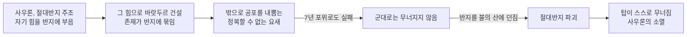

<figure class="post-figure post-figure--header">
<picture>
  <source type="image/webp" srcset="/assets/images/lore/middle-earth-city-barad-dur-640.webp 640w, /assets/images/lore/middle-earth-city-barad-dur-1024.webp 1024w, /assets/images/lore/middle-earth-city-barad-dur-1536.webp 1536w" sizes="(max-width: 800px) 100vw, 760px">
  
</picture>
<figcaption>모르도르의 어둠의 탑 <strong>바랏두르</strong> — 검은 쇠와 흑요석으로 하늘을 찌르며 솟은, 사우론이 세운 중간계 최대의 요새. 첨탑 꼭대기에는 눈꺼풀 없는 <strong>사우론의 눈</strong>이 불타며 사방을 감시하고, 뒤로는 불의 산 <strong>오로드루인</strong>이 이글거린다. 그러나 이 거대한 탑의 진짜 뿌리는 돌이 아니라, 저 산불 속에서 벼려진 <strong>절대반지</strong>에 묶여 있다. <em>(공식 이미지를 옮긴 것이 아니라 콘셉트에 맞춰 새로 생성한 원본 삽화)</em></figcaption>
</figure>

<figure class="post-figure">
<svg role="img" aria-label="바랏두르가 절대반지의 힘으로 세워져 그 존재가 반지에 묶여 있으며, 어떤 군대의 포위로도 무너지지 않다가 반지가 불에 녹는 순간 스스로 무너졌음을 보여 주는 개념도. 왼쪽에는 붉은 눈을 인 거대한 어둠의 탑이 있고, 그 토대는 아래의 절대반지에 사슬로 묶여 있다. 탑을 향해 몰려든 군대는 성벽 앞에서 막힌다. 오른쪽에는 불의 산이 있고, 작은 손 하나가 반지를 불 속에 던진다. 반지가 부서지는 순간 붉은 균열이 사슬을 타고 탑으로 번져 탑이 무너져 내린다." viewBox="0 0 700 320" xmlns="http://www.w3.org/2000/svg">
  <title>바랏두르 — 반지에 존재를 묶은 탑, 군대로 무너지지 않고 반지가 부서지자 스스로 무너지다</title>

  <text x="350" y="20" text-anchor="middle" font-size="11" fill="currentColor" font-weight="700" opacity="0.75">반지에 존재를 묶은 요새 — 포위로 무너지지 않고, 심장이 부서지자 스스로 무너지다</text>

  <!-- The Dark Tower (left) -->
  <g stroke="currentColor" fill="var(--bg-panel)" stroke-width="1.5">
    <rect x="150" y="70" width="60" height="150"/>
    <rect x="140" y="120" width="80" height="12"/>
    <rect x="136" y="170" width="88" height="14"/>
    <path d="M150,70 L180,44 L210,70 Z" fill="currentColor" opacity="0.6"/>
  </g>
  <!-- the lidless Eye atop -->
  <ellipse cx="180" cy="60" rx="12" ry="7" fill="var(--accent-color)"/>
  <ellipse cx="180" cy="60" rx="4" ry="7" fill="currentColor"/>
  <text x="180" y="34" text-anchor="middle" font-size="7.5" fill="currentColor" font-weight="700" opacity="0.85">사우론의 눈</text>
  <text x="180" y="236" text-anchor="middle" font-size="8" fill="currentColor" font-weight="700" opacity="0.9">어둠의 탑 바랏두르</text>

  <!-- the Eye's searching beam, projected outward -->
  <line x1="192" y1="60" x2="300" y2="52" stroke="var(--accent-color)" stroke-width="1.6" opacity="0.55" stroke-dasharray="3 3" marker-end="url(#bd-eye)"/>
  <text x="268" y="44" text-anchor="middle" font-size="6.5" fill="currentColor" opacity="0.7">사방을 감시하는 시선</text>

  <!-- army besieging, blocked at the wall -->
  <g fill="currentColor" opacity="0.55">
    <rect x="70" y="200" width="6" height="12"/><rect x="80" y="204" width="6" height="8"/><rect x="90" y="200" width="6" height="12"/><rect x="100" y="204" width="6" height="8"/>
  </g>
  <line x1="112" y1="206" x2="132" y2="206" stroke="var(--secondary-color)" stroke-width="2" marker-end="url(#bd-block)"/>
  <line x1="126" y1="196" x2="140" y2="216" stroke="var(--accent-color)" stroke-width="2.4"/>
  <line x1="140" y1="196" x2="126" y2="216" stroke="var(--accent-color)" stroke-width="2.4"/>
  <text x="92" y="228" text-anchor="middle" font-size="7" fill="currentColor" font-weight="700" opacity="0.8">최후의 동맹</text>
  <text x="92" y="238" text-anchor="middle" font-size="6.5" fill="currentColor" opacity="0.65">7년 포위로도 못 무너뜨림</text>

  <!-- the binding: tower's foundation chained to the One Ring -->
  <path d="M180,220 C 200,258 300,262 360,250" fill="none" stroke="var(--gold)" stroke-width="2" stroke-dasharray="2 3" opacity="0.85"/>
  <text x="272" y="278" text-anchor="middle" font-size="7.5" fill="currentColor" font-weight="700" opacity="0.85">탑의 존재가 반지에 묶여 있다</text>

  <!-- Mount Doom (right) + the Ring cast into fire -->
  <path d="M470,236 L540,120 L610,236 Z" fill="var(--secondary-color)" opacity="0.16"/>
  <path d="M470,236 L540,120 L610,236" fill="none" stroke="currentColor" stroke-width="1.5" opacity="0.6"/>
  <path d="M516,166 q10,20 24,0 q10,18 -2,34 q-14,10 -26,-2 q-8,-16 4,-32 z" fill="var(--accent-color)" opacity="0.85"/>
  <text x="540" y="250" text-anchor="middle" font-size="8" fill="currentColor" font-weight="700" opacity="0.9">불의 산 오로드루인</text>
  <!-- the Ring -->
  <circle cx="392" cy="248" r="7" fill="none" stroke="var(--gold)" stroke-width="3"/>
  <line x1="400" y1="244" x2="512" y2="196" stroke="currentColor" stroke-width="1.4" opacity="0.6" stroke-dasharray="4 3" marker-end="url(#bd-cast)"/>
  <text x="392" y="270" text-anchor="middle" font-size="7" fill="currentColor" font-weight="700" opacity="0.8">절대반지</text>
  <text x="452" y="188" text-anchor="middle" font-size="6.5" fill="currentColor" opacity="0.7">작은 손이 불 속에 던지다</text>

  <!-- the Ring unmade → red cracks race back to the tower → collapse -->
  <path d="M520,200 L440,214 L300,236 L210,214 L188,196" fill="none" stroke="var(--accent-color)" stroke-width="2" opacity="0.9" marker-end="url(#bd-crack)"/>
  <g stroke="var(--accent-color)" stroke-width="1.6" opacity="0.8">
    <line x1="158" y1="120" x2="146" y2="150"/><line x1="206" y1="150" x2="220" y2="176"/><line x1="170" y1="180" x2="158" y2="208"/>
  </g>
  <text x="350" y="300" text-anchor="middle" font-size="7.5" fill="currentColor" opacity="0.7">가장 큰 군대가 못한 일을, 반지를 없앤 가장 작은 손이 이루다</text>

  <defs>
    <marker id="bd-eye" markerWidth="7" markerHeight="7" refX="5" refY="3.5" orient="auto"><path d="M0,0 L7,3.5 L0,7 z" fill="var(--accent-color)"/></marker>
    <marker id="bd-block" markerWidth="7" markerHeight="7" refX="5" refY="3.5" orient="auto"><path d="M0,0 L7,3.5 L0,7 z" fill="var(--secondary-color)"/></marker>
    <marker id="bd-cast" markerWidth="7" markerHeight="7" refX="5" refY="3.5" orient="auto"><path d="M0,0 L7,3.5 L0,7 z" fill="currentColor"/></marker>
    <marker id="bd-crack" markerWidth="8" markerHeight="8" refX="6" refY="4" orient="auto"><path d="M0,0 L8,4 L0,8 z" fill="var(--accent-color)"/></marker>
  </defs>
</svg>
<figcaption>이 글의 한 장 요약 — 바랏두르는 사우론이 <strong>절대반지</strong>의 힘을 부어 세운 어둠의 탑으로, 그 <strong>존재 자체가 반지에 묶여</strong> 있었다. 그래서 최후의 동맹조차 <strong>7년의 포위</strong>로 이 탑을 무너뜨리지 못했다. 탑을 끝낸 것은 대군이 아니라, 반지 하나를 <strong>불의 산</strong>에 던져 없앤 가장 작은 손 — 심장이 부서지는 순간, 탑은 스스로 무너져 내렸다.</figcaption>
</figure>

## 소개

앞 편 크하잣둠에서, 드워프 문명이 스스로 파 내려간 깊이 속에서 무너지는 것을 보았습니다. 이제 이 세계의 모든 도시와 정반대편에 선 곳으로 시선을 옮깁니다 — 악의 심장부, `Middle-earth-Lore` 시리즈 **7단계 '주요 도시'** 편의 어둠의 탑 **바랏두르(Barad-dûr)** 입니다.

바랏두르는 앞서 본 앙반드의 후계입니다. 최초의 어둠의 군주 모르고스가 앙반드에서 밖으로 공포를 내뿜었다면, 그의 부관이었던 **사우론**은 제2시대에 모르도르에서 같은 일을 반복합니다 — 다만 이번에는 하나의 결정적 차이를 안고서. 이 글은 사우론이 어떻게 **절대반지의 힘을 부어** 이 탑을 세웠는지, 왜 그 탑이 어떤 군대의 포위로도 무너지지 않았는지, 그리고 왜 결국 **가장 작은 손**에 의해 스스로 무너졌는지를 정리하며, 앙반드에서 시작된 반(反)도시의 계보를 완성합니다.

## 한눈에 보기

바랏두르를 이해하는 열쇠는 **반지에 묶인 존재**입니다 — 위 도표가 보여 주듯, 이 탑의 힘과 약점은 같은 곳에서 나옵니다. 사우론은 자기 힘의 대부분을 절대반지에 부어 넣었고, 그 반지의 힘으로 탑을 세웠습니다. 그래서 탑은 군대로 무너지지 않지만, 반지가 사라지면 함께 사라집니다. 앙반드가 밖에서 온 신들의 권능에 부서졌다면, 바랏두르는 **자기 존재를 걸어 둔 사물**이 없어질 때 무너집니다.

| 항목 | 내용 |
| --- | --- |
| **이름 뜻** | 바랏두르("Barad-dûr", 신다린 '어둠의 탑') · 검은 말로 **루그부르즈** |
| **종족·시대** | 사우론(마이아, 모르고스의 부관) · **제2시대**에 건설, 제3시대에 재건 |
| **위치** | 모르도르, 잿빛 고원 고르고로스 — 불의 산 **오로드루인** 곁 |
| **특징** | 중간계 최대의 요새, 검은 쇠와 흑요석의 거탑 / 첨탑의 **사우론의 눈** / 절대반지의 힘으로 세운 토대 |
| **핵심 갈등** | 밖으로 힘을 내뿜는 정복의 요새 vs 자유민 / **군대로는 무너지지 않는 탑**을 어떻게 끝낼 것인가 |
| **핵심 사건** | 제2시대 건설 → 최후의 동맹의 7년 포위, 반지가 잘리며 1차 함락 → 제3시대 재건 → **반지 파괴와 함께 완전한 붕괴** |
| **남은 것** | 반지전쟁의 종막, 제3시대의 끝 — 그리고 사우론의 영원한 소멸 |

## 어둠의 탑 — 바랏두르

제1시대가 끝나고 모르고스가 세계 밖으로 추방된 뒤, 그의 가장 강력한 부관이었던 **사우론**이 어둠의 계보를 이어받습니다. 사우론은 제2시대에 화산 지대 **모르도르**를 자기 왕국으로 삼고, 잿빛 고원 고르고로스, 불의 산 **오로드루인** 곁에 거대한 요새를 세웁니다. 그것이 **바랏두르** — 신다린으로 '어둠의 탑', 오르크의 검은 말로는 **루그부르즈**라 불린 곳입니다.

이 탑은 규모와 위용 모두에서 중간계 최대의 요새였습니다.

- **하늘을 찌르는 검은 거탑** — 바랏두르는 검은 쇠와 흑요석을 쌓아 올린, 층층의 성벽과 뾰족한 첨탑으로 이루어진 거대한 탑이었습니다. 잿빛 황무지 위로 아득히 솟아, 모르도르 어디에서나 보이는 공포의 상징이었습니다.
- **사우론의 눈** — 탑의 꼭대기에는 눈꺼풀 없이 불타는 **사우론의 눈**이 자리해, 사방을 감시했습니다. 앙반드가 상고로드림의 봉우리로 하늘을 눌렀다면, 바랏두르는 이 붉은 눈으로 온 세계를 노려보았습니다.
- **밖으로 내뿜는 요새** — 앙반드가 그랬듯, 바랏두르 역시 안으로 무언가를 지키는 도시가 아니라 **밖으로 군대와 공포를 쏟아내는** 정복의 심장부였습니다. 오르크와 트롤의 군세가 이 탑에서 쏟아져 나와 중간계를 위협했습니다.

여기까지는 앙반드의 반복입니다. 그러나 사우론은 스승 모르고스가 하지 않은 한 가지를 했습니다 — 자기 힘의 대부분을 **하나의 반지**에 부어 넣고, 그 반지로 이 탑을 세운 것입니다.

## 반지로 세운 탑 — 존재를 건 요새

<figure class="post-figure">
<picture>
  <source type="image/webp" srcset="/assets/images/lore/middle-earth-city-barad-dur-birdview-640.webp 640w, /assets/images/lore/middle-earth-city-barad-dur-birdview-1024.webp 1024w, /assets/images/lore/middle-earth-city-barad-dur-birdview-1536.webp 1536w" sizes="(max-width: 800px) 100vw, 760px">
  
</picture>
<figcaption><strong>모르도르 전경</strong> — 사방을 검은 산맥으로 두른 잿빛 고원 고르고로스 한복판에, 여러 겹의 성벽에 둘러싸인 <strong>바랏두르</strong>가 솟아 붉은 눈으로 온 땅을 노려본다. 바로 곁에는 불의 산 <strong>오로드루인</strong>이 용암을 흘린다 — 탑과 산이 이토록 가까운 것은 우연이 아니다. 탑의 힘이 벼려진 반지가, 오직 저 산불에서만 다시 녹을 수 있기 때문이다. <em>(콘셉트에 맞춰 새로 생성한 원본 삽화)</em></figcaption>
</figure>

바랏두르가 앞선 모든 요새와 결정적으로 다른 점은, 그 토대가 돌이 아니라 **절대반지**에 놓여 있었다는 것입니다. 사우론은 제2시대에 불의 산에서 **절대반지(the One Ring)** 를 벼리며, 자기 힘과 의지의 대부분을 그 반지에 부어 넣었습니다. 그리고 바로 그 반지의 힘으로 바랏두르의 토대를 쌓았습니다.

- **존재가 반지에 묶이다** — 이 탑은 단순히 반지의 힘으로 '지어진' 것이 아니라, 그 존재 자체가 반지에 **묶여** 있었습니다. 반지가 있는 한 탑은 무너지지 않고, 사우론이 쓰러져도 반지만 남으면 그는 다시 일어설 수 있었습니다. 힘을 사물에 걸어 둔 대가로, 그는 그 사물과 운명을 함께하게 된 것입니다.
- **정복할 수 없는 요새** — 그래서 바랏두르는 물리적으로 무너뜨릴 수 없는 요새가 되었습니다. 성벽을 아무리 부수어도, 반지가 온전한 한 탑의 뿌리는 상하지 않았습니다. 이것이 이 탑을 이 세계에서 가장 끝내기 어려운 요새로 만들었습니다.

사우론은 자기 힘을 밖으로 꺼내 반지에 담음으로써 엄청난 지배력을 얻었지만, 동시에 치명적인 급소 하나를 세상에 내놓은 셈이었습니다. 탑의 무적(無敵)과 탑의 유일한 약점이, 똑같이 그 반지 하나에 걸려 있었습니다.

## 군대로 무너지지 않는 탑 — 최후의 동맹

이 탑의 성질이 처음 드러난 것이 제2시대 말의 **최후의 동맹** 전쟁입니다. 사우론의 폭정에 맞서 요정과 인간이 손을 잡고(요정 왕 길갈라드와 누메노르의 후예 엘렌딜), 모르도르로 쳐들어가 바랏두르를 포위했습니다.

- **7년의 포위** — 이 포위는 무려 **7년** 동안 이어졌습니다. 세계 최강의 연합군이 7년을 들이붓고도, 반지가 사우론의 손에 있는 한 탑을 무너뜨리지 못한 것입니다. 성벽 앞에서 대군이 번번이 막히는 이 장면이, 바랏두르가 어떤 요새인지를 그대로 보여 줍니다.
- **반지가 잘리다** — 전쟁은 결국 사우론이 직접 나서고, 엘렌딜과 길갈라드가 그와 맞서다 스러진 끝에, 엘렌딜의 아들 **이실두르**가 부러진 검으로 사우론의 손가락에서 **반지를 잘라 내면서** 판가름 납니다. 반지를 잃은 사우론의 형체는 무너지고, 그제서야 바랏두르도 함께 허물어졌습니다.

<figure class="post-figure">
<picture>
  <source type="image/webp" srcset="/assets/images/lore/middle-earth-city-barad-dur-last-alliance-640.webp 640w, /assets/images/lore/middle-earth-city-barad-dur-last-alliance-1024.webp 1024w, /assets/images/lore/middle-earth-city-barad-dur-last-alliance-1536.webp 1536w" sizes="(max-width: 800px) 100vw, 760px">
  
</picture>
<figcaption><strong>제2시대 — 최후의 동맹</strong>. 요정과 인간의 대군이 7년간 탑을 포위했지만 무너뜨리지 못했다. 판가름을 낸 것은 대군이 아니라 단 한 번의 손짓 — 무릎 꿇은 <strong>이실두르</strong>가 부러진 검 <strong>나르실</strong>의 조각으로 사우론의 손에서 <strong>절대반지</strong>를 잘라 내는 순간이었다. 이때 반지를 없애지 않은 것이, 훗날의 모든 비극을 남긴다. <em>(콘셉트에 맞춰 새로 생성한 원본 삽화)</em></figcaption>
</figure>

그러나 이때 반지는 파괴되지 않았습니다. 이실두르가 반지를 불의 산에 던져 없애는 대신 자기가 가지려 했기 때문입니다. 반지가 세상에 남아 있는 한 사우론은 완전히 죽은 것이 아니었고, 바랏두르의 뿌리도 완전히 뽑히지 않았습니다. 반지는 이실두르를 배신하고 사라졌다가 오랜 세월을 떠돌아, 훗날 호빗 **빌보**의 손에, 다시 **프로도**의 손에 들어갑니다.

## 심장을 없애야 무너지는 탑 — 반지전쟁

제3시대, 사우론은 힘을 되찾아 모르도르로 돌아오고 **바랏두르를 다시 세웁니다.** 반지가 아직 세상에 있었기에 재건이 가능했습니다. 다시 붉은 눈이 첨탑에 켜지고, 탑은 예전처럼 정복할 수 없는 요새로 돌아옵니다. 이것이 반지의 제왕의 무대입니다.

자유민들은 이 탑을 어떻게 끝낼지를 두고, 앞선 최후의 동맹이 증명한 교훈과 마주합니다 — **군대로는 이 탑을 무너뜨릴 수 없다.** 그래서 그들은 정반대의 전략을 택합니다. 대군으로 성벽을 치는 대신, 단 두 호빗을 적의 심장부로 몰래 들여보내 **반지 자체를 불의 산에 없애기로** 한 것입니다.

- **불가능에 가까운 길** — 반지는 오직 그것이 벼려진 곳, 불의 산 **오로드루인**의 불에서만 녹일 수 있었습니다. 즉 반지를 없애려면 바랏두르의 바로 코앞, 사우론의 눈 아래까지 걸어 들어가야 했습니다. 프로도와 샘의 여정이 그토록 절망적인 이유가 여기에 있습니다.
- **탑의 붕괴** — 마침내 반지가 불의 산 불길 속으로 떨어져 **파괴되는 순간**, 그 반지에 묶여 있던 모든 것이 함께 끝납니다. 사우론은 영영 소멸하고, 그의 눈은 꺼지며, **바랏두르는 스스로 무너져 내립니다.** 7년의 포위가 하지 못한 일을, 반지를 없앤 그 한순간이 이룬 것입니다.

<figure class="post-figure">
<picture>
  <source type="image/webp" srcset="/assets/images/lore/middle-earth-city-barad-dur-downfall-640.webp 640w, /assets/images/lore/middle-earth-city-barad-dur-downfall-1024.webp 1024w, /assets/images/lore/middle-earth-city-barad-dur-downfall-1536.webp 1536w" sizes="(max-width: 800px) 100vw, 760px">
  
</picture>
<figcaption><strong>제3시대 — 반지전쟁의 종막</strong>. 검은 성문 앞의 서부 연합군은 승산 없는 <strong>양동작전</strong>으로 사우론의 눈을 끌었을 뿐, 탑을 부순 것은 그들이 아니다. 불의 산 불길 속으로 <strong>절대반지</strong>가 떨어져 파괴되는 순간, 그 심장에 묶여 있던 <strong>바랏두르</strong>가 붉은 눈이 터지며 스스로 무너져 내린다 — 군대가 못한 일을 이룬, 반지를 없앤 한순간. <em>(콘셉트에 맞춰 새로 생성한 원본 삽화)</em></figcaption>
</figure>

가장 정복하기 어려운 요새를 무너뜨린 것은 가장 큰 군대가 아니라, 그 요새가 존재를 걸어 둔 사물을 없앤 **가장 작은 손**이었습니다. 앙반드가 밖에서 온 신들의 권능에 부서졌다면, 바랏두르는 그 심장을 없앰으로써 안에서부터 끝났습니다.

## 상징과 의미 — 존재를 사물에 건 악

바랏두르가 이 세계에서 갖는 의미는, 이 탑이 **자기 힘을 밖으로 꺼내 사물에 건 악의 운명**을 가장 선명하게 그린다는 데 있습니다.

- **지배의 힘이 곧 급소다** — 사우론은 세계를 지배하려고 자기 힘을 반지에 부었지만, 바로 그 때문에 세상에 단 하나의 급소를 내놓았습니다. 힘을 손에서 놓아 사물에 담는 순간, 그 사물이 그의 심장이자 그의 약점이 됩니다. 소유와 지배를 향한 욕망이 스스로를 파멸의 문턱에 세운다는 이 시리즈의 주제가, 여기서는 **탑과 반지**라는 가장 큰 규모로 반복됩니다.
- **반(反)도시의 완성** — 이 시리즈의 도시들은 대개 안에 무언가를 품고 지켰습니다. 앙반드와 바랏두르만이 밖으로 힘을 내뿜는 반(反)도시였습니다. 그중 앙반드는 세계의 권능이 밖에서 부수었고, 바랏두르는 그 심장인 사물을 없애야 무너졌습니다 — 악의 요새를 끝내는 두 방식이, 이 두 탑으로 완성됩니다.
- **가장 작은 손이 끝낸다** — 그럼에도 이 이야기의 결론은 힘의 대결이 아닙니다. 7년의 대군이 못한 일을, 반지를 짊어진 두 호빗이 해냅니다. 곤돌린에서 에아렌딜이, 누메노르에서 엘렌딜이 살아남아 다음을 열었듯, 세계를 끝내 구한 것은 **가장 크지 않은 자들**이었습니다. 이 시리즈가 도시마다 되풀이해 온 리듬이, 이 어둠의 탑 앞에서 가장 크게 울립니다.

## 결론

바랏두르는 사우론이 절대반지의 힘을 부어 세운 어둠의 탑이자, 그 존재를 하나의 사물에 건 대가로 무적이면서 동시에 치명적인 급소를 지닌 요새였습니다. 검은 쇠의 거탑과 불타는 눈으로 온 세계를 노려보던 이 탑은, 최후의 동맹의 7년 포위로도 무너지지 않았습니다. 그러나 그 심장인 반지가 불의 산에서 녹아 없어지는 순간, 탑은 스스로 무너지고 사우론은 영영 소멸했습니다. 밖에서 부서진 앙반드와 짝을 이루어, 바랏두르는 자기 심장을 없애야 끝나는 악의 요새로서 이 세계의 반(反)도시를 완성합니다.

그렇다면 이 어둠의 탑에 맞선 편에는 무엇이 있었을까요. 다음 편에서는 사우론이 이 탑을 세우던 바로 그 **제2시대**에, 그 어둠에 맞서 세워진 정반대편의 도시로 시선을 옮깁니다 — 안개산맥 기슭의 숨은 골짜기, 엘론드가 세운 **리븐델(임라드리스)** 입니다. 힘을 밖으로 내뿜어 지배하려 한 탑에서, 반지의 힘을 안으로 거두어 보존한 은신처로 눈을 옮기면, 같은 시대의 정반대편에 선 두 얼굴이 나란히 드러납니다.

### 다음 학습 (Next Learning)

- [깊은 골짜기의 은신처, 리븐델(임라드리스): 지배의 탑에 맞선 보존과 의논의 집](/2026/08/25/middle-earth-city-rivendell.html) — **다음 편**, 같은 제2시대에 이 탑에 맞서 세워진 정반대편의 도시 (주요 도시 편)
- [쇠의 감옥, 앙반드: 밖으로 공포를 내뿜은 반(反)도시](/2026/08/25/middle-earth-city-angband.html) — 밖에서 부서진 악의 요새, 바랏두르의 원형 (주요 도시 편, 제1시대)
- [산을 꿰뚫은 지하 대국, 크하잣둠(모리아): 미스릴의 부가 세우고, 너무 판 탐욕이 깨운 어둠](/2026/08/25/middle-earth-city-khazad-dum.html) — 같은 제2시대의 지하 대국 (주요 도시 편)
- [악의 계보와 두 개의 보석: 모르고스에서 사우론으로, 실마릴에서 절대반지로](/2026/08/24/middle-earth-enemy-and-artifacts.html) — 사우론과 절대반지의 큰 그림 (6단계 악의 계보·핵심 사물)
- [중간계 세계관 정복 로드맵: 톨킨의 레젠다리움 한눈에 보기](/2026/08/24/middle-earth-lore-roadmap.html) — 이 시리즈의 마스터 로드맵
