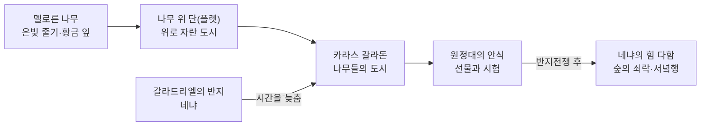

<figure class="post-figure post-figure--header">
<picture>
  <source type="image/webp" srcset="/assets/images/lore/middle-earth-city-caras-galadhon-640.webp 640w, /assets/images/lore/middle-earth-city-caras-galadhon-1024.webp 1024w, /assets/images/lore/middle-earth-city-caras-galadhon-1536.webp 1536w" sizes="(max-width: 800px) 100vw, 760px">
  
</picture>
<figcaption>밤의 <strong>카라스 갈라돈</strong> — 은빛 줄기와 황금 잎의 거대한 나무(멜로른) 위로 <strong>나무 위 단(플렛)</strong>들이 층층이 걸리고, 흰 등불과 별빛이 숲을 밝힌다. 높은 단 위 흰 옷의 엘프 여인이 은빛 반지 <strong>네냐</strong>를 낀 채 숲을 지킨다. <em>(공식 이미지를 옮긴 것이 아니라 콘셉트에 맞춰 새로 생성한 원본 삽화)</em></figcaption>
</figure>

<figure class="post-figure">
<svg role="img" aria-label="로슬로리엔이 나무를 베지 않고 나무 위로 올라가는 수직 도시임을 보여 주는 단면 개념도. 가운데에 은빛 줄기와 황금 잎을 가진 거대한 나무 한 그루가 서 있고, 줄기를 따라 아래에서 위로 세 개의 나무 위 단(플렛)이 걸려 있다. 맨 아래는 숲 바닥의 성문, 가운데는 주민들의 단, 가장 높은 곳에는 갈라드리엘과 켈레보른의 단이 있고 그 위에 은빛 반지 네냐가 빛나며 도시 전체를 시간의 흐름에서 지킨다. 왼쪽에는 대비로 땅 위에 지은 보통 도시가 낮게 그려져 있다." viewBox="0 0 700 340" xmlns="http://www.w3.org/2000/svg">
  <title>로슬로리엔 — 나무를 베지 않고 나무 위로 올라간 수직 도시 (네냐가 시간을 멈춰 지킨다)</title>

  <text x="350" y="24" text-anchor="middle" font-size="11" fill="currentColor" font-weight="700" opacity="0.75">남들은 땅을 파고 돌을 쌓았지만 — 로슬로리엔은 살아 있는 나무 위로 올라갔다</text>

  <!-- ground line -->
  <line x1="40" y1="300" x2="660" y2="300" stroke="currentColor" stroke-width="1.4" opacity="0.5"/>
  <text x="60" y="314" text-anchor="middle" font-size="7.5" fill="currentColor" opacity="0.7">숲 바닥</text>

  <!-- LEFT: ordinary ground-built city (contrast) -->
  <rect x="70" y="262" width="26" height="38" rx="1.5" fill="var(--bg-light)" stroke="currentColor" stroke-width="1" opacity="0.6"/>
  <rect x="102" y="250" width="26" height="50" rx="1.5" fill="var(--bg-light)" stroke="currentColor" stroke-width="1" opacity="0.6"/>
  <text x="100" y="240" text-anchor="middle" font-size="7.5" fill="currentColor" opacity="0.7">보통 도시</text>
  <text x="100" y="332" text-anchor="middle" font-size="6.5" fill="currentColor" opacity="0.6">땅 위에 · 돌을 쌓아</text>

  <!-- CENTER: the mallorn tree, silver trunk -->
  <rect x="382" y="90" width="18" height="210" rx="3" fill="var(--bg-panel)" stroke="var(--secondary-color)" stroke-width="2"/>
  <!-- golden canopy -->
  <ellipse cx="391" cy="86" rx="120" ry="52" fill="var(--gold)" opacity="0.20" stroke="var(--gold)" stroke-width="1.6"/>
  <ellipse cx="391" cy="82" rx="82" ry="34" fill="var(--gold)" opacity="0.28"/>
  <text x="391" y="60" text-anchor="middle" font-size="8.5" fill="currentColor" font-weight="700" opacity="0.9">멜로른 — 은빛 줄기·황금 잎</text>

  <!-- flet 1 (bottom): gate -->
  <rect x="352" y="258" width="80" height="9" rx="2" fill="var(--bg-light)" stroke="currentColor" stroke-width="1.2"/>
  <text x="470" y="266" text-anchor="start" font-size="7.5" fill="currentColor" opacity="0.85">① 숲 바닥의 흰 성문</text>

  <!-- flet 2 (middle): dwellings -->
  <rect x="346" y="196" width="92" height="10" rx="2" fill="var(--bg-panel)" stroke="var(--gold)" stroke-width="1.4"/>
  <circle cx="360" cy="191" r="3.4" fill="var(--gold)" opacity="0.9"/>
  <circle cx="422" cy="191" r="3.4" fill="var(--gold)" opacity="0.9"/>
  <text x="470" y="204" text-anchor="start" font-size="7.5" fill="currentColor" opacity="0.85">② 주민들의 나무 위 단(플렛)</text>

  <!-- flet 3 (top): Galadriel & Celeborn -->
  <rect x="356" y="132" width="72" height="10" rx="2" fill="var(--bg-panel)" stroke="var(--accent-color)" stroke-width="1.8"/>
  <text x="470" y="140" text-anchor="start" font-size="7.5" fill="currentColor" opacity="0.85">③ 갈라드리엘·켈레보른의 단</text>

  <!-- Nenya ring above, preserving time -->
  <circle cx="391" cy="104" r="12" fill="none" stroke="var(--gold)" stroke-width="2.4"/>
  <circle cx="391" cy="104" r="12" fill="none" stroke="currentColor" stroke-width="0.6" opacity="0.5"/>
  <text x="391" y="122" text-anchor="middle" font-size="7" fill="currentColor" font-weight="700" opacity="0.9">네냐</text>

  <!-- spiral stair hint -->
  <path d="M382,258 Q374,232 391,206 Q408,180 382,154 Q368,146 391,142" fill="none" stroke="currentColor" stroke-width="1" opacity="0.4" stroke-dasharray="3 3"/>

  <!-- up arrow: the city grows UPWARD -->
  <line x1="300" y1="300" x2="300" y2="120" stroke="var(--secondary-color)" stroke-width="2.2" marker-end="url(#lo-up)"/>
  <text x="300" y="112" text-anchor="middle" font-size="7.5" fill="currentColor" opacity="0.85" font-weight="700">도시가 위로 자란다</text>

  <text x="350" y="330" text-anchor="middle" font-size="9.5" fill="currentColor" opacity="0.85" font-weight="700">나무를 베어 화로를 지은 아이센가드의 정반대 — 나무를 살려 그 위에 도시를 얹고, 반지로 시간을 멈춰 지켰다</text>

  <defs>
    <marker id="lo-up" markerWidth="8" markerHeight="8" refX="4" refY="6" orient="auto">
      <path d="M0,8 L4,0 L8,8 z" fill="var(--secondary-color)"/>
    </marker>
  </defs>
</svg>
<figcaption>이 글의 한 장 요약 — 로슬로리엔은 <strong>수직으로 자란 도시</strong>다. 거대한 나무 <strong>멜로른</strong>의 은빛 줄기를 따라 나무 위 단(<strong>플렛/탈란</strong>)이 층층이 걸리고, 가장 높은 곳에 갈라드리엘과 켈레보른의 단이 있다. 그 위에서 갈라드리엘의 반지 <strong>네냐</strong>가 시간의 흐름을 늦춰 숲을 늙지 않게 지킨다. 앞 편 아이센가드가 나무를 <em>베어</em> 화로를 지었다면, 이곳은 나무를 <em>살려</em> 그 위에 도시를 얹었다.</figcaption>
</figure>

## 소개

앞 편의 아이센가드가 살아 있는 나무를 모조리 베어 **화로와 갱도**를 지은 도시였다면, 이번 **로슬로리엔(Lothlórien)** 은 그 정반대편에 있는 도시입니다. 이곳 사람들은 나무를 베지 않았습니다. 대신 **거대한 나무 위로 올라가** 그 가지 사이에 집과 계단과 궁정을 지었습니다. 나무를 자원으로 본 사루만과, 나무를 집으로 삼은 엘프 — 톨킨이 그린 문명의 양 극단이 이렇게 나란히 놓입니다.

이 글은 `Middle-earth-Lore` 시리즈 **7단계 '주요 도시'** 편의 하나로, 로슬로리엔과 그 심장부인 나무 위의 도시 **카라스 갈라돈(Caras Galadhon)** 을 봅니다. 은빛 줄기에 황금 잎을 단 나무 **멜로른(mallorn)**, 그 위에 걸린 나무 단 **플렛(flet)**, 그리고 이 숲을 시간의 흐름에서 지켜 낸 갈라드리엘의 반지 **네냐(Nenya)** 가 어떤 것인지, 그리고 반지전쟁 뒤 이 마지막 황금 숲이 어떻게 저물어 가는지를 정리합니다.

## 한눈에 보기

로슬로리엔을 이해하는 열쇠는 **'위로 자란 도시'** 와 **'멈춘 시간'** 두 가지입니다 — 위 도표가 보여 주듯, 도시는 땅이 아니라 나무 위로 층층이 올라가고, 그 꼭대기에서 반지 하나가 세월을 늦춰 숲을 늙지 않게 지킵니다.

| 항목 | 내용 |
| --- | --- |
| **이름 뜻** | 로슬로리엔("Lothlórien", 꿈꾸는 꽃의 땅) · 카라스 갈라돈("나무들의 도시") |
| **종족·시대** | 실바 엘프(갈라드림) · 제2~3시대, 반지전쟁기까지 |
| **위치** | 안개산맥 동편, 은빛 강 켈레브란트와 아두이 강 사이의 숲 |
| **다스리는 이** | **갈라드리엘**과 **켈레보른** — 놀도르 최고령의 여왕과 신다르 영주 |
| **구조** | 거대한 나무 **멜로른** 위에 지은 나무 단(플렛) 도시, 지상이 아닌 수직 도시 |
| **핵심 사물** | 갈라드리엘의 반지 **네냐**(물의 반지) — 시간·쇠락을 늦춰 숲을 보존 |
| **핵심 사건** | 원정대의 안식·시험 → 갈라드리엘의 반지 시험 → 반지전쟁 후 숲의 쇠락과 갈라드리엘의 서녘행 |

## 황금 숲과 나무 위의 도시 — 구조

로슬로리엔은 안개산맥 동쪽 기슭, 두 강 사이에 자리한 숲입니다. 이 숲을 특별하게 만드는 것은 나무 자체입니다 — **멜로른(mallorn)** 이라 불리는 이 거대한 나무는 **은빛 매끈한 줄기**에 **황금빛 잎**을 답니다. 잎은 가을에도 지지 않고 겨우내 금빛으로 매달렸다가 봄에야 떨어지므로, 숲은 사철 황금빛입니다. 그래서 '황금 숲(Golden Wood)'이라 불립니다.

이 숲에 사는 **실바 엘프(갈라드림, "나무의 사람들")** 는 땅 위에 성벽을 쌓는 대신 **나무 위로 올라가** 살았습니다. 가지가 뻗은 높은 곳에 나무 단을 매어 그 위에 집을 짓는데, 이 단을 **플렛(flet)** 또는 엘프어로 **탈란(talan)** 이라 부릅니다. 원정대가 로슬로리엔에 들어와 처음 하룻밤을 보낸 곳도 이런 플렛 위였습니다.

그 심장부가 **카라스 갈라돈** — 이름 그대로 '나무들의 도시'입니다.

<figure class="post-figure">
<picture>
  <source type="image/webp" srcset="/assets/images/lore/middle-earth-city-caras-galadhon-birdview-640.webp 640w, /assets/images/lore/middle-earth-city-caras-galadhon-birdview-1024.webp 1024w, /assets/images/lore/middle-earth-city-caras-galadhon-birdview-1536.webp 1536w" sizes="(max-width: 800px) 100vw, 760px">
  
</picture>
<figcaption><strong>카라스 갈라돈 전경</strong> — 초록 언덕 하나를 통째로 뒤덮은 <strong>멜로른 숲</strong>이 곧 도시다. 나무마다 나선 계단과 <strong>플렛</strong>이 층층이 걸리고, 가장 높은 나무 위에 <strong>갈라드리엘과 켈레보른의 흰 단</strong>이 있다. 언덕을 두른 흰 성벽과 초록 해자, 하나의 성문, 그리고 숲 밖을 흐르는 은빛 강이 보인다. <em>(콘셉트에 맞춰 새로 생성한 원본 삽화)</em></figcaption>
</figure>

카라스 갈라돈은 하나의 **초록 언덕**을 거대한 멜로른 숲이 통째로 뒤덮은 곳입니다. 도시로 들어가려면 언덕을 두른 흰 성벽의 문을 지나, 나무 줄기를 감아 오르는 나선 계단을 타고 위로 올라가야 합니다. 위로 오를수록 플렛이 층층이 나타나고, 가장 높은 나무 위에 이 도시를 다스리는 두 사람 — **갈라드리엘과 켈레보른** — 의 궁정이 있습니다. 밤이면 나무마다 걸린 흰 등불과 잎 사이로 쏟아지는 별빛에 숲 전체가 은은히 빛납니다.

## 시간이 멈춘 땅 — 갈라드리엘과 네냐

로슬로리엔이 단순히 '예쁜 엘프 숲'이 아니라 세계관에서 특별한 위치를 갖는 이유는 이곳을 다스리는 **갈라드리엘(Galadriel)** 때문입니다. 그는 제1시대에 발리노르에서 태어나 중간계로 건너온 **놀도르 최고령의 여왕**으로, 반지전쟁기에 중간계에 남은 가장 강력한 엘프 중 하나였습니다.

그가 지닌 것이 **세 엘프 반지 중 하나인 네냐(Nenya), 물의 반지**입니다. 사우론이 손대지 못한 이 반지의 힘으로, 갈라드리엘은 로슬로리엔에서 **시간의 흐름과 쇠락 자체를 늦췄습니다.** 바깥 세계가 늙고 시들어 가는 동안, 이 숲만은 늙지 않는 황금빛으로 보존됩니다. 원정대가 이곳에 들어와 느낀 '시간이 멈춘 듯한' 감각은 비유가 아니라 실제로 네냐가 만든 것입니다.

이 숲에서 벌어지는 가장 유명한 장면이 **갈라드리엘의 시험**입니다. 프로도가 절대반지를 그에게 건네려 하자, 갈라드리엘은 잠시 그 반지로 자신이 무엇이 될 수 있는지를 봅니다 — "어둠의 여왕! 밤처럼 아름답고 무서운" 존재. 그러나 그는 그 유혹을 물리치고 **"나는 시험을 통과했다. 나는 작아지고, 서녘으로 떠나 갈라드리엘로 남겠다"** 고 말합니다. 힘을 가질 기회를 스스로 내려놓는 이 장면은, 반지의 제왕 전체에서 절대반지를 거부한 몇 안 되는 결정적 순간입니다.

## 원정대의 안식 — 선물과 갈림길

로슬로리엔은 원정대에게 **모리아에서 간달프를 잃은 직후의 피난처**였습니다. 상실에 빠진 이들이 이 숲에서 잠시 쉬며 상처를 추스릅니다. 떠날 때 갈라드리엘은 각자에게 선물을 주는데, 이 선물들이 뒷이야기에서 요긴한 역할을 합니다.

- **엘프 망토와 렘바스** — 몸을 숨겨 주는 회색 엘프 망토와, 오래 버티게 하는 여행 식량 렘바스.
- **갈라드리엘의 유리병** — 프로도에게 준, 별빛을 담은 유리병. 훗날 키리스 웅골의 어둠 속에서 거미 쉴로브를 물리치는 빛이 됩니다.
- **세 가닥 머리카락** — 오래 그를 미워했던 드워프 김리가 도리어 그의 아름다움에 감복해 청하자, 갈라드리엘은 자신의 머리카락 세 가닥을 줍니다. 엘프와 드워프의 오랜 반목을 넘어서는 상징적 장면입니다.

이렇게 로슬로리엔은 이야기의 **쉼표**이자 **분기점**입니다. 여기서 원정대는 마지막으로 한자리에 모여 쉬고, 곧이어 강을 따라 내려가다 보로미르의 죽음과 함께 뿔뿔이 흩어집니다.

## 상징과 의미 — 지키려 할수록 저무는 아름다움

로슬로리엔이 이 세계에서 갖는 의미는 **'사라져 가는 것'** 이라는 톨킨 세계의 정서와 곧장 이어집니다.

- **아이센가드의 정반대** — 사루만이 나무를 베어 기계를 만들었다면, 갈라드림은 나무를 살려 그 위에 도시를 얹었습니다. **찍어 내는 문명 대 자라나는 문명** — 앞 편 아이센가드와 나란히 놓으면 이 대비가 가장 선명합니다.
- **멈춘 시간의 대가** — 네냐가 지킨 '늙지 않는 아름다움'은 절대반지에 매인 힘이었습니다. 프로도가 반지를 파괴하면 사우론이 무너지는 동시에 **세 엘프 반지의 힘도 함께 스러집니다.** 즉 로슬로리엔의 황금빛을 지키려면 사우론을 못 이기고, 사우론을 이기려면 이 숲의 아름다움도 저물어야 합니다. 갈라드리엘은 그 사실을 알면서 승리를 택합니다.
- **저무는 엘프의 시대** — 반지전쟁이 끝나자 네냐의 힘은 다하고, 갈라드리엘은 마침내 그토록 오래 떠나지 못했던 서녘(발리노르)로 배를 타고 떠납니다. 로슬로리엔의 쇠락은 곧 **엘프의 시대가 끝나고 인간의 시대(제4시대)가 열림**을 뜻합니다. 세계에서 가장 아름다운 것이, 세계가 나아지기 위해 스스로 사라지는 것 — 이것이 이 숲이 남기는 마지막 정서입니다.

## 결론

카라스 갈라돈은 나무를 베지 않고 그 위로 올라간 도시, 반지 하나로 시간을 멈춰 지킨 황금 숲입니다. 아이센가드가 '자라나는 것을 아끼지 않는 마음'의 극단이었다면, 로슬로리엔은 그 정반대편 — **자라나는 것 위에 얹혀 그것과 함께 사는 문명**의 극단입니다. 그러나 그 아름다움조차 절대반지에 매인 힘이었기에, 세계를 구하는 승리는 동시에 이 숲의 저묾을 뜻했습니다. 지키려 할수록 저물 수밖에 없는 아름다움 — 톨킨이 그린 엘프의 시대는 그렇게 황금빛으로 물러갑니다.

다음 편에서는 로슬로리엔과 같은 '숲 곁의 산중 왕국'이면서도 성격은 정반대인 드워프의 도시 — 나무가 아니라 **산 그 자체를 파고 들어가** 지은 외로운 산의 왕국 **에레보르(Erebor)** 를 봅니다. 황금 숲에서 황금이 쌓인 산으로, 두 종족의 '황금'이 얼마나 다른지 잇달아 보게 될 것입니다.

### 다음 학습 (Next Learning)

- [쇠의 고리, 아이센가드: 마음이 금속과 바퀴가 될 때](/2026/08/25/middle-earth-city-isengard.html) — 나무를 벤 정반대의 도시 (주요 도시 편)
- [불멸과 필멸 사이: 엘프·인간·드워프·호빗, 그리고 오르크의 기원](/2026/08/24/middle-earth-races.html) — 갈라드리엘과 엘프의 운명 (4단계)
- [악의 계보와 두 개의 보석: 모르고스에서 사우론으로, 실마릴에서 절대반지로](/2026/08/24/middle-earth-enemy-and-artifacts.html) — 절대반지와 세 엘프 반지 (6단계)
- **에레보르(외로운 산)** — 산을 파고 들어간 드워프의 산중 왕국 *(주요 도시 편, 작성 예정)*
