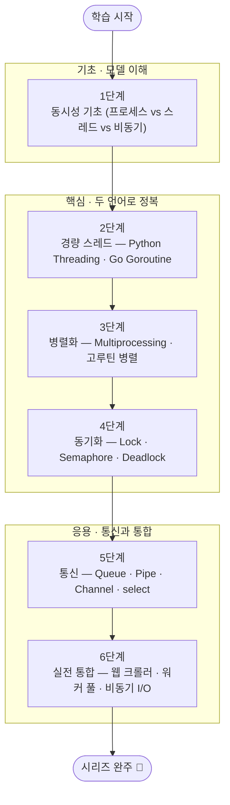

<figure class="post-figure post-figure--header">
<svg role="img" aria-label="Python과 Go를 짝지어 오르는 동시성 학습 여정 그림. 왼쪽 아래 출발점에서 시작해, 동시성 기초, 경량 스레드(Threading/Goroutine), 병렬화(Multiprocessing), 동기화, 통신(Queue/Channel)을 차례로 거쳐 맨 오른쪽 위 실전 통합 프로젝트 깃발에 도달한다. 등반 도중 파이썬 환형 뱀(두 개의 물결)과 Go의 Gopher 마스코트가 서로 대칭을 이루며 각 계단에 함께 새겨져, 두 언어를 짝지어 배운다는 점을 나타낸다." viewBox="0 0 680 300" xmlns="http://www.w3.org/2000/svg">
  <title>Concurrency Essential — Python과 Go를 짝지어 오르는 6단계 동시성 학습 여정</title>

  <!-- ascending guide path (dashed climb) -->
  <polyline points="60,240 176,204 292,166 408,128 524,92 596,64" fill="none" stroke="currentColor" stroke-width="2" stroke-dasharray="5 6" opacity="0.4"/>

  <!-- ===== Station 1: 동시성 기초 ===== -->
  <rect x="30" y="218" width="96" height="46" rx="4" fill="var(--bg-light)" stroke="var(--accent-color)" stroke-width="2.5"/>
  <text x="78" y="238" text-anchor="middle" font-size="11" fill="currentColor" font-weight="700">동시성 기초</text>
  <text x="78" y="253" text-anchor="middle" font-size="8" fill="currentColor" opacity="0.8">프로세스 · 스레드 · 비동기</text>
  <text x="78" y="206" text-anchor="middle" font-size="9" fill="currentColor" opacity="0.6" font-weight="700">1</text>
  <line x1="126" y1="226" x2="158" y2="210" stroke="var(--secondary-color)" stroke-width="2" marker-end="url(#cc-arrow)"/>

  <!-- ===== Station 2: Threading · Goroutine ===== -->
  <rect x="166" y="182" width="96" height="46" rx="4" fill="var(--bg-light)" stroke="currentColor" stroke-width="1.8"/>
  <text x="214" y="202" text-anchor="middle" font-size="11" fill="currentColor" font-weight="700">경량 스레드</text>
  <text x="214" y="217" text-anchor="middle" font-size="8" fill="currentColor" opacity="0.8">Threading · Goroutine</text>
  <text x="214" y="170" text-anchor="middle" font-size="9" fill="currentColor" opacity="0.6" font-weight="700">2</text>
  <line x1="262" y1="190" x2="294" y2="174" stroke="var(--secondary-color)" stroke-width="2" marker-end="url(#cc-arrow)"/>

  <!-- ===== Station 3: Multiprocessing · 병렬화 ===== -->
  <rect x="302" y="146" width="96" height="46" rx="4" fill="var(--bg-light)" stroke="currentColor" stroke-width="1.8"/>
  <text x="350" y="166" text-anchor="middle" font-size="11" fill="currentColor" font-weight="700">병렬화</text>
  <text x="350" y="181" text-anchor="middle" font-size="8" fill="currentColor" opacity="0.8">Multiprocessing · GIL 우회</text>
  <text x="350" y="134" text-anchor="middle" font-size="9" fill="currentColor" opacity="0.6" font-weight="700">3</text>
  <line x1="398" y1="154" x2="430" y2="138" stroke="var(--secondary-color)" stroke-width="2" marker-end="url(#cc-arrow)"/>

  <!-- ===== Station 4: 동기화 ===== -->
  <rect x="438" y="110" width="96" height="46" rx="4" fill="var(--bg-light)" stroke="currentColor" stroke-width="1.8"/>
  <text x="486" y="130" text-anchor="middle" font-size="11" fill="currentColor" font-weight="700">동기화</text>
  <text x="486" y="145" text-anchor="middle" font-size="8" fill="currentColor" opacity="0.8">Lock · Semaphore · Deadlock</text>
  <text x="486" y="98" text-anchor="middle" font-size="9" fill="currentColor" opacity="0.6" font-weight="700">4</text>
  <line x1="534" y1="118" x2="566" y2="102" stroke="var(--secondary-color)" stroke-width="2" marker-end="url(#cc-arrow)"/>

  <!-- ===== Station 5: 통신 ===== -->
  <rect x="566" y="74" width="96" height="46" rx="4" fill="var(--bg-light)" stroke="currentColor" stroke-width="1.8"/>
  <text x="614" y="94" text-anchor="middle" font-size="11" fill="currentColor" font-weight="700">통신</text>
  <text x="614" y="109" text-anchor="middle" font-size="8" fill="currentColor" opacity="0.8">Queue · Channel · select</text>
  <text x="614" y="62" text-anchor="middle" font-size="9" fill="currentColor" opacity="0.6" font-weight="700">5</text>

  <!-- ===== Station 6: summit flag ===== -->
  <line x1="566" y1="74" x2="566" y2="34" stroke="currentColor" stroke-width="2"/>
  <path d="M566,36 L596,44 L566,52 z" fill="var(--gold)" stroke="var(--gold)" stroke-width="1"/>
  <text x="631" y="30" text-anchor="middle" font-size="10" fill="var(--gold)" font-weight="700" opacity="0.95">실전 통합</text>
  <!-- summit label -->
  <text x="631" y="24" text-anchor="middle" font-size="8" fill="currentColor" opacity="0.6" font-weight="700">6</text>

  <!-- start marker -->
  <circle cx="30" cy="276" r="6" fill="none" stroke="currentColor" stroke-width="2"/>
  <text x="44" y="280" text-anchor="start" font-size="9" fill="currentColor" opacity="0.7">학습 시작</text>

  <!-- ===== Python snake (two ripples) ===== -->
  <path d="M40 60 q14 -16 28 0 q14 16 28 0" fill="none" stroke="var(--secondary-color)" stroke-width="3" stroke-linecap="round" opacity="0.85"/>
  <circle cx="42" cy="64" r="3" fill="var(--secondary-color)"/>

  <!-- ===== Go gopher (simple round head) ===== -->
  <g transform="translate(120 18)" opacity="0.9">
    <circle cx="0" cy="0" r="14" fill="var(--bg-light)" stroke="currentColor" stroke-width="2"/>
    <rect x="-17" y="10" width="34" height="8" rx="3" fill="var(--bg-light)" stroke="currentColor" stroke-width="1.6"/>
    <circle cx="-5" cy="-3" r="1.8" fill="currentColor"/>
    <circle cx="6" cy="-3" r="1.8" fill="currentColor"/>
  </g>

  <defs>
    <marker id="cc-arrow" markerWidth="8" markerHeight="8" refX="6" refY="4" orient="auto">
      <path d="M0,0 L8,4 L0,8 z" fill="var(--secondary-color)"/>
    </marker>
  </defs>
</svg>
<figcaption>이 커리큘럼이 오르는 길 한 장 요약 — Python과 Go를 **짝지어** 동시성 기초에서 출발해, 경량 스레드(Threading·Goroutine), 병렬화(Multiprocessing), 동기화, 통신(Queue·Channel)을 차례로 딛고 맨 위 **실전 통합 프로젝트**로 마무리하는 6단계 여정입니다. 매 단계를 두 언어로 함께 실습합니다.</figcaption>
</figure>

## 소개

**동시성(Concurrency)**은 여러 작업을 교대로 진행하면서 전체 처리량을 끌어올리는, 백엔드 엔지니어에게 가장 중요한 스킬 중 하나입니다. 파이썬은 GIL 때문에 CPU 집약 작업에서 곤란함을 겪고, Go는 고루틴(Goroutine)과 채널(Channel)로 우아하게 해결하는 등, 언어마다 동시성을 푸는 방식이 크게 다릅니다.

이 커리큘럼은 `Concurrency-Essential` 시리즈의 마스터 로드맵입니다. **같은 개념을 Python과 Go 두 언어로 함께 실습**하며, 프로세스·스레드·고루틴·비동기의 차이를 손으로 체감하도록 설계했습니다. 각 항목을 정복할 때마다 체크박스를 채워 나가는 **도장깨기** 방식으로 진행 상황을 추적합니다.

> **선수 지식:** Python 기본 문법과 `threading`/`asyncio`에 대한 기초, 그리고 Go의 기초 문법(goroutine 전에 `func`·`go` 키워드 정도)을 알고 있으면 좋습니다. 파이썬 GIL의 원리는 [Python GIL](/2025/10/22/python-gil.html) 포스트에서 이미 자세히 다뤘으므로, 이 시리즈에서는 이를 **재사용**합니다.

## 학습 흐름

6단계는 아래 순서대로 진행하는 것을 권장합니다. **기초**(동시성 모델)로 토대를 다지고, **핵심**(경량 스레드·병렬화·동기화)으로 두 언어의 도구를 정복한 뒤, **응용**(통신·실전 통합)으로 마무리하는 흐름입니다.

## 학습 진행 현황

> 완료한 항목에는 상세 포스트 링크가 연결되어 있습니다. 학습이 진행될 때마다 체크박스와 진행률을 갱신합니다.

- 현재 완료한 항목: **18개**
- 전체 항목: **18개**
- 진행률: **100%**

## 1단계: 동시성 기초 — 프로세스 vs 스레드 vs 비동기

동시성을 이해하는 출발점은 **운영체제가 프로그램을 어떻게 실행하는지** 아는 것입니다. 프로세스·스레드·비동기의 차이와 컨텍스트 스위치(Context Switch)의 의미를 Python과 Go 양쪽에서 확인합니다. 자세한 내용은 **Stage 1 포스트**에서 다룹니다.

- [x] **프로세스와 스레드**: 메모리 공간, 생성 비용, 컨텍스트 스위치는 왜 비싼가 — [[상세]](/2026/08/24/stage1-동시성-기초.html)
- [x] **동시성 vs 병렬성**: "교대(Concurrent)"와 "동시 실행(Parallel)"의 차이 — [[상세]](/2026/08/24/stage1-동시성-기초.html)
- [x] **Python/Go 모델 개괄**: 스레드, `multiprocessing`, 고루틴의 위치 잡기 — [[상세]](/2026/08/24/stage1-동시성-기초.html)

## 2단계: 경량 스레드 — Python Threading · Go Goroutine

I/O-집약적인 작업(네트워크 요청, 파일 입출력)을 처리할 때의 핵심 도구입니다. 파이썬 스레드가 GIL 아래에서도 왜 I/O 작업엔 효과적인지, 그리고 Go의 고루틴이 왜 스레드보다 훨씬 가벼운지 살펴봅니다. 자세한 내용은 **Stage 2 포스트**에서 다룹니다.

- [x] **Python `threading`**: `Thread`, `start()/join()`, GIL의 실용적 영향 — [[상세]](/2026/08/24/stage2-경량-스레드.html)
- [x] **Go Goroutine**: `go` 키워드, 셀 수 없이 많은 고루틴, M:N 스케줄러 — [[상세]](/2026/08/24/stage2-경량-스레드.html)
- [x] **I/O 집약 벤치마크**: 같은 크롤링 작업을 Python/Go로 각각 처리해 비교 — [[상세]](/2026/08/24/stage2-경량-스레드.html)

## 3단계: 병렬화 — Multiprocessing · 고루틴 병렬

CPU-집약적인 연산(해시, 이미지 처리, 수치 연산)을 진짜 병렬로 돌리는 방법입니다. 파이썬은 GIL을 우회하기 위해 프로세스를, Go는 필요 시 고루틴을 CPU 코어에 분산합니다. 자세한 내용은 **Stage 3 포스트**에서 다룹니다.

- [x] **Python `multiprocessing`**: `Process`, `Pool`, `ProcessPoolExecutor`, GIL 우회 — [[상세]](/2026/08/24/stage3-병렬화.html)
- [x] **Go 병렬화**: `GOMAXPROCS`, 데이터 레이스(Race)의 위험성 — [[상세]](/2026/08/24/stage3-병렬화.html)
- [x] **CPU 집약 벤치마크**: 소수/해시 작업으로 Python·Go 병렬 속도 비교 — [[상세]](/2026/08/24/stage3-병렬화.html)

## 4단계: 동기화 — Lock · Semaphore · Deadlock

여러 실행 단위가 공유 상태에 접근할 때 데이터 레이스를 막는 기법입니다. 락(Lock), 세마포어(Semaphore), 컨디션, 그리고 반드시 피해야 할 데드락(Deadlock)까지 다룹니다. 자세한 내용은 **Stage 4 포스트**에서 다룹니다.

- [x] **공유 상태와 데이터 레이스**: 경쟁 조건(Race Condition)이 생기는 이유 — [[상세]](/2026/08/24/stage4-동기화.html)
- [x] **락과 세마포어**: Python `Lock`/`RLock`/`Semaphore`, Go `sync.Mutex`/`atomic` — [[상세]](/2026/08/24/stage4-동기화.html)
- [x] **데드락**: 발생 조건 4가지와 예방/회피 전략 — [[상세]](/2026/08/24/stage4-동기화.html)

## 5단계: 통신 — Queue · Pipe · Channel · select

동시성 세계에서 일을 나누는 또 하나의 큰 축은 **메시지 전달**입니다. 파이썬의 큐·파이프와 Go의 채널(`channel`)+`select`를 비교하고, 팬아웃/팬인(Fan-out/Fan-in) 파이프라인 패턴을 실습합니다. 자세한 내용은 **Stage 5 포스트**에서 다룹니다.

- [x] **Python 통신**: `queue.Queue`, `multiprocessing.Queue/Manager`, `Pipe` — [[상세]](/2026/08/24/stage5-통신.html)
- [x] **Go Channel**: 버퍼 유무, `select`, 채널 닫기와 방송 — [[상세]](/2026/08/24/stage5-통신.html)
- [x] **파이프라인 패턴**: Fan-out/Fan-in으로 대량 작업 분배와 수집 — [[상세]](/2026/08/24/stage5-통신.html)

## 6단계: 실전 통합 — 웹 크롤러 · 워커 풀 · 비동기 I/O

배운 모든 것을 하나의 실전 프로젝트로 통합합니다. 대량 URL을 크롤링하는 **워커 풀(Worker Pool)** 을 Python(비동기 `asyncio` + 재사용)과 Go(고루틴 + 채널)로 각각 구현하고, 성능과 코드를 비교·회고합니다. 자세한 내용은 **Stage 6 포스트**에서 다룹니다.

- [x] **비동기 I/O 재사용**: 파이썬 `asyncio`와 Go `select`/`context` 대비 — [[상세]](/2026/08/24/stage6-실전-통합.html)
- [x] **워커 풀 구현**: Python과 Go로 동일한 크롤러를 각각 작성 — [[상세]](/2026/08/24/stage6-실전-통합.html)
- [x] **성능 비교와 회고**: 처리량·메모리·코드 복잡도 측정 및 시리즈 정리 — [[상세]](/2026/08/24/stage6-실전-통합.html)

## 핵심 포인트

- **두 언어를 함께 보세요**: 같은 문제를 Python과 Go로 각각 풀면, "동시성을 언어가 어떻게 도와주는가"가 훨씬 또렷해집니다. 한 쪽만 보면 개념이 추상적으로 느껴집니다.
- **I/O vs CPU를 구분하세요**: 작업이 I/O-집약인지 CPU-집약인지에 따라 골라야 하는 도구(스레드 vs 프로세스 vs 고루틴)가 달라집니다. 매 단계에서 이 구분을 먼저 하세요.
- **GIL을 재사용하세요**: [Python GIL](/2025/10/22/python-gil.html)은 이 시리즈의 토대입니다. GIL의 존재 이유와 한계를 이해하면 각 단계의 선택이 자연스럽게 설명됩니다.
- **데이터 레이스에 경계심을**: 동기화(4단계)와 통신(5단계)은 레이스와 데드락을 피하는 훈련입니다. 실습 코드에 `go test -race`/Python의 락 사용을 적용해 보세요.

## 추천 학습 자료

1. **Python 공식 문서 — `concurrent.futures` / `asyncio`**: 표준 라이브러리가 제공하는 고수준 도구의 권위 있는 설명.
2. **Go by Example — Goroutines & Channels**: 고루틴과 채널을 짧은 예제로 빠르게 익히기 좋은 자료.
3. **The Go Blog — "Share Memory By Communicating"**: Go 동시성 철학("메모리 공유가 아닌 통신")의 원전.
4. **[Python GIL](/2025/10/22/python-gil.html)**: 이 시리즈 전체의 파이썬 면에서의 토대가 되는 상세 포스트.

## 결론

동시성은 개념을 아는 것보다 **손으로 익히는** 영역입니다. 이 커리큘럼을 나침반 삼아 Python과 Go로 같은 문제를 두 번씩 풀며, 프로세스·스레드·고루틴·비동기의 차이와 선택 기준을 체화해 보세요. 완료할 때마다 체크박스를 채워 나가는 **도장깨기**로 진행 상황을 시각적으로 확인할 수 있습니다.

### 시리즈 전체 글

- [Concurrency Essential Curriculum](/2026/08/24/concurrency-essential-curriculum.html) — 이 로드맵 (1단계~6단계 개괄)
- [Stage 1 · 동시성 기초](/2026/08/24/stage1-동시성-기초.html) — 프로세스 vs 스레드 vs 비동기
- [Stage 2 · 경량 스레드](/2026/08/24/stage2-경량-스레드.html) — Python Threading · Go Goroutine
- [Stage 3 · 병렬화](/2026/08/24/stage3-병렬화.html) — Multiprocessing · 고루틴 병렬
- [Stage 4 · 동기화](/2026/08/24/stage4-동기화.html) — Lock · Semaphore · Deadlock
- [Stage 5 · 통신](/2026/08/24/stage5-통신.html) — Queue · Pipe · Channel · select
- [Stage 6 · 실전 통합](/2026/08/24/stage6-실전-통합.html) — 웹 크롤러 · 워커 풀 · 비동기 I/O
