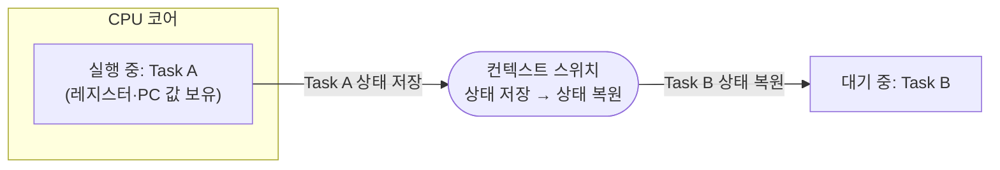
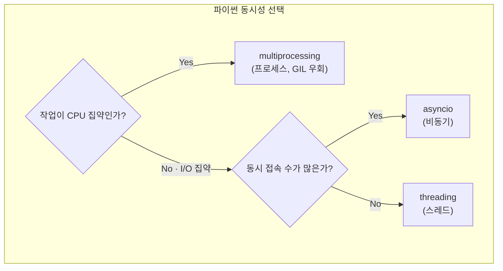
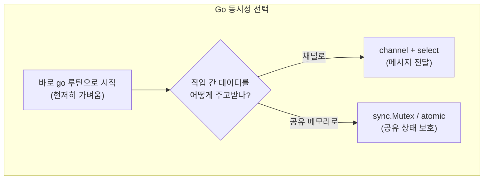

<figure class="post-figure post-figure--header">
<svg role="img" aria-label="운영체제가 프로그램을 실행하는 세 가지 방식의 개념 그림. 왼쪽에는 독립된 메모리와 고유한 자원을 가진 두 프로세스(Process A, B)가 벽으로 분리되어 있고, 오른쪽 위로는 한 프로세스 안에 여러 스레드가 메모리를 공유하는 모습, 그리고 아래쪽에는 단일 실행자(이벤트 루프)가 여러 작업을 돌아가며 교대 처리하는 비동기 모델이 그려진다. 프로세스는 메모리 격리지만 생성이 무겁고, 스레드는 가볍지만 공유 상태를 동기화해야 하며, 비동기는 단일 스레드로 I/O 대기를 줄인다는 점을 대비한다." viewBox="0 0 680 300" xmlns="http://www.w3.org/2000/svg">
  <title>동시성 기초 — 프로세스(격리)·스레드(공유)·비동기(단일 실행자)의 세 모델 비교</title>

  <!-- ===== LEFT: processes (isolated) ===== -->
  <text x="120" y="24" text-anchor="middle" font-size="12" fill="currentColor" font-weight="700" opacity="0.75">프로세스 (격리)</text>
  <rect x="30" y="40" width="130" height="120" rx="4" fill="var(--bg-light)" stroke="var(--accent-color)" stroke-width="2.5"/>
  <text x="95" y="66" text-anchor="middle" font-size="10" fill="currentColor" font-weight="700">Process A</text>
  <rect x="44" y="80" width="102" height="18" rx="3" fill="var(--bg-panel)" stroke="currentColor" stroke-width="1.4"/>
  <text x="95" y="93" text-anchor="middle" font-size="8" fill="currentColor">독립 메모리</text>
  <rect x="44" y="106" width="102" height="18" rx="3" fill="var(--bg-panel)" stroke="currentColor" stroke-width="1.4"/>
  <text x="95" y="119" text-anchor="middle" font-size="8" fill="currentColor">고유 파일·자원</text>
  <rect x="44" y="132" width="102" height="18" rx="3" fill="var(--bg-panel)" stroke="currentColor" stroke-width="1.4"/>
  <text x="95" y="145" text-anchor="middle" font-size="8" fill="currentColor">무거운 생성 비용</text>

  <rect x="180" y="40" width="130" height="120" rx="4" fill="var(--bg-light)" stroke="currentColor" stroke-width="1.8"/>
  <text x="245" y="66" text-anchor="middle" font-size="10" fill="currentColor" font-weight="700">Process B</text>
  <rect x="194" y="80" width="102" height="18" rx="3" fill="var(--bg-panel)" stroke="currentColor" stroke-width="1.4"/>
  <text x="245" y="93" text-anchor="middle" font-size="8" fill="currentColor">독립 메모리</text>
  <rect x="194" y="106" width="102" height="18" rx="3" fill="var(--bg-panel)" stroke="currentColor" stroke-width="1.4"/>
  <text x="245" y="119" text-anchor="middle" font-size="8" fill="currentColor">통신은 IPC 필요</text>
  <rect x="194" y="132" width="102" height="18" rx="3" fill="var(--bg-panel)" stroke="currentColor" stroke-width="1.4"/>
  <text x="245" y="145" text-anchor="middle" font-size="8" fill="currentColor">크래시 격리</text>

  <!-- ===== MIDDLE: threads (shared) ===== -->
  <text x="410" y="24" text-anchor="middle" font-size="12" fill="currentColor" font-weight="700" opacity="0.75">스레드 (공유)</text>
  <rect x="330" y="40" width="160" height="120" rx="4" fill="var(--bg-light)" stroke="var(--secondary-color)" stroke-width="2.5"/>
  <text x="410" y="64" text-anchor="middle" font-size="10" fill="currentColor" font-weight="700">한 프로세스</text>
  <rect x="342" y="78" width="136" height="16" rx="3" fill="var(--bg-panel)" stroke="currentColor" stroke-width="1.2"/>
  <text x="410" y="90" text-anchor="middle" font-size="8" fill="currentColor">공유 메모리·힙</text>
  <g font-size="8" font-weight="700">
    <rect x="344" y="102" width="42" height="20" rx="3" fill="var(--bg-panel)" stroke="currentColor" stroke-width="1.3"/><text x="365" y="115" text-anchor="middle" fill="currentColor">T1</text>
    <rect x="390" y="102" width="42" height="20" rx="3" fill="var(--bg-panel)" stroke="currentColor" stroke-width="1.3"/><text x="411" y="115" text-anchor="middle" fill="currentColor">T2</text>
    <rect x="436" y="102" width="42" height="20" rx="3" fill="var(--bg-panel)" stroke="currentColor" stroke-width="1.3"/><text x="457" y="115" text-anchor="middle" fill="currentColor">T3</text>
  </g>
  <text x="410" y="145" text-anchor="middle" font-size="8" fill="currentColor" opacity="0.8">동기화 필요 (Lock 등)</text>

  <!-- ===== RIGHT: async (single executor) ===== -->
  <text x="596" y="24" text-anchor="middle" font-size="12" fill="currentColor" font-weight="700" opacity="0.75">비동기 (단일 실행자)</text>
  <rect x="520" y="40" width="150" height="120" rx="4" fill="var(--bg-light)" stroke="currentColor" stroke-width="1.8"/>
  <circle cx="595" cy="78" r="26" fill="none" stroke="var(--secondary-color)" stroke-width="2"/>
  <path d="M595,78 m-10,0 a10,10 0 1,1 20,0" fill="none" stroke="currentColor" stroke-width="2" opacity="0.7"/>
  <text x="595" y="82" text-anchor="middle" font-size="8" fill="currentColor" font-weight="700">이벤트 루프</text>
  <g font-size="8" font-weight="700" fill="currentColor">
    <circle cx="560" cy="130" r="10" fill="var(--bg-panel)" stroke="currentColor" stroke-width="1.2"/><text x="560" y="134" text-anchor="middle">A</text>
    <circle cx="595" cy="142" r="10" fill="var(--bg-panel)" stroke="currentColor" stroke-width="1.2"/><text x="595" y="146" text-anchor="middle">B</text>
    <circle cx="630" cy="130" r="10" fill="var(--bg-panel)" stroke="currentColor" stroke-width="1.2"/><text x="630" y="134" text-anchor="middle">C</text>
  </g>
  <text x="595" y="120" text-anchor="middle" font-size="7.5" fill="currentColor" opacity="0.7">I/O 대기 중엔 다른 작업</text>

  <!-- ===== labels row ===== -->
  <text x="95" y="188" text-anchor="middle" font-size="8.5" fill="currentColor" opacity="0.75">격리 O · 무거움 · IPC</text>
  <text x="410" y="188" text-anchor="middle" font-size="8.5" fill="currentColor" opacity="0.75">격리 X · 가벼움 · 동기화</text>
  <text x="595" y="188" text-anchor="middle" font-size="8.5" fill="currentColor" opacity="0.75">한 스레드 · I/O 최적</text>
</svg>
<figcaption>동시성의 세 실행 모델 — **프로세스**는 메모리가 격리돼 안전하지만 생성이 무겁고(IPC 필요), **스레드**는 메모리를 공유해 가볍지만 동기화가 필요하며, **비동기**는 단일 실행자(이벤트 루프)가 I/O 대기 시간을 다른 작업으로 채웁니다.</figcaption>
</figure>

## 한눈에 보기

동시성(Concurrency)은 많은 엔지니어가 "스레드 몇 개 띄우는 것"으로 착각하지만, 실제로는 훨씬 넓은 개념입니다. 이 첫 단계에서는 동시성을 이해하는 데 필요한 운영체제 수준의 세 가지 실행 단위와, 왜 비용이 다른지 살펴봅니다. 이 시리즈 전체가 이 단계에서 세운 개념 위에 서 있습니다.

이번 포스트에서 다루는 핵심 질문은 세 가지입니다.

1. **프로세스·스레드·비동기는 각각 무엇이며, 왜 생성·전환 비용이 다른가?**
2. **동시성(Concurrent)과 병렬성(Parallel)은 어떻게 다를까?**
3. **Python과 Go는 어떤 동시성 모델을 각각 채택했을까?**

## 프로세스(Process)와 스레드(Thread)

### 프로세스 — 독립적인 실행 단위

프로세스는 운영체제가 자원(메모리, 파일 디스크립터, CPU 시간)을 할당하는 **기본 단위**입니다. 각 프로세스는 **자신만의 독립된 가상 메모리 공간**을 가집니다. 코드, 힙, 스택, 데이터 세그먼트가 서로 분리되어 있어서, 한 프로세스가 다른 프로세스의 메모리를 함부로 건드릴 수 없습니다.

```python
# Python에서 프로세스 확인 (사실상 터미널에서도 가능)
import os
print("내 프로세스 PID:", os.getpid())
```

```go
// Go에서도 동일하게 확인
package main

import (
    "fmt"
    "os"
)

func main() {
    fmt.Println("내 프로세스 PID:", os.Getpid())
}
```

핵심 특징:

- **메모리 격리**: 프로세스 간 메모리가 분리되어 있어, 한 프로세스가 죽어도 다른 프로세스는 영향을 받지 않습니다(크래시 격리).
- **통신 필요**: 값을 주고받으려면 IPC(Inter-Process Communication, 프로세스 간 통신) — 파이프, 소켓, 공유 메모리 등 — 를 거쳐야 합니다.
- **생성이 무겁다**: 새 프로세스를 만들려면 운영체제가 주소 공간을 복제하고 새 자원을 초기화해야 하므로 비용이 큽니다.

### 스레드 — 프로세스 안의 더 가벼운 실행 단위

스레드는 **하나의 프로세스 안에서 실행되는 더 작은 실행 단위**입니다. 같은 프로세스에 속한 스레드들은 **코드·데이터·힙을 공유**합니다. 각 스레드는 실행 상태(레지스터, 스택, PC)만 따로 가집니다.

```python
import threading

def worker(n):
    print(f"스레드 {n} 실행")

threads = [threading.Thread(target=worker, args=(i,)) for i in range(3)]
for t in threads:
    t.start()
for t in threads:
    t.join()
```

```go
package main

import (
    "fmt"
    "sync"
)

func main() {
    var wg sync.WaitGroup
    for i := 0; i < 3; i++ {
        wg.Add(1)
        go func(n int) {
            defer wg.Done()
            fmt.Printf("고루틴 %d 실행\n", n) // goroutine
        }(i)
    }
    wg.Wait()
}
```

핵심 특징:

- **메모리 공유**: 같은 힙을 보므로 데이터를 주고받기 쉬운 대신, **동시 접근(레이스)**을 막을 동기화가 필요합니다.
- **생성이 프로세스보다 가볍다**: 스레드 간에는 주소 공간을 공유하므로 새 주소 공간을 만들 필요가 없습니다.

### 왜 프로세스는 무겁고 스레드는 가벼운가 — 컨텍스트 스위치

운영체제는 여러 작업을 매우 빠르게 **교대(스케줄링)** 하며 실행합니다. CPU가 어떤 작업에서 다른 작업으로 넘어갈 때, 지금 하던 작업의 상태(레지스터, 스택 포인터, PC)를 저장하고 다음 작업의 상태를 복원해야 하는데, 이 과정을 **컨텍스트 스위치(Context Switch)** 라고 합니다.



- **프로세스 간 스위치**는 TLB(주소 변환 캐시)를 비우고 페이지 테이블을 전환해야 하므로 비쌉니다.
- **스레드 간 스위치**는 같은 주소 공간을 공유하므로(스택과 레지스터만 바꾸면 됨) 더 저렴합니다.
- **비동기는 스위치조차 안 합니다** — 같은 스레드가 "작업 단위"만 바꾸며 실행하므로, 스케줄러 개입이 없어 가장 가볍습니다.

## 동시성(Concurrency) vs 병렬성(Parallelism)

이 둘을 혼동하는 경우가 많습니다. 정확히 구분해 둡시다.

| | 동시성 (Concurrency) | 병렬성 (Parallelism) |
|---|---|---|
| 의미 | 여러 작업이 **교대**로 진행 (논리적 동시) | 여러 작업이 **동시에** 실행 (물리적 동시) |
| 하드웨어 | CPU 코어 한 개만 있어도 가능 | CPU 코어가 여러 개 필요 |
| 본질 | **구조**(Structure)의 문제 | **실행**(Execution)의 문제 |
| 비유 | 한 사람이 여러 요리를 번갈아 가며 | 여러 사람이 동시에 각자 요리 |

> Rob Pike(Go 창시자)의 유명한 말: **"동시성은 구조에 관한 것이고, 병렬성은 실행에 관한 것이다. 동시성이 아닌 프로그램이 병렬일 수는 없다."**

- **동시성**은 "작업을 어떻게 쪼개고 교대할 것인가"의 **설계**입니다.
- **병렬성**은 "그 작업들이 실제로 코어에서 동시에 도는가"의 **실행**입니다.

이 시리즈의 각 단계는 동시성(설계)을 세우고, 하드웨어가 허락할 때 병렬성(실행)으로 끌어올리는 흐름을 다룹니다.

## 파이썬과 Go의 동시성 모델 개괄

이 시리즈가 두 언어를 짝지어 보는 이유는, 두 언어가 **동시성을 푸는 철학이 정반대**이기 때문입니다.

### 파이썬 — GIL이 이끄는 "스레드는 신중히, 프로세스·비동기는 적극적으로"

파이썬은 인터프리터가 한 번에 한 바이트코드만 실행하도록 보장하는 **GIL(Global Interpreter Lock)** 을 가집니다. 그래서:

- **순수 CPU 작업**을 여러 스레드로 돌려도 GIL 때문에 한 번에 하나만 실행되어 이득이 없습니다 → CPU 작업은 **`multiprocessing`**(프로세스)이 답입니다.
- **I/O 작업**은 GIL을 놓고 기다리는 동안 다른 스레드가 실행되므로, 스레드도 꽤 유용합니다.
- I/O가 많은 서버라면 **`asyncio`**(비동기)가 가장 확장적입니다.

GIL의 작동 원리는 별도 포스트 [Python GIL](/2025/10/22/python-gil.html)에서 자세히 다뤘습니다. 이 시리즈 전체가 파이썬 면에서 그 결론("I/O면 스레드/비동기, CPU면 프로세스")을 전제로 합니다.



### Go — 고루틴이 이끄는 "가볍게, 그리고 통신으로"

Go는 파이썬과 달리 조금 다른 질문을 던집니다. Go의 동시성 기본 단위는 스레드가 아니라, **고루틴(Goroutine)** 입니다.

- 고루틴은 운영체제 스레드보다 **훨씬 가볍다** (초기 스택 수 KB, 수십만 개도 생성 가능).
- 런타임이 M:N 스케줄러로 수많은 고루틴을 소수의 OS 스레드에 배분합니다.
- Go의 철학은 **"메모리를 공유함으로써 통신하지 말고, 통신함으로써 메모리를 공유하라"** — 즉 채널(Channel)로 고루틴 간에 메시지를 주고받습니다.



- **CPU 집약 작업**이라도 파이썬처럼 "프로세스로 올라가야" 하는 일은 거의 없습니다. 고루틴을 코어 수만큼 띄우면 그만입니다.
- 데이터 공유는 **채널(통신)**을 기본으로 하고, 꼭 필요한 공유 상태만 `sync` 패키지로 보호합니다.

## 한눈에 보기 — 단계별 지도

| 관점 | Python | Go |
|---|---|---|
| 기본 실행 단위 | 스레드 / 프로세스 / 코루틴(비동기) | 고루틴 |
| 스레드 생성 비용 | 중간 (OS 스레드) | 매우 낮음 (고루틴) |
| CPU 병렬 | `multiprocessing`로 **프로세스** 분리 필요 | 고루틴을 코어에 분산 |
| I/O 효율 | `asyncio`(비동기) 권장 | 고루틴 + 블로킹 I/O로 충분 |
| 공유 상태 보호 | `threading.Lock` 등 | `sync.Mutex`·`atomic` |
| 권장 통신 | Queue / Pipe / Manager | Channel + `select` |

다음 단계에서는 이 지도에서 **경량 스레드(2단계)** 부터 실제 코드로 파고듭니다.

## Summary

- **프로세스**는 자원의 기본 단위로 메모리가 격리돼 안전하지만 생성·전환이 무겁고 IPC가 필요합니다.
- **스레드**는 프로세스 안에서 메모리를 공유하는 더 가벼운 실행 단위지만, 공유 상태를 동기화해야 합니다.
- **비동기(이벤트 루프)** 는 단일 스레드가 I/O 대기 시간을 다른 작업으로 채워 스위치 비용을 아낍니다.
- **동시성**(구조·교대)과 **병렬성**(실행·동시)은 다른 차원의 문제입니다.
- **Python**은 GIL 때문에 "I/O는 스레드·비동기, CPU는 프로세스(멀티프로세싱)"로 갈리고, **Go**는 가벼운 고루틴 + 채널을 기본으로 합니다.

### 다음 학습 (Next Learning)

- [Stage 2 · 경량 스레드](/2026/08/24/stage2-경량-스레드.html) — Python `threading`과 Go 고루틴의 실제 동작을 I/O 집약 작업으로 비교합니다.
- [Python GIL](/2025/10/22/python-gil.html) — 파이썬이 CPU 작업에서 왜 스레드 대신 프로세스를 쓰는지 그 근본 원인을 다시 확인.
- [Rust 스마트 포인터, 동시성, 그리고 프로젝트](/2026/01/09/rust-smart-pointers-concurrency-and-projects.html) — 같은 동시성 개념을 다른 시스템 언어에서는 어떻게 접근하는지 비교해 보기.
