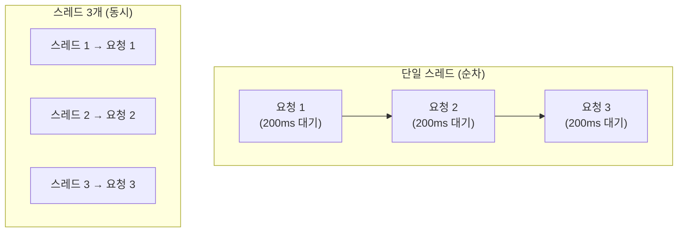

<figure class="post-figure post-figure--header">
<svg role="img" aria-label="여러 스레드가 네트워크 I/O를 교대로 처리하는 개념 그림. 왼쪽에 네 개의 스레드/고루틴이 늘어서 있고, 각각이 오른쪽에 있는 느린 외부 요청(웹 서버)을 기다리는 동안 CPU가 그 사이 다른 스레드의 작업을 진행한다. 아래에는 파이썬 스레드는 GIL 때문에 한 번에 하나만 CPU를 쓰지만 I/O 동안은 놓고, Go 고루틴은 여러 개가 OS 스레드에 매핑돼 동시에 실행되는 모습을 대비한다. 단일 스레드가 I/O 대기 동안 아무것도 못 하는 것과 대비된다." viewBox="0 0 680 300" xmlns="http://www.w3.org/2000/svg">
  <title>경량 스레드 — 여러 실행 단위가 I/O 대기 시간을 서로 채워 처리량을 높이는 구조</title>

  <!-- ===== LEFT: thread columns ===== -->
  <text x="150" y="26" text-anchor="middle" font-size="12" fill="currentColor" font-weight="700" opacity="0.75">스레드 / 고루틴</text>
  <g font-size="9" font-weight="700" fill="currentColor">
    <rect x="40" y="44" width="96" height="30" rx="3" fill="var(--bg-light)" stroke="var(--accent-color)" stroke-width="2"/><text x="88" y="63" text-anchor="middle">T1 · 요청 A</text>
    <rect x="40" y="84" width="96" height="30" rx="3" fill="var(--bg-light)" stroke="var(--accent-color)" stroke-width="2"/><text x="88" y="103" text-anchor="middle">T2 · 요청 B</text>
    <rect x="40" y="124" width="96" height="30" rx="3" fill="var(--bg-light)" stroke="currentColor" stroke-width="1.8"/><text x="88" y="143" text-anchor="middle">T3 · 요청 C</text>
    <rect x="40" y="164" width="96" height="30" rx="3" fill="var(--bg-light)" stroke="currentColor" stroke-width="1.8"/><text x="88" y="183" text-anchor="middle">T4 · 요청 D</text>
  </g>

  <!-- ===== MIDDLE: arrows to remote slow I/O ===== -->
  <g stroke="var(--secondary-color)" stroke-width="1.6" opacity="0.7">
    <line x1="140" y1="59" x2="420" y2="150"/>
    <line x1="140" y1="99" x2="430" y2="130"/>
    <line x1="140" y1="139" x2="430" y2="190"/>
    <line x1="140" y1="179" x2="420" y2="90"/>
  </g>

  <!-- ===== RIGHT: slow remote service meter ===== -->
  <text x="560" y="40" text-anchor="middle" font-size="11" fill="currentColor" font-weight="700" opacity="0.8">느린 외부 I/O</text>
  <rect x="470" y="56" width="180" height="150" rx="6" fill="var(--bg-panel)" stroke="var(--accent-color)" stroke-width="2"/>
  <text x="560" y="116" text-anchor="middle" font-size="10" fill="currentColor" font-weight="700">네트워크 · 파일</text>
  <text x="560" y="136" text-anchor="middle" font-size="8.5" fill="currentColor" opacity="0.8">요청을 기다리는 동안</text>
  <text x="560" y="152" text-anchor="middle" font-size="8.5" fill="currentColor" opacity="0.8">CPU는 유휴 → 다른 작업</text>
  <text x="560" y="168" text-anchor="middle" font-size="8.5" fill="currentColor" opacity="0.8">을 채워넣음</text>

  <!-- ===== BOTTOM: GIL vs goroutine contrast ===== -->
  <text x="255" y="246" text-anchor="middle" font-size="10" fill="currentColor" font-weight="700" opacity="0.8">Python: I/O 동안 GIL 해제 → 여러 스레드 교대</text>
  <text x="255" y="266" text-anchor="middle" font-size="10" font-weight="700" opacity="0.8" fill="var(--secondary-color)">Go: 고루틴 수만 개가 소수 OS 스레드에 매핑</text>
</svg>
<figcaption>경량 스레드가 I/O-집약 작업에서 강력한 이유 — 각 스레드/고루틴이 느린 외부 요청을 기다리는 동안, 다른 실행 단위가 그 시간을 채워 CPU를 계속 씁니다. Python은 GIL을 잡고 있는 동안에도 I/O 대기에서는 해제하므로 스레드가 유용하고, Go 고루틴은 훨씬 더 가볍습니다.</figcaption>
</figure>

## 한눈에 보기

1단계에서 세운 개념 위에서, 이번 단계는 "**I/O-집약 작업(Inbound/Outbound)**"을 다루는 실행 단위를 실제 코드로 다집니다. 네트워크 요청, 파일 읽기, DB 쿼리처럼 **대부분이 대기 시간**인 작업에서는, 실행 단위를 여러 개 띄우는 것만으로도 처리량이 크게 늘어납니다.

- Python `threading`을 **GIL 아래에서도 왜** I/O에 효과적인지와 함께 이해합니다.
- Go의 고루틴이 왜 수십만 개까지 가볍게 생성되는지(M:N 스케줄러) 이해합니다.
- 같은 크롤링 작업으로 두 언어의 처리 방식을 **직접 비교**합니다.

## 왜 I/O-집약 작업에 스레드가 유용한가

I/O 요청은 대부분 **CPU가 아니라 장치/네트워크를 기다리는 시간**입니다. 예를 들어 HTTP 요청 하나가 200ms 걸린다면, 그 200ms 동안 우리 프로그램의 CPU는 사실상 노는 셈입니다.



- **순차 처리**: 요청 3개를 하면 200ms × 3 = **600ms**.
- **스레드 3개**: 각각 200ms로 겹쳐 실행되어 대략 **200ms** 안에 끝납니다.

즉, I/O 작업에서는 **실행 단위의 개수 = 처리량 향상** 과 직결됩니다. CPU 작업과 달리 GIL 같은 제약의 여파가 크지 않습니다.

## Python `threading` — GIL 아래에서도 I/O엔 강하다

### 기본 사용

```python
import threading
import time

def work(name, delay):
    time.sleep(delay)          # I/O 대기의 대용: 시간 지연
    print(f"[{name}] 완료")

start = time.perf_counter()
threads = [
    threading.Thread(target=work, args=("A", 0.2)),
    threading.Thread(target=work, args=("B", 0.2)),
    threading.Thread(target=work, args=("C", 0.2)),
]
for t in threads:
    t.start()                  # 3 스레드 시작
for t in threads:
    t.join()                   # 전부 끝날 때까지 대기
print(f"총 시간: {time.perf_counter() - start:.3f}s")   # ≈ 0.2s (순차면 0.6s)
```

`start()`가 스레드를 실행시키고, `join()`이 스레드가 끝날 때까지 현재 스레드를 기다리게 합니다. `threading.Thread(target=..., args=...)`로 작업 함수와 인자를 지정합니다.

### GIL이 왜 I/O에선 문제가 안 되는가

파이썬의 GIL(Global Interpreter Lock)은 **바이트코드 실행**을 보호하는 락입니다. 핵심은:

1. 스레드 A가 **순수 CPU 연산**(예: 루프)을 하면 GIL을 계속 붙들고 있어, 다른 스레드가 실행되지 못합니다.
2. 하지만 스레드 A가 **I/O를 만나면** (블로킹 I/O에 진입하면) 파이썬이 **GIL을 놓습니다**(release). 그동안 다른 스레드가 GIL을 얻어 실행됩니다.

```python
import threading, socket

results = []
def fetch(host):
    # socket.connect/f.recv 같은 블로킹 I/O 동안 GIL은 해제됨
    with socket.create_connection((host, 80), timeout=2):
        pass
    results.append(f"ok: {host}")

hosts = ["google.com", "github.com", "wikipedia.org"]
ths = [threading.Thread(target=fetch, args=(h,)) for h in hosts]
for t in ths:
    t.start()
for t in ths:
    t.join()
print(results)
```

블로킹 I/O 중 파이썬은 GIL을 내려놓으므로, **I/O-집약 작업은 스레드 여러 개로 확장**됩니다. GIL의 벤치마크와 원리는 [Python GIL](/2025/10/22/python-gil.html)에서 확인할 수 있습니다.

> **주의할 점**: 순수 CPU 연산(`while` 계산 루프 같은 것)은 스레드로 나누면 GIL 때문에 오히려 느려집니다. 이 경우 해결책은 **3단계의 `multiprocessing`**(프로세스)입니다.

### `ThreadPoolExecutor` (고수준 API)

매 스레드를 직접 만드는 대신, 표준 라이브러리의 `concurrent.futures.ThreadPoolExecutor`를 쓰면 작업을 쉽게 분배합니다.

```python
from concurrent.futures import ThreadPoolExecutor

def fetch_one(url):
    # ... 실제 I/O 작업
    return f"fetched {url}"

urls = [f"https://example.com/{i}" for i in range(10)]
with ThreadPoolExecutor(max_workers=5) as ex:
    results = list(ex.map(fetch_one, urls))  # worker 5개가 10건 처리
```

`map`이 결과를 입력 순서대로 모아주고, `max_workers`로 동시 실행 수를 제한합니다. 스레드를 직접 관리하는 번거로움을 줄여줍니다.

## Go Goroutine — 훨씬 가벼운 실행 단위

### 기본 사용

Go의 동시성 기본 단위는 **고루틴(Goroutine)** 입니다. `go` 키워드 하나로 실행을 시작합니다.

```go
package main

import (
    "fmt"
    "sync"
    "time"
)

func work(name string, d time.Duration) {
    time.Sleep(d)
    fmt.Printf("[%s] 완료\n", name)
}

func main() {
    var wg sync.WaitGroup
    wg.Add(3)
    for _, name := range []string{"A", "B", "C"} {
        go func(n string) {       // 고루틴 시작
            defer wg.Done()
            work(n, 200*time.Millisecond)
        }(name)
    }
    wg.Wait()                     // 전부 끝날 때까지 대기
}
```

`go func(){}()`가 고루틴을 만들고, `sync.WaitGroup`은 파이썬의 `join()`처럼 **여러 고루틴이 끝날 때까지 기다리는 용도**입니다. (`Add`로 몇 개를 기다릴지, `Done`으로 하나 끝남을 알리고, `Wait`로 모두 끝날 때까지 대기.)

### 고루틴은 왜 그렇게 가벼운가 — M:N 스케줄러

파이썬 스레드는 각각 **OS 스레드** 하나에 대응합니다. OS 스레드는 생성 비용이 크고, 스택이 기본 수 MB로 큽니다.

반면 Go의 고루틴은:

- **초기 스택이 수 KB**에 불과합니다(필요하면 동적으로 늘어남).
- 운영체제 스레드에 1:1로 매핑되지 않고, 런타임이 **M:N 스케줄러**로 수많은 고루틴을 소수의 OS 스레드에 배분합니다.


스레드보다 훨씬 가볍기 때문에 수만~수십만 개를 띄워도 무리가 없고, goroutine 사이의 전환 비용도 OS가 개입하지 않는 사용자 공간 스위치라 저렴합니다.

### I/O를 만나면 — 파이썬과 달리 그냥 편하게

Go의 `net`/`http` 라이브러리는 내부적으로 **비차단 I/O**를 사용합니다. 고루틴이 I/O를 만나면 런타임이 그 고루틴을 일시 중지시키고, 다른 고루틴을 OS 스레드에서 실행합니다. 따라서 파이썬처럼 "GIL을 놓고/재획득하며" 신경 쓸 필요 없이, **그냥 고루틴을 많이 띄우면 됩니다.**

```go
package main

import (
    "fmt"
    "net/http"
    "sync"
    "time"
)

func main() {
    urls := make([]string, 100)
    for i := range urls {
        urls[i] = fmt.Sprintf("https://example.com/%d", i)
    }

    var wg sync.WaitGroup
    start := time.Now()
    for _, u := range urls {
        wg.Add(1)
        go func(url string) {          // URL마다 고루틴 하나
            defer wg.Done()
            _, err := http.Get(url)    // 내부적으로 비차단 I/O
            if err != nil {
                fmt.Println("err:", err)
            }
        }(u)
    }
    wg.Wait()
    fmt.Printf("100건 완료, %s\n", time.Since(start))
}
```

## 실습 — 같은 크롤링 작업을 양 언어로 비교

이제 같은 문제를 Python과 Go로 각각 풀어봅니다. **"동시에 몇 개까지 실행할지(동시성 수준)"** 를 조절하며 처리량이 어떻게 달라지는지 관찰해 보세요.

**Python — `ThreadPoolExecutor`로 동시 5개:**

```python
from concurrent.futures import ThreadPoolExecutor
import time, urllib.request

urls = [f"https://example.com?i={i}" for i in range(20)]

def hit(u):
    st = time.perf_counter()
    urllib.request.urlopen(u, timeout=3).read()
    return time.perf_counter() - st

with ThreadPoolExecutor(max_workers=5) as ex:
    times = list(ex.map(hit, urls))

print(f"평균 응답: {sum(times)/len(times)*1000:.0f}ms, 총 {sum(times):.1f}s")
```

| 동시성 수준(workers) | 예상 결과 |
|---|---|
| 1 (순차) | 총 시간 = 응답시간 × 20 (가장 느림) |
| 5 | 총 시간 ≈ 응답시간 × 4 |
| 20 | 총 시간 ≈ 응답시간 (전부 겹침) |

**Go — 고루틴으로 동시 5개(세마포어 역할):**

```go
package main

import (
    "fmt"
    "net/http"
    "sync"
    "time"
)

func main() {
    urls := make([]string, 20)
    for i := range urls {
        urls[i] = fmt.Sprintf("https://example.com?i=%d", i)
    }

    const concurrency = 5
    sem := make(chan struct{}, concurrency) // 최대 5까지 동시 실행을 제한
    var wg sync.WaitGroup
    start := time.Now()

    for _, u := range urls {
        wg.Add(1)
        go func(url string) {
            defer wg.Done()
            sem <- struct{}{}      // 슬롯 확보 (없으면 대기)
            defer func() { <-sem }() // 슬롯 반환
            req, _ := http.NewRequest("GET", url, nil)
            client := &http.Client{Timeout: 3 * time.Second}
            client.Do(req)
        }(u)
    }
    wg.Wait()
    fmt.Println("완료, 총 시간:", time.Since(start))
}
```

`sem <- struct{}{}` 채널을 세마포어로 사용해 동시 고루틴 수를 제한하는 패턴은 5단계(통신)에서 더 깊이 다룹니다.

> **직접 해보기 권장**: 두 언어 모두 동시성 수준을 1 → 5 → 20으로 바꿔가며 총 시간이 줄어드는 걸 확인해 보세요. 같은 I/O-집약 문제에서 Python 스레드와 Go 고루틴이 비슷하게 확장되는 모습을 체감할 수 있습니다.

## Python Thread vs Go Goroutine — 비교 요약

| | Python `threading` | Go `goroutine` |
|---|---|---|
| 단위 | OS 스레드 1:1 | 가벼운 고루틴, M:N 매핑 |
| 생성 한계 | 수백 개 수준에서 부담 | 수만~수십만 개 가능 |
| 스택 크기 | OS 기본 수 MB | 수 KB에서 동적 성장 |
| I/O 처리 | 블로킹 I/O 중 GIL 해제 | 비차단 I/O + 런타임 스케줄 |
| 동시성 수준 제어 | `ThreadPoolExecutor` / 세마포어 | 채널 세마포어 / `WaitGroup` |
| CPU 작업 | 부적합 (GIL) → 3단계 | 가능하나 race 주의 → 3단계 |

## Summary

- I/O-집약 작업에서는 **실행 단위 개수 ≈ 처리량**. 대기 시간을 다른 실행 단위가 채웁니다.
- Python 스레드는 **블로킹 I/O 동안 GIL을 놓아** I/O 작업에 효과적입니다. CPU 연산에는 부적합합니다(→ 3단계).
- `ThreadPoolExecutor`로 스레드 관리를 추상화하여 작업을 쉽게 분배합니다.
- Go 고루틴은 **수 KB 스택 + M:N 스케줄러** 덕분에 스레드보다 훨씬 가볍고, 비차단 I/O 덕분에 그냥 많이 띄우면 됩니다.
- 파이썬과 Go 모두 **동시성 수준을 제한**하는 것이 예측 가능한 성능의 핵심입니다.

### 다음 학습 (Next Learning)

- [Stage 3 · 병렬화](/2026/08/24/stage3-병렬화.html) — CPU-집약 작업에서 Python `multiprocessing`(GIL 우회)과 Go 병렬 고루틴을 비교합니다.
- [Python GIL](/2025/10/22/python-gil.html) — 스레드가 왜 CPU 작업에 부적합한지 그 근본 원인을 다시 확인.
- [Stage 5 · 통신](/2026/08/24/stage5-통신.html) — 여기서 본 채널 세마포어 패턴을 본격적으로 다룹니다.
