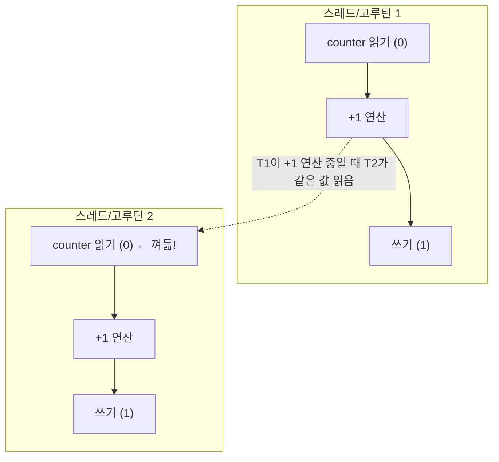

<figure class="post-figure post-figure--header">
<svg role="img" aria-label="공유 자원(카운터)을 두고 여러 실행 단위가 자물쇠로 보호하는 개념 그림. 가운데에 '공유 카운터' 상자가 있고, 네 개의 스레드/고루틴이 각각 자물쇠(Lock)를 거쳐 차례대로 접근한다. 한 쪽에는 자물쇠 없이 동시에 접근해 값이 유실되는 데이터 레이스가 그려져 있고, 다른 쪽에서는 두 실행 단위가 서로 다른 자물쇠를 쥐고 서로를 기다리는 데드락 상태가 그려져 있다. 공유 상태를 보호하려면 락으로 임계 구역을 감싸야 한다." viewBox="0 0 680 300" xmlns="http://www.w3.org/2000/svg">
  <title>동기화 — 공유 카운터를 자물쇠로 보호해 데이터 레이스를 막고, 데드락을 피하는 방법</title>

  <!-- ===== CENTER: shared counter ===== -->
  <rect x="280" y="90" width="150" height="80" rx="6" fill="var(--bg-panel)" stroke="var(--accent-color)" stroke-width="2.5"/>
  <text x="355" y="122" text-anchor="middle" font-size="11" fill="currentColor" font-weight="700">공유 카운터</text>
  <text x="355" y="142" text-anchor="middle" font-size="26" fill="currentColor" font-weight="700">counter</text>
  <text x="355" y="160" text-anchor="middle" font-size="7.5" fill="currentColor" opacity="0.7">임계 구역 (한 번에 하나만 접근)</text>

  <!-- ===== LEFT: threads blocked waiting for lock ===== -->
  <text x="150" y="40" text-anchor="middle" font-size="10" fill="currentColor" font-weight="700" opacity="0.75">자물쇠(Lock) 경쟁</text>
  <g font-size="8.5" font-weight="700" fill="currentColor">
    <rect x="70" y="56" width="120" height="30" rx="3" fill="var(--bg-light)" stroke="var(--secondary-color)" stroke-width="2"/><text x="130" y="75" text-anchor="middle">T1 (락 보유)</text>
    <rect x="70" y="96" width="120" height="30" rx="3" fill="var(--bg-light)" stroke="currentColor" stroke-width="1.6"/><text x="130" y="115" text-anchor="middle">T2 (대기)</text>
    <rect x="70" y="136" width="120" height="30" rx="3" fill="var(--bg-light)" stroke="currentColor" stroke-width="1.6"/><text x="130" y="155" text-anchor="middle">T3 (대기)</text>
  </g>

  <!-- ===== RIGHT: data race vs deadlock ===== -->
  <rect x="470" y="56" width="190" height="84" rx="4" fill="var(--bg-light)" stroke="currentColor" stroke-width="1.6"/>
  <text x="565" y="78" text-anchor="middle" font-size="9" fill="currentColor" font-weight="700" opacity="0.8">데이터 레이스 (락 없음)</text>
  <text x="565" y="96" text-anchor="middle" font-size="8" fill="currentColor" opacity="0.7">T2와 T3가 동시에</text>
  <text x="565" y="110" text-anchor="middle" font-size="8" fill="currentColor" opacity="0.7">counter를 읽고 씀 → 유실</text>
  <text x="565" y="128" text-anchor="middle" font-size="8" fill="currentColor" opacity="0.7">(결과가 1000이 아닐 수 있음)</text>

  <rect x="470" y="156" width="190" height="84" rx="4" fill="var(--bg-light)" stroke="var(--gold)" stroke-width="1.6"/>
  <text x="565" y="178" text-anchor="middle" font-size="9" fill="currentColor" font-weight="700" opacity="0.85">데드락 (서로 기다림)</text>
  <text x="565" y="196" text-anchor="middle" font-size="8" fill="currentColor" opacity="0.75">T1이 자물쇠 X 보유·Y 대기</text>
  <text x="565" y="210" text-anchor="middle" font-size="8" fill="currentColor" opacity="0.75">T2가 자물쇠 Y 보유·X 대기</text>
  <text x="565" y="228" text-anchor="middle" font-size="8" fill="currentColor" opacity="0.75">둘 다 영원히 멈춤</text>

  <!-- ===== arrows to counter ===== -->
  <line x1="190" y1="90" x2="280" y2="115" stroke="var(--secondary-color)" stroke-width="1.8" marker-end="url(#sync-arrow)"/>
  <line x1="190" y1="105" x2="280" y2="125" stroke="currentColor" stroke-width="1.4" opacity="0.5"/>

  <defs>
    <marker id="sync-arrow" markerWidth="8" markerHeight="8" refX="6" refY="4" orient="auto">
      <path d="M0,0 L8,4 L0,8 z" fill="var(--secondary-color)"/>
    </marker>
  </defs>
</svg>
<figcaption>동기화의 두 축 — 공유 상태를 **자물쇠(Lock)** 로 감싸 임계 구역을 지키는 것(레이스 방지)과, 여러 락을 잘못 쥐어 서로 기다리는 **데드락**을 피하는 것입니다. 락 없이 동시 접근하면 값이 유실되고, 락을 순환 보유하면 프로그램이 영원히 멈춥니다.</figcaption>
</figure>

## 한눈에 보기

3단계에서 본 `counter++` 데이터 레이스가 이 단계의 출발점입니다. 병렬로 실행되는 여러 스레드/고루틴이 **같은 값을 동시에 읽고 쓰면** 경쟁해 잘못된 결과가 나옵니다. 이를 막는 기법이 **동기화(Synchronization)** 입니다.

- **Lock(락)** — 임계 구역에 한 번에 하나만 들어가게 합니다.
- **Semaphore(세마포어)** — 동시 접근 수를 K개로 제한합니다.
- **Deadlock(데드락)** — 락을 잘못 쓰면 영원히 멈추는 함정. 발생 조건과 예방법을 알아둡니다.

## 데이터 레이스와 임계 구역(Critical Section)

여러 실행 단위가 **같은 변수를 동시에 읽고 쓰는** 상황에서 "읽기 → 수정 → 쓰기"가 서로 끼어들어 값이 유실되는 것을 **데이터 레이스(Data Race)** 라고 합니다.



둘 다 0을 읽고 1을 쓰면, 실제로 두 번 증가했는데도 결과는 1이 됩니다. 이처럼 **여러 실행 단위가 동시에 건드리는 코드 덩어리**를 **임계 구역(Critical Section)** 이라 하고, 보호해야 합니다.

## Python 동기화 기본기

### `Lock` — 한 번에 하나만

`threading.Lock()`은 임계 구역에 동시에 한 실행 단위만 들어오게 합니다.

```python
import threading

counter = 0
lock = threading.Lock()

def increment(n):
    global counter
    for _ in range(n):
        with lock:            # 임계 구역 진입 (락 획득)
            counter += 1      # 안전하게 읽고-쓰기
        # with 블록을 나가며 락 자동 해제

ths = [threading.Thread(target=increment, args=(100_000,)) for _ in range(8)]
for t in ths: t.start()
for t in ths: t.join()
print(counter)   # 정확히 800,000
```

`with lock:` 블록으로 감싸면 `lock.acquire()` / `lock.release()`를 짝으로 자동 처리해 줍니다. 락을 쓰면 8개 스레드도 정확한 결과를 냅니다.

### `RLock` — 같은 스레드가 재진입 가능한 락

`Lock`은 같은 스레드가 **중첩해서** 다시 획득하려 하면 데드락이 걸립니다. 재귀 호출처럼 같은 스레드가 여러 번 락을 얻어야 하는 경우에는 `RLock`(Reentrant Lock)을 씁니다.

```python
import threading

lock = threading.RLock()   # 재진입 가능

def outer():
    with lock:
        inner()            # 같은 스레드가 다시 획득해도 OK

def inner():
    with lock:
        pass
```

같은 스레드가 이미 가진 락을 다시 얻을 수 있지만, 다른 스레드는 여전히 블로킹합니다.

> **파이썬 주의**: 시스템 호출로 GIL을 놓는 I/O 중에는 락이 사실 불필요할 수 있지만, CPU 연산 사이의 공유 상태 접근에는 락이 반드시 필요합니다.

### `Semaphore` — 동시 접근 수 제한

세마포어는 락과 달리, **동시에 들어갈 수 있는 수를 K개로 제한**합니다. 예: "최대 3개의 스레드만 동시에 DB 커넥션 풀에 접근".

```python
import threading, time

sem = threading.Semaphore(3)   # 동시에 3개까지

def db_worker(name):
    with sem:                  # 슬롯 확보 (꽉 차면 대기)
        print(f"{name} 접근")
        time.sleep(0.1)

ths = [threading.Thread(target=db_worker, args=(i,)) for i in range(6)]
for t in ths: t.start()
for t in ths: t.join()
```

세마포어를 값 1로 만들면 락과 동일해집니다. **자원 풀(풀 크기 제한)** 을 구현할 때 유용합니다.

### `Event` — 신호 보내기

한 스레드가 다른 스레드들에게 "준비됐다"는 신호를 보내는 데 쓰입니다.

```python
import threading, time

ready = threading.Event()

def worker():
    ready.wait()          # 신호를 기다림
    print("작업 시작")

t = threading.Thread(target=worker)
t.start()
time.sleep(1)
ready.set()               # 신호 보냄 → worker가 진행
t.join()
```

파이썬 `threading`은 `Lock`, `RLock`, `Semaphore`, `Event`, `Condition`, `Barrier`를 제공합니다. 용도에 맞게 고르면 됩니다.

## Go 동기화 기본기

### `sync.Mutex` — 파이썬 Lock과 동일한 역할

```go
package main

import (
    "fmt"
    "sync"
)

func main() {
    var mu sync.Mutex
    counter := 0
    var wg sync.WaitGroup

    for i := 0; i < 8; i++ {
        wg.Add(1)
        go func() {
            defer wg.Done()
            for j := 0; j < 100000; j++ {
                mu.Lock()          // 임계 구역 진입
                counter++
                mu.Unlock()        // 해제
            }
        }()
    }
    wg.Wait()
    fmt.Println(counter) // 정확히 800,000
}
```

`mu.Lock()`/`mu.Unlock()`으로 감싸 파이썬의 `with lock:`과 같은 보호를 제공합니다. Go에는 `RLock` 대신 **`sync.RWMutex`** 가 있어, **읽기는 여러 개가 동시에, 쓰기는 하나만** 허용해 읽기 많은 워크로드에서 락 경쟁을 줄입니다.

```go
var rw sync.RWMutex
// 읽기: 여러 고루틴 동시 허용
rw.RLock(); _ = counter; rw.RUnlock()
// 쓰기: 하나만
rw.Lock(); counter++; rw.Unlock()
```

### `sync.WaitGroup` — 파이썬 join()에 해당

이미 계속 등장했지만, **고루틴들이 모두 끝날 때까지 기다리는** 용도입니다.

```go
var wg sync.WaitGroup
wg.Add(N)   // N개를 기다릴 것
// 각 고루틴에서 defer wg.Done()
wg.Wait()   // 모두 끝날 때까지
```

### `sync/atomic` — 단순 카운터는 락보다 가볍게

카운터처럼 **원자적으로 한 번에 더하고 빼기**만 하면 되는 경우, 뮤텍스보다 가벼운 **원자 연산(atomic)** 을 쓸 수 있습니다.

```go
import "sync/atomic"

var counter int64
atomic.AddInt64(&counter, 1)   // 락 없이 원자적 증가
fmt.Println(atomic.LoadInt64(&counter))
```

원자 연산은 내부적으로 CPU의 원자적 명령을 사용해, 락을 잡고 푸는 오버헤드를 피합니다. 단순 증가/감소처럼 연산이 **단일 명령**인 경우에만 쓰고, 여러 단계가 얽힌 로직은 뮤텍스로 보호해야 합니다.

## 데드락(Deadlock) — 반드시 피해야 할 함정

### 발생 조건 4가지

데드락은 다음 **4가지 조건이 모두 만족**할 때 발생합니다.

| 조건 | 설명 |
|---|---|
| **상호 배제 (Mutual Exclusion)** | 자원을 동시에 둘 이상이 못 씀 |
| **점유와 대기 (Hold & Wait)** | 자원 하나를 쥔 채 다른 걸 기다림 |
| **비선점 (No Preemption)** | 쥔 자원을 빼앗기지 않음 |
| **순환 대기 (Circular Wait)** | A는 B를, B는 A를 서로 기다림 |

가장 대표적인 예가 **락 두 개를 서로 반대 순서로 획득**하는 상황입니다.

```python
import threading

lock_a, lock_b = threading.Lock(), threading.Lock()

def task1():
    with lock_a:
        with lock_b:   # A → B 순서
            pass

def task2():
    with lock_b:
        with lock_a:   # B → A 순서 (역순 → 데드락!)
            pass

t1 = threading.Thread(target=task1); t2 = threading.Thread(target=task2)
t1.start(); t2.start(); t1.join(); t2.join()   # 서로 상대의 락을 기다리며 영원히 멈춤
```

Go에서도 동일하게 일어납니다.

```go
var a, b sync.Mutex

go func() {
    a.Lock(); b.Lock(); b.Unlock(); a.Unlock() // A→B
}()
go func() {
    b.Lock(); a.Lock(); a.Unlock(); b.Unlock() // B→A (역순)
}()
```

### 예방 전략

1. **락 획득 순서를 일관되게** — 모든 곳에서 `A → B` 순서로만 획득하면 순환 대기를 깨뜨립니다.
2. **락의 범위를 최소화** — 임계 구역을 짧고 간결하게 유지합니다.
3. **타임아웃** — 파이썬 `lock.acquire(timeout=...)`, Go `channel`+`select`로 일정 시간만 기다리고 포기하게 합니다.
4. **락을 가능한 한 피하고 통신을 쓰자** — Go에서는 락 대신 채널(5단계)로 상태를 전달하면 데드락의 많은 원인이 사라집니다.

> **"통신으로 공유하라"**: Go의 철학("Share Memory By Communicating")은 락을 최소화하고 채널로 값을 전달하는 쪽입니다. 다음 단계(5단계 통신)의 핵심 동기입니다.

## Python vs Go 동기화 비교

| 기능 | Python | Go |
|---|---|---|
| 기본 락 | `threading.Lock` | `sync.Mutex` |
| 재진입 락 | `threading.RLock` | (Mutex는 재진입 불가 — 중첩 시 데드락) |
| 공유 락 | `threading.Lock`로 직접 | `sync.RWMutex` (읽기 다중) |
| 원자 연산 | `multiprocessing`/`ctypes`(제한적) | `sync/atomic` (가볍고 강력) |
| 세마포어 | `threading.Semaphore(K)` | 채널 세마포어(`make(chan struct{}, K)`) |
| 대기 그룹 | `Thread.join()` | `sync.WaitGroup` |
| 신호 | `threading.Event` | `chan struct{}` (닫기로 방송) |
| 레이스 탐지 | (외부 도구) | `go test -race` 내장 |

## Summary

- **데이터 레이스**는 여러 실행 단위가 같은 상태를 동시에 읽고 써서 값이 유실되는 것. 임계 구역을 **락**으로 보호합니다.
- 파이썬은 `Lock`/`RLock`/`Semaphore`/`Event`를 제공하고, Go는 `sync.Mutex`/`RWMutex`/`WaitGroup`/`atomic`을 제공합니다.
- 단순 카운터는 `sync/atomic`이 락보다 가볍습니다.
- **데드락은 상호 배제·점유 대기·비선점·순환 대기 4조건이 모두 충족**될 때 발생하며, **일관된 락 순서**와 **짧은 임계 구역**으로 예방합니다.
- Go는 락 대신 **채널 통신**을 선호하는 철학으로, 이는 5단계의 주제입니다.

### 다음 학습 (Next Learning)

- [Stage 5 · 통신](/2026/08/24/stage5-통신.html) — 락 대신 Queue/Pipe/Channel로 상태를 전달하는 "통신으로 공유하기"를 다룹니다.
- [Stage 3 · 병렬화](/2026/08/24/stage3-병렬화.html) — 여기서 본 레이스(`counter++`)가 실제 병렬 CPU 작업에서 어떻게 나타나는지 복습.
- [Go by Example — Mutexes & WaitGroups](https://gobyexample.com/mutexes) — Go 동기화 더 많은 예제.
