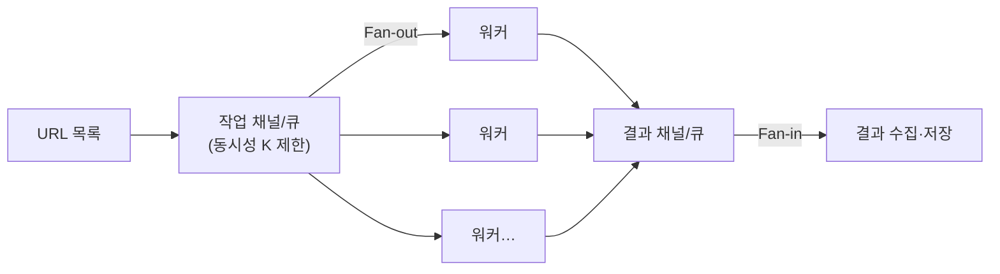

<figure class="post-figure post-figure--header">
<svg role="img" aria-label="실전 통합 프로젝트 개념 그림. 왼쪽의 대량 URL 목록이 작업 채널/큐를 통해 가운데의 워커 풀(여러 워커가 각자 HTTP 요청→응답 처리)로 분배되고, 처리 결과가 오른쪽의 결과 저장소로 모인다. 맨 아래에는 Python(asyncio·단일 실행자)과 Go(고루틴·채널) 두 파이프라인이 나란히 그려져 서로 비교된다. 꼭대기에는 완주 깃발이 있다." viewBox="0 0 680 300" xmlns="http://www.w3.org/2000/svg">
  <title>실전 통합 — 대량 URL → 워커 풀(HTTP 요청·응답) → 결과 저장소, Python과 Go로 나란히 구현</title>

  <!-- ===== Input ===== -->
  <rect x="24" y="60" width="110" height="60" rx="6" fill="var(--bg-light)" stroke="var(--accent-color)" stroke-width="2.5"/>
  <text x="79" y="82" text-anchor="middle" font-size="9" fill="currentColor" font-weight="700">대량 URL 목록</text>
  <text x="79" y="98" text-anchor="middle" font-size="7.5" fill="currentColor" opacity="0.8">수천 개</text>

  <!-- ===== Worker pool ===== -->
  <rect x="210" y="44" width="150" height="120" rx="6" fill="var(--bg-panel)" stroke="var(--accent-color)" stroke-width="2"/>
  <text x="285" y="62" text-anchor="middle" font-size="10" fill="currentColor" font-weight="700">워커 풀</text>
  <g font-size="8" font-weight="700" fill="currentColor">
    <rect x="222" y="72" width="126" height="20" rx="3" fill="var(--bg-light)" stroke="currentColor" stroke-width="1.3"/><text x="285" y="86" text-anchor="middle">HTTP 요청 → 응답</text>
    <rect x="222" y="98" width="126" height="20" rx="3" fill="var(--bg-light)" stroke="currentColor" stroke-width="1.3"/><text x="285" y="112" text-anchor="middle">HTTP 요청 → 응답</text>
    <rect x="222" y="124" width="126" height="20" rx="3" fill="var(--bg-light)" stroke="currentColor" stroke-width="1.3"/><text x="285" y="138" text-anchor="middle">HTTP 요청 → 응답</text>
  </g>
  <line x1="134" y1="90" x2="210" y2="90" stroke="var(--secondary-color)" stroke-width="2" marker-end="url(#cap-arrow)"/>

  <!-- ===== Output ===== -->
  <rect x="436" y="60" width="120" height="60" rx="6" fill="var(--bg-light)" stroke="var(--gold)" stroke-width="2.5"/>
  <text x="496" y="82" text-anchor="middle" font-size="9" fill="currentColor" font-weight="700">결과 저장소</text>
  <text x="496" y="98" text-anchor="middle" font-size="7.5" fill="currentColor" opacity="0.8">제목·상태·본문 길이</text>
  <line x1="360" y1="90" x2="436" y2="90" stroke="currentColor" stroke-width="2" marker-end="url(#cap-arrow)"/>

  <!-- ===== two implementations ===== -->
  <text x="205" y="218" text-anchor="middle" font-size="9" fill="currentColor" font-weight="700" opacity="0.8">Python</text>
  <rect x="252" y="200" width="130" height="34" rx="4" fill="var(--bg-light)" stroke="currentColor" stroke-width="1.6"/><text x="317" y="215" text-anchor="middle" font-size="8" fill="currentColor" font-weight="700">asyncio + worker pool</text><text x="317" y="227" text-anchor="middle" font-size="7" fill="currentColor" opacity="0.75">단일 실행자 · 비동기 I/O</text>
  <text x="400" y="218" text-anchor="middle" font-size="9" fill="currentColor" font-weight="700" opacity="0.8">Go</text>
  <rect x="437" y="200" width="130" height="34" rx="4" fill="var(--bg-light)" stroke="var(--secondary-color)" stroke-width="1.6"/><text x="502" y="215" text-anchor="middle" font-size="8" fill="currentColor" font-weight="700">고루틴 + 채널</text><text x="502" y="227" text-anchor="middle" font-size="7" fill="currentColor" opacity="0.75">워커 풀 · 채널 파이프라인</text>

  <!-- summit flag -->
  <line x1="610" y1="120" x2="610" y2="60" stroke="var(--gold)" stroke-width="2.5"/>
  <path d="M610,62 L650,72 L610,82 z" fill="var(--gold)" stroke="var(--gold)" stroke-width="1.5"/>
  <text x="660" y="66" text-anchor="middle" font-size="9" fill="var(--gold)" font-weight="700" opacity="0.95">완주 🎉</text>

  <defs>
    <marker id="cap-arrow" markerWidth="8" markerHeight="8" refX="6" refY="4" orient="auto">
      <path d="M0,0 L8,4 L0,8 z" fill="var(--secondary-color)"/>
    </marker>
  </defs>
</svg>
<figcaption>실전 통합 프로젝트 — 수천 개의 URL을 **워커 풀**로 크롤링해(HTTP 요청·응답) 결과를 저장하는 파이프라인을, Python(asyncio 기반)과 Go(고루틴·채널 기반)로 **각각 구현**해 비교합니다. 이 한 문제에 1~5단계의 모든 개념이 들어 있습니다.</figcaption>
</figure>

## 한눈에 보기

마지막 단계입니다. 1~5단계에서 배운 **동시성 기초 → 경량 스레드/고루틴 → 병렬화 → 동기화 → 통신**을 하나의 실전 문제에 통합합니다.

**프로젝트: "대량 URL 크롤러"** — 수천 개의 URL에서 페이지 제목과 본문 길이를 수집하는 워커 풀을 만듭니다. 요구사항:

1. 동시성을 제한(워커 풀)해 상대 서버를 폭주시키지 않는다.
2. 실패한 요청은 안전하게 처리하고 결과를 수집한다.
3. 같은 명세를 **Python과 Go 각각** 구현해 성능·코드를 비교한다.

파이썬 쪽은 [Asyncio Eventloop Optimization](/2025/11/10/asyncio-eventloop-optimization.html)에서 본 `asyncio`를 **재사용**합니다.

## 워커 풀(Worker Pool) 패턴

전체 시리즈에서 여러 번 등장한 **동시성 수준 제한**이 이 프로젝트의 중심입니다. 무제한으로 요청을 보내면 서버가 고장 나거나 네트워크가 막히므로, 동시에 실행할 워커 수를 정해두고 그 한도 안에서 작업을 처리합니다.



- **파이썬**: `ThreadPoolExecutor(max_workers=K)` 또는 `asyncio.Semaphore(K)`로 동시성을 K로 제한.
- **Go**: 버퍼 채널 세마포어(`make(chan struct{}, K)`) 또는 고정 워커 N개 + 작업 채널.

## 구현 1 — Python (asyncio + Semaphore)

파이썬은 **비동기(asyncio)** 로 이 프로젝트를 푸는 것이 가장 확장적입니다. 단일 이벤트 루프 위에서 코루틴 수백 수천 개가 I/O를 기다리며 겹쳐 실행됩니다. 동시성 상한은 `asyncio.Semaphore`로 잡습니다.

```python
import asyncio, aiohttp, urllib.parse, re

TITLE_RE = re.compile(r"<title[^>]*>(.*?)</title>", re.I | re.S)

async def fetch_one(session, sem, url, results):
    async with sem:                     # 동시성 K 제한 (워커 풀 역할)
        try:
            async with session.get(url, timeout=3) as resp:
                body = await resp.read()
                m = TITLE_RE.search(body.decode("utf-8", "ignore"))
                title = m.group(1).strip()[:80] if m else "(no title)"
                results.append((url, resp.status, len(body), title))
        except Exception as e:
            results.append((url, 0, 0, f"error: {type(e).__name__}"))

async def main(urls, concurrency=50):
    sem = asyncio.Semaphore(concurrency)
    results = []
    async with aiohttp.ClientSession() as session:
        # asyncio.gather: 코루틴을 겹쳐(concurrently) 실행
        await asyncio.gather(*(fetch_one(session, sem, u, results) for u in urls))
    return results

if __name__ == "__main__":
    urls = [f"https://example.com?p={i}" for i in range(200)]
    res = asyncio.run(main(urls))
    print(f"성공 {len([r for r in res if r[1]==200])}/{len(res)}, 총 {sum(r[2] for r in res)} 바이트")
```

포트:
- `asyncio.Semaphore(K)`를 `async with`로 감싸 **동시 코루틴 수**를 제한합니다.
- `asyncio.gather(...)`가 여러 코루틴을 이벤트 루프에서 겹쳐 실행합니다.
- 비동기 HTTP는 `aiohttp`를, 순수 파이썬 고수준 동작은 [Asyncio Eventloop Optimization](/2025/11/10/asyncio-eventloop-optimization.html)을 참고합니다.

> **선택지 비교**: 워커 풀로는 `ThreadPoolExecutor`도 쓸 수 있지만, I/O가 압도적으로 많은 이 프로젝트에서는 `asyncio`가 스레드보다 **메모리·확장성 면에서 우월**합니다. 수천 개의 코루틴이 수 십 개의 OS 스레드보다 훨씬 가볍기 때문입니다. asyncio vs 스레드/프로세스의 비교는 [Python GIL](/2025/10/22/python-gil.html)에서 다룬 선택 기준을 그대로 재사용합니다.

## 구현 2 — Go (고루틴 + 채널)

Go는 **고루틴 + 채널**로 같은 문제를 푸는 것이 자연스럽습니다. 고정된 N개 워커 고루틴이 작업 채널에서 URL을 하나씩 꺼내 처리하고, 결과를 결과 채널로 보냅니다(Fan-out/Fan-in).

```go
package main

import (
    "fmt"
    "io"
    "net/http"
    "regexp"
    "strings"
    "sync"
    "time"
)

type Result struct {
    url     string
    status  int
    bodyLen int
    title   string
}

var titleRe = regexp.MustCompile(`(?is)<title[^>]*>(.*?)</title>`)

func worker(id int, jobs <-chan string, results chan<- Result, wg *sync.WaitGroup) {
    defer wg.Done()
    client := &http.Client{Timeout: 3 * time.Second}
    for url := range jobs {                // 작업 채널을 모두 소진
        resp, err := client.Get(url)
        if err != nil {
            results <- Result{url, 0, 0, "error: " + err.Error()}
            continue
        }
        body, _ := io.ReadAll(resp.Body)
        resp.Body.Close()
        title := "(no title)"
        if m := titleRe.FindSubmatch(body); m != nil {
            title = strings.TrimSpace(string(m[1]))
            if len(title) > 80 {
                title = title[:80]
            }
        }
        results <- Result{url, resp.StatusCode, len(body), title}
    }
}

func main() {
    const workers = 50                     // 동시성 수준 (워커 풀 크기)
    jobs := make(chan string, 1000)
    results := make(chan Result)

    var wg sync.WaitGroup
    for w := 0; w < workers; w++ {         // 워커 N개 시작 (Fan-out)
        wg.Add(1)
        go worker(w, jobs, results, &wg)
    }

    go func() {                            // 작업 넣고 닫기
        for i := 0; i < 200; i++ {
            jobs <- fmt.Sprintf("https://example.com?p=%d", i)
        }
        close(jobs)
    }()

    // 결과 수집 (Fan-in)
    go func() {
        wg.Wait()
        close(results)
    }()

    okCount, totalBytes := 0, 0
    for r := range results {
        if r.status == 200 {
            okCount++
        }
        totalBytes += r.bodyLen
    }
    fmt.Printf("성공 %d/200, 총 %d 바이트\n", okCount, totalBytes)
}
```

포트:
- `workers`를 50으로 두고 50개의 워커 고루틴을 만들어 **동시성 수준**을 확정합니다.
- 작업 채널(`jobs`)과 결과 채널(`results`)로 **Fan-out/Fan-in**을 구현합니다.
- `close(jobs)`/`close(results)`로 파이프라인 종료를 깔끔히 처리합니다.

## 성능과 코드 비교 — 회고

두 구현을 함께 실행해 볼 만한 관점을 정리합니다.

| 관점 | Python (asyncio) | Go (고루틴 + 채널) |
|---|---|---|
| 동시성 수준 제한 | `asyncio.Semaphore(K)` | 고정 워커 수 (`workers`) |
| 실행 단위 | 코루틴 (수천 개 가능) | 고루틴 (수천~십만 개 가능) |
| 코드 양 | 중간 (`async/await` 필요) | 중간 (채널 직접 제어) |
| 순서 보장 | `gather` 결과 순서 보존 가능 | Fan-in은 순서 비보장 (직접 정렬) |
| 배포/단독 실행 | 파일 하나 + `aiohttp` | 단일 바이너리 (의존성 없음) |
| 오류 격리 | 예외 처리 | 에러 반환·채널 전달 |

**실무 관점의 회고 (첫 번째 인상):**

- **Go의 배포 단순성**: 최종 산출물이 **단일 바이너리** 하나라, 크롤러 같은 도구를 서버/CI/컨테이너에 올릴 때 의존성 걱정이 없습니다. 파이썬은 런타임 + 패키지 환경을 갖춰가야 합니다.
- **asyncio의 문법 비용**: 파이썬은 `async/await`로 코드가 "전염성(contagious)"이 됩니다 — 호출 체인 전체를 코루틴화해야 합니다. Go는 고루틴을 그냥 `go`로 시작하기 때문에 기존 코드를 덜 바꿉니다.
- **순서 보장**: URL별 결과를 파일에 "원본 순서대로" 써야 한다면, 파이썬 `gather`의 순서 보존이 편리합니다. Go는 결과에 인덱스를 붙여 직접 정렬해야 합니다.
- **둘 다 충분히 빠르다**: 수백~수천 URL 수준에서는 두 언어 모두 수 초 안에 끝나며, 실행 단위의 개수(코루틴 vs 고루틴) 차이는 여기선 체감이 크지 않습니다. **동시성 수준을 견디는 서버** 쪽이 진짜 병목입니다.

## 전체 시리즈 정리

1~6단계를 관통하는 한 문장: **"작업의 특성(I/O vs CPU)과 언어의 철학(Python의 GIL·Go의 고루틴)을 이해하면, 동시성 도구 선택이 자연스러워진다."**

| 단계 | 핵심 개념 | Python 도구 | Go 도구 |
|---|---|---|---|
| 1 | 동시성 vs 병렬성 | (개념) | (개념) |
| 2 | 경량 실행 단위 | `threading`/`ThreadPoolExecutor` | `go` 고루틴 |
| 3 | CPU 병렬화 | `multiprocessing`/`ProcessPoolExecutor` | 고루틴 + `GOMAXPROCS` |
| 4 | 동기화 | `Lock`/`Semaphore`/`Event` | `sync.Mutex`/`WaitGroup`/`atomic` |
| 5 | 통신 | `Queue`/`Pipe` | 채널 + `select` |
| 6 | 통합 | `asyncio` 워커 풀 | 고루틴 워커 풀 |

이 두 언어를 짝지어 학습한 가장 큰 소득은, **동시성 개념이 언어에 얽매이지 않는다**는 확신입니다. 같은 구조(Fan-out/Fan-in, 워커 풀, 동시성 제한)가 두 언어에서 모습만 달리할 뿐입니다.

## Summary

- **워커 풀** — 동시성 수준을 K로 제한하며 대량 작업을 처리하는 패턴. 상대 서버 폭주를 막는 핵심.
- 파이썬은 **`asyncio` + `Semaphore`** 로 수천 코루틴을 겹쳐 실행하고, Go는 **고정 워커 + 채널**로 Fan-out/Fan-in을 구현합니다.
- 성능 자체는 둘 다 빠르지만, Go는 **단일 바이너리**, 파이썬은 **순서 보존(`gather`)** 등 운영·개발 경험이 다릅니다.
- **1~6단계의 모든 개념(동시성 모델·경량 실행 단위·병렬화·동기화·통신)** 이 이 한 프로젝트에 들어 있습니다.

### 다음 학습 (Next Learning)

이 시리즈를 모두 통과했다면, 동시성을 **분산(distributed)** 영역으로 확장해 보세요.

- [Ray Essential Curriculum](/2026/08/24/ray-essential-curriculum.html) — 이 시리즈에서 다진 프로세스·스레드·GIL·통신 개념을 그대로 **분산 수준으로 일반화**하는 후속 시리즈. `@ray.remote` 한 줄로 Task/Actor를 노트북에서 클러스터로 확장합니다.
- [Django 와 Celery 를 이용한 대규모 작업 분산처리](/2025/11/10/django-와-celery-를-이용한-대규모-작업-분산처리.html) — 한 머신의 동시성을 여러 머신(메시지 브로커) 작업 큐로 확장.
- [Rust 스마트 포인터, 동시성, 그리고 프로젝트](/2026/01/09/rust-smart-pointers-concurrency-and-projects.html) — `Send`/`Sync`로 컴파일 타임에 동시성 안전을 보장하는 또 다른 언어 비교.
- [Python GIL](/2025/10/22/python-gil.html) — 이 시리즈의 파이썬 면 토대를 한 번 더 훑어보기.
