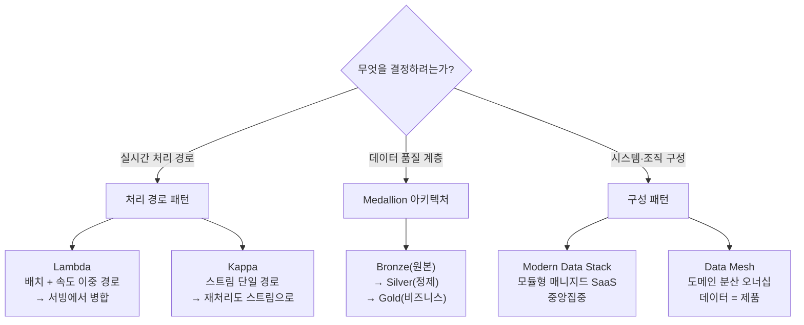

<figure class="post-figure post-figure--header">
<svg role="img" aria-label="데이터 아키텍처 패턴 네 가지를 한 장으로 묶은 그림. 왼쪽 위에는 Lambda 아키텍처가 배치 경로와 속도(speed) 경로의 두 갈래로 갈렸다가 서빙 계층에서 합쳐지고, 그 아래 Kappa 아키텍처는 스트림 단일 경로로 곧장 흐른다. 가운데에는 Medallion 아키텍처가 Bronze→Silver→Gold의 세 계단으로 데이터 품질을 끌어올린다. 오른쪽에는 Data Mesh가 여러 도메인이 각자 데이터를 제품처럼 소유하고 공유 플랫폼 위에서 연합 거버넌스로 묶이는 격자로 표현된다." viewBox="0 0 680 300" xmlns="http://www.w3.org/2000/svg">
  <title>데이터 아키텍처 패턴 — Lambda·Kappa(처리 경로) · Medallion(품질 계단) · Data Mesh(도메인 격자)</title>

  <!-- ===== LEFT: Lambda (two paths merge) + Kappa (single path) ===== -->
  <text x="116" y="24" text-anchor="middle" font-size="12" fill="currentColor" font-weight="700" opacity="0.75">처리 경로</text>
  <!-- shared source -->
  <circle cx="30" cy="78" r="8" fill="none" stroke="currentColor" stroke-width="2"/>
  <text x="30" y="100" text-anchor="middle" font-size="8" fill="currentColor" opacity="0.7">원천</text>
  <!-- Lambda: batch path -->
  <line x1="40" y1="74" x2="66" y2="58" stroke="var(--secondary-color)" stroke-width="2" marker-end="url(#ap-arrow)"/>
  <rect x="70" y="44" width="58" height="28" rx="3" fill="var(--bg-light)" stroke="currentColor" stroke-width="1.8"/>
  <text x="99" y="62" text-anchor="middle" font-size="9" fill="currentColor" font-weight="700">배치</text>
  <!-- Lambda: speed path -->
  <line x1="40" y1="82" x2="66" y2="98" stroke="var(--secondary-color)" stroke-width="2" marker-end="url(#ap-arrow)"/>
  <rect x="70" y="84" width="58" height="28" rx="3" fill="var(--bg-light)" stroke="var(--accent-color)" stroke-width="2"/>
  <text x="99" y="102" text-anchor="middle" font-size="9" fill="currentColor" font-weight="700">속도</text>
  <!-- merge into serving -->
  <line x1="128" y1="58" x2="156" y2="74" stroke="var(--secondary-color)" stroke-width="2" marker-end="url(#ap-arrow)"/>
  <line x1="128" y1="98" x2="156" y2="80" stroke="var(--secondary-color)" stroke-width="2" marker-end="url(#ap-arrow)"/>
  <rect x="158" y="60" width="62" height="34" rx="3" fill="var(--bg-panel)" stroke="var(--gold)" stroke-width="2"/>
  <text x="189" y="80" text-anchor="middle" font-size="9" fill="currentColor" font-weight="700">서빙</text>
  <text x="116" y="132" text-anchor="middle" font-size="9.5" fill="currentColor" opacity="0.8" font-weight="700">Lambda — 두 경로가 합쳐짐</text>
  <!-- Kappa: single stream path -->
  <circle cx="30" cy="182" r="8" fill="none" stroke="currentColor" stroke-width="2"/>
  <line x1="40" y1="182" x2="66" y2="182" stroke="var(--secondary-color)" stroke-width="2" marker-end="url(#ap-arrow)"/>
  <rect x="70" y="168" width="86" height="28" rx="3" fill="var(--bg-light)" stroke="var(--accent-color)" stroke-width="2"/>
  <text x="113" y="186" text-anchor="middle" font-size="9" fill="currentColor" font-weight="700">스트림 (단일)</text>
  <line x1="156" y1="182" x2="184" y2="182" stroke="var(--secondary-color)" stroke-width="2" marker-end="url(#ap-arrow)"/>
  <rect x="186" y="168" width="40" height="28" rx="3" fill="var(--bg-panel)" stroke="var(--gold)" stroke-width="2"/>
  <text x="206" y="186" text-anchor="middle" font-size="8.5" fill="currentColor" font-weight="700">서빙</text>
  <text x="116" y="216" text-anchor="middle" font-size="9.5" fill="currentColor" opacity="0.8" font-weight="700">Kappa — 한 경로로 통일</text>

  <!-- divider -->
  <line x1="252" y1="40" x2="252" y2="236" stroke="currentColor" stroke-width="1" opacity="0.25"/>

  <!-- ===== MIDDLE: Medallion quality staircase ===== -->
  <text x="346" y="24" text-anchor="middle" font-size="12" fill="currentColor" font-weight="700" opacity="0.75">품질 계단</text>
  <rect x="276" y="178" width="78" height="46" rx="3" fill="var(--bg-light)" stroke="currentColor" stroke-width="1.8"/>
  <text x="315" y="198" text-anchor="middle" font-size="10" fill="currentColor" font-weight="700">Bronze</text>
  <text x="315" y="213" text-anchor="middle" font-size="8" fill="currentColor" opacity="0.8">원본 그대로</text>
  <rect x="312" y="130" width="78" height="94" rx="3" fill="var(--bg-light)" stroke="currentColor" stroke-width="1.8"/>
  <text x="351" y="150" text-anchor="middle" font-size="10" fill="currentColor" font-weight="700">Silver</text>
  <text x="351" y="165" text-anchor="middle" font-size="8" fill="currentColor" opacity="0.8">정제·정합</text>
  <rect x="348" y="82" width="78" height="142" rx="3" fill="var(--bg-light)" stroke="var(--accent-color)" stroke-width="2.5"/>
  <text x="387" y="102" text-anchor="middle" font-size="10" fill="currentColor" font-weight="700">Gold</text>
  <text x="387" y="117" text-anchor="middle" font-size="8" fill="currentColor" opacity="0.8">비즈니스용</text>
  <line x1="354" y1="170" x2="368" y2="150" stroke="var(--secondary-color)" stroke-width="2" marker-end="url(#ap-arrow)"/>
  <line x1="390" y1="122" x2="404" y2="102" stroke="var(--secondary-color)" stroke-width="2" marker-end="url(#ap-arrow)"/>
  <text x="346" y="244" text-anchor="middle" font-size="9.5" fill="currentColor" opacity="0.8" font-weight="700">Medallion — 품질이 한 단씩 ↑</text>

  <!-- divider -->
  <line x1="452" y1="40" x2="452" y2="236" stroke="currentColor" stroke-width="1" opacity="0.25"/>

  <!-- ===== RIGHT: Data Mesh domain grid ===== -->
  <text x="570" y="24" text-anchor="middle" font-size="12" fill="currentColor" font-weight="700" opacity="0.75">도메인 격자</text>
  <g font-size="8.5" font-weight="700">
    <rect x="478" y="44" width="84" height="40" rx="3" fill="var(--bg-panel)" stroke="currentColor" stroke-width="1.8"/>
    <text x="520" y="62" text-anchor="middle" fill="currentColor">주문 도메인</text>
    <text x="520" y="76" text-anchor="middle" font-size="7.5" font-weight="400" fill="currentColor" opacity="0.8">데이터 = 제품</text>
    <rect x="576" y="44" width="84" height="40" rx="3" fill="var(--bg-panel)" stroke="currentColor" stroke-width="1.8"/>
    <text x="618" y="62" text-anchor="middle" fill="currentColor">결제 도메인</text>
    <text x="618" y="76" text-anchor="middle" font-size="7.5" font-weight="400" fill="currentColor" opacity="0.8">데이터 = 제품</text>
    <rect x="478" y="94" width="84" height="40" rx="3" fill="var(--bg-panel)" stroke="currentColor" stroke-width="1.8"/>
    <text x="520" y="112" text-anchor="middle" fill="currentColor">물류 도메인</text>
    <text x="520" y="126" text-anchor="middle" font-size="7.5" font-weight="400" fill="currentColor" opacity="0.8">데이터 = 제품</text>
    <rect x="576" y="94" width="84" height="40" rx="3" fill="var(--bg-panel)" stroke="currentColor" stroke-width="1.8"/>
    <text x="618" y="112" text-anchor="middle" fill="currentColor">마케팅 도메인</text>
    <text x="618" y="126" text-anchor="middle" font-size="7.5" font-weight="400" fill="currentColor" opacity="0.8">데이터 = 제품</text>
  </g>
  <!-- shared self-serve platform under the domains -->
  <rect x="478" y="148" width="182" height="30" rx="3" fill="var(--bg-light)" stroke="var(--accent-color)" stroke-width="2"/>
  <text x="569" y="167" text-anchor="middle" font-size="9" fill="currentColor" font-weight="700">셀프서비스 플랫폼</text>
  <!-- federated governance ring -->
  <rect x="478" y="184" width="182" height="30" rx="3" fill="var(--bg-panel)" stroke="var(--gold)" stroke-width="2"/>
  <text x="569" y="203" text-anchor="middle" font-size="9" fill="currentColor" font-weight="700">연합 거버넌스</text>
  <text x="570" y="232" text-anchor="middle" font-size="9.5" fill="currentColor" opacity="0.8" font-weight="700">Data Mesh — 분산 오너십</text>

  <defs>
    <marker id="ap-arrow" markerWidth="8" markerHeight="8" refX="6" refY="4" orient="auto">
      <path d="M0,0 L8,4 L0,8 z" fill="var(--secondary-color)"/>
    </marker>
  </defs>
</svg>
<figcaption>이 글이 다루는 네 패턴의 한 장 요약 — 왼쪽은 <strong>처리 경로</strong>(Lambda는 배치+속도 두 경로가 서빙에서 합쳐지고, Kappa는 스트림 한 경로로 통일), 가운데는 <strong>품질 계단</strong>(Medallion: Bronze→Silver→Gold), 오른쪽은 <strong>도메인 격자</strong>(Data Mesh: 도메인마다 데이터를 제품으로 소유하고 공유 플랫폼·연합 거버넌스로 묶음). 패턴은 서로 다른 축을 푼다.</figcaption>
</figure>

## 들어가며

지금까지 이 시리즈에서 수집·저장·변환·오케스트레이션이라는 **개별 부품**을 하나씩 살펴봤다면, 이번 글은 그 부품들을 **어떻게 조립할 것인가**를 다룹니다. 같은 Kafka, 같은 Spark, 같은 레이크하우스를 쓰더라도, 그것들을 어떤 모양으로 엮느냐에 따라 시스템의 성격이 완전히 달라집니다. 실시간성을 위해 경로를 둘로 나눌 것인가 하나로 합칠 것인가, 데이터 품질을 어느 지점에서 끌어올릴 것인가, 데이터의 소유권을 중앙에 둘 것인가 도메인에 분산할 것인가 — 이런 큰 결정들이 곧 **데이터 아키텍처 패턴**입니다.

이 글은 `Data-Engineering-Essential` 시리즈의 7단계로, 현장에서 가장 자주 언급되는 네 가지 패턴을 다룹니다. **Lambda와 Kappa**는 배치와 스트림을 어떻게 조합할지를, **Medallion**은 데이터 품질을 어떻게 단계적으로 끌어올릴지를, **Modern Data Stack과 Data Mesh**는 시스템과 조직을 어떻게 구성할지를 푸는 패턴입니다. 중요한 것은 정답을 외우는 것이 아니라, 각 패턴이 **무엇을 풀고 그 대가로 무엇을 포기하는지**를 보는 눈입니다.

### 📌 이 글에서 다루는 내용

#### 🔍 핵심 주제

- **Lambda vs Kappa**: 배치+속도 이중 경로 vs 스트림 단일 경로, 그리고 각각의 트레이드오프
- **Medallion 아키텍처**: Bronze→Silver→Gold로 품질을 끌어올리는 계층 구조와 레이크하우스
- **Modern Data Stack**: 매니지드 SaaS를 레고처럼 조립하는 모듈형 클라우드 스택
- **Data Mesh**: 도메인 중심 분산 데이터 오너십과 그 4가지 원칙

#### 🎯 왜 중요한가

도구는 바뀌어도 **시스템을 엮는 구조의 결정**은 오래 남습니다. 패턴을 알면 "우리 요구(지연·규모·조직)에는 어떤 모양이 맞는가"를 트레이드오프 관점에서 판단할 수 있고, 유행하는 아키텍처를 무비판적으로 따라가지 않게 됩니다.

## 한눈에 보기 — 네 패턴의 자리

네 패턴은 서로 경쟁하는 대안이 아니라, **서로 다른 질문에 답하는** 도구입니다. 먼저 전체 지도를 그려 두면 세부가 자리를 잡습니다. 처리 경로(Lambda/Kappa)는 "실시간을 어떻게 얻는가"를, Medallion은 "품질을 어디서 끌어올리는가"를, MDS/Data Mesh는 "시스템과 조직을 어떻게 구성하는가"를 묻습니다.

## 1. Lambda vs Kappa — 배치와 스트림을 어떻게 엮는가

실시간 분석이 필요해지면 가장 먼저 부딪히는 설계 문제가 있습니다. **배치 처리는 정확하지만 느리고, 스트림 처리는 빠르지만 다루기 까다롭다.** 어제까지의 매출은 야간 배치로 정확하게 집계할 수 있지만, "지금 이 순간의 거래량"은 배치로는 얻을 수 없습니다. 반대로 스트림만으로 모든 것을 처리하자니 과거 데이터 전체를 다시 계산(재처리)하거나 복잡한 집계를 정확히 맞추는 일이 부담스럽습니다. Lambda와 Kappa는 이 긴장을 서로 다르게 푼 두 아키텍처입니다.

### Lambda 아키텍처 — 두 경로를 병렬로

Nathan Marz가 제안한 **Lambda 아키텍처**는 "정확성과 속도를 둘 다 갖자"는 발상에서 출발해, 데이터를 **두 개의 경로로 동시에** 흘려보냅니다.

- **배치 레이어(Batch Layer)**: 전체 원본 데이터를 보관하고, 주기적으로 처음부터 다시 계산해 **정확한 배치 뷰**를 만듭니다. 느리지만 신뢰할 수 있고, 코드 버그가 있어도 재계산으로 바로잡을 수 있습니다.
- **속도 레이어(Speed Layer)**: 방금 도착해 배치가 아직 반영하지 못한 데이터만 스트림으로 처리해 **실시간 뷰**를 만듭니다. 근사치여도 좋으니 **지연을 메우는** 역할입니다.
- **서빙 레이어(Serving Layer)**: 쿼리가 들어오면 배치 뷰(과거)와 실시간 뷰(최근)를 **합쳐서** 응답합니다.

핵심 아이디어는 "정확한 배치가 따라잡는 동안, 그 빈틈을 속도 레이어가 임시로 메운다"는 것입니다. 배치가 한 바퀴 돌면 속도 레이어가 만든 근사치는 정확한 값으로 덮어쓰여 사라집니다.

> **Lambda의 대가**: 같은 비즈니스 로직을 **배치용과 스트림용으로 두 번** 구현·유지해야 합니다. 두 코드베이스가 미묘하게 어긋나면 같은 질문에 다른 답이 나오고, 디버깅·테스트·운영 부담이 두 배가 됩니다. 이 "이중 구현"이 Lambda의 가장 큰 비판점입니다.

### Kappa 아키텍처 — 스트림 하나로 통일

Jay Kreps(Kafka 창시자)가 제안한 **Kappa 아키텍처**는 Lambda의 이중 구현을 정면으로 겨냥합니다. 발상은 단순합니다 — **배치 레이어를 없애고, 모든 것을 스트림 처리 하나로 처리하자.**

비결은 **로그(log)를 진실의 원천**으로 삼는 데 있습니다. Kafka 같은 로그에 이벤트를 충분히 길게(또는 영구히) 보관해 두면, "과거 데이터 재처리"는 별도의 배치 시스템이 아니라 **같은 스트림 처리 코드를 로그의 처음부터 다시 돌리는 것**으로 해결됩니다. 로직을 고치고 싶으면, 새 버전의 스트림 잡을 로그 시작점부터 재생(replay)시켜 새 결과 뷰를 만든 뒤 전환하면 됩니다.

| 구분 | Lambda | Kappa |
| --- | --- | --- |
| 경로 | 배치 + 속도, **이중** | 스트림, **단일** |
| 코드 | 배치용·스트림용 **두 벌** | **한 벌** |
| 재처리 | 배치 레이어가 처음부터 재계산 | 로그를 **재생(replay)** |
| 정확성 | 배치가 최종 정답 보장 | 스트림 정확성에 의존 |
| 복잡도 | 두 시스템 동기화 부담 | 단순하나 로그 보관·스트림 정확성이 관건 |
| 적합 | 무겁고 정확한 배치 집계가 핵심 | 실시간이 일급 시민, 로직이 스트림에 적합 |

<figure class="post-figure">
<svg role="img" aria-label="Lambda와 Kappa 아키텍처를 위아래로 나란히 비교한 그림. 위쪽 Lambda는 하나의 원천에서 데이터가 두 갈래로 갈라져, 위 갈래는 배치 레이어에서 전체를 다시 계산해 정확한 배치 뷰를 만들고, 아래 갈래는 속도 레이어에서 최근 데이터만 빠르게 처리해 실시간 뷰를 만든 뒤, 서빙 레이어에서 두 뷰를 병합해 쿼리에 응답한다. 같은 로직을 두 벌 구현해야 한다는 점이 강조된다. 아래쪽 Kappa는 원천 이벤트가 로그에 쌓이고, 단 하나의 스트림 처리 경로가 그 로그를 읽어 결과 뷰를 만들며, 재처리가 필요하면 같은 코드로 로그를 처음부터 재생한다. 코드가 한 벌이라는 점이 강조된다." viewBox="0 0 680 360" xmlns="http://www.w3.org/2000/svg">
  <title>Lambda vs Kappa — 이중 경로(코드 두 벌)와 단일 스트림(코드 한 벌)의 대비</title>

  <!-- ===== LAMBDA (top) ===== -->
  <text x="40" y="28" text-anchor="start" font-size="13" fill="currentColor" font-weight="700">Lambda</text>
  <text x="120" y="28" text-anchor="start" font-size="9" fill="currentColor" opacity="0.7">배치 + 속도, 두 경로 — 코드 두 벌</text>

  <!-- source -->
  <circle cx="56" cy="96" r="10" fill="none" stroke="currentColor" stroke-width="2"/>
  <text x="56" y="124" text-anchor="middle" font-size="9" fill="currentColor" opacity="0.7">원천</text>
  <!-- split arrows -->
  <line x1="68" y1="90" x2="138" y2="66" stroke="var(--secondary-color)" stroke-width="2.5" marker-end="url(#lk-arrow)"/>
  <line x1="68" y1="102" x2="138" y2="126" stroke="var(--secondary-color)" stroke-width="2.5" marker-end="url(#lk-arrow)"/>

  <!-- batch layer -->
  <rect x="142" y="46" width="156" height="44" rx="3" fill="var(--bg-light)" stroke="currentColor" stroke-width="2"/>
  <text x="220" y="66" text-anchor="middle" font-size="11" fill="currentColor" font-weight="700">배치 레이어</text>
  <text x="220" y="82" text-anchor="middle" font-size="8.5" fill="currentColor" opacity="0.8">전체 재계산 · 느리나 정확</text>
  <!-- speed layer -->
  <rect x="142" y="104" width="156" height="44" rx="3" fill="var(--bg-light)" stroke="var(--accent-color)" stroke-width="2.5"/>
  <text x="220" y="124" text-anchor="middle" font-size="11" fill="currentColor" font-weight="700">속도 레이어</text>
  <text x="220" y="140" text-anchor="middle" font-size="8.5" fill="currentColor" opacity="0.8">최근분만 · 빠르나 근사</text>

  <!-- views -->
  <line x1="298" y1="68" x2="326" y2="78" stroke="var(--secondary-color)" stroke-width="2.5" marker-end="url(#lk-arrow)"/>
  <line x1="298" y1="126" x2="326" y2="116" stroke="var(--secondary-color)" stroke-width="2.5" marker-end="url(#lk-arrow)"/>
  <rect x="330" y="50" width="100" height="40" rx="3" fill="var(--bg-panel)" stroke="currentColor" stroke-width="1.8"/>
  <text x="380" y="68" text-anchor="middle" font-size="9.5" fill="currentColor" font-weight="700">배치 뷰</text>
  <text x="380" y="82" text-anchor="middle" font-size="8" fill="currentColor" opacity="0.8">과거 (정답)</text>
  <rect x="330" y="104" width="100" height="40" rx="3" fill="var(--bg-panel)" stroke="currentColor" stroke-width="1.8"/>
  <text x="380" y="122" text-anchor="middle" font-size="9.5" fill="currentColor" font-weight="700">실시간 뷰</text>
  <text x="380" y="136" text-anchor="middle" font-size="8" fill="currentColor" opacity="0.8">최근 (빈틈 메움)</text>

  <!-- serving merge -->
  <line x1="430" y1="70" x2="466" y2="88" stroke="var(--secondary-color)" stroke-width="2.5" marker-end="url(#lk-arrow)"/>
  <line x1="430" y1="124" x2="466" y2="106" stroke="var(--secondary-color)" stroke-width="2.5" marker-end="url(#lk-arrow)"/>
  <rect x="470" y="70" width="124" height="54" rx="3" fill="var(--bg-panel)" stroke="var(--gold)" stroke-width="2.5"/>
  <text x="532" y="92" text-anchor="middle" font-size="11" fill="currentColor" font-weight="700">서빙 레이어</text>
  <text x="532" y="108" text-anchor="middle" font-size="8.5" fill="currentColor" opacity="0.85">배치 뷰 + 실시간 뷰 병합</text>
  <line x1="594" y1="97" x2="624" y2="97" stroke="var(--secondary-color)" stroke-width="2.5" marker-end="url(#lk-arrow)"/>
  <text x="636" y="100" text-anchor="middle" font-size="9" fill="currentColor" opacity="0.75">쿼리</text>

  <!-- divider -->
  <line x1="40" y1="190" x2="640" y2="190" stroke="currentColor" stroke-width="1" opacity="0.25"/>

  <!-- ===== KAPPA (bottom) ===== -->
  <text x="40" y="226" text-anchor="start" font-size="13" fill="currentColor" font-weight="700">Kappa</text>
  <text x="120" y="226" text-anchor="start" font-size="9" fill="currentColor" opacity="0.7">스트림 단일 경로 — 코드 한 벌</text>

  <!-- source -->
  <circle cx="56" cy="288" r="10" fill="none" stroke="currentColor" stroke-width="2"/>
  <text x="56" y="316" text-anchor="middle" font-size="9" fill="currentColor" opacity="0.7">원천</text>
  <line x1="68" y1="288" x2="98" y2="288" stroke="var(--secondary-color)" stroke-width="2.5" marker-end="url(#lk-arrow)"/>

  <!-- log -->
  <rect x="102" y="262" width="140" height="52" rx="3" fill="var(--bg-light)" stroke="var(--accent-color)" stroke-width="2.5"/>
  <text x="172" y="284" text-anchor="middle" font-size="11" fill="currentColor" font-weight="700">로그 (Kafka)</text>
  <text x="172" y="300" text-anchor="middle" font-size="8.5" fill="currentColor" opacity="0.8">진실의 원천 · 장기 보관</text>
  <line x1="242" y1="288" x2="276" y2="288" stroke="var(--secondary-color)" stroke-width="2.5" marker-end="url(#lk-arrow)"/>

  <!-- single stream processor -->
  <rect x="280" y="262" width="150" height="52" rx="3" fill="var(--bg-light)" stroke="currentColor" stroke-width="2"/>
  <text x="355" y="284" text-anchor="middle" font-size="11" fill="currentColor" font-weight="700">스트림 처리 (단일)</text>
  <text x="355" y="300" text-anchor="middle" font-size="8.5" fill="currentColor" opacity="0.8">코드 한 벌</text>
  <line x1="430" y1="288" x2="464" y2="288" stroke="var(--secondary-color)" stroke-width="2.5" marker-end="url(#lk-arrow)"/>

  <!-- result view -->
  <rect x="468" y="262" width="126" height="52" rx="3" fill="var(--bg-panel)" stroke="var(--gold)" stroke-width="2.5"/>
  <text x="531" y="284" text-anchor="middle" font-size="11" fill="currentColor" font-weight="700">결과 뷰</text>
  <text x="531" y="300" text-anchor="middle" font-size="8.5" fill="currentColor" opacity="0.85">서빙</text>
  <line x1="594" y1="288" x2="624" y2="288" stroke="var(--secondary-color)" stroke-width="2.5" marker-end="url(#lk-arrow)"/>
  <text x="636" y="291" text-anchor="middle" font-size="9" fill="currentColor" opacity="0.75">쿼리</text>

  <!-- replay loop -->
  <path d="M280,308 C220,348 172,338 172,320" fill="none" stroke="currentColor" stroke-width="1.8" stroke-dasharray="4 4" opacity="0.7" marker-end="url(#lk-arrow-d)"/>
  <text x="244" y="346" text-anchor="middle" font-size="8.5" fill="currentColor" opacity="0.75">재처리 = 로그 재생(replay)</text>

  <defs>
    <marker id="lk-arrow" markerWidth="8" markerHeight="8" refX="6" refY="4" orient="auto">
      <path d="M0,0 L8,4 L0,8 z" fill="var(--secondary-color)"/>
    </marker>
    <marker id="lk-arrow-d" markerWidth="8" markerHeight="8" refX="6" refY="4" orient="auto">
      <path d="M0,0 L8,4 L0,8 z" fill="currentColor"/>
    </marker>
  </defs>
</svg>
<figcaption>Lambda(위)는 원천에서 데이터를 <strong>배치 레이어</strong>(정확)와 <strong>속도 레이어</strong>(빠른 근사)로 갈라 흘린 뒤 서빙에서 두 뷰를 병합한다 — 같은 로직을 두 벌 구현하는 대가를 치른다. Kappa(아래)는 로그를 진실의 원천으로 삼아 <strong>스트림 처리 한 벌</strong>로 통일하고, 재처리가 필요하면 같은 코드로 로그를 처음부터 재생한다.</figcaption>
</figure>

현실에서는 레이크하우스의 테이블 포맷(Delta·Iceberg·Hudi)이 배치와 스트림을 한 저장소에서 다루게 해 주면서, Lambda의 이중 구현 부담은 점점 줄어드는 추세입니다. 그럼에도 "정확성을 보장하는 무거운 배치가 반드시 필요한가, 아니면 스트림 하나로 충분한가"라는 근본 질문은 여전히 유효하고, 그 답에 따라 Lambda와 Kappa 사이에서 자리를 잡게 됩니다.

## 2. Medallion 아키텍처 — 품질을 계단처럼 끌어올리기

Lambda/Kappa가 "어떤 경로로 처리할 것인가"의 패턴이라면, **Medallion 아키텍처**는 "데이터 품질을 어디서 어떻게 끌어올릴 것인가"의 패턴입니다. Databricks가 레이크하우스 위에서의 모범 사례로 대중화한 이 패턴은, 데이터를 한 번에 완성하려 하지 않고 **세 개의 계층(layer)을 거치며 한 단씩 정제**합니다. 메달 색깔(동·은·금)에서 이름을 따왔습니다.

### Bronze — 원본 그대로 (Raw)

원천에서 들어온 데이터를 **거의 손대지 않고 그대로** 적재하는 계층입니다. 형태 불문, 스키마 강제 없이 일단 받아 두는 것이 핵심입니다. 수집 메타데이터(적재 시각, 원천 식별자 등)만 덧붙입니다. Bronze가 원본을 보존하므로, 하류 로직이 바뀌어도 **여기서부터 다시 변환**할 수 있습니다. ELT의 "원본 보존" 철학이 그대로 녹아 있습니다.

### Silver — 정제·정합 (Cleansed/Conformed)

Bronze의 원본을 **정제하고 정합**시키는 계층입니다. 타입 정리, 중복 제거, 결측·이상치 처리, 여러 원천의 통합(조인), 공통 키 정합 등이 여기서 일어납니다. Silver는 "신뢰할 수 있는, 분석 가능한 형태"의 데이터로, 데이터 사이언티스트나 엔지니어가 직접 다루기 좋은 계층입니다. **엔터프라이즈 차원의 일관된 뷰**가 이 단계에서 만들어집니다.

### Gold — 비즈니스용 (Curated)

특정 비즈니스 목적에 맞게 **집계·가공된** 최종 계층입니다. 부서별 매출 마트, BI 대시보드용 집계 테이블, ML 피처 테이블처럼 **바로 소비되는** 형태입니다. 스타 스키마 같은 차원 모델이 흔히 이 단계에 자리합니다. Gold는 "누가 봐도 의미가 명확한, 의사결정에 바로 쓰는" 데이터입니다.

이 패턴이 강력한 이유는 **단계적 신뢰**에 있습니다. 각 계층이 명확한 책임을 가지므로, "이 테이블은 어느 정도 믿어도 되는가"가 계층 이름만으로 드러납니다. 또 각 계층이 입력을 보존하므로 변환을 **재현·디버깅**하기 쉽고, 문제가 생기면 어느 계층에서 잘못됐는지 추적하기 쉽습니다.

**레이크하우스와의 결합**이 특히 자연스럽습니다. 세 계층을 모두 값싼 오브젝트 스토리지 위의 테이블 포맷(Delta·Iceberg·Hudi)으로 두면, ACID 트랜잭션·스키마 진화·시간여행의 신뢰성을 누리면서도 레이크의 저비용·유연성을 유지할 수 있습니다. Bronze→Silver→Gold 변환을 dbt나 Spark로 표현하고 오케스트레이터로 묶으면, 앞 글들에서 본 부품들이 하나의 품질 파이프라인으로 정렬됩니다.

> 💡 계층 수는 절대적이지 않습니다. 작은 조직은 Silver와 Gold를 합치기도 하고, 큰 조직은 Gold 위에 도메인별 마트를 더 두기도 합니다. 핵심은 "품질을 한 번에 완성하지 말고 단계로 나눠 책임을 분리하라"는 원칙입니다.

## 3. Modern Data Stack & Data Mesh — 시스템과 조직을 어떻게 구성하는가

마지막 축은 처리나 품질이 아니라 **시스템 전체와 조직을 어떻게 구성하는가**입니다. 여기서 두 흐름이 대비됩니다. 하나는 좋은 매니지드 서비스를 조립하는 기술적 구성(Modern Data Stack)이고, 다른 하나는 데이터의 소유권 자체를 재배치하는 조직적 구성(Data Mesh)입니다.

### Modern Data Stack — 매니지드 SaaS의 조립

**Modern Data Stack(MDS)**은 2단계 글에서 본 것처럼, 클라우드 데이터 웨어하우스를 중심에 두고 **모듈형 매니지드 SaaS를 레고처럼 조립**하는 구성입니다. 직접 인프라를 구축하는 대신, 각 계층마다 잘 만들어진 전문 서비스를 골라 끼웁니다.

- **수집**: Fivetran·Airbyte 같은 매니지드 커넥터
- **저장·연산**: Snowflake·BigQuery·Redshift 같은 클라우드 DW(또는 레이크하우스)
- **변환**: dbt — SQL 기반 변환을 모델·테스트·문서와 함께 관리
- **서빙**: Looker·Tableau 등 BI, 그리고 역 ETL

MDS의 강점은 **낮은 진입 장벽과 빠른 구축**입니다. 작은 팀도 SQL만 잘 다루면 견고한 분석 스택을 며칠 안에 세울 수 있습니다. 다만 데이터의 **소유권과 책임은 여전히 중앙의 데이터 팀**에 모입니다. 이 중앙집중이 조직이 커질수록 병목이 됩니다 — 모든 도메인의 데이터 요청이 한 팀의 백로그로 몰리기 때문입니다.

### Data Mesh — 도메인 중심 분산 오너십

**Data Mesh**는 Zhamak Dehghani가 제안한, 기술보다 **조직과 책임 구조**에 관한 패턴입니다. 출발점은 중앙집중 데이터 팀의 한계입니다. 회사가 커지면 중앙 팀은 모든 도메인의 맥락을 알 수도 없고, 모든 요청을 처리할 수도 없어 거대한 병목이 됩니다. Data Mesh의 답은 마이크로서비스가 백엔드에 했던 일을 데이터에 하는 것입니다 — **데이터의 소유권을 그 데이터를 가장 잘 아는 도메인 팀에 분산**하는 것. 이를 떠받치는 네 가지 원칙이 있습니다.

1. **도메인 오너십(Domain Ownership)**: 데이터의 소유와 책임을 중앙 팀이 아니라 **각 도메인 팀**(주문·결제·물류 등)에 둡니다. 그 데이터를 만들고 가장 잘 아는 사람이 책임집니다.
2. **데이터 as a 프로덕트(Data as a Product)**: 도메인이 내놓는 데이터를 내부 부산물이 아니라 **하나의 제품**으로 다룹니다. 소비자가 발견·이해·신뢰하기 쉽도록 문서·SLA·품질 보증을 갖춥니다. "소비자가 있는 제품"이라는 관점이 핵심입니다.
3. **셀프서비스 데이터 플랫폼(Self-serve Platform)**: 모든 도메인이 데이터 제품을 만들 때 인프라를 매번 새로 짜지 않도록, **공유 플랫폼**이 저장·파이프라인·카탈로그·관측 같은 공통 기능을 셀프서비스로 제공합니다. 도메인은 인프라가 아닌 도메인 로직에 집중합니다.
4. **연합 거버넌스(Federated Computational Governance)**: 분산이 무정부가 되지 않도록, 도메인 대표들이 모여 **공통 표준**(상호운용 규칙, 보안, 품질 기준)을 정하고 이를 가능한 한 **플랫폼에 자동화**해 강제합니다. 자율과 일관성의 균형입니다.

> **Data Mesh는 만능이 아닙니다.** 분산은 자율과 확장성을 주지만, 도메인마다 데이터 엔지니어링 역량을 갖춰야 하고 거버넌스를 잘못 잡으면 사일로(silo)와 중복이 늘 수 있습니다. 그래서 Data Mesh는 도메인 수가 많고 중앙 팀이 명백한 병목인 **충분히 큰 조직**에서 빛납니다. 작은 조직에는 중앙집중형 MDS가 거의 항상 더 단순하고 효율적입니다.

MDS와 Data Mesh는 대립한다기보다 **조직 규모의 다른 지점**에 놓입니다. 많은 조직이 중앙집중형 MDS로 시작해, 도메인이 늘고 중앙 팀이 병목이 될 때 비로소 Data Mesh의 분산 원칙을 부분적으로 도입합니다. 1단계 글에서 본 **데이터 성숙도**가 다시 등장하는 셈입니다 — 조직의 성숙도와 규모에 맞는 구성이 정답입니다.

## 정리

데이터 아키텍처 패턴은 외워야 할 정답표가 아니라, **각기 다른 축의 트레이드오프를 정리한 사고의 도구**입니다. 이 글에서 본 네 패턴을 한 줄씩 요약하면 다음과 같습니다.

- **Lambda vs Kappa**: 배치+속도의 **이중 경로**(정확하지만 코드 두 벌)냐, 스트림 **단일 경로**(단순하지만 스트림 정확성·로그 보관에 의존)냐. 무거운 배치가 꼭 필요한지가 갈림길.
- **Medallion**: 품질을 한 번에 완성하지 말고 **Bronze→Silver→Gold**로 단계적으로 끌어올려 책임을 분리하라. 레이크하우스와 결합하면 자연스럽다.
- **Modern Data Stack**: 매니지드 SaaS를 **레고처럼 조립**하는 중앙집중 구성 — 빠르고 쉽지만 중앙 팀이 병목이 될 수 있다.
- **Data Mesh**: 데이터 소유권을 **도메인에 분산**하고 데이터를 제품으로 다루며, 셀프서비스 플랫폼과 연합 거버넌스로 묶는다 — 충분히 큰 조직에서 빛난다.

관통하는 두 교훈이 있습니다. 첫째, **모든 패턴은 무언가를 풀고 그 대가로 무언가를 포기한다** — Lambda는 정확성을 위해 복잡도를, Kappa는 단순함을 위해 스트림 정확성을, Data Mesh는 확장성을 위해 거버넌스 부담을 치릅니다. 둘째, **올바른 패턴은 조직의 규모·성숙도·요구에 달려 있다** — 화려한 패턴을 따라가기 전에 "우리의 지연·규모·조직 요구가 무엇인가"를 먼저 물어야 합니다. 다음 글에서는 이 패턴들을 실제 시나리오에 적용해, 사례별로 파이프라인을 어떻게 설계하는지 살펴봅니다.

### 다음 학습 (Next Learning)

- [Data Engineering Essential Curriculum](/2026/06/25/data-engineering-essential-curriculum.html) — 전체 로드맵으로 돌아가 진행 상황 확인하기
- [오케스트레이션(Orchestration): DAG·스케줄링과 견고한 파이프라인](/2026/06/25/orchestration.html) — 6단계: 패턴을 떠받치는 실행 조율의 두뇌 복습
- [사례별 파이프라인 설계: 실시간 분석·이벤트·ML 피처·CDC](/2026/06/25/pipeline-case-studies.html) — 8단계: 이 패턴들을 실제 시나리오에 적용하기
