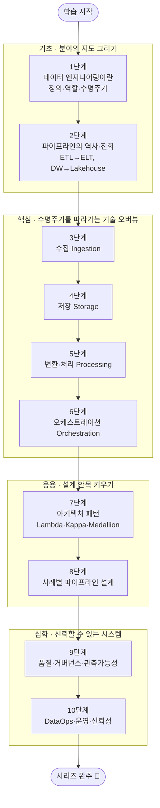

<figure class="post-figure post-figure--header">
<picture>
  <source type="image/webp" srcset="/assets/images/data-engineering/data-engineering-curriculum-640.webp 640w, /assets/images/data-engineering/data-engineering-curriculum-1024.webp 1024w, /assets/images/data-engineering/data-engineering-curriculum-1536.webp 1536w" sizes="(max-width: 800px) 100vw, 760px">
  
</picture>
<figcaption>이 커리큘럼을 한 장으로 — 기초·핵심·응용·심화 10단계 로드맵, 데이터 파이프라인 흐름, 핵심 포인트, 그리고 완주 100% 🎉</figcaption>
</figure>

## 소개

데이터 엔지니어링(Data Engineering)은 흩어진 원천 데이터를 신뢰할 수 있고, 쓸 수 있고, 분석·머신러닝에 바로 투입할 수 있는 형태로 바꾸어 내는 분야입니다. 분석가가 대시보드를 그리고 사이언티스트가 모델을 학습시키기 **이전에**, 데이터를 모으고(수집) 안전하게 쌓고(저장) 의미 있는 형태로 다듬어(변환) 적시에 흘려보내는(서빙) 일이 먼저 일어나야 합니다. 그 토대를 책임지는 사람이 데이터 엔지니어이고, 그 토대를 움직이는 자동화된 흐름이 데이터 파이프라인(Data Pipeline)입니다.

이 글은 `Data-Engineering-Essential` 시리즈의 **마스터 로드맵**입니다. **데이터 엔지니어링이란 무엇이며 어떻게 진화해 왔는가**(기초)에서 출발해, **수집·저장·처리·오케스트레이션**이라는 핵심 기술을 오버뷰하고(핵심), **아키텍처 패턴과 실제 사례별 파이프라인 설계**(응용)를 거쳐, **데이터 품질·거버넌스·DataOps**(심화)로 마무리하는 10단계로 구성했습니다. 각 항목을 정복할 때마다 상세 포스트를 작성하고 체크박스를 채우는 **도장깨기** 방식으로 진행 상황을 추적합니다.

핵심 단계(수집·저장·처리·오케스트레이션)는 각각 하나의 큰 세계입니다. 이 로드맵에서는 "전체 그림 안에서 어떤 역할을 하는가"를 중심으로 **오버뷰**하고, Kafka·Spark·dbt·Airflow처럼 깊이 파고들 가치가 있는 기술은 이후 **별도 시리즈**로 분리해 다룰 예정입니다.

## 학습 흐름

10단계는 아래 순서대로 진행하는 것을 권장합니다. **기초**(정의·역사)로 분야의 지도를 그리고, **핵심**(수집→저장→처리→오케스트레이션)으로 데이터 엔지니어링 수명주기를 따라가며 기술을 익힌 뒤, **응용**(아키텍처·사례)으로 설계 안목을 키우고, **심화**(품질·거버넌스·운영)로 신뢰할 수 있는 데이터 시스템을 완성하는 흐름입니다.

## 학습 진행 현황

> 완료한 항목에는 상세 포스트 링크가 연결됩니다. 학습이 진행될 때마다 체크박스와 진행률을 갱신합니다.

- 현재 완료한 항목: **35개**
- 전체 항목: **35개**
- 진행률: **100%** 🎉

## 1단계: 데이터 엔지니어링이란 — 정의·역할·수명주기

데이터 엔지니어링이 무엇이고, 데이터 엔지니어가 분석가·사이언티스트와 어떻게 다른지, 그리고 모든 데이터 작업을 꿰뚫는 **데이터 엔지니어링 수명주기(Data Engineering Lifecycle)**를 익히는 단계입니다. 이후 모든 기술은 이 수명주기의 어느 칸에 들어가는지로 정리됩니다. 자세한 내용은 [데이터 엔지니어링이란: 수명주기와 데이터 엔지니어의 역할](/2026/06/25/what-is-data-engineering.html) 포스트에서 다룹니다.

- [x] **정의와 역할**: 데이터 엔지니어 vs 데이터 분석가 vs 데이터 사이언티스트, 데이터 엔지니어가 책임지는 범위 — [[상세](/2026/06/25/what-is-data-engineering.html)]
- [x] **데이터 성숙도(Data Maturity)**: 조직의 데이터 성숙도 단계와 그에 따라 달라지는 데이터 엔지니어의 일 — [[상세](/2026/06/25/what-is-data-engineering.html)]
- [x] **데이터 엔지니어링 수명주기**: 생성(Generation)→수집(Ingestion)→저장(Storage)→변환(Transformation)→서빙(Serving) — [[상세](/2026/06/25/what-is-data-engineering.html)]
- [x] **저류(Undercurrents)**: 보안·데이터 관리·DataOps·데이터 아키텍처·오케스트레이션·소프트웨어 엔지니어링 — [[상세](/2026/06/25/what-is-data-engineering.html)]

## 2단계: 데이터 파이프라인의 역사와 진화

오늘날의 데이터 스택은 갑자기 등장하지 않았습니다. 메인프레임 배치 처리에서 데이터 웨어하우스, Hadoop, 그리고 클라우드 기반 Modern Data Stack까지 — 각 시대가 풀려던 문제와 한계를 알면 현재의 도구 선택이 비로소 이해됩니다. 자세한 내용은 [데이터 파이프라인의 역사와 진화: ETL에서 Lakehouse까지](/2026/06/25/data-pipeline-history-and-evolution.html) 포스트에서 다룹니다.

- [x] **ETL에서 ELT로**: 변환을 어디서 하는가의 변화와 그 배경(스토리지·컴퓨팅 비용의 역전) — [[상세](/2026/06/25/data-pipeline-history-and-evolution.html)]
- [x] **DW → Data Lake → Lakehouse**: 정형 중심 웨어하우스에서 원본 보존 레이크, 그리고 둘을 통합한 레이크하우스로 — [[상세](/2026/06/25/data-pipeline-history-and-evolution.html)]
- [x] **배치에서 스트리밍으로**: Hadoop/MapReduce 시대에서 Spark, 그리고 실시간 처리와 Modern Data Stack의 부상 — [[상세](/2026/06/25/data-pipeline-history-and-evolution.html)]

## 3단계: 데이터 수집 (Ingestion)

데이터 엔지니어링의 출발점. 원천 시스템(DB·API·로그·이벤트)에서 데이터를 어떻게 안정적으로 가져오는지를 다룹니다. 배치와 스트리밍, 그리고 변경 데이터 캡처(CDC)가 핵심 주제입니다. 자세한 내용은 [데이터 수집(Ingestion): 배치·스트리밍·CDC와 수집 도구](/2026/06/25/data-ingestion.html) 포스트에서 다룹니다.

- [x] **배치 vs 스트리밍 수집**: 처리 주기·지연(latency)·복잡도의 트레이드오프 — [[상세](/2026/06/25/data-ingestion.html)]
- [x] **변경 데이터 캡처(CDC)**: 원천 DB의 변경을 로그 기반으로 추적해 동기화하기 — [[상세](/2026/06/25/data-ingestion.html)]
- [x] **메시징·스트리밍 플랫폼**: Kafka·Kinesis·Pub/Sub의 역할 (→ 향후 *Kafka* 별도 시리즈 후보) — [[상세](/2026/06/25/data-ingestion.html)]
- [x] **수집 도구·커넥터**: Airbyte·Fivetran 같은 EL 도구와 직접 구현의 경계 — [[상세](/2026/06/25/data-ingestion.html)]

## 4단계: 데이터 저장 (Storage)

수집한 데이터를 어디에, 어떤 형태로 쌓을 것인가. 데이터 웨어하우스·레이크·레이크하우스의 차이와, 그 밑을 받치는 파일 포맷·테이블 포맷을 익힙니다. 자세한 내용은 [데이터 저장(Storage): 웨어하우스·레이크·레이크하우스와 파일·테이블 포맷](/2026/06/25/data-storage.html) 포스트에서 다룹니다.

- [x] **OLTP vs OLAP**: 트랜잭션 처리와 분석 처리의 근본적 차이, 행 지향 vs 열 지향(Columnar) — [[상세](/2026/06/25/data-storage.html)]
- [x] **DW · Data Lake · Lakehouse**: Snowflake/BigQuery/Redshift, 오브젝트 스토리지, 그리고 통합 모델 — [[상세](/2026/06/25/data-storage.html)]
- [x] **파일 포맷**: Parquet·ORC·Avro — 열 지향 압축과 스키마 진화 — [[상세](/2026/06/25/data-storage.html)]
- [x] **테이블 포맷**: Apache Iceberg·Delta Lake·Hudi — 레이크 위에 ACID와 시간여행(time travel) 얹기 — [[상세](/2026/06/25/data-storage.html)]

## 5단계: 데이터 변환·처리 (Transformation / Processing)

원본을 의미 있는 데이터로 바꾸는 단계. 분산 처리의 기본 모델부터 배치(Spark)·스트림(Flink) 엔진, 그리고 SQL 기반 변환(dbt)까지 오버뷰합니다. 자세한 내용은 [데이터 변환·처리(Processing): 배치·스트림 엔진과 SQL 변환](/2026/06/25/data-processing.html) 포스트에서 다룹니다.

- [x] **분산 처리 모델**: MapReduce에서 Spark로 — 왜 인메모리 처리가 판도를 바꿨는가 — [[상세](/2026/06/25/data-processing.html)]
- [x] **배치 처리 엔진**: Apache Spark의 구조와 활용 (→ 심화: [Spark-Essential 시리즈](/2026/07/12/spark-essential-curriculum.html)) — [[상세](/2026/06/25/data-processing.html)]
- [x] **스트림 처리**: Flink·Kafka Streams, 이벤트 시간 vs 처리 시간, 윈도잉 — [[상세](/2026/06/25/data-processing.html)]
- [x] **SQL 변환과 ELT**: dbt로 모델링·테스트·문서화하기 (→ 향후 *dbt* 별도 시리즈 후보) — [[상세](/2026/06/25/data-processing.html)]

## 6단계: 오케스트레이션 (Orchestration)

수많은 수집·변환 작업을 **언제·어떤 순서로·어떤 의존성으로** 실행할지 조율하는 두뇌. Airflow를 비롯한 오케스트레이터의 개념과, 견고한 파이프라인을 위한 멱등성·백필을 다룹니다. 자세한 내용은 [오케스트레이션(Orchestration): DAG·스케줄링과 견고한 파이프라인](/2026/06/25/orchestration.html) 포스트에서 다룹니다.

- [x] **DAG와 스케줄링**: 작업을 방향성 비순환 그래프로 모델링하고 의존성에 따라 실행하기 — [[상세](/2026/06/25/orchestration.html)]
- [x] **오케스트레이터 비교**: Airflow·Dagster·Prefect의 철학 차이 (→ 향후 *Airflow* 별도 시리즈 후보) — [[상세](/2026/06/25/orchestration.html)]
- [x] **견고한 파이프라인**: 멱등성(Idempotency)·재시도·백필(Backfill)·체크포인트 — [[상세](/2026/06/25/orchestration.html)]

## 7단계: 아키텍처 패턴

개별 기술을 넘어, 그것들을 어떻게 **하나의 시스템으로 조립**하는가. 배치와 스트리밍을 결합하는 고전 패턴부터 레이크하우스 계층화, 조직 차원의 Data Mesh까지 살펴봅니다. 자세한 내용은 [데이터 아키텍처 패턴: Lambda·Kappa·Medallion·Data Mesh](/2026/06/25/architecture-patterns.html) 포스트에서 다룹니다.

- [x] **Lambda vs Kappa**: 배치+스트림 이중 경로 vs 스트림 단일 경로의 트레이드오프 — [[상세](/2026/06/25/architecture-patterns.html)]
- [x] **Medallion 아키텍처**: Bronze→Silver→Gold 계층으로 데이터 품질을 단계적으로 끌어올리기 — [[상세](/2026/06/25/architecture-patterns.html)]
- [x] **Modern Data Stack & Data Mesh**: 클라우드 모듈형 스택과, 도메인 중심 분산 데이터 오너십 — [[상세](/2026/06/25/architecture-patterns.html)]

## 8단계: 사례별 파이프라인 설계

지금까지의 기술과 패턴을 실제 문제에 적용하는 단계. 대표적인 도메인별로 요구사항(지연·정확성·규모)을 분석하고 파이프라인을 설계해 봅니다. 자세한 내용은 [사례별 파이프라인 설계: 실시간 분석·이벤트·ML 피처·CDC](/2026/06/25/pipeline-case-studies.html) 포스트에서 다룹니다.

- [x] **실시간 분석 파이프라인**: 이벤트 수집→스트림 처리→실시간 대시보드 — [[상세](/2026/06/25/pipeline-case-studies.html)]
- [x] **로그·이벤트 파이프라인**: 애플리케이션/서버 로그의 수집·정제·집계 — [[상세](/2026/06/25/pipeline-case-studies.html)]
- [x] **ML 피처 파이프라인**: 학습/서빙용 피처 생성과 피처 스토어(Feature Store) — [[상세](/2026/06/25/pipeline-case-studies.html)]
- [x] **CDC 기반 복제 & 배치 리포팅**: 운영 DB → 분석 DW 동기화와 정기 리포트 배치 — [[상세](/2026/06/25/pipeline-case-studies.html)]

## 9단계: 데이터 품질·거버넌스·관측가능성

파이프라인이 "돌아간다"와 "믿을 수 있다"는 다릅니다. 잘못된 데이터를 조기에 잡아내고, 데이터의 출처와 흐름을 추적하며, 조직 차원에서 데이터를 관리하는 방법을 다룹니다. 자세한 내용은 [데이터 품질·거버넌스·관측가능성: 믿을 수 있는 데이터 만들기](/2026/06/25/data-quality-governance.html) 포스트에서 다룹니다.

- [x] **데이터 품질·테스트**: 검증 규칙과 Great Expectations 같은 도구, 데이터 계약(Data Contracts) — [[상세](/2026/06/25/data-quality-governance.html)]
- [x] **데이터 리니지·카탈로그**: 데이터의 출처·흐름 추적과 메타데이터 관리 — [[상세](/2026/06/25/data-quality-governance.html)]
- [x] **데이터 관측가능성(Observability)**: 신선도·볼륨·스키마·분포 모니터링과 이상 탐지 — [[상세](/2026/06/25/data-quality-governance.html)]

## 10단계: DataOps·운영·신뢰성

마지막 단계는 데이터 시스템을 **소프트웨어처럼** 운영하는 기술입니다. CI/CD·테스트·모니터링으로 변경을 안전하게 배포하고, 비용과 보안·프라이버시를 함께 관리하며 신뢰성을 지킵니다. 자세한 내용은 [DataOps·운영·신뢰성: 데이터 시스템을 소프트웨어처럼 운영하기](/2026/06/25/dataops-operations.html) 포스트에서 다룹니다.

- [x] **DataOps와 CI/CD**: 데이터 파이프라인에 대한 버전 관리·테스트·자동 배포 — [[상세](/2026/06/25/dataops-operations.html)]
- [x] **모니터링·신뢰성**: SLA/SLO, 경보, 장애 대응과 비용 최적화(FinOps) — [[상세](/2026/06/25/dataops-operations.html)]
- [x] **보안·프라이버시**: 접근 제어, 데이터 마스킹/익명화, 규정 준수(GDPR 등) — [[상세](/2026/06/25/dataops-operations.html)]

## 핵심 포인트

- **수명주기로 사고하라**: 모든 도구와 기법은 결국 생성→수집→저장→변환→서빙 중 어딘가에 속합니다. 새 기술을 만나면 "수명주기의 어느 칸을 푸는가"부터 물어보면 길을 잃지 않습니다.
- **도구가 아니라 문제가 먼저다**: Kafka·Spark·Airflow는 수단입니다. 지연 요구사항·데이터 규모·정확성 보장 수준 같은 **요구사항**이 도구를 선택하게 해야 합니다.
- **배치와 스트리밍의 트레이드오프를 이해하라**: 실시간이 항상 옳은 것은 아닙니다. 신선도 요구와 운영 복잡도·비용 사이의 균형이 아키텍처를 가릅니다.
- **데이터 품질은 기능이 아니라 토대다**: 아무리 빠른 파이프라인도 틀린 데이터를 흘리면 가치가 음수입니다. 품질·거버넌스·관측가능성은 처음부터 설계에 포함하세요.
- **데이터 시스템도 소프트웨어다**: 버전 관리·테스트·CI/CD·모니터링이라는 소프트웨어 엔지니어링 원칙이 데이터 파이프라인에도 그대로 적용됩니다(DataOps).

## 추천 학습 순서

위 단계 번호 순서대로 진행하는 것을 권합니다. 그 이유는 다음과 같습니다.

1. **기초(1~2단계)** — 먼저 데이터 엔지니어링의 정의와 수명주기로 분야 전체의 지도를 그리고, 역사·진화를 통해 "왜 지금의 스택이 이렇게 생겼는지"를 이해합니다. 지도와 맥락 없이 개별 도구부터 배우면 파편적인 지식에 그칩니다.
2. **핵심(3~6단계)** — 수집→저장→처리→오케스트레이션이라는 수명주기의 흐름을 그대로 따라가며 각 칸의 대표 기술을 오버뷰합니다. 데이터가 흘러가는 순서대로 익히면 전체 그림이 자연스럽게 연결됩니다.
3. **응용(7~8단계)** — 개별 기술을 하나의 시스템으로 조립하는 아키텍처 패턴을 배우고, 실제 도메인 사례에 적용해 설계 근육을 키웁니다.
4. **심화(9~10단계)** — "돌아가는 파이프라인"을 "믿을 수 있고 운영 가능한 시스템"으로 끌어올리는 품질·거버넌스·DataOps로 마무리합니다.

각 단계는 앞 단계의 토대 위에 쌓이므로, 건너뛰기보다 순서대로 정복하며 체크박스를 채워 나가길 권합니다.

## 추천 도서

이 커리큘럼의 뼈대가 된 책들입니다.

- **Fundamentals of Data Engineering** (Joe Reis & Matt Housley) — 이 로드맵의 중심 프레임워크인 **데이터 엔지니어링 수명주기**와 저류(Undercurrents) 개념의 출처. 분야 전체를 도구 중립적으로 조망합니다.
- **Designing Data-Intensive Applications** (Martin Kleppmann) — 저장·복제·파티셔닝·일관성·스트림 처리의 **이론적 토대**. (이 위키 [Architecture-Essential 시리즈](/2026/06/19/designing-data-intensive-applications.html)에서도 다룹니다.)
- **The Data Warehouse Toolkit** (Ralph Kimball) — 차원 모델링(Dimensional Modeling)의 고전, 분석용 데이터 모델 설계의 정석.

## 결론

데이터 엔지니어링은 "데이터를 옮기는 일"이 아니라, **신뢰할 수 있는 데이터 흐름을 설계하고 운영하는 엔지니어링**입니다. 개별 도구는 빠르게 바뀌지만, 수명주기라는 사고의 틀과 요구사항에서 출발하는 설계 원칙은 오래 갑니다. 이 10단계를 순서대로 정복하면, 새로운 도구가 등장해도 그것을 전체 그림 안에 정확히 배치하고 평가할 수 있는 안목을 갖추게 됩니다.

이 시리즈는 10단계를 모두 채워 **완주(100%)**했습니다 🎉. 이제 전체 지도를 손에 넣었으니, 다음은 핵심 도구를 하나씩 깊이 파고들 차례입니다. 수집의 **Kafka**, 처리의 **Spark**·**dbt**, 오케스트레이션의 **Airflow**는 각각 별도의 `*-Essential` 시리즈로 분리해 다룰 예정입니다.

### 다음 학습 (Next Learning)

- [데이터 엔지니어링이란: 수명주기와 데이터 엔지니어의 역할](/2026/06/25/what-is-data-engineering.html) — 1단계부터 다시 훑어보며 전체 지도 복습
- [Designing Data-Intensive Applications](/2026/06/19/designing-data-intensive-applications.html) — 데이터 시스템의 이론적 토대 (Architecture-Essential)
- [PostgreSQL Essential Curriculum](/2025/10/28/postgresql-essential-curriculum.html) — 데이터 저장의 핵심, 관계형 데이터베이스 깊이 파기

<!-- ============================================================
     PRESENTATION DECK — 발표 전용 편집본 (본문의 미러가 아님)
     대상: 데이터 엔지니어링을 "전혀 모르는" 완전 초보자(비개발자·입문 개발자).
     쉬운 비유 + 손으로 그린 인라인 SVG + 용어 풀이로 커리큘럼 전체를
     하나의 이야기처럼 안내한다. 기술 색인이 아니라 접근 가능한 이야기.
     모든 SVG 색은 토큰(var(--…))과 currentColor 만 사용 — 라이트/다크
     양쪽에서 읽힌다. 화면에 렌더되지 않으며 presentation.js가 전체화면 재생.
     한 슬라이드 = 하나의 <section class="slide">. (초보자용 재작성)
     ============================================================ -->

<section class="slide slide--title">
  
Data-Engineering-Essential · 완전 초보자를 위한 안내

  <h1>데이터 엔지니어링 처음부터</h1>
  
"데이터를 다룬다"는 게 대체 무슨 일일까? 아무것도 몰라도 괜찮습니다.

  
그림과 비유로 따라가는 커리큘럼 한 바퀴 — 용어는 나올 때마다 쉽게 풀어드립니다

</section>

<section class="slide">
  
먼저, 문제부터

  <h2>데이터는 처음엔 늘 '흩어져' 있다</h2>
  <svg role="img" aria-label="왼쪽에 앱·결제·로그·센서라고 적힌 상자들이 제각각 흩어져 기울어져 있고, 가운데 화살표를 지나 오른쪽에는 반듯하게 정렬된 표 한 장이 놓여 있다. 흩어진 원천 데이터를 모아 쓸 수 있는 표로 정리하는 과정을 나타낸다." viewBox="0 0 680 240" style="width:100%;height:auto" xmlns="http://www.w3.org/2000/svg">
    <defs><marker id="dkA-arw" viewBox="0 0 10 10" refX="8" refY="5" markerWidth="6" markerHeight="6" orient="auto-start-reverse"><path d="M0,0 L10,5 L0,10 z" fill="var(--secondary-color)"/></marker></defs>
    <g font-size="11" font-weight="700" text-anchor="middle">
      <rect x="30" y="40" width="86" height="34" rx="5" fill="var(--bg-light)" stroke="var(--accent-color)" stroke-width="2" transform="rotate(-6 73 57)"/>
      <text x="73" y="61" fill="currentColor" transform="rotate(-6 73 57)">앱</text>
      <rect x="150" y="30" width="86" height="34" rx="5" fill="var(--bg-light)" stroke="var(--accent-color)" stroke-width="2" transform="rotate(5 193 47)"/>
      <text x="193" y="51" fill="currentColor" transform="rotate(5 193 47)">결제</text>
      <rect x="40" y="120" width="86" height="34" rx="5" fill="var(--bg-light)" stroke="var(--accent-color)" stroke-width="2" transform="rotate(7 83 137)"/>
      <text x="83" y="141" fill="currentColor" transform="rotate(7 83 137)">로그</text>
      <rect x="160" y="130" width="86" height="34" rx="5" fill="var(--bg-light)" stroke="var(--accent-color)" stroke-width="2" transform="rotate(-5 203 147)"/>
      <text x="203" y="151" fill="currentColor" transform="rotate(-5 203 147)">센서</text>
    </g>
    <text x="140" y="205" text-anchor="middle" font-size="11" fill="currentColor" opacity="0.7">제각각 · 지저분 · 못 씀</text>
    <line x1="270" y1="120" x2="380" y2="120" stroke="var(--secondary-color)" stroke-width="3" marker-end="url(#dkA-arw)"/>
    <text x="325" y="108" text-anchor="middle" font-size="11" font-weight="700" fill="var(--secondary-color)">데이터 엔지니어링</text>
    <rect x="410" y="52" width="240" height="140" rx="6" fill="var(--bg-panel)" stroke="var(--gold)" stroke-width="2.5"/>
    <rect x="410" y="52" width="240" height="28" rx="6" fill="var(--secondary-color)" opacity="0.18"/>
    <g stroke="currentColor" opacity="0.4"><line x1="410" y1="80" x2="650" y2="80" stroke-width="1.4"/><line x1="410" y1="108" x2="650" y2="108" stroke-width="1"/><line x1="410" y1="136" x2="650" y2="136" stroke-width="1"/><line x1="410" y1="164" x2="650" y2="164" stroke-width="1"/><line x1="490" y1="52" x2="490" y2="192" stroke-width="1"/><line x1="570" y1="52" x2="570" y2="192" stroke-width="1"/></g>
    <text x="530" y="212" text-anchor="middle" font-size="11" font-weight="700" fill="currentColor">깨끗한 표 · 바로 분석</text>
  </svg>
  
앱·결제·로그·센서… 데이터는 여기저기 제각각 쌓인다. 이대로는 아무도 못 쓴다.

  
누군가 이걸 모아서 <strong>깨끗하고 쓸 수 있는 형태</strong>로 정리해야 한다.

</section>

<section class="slide">
  
누가 하는 일인가

  <h2>재료를 준비하는 사람</h2>
  <svg role="img" aria-label="세 사람이 나란히 있다. 왼쪽 데이터 엔지니어는 파이프 조각(재료 손질)을, 가운데 데이터 분석가는 막대 차트를, 오른쪽 데이터 사이언티스트는 작은 신경망 모델을 다룬다. 엔지니어가 준비한 재료 위에서 나머지 둘이 일한다는 것을 화살표로 나타낸다." viewBox="0 0 680 250" style="width:100%;height:auto" xmlns="http://www.w3.org/2000/svg">
    <defs><marker id="dkB-arw" viewBox="0 0 10 10" refX="8" refY="5" markerWidth="6" markerHeight="6" orient="auto-start-reverse"><path d="M0,0 L10,5 L0,10 z" fill="var(--gold)"/></marker></defs>
    <rect x="24" y="46" width="196" height="150" rx="8" fill="var(--bg-light)" stroke="var(--gold)" stroke-width="3"/>
    <rect x="242" y="46" width="196" height="150" rx="8" fill="var(--bg-light)" stroke="var(--border-color)" stroke-width="2"/>
    <rect x="460" y="46" width="196" height="150" rx="8" fill="var(--bg-light)" stroke="var(--border-color)" stroke-width="2"/>
    <g fill="none" stroke="currentColor" stroke-width="2.5">
      <circle cx="122" cy="86" r="15"/><path d="M96,140 Q122,108 148,140"/>
      <circle cx="340" cy="86" r="15"/><path d="M314,140 Q340,108 366,140"/>
      <circle cx="558" cy="86" r="15"/><path d="M532,140 Q558,108 584,140"/>
    </g>
    <g stroke="var(--secondary-color)" stroke-width="2.5" fill="none"><rect x="98" y="150" width="16" height="16" rx="2"/><line x1="114" y1="158" x2="130" y2="158"/><rect x="130" y="150" width="16" height="16" rx="2"/></g>
    <g fill="var(--secondary-color)"><rect x="316" y="158" width="10" height="12"/><rect x="330" y="150" width="10" height="20"/><rect x="344" y="154" width="10" height="16"/></g>
    <g stroke="var(--secondary-color)" stroke-width="2"><line x1="540" y1="160" x2="558" y2="150"/><line x1="558" y1="150" x2="576" y2="160"/><line x1="558" y1="150" x2="558" y2="170"/></g>
    <g fill="var(--secondary-color)"><circle cx="540" cy="160" r="4"/><circle cx="576" cy="160" r="4"/><circle cx="558" cy="150" r="4"/><circle cx="558" cy="170" r="4"/></g>
    <text x="122" y="30" text-anchor="middle" font-size="11" font-weight="800" fill="var(--gold)">재료를 준비</text>
    <g text-anchor="middle" font-weight="700" font-size="12" fill="currentColor">
      <text x="122" y="185">데이터 엔지니어</text>
      <text x="340" y="185">데이터 분석가</text>
      <text x="558" y="185">데이터 사이언티스트</text>
    </g>
    <line x1="224" y1="120" x2="240" y2="120" stroke="var(--gold)" stroke-width="2.5" marker-end="url(#dkB-arw)"/>
    <line x1="442" y1="120" x2="458" y2="120" stroke="var(--gold)" stroke-width="2.5" marker-end="url(#dkB-arw)"/>
  </svg>
  
요리에 비유하면 — <strong>데이터 엔지니어</strong>는 신선한 재료를 손질해 주방에 올린다.

  
그 재료로 <strong>분석가</strong>는 요리(차트·리포트)를, <strong>사이언티스트</strong>는 새 메뉴(AI 모델)를 만든다. 재료가 엉망이면 무엇도 안 된다.

</section>

<section class="slide">
  
이 발표를 관통하는 하나의 그림

  <h2>데이터가 흘러가는 길</h2>
  <svg role="img" aria-label="컨베이어 벨트 위에 다섯 개의 칸이 순서대로 놓여 있다: 생성, 수집, 저장, 변환, 서빙. 데이터 꾸러미가 왼쪽에서 오른쪽으로 벨트를 따라 각 칸을 차례로 지나간다." viewBox="0 0 720 220" style="width:100%;height:auto" xmlns="http://www.w3.org/2000/svg">
    <defs><marker id="dkC-arw" viewBox="0 0 10 10" refX="8" refY="5" markerWidth="7" markerHeight="7" orient="auto-start-reverse"><path d="M0,0 L10,5 L0,10 z" fill="var(--secondary-color)"/></marker></defs>
    <rect x="24" y="150" width="672" height="26" rx="13" fill="var(--bg-light)" stroke="var(--border-color)" stroke-width="2"/>
    <g fill="none" stroke="currentColor" stroke-width="2" opacity="0.5"><circle cx="52" cy="163" r="9"/><circle cx="176" cy="163" r="9"/><circle cx="300" cy="163" r="9"/><circle cx="424" cy="163" r="9"/><circle cx="548" cy="163" r="9"/><circle cx="668" cy="163" r="9"/></g>
    <g font-weight="700" font-size="13" text-anchor="middle">
      <g><rect x="40" y="60" width="110" height="52" rx="7" fill="var(--bg-panel)" stroke="var(--secondary-color)" stroke-width="2.5"/><text x="95" y="83" fill="currentColor">생성</text><text x="95" y="100" font-size="9" fill="currentColor" opacity="0.7">데이터 발생</text></g>
      <g><rect x="180" y="60" width="110" height="52" rx="7" fill="var(--bg-panel)" stroke="var(--secondary-color)" stroke-width="2.5"/><text x="235" y="83" fill="currentColor">수집</text><text x="235" y="100" font-size="9" fill="currentColor" opacity="0.7">모아 오기</text></g>
      <g><rect x="320" y="60" width="110" height="52" rx="7" fill="var(--bg-panel)" stroke="var(--secondary-color)" stroke-width="2.5"/><text x="375" y="83" fill="currentColor">저장</text><text x="375" y="100" font-size="9" fill="currentColor" opacity="0.7">쌓아 두기</text></g>
      <g><rect x="460" y="60" width="110" height="52" rx="7" fill="var(--bg-panel)" stroke="var(--secondary-color)" stroke-width="2.5"/><text x="515" y="83" fill="currentColor">변환</text><text x="515" y="100" font-size="9" fill="currentColor" opacity="0.7">다듬기</text></g>
      <g><rect x="600" y="60" width="110" height="52" rx="7" fill="var(--bg-panel)" stroke="var(--gold)" stroke-width="2.5"/><text x="655" y="83" fill="currentColor">서빙</text><text x="655" y="100" font-size="9" fill="currentColor" opacity="0.7">가져다 쓰기</text></g>
    </g>
    <g stroke="var(--secondary-color)" stroke-width="2.5"><line x1="152" y1="86" x2="178" y2="86" marker-end="url(#dkC-arw)"/><line x1="292" y1="86" x2="318" y2="86" marker-end="url(#dkC-arw)"/><line x1="432" y1="86" x2="458" y2="86" marker-end="url(#dkC-arw)"/><line x1="572" y1="86" x2="598" y2="86" marker-end="url(#dkC-arw)"/></g>
    <rect x="120" y="132" width="26" height="26" rx="4" fill="var(--accent-color)"/>
    <text x="133" y="150" text-anchor="middle" font-size="12" font-weight="800" fill="var(--bg-panel)">D</text>
    <text x="360" y="205" text-anchor="middle" font-size="11" fill="currentColor" opacity="0.72">데이터 파이프라인 = 이 컨베이어를 자동으로 굴리는 것</text>
  </svg>
  
데이터는 컨베이어처럼 다섯 칸을 지난다: 생성 → 수집 → 저장 → 변환 → 서빙.

  
📖 <strong>용어 · 데이터 파이프라인</strong> = 이 흐름을 사람이 매번 손대지 않아도 자동으로 굴러가게 만든 '컨베이어 벨트'. 정수장이 강물을 받아 수돗물로 바꿔 집집마다 보내는 것과 같다.

</section>

<section class="slide">
  수집
  <h2>데이터 모아 오기 (Ingestion)</h2>
  <svg role="img" aria-label="왼쪽은 배치 방식으로, 데이터 방울을 양동이에 모았다가 시계가 가리키는 정해진 시각에 한꺼번에 붓는 모습이다. 오른쪽은 스트리밍 방식으로, 수도관을 따라 데이터가 끊임없이 흘러가는 모습이다." viewBox="0 0 680 240" style="width:100%;height:auto" xmlns="http://www.w3.org/2000/svg">
    <defs><marker id="dkD-arw" viewBox="0 0 10 10" refX="8" refY="5" markerWidth="6" markerHeight="6" orient="auto-start-reverse"><path d="M0,0 L10,5 L0,10 z" fill="var(--secondary-color)"/></marker></defs>
    <rect x="20" y="40" width="300" height="176" rx="8" fill="var(--bg-light)" stroke="var(--border-color)" stroke-width="2"/>
    <text x="170" y="66" text-anchor="middle" font-size="14" font-weight="800" fill="currentColor">배치 (Batch)</text>
    <path d="M110,110 L150,110 L144,175 L116,175 Z" fill="var(--bg-panel)" stroke="var(--secondary-color)" stroke-width="2.5"/>
    <rect x="116" y="142" width="28" height="31" fill="var(--secondary-color)" opacity="0.3"/>
    <g fill="var(--accent-color)"><circle cx="130" cy="96" r="4"/><circle cx="122" cy="84" r="4"/><circle cx="138" cy="84" r="4"/></g>
    <circle cx="235" cy="130" r="26" fill="var(--bg-panel)" stroke="currentColor" stroke-width="2.5"/>
    <g stroke="currentColor" stroke-width="2.5" stroke-linecap="round"><line x1="235" y1="130" x2="235" y2="114"/><line x1="235" y1="130" x2="248" y2="136"/></g>
    <text x="170" y="200" text-anchor="middle" font-size="10.5" fill="currentColor" opacity="0.78">모았다가 정해진 때에 한 번에</text>
    <rect x="360" y="40" width="300" height="176" rx="8" fill="var(--bg-light)" stroke="var(--gold)" stroke-width="2.5"/>
    <text x="510" y="66" text-anchor="middle" font-size="14" font-weight="800" fill="currentColor">스트리밍 (Streaming)</text>
    <rect x="388" y="120" width="244" height="30" rx="15" fill="var(--bg-panel)" stroke="var(--secondary-color)" stroke-width="2.5"/>
    <line x1="392" y1="135" x2="624" y2="135" stroke="var(--accent-color)" stroke-width="2" stroke-dasharray="6 6" marker-end="url(#dkD-arw)"/>
    <g fill="var(--accent-color)"><circle cx="410" cy="135" r="4"/><circle cx="450" cy="135" r="4"/><circle cx="490" cy="135" r="4"/><circle cx="530" cy="135" r="4"/><circle cx="570" cy="135" r="4"/></g>
    <text x="510" y="200" text-anchor="middle" font-size="10.5" fill="currentColor" opacity="0.78">생기는 즉시 끊임없이</text>
  </svg>
  
가져오는 방식은 크게 둘 — 모아서 한꺼번에(배치) vs 생기는 즉시 계속(스트리밍).

  
📖 <strong>용어 · 배치</strong> = 양동이에 모았다가 한 번에 붓기(예: 매일 밤). <strong>스트리밍</strong> = 수도관처럼 끊임없이 흘려보내기(실시간). <strong>CDC</strong> = 원본 DB에서 '바뀐 것만' 집어내 따라 옮기는 기법(Change Data Capture).

</section>

<section class="slide">
  저장
  <h2>어디에 쌓을까 (Storage)</h2>
  <svg role="img" aria-label="세 가지 저장 방식. 왼쪽 웨어하우스는 반듯한 선반이 있는 창고 건물로 정형 데이터만 담는다. 가운데 레이크는 물결치는 호수로 표·사진·로그 등 온갖 원본을 그대로 담는다. 오른쪽 레이크하우스는 호수 위에 창고 건물을 얹어 둘을 합친 모습이다." viewBox="0 0 700 236" style="width:100%;height:auto" xmlns="http://www.w3.org/2000/svg">
    <text x="118" y="34" text-anchor="middle" font-size="13" font-weight="800" fill="currentColor">웨어하우스</text>
    <rect x="34" y="70" width="168" height="120" fill="var(--bg-light)" stroke="var(--secondary-color)" stroke-width="2.5"/>
    <path d="M28,70 L118,42 L208,70 Z" fill="var(--bg-panel)" stroke="var(--secondary-color)" stroke-width="2.5"/>
    <g stroke="currentColor" stroke-width="1.6" opacity="0.5"><line x1="34" y1="110" x2="202" y2="110"/><line x1="34" y1="150" x2="202" y2="150"/><line x1="90" y1="70" x2="90" y2="190"/><line x1="146" y1="70" x2="146" y2="190"/></g>
    <text x="118" y="210" text-anchor="middle" font-size="10" fill="currentColor" opacity="0.75">정형(표)만 · 잘 정리</text>
    <text x="350" y="34" text-anchor="middle" font-size="13" font-weight="800" fill="currentColor">레이크</text>
    <path d="M270,80 Q350,60 430,80 L430,180 Q350,196 270,180 Z" fill="var(--bg-light)" stroke="var(--secondary-color)" stroke-width="2.5"/>
    <g stroke="var(--secondary-color)" stroke-width="1.6" fill="none" opacity="0.6"><path d="M280,110 Q350,98 420,110"/><path d="M280,140 Q350,128 420,140"/></g>
    <rect x="300" y="100" width="20" height="20" rx="3" fill="var(--accent-color)" opacity="0.8"/>
    <circle cx="360" cy="150" r="11" fill="var(--gold)" opacity="0.85"/>
    <path d="M388,108 l16,0 l-8,16 z" fill="var(--secondary-color)"/>
    <text x="350" y="210" text-anchor="middle" font-size="10" fill="currentColor" opacity="0.75">원본 다 담기 · 자유</text>
    <text x="582" y="34" text-anchor="middle" font-size="13" font-weight="800" fill="currentColor">레이크하우스</text>
    <path d="M502,150 Q582,134 662,150 L662,182 Q582,196 502,182 Z" fill="var(--bg-light)" stroke="var(--secondary-color)" stroke-width="2.5"/>
    <rect x="536" y="86" width="92" height="66" fill="var(--bg-panel)" stroke="var(--gold)" stroke-width="2.5"/>
    <path d="M530,86 L582,62 L634,86 Z" fill="var(--bg-panel)" stroke="var(--gold)" stroke-width="2.5"/>
    <g stroke="currentColor" stroke-width="1.4" opacity="0.5"><line x1="536" y1="118" x2="628" y2="118"/><line x1="582" y1="86" x2="582" y2="152"/></g>
    <text x="582" y="210" text-anchor="middle" font-size="10" fill="currentColor" opacity="0.75">자유 + 질서 = 통합</text>
  </svg>
  
📖 <strong>용어 · 웨어하우스</strong>=반듯한 표만 담는 잘 정리된 창고, <strong>데이터 레이크</strong>=원본을 형태 상관없이 다 담는 호수, <strong>레이크하우스</strong>=둘을 합친 요즘 방식. / <strong>OLTP</strong>=주문·결제 같은 '거래' 처리용 DB, <strong>OLAP</strong>=쌓인 데이터를 '분석'하는 용도 — 데이터 엔지니어링은 주로 OLAP 쪽.

</section>

<section class="slide">
  저장
  <h2>같은 표라도 '어떻게' 저장하느냐</h2>
  <svg role="img" aria-label="왼쪽 표는 행 지향 저장으로 한 행 전체가 강조되어, 분석할 때 모든 데이터를 읽어야 함을 나타낸다. 오른쪽 표는 열 지향(Parquet) 저장으로 필요한 한 개의 열만 강조되어, 필요한 열만 골라 읽음을 나타낸다." viewBox="0 0 680 240" style="width:100%;height:auto" xmlns="http://www.w3.org/2000/svg">
    <text x="160" y="34" text-anchor="middle" font-size="13" font-weight="800" fill="currentColor">행 지향</text>
    <rect x="40" y="52" width="240" height="140" rx="5" fill="var(--bg-panel)" stroke="var(--border-color)" stroke-width="2"/>
    <rect x="40" y="94" width="240" height="28" fill="var(--accent-color)" opacity="0.25"/>
    <g stroke="currentColor" stroke-width="1" opacity="0.35"><line x1="40" y1="80" x2="280" y2="80"/><line x1="40" y1="108" x2="280" y2="108"/><line x1="40" y1="136" x2="280" y2="136"/><line x1="40" y1="164" x2="280" y2="164"/><line x1="120" y1="52" x2="120" y2="192"/><line x1="200" y1="52" x2="200" y2="192"/></g>
    <text x="160" y="214" text-anchor="middle" font-size="10.5" fill="currentColor" opacity="0.78">한 행씩 — 다 읽어야 한다</text>
    <text x="520" y="34" text-anchor="middle" font-size="13" font-weight="800" fill="currentColor">열 지향 · Parquet</text>
    <rect x="400" y="52" width="240" height="140" rx="5" fill="var(--bg-panel)" stroke="var(--gold)" stroke-width="2.5"/>
    <rect x="480" y="52" width="80" height="140" fill="var(--secondary-color)" opacity="0.28"/>
    <g stroke="currentColor" stroke-width="1" opacity="0.35"><line x1="400" y1="80" x2="640" y2="80"/><line x1="400" y1="108" x2="640" y2="108"/><line x1="400" y1="136" x2="640" y2="136"/><line x1="400" y1="164" x2="640" y2="164"/><line x1="480" y1="52" x2="480" y2="192"/><line x1="560" y1="52" x2="560" y2="192"/></g>
    <text x="520" y="214" text-anchor="middle" font-size="10.5" fill="currentColor" opacity="0.78">필요한 열만 콕 — 빠르고 작다</text>
  </svg>
  
분석은 보통 몇 개 '열(칼럼)'만 본다 — 그래서 열 단위로 저장하면 훨씬 빠르고 작다.

  
📖 <strong>용어 · Parquet</strong> = 분석용으로 널리 쓰는 '열 지향(columnar)' 파일 형식. 필요한 열만 콕 집어 읽고, 잘 압축된다.

</section>

<section class="slide">
  
역사가 바꾼 순서

  <h2>ETL 에서 ELT 로</h2>
  <svg role="img" aria-label="위쪽 ETL 줄은 추출, 변환, 적재 순서의 세 상자가 화살표로 이어져 있다. 아래쪽 ELT 줄은 추출, 적재, 변환 순서로 이어져, 변환과 적재의 순서가 뒤바뀐 것을 강조한다." viewBox="0 0 680 210" style="width:100%;height:auto" xmlns="http://www.w3.org/2000/svg">
    <defs><marker id="dkG-arw" viewBox="0 0 10 10" refX="8" refY="5" markerWidth="6" markerHeight="6" orient="auto-start-reverse"><path d="M0,0 L10,5 L0,10 z" fill="var(--secondary-color)"/></marker></defs>
    <text x="42" y="64" font-size="15" font-weight="800" fill="currentColor">ETL</text>
    <g font-size="12" font-weight="700" text-anchor="middle">
      <rect x="130" y="36" width="120" height="46" rx="6" fill="var(--bg-panel)" stroke="var(--secondary-color)" stroke-width="2"/><text x="190" y="64" fill="currentColor">추출 E</text>
      <rect x="290" y="36" width="120" height="46" rx="6" fill="var(--bg-light)" stroke="var(--accent-color)" stroke-width="2.5"/><text x="350" y="64" fill="currentColor">변환 T</text>
      <rect x="450" y="36" width="120" height="46" rx="6" fill="var(--bg-light)" stroke="var(--gold)" stroke-width="2.5"/><text x="510" y="64" fill="currentColor">적재 L</text>
    </g>
    <g stroke="var(--secondary-color)" stroke-width="2.5"><line x1="252" y1="59" x2="288" y2="59" marker-end="url(#dkG-arw)"/><line x1="412" y1="59" x2="448" y2="59" marker-end="url(#dkG-arw)"/></g>
    <text x="44" y="162" font-size="15" font-weight="800" fill="currentColor">ELT</text>
    <g font-size="12" font-weight="700" text-anchor="middle">
      <rect x="130" y="134" width="120" height="46" rx="6" fill="var(--bg-panel)" stroke="var(--secondary-color)" stroke-width="2"/><text x="190" y="162" fill="currentColor">추출 E</text>
      <rect x="290" y="134" width="120" height="46" rx="6" fill="var(--bg-light)" stroke="var(--gold)" stroke-width="2.5"/><text x="350" y="162" fill="currentColor">적재 L</text>
      <rect x="450" y="134" width="120" height="46" rx="6" fill="var(--bg-light)" stroke="var(--accent-color)" stroke-width="2.5"/><text x="510" y="162" fill="currentColor">변환 T</text>
    </g>
    <g stroke="var(--secondary-color)" stroke-width="2.5"><line x1="252" y1="157" x2="288" y2="157" marker-end="url(#dkG-arw)"/><line x1="412" y1="157" x2="448" y2="157" marker-end="url(#dkG-arw)"/></g>
    <text x="622" y="110" text-anchor="middle" font-size="11" font-weight="700" fill="var(--accent-color)">T ↔ L</text>
    <text x="622" y="126" text-anchor="middle" font-size="10" font-weight="700" fill="var(--accent-color)">순서가 바뀐다</text>
  </svg>
  
'변환(T)'을 언제 하느냐의 차이 — 옮기기 전(ETL)에서, 일단 다 넣고 나중에(ELT)로.

  
📖 <strong>용어 · ETL</strong> = 추출→변환→적재(Extract·Transform·Load). <strong>ELT</strong> = 추출→적재→변환. 저장·연산 비용이 싸지면서 "일단 다 넣고 나중에 다듬자"가 대세가 됐다.

</section>

<section class="slide">
  변환
  <h2>원본을 '쓸 수 있게' 다듬기 (Processing)</h2>
  <svg role="img" aria-label="왼쪽은 빈칸과 오류가 섞인 지저분한 표이고, 가운데 화살표를 지나 오른쪽은 깔끔하게 정리된 표가 된다. 원본 데이터를 다듬어 쓸 수 있는 표로 만드는 변환 과정을 나타낸다." viewBox="0 0 620 216" style="width:100%;height:auto" xmlns="http://www.w3.org/2000/svg">
    <defs><marker id="dkH-arw" viewBox="0 0 10 10" refX="8" refY="5" markerWidth="6" markerHeight="6" orient="auto-start-reverse"><path d="M0,0 L10,5 L0,10 z" fill="var(--secondary-color)"/></marker></defs>
    <rect x="30" y="40" width="200" height="140" rx="5" fill="var(--bg-panel)" stroke="var(--accent-color)" stroke-width="2"/>
    <g stroke="currentColor" stroke-width="1" opacity="0.35"><line x1="30" y1="80" x2="230" y2="80"/><line x1="30" y1="112" x2="230" y2="112"/><line x1="30" y1="144" x2="230" y2="144"/><line x1="96" y1="40" x2="96" y2="180"/><line x1="164" y1="40" x2="164" y2="180"/></g>
    <g fill="var(--accent-color)" font-size="14" font-weight="800" text-anchor="middle"><text x="63" y="103">✕</text><text x="197" y="135">?</text><text x="130" y="167">✕</text></g>
    <text x="130" y="202" text-anchor="middle" font-size="10.5" fill="currentColor" opacity="0.78">빈칸 · 중복 · 오류</text>
    <line x1="248" y1="110" x2="360" y2="110" stroke="var(--secondary-color)" stroke-width="3" marker-end="url(#dkH-arw)"/>
    <text x="304" y="98" text-anchor="middle" font-size="11" font-weight="700" fill="var(--secondary-color)">변환</text>
    <rect x="386" y="40" width="200" height="140" rx="5" fill="var(--bg-panel)" stroke="var(--gold)" stroke-width="2.5"/>
    <rect x="386" y="40" width="200" height="26" fill="var(--secondary-color)" opacity="0.18"/>
    <g stroke="currentColor" stroke-width="1" opacity="0.35"><line x1="386" y1="66" x2="586" y2="66"/><line x1="386" y1="94" x2="586" y2="94"/><line x1="386" y1="122" x2="586" y2="122"/><line x1="386" y1="150" x2="586" y2="150"/><line x1="452" y1="40" x2="452" y2="180"/><line x1="520" y1="40" x2="520" y2="180"/></g>
    <text x="486" y="202" text-anchor="middle" font-size="10.5" fill="currentColor" opacity="0.78">깨끗 · 일관 · 바로 분석</text>
  </svg>
  
빈칸 채우고, 중복 지우고, 합치고, 계산해서 — 의미 있는 표로 만든다.

  <ul class="deck-chips">
    <li class="deck-chip">Spark · 대용량 처리</li>
    <li class="deck-chip">dbt · SQL 변환</li>
    <li class="deck-chip">Flink · 실시간</li>
  </ul>
</section>

<section class="slide">
  오케스트레이션
  <h2>수많은 작업의 '지휘자'</h2>
  <svg role="img" aria-label="작은 작업 그래프. A에서 B와 C로 화살표가 나가고, B와 C에서 다시 D로 화살표가 모인다. 화살표는 모두 한 방향이며 되돌아오는 화살표가 없는 비순환 구조다." viewBox="0 0 620 240" style="width:100%;height:auto" xmlns="http://www.w3.org/2000/svg">
    <defs><marker id="dkI-arw" viewBox="0 0 10 10" refX="9" refY="5" markerWidth="7" markerHeight="7" orient="auto-start-reverse"><path d="M0,0 L10,5 L0,10 z" fill="var(--secondary-color)"/></marker></defs>
    <g stroke="var(--secondary-color)" stroke-width="2.5" fill="none">
      <line x1="126" y1="112" x2="258" y2="66" marker-end="url(#dkI-arw)"/>
      <line x1="126" y1="128" x2="258" y2="174" marker-end="url(#dkI-arw)"/>
      <line x1="342" y1="66" x2="474" y2="112" marker-end="url(#dkI-arw)"/>
      <line x1="342" y1="174" x2="474" y2="128" marker-end="url(#dkI-arw)"/>
    </g>
    <g text-anchor="middle" font-weight="800" font-size="16">
      <g><circle cx="100" cy="120" r="30" fill="var(--bg-light)" stroke="var(--secondary-color)" stroke-width="2.5"/><text x="100" y="126" fill="currentColor">A</text></g>
      <g><circle cx="300" cy="56" r="30" fill="var(--bg-light)" stroke="var(--secondary-color)" stroke-width="2.5"/><text x="300" y="62" fill="currentColor">B</text></g>
      <g><circle cx="300" cy="184" r="30" fill="var(--bg-light)" stroke="var(--secondary-color)" stroke-width="2.5"/><text x="300" y="190" fill="currentColor">C</text></g>
      <g><circle cx="500" cy="120" r="30" fill="var(--bg-light)" stroke="var(--gold)" stroke-width="3"/><text x="500" y="126" fill="currentColor">D</text></g>
    </g>
    <text x="310" y="228" text-anchor="middle" font-size="11" fill="currentColor" opacity="0.72">한 방향 · 되돌아오지 않음 (비순환)</text>
  </svg>
  
"A가 끝나야 B·C를 하고, 둘 다 끝나야 D" — 순서와 의존성을 대신 챙겨준다.

  
📖 <strong>용어 · 오케스트레이션</strong> = 작업들을 언제·어떤 순서로 돌릴지 자동 조율(지휘). <strong>DAG</strong> = 작업들의 순서도, 화살표는 한 방향이고 되돌아오지 않는다(비순환). <strong>멱등성</strong> = 같은 작업을 두 번 돌려도 결과가 똑같음 — 그래야 안심하고 재시도한다.

</section>

<section class="slide">
  
요즘 저장의 핵심 · Apache Iceberg

  <h2>파일 더미 위에 진짜 '테이블'을 얹기</h2>
  <svg role="img" aria-label="세 층으로 쌓인 그림. 맨 아래는 Parquet 데이터 파일들, 그 위에는 어떤 파일이 이 표에 속하는지·스키마·통계를 담은 메타데이터 층, 맨 위에는 현재 스냅샷을 가리키는 카탈로그가 있다. 파일 더미 위에 테이블 층을 얹어 진짜 표처럼 다루는 구조를 나타낸다." viewBox="0 0 660 280" style="width:100%;height:auto" xmlns="http://www.w3.org/2000/svg">
    <defs><marker id="dkJ-arw" viewBox="0 0 10 10" refX="8" refY="5" markerWidth="6" markerHeight="6" orient="auto-start-reverse"><path d="M0,0 L10,5 L0,10 z" fill="var(--gold)"/></marker></defs>
    <rect x="230" y="30" width="200" height="42" rx="6" fill="var(--bg-light)" stroke="var(--gold)" stroke-width="2.5"/>
    <text x="330" y="50" text-anchor="middle" font-size="12" font-weight="800" fill="currentColor">카탈로그</text>
    <text x="330" y="65" text-anchor="middle" font-size="9.5" fill="currentColor" opacity="0.75">"지금의 표는 이 스냅샷"</text>
    <line x1="330" y1="72" x2="330" y2="104" stroke="var(--gold)" stroke-width="2.5" marker-end="url(#dkJ-arw)"/>
    <rect x="70" y="106" width="520" height="60" rx="6" fill="var(--bg-panel)" stroke="var(--secondary-color)" stroke-width="2.5"/>
    <text x="330" y="130" text-anchor="middle" font-size="12" font-weight="800" fill="currentColor">메타데이터 (테이블 층)</text>
    <text x="330" y="150" text-anchor="middle" font-size="10" fill="currentColor" opacity="0.78">어떤 파일이 이 표에 속하나 · 스키마 · 통계 · 스냅샷 이력</text>
    <g stroke="var(--secondary-color)" stroke-width="2" opacity="0.7"><line x1="160" y1="166" x2="160" y2="196" marker-end="url(#dkJ-arw)"/><line x1="330" y1="166" x2="330" y2="196" marker-end="url(#dkJ-arw)"/><line x1="500" y1="166" x2="500" y2="196" marker-end="url(#dkJ-arw)"/></g>
    <text x="330" y="216" text-anchor="middle" font-size="11" font-weight="700" fill="currentColor" opacity="0.85">데이터 파일 (Parquet) — 그냥 파일들</text>
    <g font-family="monospace" font-size="9" text-anchor="middle" fill="currentColor">
      <g><rect x="96" y="226" width="110" height="40" rx="4" fill="var(--bg-light)" stroke="var(--border-color)" stroke-width="2"/><text x="151" y="250">part-0.parquet</text></g>
      <g><rect x="222" y="226" width="110" height="40" rx="4" fill="var(--bg-light)" stroke="var(--border-color)" stroke-width="2"/><text x="277" y="250">part-1.parquet</text></g>
      <g><rect x="348" y="226" width="110" height="40" rx="4" fill="var(--bg-light)" stroke="var(--border-color)" stroke-width="2"/><text x="403" y="250">part-2.parquet</text></g>
      <g><rect x="474" y="226" width="110" height="40" rx="4" fill="var(--bg-light)" stroke="var(--border-color)" stroke-width="2"/><text x="529" y="250">part-3.parquet</text></g>
    </g>
  </svg>
  
호수에 파일만 잔뜩 쌓으면 "지금 이 표가 정확히 뭔지" 아무도 모른다. 그 위에 얇은 '설명서 층'을 얹은 게 <strong>테이블 포맷</strong>이다.

  
📖 <strong>용어 · 테이블 포맷</strong>(Iceberg·Delta·Hudi) = 파일 묶음 위에 '어떤 파일이 이 표에 속하나, 스키마는 무엇인가'를 기록한 메타데이터 층. 덕분에 파일 더미가 데이터베이스 표처럼 행동한다.

</section>

<section class="slide">
  
Apache Iceberg · 이게 왜 좋은가

  <h2>세 가지 큰 선물</h2>
  <svg role="img" aria-label="스냅샷 S1, S2, S3가 시간 순서로 놓인 타임라인. '현재' 포인터가 최신 S3를 가리키고, S3에서 과거 S1으로 되돌아가는 점선 화살표가 시간여행과 롤백을 나타낸다." viewBox="0 0 660 200" style="width:100%;height:auto" xmlns="http://www.w3.org/2000/svg">
    <defs>
      <marker id="dkK-arw" viewBox="0 0 10 10" refX="8" refY="5" markerWidth="6" markerHeight="6" orient="auto-start-reverse"><path d="M0,0 L10,5 L0,10 z" fill="var(--secondary-color)"/></marker>
      <marker id="dkK-tt" viewBox="0 0 10 10" refX="8" refY="5" markerWidth="6" markerHeight="6" orient="auto-start-reverse"><path d="M0,0 L10,5 L0,10 z" fill="var(--accent-color)"/></marker>
    </defs>
    <text x="540" y="46" text-anchor="middle" font-size="12" font-weight="800" fill="var(--gold)">현재</text>
    <line x1="540" y1="52" x2="540" y2="94" stroke="var(--gold)" stroke-width="2.5" marker-end="url(#dkK-arw)"/>
    <path d="M528,110 Q330,34 152,110" fill="none" stroke="var(--accent-color)" stroke-width="2" stroke-dasharray="5 4" marker-end="url(#dkK-tt)"/>
    <text x="330" y="42" text-anchor="middle" font-size="12" font-weight="700" fill="var(--accent-color)">시간여행 · 롤백</text>
    <line x1="100" y1="120" x2="580" y2="120" stroke="currentColor" stroke-width="1.6" opacity="0.4"/>
    <g stroke="var(--secondary-color)" stroke-width="2.5"><line x1="164" y1="120" x2="316" y2="120" marker-end="url(#dkK-arw)"/><line x1="356" y1="120" x2="508" y2="120" marker-end="url(#dkK-arw)"/></g>
    <g text-anchor="middle" font-weight="800" font-size="13">
      <g><circle cx="140" cy="120" r="24" fill="var(--bg-panel)" stroke="var(--secondary-color)" stroke-width="2.5"/><text x="140" y="125" fill="currentColor">S1</text></g>
      <g><circle cx="340" cy="120" r="24" fill="var(--bg-panel)" stroke="var(--secondary-color)" stroke-width="2.5"/><text x="340" y="125" fill="currentColor">S2</text></g>
      <g><circle cx="540" cy="120" r="24" fill="var(--bg-panel)" stroke="var(--gold)" stroke-width="3"/><text x="540" y="125" fill="currentColor">S3</text></g>
    </g>
    <g text-anchor="middle" font-size="10" fill="currentColor" opacity="0.7"><text x="140" y="166">어제</text><text x="340" y="166">오늘 오전</text><text x="540" y="166">지금</text></g>
  </svg>
  

    
<h3>ACID 트랜잭션</h3>
여러 명이 동시에 써도 반쯤 쓰다 만 '깨진 표'가 안 보인다. 다 되거나, 안 되거나.

    
<h3>시간여행</h3>
"어제 오후의 표"를 그대로 다시 조회. 실수하면 과거로 <strong>롤백</strong>.

    
<h3>진화</h3>
표를 통째로 다시 안 만들고도 <strong>컬럼 추가·파티션 변경</strong>이 안전하게.

  

  
📖 <strong>용어 · ACID</strong> = 데이터가 '다 되거나 안 되거나'로 안전하게 바뀌는 성질. <strong>시간여행(time travel)</strong> = 과거의 '스냅샷(그 순간의 표 상태)'을 다시 불러오는 기능.

</section>

<section class="slide">
  응용
  <h2>조각들을 하나로 — 아키텍처</h2>
  <svg role="img" aria-label="세 계단이 왼쪽에서 오른쪽으로 점점 높아진다. 낮은 Bronze(원본), 중간 Silver(정제), 높은 Gold(완성)로 데이터 품질이 단계적으로 올라가는 메달리온 아키텍처를 나타낸다." viewBox="0 0 640 240" style="width:100%;height:auto" xmlns="http://www.w3.org/2000/svg">
    <defs><marker id="dkL-arw" viewBox="0 0 10 10" refX="8" refY="5" markerWidth="6" markerHeight="6" orient="auto-start-reverse"><path d="M0,0 L10,5 L0,10 z" fill="var(--secondary-color)"/></marker></defs>
    <g text-anchor="middle" font-weight="800">
      <g><rect x="40" y="150" width="150" height="60" rx="6" fill="var(--bg-light)" stroke="var(--accent-color)" stroke-width="2.5"/><text x="115" y="176" font-size="14" fill="currentColor">Bronze</text><text x="115" y="196" font-size="10" fill="currentColor" opacity="0.75">원본 그대로</text></g>
      <g><rect x="245" y="106" width="150" height="104" rx="6" fill="var(--bg-light)" stroke="var(--border-color)" stroke-width="2.5"/><text x="320" y="132" font-size="14" fill="currentColor">Silver</text><text x="320" y="152" font-size="10" fill="currentColor" opacity="0.75">씻고 다듬기</text></g>
      <g><rect x="450" y="62" width="150" height="148" rx="6" fill="var(--bg-light)" stroke="var(--gold)" stroke-width="3"/><text x="525" y="88" font-size="14" fill="currentColor">Gold</text><text x="525" y="108" font-size="10" fill="currentColor" opacity="0.75">바로 쓰는 완성본</text></g>
    </g>
    <g stroke="var(--secondary-color)" stroke-width="2.5"><line x1="192" y1="150" x2="243" y2="130" marker-end="url(#dkL-arw)"/><line x1="397" y1="120" x2="448" y2="100" marker-end="url(#dkL-arw)"/></g>
    <text x="320" y="230" text-anchor="middle" font-size="11" fill="currentColor" opacity="0.72">품질이 단계로 올라간다 →</text>
  </svg>
  
대표 조립법 '메달리온' — 원본(Bronze)을 씻고(Silver) 다듬어(Gold) 품질을 단계로 올린다.

  
각 도구(수집·저장·변환)를 어떻게 이어 붙여 하나의 시스템으로 만드는가 — 사례별 파이프라인 설계로 이어진다.

</section>

<section class="slide">
  심화
  <h2>'돌아간다' ≠ '믿을 수 있다'</h2>
  <svg role="img" aria-label="파이프라인 중간에 방패 모양의 검사 관문이 있다. 올바른 초록 데이터는 통과해 지나가고, 잘못된 붉은 데이터는 관문 아래로 걸러진다. 데이터 품질 검사를 나타낸다." viewBox="0 0 640 200" style="width:100%;height:auto" xmlns="http://www.w3.org/2000/svg">
    <defs><marker id="dkM-arw" viewBox="0 0 10 10" refX="8" refY="5" markerWidth="6" markerHeight="6" orient="auto-start-reverse"><path d="M0,0 L10,5 L0,10 z" fill="var(--secondary-color)"/></marker></defs>
    <rect x="40" y="86" width="560" height="30" rx="15" fill="var(--bg-light)" stroke="var(--border-color)" stroke-width="2"/>
    <line x1="60" y1="101" x2="300" y2="101" stroke="var(--secondary-color)" stroke-width="2" stroke-dasharray="6 6"/>
    <path d="M320,54 L362,70 L362,108 Q341,132 320,110 Q299,132 278,108 L278,70 Z" fill="var(--bg-panel)" stroke="var(--gold)" stroke-width="2.5"/>
    <path d="M310,90 l8,9 l14,-17" fill="none" stroke="var(--secondary-color)" stroke-width="3" stroke-linecap="round" stroke-linejoin="round"/>
    <text x="320" y="150" text-anchor="middle" font-size="11" font-weight="700" fill="currentColor">품질 검사</text>
    <g fill="var(--secondary-color)"><circle cx="120" cy="101" r="5"/><circle cx="170" cy="101" r="5"/><circle cx="220" cy="101" r="5"/></g>
    <line x1="382" y1="101" x2="580" y2="101" stroke="var(--secondary-color)" stroke-width="2" stroke-dasharray="6 6" marker-end="url(#dkM-arw)"/>
    <g fill="var(--secondary-color)"><circle cx="440" cy="101" r="5"/><circle cx="500" cy="101" r="5"/></g>
    <line x1="320" y1="116" x2="320" y2="160" stroke="var(--accent-color)" stroke-width="2" stroke-dasharray="4 4"/>
    <circle cx="320" cy="172" r="7" fill="var(--accent-color)"/>
    <text x="410" y="182" text-anchor="middle" font-size="9.5" fill="var(--accent-color)" font-weight="700">불량 데이터는 걸러냄</text>
  </svg>
  
빠른 파이프라인도 틀린 데이터를 흘리면 가치가 마이너스. 그래서 검사·추적·운영이 필요하다.

  <ul>
    <li><strong>품질</strong> — 데이터가 규칙에 맞는지 자동 검사(테스트).</li>
    <li><strong>거버넌스</strong> — 이 데이터가 어디서 왔는지 출처·흐름 추적.</li>
    <li><strong>DataOps</strong> — 데이터 시스템도 소프트웨어처럼 테스트·자동 배포·모니터링.</li>
  </ul>
</section>

<section class="slide">
  
전체 지도 · 10단계

  <h2>우리가 지나온 길</h2>
  

    
<h3>기초 · 1~2</h3>
데이터 엔지니어링이란 · 여기까지 온 역사(ETL→ELT, 창고→레이크하우스)

    
<h3>핵심 · 3~6</h3>
수집 · 저장 · 변환 · 오케스트레이션 — 수명주기 따라가기

    
<h3>응용 · 7~8</h3>
아키텍처 패턴과 사례별 파이프라인 설계

    
<h3>심화 · 9~10</h3>
품질·거버넌스·관측가능성 · DataOps·운영·신뢰성

  

</section>

<section class="slide">
  
한 장 용어 정리

  <h2>📖 오늘의 단어장</h2>
  

    
<h3>파이프라인</h3>
데이터를 자동으로 흘려보내는 컨베이어

    
<h3>배치 · 스트리밍</h3>
모아서 한 번에 · 생기는 즉시 계속

    
<h3>CDC</h3>
바뀐 것만 집어내 따라 옮기기

    
<h3>ETL · ELT</h3>
변환을 옮기기 전 · 넣고 나중에

    
<h3>DAG</h3>
되돌아오지 않는 작업 순서도

    
<h3>멱등성</h3>
두 번 돌려도 결과가 같음

    
<h3>테이블 포맷</h3>
파일 더미 위에 얹은 '표' 층(Iceberg)

    
<h3>시간여행</h3>
과거 스냅샷을 다시 조회

  

</section>

<section class="slide">
  
기억할 다섯 가지

  <h2>핵심 포인트</h2>
  <ul>
    <li><strong>흐름으로 생각하기</strong> — 모든 도구는 생성→수집→저장→변환→서빙 어딘가에 속한다.</li>
    <li><strong>도구보다 문제가 먼저</strong> — "무엇이 필요한가"가 도구를 고른다.</li>
    <li><strong>실시간이 늘 정답은 아니다</strong> — 배치 vs 스트리밍은 트레이드오프.</li>
    <li><strong>품질은 기능이 아니라 토대다</strong> — 틀린 데이터는 가치가 마이너스.</li>
    <li><strong>데이터 시스템도 소프트웨어다</strong> — 테스트·자동화·모니터링(DataOps).</li>
  </ul>
</section>

<section class="slide slide--title">
  
이제 지도를 손에 넣었다

  <h1>여기서 출발 🎉</h1>
  
전체 그림을 잡았으니, 다음은 도구를 하나씩 깊이 파고들 차례.

  <ul class="deck-chips">
    <li class="deck-chip">Kafka</li>
    <li class="deck-chip">Spark</li>
    <li class="deck-chip">dbt</li>
    <li class="deck-chip">Airflow</li>
    <li class="deck-chip">Lakehouse · Iceberg</li>
  </ul>
</section>

