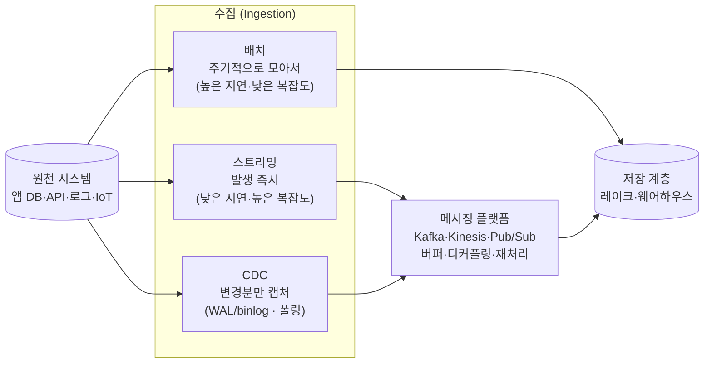

<figure class="post-figure post-figure--header">
<svg role="img" aria-label="데이터 수집의 전체 그림: 왼쪽의 다양한 원천 시스템(앱 DB·외부 API·로그·IoT)에서 데이터가, 가운데의 세 가지 수집 방식(배치·스트리밍·CDC)을 거쳐 오른쪽의 저장 계층으로 흘러 들어간다. 스트리밍·CDC 경로 가운데에는 메시징 플랫폼이 버퍼이자 완충 지대로 놓여 있어, 원천과 저장을 디커플링하고 재처리를 가능하게 한다." viewBox="0 0 680 300" xmlns="http://www.w3.org/2000/svg">
  <title>데이터 수집 — 원천에서 배치·스트리밍·CDC 세 경로로 저장 계층까지</title>
  <!-- LEFT: source systems -->
  <text x="66" y="28" text-anchor="middle" font-size="13" fill="currentColor" font-weight="700" opacity="0.75">원천 시스템</text>
  <g font-size="10">
    <rect x="20" y="46" width="96" height="34" rx="3" fill="var(--bg-light)" stroke="currentColor" stroke-width="2"/>
    <text x="68" y="67" text-anchor="middle" fill="currentColor">앱 DB</text>
    <rect x="20" y="92" width="96" height="34" rx="3" fill="var(--bg-light)" stroke="currentColor" stroke-width="2"/>
    <text x="68" y="113" text-anchor="middle" fill="currentColor">외부 API</text>
    <rect x="20" y="138" width="96" height="34" rx="3" fill="var(--bg-light)" stroke="currentColor" stroke-width="2"/>
    <text x="68" y="159" text-anchor="middle" fill="currentColor">로그</text>
    <rect x="20" y="184" width="96" height="34" rx="3" fill="var(--bg-light)" stroke="currentColor" stroke-width="2"/>
    <text x="68" y="205" text-anchor="middle" fill="currentColor">IoT 이벤트</text>
  </g>

  <!-- arrows: sources into the three ingestion modes -->
  <g stroke="var(--secondary-color)" stroke-width="2" opacity="0.85">
    <line x1="118" y1="63" x2="200" y2="78" marker-end="url(#di-arrow)"/>
    <line x1="118" y1="109" x2="200" y2="132" marker-end="url(#di-arrow)"/>
    <line x1="118" y1="155" x2="200" y2="186" marker-end="url(#di-arrow)"/>
    <line x1="118" y1="201" x2="200" y2="190" marker-end="url(#di-arrow)"/>
  </g>

  <!-- MIDDLE: three ingestion modes -->
  <text x="300" y="28" text-anchor="middle" font-size="13" fill="currentColor" font-weight="700" opacity="0.75">수집 방식</text>
  <g font-size="11" font-weight="700">
    <rect x="206" y="58" width="188" height="44" rx="3" fill="var(--bg-light)" stroke="currentColor" stroke-width="2"/>
    <text x="300" y="80" text-anchor="middle" fill="currentColor">배치 (Batch)</text>
    <text x="300" y="95" text-anchor="middle" font-size="8.5" font-weight="400" fill="currentColor" opacity="0.8">주기적으로 모아서</text>

    <rect x="206" y="112" width="188" height="44" rx="3" fill="var(--bg-light)" stroke="currentColor" stroke-width="2"/>
    <text x="300" y="134" text-anchor="middle" fill="currentColor">스트리밍 (Streaming)</text>
    <text x="300" y="149" text-anchor="middle" font-size="8.5" font-weight="400" fill="currentColor" opacity="0.8">발생 즉시 흘려보내</text>

    <rect x="206" y="166" width="188" height="52" rx="3" fill="var(--bg-light)" stroke="var(--accent-color)" stroke-width="2.5"/>
    <text x="300" y="188" text-anchor="middle" fill="currentColor">CDC</text>
    <text x="300" y="203" text-anchor="middle" font-size="8.5" font-weight="400" fill="currentColor" opacity="0.8">변경분만 골라서</text>
  </g>

  <!-- messaging buffer riding the streaming/CDC paths -->
  <rect x="416" y="116" width="74" height="96" rx="4" fill="var(--bg-panel)" stroke="var(--gold)" stroke-width="2.5"/>
  <text x="453" y="156" text-anchor="middle" font-size="10" fill="currentColor" font-weight="700">메시징</text>
  <text x="453" y="170" text-anchor="middle" font-size="10" fill="currentColor" font-weight="700">버퍼</text>
  <text x="453" y="188" text-anchor="middle" font-size="8" font-weight="400" fill="currentColor" opacity="0.8">디커플링</text>
  <text x="453" y="199" text-anchor="middle" font-size="8" font-weight="400" fill="currentColor" opacity="0.8">·재처리</text>

  <!-- arrows from modes to buffer / storage -->
  <g stroke="var(--secondary-color)" stroke-width="2" opacity="0.85">
    <line x1="394" y1="134" x2="414" y2="142" marker-end="url(#di-arrow)"/>
    <line x1="394" y1="190" x2="414" y2="180" marker-end="url(#di-arrow)"/>
    <line x1="490" y1="164" x2="556" y2="142" marker-end="url(#di-arrow)"/>
  </g>
  <!-- batch goes straight to storage -->
  <line x1="394" y1="80" x2="556" y2="118" stroke="var(--secondary-color)" stroke-width="2" opacity="0.85" marker-end="url(#di-arrow)"/>

  <!-- RIGHT: storage -->
  <rect x="560" y="104" width="104" height="92" rx="4" fill="var(--bg-panel)" stroke="var(--accent-color)" stroke-width="2.5"/>
  <text x="612" y="146" text-anchor="middle" font-size="12" fill="currentColor" font-weight="700">저장 계층</text>
  <text x="612" y="164" text-anchor="middle" font-size="9" fill="currentColor" opacity="0.85">레이크 ·</text>
  <text x="612" y="178" text-anchor="middle" font-size="9" fill="currentColor" opacity="0.85">웨어하우스</text>

  <defs>
    <marker id="di-arrow" markerWidth="8" markerHeight="8" refX="6" refY="4" orient="auto">
      <path d="M0,0 L8,4 L0,8 z" fill="var(--secondary-color)"/>
    </marker>
  </defs>
</svg>
<figcaption>데이터 수집의 한 장 요약 — 다양한 원천(앱 DB·API·로그·IoT)이 배치·스트리밍·CDC 세 경로로 저장 계층까지 흘러간다. 스트리밍·CDC 경로 가운데 놓인 메시징 버퍼가 원천과 저장을 디커플링하고 재처리를 가능케 하는 완충 지대다.</figcaption>
</figure>

## 들어가며

수명주기에서 **수집(Ingestion)**은 원천 시스템에서 데이터를 실제로 끌어와 우리 영역으로 들이는 단계입니다. 1단계에서 살펴봤듯 데이터 엔지니어링의 가장 큰 병목이 자주 발생하는 지점이기도 합니다. 원천은 우리가 통제하지 못하는 경우가 많고(다른 팀의 운영 DB, 외부 API), 데이터의 양과 형태는 끊임없이 변하며, 단 한 건의 유실도 하류 전체의 신뢰를 무너뜨립니다.

이 글은 `Data-Engineering-Essential` 시리즈의 3단계로, 수집을 둘러싼 핵심 결정들을 다룹니다. **언제·얼마나 자주** 가져올 것인가(배치 vs 스트리밍), **무엇이 바뀌었는지**를 어떻게 알아낼 것인가(CDC), 원천과 저장 사이의 충격을 무엇이 흡수할 것인가(메시징 플랫폼), 그리고 이 일을 **직접 만들 것인가 사 올 것인가**(수집 도구의 build vs buy)입니다.

### 📌 이 글에서 다루는 내용

#### 🔍 핵심 주제

- **배치 vs 스트리밍**: 처리 주기·지연(latency)·복잡도의 트레이드오프와 그 절충점인 마이크로배치
- **변경 데이터 캡처(CDC)**: 로그 기반(WAL/binlog) vs 쿼리 기반(타임스탬프 폴링)의 차이와 장단점
- **메시징·스트리밍 플랫폼**: Kafka·Kinesis·Pub/Sub의 버퍼·디커플링·재처리 역할과 전달 보장
- **수집 도구·커넥터**: Airbyte·Fivetran 같은 EL 도구 vs 직접 구현의 경계(build vs buy)

#### 🎯 왜 중요한가

수집의 선택은 그 자체로 비용·지연·운영 부담을 결정하지만, 무엇보다 **되돌리기 어렵습니다**. 한번 스트리밍으로 짜인 아키텍처를 배치로 돌리거나 반대로 가는 일은 큰 공사입니다. "요구사항이 정말 실시간을 필요로 하는가?"를 먼저 묻는 습관이 과잉 설계를 막아 줍니다.

## 한눈에 보기 — 원천에서 저장까지의 세 경로

수집은 결국 **원천 → 수집 방식 → 저장**이라는 한 줄로 요약됩니다. 다만 그 가운데 칸을 무엇으로 채우느냐 — 배치냐 스트리밍이냐 CDC냐 — 에 따라 지연과 복잡도가 갈립니다. 스트리밍·CDC 계열에서는 메시징 플랫폼이 원천과 저장 사이의 완충 지대 역할을 합니다.

이 그림을 머릿속에 두고, 이제 각 칸의 선택지를 하나씩 깊이 들여다봅니다.

## 1. 배치 vs 스트리밍 수집

수집에서 가장 먼저, 그리고 가장 크게 갈리는 결정은 **데이터를 얼마나 자주 가져오느냐**입니다.

**배치(Batch) 수집**은 일정 주기로 데이터를 **한 덩어리씩 모아서** 가져옵니다. "매일 자정에 어제치 주문을 전부 적재", "한 시간마다 새 로그 파일을 옮김" 같은 식입니다. 경계가 명확한(bounded) 데이터를 다루므로 로직이 단순하고, 실패하면 그 배치만 다시 돌리면 되며, 장비도 정해진 시간에만 바쁩니다. 대신 데이터가 들어오는 시점과 쓸 수 있는 시점 사이에 **태생적인 지연**이 존재합니다. 자정 배치라면 오후의 데이터는 다음 날에야 보입니다.

**스트리밍(Streaming) 수집**은 데이터가 **발생하는 즉시 한 건(또는 작은 묶음)씩** 흘려보냅니다. 끝이 없는(unbounded) 데이터 흐름을 다루므로 지연이 수 초~밀리초까지 줄지만, 그만큼 다뤄야 할 문제가 많아집니다. 이벤트가 순서대로 오지 않을 수 있고(out-of-order), 한 번 더 올 수도 있으며(중복), 늦게 도착하는 데이터(late data)를 어떻게 집계 윈도에 넣을지 결정해야 합니다. 항상 떠 있는 시스템이라 운영·모니터링 부담도 큽니다.

둘 사이의 절충이 **마이크로배치(Micro-batch)**입니다. "실시간처럼 보이되 구현은 배치에 가깝게" — 몇 초~몇 분 간격의 아주 작은 배치를 빠르게 반복합니다. Spark Structured Streaming의 기본 동작이 대표적입니다. 진짜 이벤트 단위 스트리밍(예: Flink)만큼 지연이 낮지는 않지만, 배치의 단순함을 상당 부분 유지하면서 지연을 크게 줄일 수 있어 **현실에서 가장 자주 선택되는 중간 지대**입니다.

<figure class="post-figure">
<svg role="img" aria-label="배치·마이크로배치·스트리밍 세 가지 수집 방식을 같은 시간 축 위에서 비교한 그림. 위쪽 배치는 긴 주기로 데이터를 큰 덩어리로 한 번에 처리해 지연이 크지만 복잡도가 낮다. 가운데 마이크로배치는 짧은 주기로 작은 덩어리를 반복 처리해 지연과 복잡도가 중간이다. 아래쪽 스트리밍은 이벤트가 발생할 때마다 한 건씩 즉시 처리해 지연이 가장 낮지만 복잡도가 가장 높다. 오른쪽 화살표는 위에서 아래로 갈수록 지연은 줄고 복잡도는 커진다는 트레이드오프를 나타낸다." viewBox="0 0 660 320" xmlns="http://www.w3.org/2000/svg">
  <title>배치 vs 마이크로배치 vs 스트리밍 — 같은 시간 축 위의 지연·복잡도 트레이드오프</title>

  <!-- shared time axis label -->
  <text x="300" y="22" text-anchor="middle" font-size="11" fill="currentColor" font-weight="700" opacity="0.7">시간 →</text>
  <line x1="120" y1="30" x2="540" y2="30" stroke="currentColor" stroke-width="1" opacity="0.25"/>

  <!-- ===== Batch row ===== -->
  <text x="60" y="74" text-anchor="middle" font-size="12" fill="currentColor" font-weight="700">배치</text>
  <text x="60" y="90" text-anchor="middle" font-size="8" fill="currentColor" opacity="0.7">주기적·큰 덩어리</text>
  <line x1="120" y1="80" x2="540" y2="80" stroke="currentColor" stroke-width="1.5" opacity="0.3"/>
  <!-- one big batch block -->
  <rect x="130" y="62" width="180" height="34" rx="3" fill="var(--bg-light)" stroke="currentColor" stroke-width="2"/>
  <text x="220" y="83" text-anchor="middle" font-size="9" fill="currentColor" opacity="0.85">큰 덩어리</text>
  <rect x="350" y="62" width="180" height="34" rx="3" fill="var(--bg-light)" stroke="currentColor" stroke-width="2"/>
  <text x="440" y="83" text-anchor="middle" font-size="9" fill="currentColor" opacity="0.85">큰 덩어리</text>
  <text x="330" y="112" text-anchor="middle" font-size="8.5" fill="currentColor" opacity="0.65">긴 주기 → 큰 지연, 단순</text>

  <!-- divider -->
  <line x1="40" y1="130" x2="620" y2="130" stroke="currentColor" stroke-width="1" opacity="0.2"/>

  <!-- ===== Micro-batch row ===== -->
  <text x="60" y="170" text-anchor="middle" font-size="12" fill="currentColor" font-weight="700">마이크로</text>
  <text x="60" y="184" text-anchor="middle" font-size="12" fill="currentColor" font-weight="700">배치</text>
  <line x1="120" y1="176" x2="540" y2="176" stroke="currentColor" stroke-width="1.5" opacity="0.3"/>
  <g fill="var(--bg-light)" stroke="var(--accent-color)" stroke-width="2">
    <rect x="130" y="160" width="56" height="30" rx="3"/>
    <rect x="198" y="160" width="56" height="30" rx="3"/>
    <rect x="266" y="160" width="56" height="30" rx="3"/>
    <rect x="334" y="160" width="56" height="30" rx="3"/>
    <rect x="402" y="160" width="56" height="30" rx="3"/>
    <rect x="470" y="160" width="56" height="30" rx="3"/>
  </g>
  <text x="330" y="208" text-anchor="middle" font-size="8.5" fill="currentColor" opacity="0.65">짧은 주기 → 중간 지연, 중간 복잡도</text>

  <!-- divider -->
  <line x1="40" y1="226" x2="620" y2="226" stroke="currentColor" stroke-width="1" opacity="0.2"/>

  <!-- ===== Streaming row ===== -->
  <text x="60" y="266" text-anchor="middle" font-size="12" fill="currentColor" font-weight="700">스트리밍</text>
  <text x="60" y="280" text-anchor="middle" font-size="8" fill="currentColor" opacity="0.7">건당·즉시</text>
  <line x1="120" y1="272" x2="540" y2="272" stroke="currentColor" stroke-width="1.5" opacity="0.3"/>
  <g fill="var(--gold)" opacity="0.9">
    <circle cx="140" cy="272" r="5"/>
    <circle cx="175" cy="272" r="5"/>
    <circle cx="212" cy="272" r="5"/>
    <circle cx="258" cy="272" r="5"/>
    <circle cx="300" cy="272" r="5"/>
    <circle cx="345" cy="272" r="5"/>
    <circle cx="392" cy="272" r="5"/>
    <circle cx="430" cy="272" r="5"/>
    <circle cx="478" cy="272" r="5"/>
    <circle cx="520" cy="272" r="5"/>
  </g>
  <text x="330" y="300" text-anchor="middle" font-size="8.5" fill="currentColor" opacity="0.65">건당 즉시 → 최소 지연, 최대 복잡도</text>

  <!-- trade-off arrow on the right -->
  <line x1="600" y1="60" x2="600" y2="290" stroke="var(--secondary-color)" stroke-width="2.5" marker-end="url(#bs-arrow)"/>
  <text x="616" y="120" text-anchor="middle" font-size="9" fill="currentColor" opacity="0.7" transform="rotate(90 616 120)">지연 ↓ · 복잡도 ↑</text>

  <defs>
    <marker id="bs-arrow" markerWidth="8" markerHeight="8" refX="6" refY="4" orient="auto">
      <path d="M0,0 L8,4 L0,8 z" fill="var(--secondary-color)"/>
    </marker>
  </defs>
</svg>
<figcaption>같은 시간 축 위에서 본 세 방식 — 배치는 큰 덩어리를 긴 주기로(큰 지연·단순), 마이크로배치는 작은 덩어리를 짧은 주기로(중간), 스트리밍은 한 건씩 즉시(최소 지연·최대 복잡도) 처리한다. 위에서 아래로 갈수록 지연은 줄지만 다뤄야 할 복잡도는 커진다.</figcaption>
</figure>

> 💡 가장 흔한 실수는 "최신 데이터가 좋으니 무조건 스트리밍"입니다. 대부분의 분석·리포트는 시간/일 단위 신선도로 충분하며, 스트리밍의 운영 비용은 배치보다 훨씬 큽니다. **밀리초 단위 지연이 비즈니스 가치를 실제로 바꾸는가?**를 먼저 묻고, 아니라면 배치(또는 마이크로배치)를 택하는 것이 보통 옳습니다.

## 2. 변경 데이터 캡처(CDC)

원천이 데이터베이스일 때, 매번 테이블 전체를 다시 퍼 오는 **풀 로드(full load)**는 규모가 커지면 감당이 안 됩니다. 우리가 정말 원하는 것은 **지난번 이후 무엇이 바뀌었는가** — 새로 추가되고, 수정되고, 삭제된 행뿐입니다. 이 변경분만 골라 잡아내는 기법이 **변경 데이터 캡처(Change Data Capture, CDC)**입니다. CDC를 쓰면 매번 적은 양의 델타만 옮기므로 효율적이고, 운영 DB에 가하는 부하도 줄어듭니다. CDC를 구현하는 방식은 크게 두 갈래입니다.

**쿼리 기반(Query-based) CDC**는 가장 직관적인 방법입니다. 테이블에 `updated_at` 같은 타임스탬프나 단조 증가하는 버전 컬럼을 두고, **주기적으로 "지난번 이후 바뀐 행"을 SELECT로 조회(폴링)**합니다. 구현이 간단하고 특별한 권한이나 인프라가 필요 없는 것이 장점입니다. 그러나 한계가 분명합니다 — 폴링 사이에 같은 행이 여러 번 바뀌면 **마지막 상태만** 잡히고 중간 변화는 사라지며, 무엇보다 **삭제(DELETE)는 행 자체가 없어지므로 감지하기 어렵습니다**(소프트 삭제 플래그를 따로 둬야 함). 폴링 쿼리 자체가 원천 DB에 반복 부하를 주는 점, 그리고 폴링 주기만큼의 지연도 단점입니다.

**로그 기반(Log-based) CDC**는 데이터베이스가 내부적으로 남기는 **트랜잭션 로그**를 직접 읽습니다. PostgreSQL의 **WAL(Write-Ahead Log)**, MySQL의 **binlog**가 그것입니다. 모든 변경은 커밋 전에 이 로그에 기록되므로, 로그를 따라 읽으면 **INSERT·UPDATE·DELETE를 발생 순서 그대로, 하나도 빠짐없이** 재구성할 수 있습니다. **Debezium**이 대표적인 도구로, WAL/binlog를 읽어 변경 이벤트를 Kafka 같은 스트림으로 흘려보냅니다. 운영 쿼리에 부하를 거의 주지 않고, 삭제까지 포착하며, 사실상 실시간에 가깝다는 점에서 가장 강력합니다. 대신 DB별 로그 포맷에 맞는 커넥터가 필요하고, 적절한 권한과 로그 보존 설정이 필요해 **설정과 운영이 더 복잡**합니다.

| 구분 | 쿼리 기반 CDC | 로그 기반 CDC |
| --- | --- | --- |
| 동작 방식 | 타임스탬프/버전 컬럼 폴링(SELECT) | 트랜잭션 로그(WAL/binlog) 구독 |
| 대표 도구 | 직접 구현, 일부 EL 도구 | Debezium |
| 삭제 감지 | 어려움(소프트 삭제 필요) | 가능 |
| 중간 변경 | 누락(마지막 상태만) | 모두 포착 |
| 원천 DB 부하 | 폴링 쿼리만큼 부담 | 거의 없음 |
| 지연 | 폴링 주기에 의존 | 사실상 실시간 |
| 구현 난이도 | 낮음 | 높음(권한·로그 설정) |

> 💡 일반적으로 **로그 기반 CDC가 정확성·실시간성에서 우월**하지만, 원천 DB에 대한 권한과 운영 역량이 전제됩니다. 권한을 못 얻거나 변경 빈도가 낮은 작은 테이블이라면, 단순한 쿼리 기반 폴링이 실용적인 선택일 수 있습니다.

## 3. 메시징·스트리밍 플랫폼

스트리밍과 CDC를 이야기할 때 빠지지 않는 것이 **메시징·스트리밍 플랫폼**입니다. **Apache Kafka**, AWS **Kinesis**, GCP **Pub/Sub**이 대표적입니다. 이들이 원천과 저장 사이에 놓이는 이유는 단순히 데이터를 나르기 위해서가 아니라, 그 가운데에서 **완충 지대(buffer)** 역할을 하기 때문입니다.

- **버퍼(Buffering)**: 원천이 데이터를 폭발적으로 쏟아내도, 하류 소비자(저장·처리)는 자기 속도로 천천히 읽어 갑니다. 순간적인 트래픽 급증을 플랫폼이 흡수해 하류가 무너지지 않게 합니다.
- **디커플링(Decoupling)**: 생산자(producer)와 소비자(consumer)가 서로를 직접 알 필요가 없습니다. 원천은 "토픽에 던지기만" 하고, 누가 그것을 읽는지는 신경 쓰지 않습니다. 새로운 소비자(예: 실시간 대시보드)를 나중에 추가해도 원천을 건드리지 않습니다.
- **재처리(Replay)**: 메시지가 일정 기간 로그로 보존되므로, 소비자가 처음부터 다시 읽을 수 있습니다. 하류 로직에 버그가 있었다면 **과거 데이터를 처음부터 다시 흘려보내** 바로잡을 수 있습니다. 이 재처리 능력은 데이터 파이프라인의 신뢰성에서 매우 중요합니다.

이 플랫폼들이 다루는 또 하나의 핵심 개념이 **전달 보장(delivery guarantee)**입니다. 분산 환경에서는 메시지가 유실되거나 중복될 수 있어, 어디까지 보장할지를 정해야 합니다.

- **at-most-once(최대 한 번)**: 유실은 허용하되 중복은 없음. 가장 단순하고 빠르지만 데이터를 잃을 수 있습니다.
- **at-least-once(최소 한 번)**: 유실은 없되 중복은 가능. 가장 흔한 선택으로, 소비자 쪽에서 **멱등(idempotent) 처리**로 중복을 흡수합니다.
- **exactly-once(정확히 한 번)**: 유실도 중복도 없음. 가장 이상적이지만 구현 비용이 크고, 보통 트랜잭션·체크포인트 같은 추가 장치가 필요합니다.

실무에서는 **at-least-once + 멱등 소비**가 가장 현실적인 조합으로 널리 쓰입니다. "정확히 한 번"을 시스템 끝까지 보장하는 비용보다, 중복을 무해하게 만드는 편이 대체로 단순하기 때문입니다.

> Kafka는 단순한 메시지 큐를 넘어 분산 로그·파티셔닝·컨슈머 그룹·스트림 처리까지 아우르는 깊은 주제라, 이 시리즈에서는 역할을 소개하는 선에서 멈춥니다. **Kafka는 향후 별도 시리즈에서 깊이 다룰 예정입니다.**

## 4. 수집 도구·커넥터 — build vs buy

마지막 질문은 실무적입니다 — 이 모든 수집을 **직접 구현할 것인가, 만들어진 도구를 사 올 것인가?**

**Fivetran**, **Airbyte** 같은 도구는 수백 종의 원천(데이터베이스, SaaS API, 파일 등)에 대한 **사전 제작 커넥터**를 제공해, 원천 → 저장의 추출·적재(EL)를 자동화합니다. 변환(T)은 적재 후 dbt 등에 맡기는 ELT 철학에 맞춰, 이들은 "데이터를 일단 웨어하우스/레이크로 옮기는" 일에 집중합니다. Fivetran은 완전 매니지드 상용 서비스로 설정이 거의 없는 대신 데이터 양에 따라 비용이 붙고, Airbyte는 오픈소스로 직접 호스팅하거나 클라우드 버전을 쓸 수 있어 더 유연합니다.

직접 구현(build)과 도구 구매(buy)는 다음과 같이 갈립니다.

| 관점 | 직접 구현 (Build) | 도구 사용 (Buy) |
| --- | --- | --- |
| 초기 속도 | 느림(커넥터부터 직접) | 빠름(클릭 몇 번) |
| 유지보수 | 우리 몫(원천 API 변경 추적 등) | 벤더/커뮤니티가 담당 |
| 비용 | 엔지니어 인건비 | 데이터 양·라이선스 비용 |
| 통제·커스텀 | 완전한 제어 | 커넥터가 지원하는 범위 내 |
| 적합한 경우 | 특수·고성능·비표준 원천 | 표준 SaaS·DB 다수, 빠른 시작 |

판단의 핵심은 **"이 수집이 우리의 차별화 역량인가, 아니면 그저 해결해야 할 배관 작업인가"**입니다. Salesforce·Stripe·표준 DB처럼 흔한 원천이라면, 직접 커넥터를 짜고 유지보수하는 것은 대개 낭비입니다. 잘 만들어진 도구가 원천 API 변경까지 따라가 주므로, 그 시간을 더 가치 있는 변환·모델링에 쓰는 편이 낫습니다. 반대로 원천이 비표준이거나, 극단적인 처리량·지연 요구가 있거나, 커넥터가 지원하지 않는 정밀한 제어가 필요하다면 직접 구현이 정당화됩니다.

> 💡 데이터 성숙도와도 연결됩니다(1단계 참고). 시작·확장 단계 조직에서는 **buy로 빠르게 데이터를 흐르게 하고**, 정말 차별화가 필요한 일부 원천만 선별적으로 build하는 전략이 보통 합리적입니다.

## 정리

수집은 "데이터를 그냥 옮기는 일"처럼 보이지만, 실은 지연·정확성·비용·운영 부담을 한꺼번에 결정하는 무게 있는 단계입니다. 이 글의 요점을 정리하면 다음과 같습니다.

- **배치 vs 스트리밍**은 처리 주기·지연·복잡도의 트레이드오프입니다. 대부분은 배치(또는 마이크로배치)로 충분하며, **진짜 실시간이 필요한가**를 먼저 물어야 합니다.
- **CDC**는 변경분만 효율적으로 잡는 기법으로, **로그 기반(WAL/binlog, Debezium)**이 정확성·실시간성에서 우월하고 **쿼리 기반(폴링)**이 단순합니다 — 권한과 요구에 맞춰 고릅니다.
- **메시징 플랫폼(Kafka·Kinesis·Pub/Sub)**은 원천과 저장을 **버퍼·디커플링·재처리**로 잇는 완충 지대이며, 전달 보장은 보통 **at-least-once + 멱등 소비**가 현실적입니다.
- **수집 도구(Airbyte·Fivetran)**는 표준 원천을 빠르게 잇게 해 줍니다. **build vs buy**는 "이 수집이 우리의 차별화인가, 배관인가"로 판단합니다.

가져온 데이터는 이제 어딘가에 **쌓여야** 합니다. 다음 글에서는 그 데이터가 머무는 곳 — 웨어하우스·레이크·레이크하우스와 파일·테이블 포맷 — 을 다룹니다.

### 다음 학습 (Next Learning)

- [Data Engineering Essential Curriculum](/2026/06/25/data-engineering-essential-curriculum.html) — 전체 로드맵으로 돌아가 진행 상황 확인하기
- [데이터 파이프라인의 역사와 진화: ETL에서 Lakehouse까지](/2026/06/25/data-pipeline-history-and-evolution.html) — 2단계: ETL→ELT, DW→Lakehouse, 배치→스트리밍의 맥락 복습
- [데이터 저장(Storage): 웨어하우스·레이크·레이크하우스와 파일·테이블 포맷](/2026/06/25/data-storage.html) — 4단계: 가져온 데이터를 어디에 어떤 형태로 쌓을 것인가
