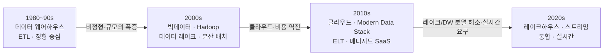

<figure class="post-figure post-figure--header">
<svg role="img" aria-label="데이터 아키텍처가 네 시대를 거쳐 진화하며, 그 위에 네 개의 진자가 양극단을 오가는 그림: ① 1980~90년대 데이터 웨어하우스(ETL·정형), ② 2000년대 빅데이터·Hadoop·데이터 레이크(분산 배치), ③ 2010년대 클라우드·Modern Data Stack(ELT·SaaS), ④ 2020년대 레이크하우스·스트리밍(통합·실시간)으로 이어지는 오르막 흐름. 위쪽에는 정형↔유연, 변환 위치(적재 전↔후), 중앙집중↔분산, 배치↔실시간이라는 진자가 시대를 따라 반대편으로 흔들린다." viewBox="0 0 680 320" xmlns="http://www.w3.org/2000/svg">
  <title>데이터 파이프라인의 진화 — 네 시대를 거치며 반복되는 진자 운동</title>
  <!-- TOP: the pendulum — swinging between two poles across the eras -->
  <text x="340" y="22" text-anchor="middle" font-size="12" fill="currentColor" font-weight="700" opacity="0.75">반복되는 진자 — 양극단을 오간다</text>
  <line x1="40" y1="34" x2="640" y2="34" stroke="currentColor" stroke-width="1.5" opacity="0.3"/>
  <!-- pivot + swinging bob (static, leaning to one side) -->
  <circle cx="340" cy="34" r="3" fill="currentColor"/>
  <line x1="340" y1="34" x2="436" y2="70" stroke="var(--gold)" stroke-width="2"/>
  <circle cx="436" cy="70" r="7" fill="var(--gold)" opacity="0.9"/>
  <!-- swing-range ghosts -->
  <line x1="340" y1="34" x2="244" y2="70" stroke="currentColor" stroke-width="1.5" stroke-dasharray="2 4" opacity="0.4"/>
  <circle cx="244" cy="70" r="6" fill="none" stroke="currentColor" stroke-width="1.5" opacity="0.45"/>
  <path d="M268,78 A100,100 0 0 1 412,78" fill="none" stroke="currentColor" stroke-width="1.2" stroke-dasharray="2 4" opacity="0.35"/>
  <text x="150" y="60" text-anchor="middle" font-size="9.5" fill="currentColor" opacity="0.8">정형 · 중앙집중 · 배치</text>
  <text x="150" y="74" text-anchor="middle" font-size="9.5" fill="currentColor" opacity="0.8">적재 전 변환(ETL)</text>
  <text x="540" y="60" text-anchor="middle" font-size="9.5" fill="currentColor" opacity="0.8">유연 · 분산 · 실시간</text>
  <text x="540" y="74" text-anchor="middle" font-size="9.5" fill="currentColor" opacity="0.8">적재 후 변환(ELT)</text>

  <!-- BOTTOM: four eras as an ascending staircase -->
  <g font-size="11" font-weight="700">
    <!-- Era 1 -->
    <rect x="28" y="232" width="140" height="58" rx="3" fill="var(--bg-light)" stroke="currentColor" stroke-width="2"/>
    <text x="98" y="214" text-anchor="middle" font-size="10" fill="currentColor" opacity="0.7">1980~90s</text>
    <text x="98" y="256" text-anchor="middle" fill="currentColor">데이터 웨어하우스</text>
    <text x="98" y="274" text-anchor="middle" font-size="9" font-weight="400" fill="currentColor" opacity="0.85">ETL · 정형 중심</text>
    <!-- Era 2 -->
    <rect x="184" y="196" width="140" height="94" rx="3" fill="var(--bg-light)" stroke="currentColor" stroke-width="2"/>
    <text x="254" y="178" text-anchor="middle" font-size="10" fill="currentColor" opacity="0.7">2000s</text>
    <text x="254" y="222" text-anchor="middle" fill="currentColor">빅데이터 · Hadoop</text>
    <text x="254" y="240" text-anchor="middle" font-size="9.5" font-weight="400" fill="currentColor" opacity="0.85">데이터 레이크</text>
    <text x="254" y="256" text-anchor="middle" font-size="9" font-weight="400" fill="currentColor" opacity="0.85">분산 배치</text>
    <!-- Era 3 -->
    <rect x="340" y="160" width="140" height="130" rx="3" fill="var(--bg-light)" stroke="currentColor" stroke-width="2"/>
    <text x="410" y="142" text-anchor="middle" font-size="10" fill="currentColor" opacity="0.7">2010s</text>
    <text x="410" y="186" text-anchor="middle" fill="currentColor">클라우드 · MDS</text>
    <text x="410" y="204" text-anchor="middle" font-size="9.5" font-weight="400" fill="currentColor" opacity="0.85">ELT · 매니지드 SaaS</text>
    <!-- Era 4 -->
    <rect x="496" y="120" width="156" height="170" rx="3" fill="var(--bg-light)" stroke="var(--accent-color)" stroke-width="2.5"/>
    <text x="574" y="102" text-anchor="middle" font-size="10" fill="currentColor" opacity="0.7">2020s</text>
    <text x="574" y="150" text-anchor="middle" fill="currentColor">레이크하우스</text>
    <text x="574" y="168" text-anchor="middle" font-size="9.5" font-weight="400" fill="currentColor" opacity="0.85">스트리밍</text>
    <text x="574" y="186" text-anchor="middle" font-size="9" font-weight="400" fill="currentColor" opacity="0.85">통합 · 실시간</text>
  </g>
  <!-- rising arrows between eras -->
  <g stroke="var(--secondary-color)" stroke-width="2.5">
    <line x1="170" y1="248" x2="182" y2="232" marker-end="url(#hist-arrow)"/>
    <line x1="326" y1="212" x2="338" y2="196" marker-end="url(#hist-arrow)"/>
    <line x1="482" y1="176" x2="494" y2="160" marker-end="url(#hist-arrow)"/>
  </g>
  <defs>
    <marker id="hist-arrow" markerWidth="8" markerHeight="8" refX="6" refY="4" orient="auto">
      <path d="M0,0 L8,4 L0,8 z" fill="var(--secondary-color)"/>
    </marker>
  </defs>
</svg>
<figcaption>데이터 아키텍처의 40여 년 — 웨어하우스에서 빅데이터·레이크, 클라우드·Modern Data Stack, 레이크하우스·스트리밍으로 이어지는 오르막. 그 위에서 정형↔유연, 적재 전↔후 변환, 중앙집중↔분산, 배치↔실시간이라는 진자가 시대마다 반대편으로 흔들린다.</figcaption>
</figure>

## 들어가며

오늘날의 데이터 스택은 어느 날 갑자기 완성된 모습으로 등장하지 않았습니다. Snowflake에 데이터를 적재하고 dbt로 변환하며 Airflow로 스케줄링하는 지금의 방식은, **지난 40여 년간 각 시대가 마주친 한계를 풀어 온 진화의 결과**입니다. 왜 한때는 변환(Transform)을 적재(Load)보다 먼저 했는데 지금은 순서가 바뀌었을까요? 왜 데이터 레이크가 등장했고, 또 왜 레이크하우스로 다시 합쳐지고 있을까요?

이 글은 `Data-Engineering-Essential` 시리즈의 2단계로, 데이터 파이프라인의 역사를 따라가며 **현재의 도구 선택이 왜 이렇게 생겼는지**를 이해하는 것을 목표로 합니다. 역사를 알면 유행하는 도구에 휩쓸리지 않고, 그 도구가 풀려는 문제와 치르는 대가를 함께 볼 수 있습니다.

### 📌 이 글에서 다루는 내용

#### 🔍 핵심 주제

- **데이터 웨어하우스의 탄생**: OLTP와 분석의 분리, Inmon vs Kimball, ETL의 등장
- **빅데이터와 데이터 레이크**: Hadoop·MapReduce, 스키마 온 리드, 그리고 "데이터 늪"
- **ETL → ELT 전환**: 비용 구조의 역전이 변환의 위치를 바꾼 과정
- **Modern Data Stack과 레이크하우스**: 클라우드 DW, dbt, 그리고 레이크+웨어하우스의 통합
- **배치 → 스트리밍**: MapReduce에서 Spark, 그리고 실시간 처리로

#### 🎯 왜 중요한가

각 시대는 **이전의 한계를 풀면서 새로운 한계를 만들어** 왔습니다. 이 진화의 패턴을 알면, 다음에 등장할 기술도 "무엇을 풀고 무엇을 포기하는가"의 관점으로 평가할 수 있습니다.

## 한눈에 보기 — 시대별 흐름

데이터 아키텍처는 크게 네 시대를 거쳐 왔습니다. 각 시대를 관통하는 한 줄의 변화를 먼저 그려 두면 세부가 자리를 잡습니다.

## 1. 데이터 웨어하우스의 시대 (1980~90s)

이야기는 하나의 깨달음에서 시작됩니다 — **운영 데이터베이스에서 직접 분석을 돌리면 안 된다.** 주문을 처리하는 OLTP(Online Transaction Processing) 데이터베이스는 빠른 단건 읽기/쓰기에 최적화되어 있어, "지난 3년간 지역별 매출 추이" 같은 대규모 집계 쿼리를 돌리면 운영 시스템 전체가 느려졌습니다. 그래서 분석 전용 저장소, **데이터 웨어하우스(Data Warehouse)**가 분리되어 나왔습니다. 이것이 OLAP(Online Analytical Processing)의 출발입니다.

웨어하우스를 어떻게 설계할 것인가를 두고 두 거장의 접근이 갈렸습니다.

- **Bill Inmon (Top-down)**: 전사적 데이터 웨어하우스(EDW)를 정규화된(3NF) 단일 진실 공급원으로 먼저 구축하고, 부서별 데이터 마트를 그 아래에 둡니다. 일관성은 강하지만 초기 구축이 무겁습니다.
- **Ralph Kimball (Bottom-up)**: 비즈니스 프로세스 단위의 **차원 모델(Dimensional Model)** — 사실 테이블(Fact)과 차원 테이블(Dimension)로 구성된 스타 스키마(Star Schema) — 을 먼저 만들고 점진적으로 통합합니다. 분석가가 이해하기 쉽고 빠르게 가치를 냅니다.

이 시대에 **ETL(Extract → Transform → Load)**이 표준으로 자리 잡았습니다. 웨어하우스의 스토리지와 컴퓨팅이 매우 비쌌기 때문에, **값비싼 웨어하우스에 넣기 전에** 별도의 ETL 서버에서 데이터를 미리 정제·변환·집계해 깔끔한 형태로만 적재했습니다. Informatica, DataStage 같은 전용 ETL 도구가 이 시대를 대표합니다. 데이터는 적재 시점에 이미 스키마가 정해져 있어야 했는데, 이를 **스키마 온 라이트(Schema-on-Write)**라 부릅니다.

> **한계**: 정형 데이터만 다룰 수 있었고, 스키마를 미리 고정해야 했으며, 규모를 키우려면 더 비싼 장비로 갈아타는 **스케일 업(Scale-up)**에 의존했습니다. 2000년대 들어 웹·로그·이미지 같은 비정형 데이터가 폭증하자 이 모델은 한계에 부딪힙니다.

## 2. 빅데이터와 Hadoop, 데이터 레이크 (2000s)

구글·야후 같은 기업이 **웹 규모(web-scale)** 데이터를 마주하면서 판이 바뀌었습니다. 단일 고가 장비로는 감당이 안 되는 양을, 구글은 값싼 범용 장비 수천 대로 나눠 처리하는 방식으로 풀었습니다. 그 설계를 담은 **GFS**와 **MapReduce** 논문이 공개되자, 이를 오픈소스로 구현한 **Hadoop**(HDFS + MapReduce)이 빅데이터 시대를 열었습니다.

핵심 전환은 두 가지였습니다.

- **스케일 아웃(Scale-out)**: 더 비싼 한 대가 아니라, 평범한 장비를 **여러 대로 늘려** 처리량을 키웁니다. 분산 시스템이 데이터 엔지니어링의 기본 전제가 됩니다.
- **스키마 온 리드(Schema-on-Read)**: 일단 원본을 형태 불문하고 값싸게 저장해 두고, **읽을 때 비로소** 구조를 해석합니다. 미리 스키마를 정하지 않아도 되니 유연합니다.

이 사고에서 **데이터 레이크(Data Lake)**가 태어났습니다. 정형이든 비정형이든 원본 그대로 호수에 담아 두고, 나중에 필요할 때 꺼내 해석한다는 발상입니다. "버리지 말고 일단 다 저장하라"가 구호였습니다.

> **한계**: Java로 MapReduce 잡을 짜는 일은 복잡하고 느렸으며(디스크 기반), 거버넌스·카탈로그 없이 데이터를 쌓기만 하다 보니 무엇이 어디 있는지 알 수 없는 **데이터 늪(Data Swamp)**으로 전락하기 일쑤였습니다. "저장은 쉬운데 쓸 수가 없다"는 문제가 남았습니다.

## 3. ETL에서 ELT로 — 변환을 어디서 하는가

가장 근본적인 전환은 **변환을 어디서 수행하는가**의 변화입니다. 이를 가능케 한 것은 기술이라기보다 **비용 구조의 역전**이었습니다.

과거 ETL이 "적재 전 변환"을 고집한 이유는 웨어하우스의 스토리지·컴퓨팅이 비쌌기 때문입니다. 그런데 클라우드 시대에 들어 **스토리지가 거의 공짜에 가까워지고**, 무엇보다 **컴퓨팅과 스토리지가 분리(decoupled)**되어 필요할 때만 강력한 연산을 탄력적으로 빌려 쓸 수 있게 되었습니다. 그러자 발상이 뒤집힙니다 — **원본을 먼저 값싸게 적재(Load)하고, 강력한 웨어하우스 안에서 SQL로 변환(Transform)하면 되지 않는가?**

이것이 **ELT(Extract → Load → Transform)**입니다.

| 구분 | ETL | ELT |
| --- | --- | --- |
| 변환 위치 | 적재 **전**, 별도 ETL 서버 | 적재 **후**, 웨어하우스 내부 |
| 저장 대상 | 정제된 데이터만 | **원본**까지 모두 |
| 유연성 | 낮음 (변환 후엔 원본 소실) | 높음 (원본 보존, 재변환 자유) |
| 변환 언어 | 전용 ETL 도구 | **SQL** (분석가·애널리틱스 엔지니어) |
| 전제 조건 | 비싼 스토리지·컴퓨팅 | 값싼 스토리지, 분리된 탄력 컴퓨팅 |

<figure class="post-figure">
<svg role="img" aria-label="ETL과 ELT의 차이를 두 줄의 파이프라인으로 비교한 그림. 위쪽 ETL: 원천에서 추출(E)한 뒤 별도 ETL 서버에서 변환(T)하면서 원본이 버려지고, 정제된 데이터만 비싼 웨어하우스에 적재(L)된다. 아래쪽 ELT: 원천에서 추출(E)해 원본을 그대로 값싼 저장소에 먼저 적재(L)한 뒤, 강력한 웨어하우스 안에서 SQL로 변환(T)한다. ETL은 변환이 적재 앞에 오고 원본이 소실되며, ELT는 변환이 적재 뒤에 오고 원본이 보존된다." viewBox="0 0 660 330" xmlns="http://www.w3.org/2000/svg">
  <title>ETL vs ELT — 변환(T)이 적재(L) 앞에 오느냐 뒤에 오느냐, 그리고 원본의 운명</title>

  <!-- shared source -->
  <text x="48" y="24" text-anchor="middle" font-size="11" fill="currentColor" font-weight="700" opacity="0.75">원천</text>
  <circle cx="48" cy="60" r="9" fill="none" stroke="currentColor" stroke-width="2"/>
  <rect x="30" y="92" width="18" height="18" rx="2" fill="none" stroke="currentColor" stroke-width="2" transform="rotate(-12 39 101)"/>
  <path d="M48,128 l11,7 l-11,7 l-11,-7 z" fill="none" stroke="currentColor" stroke-width="2"/>
  <text x="48" y="170" text-anchor="middle" font-size="9" fill="currentColor" opacity="0.7">정형·비정형</text>
  <text x="48" y="183" text-anchor="middle" font-size="9" fill="currentColor" opacity="0.7">원본</text>

  <!-- ===== ETL row ===== -->
  <text x="120" y="60" text-anchor="start" font-size="13" fill="currentColor" font-weight="700">ETL</text>
  <text x="120" y="76" text-anchor="start" font-size="9" fill="currentColor" opacity="0.7">변환을 적재 앞에서</text>
  <!-- E -->
  <line x1="60" y1="66" x2="96" y2="66" stroke="var(--secondary-color)" stroke-width="2.5" marker-end="url(#etl-arrow)"/>
  <!-- T (separate ETL server, before load) -->
  <rect x="206" y="40" width="92" height="56" rx="3" fill="var(--bg-light)" stroke="var(--accent-color)" stroke-width="2.5"/>
  <text x="252" y="64" text-anchor="middle" font-size="12" fill="currentColor" font-weight="700">변환 (T)</text>
  <text x="252" y="80" text-anchor="middle" font-size="8.5" fill="currentColor" opacity="0.8">별도 ETL 서버</text>
  <line x1="206" y1="68" x2="170" y2="68" stroke="var(--secondary-color)" stroke-width="2.5" marker-start="url(#etl-arrow-s)"/>
  <text x="170" y="44" text-anchor="middle" font-size="9" fill="currentColor" opacity="0.7">추출(E)</text>
  <!-- discarded original -->
  <text x="252" y="118" text-anchor="middle" font-size="9" fill="var(--accent-color)" font-weight="700">원본 버려짐 ✕</text>
  <line x1="252" y1="124" x2="252" y2="146" stroke="var(--accent-color)" stroke-width="1.5" stroke-dasharray="2 3" opacity="0.7"/>
  <text x="252" y="160" text-anchor="middle" font-size="8.5" fill="currentColor" opacity="0.6">정제본만 남음</text>
  <!-- L into expensive warehouse -->
  <line x1="298" y1="68" x2="346" y2="68" stroke="var(--secondary-color)" stroke-width="2.5" marker-end="url(#etl-arrow)"/>
  <text x="322" y="56" text-anchor="middle" font-size="9" fill="currentColor" opacity="0.7">적재(L)</text>
  <rect x="350" y="36" width="150" height="64" rx="3" fill="var(--bg-panel)" stroke="var(--gold)" stroke-width="2.5"/>
  <text x="425" y="62" text-anchor="middle" font-size="11" fill="currentColor" font-weight="700">웨어하우스</text>
  <text x="425" y="80" text-anchor="middle" font-size="9" fill="currentColor" opacity="0.8">정제된 데이터만</text>
  <text x="540" y="58" text-anchor="start" font-size="9" fill="currentColor" opacity="0.7">비쌈 →</text>
  <text x="540" y="72" text-anchor="start" font-size="9" fill="currentColor" opacity="0.7">미리 다듬어</text>
  <text x="540" y="86" text-anchor="start" font-size="9" fill="currentColor" opacity="0.7">넣어야</text>

  <!-- divider -->
  <line x1="40" y1="200" x2="620" y2="200" stroke="currentColor" stroke-width="1" opacity="0.25"/>

  <!-- ===== ELT row ===== -->
  <text x="120" y="232" text-anchor="start" font-size="13" fill="currentColor" font-weight="700">ELT</text>
  <text x="120" y="248" text-anchor="start" font-size="9" fill="currentColor" opacity="0.7">변환을 적재 뒤에서</text>
  <line x1="60" y1="238" x2="96" y2="238" stroke="var(--secondary-color)" stroke-width="2.5" marker-end="url(#etl-arrow)"/>
  <!-- L first: raw into cheap storage -->
  <text x="186" y="224" text-anchor="middle" font-size="9" fill="currentColor" opacity="0.7">적재(L) · 원본 그대로</text>
  <line x1="206" y1="240" x2="170" y2="240" stroke="var(--secondary-color)" stroke-width="2.5" marker-start="url(#etl-arrow-s)"/>
  <text x="170" y="216" text-anchor="middle" font-size="9" fill="currentColor" opacity="0.7">추출(E)</text>
  <rect x="206" y="212" width="120" height="80" rx="3" fill="var(--bg-panel)" stroke="var(--gold)" stroke-width="2.5"/>
  <text x="266" y="240" text-anchor="middle" font-size="10.5" fill="currentColor" font-weight="700">값싼 저장소</text>
  <text x="266" y="258" text-anchor="middle" font-size="9" fill="currentColor" opacity="0.85">원본 보존 ✓</text>
  <text x="266" y="276" text-anchor="middle" font-size="8.5" fill="currentColor" opacity="0.7">재변환 자유</text>
  <!-- T inside warehouse, after load -->
  <line x1="326" y1="252" x2="374" y2="252" stroke="var(--secondary-color)" stroke-width="2.5" marker-end="url(#etl-arrow)"/>
  <text x="350" y="240" text-anchor="middle" font-size="9" fill="currentColor" opacity="0.7">변환(T)</text>
  <rect x="378" y="220" width="170" height="64" rx="3" fill="var(--bg-light)" stroke="var(--accent-color)" stroke-width="2.5"/>
  <text x="463" y="246" text-anchor="middle" font-size="11" fill="currentColor" font-weight="700">웨어하우스 내부</text>
  <text x="463" y="264" text-anchor="middle" font-size="9" fill="currentColor" opacity="0.85">SQL로 변환 (분석가도)</text>
  <text x="463" y="278" text-anchor="middle" font-size="8" fill="currentColor" opacity="0.65">분리된 탄력 컴퓨팅</text>

  <defs>
    <marker id="etl-arrow" markerWidth="8" markerHeight="8" refX="6" refY="4" orient="auto">
      <path d="M0,0 L8,4 L0,8 z" fill="var(--secondary-color)"/>
    </marker>
    <marker id="etl-arrow-s" markerWidth="8" markerHeight="8" refX="2" refY="4" orient="auto">
      <path d="M8,0 L0,4 L8,8 z" fill="var(--secondary-color)"/>
    </marker>
  </defs>
</svg>
<figcaption>ETL은 변환(T)이 적재(L) <strong>앞</strong>에 와서 별도 서버에서 미리 다듬고 원본을 버린 채 정제본만 비싼 웨어하우스에 넣는다. ELT는 원본을 값싼 저장소에 <strong>먼저</strong> 적재한 뒤 웨어하우스 안에서 SQL로 변환한다 — 원본이 보존되니 재변환이 자유롭고, 분석가도 변환에 참여할 수 있다.</figcaption>
</figure>

ELT의 진짜 힘은 **원본을 보존**한다는 데 있습니다. 요구사항이 바뀌어도 원본에서 다시 변환하면 되고, 변환 로직을 SQL로 표현할 수 있어 데이터 엔지니어가 아닌 **분석가도 변환에 참여**할 수 있게 되었습니다. 이 흐름이 뒤에서 dbt와 애널리틱스 엔지니어(Analytics Engineer)라는 직무를 낳습니다.

## 4. 클라우드와 Modern Data Stack (2010s)

ELT를 현실로 만든 주역은 **클라우드 데이터 웨어하우스**입니다. Amazon Redshift(2012), Google BigQuery, 그리고 **Snowflake**가 컴퓨팅과 스토리지를 완전히 분리한 구조로 등장하면서, 누구나 클릭 몇 번으로 페타바이트급 분석 엔진을 빌려 쓸 수 있게 되었습니다.

그 위에서 **Modern Data Stack(MDS)**이라는 조합이 표준으로 자리 잡습니다.

- **수집**: Fivetran·Airbyte 같은 매니지드 커넥터가 원천 → 웨어하우스 적재(EL)를 자동화
- **저장·연산**: Snowflake/BigQuery/Redshift 등 클라우드 DW
- **변환**: **dbt**가 SQL 기반 변환을 모델·테스트·문서화와 함께 관리
- **서빙**: Looker·Tableau 등 BI 도구

핵심은 **모듈형 SaaS 조합**이라는 점입니다. 직접 인프라를 구축하던 시대에서, 잘 만들어진 매니지드 서비스를 레고처럼 조립하는 시대로 넘어왔습니다. 진입 장벽이 크게 낮아졌고, SQL만 잘 다루면 변환 계층을 책임지는 **애널리틱스 엔지니어**라는 새 역할이 생겨났습니다.

## 5. 레이크하우스와 스트리밍 (2020s)

2010년대를 거치며 많은 조직이 **데이터 레이크와 데이터 웨어하우스를 둘 다** 운영하게 되었습니다. 레이크에는 원본·비정형·ML 데이터를, 웨어하우스에는 정제된 분석 데이터를 두는 식이죠. 그러나 두 시스템을 동기화하고 이중으로 관리하는 비용이 만만치 않았습니다. 여기서 두 흐름이 동시에 일어납니다.

**(1) 레이크하우스(Lakehouse) — 둘의 통합.** 값싼 오브젝트 스토리지(레이크) 위에 **테이블 포맷**을 얹어, 웨어하우스의 핵심 기능을 레이크에서 직접 제공하려는 시도입니다. **Delta Lake·Apache Iceberg·Apache Hudi** 같은 테이블 포맷은 레이크의 파일들 위에 다음을 더합니다.

- **ACID 트랜잭션**: 동시 쓰기에도 일관성 보장
- **스키마 진화(Schema Evolution)**: 컬럼 추가/변경을 안전하게
- **시간여행(Time Travel)**: 과거 특정 시점의 데이터 조회·복원

이로써 "레이크의 유연성·저비용 + 웨어하우스의 신뢰성·성능"을 한 곳에서 얻는 **레이크하우스** 아키텍처가 부상했습니다. 데이터 늪 문제에 대한 구조적 해답이기도 합니다.

<figure class="post-figure">
<svg role="img" aria-label="레이크하우스를 층으로 쌓은 그림. 맨 아래는 값싼 오브젝트 스토리지(데이터 레이크)로, 형태 불문 원본 파일들이 그대로 쌓여 있다. 그 위에 Delta Lake·Apache Iceberg·Apache Hudi 같은 테이블 포맷 층이 얹혀, ACID 트랜잭션·스키마 진화·시간여행이라는 웨어하우스의 핵심 기능을 더한다. 맨 위에서는 SQL 분석·BI·ML이 직접 이 한 곳을 쓴다. 결과적으로 레이크의 저비용·유연성과 웨어하우스의 신뢰성·성능을 한곳에서 얻는다." viewBox="0 0 620 360" xmlns="http://www.w3.org/2000/svg">
  <title>레이크하우스 — 값싼 오브젝트 스토리지(레이크) 위에 테이블 포맷을 얹어 웨어하우스의 신뢰성을 더한다</title>

  <text x="310" y="26" text-anchor="middle" font-size="13" fill="currentColor" font-weight="700" opacity="0.8">레이크하우스 = 레이크 + 웨어하우스</text>

  <!-- TOP layer: consumers -->
  <rect x="60" y="46" width="500" height="50" rx="3" fill="var(--bg-light)" stroke="currentColor" stroke-width="2"/>
  <text x="310" y="68" text-anchor="middle" font-size="11" fill="currentColor" font-weight="700">SQL 분석 · BI · ML — 한 곳을 직접 사용</text>
  <text x="310" y="86" text-anchor="middle" font-size="9" fill="currentColor" opacity="0.75">레이크·웨어하우스 이중 운영 없이</text>
  <line x1="310" y1="96" x2="310" y2="116" stroke="var(--secondary-color)" stroke-width="2.5" marker-end="url(#lh-arrow)"/>

  <!-- MIDDLE layer: table format (the new layer) -->
  <rect x="60" y="120" width="500" height="118" rx="3" fill="var(--bg-panel)" stroke="var(--accent-color)" stroke-width="2.5"/>
  <text x="310" y="144" text-anchor="middle" font-size="12" fill="currentColor" font-weight="700">테이블 포맷 층 (Table Format)</text>
  <text x="310" y="161" text-anchor="middle" font-size="9" fill="currentColor" opacity="0.8">Delta Lake · Apache Iceberg · Apache Hudi</text>
  <!-- three capability chips -->
  <g font-size="9.5" font-weight="700">
    <rect x="84" y="176" width="140" height="48" rx="3" fill="var(--bg-light)" stroke="var(--gold)" stroke-width="2"/>
    <text x="154" y="197" text-anchor="middle" fill="currentColor">ACID 트랜잭션</text>
    <text x="154" y="213" text-anchor="middle" font-size="8" font-weight="400" fill="currentColor" opacity="0.8">동시 쓰기 일관성</text>

    <rect x="240" y="176" width="140" height="48" rx="3" fill="var(--bg-light)" stroke="var(--gold)" stroke-width="2"/>
    <text x="310" y="197" text-anchor="middle" fill="currentColor">스키마 진화</text>
    <text x="310" y="213" text-anchor="middle" font-size="8" font-weight="400" fill="currentColor" opacity="0.8">컬럼 추가/변경 안전</text>

    <rect x="396" y="176" width="140" height="48" rx="3" fill="var(--bg-light)" stroke="var(--gold)" stroke-width="2"/>
    <text x="466" y="197" text-anchor="middle" fill="currentColor">시간여행</text>
    <text x="466" y="213" text-anchor="middle" font-size="8" font-weight="400" fill="currentColor" opacity="0.8">과거 시점 조회·복원</text>
  </g>
  <text x="592" y="183" text-anchor="end" font-size="8.5" fill="var(--accent-color)" font-weight="700">웨어하우스의 신뢰성</text>
  <line x1="310" y1="238" x2="310" y2="258" stroke="var(--secondary-color)" stroke-width="2.5" marker-end="url(#lh-arrow)"/>

  <!-- BOTTOM layer: cheap object storage (the lake) -->
  <rect x="60" y="262" width="500" height="74" rx="3" fill="var(--bg-light)" stroke="currentColor" stroke-width="2"/>
  <text x="310" y="285" text-anchor="middle" font-size="11" fill="currentColor" font-weight="700">값싼 오브젝트 스토리지 (데이터 레이크)</text>
  <!-- raw files of mixed shapes -->
  <g stroke="currentColor" stroke-width="1.5" opacity="0.6" fill="none">
    <rect x="150" y="300" width="18" height="22" rx="2"/>
    <rect x="178" y="300" width="18" height="22" rx="2"/>
    <circle cx="225" cy="311" r="10"/>
    <path d="M270,300 l11,11 l-11,11 l-11,-11 z"/>
    <rect x="300" y="300" width="18" height="22" rx="2"/>
    <circle cx="350" cy="311" r="10"/>
    <rect x="380" y="300" width="18" height="22" rx="2"/>
  </g>
  <text x="592" y="300" text-anchor="end" font-size="8.5" fill="currentColor" opacity="0.7" font-weight="700">레이크의 저비용·유연성</text>
  <text x="430" y="330" text-anchor="start" font-size="9" fill="currentColor" opacity="0.7">형태 불문 원본 그대로</text>

  <defs>
    <marker id="lh-arrow" markerWidth="8" markerHeight="8" refX="6" refY="4" orient="auto">
      <path d="M0,0 L8,4 L0,8 z" fill="var(--secondary-color)"/>
    </marker>
  </defs>
</svg>
<figcaption>레이크하우스는 값싼 오브젝트 스토리지(레이크) 위에 <strong>테이블 포맷 층</strong>을 얹는다 — Delta Lake·Iceberg·Hudi가 ACID·스키마 진화·시간여행을 더해, 레이크의 저비용·유연성과 웨어하우스의 신뢰성·성능을 한곳에서 얻게 한다. 위쪽 분석·BI·ML은 레이크와 DW를 이중으로 운영하지 않고 이 한 곳을 직접 쓴다.</figcaption>
</figure>

**(2) 배치에서 스트리밍으로.** 처리 엔진도 진화했습니다. 디스크 기반의 느린 MapReduce를 **인메모리 처리**의 **Apache Spark**가 대체하며 배치 처리를 훨씬 빠르게 만들었고, 이어 **Apache Flink·Kafka Streams**가 데이터를 발생 즉시 처리하는 **스트림 처리**를 주류로 끌어올렸습니다. "어제까지의 데이터"가 아니라 "지금 이 순간의 데이터"를 요구하는 실시간 분석·이상 탐지·추천이 늘면서, 배치와 스트림을 결합하는 Lambda·Kappa 같은 아키텍처 논의도 활발해졌습니다(7단계에서 다룹니다).

## 정리 — 반복되는 진자

데이터 파이프라인의 역사는 몇 개의 **진자 운동**으로 읽을 수 있습니다.

- **정형 ↔ 유연**: 스키마 온 라이트(웨어하우스)에서 스키마 온 리드(레이크)로 갔다가, 레이크하우스에서 둘의 절충으로 수렴.
- **변환의 위치**: 적재 전(ETL) → 적재 후(ELT). 이를 가른 것은 기술이 아니라 **비용 구조의 역전**이었습니다.
- **중앙집중 ↔ 분산**: 단일 EDW에서 분산 레이크로, 다시 통합 레이크하우스와 (조직 차원에서는) Data Mesh로.
- **배치 ↔ 실시간**: 야간 배치에서 인메모리 배치(Spark), 그리고 스트리밍으로.

가장 중요한 교훈은 두 가지입니다. 첫째, **각 시대는 이전의 한계를 풀면서 새로운 한계를 만든다** — 그래서 "은총알"은 없고, 도구마다 푸는 문제와 치르는 대가가 있습니다. 둘째, **아키텍처는 종종 비용 구조가 결정한다** — ELT로의 전환이 보여 주듯, 무엇이 싸지고 무엇이 비싸지는가가 설계를 바꿉니다. 다음에 새 기술을 만나면 "이것은 무엇을 풀고, 그 대가로 무엇을 포기하며, 어떤 비용 변화가 이를 가능케 했는가?"를 물어보세요.

### 다음 학습 (Next Learning)

- [Data Engineering Essential Curriculum](/2026/06/25/data-engineering-essential-curriculum.html) — 전체 로드맵으로 돌아가 진행 상황 확인하기
- [데이터 엔지니어링이란: 수명주기와 데이터 엔지니어의 역할](/2026/06/25/what-is-data-engineering.html) — 1단계: 수명주기라는 사고의 틀 복습
- [데이터 수집(Ingestion): 배치·스트리밍·CDC와 수집 도구](/2026/06/25/data-ingestion.html) — 3단계: 배치 vs 스트리밍, CDC, Kafka, 커넥터
