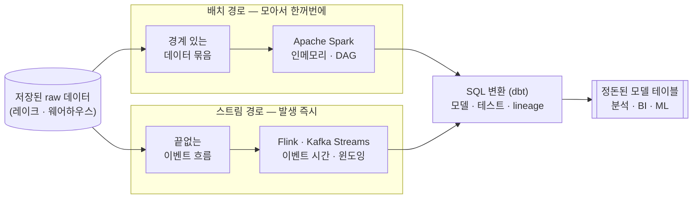

<figure class="post-figure post-figure--header">
<svg role="img" aria-label="데이터 처리의 두 갈래를 한 장으로 표현한 그림: 왼쪽 저장소(raw)에서 데이터가 흘러나와 위쪽 '배치(Batch)' 경로로는 한데 모아 한꺼번에 처리하는 Spark가, 아래쪽 '스트림(Stream)' 경로로는 발생 즉시 흘려보내며 처리하는 Flink/Kafka Streams가 받는다. 두 경로 모두 SQL 변환(dbt)을 거쳐 오른쪽의 정돈된 모델 테이블(분석·BI·ML)로 환원된다." viewBox="0 0 680 300" xmlns="http://www.w3.org/2000/svg">
  <title>데이터 처리 — raw 저장소가 배치·스트림 두 경로를 거쳐 모델 테이블로 환원된다</title>
  <!-- LEFT: raw storage -->
  <text x="70" y="146" text-anchor="middle" font-size="13" fill="currentColor" font-weight="700" opacity="0.75">저장된 raw</text>
  <rect x="34" y="116" width="72" height="62" rx="4" fill="var(--bg-light)" stroke="currentColor" stroke-width="2"/>
  <g stroke="currentColor" stroke-width="1.5" opacity="0.55" fill="none">
    <rect x="46" y="156" width="13" height="14" rx="2"/>
    <circle cx="76" cy="163" r="7"/>
    <path d="M96,156 l8,7 l-8,7 l-8,-7 z"/>
  </g>
  <!-- split arrow from storage -->
  <line x1="106" y1="132" x2="146" y2="84" stroke="var(--secondary-color)" stroke-width="2.5" marker-end="url(#dp-arrow)"/>
  <line x1="106" y1="162" x2="146" y2="210" stroke="var(--secondary-color)" stroke-width="2.5" marker-end="url(#dp-arrow)"/>

  <!-- TOP: batch path -->
  <text x="240" y="46" text-anchor="middle" font-size="12" fill="currentColor" font-weight="700" opacity="0.75">배치 (Batch) — 모아서 한꺼번에</text>
  <g stroke="currentColor" stroke-width="1.5" opacity="0.5" fill="none">
    <rect x="152" y="60" width="11" height="11" rx="1.5"/>
    <rect x="166" y="60" width="11" height="11" rx="1.5"/>
    <rect x="180" y="60" width="11" height="11" rx="1.5"/>
    <rect x="152" y="74" width="11" height="11" rx="1.5"/>
    <rect x="166" y="74" width="11" height="11" rx="1.5"/>
    <rect x="180" y="74" width="11" height="11" rx="1.5"/>
  </g>
  <line x1="196" y1="78" x2="218" y2="78" stroke="var(--secondary-color)" stroke-width="2" marker-end="url(#dp-arrow)"/>
  <rect x="222" y="56" width="120" height="46" rx="3" fill="var(--bg-light)" stroke="var(--accent-color)" stroke-width="2.5"/>
  <text x="282" y="78" text-anchor="middle" font-size="12" fill="currentColor" font-weight="700">Spark</text>
  <text x="282" y="93" text-anchor="middle" font-size="8.5" font-weight="400" fill="currentColor" opacity="0.8">인메모리 · DAG</text>

  <!-- BOTTOM: stream path -->
  <text x="240" y="254" text-anchor="middle" font-size="12" fill="currentColor" font-weight="700" opacity="0.75">스트림 (Stream) — 발생 즉시 흘려보내며</text>
  <g stroke="currentColor" stroke-width="1.5" opacity="0.5" fill="none">
    <circle cx="158" cy="210" r="5"/>
    <circle cx="176" cy="210" r="5"/>
    <circle cx="194" cy="210" r="5"/>
  </g>
  <line x1="202" y1="210" x2="218" y2="210" stroke="var(--secondary-color)" stroke-width="2" marker-end="url(#dp-arrow)"/>
  <rect x="222" y="188" width="120" height="46" rx="3" fill="var(--bg-light)" stroke="var(--accent-color)" stroke-width="2.5"/>
  <text x="282" y="210" text-anchor="middle" font-size="12" fill="currentColor" font-weight="700">Flink · Kafka Streams</text>
  <text x="282" y="225" text-anchor="middle" font-size="8.5" font-weight="400" fill="currentColor" opacity="0.8">이벤트 시간 · 워터마크</text>

  <!-- MIDDLE: SQL transform (dbt) — both paths converge -->
  <line x1="342" y1="80" x2="392" y2="132" stroke="var(--secondary-color)" stroke-width="2.5" marker-end="url(#dp-arrow)"/>
  <line x1="342" y1="210" x2="392" y2="160" stroke="var(--secondary-color)" stroke-width="2.5" marker-end="url(#dp-arrow)"/>
  <rect x="396" y="120" width="128" height="54" rx="3" fill="var(--bg-panel)" stroke="var(--gold)" stroke-width="2.5"/>
  <text x="460" y="144" text-anchor="middle" font-size="12" fill="currentColor" font-weight="700">SQL 변환 (dbt)</text>
  <text x="460" y="161" text-anchor="middle" font-size="8.5" fill="currentColor" opacity="0.85">모델 · 테스트 · lineage</text>

  <!-- RIGHT: modeled tables -->
  <line x1="524" y1="147" x2="566" y2="147" stroke="var(--secondary-color)" stroke-width="2.5" marker-end="url(#dp-arrow)"/>
  <rect x="570" y="116" width="92" height="62" rx="4" fill="var(--bg-light)" stroke="var(--accent-color)" stroke-width="2.5"/>
  <g stroke="currentColor" stroke-width="1.3" opacity="0.55">
    <line x1="582" y1="134" x2="650" y2="134"/>
    <line x1="582" y1="148" x2="650" y2="148"/>
    <line x1="582" y1="162" x2="650" y2="162"/>
    <line x1="616" y1="124" x2="616" y2="170"/>
  </g>
  <text x="616" y="196" text-anchor="middle" font-size="10" fill="currentColor" opacity="0.8" font-weight="700">모델 테이블</text>
  <text x="616" y="209" text-anchor="middle" font-size="9" fill="currentColor" opacity="0.7">분석 · BI · ML</text>
  <defs>
    <marker id="dp-arrow" markerWidth="8" markerHeight="8" refX="6" refY="4" orient="auto">
      <path d="M0,0 L8,4 L0,8 z" fill="var(--secondary-color)"/>
    </marker>
  </defs>
</svg>
<figcaption>데이터 처리의 한 장 요약 — 저장된 raw 데이터는 "모아서 한꺼번에" 다루는 배치(Spark)와 "발생 즉시 흘려보내며" 다루는 스트림(Flink·Kafka Streams) 두 경로로 갈리고, 둘 다 SQL 변환(dbt)을 거쳐 분석·BI·ML이 쓰는 정돈된 모델 테이블로 환원된다.</figcaption>
</figure>

## 들어가며

앞 단계에서 우리는 데이터를 어디에 어떤 형태로 쌓을지(저장)를 다뤘습니다. 그런데 raw 상태로 쌓아 둔 데이터는 그 자체로는 쓸모가 적습니다. 타입이 제각각이고, 결측치가 섞여 있으며, 여러 원천이 따로 놀고, 비즈니스 질문에 답하려면 조인·집계·정제가 필요합니다. **저장된 데이터를 실제 가치로 바꾸는 일** — 그것이 이번 단계의 주제인 **변환·처리(Processing)**입니다.

이 글은 `Data-Engineering-Essential` 시리즈의 5단계로, 처리 엔진의 큰 그림을 그리는 것을 목표로 합니다. 먼저 분산 처리가 **왜 MapReduce에서 Spark로 넘어갔는지**를 통해 처리 엔진의 핵심 원리(인메모리·DAG·셔플)를 잡고, 한 묶음을 한꺼번에 처리하는 **배치**와 끝없이 흐르는 데이터를 다루는 **스트림**을 비교한 뒤, 마지막으로 변환 자체를 SQL로 표현하고 **소프트웨어처럼 관리**하는 dbt를 살펴봅니다.

### 📌 이 글에서 다루는 내용

#### 🔍 핵심 주제

- **분산 처리 모델**: MapReduce에서 Spark로 — 인메모리·DAG 실행이 빨랐던 이유, 셔플과 파티션
- **배치 처리 엔진**: Apache Spark의 구조(Driver/Executor, RDD→DataFrame, lazy evaluation)
- **스트림 처리**: Flink·Kafka Streams, 이벤트 시간 vs 처리 시간, 워터마크, 윈도잉
- **SQL 변환과 ELT**: dbt로 변환을 모델·테스트·문서화·lineage와 함께 관리하기

#### 🎯 왜 중요한가

처리는 "데이터를 가치로 바꾸는" 수명주기의 심장입니다. 배치냐 스트림이냐, 변환을 어디서·어떻게 표현하느냐는 지연·비용·정확성을 모두 좌우합니다. 엔진의 **원리**(인메모리·DAG·시간 의미·셔플)를 잡아 두면, 어떤 도구가 나와도 "무엇을 푸는가"로 읽을 수 있습니다.

## 한눈에 보기 — raw에서 모델까지, 두 처리 경로

저장된 raw 데이터가 처리 엔진을 거쳐 분석 가능한 모델로 가는 길은 크게 두 갈래입니다. 둘의 차이를 먼저 그려 두면 세부가 자리를 잡습니다.

배치는 **경계가 있는(bounded)** 데이터 한 묶음을 한꺼번에 처리해 처리량(throughput)에 강하고, 스트림은 **경계가 없는(unbounded)** 이벤트 흐름을 발생 즉시 처리해 지연(latency)에 강합니다. 두 경로 모두 결국 분석에 쓰일 모델 테이블로 수렴하며, 그 마지막 변환을 SQL로 다루는 것이 dbt입니다.

## 1. 분산 처리 모델 — MapReduce에서 Spark로

데이터가 한 대의 메모리에 들어가지 않을 만큼 커지면, 여러 대에 **나눠서(partition)** 처리하는 수밖에 없습니다. 이 분산 처리의 원형이 구글이 제시한 **MapReduce**입니다. 발상은 단순합니다 — 데이터를 조각으로 나눠 각 노드에서 **Map**(조각마다 변환), 같은 키끼리 모아 **Reduce**(집계)하는 두 단계로 모든 대규모 처리를 표현합니다. "연산을 데이터가 있는 곳으로 보낸다(move compute to data)"는 원칙으로 네트워크 전송을 줄인 것이 핵심이었습니다.

문제는 **느렸다**는 점입니다. MapReduce는 단계마다 중간 결과를 **디스크(HDFS)에 썼다가 다시 읽었습니다.** 한 번의 Map→Reduce면 괜찮지만, 머신러닝이나 반복 알고리즘처럼 여러 단계를 거치면 매 단계 디스크 왕복이 쌓여 엄청난 비용이 됩니다. 또한 복잡한 처리를 Map과 Reduce만으로 표현하려니 잡(job)을 여러 개 이어 붙여야 했고, 코드가 장황했습니다.

**Apache Spark**는 두 가지로 이 한계를 풀었습니다.

- **인메모리 처리**: 중간 결과를 디스크가 아니라 **메모리에 유지**합니다. 같은 데이터를 반복해서 쓰는 작업에서 MapReduce 대비 수십 배 빨라집니다.
- **DAG 실행**: 처리를 Map/Reduce 2단계가 아니라 **연산의 방향성 비순환 그래프(DAG)** 전체로 봅니다. 여러 변환을 하나의 실행 계획으로 묶어 최적화하고, 불필요한 디스크 쓰기를 건너뜁니다.

### 셔플(shuffle)과 파티션

분산 처리를 이해하는 핵심 열쇠는 **파티션**과 **셔플**입니다. 데이터는 여러 노드에 **파티션** 단위로 흩어져 있습니다. `filter`나 `map`처럼 각 파티션 안에서만 끝나는 연산(narrow transformation)은 노드 간 이동이 없어 빠릅니다. 그러나 `groupBy`·`join`·`reduceByKey`처럼 **같은 키를 한 곳에 모아야** 하는 연산(wide transformation)은, 키를 기준으로 데이터를 노드 사이에서 재배치해야 합니다. 이 노드 간 대규모 데이터 재배치가 **셔플**입니다.

셔플은 네트워크 전송과 디스크 쓰기를 동반하는 **가장 비싼 연산**이라, 분산 처리 성능 튜닝의 대부분은 "셔플을 줄이는 것"으로 귀결됩니다. 파티션 수가 너무 적으면 병렬성이 떨어지고, 너무 많으면 작은 작업의 오버헤드가 커지며, 한 키에 데이터가 쏠리면(data skew) 그 파티션만 느려져 전체가 지연됩니다. MapReduce든 Spark든, "데이터를 어떻게 나누고 언제 모으는가"가 분산 처리의 본질이라는 점은 변하지 않습니다.

<figure class="post-figure">
<svg role="img" aria-label="MapReduce와 Spark의 실행 방식을 위아래로 비교한 그림. 위쪽 MapReduce: Map과 Reduce 단계 사이마다 중간 결과를 디스크에 썼다가 다시 읽어, 여러 단계를 거칠수록 디스크 왕복이 반복된다. 아래쪽 Spark: 여러 연산을 하나의 DAG로 묶고 중간 결과를 메모리에 유지하다가 마지막에만 디스크에 쓴다. 가운데에는 같은 키를 노드 사이로 재배치하는 셔플이 가장 비싼 단계로 표시된다." viewBox="0 0 680 330" xmlns="http://www.w3.org/2000/svg">
  <title>MapReduce vs Spark — 디스크 왕복 반복 vs 인메모리 DAG, 그리고 비싼 셔플</title>

  <!-- ===== MapReduce row ===== -->
  <text x="40" y="36" text-anchor="start" font-size="13" fill="currentColor" font-weight="700">MapReduce — 단계마다 디스크 왕복</text>
  <g font-size="10" font-weight="700">
    <rect x="40" y="50" width="92" height="44" rx="3" fill="var(--bg-light)" stroke="currentColor" stroke-width="2"/>
    <text x="86" y="77" text-anchor="middle" fill="currentColor">Map</text>
    <rect x="266" y="50" width="92" height="44" rx="3" fill="var(--bg-light)" stroke="currentColor" stroke-width="2"/>
    <text x="312" y="77" text-anchor="middle" fill="currentColor">Reduce</text>
    <rect x="492" y="50" width="92" height="44" rx="3" fill="var(--bg-light)" stroke="currentColor" stroke-width="2"/>
    <text x="538" y="77" text-anchor="middle" fill="currentColor">Map (다음 잡)</text>
  </g>
  <!-- disk between stages -->
  <g font-size="8.5">
    <rect x="148" y="56" width="100" height="32" rx="3" fill="var(--bg-panel)" stroke="var(--accent-color)" stroke-width="1.5" stroke-dasharray="3 3"/>
    <text x="198" y="76" text-anchor="middle" fill="var(--accent-color)" font-weight="700">디스크 R/W</text>
    <rect x="374" y="56" width="100" height="32" rx="3" fill="var(--bg-panel)" stroke="var(--accent-color)" stroke-width="1.5" stroke-dasharray="3 3"/>
    <text x="424" y="76" text-anchor="middle" fill="var(--accent-color)" font-weight="700">디스크 R/W</text>
  </g>
  <g stroke="var(--secondary-color)" stroke-width="2">
    <line x1="132" y1="72" x2="146" y2="72" marker-end="url(#mr-arrow)"/>
    <line x1="248" y1="72" x2="264" y2="72" marker-end="url(#mr-arrow)"/>
    <line x1="358" y1="72" x2="372" y2="72" marker-end="url(#mr-arrow)"/>
    <line x1="474" y1="72" x2="490" y2="72" marker-end="url(#mr-arrow)"/>
  </g>
  <text x="360" y="112" text-anchor="middle" font-size="9" fill="currentColor" opacity="0.7">단계가 늘수록 디스크 왕복이 누적 → 느림</text>

  <!-- divider -->
  <line x1="40" y1="134" x2="640" y2="134" stroke="currentColor" stroke-width="1" opacity="0.25"/>

  <!-- ===== Spark row ===== -->
  <text x="40" y="166" text-anchor="start" font-size="13" fill="currentColor" font-weight="700">Spark — 하나의 DAG, 중간은 메모리</text>
  <rect x="40" y="180" width="544" height="56" rx="4" fill="var(--bg-panel)" stroke="var(--gold)" stroke-width="2" stroke-dasharray="4 3"/>
  <text x="56" y="174" text-anchor="start" font-size="8.5" fill="var(--gold)" font-weight="700">메모리에 유지</text>
  <g font-size="10" font-weight="700">
    <rect x="56" y="192" width="84" height="32" rx="3" fill="var(--bg-light)" stroke="currentColor" stroke-width="2"/>
    <text x="98" y="212" text-anchor="middle" fill="currentColor">map</text>
    <rect x="180" y="192" width="84" height="32" rx="3" fill="var(--bg-light)" stroke="currentColor" stroke-width="2"/>
    <text x="222" y="212" text-anchor="middle" fill="currentColor">filter</text>
    <rect x="416" y="192" width="84" height="32" rx="3" fill="var(--bg-light)" stroke="currentColor" stroke-width="2"/>
    <text x="458" y="212" text-anchor="middle" fill="currentColor">reduce</text>
  </g>
  <!-- shuffle as the costly step -->
  <rect x="288" y="186" width="100" height="44" rx="3" fill="var(--bg-light)" stroke="var(--accent-color)" stroke-width="2.5"/>
  <text x="338" y="205" text-anchor="middle" font-size="10" fill="currentColor" font-weight="700">셔플</text>
  <text x="338" y="219" text-anchor="middle" font-size="7.5" font-weight="400" fill="currentColor" opacity="0.8">키 재배치 · 가장 비쌈</text>
  <g stroke="var(--secondary-color)" stroke-width="2">
    <line x1="140" y1="208" x2="178" y2="208" marker-end="url(#mr-arrow)"/>
    <line x1="264" y1="208" x2="286" y2="208" marker-end="url(#mr-arrow)"/>
    <line x1="388" y1="208" x2="414" y2="208" marker-end="url(#mr-arrow)"/>
  </g>
  <line x1="500" y1="208" x2="600" y2="208" stroke="var(--secondary-color)" stroke-width="2.5" marker-end="url(#mr-arrow)"/>
  <text x="600" y="198" text-anchor="end" font-size="9" fill="currentColor" opacity="0.75" font-weight="700">결과만</text>
  <text x="600" y="226" text-anchor="end" font-size="8.5" fill="currentColor" opacity="0.7">디스크에 1회</text>
  <text x="312" y="258" text-anchor="middle" font-size="9" fill="currentColor" opacity="0.7">narrow(map·filter)는 노드 안에서, wide(reduce·join)는 셔플을 거쳐</text>

  <defs>
    <marker id="mr-arrow" markerWidth="8" markerHeight="8" refX="6" refY="4" orient="auto">
      <path d="M0,0 L8,4 L0,8 z" fill="var(--secondary-color)"/>
    </marker>
  </defs>
</svg>
<figcaption>MapReduce는 Map·Reduce 단계 사이마다 중간 결과를 <strong>디스크에 썼다 읽어</strong>, 단계가 늘수록 왕복 비용이 누적된다. Spark는 여러 연산을 하나의 <strong>DAG</strong>로 묶어 중간 결과를 메모리에 유지하다 마지막에만 디스크에 쓴다. 어느 쪽이든 같은 키를 노드 사이로 재배치하는 <strong>셔플</strong>이 가장 비싼 단계다.</figcaption>
</figure>

## 2. 배치 처리 엔진 — Apache Spark 구조 오버뷰

배치 처리의 사실상 표준은 **Apache Spark**입니다. 경계가 있는(bounded) 데이터 한 묶음을 분산 처리해 높은 처리량을 내는 데 강합니다. 내부 구조를 큰 틀에서만 짚어 보겠습니다.

**Driver와 Executor.** Spark 애플리케이션은 하나의 **Driver**와 여러 **Executor**로 구성됩니다. Driver는 사용자 코드를 받아 실행 계획(DAG)을 세우고 작업을 잘게 쪼개 분배하는 **두뇌**이고, Executor는 클러스터 각 노드에서 실제 연산(task)을 수행하고 데이터를 메모리에 캐싱하는 **일꾼**입니다. Driver가 DAG를 스테이지(stage)로 나누고, 각 스테이지를 파티션 수만큼의 task로 펼쳐 Executor에 보냅니다. 스테이지의 경계는 대개 셔플이 일어나는 지점입니다.

**RDD에서 DataFrame으로.** Spark의 1세대 추상화는 **RDD(Resilient Distributed Dataset)** — 분산된 불변 컬렉션으로, 손실 시 계보(lineage)를 따라 다시 계산해 복원하는 내결함성을 제공합니다. 다만 RDD는 저수준이라 최적화 여지가 적었습니다. 그래서 등장한 것이 **DataFrame**(과 Dataset)으로, 스키마가 있는 테이블 형태의 고수준 API입니다. DataFrame 위의 연산은 **Catalyst 옵티마이저**가 SQL 쿼리처럼 최적화(조건 푸시다운, 연산 순서 재배치 등)하므로, 같은 로직이라도 RDD보다 빠른 경우가 많습니다. 오늘날 Spark는 대부분 DataFrame/SQL API로 작성합니다.

**Lazy evaluation(지연 평가).** Spark의 변환 연산(`map`, `filter`, `select`, `join` 등)은 **즉시 실행되지 않습니다.** 호출 시점에는 "무엇을 할지"의 계획(DAG)만 쌓아 두고, `count`·`collect`·`write` 같은 **액션(action)**이 호출되는 순간 비로소 전체 계획을 한꺼번에 최적화해 실행합니다. 덕분에 Spark는 여러 변환을 묶어 불필요한 단계를 건너뛰고 연산을 합칠 수 있습니다. "지금까지 쌓인 변환을 한꺼번에 평가한다"는 이 모델이, 앞서 본 DAG 최적화를 가능하게 하는 토대입니다.

> 💡 Spark는 배치를 넘어 Spark Structured Streaming(스트리밍), MLlib(머신러닝), GraphX(그래프)까지 아우르는 큰 생태계입니다. 이 글에서는 처리 엔진 지도 안에서의 위치만 짚습니다. Spark의 구조·튜닝·API는 이제 별도 시리즈 [Spark Essential Curriculum](/2026/07/12/spark-essential-curriculum.html)에서 아키텍처·Catalyst/Tungsten·셔플 튜닝·Structured Streaming까지 깊이 다룹니다.

## 3. 스트림 처리 — 무한한 흐름을 다루기

배치가 "어제까지 쌓인 데이터 한 묶음"을 다룬다면, **스트림 처리**는 끝없이 도착하는 이벤트를 **발생 즉시** 다룹니다. 실시간 대시보드, 이상 탐지, 추천처럼 "지금 이 순간"이 중요한 작업에 쓰입니다. 대표 엔진은 **Apache Flink**와 **Kafka Streams**입니다. Flink는 진정한 이벤트 단위 처리(true streaming)와 강력한 상태 관리로 정교한 스트림 분석에 강하고, Kafka Streams는 Kafka 위에서 별도 클러스터 없이 라이브러리로 동작해 가볍게 스트림 처리를 붙이기 좋습니다.

### 이벤트 시간 vs 처리 시간

스트림 처리에서 가장 헷갈리면서도 핵심적인 개념은 **시간의 두 의미**입니다.

- **이벤트 시간(Event Time)**: 그 일이 **실제로 일어난** 시각. 사용자가 버튼을 누른 그 순간, 센서가 값을 측정한 그 순간.
- **처리 시간(Processing Time)**: 그 이벤트가 처리 엔진에 **도착해 처리된** 시각.

둘은 좀처럼 일치하지 않습니다. 모바일 앱이 잠깐 오프라인이었다가 다시 연결되면, 30분 전에 일어난(이벤트 시간) 이벤트가 지금(처리 시간) 도착합니다. "9시~10시 매출"을 정확히 집계하려면 **이벤트 시간** 기준이어야지, 도착 순서(처리 시간)로 세면 결과가 틀어집니다.

### 워터마크(watermark)

이벤트 시간으로 집계할 때 생기는 골치 아픈 질문이 있습니다 — **"9시~10시 구간을 언제 닫고 결과를 낼 것인가?"** 늦게 도착하는 이벤트를 무한정 기다릴 수는 없습니다. 여기서 **워터마크**가 등장합니다. 워터마크는 "이 시각 이전의 이벤트는 (거의) 다 도착했다고 보겠다"고 선언하는 **이벤트 시간의 진행 표시**입니다. 워터마크가 10시를 지나면 9시~10시 윈도를 닫고 결과를 냅니다. 워터마크를 보수적으로(늦게) 잡으면 지각 데이터를 더 많이 포함하지만 결과가 느려지고, 공격적으로(빨리) 잡으면 빨라지지만 지각 데이터를 놓칠 수 있습니다. 지각 데이터 처리(버릴지, 별도 보정할지)는 스트림 설계의 핵심 트레이드오프입니다.

### 윈도잉(windowing)

무한한 스트림에서 "합계·평균" 같은 집계를 내려면, 흐름을 유한한 **윈도(window)**로 잘라야 합니다. 세 가지 방식이 기본입니다.

- **텀블링 윈도(Tumbling)**: 겹치지 않게 고정 크기로 자르기. 예) 매 1분 구간. 한 이벤트는 정확히 한 윈도에만 속합니다.
- **슬라이딩 윈도(Sliding)**: 고정 크기 윈도를 일정 간격으로 **겹치게** 미끄러뜨리기. 예) 5분 윈도를 1분마다. "최근 5분 이동 평균" 같은 데 씁니다.
- **세션 윈도(Session)**: 활동이 이어지는 동안 묶고, 일정 시간 **빈 간격(gap)** 이 생기면 닫기. 사용자 세션처럼 활동 단위로 묶을 때 자연스럽습니다.

<figure class="post-figure">
<svg role="img" aria-label="이벤트 시간과 윈도잉을 한 그림으로 설명. 가로축은 이벤트 시간이고, 그 위에 이벤트들이 점으로 찍혀 있다. 한 이벤트는 실제로는 이벤트 시간 위치에 있지만 네트워크 지연으로 늦게 도착하는 '지각 이벤트'로 표시된다. 아래쪽에는 겹치지 않는 텀블링 윈도, 겹치며 미끄러지는 슬라이딩 윈도, 빈 간격으로 닫히는 세션 윈도 세 가지가 나란히 그려지고, 워터마크 선이 '여기까지는 다 도착으로 본다'는 위치를 가리킨다." viewBox="0 0 680 340" xmlns="http://www.w3.org/2000/svg">
  <title>이벤트 시간 · 워터마크 · 윈도잉 — 텀블링/슬라이딩/세션</title>

  <!-- event-time axis -->
  <text x="40" y="34" text-anchor="start" font-size="12" fill="currentColor" font-weight="700">이벤트 시간 축 — 이벤트가 실제로 일어난 시각</text>
  <line x1="40" y1="70" x2="640" y2="70" stroke="currentColor" stroke-width="1.5" opacity="0.5" marker-end="url(#wm-arrow)"/>
  <!-- events on the timeline -->
  <g fill="currentColor">
    <circle cx="100" cy="70" r="5"/>
    <circle cx="170" cy="70" r="5"/>
    <circle cx="250" cy="70" r="5"/>
    <circle cx="330" cy="70" r="5"/>
    <circle cx="430" cy="70" r="5"/>
    <circle cx="520" cy="70" r="5"/>
  </g>
  <!-- a late event: belongs at 250 (event time) but arrives later (dashed) -->
  <circle cx="250" cy="70" r="8" fill="none" stroke="var(--accent-color)" stroke-width="2"/>
  <path d="M250,70 C360,40 430,40 470,62" fill="none" stroke="var(--accent-color)" stroke-width="1.5" stroke-dasharray="3 3" marker-end="url(#wm-arrow-a)"/>
  <text x="475" y="44" text-anchor="middle" font-size="9" fill="var(--accent-color)" font-weight="700">지각 도착</text>
  <text x="250" y="54" text-anchor="middle" font-size="8.5" fill="var(--accent-color)" opacity="0.9">실제 일어난 위치</text>

  <!-- watermark -->
  <line x1="470" y1="58" x2="470" y2="300" stroke="var(--gold)" stroke-width="2" stroke-dasharray="5 4"/>
  <text x="470" y="316" text-anchor="middle" font-size="9.5" fill="var(--gold)" font-weight="700">워터마크 — "여기까진 다 도착으로 본다"</text>

  <!-- Tumbling -->
  <text x="40" y="108" text-anchor="start" font-size="10.5" fill="currentColor" font-weight="700">텀블링 — 겹치지 않게</text>
  <g font-size="9">
    <rect x="60" y="116" width="120" height="34" rx="3" fill="var(--bg-light)" stroke="currentColor" stroke-width="2"/>
    <rect x="184" y="116" width="120" height="34" rx="3" fill="var(--bg-light)" stroke="currentColor" stroke-width="2"/>
    <rect x="308" y="116" width="120" height="34" rx="3" fill="var(--bg-light)" stroke="currentColor" stroke-width="2"/>
    <text x="120" y="137" text-anchor="middle" fill="currentColor" opacity="0.85">W1</text>
    <text x="244" y="137" text-anchor="middle" fill="currentColor" opacity="0.85">W2</text>
    <text x="368" y="137" text-anchor="middle" fill="currentColor" opacity="0.85">W3</text>
  </g>

  <!-- Sliding -->
  <text x="40" y="178" text-anchor="start" font-size="10.5" fill="currentColor" font-weight="700">슬라이딩 — 겹치며 미끄러짐</text>
  <g font-size="9">
    <rect x="60" y="186" width="140" height="26" rx="3" fill="var(--bg-panel)" stroke="var(--secondary-color)" stroke-width="2" opacity="0.95"/>
    <rect x="120" y="214" width="140" height="26" rx="3" fill="var(--bg-panel)" stroke="var(--secondary-color)" stroke-width="2" opacity="0.95"/>
    <rect x="180" y="186" width="140" height="26" rx="3" fill="var(--bg-panel)" stroke="var(--secondary-color)" stroke-width="2" opacity="0.6"/>
    <text x="130" y="203" text-anchor="middle" fill="currentColor" opacity="0.85">S1</text>
    <text x="190" y="231" text-anchor="middle" fill="currentColor" opacity="0.85">S2</text>
  </g>

  <!-- Session -->
  <text x="40" y="268" text-anchor="start" font-size="10.5" fill="currentColor" font-weight="700">세션 — 빈 간격으로 닫힘</text>
  <g font-size="9">
    <rect x="60" y="276" width="96" height="26" rx="3" fill="var(--bg-light)" stroke="var(--accent-color)" stroke-width="2"/>
    <text x="108" y="293" text-anchor="middle" fill="currentColor" opacity="0.85">세션 A</text>
    <text x="186" y="293" text-anchor="middle" font-size="8" fill="currentColor" opacity="0.6">↤ gap ↦</text>
    <rect x="236" y="276" width="150" height="26" rx="3" fill="var(--bg-light)" stroke="var(--accent-color)" stroke-width="2"/>
    <text x="311" y="293" text-anchor="middle" fill="currentColor" opacity="0.85">세션 B</text>
  </g>

  <defs>
    <marker id="wm-arrow" markerWidth="8" markerHeight="8" refX="6" refY="4" orient="auto">
      <path d="M0,0 L8,4 L0,8 z" fill="currentColor"/>
    </marker>
    <marker id="wm-arrow-a" markerWidth="8" markerHeight="8" refX="6" refY="4" orient="auto">
      <path d="M0,0 L8,4 L0,8 z" fill="var(--accent-color)"/>
    </marker>
  </defs>
</svg>
<figcaption>이벤트는 <strong>실제로 일어난 시각(이벤트 시간)</strong>에 자리하지만, 지연으로 늦게 도착하기도 한다(지각 도착). <strong>워터마크</strong>는 "여기까지는 다 도착으로 본다"를 선언해 윈도를 닫는 기준이 된다. 흐름을 자르는 방식은 겹치지 않는 <strong>텀블링</strong>, 겹치며 미끄러지는 <strong>슬라이딩</strong>, 빈 간격으로 닫히는 <strong>세션</strong> 세 가지가 기본이다.</figcaption>
</figure>

> 핵심은 스트림 처리가 단순히 "빠른 배치"가 아니라는 점입니다. **시간을 무엇으로 정의하고(이벤트 vs 처리), 지각 데이터를 언제까지 기다리며(워터마크), 흐름을 어떻게 자를지(윈도)**가 스트림 처리만의 고유한 설계 문제입니다.

## 4. SQL 변환과 ELT — dbt

지금까지가 "엔진"의 이야기였다면, 마지막은 **변환을 어떻게 표현하고 관리하는가**입니다. 앞 단계(역사)에서 보았듯 클라우드 데이터 웨어하우스가 값싸지고 컴퓨팅이 탄력적으로 변하면서, 변환을 적재 후 웨어하우스 **안에서 SQL로** 수행하는 ELT가 표준이 되었습니다. 그러나 SQL 변환이 늘어나면 새로운 문제가 생깁니다 — 수백 개의 `CREATE TABLE AS SELECT`가 서로 의존하며 얽히고, 누가 무엇을 바꾸면 어디가 깨지는지 알 수 없게 됩니다.

**dbt(data build tool)**는 이 SQL 변환을 **소프트웨어 엔지니어링처럼** 다루게 해 준 도구입니다. 변환을 "스크립트 더미"가 아니라 버전 관리되고 테스트되는 코드베이스로 끌어올렸습니다.

- **SQL 모델(model)**: 변환 하나가 하나의 `SELECT`로 작성된 **model** 파일이 됩니다. dbt는 이 SELECT를 받아 웨어하우스에 테이블/뷰로 만들어 줍니다. 한 model이 다른 model을 `ref()`로 참조하면, dbt가 **의존성 그래프(DAG)**를 자동으로 만들고 올바른 순서로 실행합니다.
- **테스트(test)**: "이 컬럼은 NULL이면 안 된다", "이 키는 유일해야 한다" 같은 데이터 품질 검증을 선언적으로 붙여, 변환 결과를 자동으로 검사합니다.
- **문서화(docs)**: 모델·컬럼 설명을 코드 옆에 두고, 그것으로 문서 사이트를 자동 생성합니다.
- **lineage(데이터 계보)**: `ref()`로 이어진 의존성 덕분에, 원천 → 중간 모델 → 최종 모델로 이어지는 **데이터 흐름의 계보**를 그래프로 볼 수 있습니다. 어떤 변경이 어디까지 영향을 미치는지(impact analysis)를 한눈에 파악할 수 있습니다.

dbt가 바꾼 것은 도구만이 아니라 **사람**입니다. SQL만 잘 다루면 소프트웨어 엔지니어링 관행(버전 관리·테스트·CI/CD·모듈화)을 변환 작업에 적용할 수 있게 되면서, 변환 계층을 책임지는 **애널리틱스 엔지니어(Analytics Engineer)**라는 직무가 생겨났습니다. 분석가와 데이터 엔지니어 사이의 다리를 놓은 셈입니다.

> 💡 dbt는 "변환을 코드처럼"이라는 발상으로 Modern Data Stack의 변환 계층을 표준화했고, 그 자체로 깊이 다룰 주제입니다. 이 글에서는 처리 지도 안에서의 위치만 짚고, **dbt의 프로젝트 구조·매크로·증분 모델·테스트 전략은 향후 별도 시리즈 후보**로 남겨 둡니다.

## 정리

변환·처리는 저장된 raw 데이터를 비로소 **가치로 바꾸는** 단계입니다. 이 글에서 그린 지도를 요약하면 다음과 같습니다.

- **분산 처리의 본질은 "어떻게 나누고 언제 모으는가"** 입니다. MapReduce의 디스크 왕복을 Spark가 **인메모리 + DAG**로 풀어 빨라졌고, `join`·`groupBy`가 부르는 **셔플**이 늘 가장 비싼 연산입니다.
- **배치 엔진 Spark**는 Driver/Executor로 일을 분배하고, RDD에서 DataFrame으로 추상화를 높였으며, **lazy evaluation**으로 변환을 모아 한꺼번에 최적화합니다.
- **스트림 처리**는 "빠른 배치"가 아니라, **이벤트 시간 vs 처리 시간**, **워터마크**, **윈도잉**이라는 고유한 시간 설계 문제를 가진 별개의 패러다임입니다.
- **dbt**는 SQL 변환을 **모델·테스트·문서화·lineage**로 묶어 소프트웨어처럼 관리하게 했고, 애널리틱스 엔지니어라는 직무를 낳았습니다.

엔진과 도구는 계속 바뀌겠지만, "경계가 있는가 없는가(배치/스트림)", "시간을 무엇으로 정의하는가", "변환을 어떻게 관리하는가"라는 질문은 그대로 남습니다. 이 질문들이 다음에 만날 처리 기술을 읽는 좌표가 됩니다.

### 다음 학습 (Next Learning)

- [Data Engineering Essential Curriculum](/2026/06/25/data-engineering-essential-curriculum.html) — 전체 로드맵으로 돌아가 진행 상황 확인하기
- [데이터 저장(Storage): 웨어하우스·레이크·레이크하우스와 파일·테이블 포맷](/2026/06/25/data-storage.html) — 4단계: 처리할 데이터를 어디에 어떻게 쌓는가
- [오케스트레이션(Orchestration): DAG·스케줄링과 견고한 파이프라인](/2026/06/25/orchestration.html) — 6단계: 이 처리 작업들을 어떻게 순서대로·안정적으로 돌릴까
