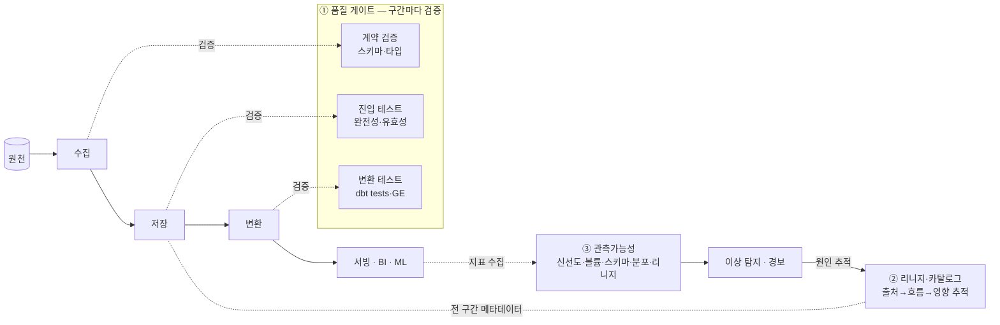

<figure class="post-figure post-figure--header">
<svg role="img" aria-label="파이프라인은 멀쩡히 돌고 있는데 그 안을 흐르는 데이터는 틀어져 있는 모습을 한 장으로 표현한 그림. 왼쪽에서 원천 데이터가 파이프라인 관(管)을 통과해 흐르고, 관 자체에는 녹색 체크의 '실행 성공' 표시가 붙어 있다. 그러나 관을 지나 도착한 데이터에는 결측·중복·이상치 같은 흠집이 섞여 있어 '실행은 성공, 데이터는 틀림'을 보여 준다. 관 위에는 품질 게이트·리니지·관측가능성이라는 세 겹의 안전장치가 얹혀, 흐르는 데이터를 검사하고 추적하고 감시한다." viewBox="0 0 680 290" xmlns="http://www.w3.org/2000/svg">
  <title>믿을 수 있는 데이터 — 파이프라인은 돌아도 데이터는 틀릴 수 있다, 그래서 품질·리니지·관측이 필요하다</title>
  <!-- TOP: three safeguards riding on top of the pipe -->
  <text x="340" y="22" text-anchor="middle" font-size="12" fill="currentColor" font-weight="700" opacity="0.75">파이프라인 위에 얹는 세 겹의 안전장치</text>
  <g font-size="10" font-weight="700">
    <rect x="92" y="34" width="148" height="32" rx="3" fill="var(--bg-panel)" stroke="var(--accent-color)" stroke-width="2"/>
    <text x="166" y="54" text-anchor="middle" fill="currentColor">① 품질 게이트</text>
    <rect x="266" y="34" width="148" height="32" rx="3" fill="var(--bg-panel)" stroke="currentColor" stroke-width="2"/>
    <text x="340" y="54" text-anchor="middle" fill="currentColor">② 리니지·카탈로그</text>
    <rect x="440" y="34" width="148" height="32" rx="3" fill="var(--bg-panel)" stroke="var(--gold)" stroke-width="2"/>
    <text x="514" y="54" text-anchor="middle" fill="currentColor">③ 관측가능성</text>
  </g>
  <!-- guards point down into the pipe -->
  <g stroke="var(--secondary-color)" stroke-width="2" opacity="0.85">
    <line x1="166" y1="66" x2="166" y2="116" marker-end="url(#dq-down)"/>
    <line x1="340" y1="66" x2="340" y2="116" marker-end="url(#dq-down)"/>
    <line x1="514" y1="66" x2="514" y2="116" marker-end="url(#dq-down)"/>
  </g>

  <!-- LEFT: source data entering -->
  <text x="48" y="116" text-anchor="middle" font-size="10" fill="currentColor" opacity="0.7" font-weight="700">원천</text>
  <circle cx="48" cy="150" r="9" fill="none" stroke="currentColor" stroke-width="2"/>
  <rect x="32" y="172" width="18" height="18" rx="2" fill="none" stroke="currentColor" stroke-width="2" transform="rotate(-14 41 181)"/>
  <line x1="62" y1="150" x2="92" y2="150" stroke="var(--secondary-color)" stroke-width="2.5" marker-end="url(#dq-arrow)"/>

  <!-- THE PIPE: running fine (green-ish via secondary), with a success badge -->
  <rect x="96" y="126" width="488" height="48" rx="6" fill="var(--bg-light)" stroke="var(--secondary-color)" stroke-width="2.5"/>
  <text x="180" y="155" text-anchor="middle" font-size="11" fill="currentColor" font-weight="700">파이프라인 (관)</text>
  <!-- success check on the pipe itself -->
  <circle cx="300" cy="150" r="13" fill="none" stroke="var(--secondary-color)" stroke-width="2.5"/>
  <path d="M293,150 l5,6 l9,-12" fill="none" stroke="var(--secondary-color)" stroke-width="2.5"/>
  <text x="300" y="194" text-anchor="middle" font-size="9" fill="currentColor" opacity="0.75">실행 성공 ✓</text>

  <!-- data flowing inside the pipe: some clean dots, some flawed -->
  <g>
    <circle cx="350" cy="150" r="5" fill="currentColor" opacity="0.55"/>
    <circle cx="380" cy="150" r="5" fill="currentColor" opacity="0.55"/>
    <!-- flawed tokens drawn with crimson accent strokes -->
    <rect x="406" y="143" width="14" height="14" rx="2" fill="none" stroke="var(--accent-color)" stroke-width="2"/>
    <text x="413" y="153" text-anchor="middle" font-size="9" fill="var(--accent-color)" font-weight="700">∅</text>
    <circle cx="445" cy="150" r="5" fill="currentColor" opacity="0.55"/>
    <path d="M474,143 l8,7 l-8,7 l-8,-7 z" fill="none" stroke="var(--accent-color)" stroke-width="2"/>
    <text x="510" y="150" text-anchor="middle" font-size="11" fill="var(--accent-color)" font-weight="700">×2</text>
  </g>

  <!-- output arrow to the "wrong data" box -->
  <line x1="584" y1="150" x2="612" y2="150" stroke="var(--secondary-color)" stroke-width="2.5" marker-end="url(#dq-arrow)"/>

  <!-- BOTTOM: the verdict -->
  <rect x="96" y="222" width="488" height="48" rx="4" fill="var(--bg-panel)" stroke="var(--accent-color)" stroke-width="2.5"/>
  <text x="340" y="244" text-anchor="middle" font-size="12" fill="currentColor" font-weight="700">"파이프라인이 돈다 ≠ 데이터가 맞다"</text>
  <text x="340" y="262" text-anchor="middle" font-size="9.5" fill="currentColor" opacity="0.8">결측 · 중복 · 이상치는 실행 성공 안에서도 흐른다 → 그래서 위 세 안전장치가 필요</text>

  <defs>
    <marker id="dq-arrow" markerWidth="8" markerHeight="8" refX="6" refY="4" orient="auto">
      <path d="M0,0 L8,4 L0,8 z" fill="var(--secondary-color)"/>
    </marker>
    <marker id="dq-down" markerWidth="8" markerHeight="8" refX="4" refY="6" orient="auto">
      <path d="M0,0 L8,0 L4,8 z" fill="var(--secondary-color)"/>
    </marker>
  </defs>
</svg>
<figcaption>파이프라인(관)은 녹색 체크가 붙도록 멀쩡히 돌지만, 그 안을 흐르는 데이터에는 결측(∅)·중복(×2)·이상치가 섞여 있을 수 있다 — "실행 성공"이 "데이터 정상"을 뜻하지 않는다. 그래서 관 위에 품질 게이트·리니지·관측가능성이라는 세 겹의 안전장치를 얹어 흐르는 데이터를 검사·추적·감시한다.</figcaption>
</figure>

## 들어가며

새벽 2시에 도는 파이프라인이 모든 잡을 성공으로 마치고, Airflow의 DAG는 초록색으로 빛납니다. 오케스트레이터는 "이상 없음"을 보고합니다. 그런데 아침 9시, 임원 대시보드의 매출이 절반으로 뚝 떨어져 있습니다. 코드는 한 줄도 바뀌지 않았고, 잡은 전부 성공했는데도 말이죠. 원인은 상류 원천이 어제부터 `amount` 컬럼을 센트가 아니라 달러로 보내기 시작했고, 절반의 레코드는 아예 `null`이었던 것입니다.

이 흔한 악몽이 이 글의 출발점입니다. **파이프라인이 도는 것(it runs)과 데이터가 맞는 것(it's correct)은 전혀 다른 문제**입니다. 소프트웨어 엔지니어가 코드의 정확성을 테스트·모니터링으로 지키듯, 데이터 엔지니어는 **흐르는 데이터 자체의 정확성**을 지켜야 합니다. 이 글은 `Data-Engineering-Essential` 시리즈의 9단계로, 믿을 수 있는 데이터를 만드는 세 기둥 — **품질·테스트**, **리니지·카탈로그**, **관측가능성** — 을 다룹니다.

<div class="post-summary-box" markdown="1">

### 📌 이 글에서 다루는 내용

#### 🔍 핵심 주제

- **데이터 품질·테스트**: 품질의 5차원(정확성·완전성·유효성·일관성·신선도), Great Expectations·dbt tests, 그리고 **데이터 계약(Data Contracts)**
- **데이터 리니지·카탈로그**: 출처·흐름 추적(lineage), 메타데이터·카탈로그(DataHub·OpenMetadata), 거버넌스의 토대
- **데이터 관측가능성(Observability)**: 5가지 축(신선도·볼륨·스키마·분포·리니지)과 이상 탐지·경보
- **핵심 명제**: "파이프라인이 돈다 ≠ 데이터가 맞다"

#### 🎯 왜 중요한가

데이터에 대한 신뢰는 한 번의 사고로 무너지고, 회복은 훨씬 오래 걸립니다. 품질·리니지·관측은 사고를 **먼저 막고(prevent)**, 못 막으면 **빨리 알아채고(detect)**, 알아챘으면 **원인을 빠르게 짚는(diagnose)** 세 겹의 그물입니다. 신뢰 없는 데이터 플랫폼은 아무리 빨라도 쓸모가 없습니다.

</div>

## 한눈에 보기 — 신뢰를 떠받치는 세 기둥

품질·리니지·관측은 따로 노는 기능이 아니라, 수집부터 서빙까지 파이프라인 전 구간에 **품질 게이트를 깔고**, 그 흐름을 **리니지로 추적**하며, 결과를 **관측가능성으로 감시**하는 하나의 신뢰 체계입니다. 세 기둥이 어떻게 맞물리는지 먼저 그려 두면 세부가 자리를 잡습니다.



품질 게이트가 **막고**, 관측가능성이 못 막은 것을 **알아채며**, 리니지가 알아챈 사고의 **범위와 원인을 짚어 줍니다**. 이 세 동작 — prevent · detect · diagnose — 이 하나로 맞물릴 때 비로소 데이터를 믿을 수 있게 됩니다.

## 1. 데이터 품질과 테스트

### 품질이란 무엇인가 — 5가지 차원

"데이터 품질이 좋다"는 막연한 말을 엔지니어링 가능한 대상으로 바꾸려면, 품질을 **측정 가능한 차원**으로 쪼개야 합니다. 흔히 다음 다섯 가지를 씁니다.

| 차원 | 묻는 질문 | 위반 예시 |
| --- | --- | --- |
| **정확성 (Accuracy)** | 값이 실제 사실과 일치하는가? | 매출이 센트↔달러로 잘못 환산됨 |
| **완전성 (Completeness)** | 있어야 할 데이터가 다 있는가? | 주문의 30%에서 `user_id`가 `null` |
| **유효성 (Validity)** | 값이 정해진 형식·범위를 지키는가? | `status`에 정의되지 않은 코드, 음수 나이 |
| **일관성 (Consistency)** | 시스템·테이블 간 값이 어긋나지 않는가? | 주문 합계 ≠ 결제 합계 |
| **신선도 (Freshness/Timeliness)** | 데이터가 충분히 최신인가? | 어제 새벽 이후 갱신이 멈춤 |

이 다섯 차원은 그 자체로 **테스트 체크리스트**가 됩니다. 새 테이블을 받을 때마다 "이 다섯을 어떻게 보장하지?"라고 물으면, 막연한 품질 걱정이 구체적인 검증 규칙으로 바뀝니다.

### 검증 규칙과 도구 — Great Expectations, dbt tests

차원이 *무엇을* 검사할지를 정한다면, 도구는 그것을 *어떻게* 코드로 강제할지를 정합니다. 데이터 테스트의 핵심 아이디어는 단순합니다 — **데이터에 대한 기대(expectation)를 코드로 적어 두고, 파이프라인이 매번 자동으로 그 기대를 확인하게 한다.** 소프트웨어의 단위 테스트와 같은 발상입니다.

**dbt tests**는 변환(T) 계층에서 가장 널리 쓰입니다. 모델 옆 YAML에 선언적으로 기대를 적습니다.

```yaml
# schema.yml — dbt 모델에 붙이는 테스트
models:
  - name: orders
    columns:
      - name: order_id
        tests:
          - unique          # 유효성: 중복 없음
          - not_null        # 완전성: 결측 없음
      - name: status
        tests:
          - accepted_values:        # 유효성: 허용된 값만
              values: ['placed', 'shipped', 'completed', 'returned']
      - name: customer_id
        tests:
          - relationships:          # 일관성: 참조 무결성
              to: ref('customers')
              field: id
```

`dbt test`를 실행하면 각 테스트가 "위반 행을 찾는 SQL"로 컴파일되어, 위반 행이 하나라도 있으면 실패합니다. 변환 단계에 자연스럽게 품질 게이트를 심는 방식입니다.

**Great Expectations(GE)**는 dbt 바깥의 더 넓은 영역 — 수집된 원본, 파일, 임의의 DataFrame — 까지 검증을 확장합니다. 기대를 "Expectation Suite"로 모아 두고, 검증 결과를 사람이 읽는 **Data Docs**로 자동 문서화하는 것이 강점입니다.

```python
# Great Expectations — 기대를 코드로 선언
validator.expect_column_values_to_not_be_null("user_id")
validator.expect_column_values_to_be_between("age", min_value=0, max_value=120)
validator.expect_column_values_to_be_in_set("status", ["active", "churned"])
validator.expect_table_row_count_to_be_between(min_value=1000)  # 볼륨/완전성
```

두 도구의 공통 철학은 같습니다 — **기대를 선언적으로, 버전 관리되는 코드로 남긴다.** 그래야 품질이 한 사람의 머릿속 암묵지가 아니라, 리뷰·테스트·CI를 거치는 **소프트웨어 자산**이 됩니다.

### 데이터 계약(Data Contracts) — 사고를 상류에서 막기

테스트는 강력하지만 본질적으로 **사후(downstream) 방어**입니다. 상류가 스키마를 깨고 데이터를 흘려보낸 *뒤에야* 하류 테스트가 빨갛게 터지죠. 도입부의 "센트→달러" 사고처럼, 진짜 원인은 거의 항상 **원천의 변경**에 있습니다. 그렇다면 사고를 더 위, 즉 **생산자(producer)와 소비자(consumer)의 경계**에서 막을 수는 없을까요?

이 발상이 **데이터 계약(Data Contract)**입니다. 데이터 계약은 데이터를 **만드는 쪽(보통 서비스 개발팀)**과 **쓰는 쪽(데이터팀·하류 소비자)** 사이의 명시적 약속입니다. API가 인터페이스를 약속하듯, 데이터 계약은 데이터셋의 인터페이스를 약속합니다.

계약에는 보통 다음이 담깁니다.

- **스키마**: 필드 이름·타입·필수 여부 (예: `amount: integer, not null`)
- **시맨틱**: 값의 의미와 단위 (예: `amount`는 **센트** 단위)
- **품질·SLA**: 신선도(예: 1시간 이내), 완전성(예: `user_id` 99.9% 채움)
- **소유권·변경 정책**: 누가 소유하며, 깨는 변경(breaking change)은 어떻게 사전 통지하는가

핵심은 **계약을 CI에 끼워 넣어 자동으로 강제**한다는 점입니다. 생산자가 스키마를 깨는 변경을 배포하려 하면 **빌드 단계에서 막혀**, 데이터가 흐르기도 전에 사고가 차단됩니다. 테스트가 "이미 들어온 나쁜 데이터를 잡는" 그물이라면, 데이터 계약은 "나쁜 데이터가 애초에 들어오지 못하게" 하는 둑입니다.

<figure class="post-figure">
<svg role="img" aria-label="데이터 계약을 생산자와 소비자 사이의 약속으로 표현한 그림. 왼쪽에는 데이터를 만드는 생산자(서비스 개발팀), 오른쪽에는 데이터를 쓰는 소비자(데이터팀·BI·ML)가 있고, 그 사이에 두루마리 모양의 데이터 계약이 놓여 양쪽을 잇는다. 계약에는 스키마, 시맨틱(단위), 품질·SLA, 소유권·변경 정책이 적혀 있다. 생산자가 계약을 깨는 변경을 배포하려 하면 가운데 CI 게이트에서 막혀(엑스 표시) 나쁜 데이터가 소비자에게 도달하지 못한다. 계약을 지키는 변경만 게이트를 통과해 흐른다." viewBox="0 0 660 330" xmlns="http://www.w3.org/2000/svg">
  <title>데이터 계약 — 생산자와 소비자가 맺는 데이터셋의 인터페이스, CI 게이트가 이를 강제한다</title>

  <!-- PRODUCER (left) -->
  <rect x="28" y="120" width="132" height="78" rx="4" fill="var(--bg-light)" stroke="currentColor" stroke-width="2"/>
  <text x="94" y="150" text-anchor="middle" font-size="12" fill="currentColor" font-weight="700">생산자</text>
  <text x="94" y="170" text-anchor="middle" font-size="9.5" fill="currentColor" opacity="0.85">서비스 개발팀</text>
  <text x="94" y="186" text-anchor="middle" font-size="9" fill="currentColor" opacity="0.7">데이터를 만든다</text>

  <!-- CONSUMER (right) -->
  <rect x="500" y="120" width="132" height="78" rx="4" fill="var(--bg-light)" stroke="currentColor" stroke-width="2"/>
  <text x="566" y="150" text-anchor="middle" font-size="12" fill="currentColor" font-weight="700">소비자</text>
  <text x="566" y="170" text-anchor="middle" font-size="9.5" fill="currentColor" opacity="0.85">데이터팀 · BI · ML</text>
  <text x="566" y="186" text-anchor="middle" font-size="9" fill="currentColor" opacity="0.7">데이터를 쓴다</text>

  <!-- THE CONTRACT scroll in the middle -->
  <rect x="232" y="44" width="196" height="150" rx="4" fill="var(--bg-panel)" stroke="var(--gold)" stroke-width="2.5"/>
  <text x="330" y="68" text-anchor="middle" font-size="12" fill="currentColor" font-weight="700">데이터 계약</text>
  <text x="330" y="84" text-anchor="middle" font-size="8.5" fill="currentColor" opacity="0.7">데이터셋의 인터페이스</text>
  <g font-size="9.5">
    <text x="248" y="108" text-anchor="start" fill="currentColor">• 스키마 (이름·타입·필수)</text>
    <text x="248" y="128" text-anchor="start" fill="currentColor">• 시맨틱 (단위·의미)</text>
    <text x="248" y="148" text-anchor="start" fill="currentColor">• 품질·SLA (신선도·완전성)</text>
    <text x="248" y="168" text-anchor="start" fill="currentColor">• 소유권·변경 정책</text>
  </g>
  <!-- contract ties both sides -->
  <line x1="160" y1="120" x2="230" y2="100" stroke="var(--secondary-color)" stroke-width="1.8" stroke-dasharray="3 3" opacity="0.7"/>
  <line x1="430" y1="100" x2="500" y2="120" stroke="var(--secondary-color)" stroke-width="1.8" stroke-dasharray="3 3" opacity="0.7"/>
  <text x="330" y="208" text-anchor="middle" font-size="9" fill="currentColor" opacity="0.7">양측이 합의하고 버전 관리한다</text>

  <!-- CI GATE on the flow path -->
  <text x="330" y="246" text-anchor="middle" font-size="11" fill="currentColor" font-weight="700" opacity="0.8">CI 게이트가 계약을 강제</text>

  <!-- conforming change: passes -->
  <line x1="160" y1="270" x2="296" y2="270" stroke="var(--secondary-color)" stroke-width="2.5" marker-end="url(#dc-arrow)"/>
  <rect x="298" y="256" width="64" height="28" rx="3" fill="var(--bg-light)" stroke="var(--secondary-color)" stroke-width="2"/>
  <path d="M318,270 l5,6 l9,-12" fill="none" stroke="var(--secondary-color)" stroke-width="2.5" transform="translate(0,-2)"/>
  <line x1="362" y1="270" x2="500" y2="270" stroke="var(--secondary-color)" stroke-width="2.5" marker-end="url(#dc-arrow)"/>
  <text x="135" y="290" text-anchor="middle" font-size="8.5" fill="currentColor" opacity="0.75">계약 준수 변경</text>
  <text x="525" y="290" text-anchor="middle" font-size="8.5" fill="currentColor" opacity="0.75">소비자에 도달 ✓</text>

  <!-- breaking change: blocked -->
  <line x1="160" y1="306" x2="296" y2="306" stroke="var(--accent-color)" stroke-width="2.5" marker-end="url(#dc-arrow-x)"/>
  <rect x="298" y="294" width="64" height="26" rx="3" fill="var(--bg-panel)" stroke="var(--accent-color)" stroke-width="2.5"/>
  <path d="M322,300 l16,14 M338,300 l-16,14" stroke="var(--accent-color)" stroke-width="2.5"/>
  <text x="135" y="322" text-anchor="middle" font-size="8.5" fill="var(--accent-color)" font-weight="700">계약 위반(깨는) 변경</text>
  <text x="430" y="312" text-anchor="middle" font-size="8.5" fill="var(--accent-color)" font-weight="700">빌드에서 차단 — 도달 못함</text>

  <defs>
    <marker id="dc-arrow" markerWidth="8" markerHeight="8" refX="6" refY="4" orient="auto">
      <path d="M0,0 L8,4 L0,8 z" fill="var(--secondary-color)"/>
    </marker>
    <marker id="dc-arrow-x" markerWidth="8" markerHeight="8" refX="6" refY="4" orient="auto">
      <path d="M0,0 L8,4 L0,8 z" fill="var(--accent-color)"/>
    </marker>
  </defs>
</svg>
<figcaption>데이터 계약은 생산자(서비스 개발팀)와 소비자(데이터팀·BI·ML)가 맺는 데이터셋의 인터페이스다 — 스키마·시맨틱·품질·소유권을 명시한다. CI 게이트가 이를 강제하므로, 계약을 지키는 변경만 통과하고 깨는 변경은 <strong>빌드 단계에서 차단</strong>되어 나쁜 데이터가 하류에 도달하기 전에 막힌다.</figcaption>
</figure>

## 2. 데이터 리니지와 카탈로그

### 리니지(Lineage) — 데이터의 출처와 흐름 추적

위 대시보드 사고가 터졌을 때, 가장 먼저 떠오르는 질문은 두 가지입니다. "이 잘못된 숫자는 **어디서 왔는가?**(상류 추적)" 그리고 "이 망가진 테이블에 **무엇이 의존하는가?**(하류 영향)". 이 두 질문에 답하는 메타데이터가 **데이터 리니지(Data Lineage)**입니다.

리니지는 데이터가 원천에서 출발해 여러 변환을 거쳐 최종 대시보드·모델에 이르기까지의 **흐름 그래프**입니다. 보통 두 방향으로 읽습니다.

- **상류 추적(Upstream / Provenance)**: 망가진 대시보드 → 그 모델 → 원천 테이블까지 거슬러 올라가 **근본 원인(root cause)**을 찾습니다.
- **하류 영향 분석(Downstream / Impact)**: 원천 컬럼 하나가 바뀔 때, **무엇무엇이 깨지는지**를 미리 파악해 변경의 폭발 반경(blast radius)을 봅니다.

리니지가 있으면 사고 대응 시간이 극적으로 줄어듭니다. "어느 테이블이 문제인지 30분간 찾아 헤매던" 일이, 그래프를 따라 한눈에 짚어 내는 일로 바뀌기 때문입니다. dbt는 모델 간 `ref()` 관계로 **모델 수준 리니지**를 자동 생성하고, 더 정교한 도구는 SQL을 파싱해 **컬럼 수준 리니지(column-level lineage)**까지 그려 줍니다.

### 카탈로그(Catalog) — 메타데이터의 단일 진입점

리니지가 "어디서 와서 어디로 가는가"라면, **데이터 카탈로그(Data Catalog)**는 "여기 무엇이 있고, 누가 소유하며, 믿어도 되는가"에 답하는 **메타데이터의 검색 가능한 인덱스**입니다. 조직의 테이블이 수천 개로 늘면, 분석가는 "월 매출은 어느 테이블을 봐야 하지?"라는 질문에서부터 막힙니다. 카탈로그는 바로 이 발견(discovery) 문제를 풉니다.

카탈로그가 모으는 메타데이터는 보통 다음과 같습니다.

- **기술 메타데이터**: 스키마, 타입, 파티션, 위치
- **비즈니스 메타데이터**: 설명, 용어집(glossary), 태그, 도메인
- **운영 메타데이터**: 갱신 빈도, 신선도, 사용량, 인기도
- **거버넌스 메타데이터**: 소유자, 민감도 등급(PII 여부), 접근 정책
- **리니지**: 위에서 본 출처·흐름

오픈소스로는 **DataHub**(LinkedIn 출발)와 **OpenMetadata**가 대표적이고, 클라우드에는 각 벤더의 매니지드 카탈로그가 있습니다. 도구가 무엇이든 목표는 같습니다 — **메타데이터를 한곳에 모아, 신뢰할 수 있는 데이터를 누구나 찾아 쓸 수 있게** 만드는 것.

### 거버넌스의 토대

리니지와 카탈로그는 그 자체로 끝이 아니라 **데이터 거버넌스(Data Governance)의 토대**입니다. 거버넌스란 데이터를 자산으로서 책임 있게 관리하는 체계 — 누가 무엇에 접근할 수 있고, 민감 데이터(PII)는 어떻게 보호되며, 규제(GDPR 등)를 어떻게 준수하는가입니다. 이 모든 것은 **"우리 데이터에 무엇이 있고 어떻게 흐르는지를 아는 것"**에서 출발합니다. 카탈로그가 그 "무엇"을, 리니지가 그 "어떻게 흐르는지"를 제공하므로, 둘 없이는 거버넌스가 공허한 정책 문서에 그칩니다.

## 3. 데이터 관측가능성(Observability)

### 발상의 전환 — 결과를 감시하라

데이터 계약과 테스트는 **우리가 예상한** 문제를 막습니다. 하지만 데이터는 우리가 미처 적어 두지 못한 방식으로도 끝없이 망가집니다. 상류가 조용히 행을 절반만 보내거나, 어떤 컬럼의 분포가 서서히 틀어지거나, 갱신이 멈췄는데 잡은 성공으로 보고되는 식이죠. **데이터 관측가능성(Data Observability)**은 이 미지의 문제에 대한 답입니다 — DevOps의 관측가능성을 데이터에 적용해, **데이터의 건강 상태를 지속적으로 측정하고, 평소와 다른 변화를 자동으로 감지**합니다.

핵심 전환은 "파이프라인이 도는가(시스템 메트릭)"에서 "**흘러나온 데이터가 멀쩡한가(데이터 메트릭)**"로 감시 대상을 옮기는 것입니다. 잡 성공률·CPU가 아니라, 행 수·신선도·분포 자체를 본다는 뜻입니다.

### 관측가능성의 5가지 축

업계에서는 데이터 건강을 다음 다섯 축으로 측정합니다(Barr Moses의 "five pillars"가 널리 쓰입니다). 도입부 사고를 이 다섯으로 비춰 보면 왜 다섯이 필요한지 분명해집니다.

1. **신선도(Freshness)**: 테이블이 *충분히 최근에* 갱신됐는가? — 갱신이 멈춘 사고를 잡습니다.
2. **볼륨(Volume)**: 행 수가 평소 범위 안인가? — 절반만 들어온 사고를 잡습니다.
3. **스키마(Schema)**: 컬럼·타입·구조가 바뀌지 않았는가? — 컬럼 추가·삭제·타입 변경을 잡습니다.
4. **분포(Distribution)**: 값의 분포가 정상 범위인가(null 비율·범위·평균)? — 센트→달러처럼 *값이* 틀어진 사고를 잡습니다.
5. **리니지(Lineage)**: 문제가 어디서 비롯해 어디로 번지는가? — 위 네 축이 *무엇이* 틀어졌는지 알려 주면, 리니지가 *어디서·왜*를 짚어 줍니다.

앞의 네 축이 **증상을 감지(detect)**하고, 다섯 번째 리니지가 **원인을 진단(diagnose)**하는 구조입니다. 신선도·볼륨·스키마·분포에서 평소와 다른 신호가 잡히면 자동으로 경보가 울리고, 리니지를 따라가며 근본 원인과 영향 범위를 추적합니다.

<figure class="post-figure">
<svg role="img" aria-label="데이터 관측가능성의 다섯 축을 표현한 그림. 위쪽에 신선도·볼륨·스키마·분포라는 네 개의 감지 기둥이 나란히 서서 각각 갱신 멈춤·행 수 급감·컬럼 변경·값 분포 이상을 감지하고, 네 기둥의 신호가 가운데로 모여 이상 탐지와 경보를 울린다. 경보는 다섯 번째 축인 리니지로 이어져, 리니지 그래프를 따라 근본 원인과 영향 범위를 추적한다. 네 축이 무엇이 틀어졌는지를 감지하고, 리니지가 어디서 왜인지를 진단한다." viewBox="0 0 660 360" xmlns="http://www.w3.org/2000/svg">
  <title>데이터 관측가능성의 5축 — 신선도·볼륨·스키마·분포(감지) + 리니지(진단)가 이상 탐지·경보로 모인다</title>

  <text x="330" y="24" text-anchor="middle" font-size="12" fill="currentColor" font-weight="700" opacity="0.75">감지하는 네 축 (무엇이 틀어졌나)</text>

  <!-- four detection pillars -->
  <g font-size="11" font-weight="700">
    <rect x="28" y="40" width="142" height="74" rx="3" fill="var(--bg-light)" stroke="currentColor" stroke-width="2"/>
    <text x="99" y="64" text-anchor="middle" fill="currentColor">① 신선도</text>
    <text x="99" y="82" text-anchor="middle" font-size="8.5" font-weight="400" fill="currentColor" opacity="0.85">Freshness</text>
    <text x="99" y="100" text-anchor="middle" font-size="8.5" font-weight="400" fill="currentColor" opacity="0.75">갱신 멈춤 감지</text>

    <rect x="186" y="40" width="142" height="74" rx="3" fill="var(--bg-light)" stroke="currentColor" stroke-width="2"/>
    <text x="257" y="64" text-anchor="middle" fill="currentColor">② 볼륨</text>
    <text x="257" y="82" text-anchor="middle" font-size="8.5" font-weight="400" fill="currentColor" opacity="0.85">Volume</text>
    <text x="257" y="100" text-anchor="middle" font-size="8.5" font-weight="400" fill="currentColor" opacity="0.75">행 수 급증·급감</text>

    <rect x="344" y="40" width="142" height="74" rx="3" fill="var(--bg-light)" stroke="currentColor" stroke-width="2"/>
    <text x="415" y="64" text-anchor="middle" fill="currentColor">③ 스키마</text>
    <text x="415" y="82" text-anchor="middle" font-size="8.5" font-weight="400" fill="currentColor" opacity="0.85">Schema</text>
    <text x="415" y="100" text-anchor="middle" font-size="8.5" font-weight="400" fill="currentColor" opacity="0.75">컬럼·타입 변경</text>

    <rect x="502" y="40" width="142" height="74" rx="3" fill="var(--bg-light)" stroke="currentColor" stroke-width="2"/>
    <text x="573" y="64" text-anchor="middle" fill="currentColor">④ 분포</text>
    <text x="573" y="82" text-anchor="middle" font-size="8.5" font-weight="400" fill="currentColor" opacity="0.85">Distribution</text>
    <text x="573" y="100" text-anchor="middle" font-size="8.5" font-weight="400" fill="currentColor" opacity="0.75">null·범위·평균 이상</text>
  </g>

  <!-- four signals funnel into the alerting hub -->
  <g stroke="var(--secondary-color)" stroke-width="2" opacity="0.9">
    <line x1="99" y1="114" x2="300" y2="160" marker-end="url(#ob-arrow)"/>
    <line x1="257" y1="114" x2="318" y2="158" marker-end="url(#ob-arrow)"/>
    <line x1="415" y1="114" x2="342" y2="158" marker-end="url(#ob-arrow)"/>
    <line x1="573" y1="114" x2="360" y2="160" marker-end="url(#ob-arrow)"/>
  </g>

  <!-- alerting hub -->
  <rect x="210" y="166" width="240" height="64" rx="4" fill="var(--bg-panel)" stroke="var(--accent-color)" stroke-width="2.5"/>
  <text x="330" y="192" text-anchor="middle" font-size="12" fill="currentColor" font-weight="700">이상 탐지 · 경보</text>
  <text x="330" y="212" text-anchor="middle" font-size="9" fill="currentColor" opacity="0.8">평소 범위를 벗어나면 자동 알림</text>

  <!-- hub down to lineage -->
  <line x1="330" y1="230" x2="330" y2="262" stroke="var(--secondary-color)" stroke-width="2.5" marker-end="url(#ob-arrow)"/>
  <text x="412" y="250" text-anchor="middle" font-size="9" fill="currentColor" opacity="0.75">원인 추적</text>

  <!-- fifth axis: lineage (diagnose) -->
  <text x="330" y="284" text-anchor="middle" font-size="12" fill="currentColor" font-weight="700" opacity="0.75">진단하는 다섯째 축 (어디서·왜)</text>
  <rect x="120" y="294" width="420" height="52" rx="4" fill="var(--bg-panel)" stroke="var(--gold)" stroke-width="2.5"/>
  <text x="330" y="316" text-anchor="middle" font-size="12" fill="currentColor" font-weight="700">⑤ 리니지 (Lineage)</text>
  <text x="330" y="334" text-anchor="middle" font-size="9" fill="currentColor" opacity="0.8">그래프를 따라 근본 원인 · 영향 범위 추적</text>

  <defs>
    <marker id="ob-arrow" markerWidth="8" markerHeight="8" refX="6" refY="4" orient="auto">
      <path d="M0,0 L8,4 L0,8 z" fill="var(--secondary-color)"/>
    </marker>
  </defs>
</svg>
<figcaption>데이터 관측가능성의 5축 — 신선도·볼륨·스키마·분포라는 네 기둥이 "무엇이 틀어졌나"를 감지해 이상 탐지·경보 허브로 신호를 모으고, 다섯째 축 리니지가 그 경보를 받아 "어디서·왜"를 진단한다. 앞 넷은 detect, 리니지는 diagnose를 맡는다.</figcaption>
</figure>

### 이상 탐지와 경보 — "조용한 실패"를 깨우기

다섯 축의 신호를 어떻게 "정상 ↔ 이상"으로 판정할까요? 가장 단순하게는 **고정 임계값**(예: "행 수가 1000 미만이면 경보")을 쓰지만, 데이터는 요일·계절·캠페인에 따라 정상 범위가 출렁이므로 고정값은 곧 오탐(false positive)에 시달립니다. 그래서 성숙한 관측 도구는 과거 패턴을 학습해 **동적 베이스라인**을 만들고, 거기서 통계적으로 벗어나는 변화를 이상으로 잡습니다.

여기서 가장 경계할 것은 **조용한 실패(silent failure)**입니다 — 잡은 성공했고 에러도 없는데 데이터만 틀린 경우. 시스템 메트릭만 보는 모니터링은 이를 절대 못 잡습니다. 데이터 관측가능성의 존재 이유가 바로 이 침묵을 깨우는 데 있습니다. 다만 경보가 너무 많으면 사람들이 무뎌지는 **경보 피로(alert fatigue)**에 빠지므로, **중요한 자산에 집중하고, 동적 베이스라인으로 오탐을 줄이며, 경보에 리니지를 붙여 곧장 원인으로 안내**하는 것이 관건입니다.

## 정리

이 글의 한 줄은 처음과 같습니다 — **"파이프라인이 돈다 ≠ 데이터가 맞다."** 잡이 초록색이라고 데이터가 옳은 것이 아니며, 데이터에 대한 신뢰는 한 번의 조용한 실패로 무너집니다. 그 신뢰를 세 겹의 그물로 지킵니다.

- **품질·테스트(prevent)**: 품질을 정확성·완전성·유효성·일관성·신선도 5차원으로 쪼개 측정하고, dbt tests·Great Expectations로 기대를 코드로 강제합니다. **데이터 계약**은 이를 한 단계 상류로 끌어올려, 생산자–소비자 경계에서 깨는 변경을 CI가 막게 합니다.
- **리니지·카탈로그(navigate)**: 리니지는 출처·흐름·영향을 추적해 사고의 근본 원인과 폭발 반경을 짚고, 카탈로그(DataHub·OpenMetadata)는 메타데이터를 한곳에 모아 발견과 거버넌스의 토대를 놓습니다.
- **관측가능성(detect·diagnose)**: 신선도·볼륨·스키마·분포가 "무엇이 틀어졌나"를 감지하고, 리니지가 "어디서·왜"를 진단합니다. 동적 베이스라인과 리니지 연계로 조용한 실패를 깨우되 경보 피로는 피합니다.

이 셋은 도구의 문제이기 이전에 **태도**의 문제입니다. 데이터를 일회성 산출물이 아니라 SLA를 가진 **제품(data as a product)**으로 다루고, 품질을 처음부터 함께 묻는 것 — 그것이 믿을 수 있는 데이터 플랫폼의 출발점입니다. 다음 글에서는 이 신뢰를 운영의 규율로 끌어올리는 **DataOps**를 다룹니다.

### 다음 학습 (Next Learning)

- [Data Engineering Essential Curriculum](/2026/06/25/data-engineering-essential-curriculum.html) — 전체 로드맵으로 돌아가 진행 상황 확인하기
- [사례별 파이프라인 설계: 실시간 분석·이벤트·ML 피처·CDC](/2026/06/25/pipeline-case-studies.html) — 8단계: 대표 시나리오별 파이프라인 설계 복습
- [DataOps·운영·신뢰성: 데이터 시스템을 소프트웨어처럼 운영하기](/2026/06/25/dataops-operations.html) — 10단계: 자동화·CI/CD·SLA로 신뢰를 운영의 규율로
