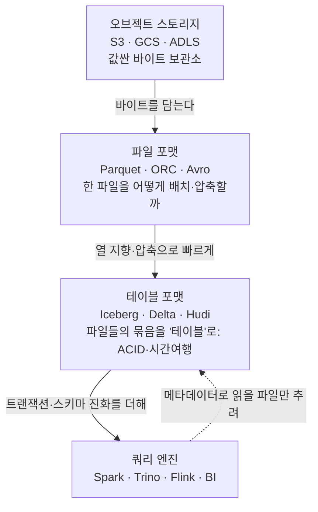

<figure class="post-figure post-figure--header">
<svg role="img" aria-label="데이터 저장 계층을 아래에서 위로 쌓은 그림: 맨 아래는 값싼 오브젝트 스토리지(S3·GCS), 그 위에 Parquet·ORC·Avro 같은 파일 포맷 층, 다시 그 위에 Iceberg·Delta·Hudi 같은 테이블 포맷 층이 ACID·시간여행을 더하며, 맨 위에서는 여러 쿼리 엔진(Spark·Trino·BI)이 같은 한 곳을 직접 읽는다. 오른쪽에는 행 지향과 열 지향이 같은 표를 어떻게 다르게 디스크에 늘어놓는지가 대비되어, 분석 쿼리가 열 지향에서 왜 빠른지를 보여 준다." viewBox="0 0 680 300" xmlns="http://www.w3.org/2000/svg">
  <title>데이터 저장 — 오브젝트 스토리지 위에 파일 포맷·테이블 포맷을 층층이 쌓고, 행 지향 대신 열 지향으로 늘어놓는다</title>
  <!-- LEFT: the storage stack -->
  <text x="190" y="26" text-anchor="middle" font-size="12" fill="currentColor" font-weight="700" opacity="0.78">저장은 층으로 쌓인다</text>
  <!-- consumers -->
  <rect x="44" y="40" width="292" height="40" rx="3" fill="var(--bg-light)" stroke="currentColor" stroke-width="2"/>
  <text x="190" y="64" text-anchor="middle" font-size="10.5" fill="currentColor" font-weight="700">쿼리 엔진 — Spark · Trino · BI · ML</text>
  <line x1="190" y1="80" x2="190" y2="96" stroke="var(--secondary-color)" stroke-width="2.5" marker-end="url(#st-arrow)"/>
  <!-- table format -->
  <rect x="44" y="100" width="292" height="44" rx="3" fill="var(--bg-panel)" stroke="var(--accent-color)" stroke-width="2.5"/>
  <text x="190" y="120" text-anchor="middle" font-size="10.5" fill="currentColor" font-weight="700">테이블 포맷 — Iceberg · Delta · Hudi</text>
  <text x="190" y="136" text-anchor="middle" font-size="8.5" fill="currentColor" opacity="0.8">ACID · 스키마 진화 · 시간여행</text>
  <line x1="190" y1="144" x2="190" y2="160" stroke="var(--secondary-color)" stroke-width="2.5" marker-end="url(#st-arrow)"/>
  <!-- file format -->
  <rect x="44" y="164" width="292" height="44" rx="3" fill="var(--bg-light)" stroke="var(--gold)" stroke-width="2.5"/>
  <text x="190" y="184" text-anchor="middle" font-size="10.5" fill="currentColor" font-weight="700">파일 포맷 — Parquet · ORC · Avro</text>
  <text x="190" y="200" text-anchor="middle" font-size="8.5" fill="currentColor" opacity="0.8">열 지향 저장 · 압축 · 인코딩</text>
  <line x1="190" y1="208" x2="190" y2="224" stroke="var(--secondary-color)" stroke-width="2.5" marker-end="url(#st-arrow)"/>
  <!-- object storage -->
  <rect x="44" y="228" width="292" height="44" rx="3" fill="var(--bg-light)" stroke="currentColor" stroke-width="2"/>
  <text x="190" y="252" text-anchor="middle" font-size="10.5" fill="currentColor" font-weight="700">오브젝트 스토리지 — S3 · GCS · ADLS</text>
  <text x="190" y="266" text-anchor="middle" font-size="8" fill="currentColor" opacity="0.7">값싸고 무한한 바이트 보관소</text>

  <!-- RIGHT: row vs column layout -->
  <text x="528" y="26" text-anchor="middle" font-size="12" fill="currentColor" font-weight="700" opacity="0.78">행 vs 열 — 같은 표, 다른 배치</text>
  <!-- row-oriented -->
  <text x="528" y="52" text-anchor="middle" font-size="9.5" fill="currentColor" opacity="0.75" font-weight="700">행 지향 (Row)</text>
  <g font-size="8" font-weight="700">
    <rect x="404" y="60" width="34" height="20" rx="2" fill="var(--bg-light)" stroke="currentColor" stroke-width="1.5"/><text x="421" y="74" text-anchor="middle" fill="currentColor">id</text>
    <rect x="438" y="60" width="34" height="20" rx="2" fill="var(--bg-panel)" stroke="currentColor" stroke-width="1.5"/><text x="455" y="74" text-anchor="middle" fill="currentColor">name</text>
    <rect x="472" y="60" width="34" height="20" rx="2" fill="var(--bg-light)" stroke="var(--gold)" stroke-width="1.5"/><text x="489" y="74" text-anchor="middle" fill="currentColor">amt</text>
    <rect x="506" y="60" width="34" height="20" rx="2" fill="var(--bg-light)" stroke="currentColor" stroke-width="1.5"/><text x="523" y="74" text-anchor="middle" fill="currentColor">id</text>
    <rect x="540" y="60" width="34" height="20" rx="2" fill="var(--bg-panel)" stroke="currentColor" stroke-width="1.5"/><text x="557" y="74" text-anchor="middle" fill="currentColor">name</text>
    <rect x="574" y="60" width="34" height="20" rx="2" fill="var(--bg-light)" stroke="var(--gold)" stroke-width="1.5"/><text x="591" y="74" text-anchor="middle" fill="currentColor">amt</text>
  </g>
  <text x="616" y="74" text-anchor="start" font-size="8" fill="currentColor" opacity="0.65">행 통째로</text>
  <!-- column-oriented -->
  <text x="528" y="118" text-anchor="middle" font-size="9.5" fill="currentColor" opacity="0.75" font-weight="700">열 지향 (Columnar)</text>
  <g font-size="8" font-weight="700">
    <rect x="404" y="126" width="34" height="20" rx="2" fill="var(--bg-light)" stroke="currentColor" stroke-width="1.5"/><text x="421" y="140" text-anchor="middle" fill="currentColor">id</text>
    <rect x="438" y="126" width="34" height="20" rx="2" fill="var(--bg-light)" stroke="currentColor" stroke-width="1.5"/><text x="455" y="140" text-anchor="middle" fill="currentColor">id</text>
    <rect x="478" y="126" width="34" height="20" rx="2" fill="var(--bg-panel)" stroke="currentColor" stroke-width="1.5"/><text x="495" y="140" text-anchor="middle" fill="currentColor">name</text>
    <rect x="512" y="126" width="34" height="20" rx="2" fill="var(--bg-panel)" stroke="currentColor" stroke-width="1.5"/><text x="529" y="140" text-anchor="middle" fill="currentColor">name</text>
    <rect x="552" y="126" width="28" height="20" rx="2" fill="var(--bg-light)" stroke="var(--gold)" stroke-width="2"/><text x="566" y="140" text-anchor="middle" fill="currentColor">amt</text>
    <rect x="580" y="126" width="28" height="20" rx="2" fill="var(--bg-light)" stroke="var(--gold)" stroke-width="2"/><text x="594" y="140" text-anchor="middle" fill="currentColor">amt</text>
  </g>
  <text x="616" y="140" text-anchor="start" font-size="8" fill="var(--gold)" opacity="0.9" font-weight="700">amt만 읽기</text>
  <!-- query callout -->
  <rect x="404" y="166" width="232" height="106" rx="3" fill="var(--bg-panel)" stroke="var(--accent-color)" stroke-width="2"/>
  <text x="520" y="188" text-anchor="middle" font-size="9.5" fill="currentColor" font-weight="700">SELECT sum(amt) ...</text>
  <text x="520" y="210" text-anchor="middle" font-size="8.5" fill="currentColor" opacity="0.85">행 지향: 모든 컬럼을 다 읽어야</text>
  <text x="520" y="224" text-anchor="middle" font-size="8.5" fill="currentColor" opacity="0.85">amt 한 칸에 도달</text>
  <text x="520" y="246" text-anchor="middle" font-size="8.5" fill="currentColor" opacity="0.9" font-weight="700">열 지향: amt 블록만 스캔</text>
  <text x="520" y="260" text-anchor="middle" font-size="8" fill="currentColor" opacity="0.7">→ 같은 값끼리 모여 압축·벡터화도 유리</text>
  <defs>
    <marker id="st-arrow" markerWidth="8" markerHeight="8" refX="6" refY="4" orient="auto">
      <path d="M0,0 L8,4 L0,8 z" fill="var(--secondary-color)"/>
    </marker>
  </defs>
</svg>
<figcaption>데이터 저장의 한 장 요약 — 값싼 오브젝트 스토리지 위에 파일 포맷, 다시 그 위에 테이블 포맷이 층층이 쌓이고, 여러 쿼리 엔진이 같은 한 곳을 읽는다. 오른쪽은 같은 표를 행 지향과 열 지향이 디스크에 어떻게 다르게 늘어놓는지 — 분석 쿼리가 필요한 컬럼만 스캔할 수 있어 열 지향이 빠른 이유.</figcaption>
</figure>

## 들어가며

수집(Ingestion) 단계를 지난 데이터는 어딘가에 **쌓여야** 합니다. 그런데 "쌓는다"는 한 단어 뒤에는 생각보다 많은 결정이 숨어 있습니다. 데이터 웨어하우스에 넣을 것인가, 레이크에 부을 것인가, 둘을 합친 레이크하우스로 갈 것인가? 파일은 Parquet으로 쓸까 Avro로 쓸까? 그 위에 Iceberg나 Delta Lake 같은 테이블 포맷을 얹어야 할까? 이 결정들이 곧 비용·쿼리 성능·확장성을 좌우합니다.

이 글은 `Data-Engineering-Essential` 시리즈의 4단계로, 수명주기의 **저장(Storage)** 칸을 깊이 파고듭니다. 1단계에서 저장이 수집·변환·서빙 모두와 맞닿은 **기반**이라고 했던 그 칸입니다. 핵심은 저장을 하나의 덩어리가 아니라 **여러 층(layer)**으로 보는 것입니다 — 바이트를 담는 오브젝트 스토리지, 그 위의 파일 포맷, 다시 그 위의 테이블 포맷. 각 층이 무엇을 책임지는지 알면, 도구 이름의 홍수 속에서도 "이건 어느 층의 문제인가"를 분간할 수 있습니다.

### 📌 이 글에서 다루는 내용

#### 🔍 핵심 주제

- **OLTP vs OLAP, 행 지향 vs 열 지향**: 분석 쿼리가 열 지향(컬럼형) 저장에서 왜 빠른가 (스캔·압축·벡터화)
- **웨어하우스 · 레이크 · 레이크하우스**: 각각의 특징과 "언제 무엇을 고르나"
- **파일 포맷 (Parquet · ORC · Avro)**: 행 vs 열 저장, 압축·인코딩, 스키마 진화
- **테이블 포맷 (Iceberg · Delta Lake · Hudi)**: 파일 포맷 위에 얹는 ACID·스키마 진화·시간여행

#### 🎯 왜 중요한가

저장 계층의 선택은 한 번 정하면 되돌리기 어렵고, **비용·성능·확장성을 모두 결정**합니다. 또 "파일 포맷"과 "테이블 포맷"을 혼동하면 도구 비교가 통째로 어긋납니다. 층의 구조를 정확히 잡아 두면 선택이 흔들리지 않습니다.

## 한눈에 보기 — 저장의 네 층

저장을 이해하는 가장 좋은 길은 **아래에서 위로 한 층씩 쌓아 보는 것**입니다. 각 층은 아래 층이 못 하던 일을 더하며, 맨 위의 쿼리 엔진은 이 모든 층을 통과해 데이터를 읽습니다.

이 글은 이 그림을 위에서 아래가 아니라, 개념의 순서대로 풀어 갑니다. 먼저 **왜 분석용 저장은 행이 아니라 열로 배치되는가**(파일 포맷의 토대)를 보고, 그다음 **웨어하우스·레이크·레이크하우스**라는 큰 그릇의 선택, 마지막으로 **파일 포맷**과 그 위의 **테이블 포맷**을 차례로 봅니다.

## OLTP vs OLAP, 행 지향 vs 열 지향

저장을 논하기 전에 **누가 데이터를 어떻게 쓰는가**부터 갈라야 합니다. 워크로드는 크게 둘로 나뉩니다.

- **OLTP(Online Transaction Processing)**: 주문 처리, 회원 가입처럼 **소수의 행을 빠르게 읽고 쓰는** 운영 워크로드. "회원 12345의 정보를 조회/수정"처럼 한두 행을 콕 집어 다룹니다. PostgreSQL·MySQL 같은 운영 DB의 영역입니다.
- **OLAP(Online Analytical Processing)**: "지난 3년간 지역별 매출 합계"처럼 **수많은 행을 훑어 몇 개 컬럼만 집계하는** 분석 워크로드. 한 행 전체가 아니라 특정 컬럼을 통째로 스캔합니다.

이 둘의 접근 패턴이 정반대이기 때문에, **데이터를 디스크에 늘어놓는 방식**도 달라야 합니다. 여기서 행 지향과 열 지향이 갈립니다.

**행 지향(Row-oriented)**은 한 행의 모든 컬럼을 디스크에 **나란히** 붙여 저장합니다. `(id=1, name=Kim, amt=100)` 다음에 `(id=2, name=Lee, amt=200)`가 이어지는 식이죠. 한 행 전체를 한 번에 읽고 쓰기 좋으므로 OLTP에 최적입니다. 반대로 `sum(amt)` 같은 집계를 하려면, **필요 없는 id·name까지 다 읽으면서** 디스크를 헤집어야 합니다.

**열 지향(Columnar)**은 같은 컬럼의 값들을 **한곳에 모아** 저장합니다. 모든 `id`가 한 블록에, 모든 `name`이 다음 블록에, 모든 `amt`가 또 다음 블록에 놓입니다. 그러면 `sum(amt)`는 **amt 블록만 통째로 읽으면** 끝납니다. 분석 쿼리가 열 지향에서 빠른 이유는 세 가지로 정리됩니다.

1. **스캔(I/O) 절감**: 쿼리가 건드리는 컬럼의 블록만 읽습니다. 100개 컬럼 중 3개만 쓰는 쿼리라면 디스크 읽기가 대폭 줄어듭니다(컬럼 프루닝, column pruning).
2. **압축률 향상**: 같은 컬럼의 값은 **타입과 분포가 비슷**합니다. 같은 도시 이름, 비슷한 금액이 줄지어 있으니 RLE(Run-Length Encoding)·딕셔너리 인코딩 같은 기법이 잘 먹혀, 행 지향보다 훨씬 작게 압축됩니다. 압축이 잘되면 읽을 바이트 자체가 줄어 또 빨라집니다.
3. **벡터화(Vectorization)**: 같은 타입의 값이 연속으로 놓이니, CPU가 한 번에 여러 값을 처리하는 SIMD 연산과 캐시 친화적 루프로 집계를 돌릴 수 있습니다.

> 💡 핵심은 "열 지향이 항상 좋다"가 아니라 **워크로드에 맞춰야 한다**는 것입니다. 단건 갱신이 잦은 운영 DB는 여전히 행 지향(OLTP)이 맞고, 대량 스캔·집계가 주인 분석 저장소가 열 지향(OLAP)으로 가는 것입니다. 그래서 Parquet·ORC 같은 분석용 파일 포맷이 모두 열 지향을 택합니다.

<figure class="post-figure">
<svg role="img" aria-label="행 지향과 열 지향이 같은 세 행짜리 표를 디스크에 어떻게 다르게 저장하는지 비교한 그림. 위쪽 행 지향은 (id·name·amt)를 한 행씩 통째로 이어 붙여, sum(amt) 쿼리가 모든 칸을 다 읽으며 필요 없는 id·name까지 건드린다. 아래쪽 열 지향은 모든 id를 한 블록에, 모든 name을 다음 블록에, 모든 amt를 마지막 블록에 모아 두어, sum(amt)는 amt 블록만 스캔하면 된다. 또 같은 컬럼 값이 모여 있어 압축이 잘된다." viewBox="0 0 660 330" xmlns="http://www.w3.org/2000/svg">
  <title>행 지향 vs 열 지향 — 같은 표를 디스크에 늘어놓는 방식과 분석 쿼리의 스캔량</title>

  <!-- the logical table -->
  <text x="80" y="24" text-anchor="middle" font-size="11" fill="currentColor" font-weight="700" opacity="0.78">논리적 표</text>
  <g font-size="9" font-weight="700">
    <rect x="24" y="36" width="36" height="22" rx="2" fill="var(--bg-panel)" stroke="currentColor" stroke-width="1.5"/><text x="42" y="51" text-anchor="middle" fill="currentColor">id</text>
    <rect x="60" y="36" width="44" height="22" rx="2" fill="var(--bg-panel)" stroke="currentColor" stroke-width="1.5"/><text x="82" y="51" text-anchor="middle" fill="currentColor">name</text>
    <rect x="104" y="36" width="40" height="22" rx="2" fill="var(--bg-panel)" stroke="var(--gold)" stroke-width="1.5"/><text x="124" y="51" text-anchor="middle" fill="currentColor">amt</text>
    <rect x="24" y="58" width="36" height="20" rx="2" fill="none" stroke="currentColor" stroke-width="1.2"/><text x="42" y="72" text-anchor="middle" font-weight="400" fill="currentColor">1</text>
    <rect x="60" y="58" width="44" height="20" rx="2" fill="none" stroke="currentColor" stroke-width="1.2"/><text x="82" y="72" text-anchor="middle" font-weight="400" fill="currentColor">Kim</text>
    <rect x="104" y="58" width="40" height="20" rx="2" fill="none" stroke="var(--gold)" stroke-width="1.2"/><text x="124" y="72" text-anchor="middle" font-weight="400" fill="currentColor">100</text>
    <rect x="24" y="78" width="36" height="20" rx="2" fill="none" stroke="currentColor" stroke-width="1.2"/><text x="42" y="92" text-anchor="middle" font-weight="400" fill="currentColor">2</text>
    <rect x="60" y="78" width="44" height="20" rx="2" fill="none" stroke="currentColor" stroke-width="1.2"/><text x="82" y="92" text-anchor="middle" font-weight="400" fill="currentColor">Lee</text>
    <rect x="104" y="78" width="40" height="20" rx="2" fill="none" stroke="var(--gold)" stroke-width="1.2"/><text x="124" y="92" text-anchor="middle" font-weight="400" fill="currentColor">200</text>
    <rect x="24" y="98" width="36" height="20" rx="2" fill="none" stroke="currentColor" stroke-width="1.2"/><text x="42" y="112" text-anchor="middle" font-weight="400" fill="currentColor">3</text>
    <rect x="60" y="98" width="44" height="20" rx="2" fill="none" stroke="currentColor" stroke-width="1.2"/><text x="82" y="112" text-anchor="middle" font-weight="400" fill="currentColor">Roh</text>
    <rect x="104" y="98" width="40" height="20" rx="2" fill="none" stroke="var(--gold)" stroke-width="1.2"/><text x="124" y="112" text-anchor="middle" font-weight="400" fill="currentColor">300</text>
  </g>
  <text x="80" y="138" text-anchor="middle" font-size="9" fill="currentColor" opacity="0.7">쿼리: SELECT sum(amt)</text>

  <!-- ROW layout -->
  <text x="400" y="50" text-anchor="middle" font-size="12" fill="currentColor" font-weight="700">행 지향 — 디스크에 이렇게 늘어선다</text>
  <g font-size="8.5" font-weight="700">
    <rect x="200" y="62" width="34" height="24" rx="2" fill="var(--bg-light)" stroke="currentColor" stroke-width="1.5"/><text x="217" y="78" text-anchor="middle" fill="currentColor">1</text>
    <rect x="234" y="62" width="46" height="24" rx="2" fill="var(--bg-light)" stroke="currentColor" stroke-width="1.5"/><text x="257" y="78" text-anchor="middle" fill="currentColor">Kim</text>
    <rect x="280" y="62" width="40" height="24" rx="2" fill="var(--bg-light)" stroke="var(--gold)" stroke-width="2"/><text x="300" y="78" text-anchor="middle" fill="currentColor">100</text>
    <rect x="320" y="62" width="34" height="24" rx="2" fill="var(--bg-light)" stroke="currentColor" stroke-width="1.5"/><text x="337" y="78" text-anchor="middle" fill="currentColor">2</text>
    <rect x="354" y="62" width="46" height="24" rx="2" fill="var(--bg-light)" stroke="currentColor" stroke-width="1.5"/><text x="377" y="78" text-anchor="middle" fill="currentColor">Lee</text>
    <rect x="400" y="62" width="40" height="24" rx="2" fill="var(--bg-light)" stroke="var(--gold)" stroke-width="2"/><text x="420" y="78" text-anchor="middle" fill="currentColor">200</text>
    <rect x="440" y="62" width="34" height="24" rx="2" fill="var(--bg-light)" stroke="currentColor" stroke-width="1.5"/><text x="457" y="78" text-anchor="middle" fill="currentColor">3</text>
    <rect x="474" y="62" width="46" height="24" rx="2" fill="var(--bg-light)" stroke="currentColor" stroke-width="1.5"/><text x="497" y="78" text-anchor="middle" fill="currentColor">Roh</text>
    <rect x="520" y="62" width="40" height="24" rx="2" fill="var(--bg-light)" stroke="var(--gold)" stroke-width="2"/><text x="540" y="78" text-anchor="middle" fill="currentColor">300</text>
  </g>
  <text x="380" y="104" text-anchor="middle" font-size="9" fill="var(--accent-color)" font-weight="700">amt 한 칸에 닿으려 모든 칸을 읽어야 함 — 스캔 9칸</text>

  <!-- divider -->
  <line x1="180" y1="146" x2="636" y2="146" stroke="currentColor" stroke-width="1" opacity="0.2"/>

  <!-- COLUMN layout -->
  <text x="400" y="174" text-anchor="middle" font-size="12" fill="currentColor" font-weight="700">열 지향 — 컬럼끼리 모아 둔다</text>
  <g font-size="8.5" font-weight="700">
    <!-- id block -->
    <rect x="200" y="186" width="34" height="24" rx="2" fill="var(--bg-light)" stroke="currentColor" stroke-width="1.5"/><text x="217" y="202" text-anchor="middle" fill="currentColor">1</text>
    <rect x="234" y="186" width="34" height="24" rx="2" fill="var(--bg-light)" stroke="currentColor" stroke-width="1.5"/><text x="251" y="202" text-anchor="middle" fill="currentColor">2</text>
    <rect x="268" y="186" width="34" height="24" rx="2" fill="var(--bg-light)" stroke="currentColor" stroke-width="1.5"/><text x="285" y="202" text-anchor="middle" fill="currentColor">3</text>
    <text x="251" y="224" text-anchor="middle" font-size="8" font-weight="400" fill="currentColor" opacity="0.7">id 블록</text>
    <!-- name block -->
    <rect x="318" y="186" width="44" height="24" rx="2" fill="var(--bg-light)" stroke="currentColor" stroke-width="1.5"/><text x="340" y="202" text-anchor="middle" fill="currentColor">Kim</text>
    <rect x="362" y="186" width="44" height="24" rx="2" fill="var(--bg-light)" stroke="currentColor" stroke-width="1.5"/><text x="384" y="202" text-anchor="middle" fill="currentColor">Lee</text>
    <rect x="406" y="186" width="44" height="24" rx="2" fill="var(--bg-light)" stroke="currentColor" stroke-width="1.5"/><text x="428" y="202" text-anchor="middle" fill="currentColor">Roh</text>
    <text x="384" y="224" text-anchor="middle" font-size="8" font-weight="400" fill="currentColor" opacity="0.7">name 블록</text>
    <!-- amt block (highlighted) -->
    <rect x="466" y="184" width="40" height="28" rx="2" fill="var(--bg-panel)" stroke="var(--gold)" stroke-width="2.5"/><text x="486" y="202" text-anchor="middle" fill="currentColor">100</text>
    <rect x="506" y="184" width="40" height="28" rx="2" fill="var(--bg-panel)" stroke="var(--gold)" stroke-width="2.5"/><text x="526" y="202" text-anchor="middle" fill="currentColor">200</text>
    <rect x="546" y="184" width="40" height="28" rx="2" fill="var(--bg-panel)" stroke="var(--gold)" stroke-width="2.5"/><text x="566" y="202" text-anchor="middle" fill="currentColor">300</text>
    <text x="526" y="226" text-anchor="middle" font-size="8" font-weight="400" fill="var(--gold)" opacity="0.95">amt 블록 — 여기만 읽음</text>
  </g>
  <text x="400" y="252" text-anchor="middle" font-size="9" fill="var(--secondary-color)" font-weight="700">필요한 amt 블록만 스캔 — 스캔 3칸</text>
  <!-- compression note -->
  <rect x="200" y="270" width="386" height="44" rx="3" fill="var(--bg-panel)" stroke="var(--accent-color)" stroke-width="2"/>
  <text x="393" y="290" text-anchor="middle" font-size="9" fill="currentColor" font-weight="700">덤: 같은 컬럼 값이 모여 있어 압축이 잘된다</text>
  <text x="393" y="305" text-anchor="middle" font-size="8.5" fill="currentColor" opacity="0.8">비슷한 타입·분포 → RLE·딕셔너리 인코딩 + 벡터화(SIMD)에 유리</text>

  <defs>
    <marker id="rc-arrow" markerWidth="8" markerHeight="8" refX="6" refY="4" orient="auto">
      <path d="M0,0 L8,4 L0,8 z" fill="var(--secondary-color)"/>
    </marker>
  </defs>
</svg>
<figcaption>같은 표라도 행 지향은 행을 통째로 이어 붙여 <strong>sum(amt)</strong>가 모든 칸을 헤집어야 하고, 열 지향은 컬럼끼리 모아 둬 <strong>amt 블록만</strong> 스캔하면 된다. 게다가 같은 컬럼 값이 모여 있어 압축률이 높고 벡터화도 잘 먹힌다 — 분석 쿼리가 열 지향에서 빠른 세 가지 이유(스캔 절감·압축·벡터화).</figcaption>
</figure>

## 웨어하우스 · 레이크 · 레이크하우스 — 무엇을 고르나

이제 "큰 그릇"을 고를 차례입니다. 데이터 웨어하우스, 데이터 레이크, 레이크하우스 — 이 셋이 **왜 그런 모습으로 등장했는지**는 [2단계: 데이터 파이프라인의 역사와 진화](/2026/06/25/data-pipeline-history-and-evolution.html)에서 다뤘으니, 여기서는 **"언제 무엇을 고르나"**에 집중합니다.

- **데이터 웨어하우스(Data Warehouse)** — 정형(structured) 데이터를 위한, **분석에 최적화된 정돈된 저장소**. 스키마를 미리 정하고(schema-on-write) 넣으며, SQL·BI에 강하고 거버넌스가 잘 잡혀 있습니다. 대신 비정형 데이터나 ML 원본을 담기엔 빡빡하고, 비용이 상대적으로 높을 수 있습니다. 예: Snowflake, BigQuery, Redshift.
- **데이터 레이크(Data Lake)** — 정형·비정형 가리지 않고 **원본을 값싸게 그대로 쌓아 두는** 오브젝트 스토리지(S3 등). 읽을 때 구조를 해석하고(schema-on-read), ML·탐색적 분석에 유연합니다. 대신 거버넌스·신뢰성을 따로 챙기지 않으면 **데이터 늪(Data Swamp)**으로 전락하기 쉽습니다.
- **레이크하우스(Lakehouse)** — 값싼 레이크(오브젝트 스토리지) 위에 **테이블 포맷**을 얹어, 웨어하우스의 ACID·신뢰성·성능을 레이크에서 직접 제공하려는 통합 접근. "레이크의 저비용·유연성 + 웨어하우스의 신뢰성"을 한곳에서 얻으려는 시도입니다. 이 글의 마지막 절(테이블 포맷)이 바로 레이크하우스를 떠받치는 핵심 기술입니다.

선택의 기준은 결국 **데이터의 형태, 쓰는 사람, 그리고 비용·운영 부담**입니다.

| 기준 | 웨어하우스 | 레이크 | 레이크하우스 |
| --- | --- | --- | --- |
| 데이터 형태 | 정형 위주 | 정형·비정형 모두 | 정형·비정형 모두 |
| 스키마 | schema-on-write | schema-on-read | 둘 다 (테이블 포맷이 관리) |
| 주 사용자 | 분석가 · BI | 데이터 사이언티스트 · ML | 분석가 + 사이언티스트 |
| 강점 | SQL 성능 · 거버넌스 | 저비용 · 유연성 | 둘의 절충 (ACID + 저비용) |
| 약점 | 비정형·ML에 빡빡, 비용 | 신뢰성·거버넌스 부족(늪) | 상대적으로 새롭고 운영 성숙도 |
| 대표 | Snowflake · BigQuery | S3 + 파일들 | Databricks · Iceberg 기반 |

> 💡 실무 감각: 정형 BI 분석만 한다면 **웨어하우스**로 충분히 빠르고 편합니다. ML·로그·이미지까지 원본을 폭넓게 다뤄야 하면 **레이크**가 필요하고, 그러면서도 분석의 신뢰성·트랜잭션을 포기하기 싫을 때 **레이크하우스**가 답이 됩니다. 작은 조직이 처음부터 레이크하우스의 복잡도를 떠안을 필요는 없습니다 — 성숙도에 맞는 적정 기술이 우선입니다.

## 파일 포맷 — Parquet · ORC · Avro

레이크/레이크하우스에서 데이터는 결국 **오브젝트 스토리지 위의 파일**로 존재합니다. 그 한 파일을 **어떻게 배치하고 압축할 것인가**가 파일 포맷의 영역입니다. CSV·JSON도 파일 포맷이지만, 압축·타입·스키마가 약해 대규모 분석엔 부적합합니다. 분석에서 사실상 표준은 셋입니다.

- **Apache Parquet** — **열 지향** 바이너리 포맷. 컬럼별 압축·인코딩, 컬럼 통계(min/max)를 담은 풋터(footer)로 **컬럼 프루닝**과 **프레디킷 푸시다운**(읽기 전에 불필요한 데이터 블록 건너뛰기)을 지원합니다. 분석·OLAP의 사실상 표준이며, 대부분의 엔진(Spark·Trino·DuckDB 등)이 1급으로 지원합니다.
- **Apache ORC(Optimized Row Columnar)** — 역시 **열 지향**. Hadoop/Hive 생태계에서 출발했고, 스트라이프(stripe) 단위 인덱스와 강한 압축이 특징입니다. 기능적으로 Parquet과 겹치며, Hive·Trino에서 많이 쓰입니다.
- **Apache Avro** — **행 지향** 바이너리 포맷. 분석 스캔이 아니라 **레코드 단위 쓰기/직렬화**에 강합니다. 스키마를 파일에 함께 담고 **스키마 진화에 특히 유연**해, Kafka 같은 스트리밍·메시지 직렬화나 적재 단계의 중간 포맷으로 자주 쓰입니다.

핵심 구분은 **열 지향(Parquet/ORC)은 분석 스캔용, 행 지향(Avro)은 레코드 쓰기·전송용**이라는 점입니다. 세 포맷 모두 **압축·인코딩**과 **스키마 진화**(컬럼 추가/삭제 등 스키마 변경을 안전하게)를 지원하지만, 잘하는 일이 다릅니다.

| 항목 | Parquet | ORC | Avro |
| --- | --- | --- | --- |
| 저장 방향 | 열 지향(columnar) | 열 지향(columnar) | 행 지향(row) |
| 주 용도 | 분석·OLAP 스캔 | 분석·OLAP (Hive 계열) | 레코드 쓰기·직렬화·스트리밍 |
| 압축·인코딩 | 강함 (컬럼별) | 강함 (스트라이프 인덱스) | 보통 (행 단위) |
| 컬럼 프루닝 | ✓ (풋터 통계) | ✓ (인덱스) | ✕ (행 전체 읽음) |
| 스키마 진화 | 지원 | 지원 | **특히 유연** (스키마 동봉) |
| 대표 생태계 | Spark · Trino · 레이크하우스 | Hive · Trino | Kafka · 스트리밍·EL 단계 |

> 💡 실무 기본값: 레이크/레이크하우스에 **분석용으로 쌓을 땐 Parquet**, 스트리밍·메시지나 수집 중간 단계의 **레코드 전송엔 Avro**. ORC는 Hive 중심 환경에서 Parquet의 대안으로 봅니다. 단, 파일 포맷만으로는 "여러 파일을 하나의 테이블로, 트랜잭션 안전하게" 다룰 수 없습니다 — 그게 다음 절의 주제입니다.

## 테이블 포맷 — Iceberg · Delta Lake · Hudi

여기서 가장 많이 헷갈리는 개념을 정확히 잡고 갑니다 — **파일 포맷과 테이블 포맷은 다른 층**입니다.

- **파일 포맷(Parquet 등)**은 **한 파일 안**을 어떻게 배치·압축할지를 정합니다.
- **테이블 포맷(Iceberg 등)**은 오브젝트 스토리지에 흩어진 **수많은 Parquet 파일의 묶음**을 **하나의 논리적 테이블**처럼 다루게 해 주는 **메타데이터 층**입니다.

비유하자면 Parquet이 "잘 정리된 한 권의 책"이라면, 테이블 포맷은 그 책들을 모아 둔 "도서관의 목록·대출 시스템"입니다. 책만 쌓아 둔 레이크(파일 더미)는 "지금 유효한 파일이 어느 것인지", "누가 쓰는 중에 다른 사람이 덮어쓰면 어쩌지", "어제 상태로 되돌릴 수 있나"를 답하지 못합니다. 테이블 포맷은 **파일 위에 메타데이터(스냅샷·매니페스트)를 얹어** 다음을 제공합니다.

- **ACID 트랜잭션**: 여러 작업이 동시에 써도 일관성이 깨지지 않게 합니다. 읽는 쪽은 항상 **하나의 일관된 스냅샷**을 봅니다(부분 쓰기가 노출되지 않음).
- **스키마 진화(Schema Evolution)**: 컬럼 추가·삭제·이름 변경을 데이터를 다시 쓰지 않고 안전하게. (Iceberg는 컬럼에 고유 ID를 부여해 이름이 바뀌어도 추적합니다.)
- **시간여행(Time Travel)**: 과거 특정 스냅샷·시점의 데이터를 그대로 조회하거나 복원. 잘못된 적재를 롤백하거나, "어제 자정 기준" 결과를 재현할 수 있습니다.
- **숨은 파티셔닝·파일 스킵핑**: 메타데이터의 컬럼 통계로 **읽을 파일만 골라** 스캔량을 줄입니다.

세 구현은 결이 조금씩 다릅니다.

- **Apache Iceberg** — 엔진 중립적이고 대규모 테이블에 강한 설계. 숨은 파티셔닝(hidden partitioning), 견고한 스키마 진화로 주목받으며 사실상 표준으로 부상 중입니다.
- **Delta Lake** — Databricks가 주도. 트랜잭션 로그(`_delta_log`) 기반으로 Spark 생태계와 통합이 매끄럽습니다.
- **Apache Hudi** — **잦은 업서트(upsert)·증분 처리·CDC**에 강점. "기존 행을 갱신·삭제"가 빈번한 워크로드에서 특히 빛납니다.

이 테이블 포맷이 바로 **레이크하우스를 떠받치는 핵심**입니다. 값싼 레이크(오브젝트 스토리지 + Parquet) 위에 테이블 포맷을 얹는 순간, 레이크는 웨어하우스의 신뢰성(ACID·스키마·시간여행)을 갖추게 되고, 앞 절에서 본 "레이크 + 웨어하우스" 통합이 비로소 현실이 됩니다. 오픈 테이블 포맷과 레이크하우스 심화는 별도 시리즈 [Lakehouse Essential Curriculum](/2026/07/12/lakehouse-essential-curriculum.html)에서 Iceberg 메타데이터 구조·스냅샷·시간여행·파티션/스키마 진화·REST Catalog까지 다룹니다.

> 💡 정리하면 층은 이렇게 쌓입니다 — **오브젝트 스토리지(바이트) → 파일 포맷(한 파일의 배치·압축) → 테이블 포맷(파일들의 묶음 + 트랜잭션) → 쿼리 엔진**. "Parquet vs Iceberg" 같은 비교가 어색하게 느껴진다면, 둘이 **서로 다른 층**이기 때문입니다. Iceberg 테이블의 데이터 파일은 보통 Parquet으로 저장됩니다 — 경쟁이 아니라 위아래로 쌓이는 관계입니다.

## 정리

저장(Storage)은 하나의 결정이 아니라 **여러 층의 결정**입니다. 이 글의 좌표를 요약하면 다음과 같습니다.

- **워크로드가 배치를 정합니다**: 단건 읽기/쓰기(OLTP)는 행 지향, 대량 스캔·집계(OLAP)는 열 지향. 분석 쿼리가 열 지향에서 빠른 건 **스캔 절감·압축·벡터화** 세 효과 때문입니다.
- **큰 그릇은 형태·사용자·비용으로 고릅니다**: 정형 BI면 웨어하우스, 비정형·ML이면 레이크, 둘 다 + 신뢰성이면 레이크하우스. 성숙도에 맞는 적정 기술이 먼저입니다.
- **파일 포맷은 한 파일의 문제**: 분석 스캔엔 열 지향 Parquet/ORC, 레코드 전송·스트리밍엔 행 지향 Avro.
- **테이블 포맷은 파일들의 묶음의 문제**: Iceberg/Delta/Hudi가 파일 위에 ACID·스키마 진화·시간여행을 더해 레이크를 레이크하우스로 끌어올립니다.

가장 오래 남을 교훈은 **"파일 포맷과 테이블 포맷은 다른 층"**이라는 구분입니다. 이 층의 지도를 손에 쥐고 있으면, 새 저장 기술을 만나도 "이건 어느 층을 푸는가"로 자리를 잡아 줄 수 있습니다. 이렇게 잘 쌓인 데이터를 **이제 어떻게 다듬어 가치로 바꿀 것인가** — 다음 글의 주제입니다.

### 다음 학습 (Next Learning)

- [Data Engineering Essential Curriculum](/2026/06/25/data-engineering-essential-curriculum.html) — 전체 로드맵으로 돌아가 진행 상황 확인하기
- [데이터 수집(Ingestion): 배치·스트리밍·CDC와 수집 도구](/2026/06/25/data-ingestion.html) — 3단계: 데이터를 어떻게 가져오는가 복습
- [데이터 변환·처리(Processing): 배치·스트림 엔진과 SQL 변환](/2026/06/25/data-processing.html) — 5단계: 쌓은 데이터를 다듬어 가치로
