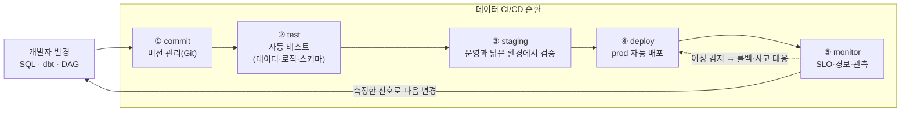

<figure class="post-figure post-figure--header">
<svg role="img" aria-label="데이터 시스템을 소프트웨어처럼 운영하는 모습을 한 장으로 표현한 그림: 왼쪽에서 데이터 파이프라인 코드가 commit→test→deploy로 흘러 운영(prod)에 올라가고, 운영에서 나오는 신호가 monitor를 거쳐 다시 commit으로 되먹임되는 순환 고리를 이룬다. 그 고리 전체를 보안·신뢰성이라는 방패가 아래에서 감싸 안고 있다." viewBox="0 0 680 290" xmlns="http://www.w3.org/2000/svg">
  <title>DataOps — 데이터 파이프라인을 commit→test→deploy→monitor로 순환시키고, 보안·신뢰성이 그 전체를 감싼다</title>
  <!-- LEFT: pipeline code as source -->
  <text x="70" y="30" text-anchor="middle" font-size="13" fill="currentColor" font-weight="700" opacity="0.75">파이프라인 코드</text>
  <rect x="28" y="50" width="84" height="60" rx="3" fill="var(--bg-light)" stroke="currentColor" stroke-width="2"/>
  <g stroke="currentColor" stroke-width="1.6" opacity="0.7">
    <line x1="44" y1="66" x2="96" y2="66"/>
    <line x1="44" y1="78" x2="88" y2="78"/>
    <line x1="44" y1="90" x2="96" y2="90"/>
  </g>
  <text x="70" y="128" text-anchor="middle" font-size="10" fill="currentColor" opacity="0.7">SQL · dbt · DAG</text>
  <line x1="116" y1="80" x2="152" y2="80" stroke="var(--secondary-color)" stroke-width="2.5" marker-end="url(#do-arrow)"/>
  <!-- THE LOOP: commit → test → deploy → monitor → (feedback) -->
  <text x="396" y="30" text-anchor="middle" font-size="13" fill="currentColor" font-weight="700" opacity="0.75">데이터 CI/CD 순환</text>
  <g font-size="11" font-weight="700">
    <rect x="156" y="54" width="92" height="52" rx="3" fill="var(--bg-light)" stroke="currentColor" stroke-width="2"/>
    <text x="202" y="78" text-anchor="middle" fill="currentColor">① commit</text>
    <text x="202" y="94" text-anchor="middle" font-size="9" font-weight="400" fill="currentColor" opacity="0.8">버전 관리</text>

    <rect x="268" y="54" width="92" height="52" rx="3" fill="var(--bg-light)" stroke="currentColor" stroke-width="2"/>
    <text x="314" y="78" text-anchor="middle" fill="currentColor">② test</text>
    <text x="314" y="94" text-anchor="middle" font-size="9" font-weight="400" fill="currentColor" opacity="0.8">자동 검증</text>

    <rect x="380" y="54" width="92" height="52" rx="3" fill="var(--bg-light)" stroke="currentColor" stroke-width="2"/>
    <text x="426" y="78" text-anchor="middle" fill="currentColor">③ deploy</text>
    <text x="426" y="94" text-anchor="middle" font-size="9" font-weight="400" fill="currentColor" opacity="0.8">자동 배포</text>

    <rect x="492" y="46" width="100" height="68" rx="3" fill="var(--bg-light)" stroke="var(--accent-color)" stroke-width="2.5"/>
    <text x="542" y="74" text-anchor="middle" fill="currentColor">④ monitor</text>
    <text x="542" y="90" text-anchor="middle" font-size="9" font-weight="400" fill="currentColor" opacity="0.8">관측·경보</text>
    <text x="542" y="104" text-anchor="middle" font-size="8" font-weight="400" fill="currentColor" opacity="0.7">prod 신뢰성</text>
  </g>
  <!-- forward arrows -->
  <g stroke="var(--secondary-color)" stroke-width="2.5">
    <line x1="248" y1="80" x2="266" y2="80" marker-end="url(#do-arrow)"/>
    <line x1="360" y1="80" x2="378" y2="80" marker-end="url(#do-arrow)"/>
    <line x1="472" y1="80" x2="490" y2="80" marker-end="url(#do-arrow)"/>
  </g>
  <!-- feedback loop: monitor → commit (the curving return) -->
  <path d="M542,114 C542,168 202,168 202,112" fill="none" stroke="var(--gold)" stroke-width="2.5" stroke-dasharray="5 4" marker-end="url(#do-arrow-g)"/>
  <text x="372" y="160" text-anchor="middle" font-size="10" fill="currentColor" opacity="0.75" font-weight="700">feedback — 측정한 신호로 다음 변경을 만든다</text>
  <!-- BOTTOM: security + reliability shield embracing the loop -->
  <rect x="28" y="200" width="564" height="60" rx="4" fill="var(--bg-panel)" stroke="var(--gold)" stroke-width="2.5"/>
  <text x="310" y="225" text-anchor="middle" font-size="12" fill="currentColor" font-weight="700">보안 · 신뢰성 — 순환 전체를 떠받친다</text>
  <text x="310" y="245" text-anchor="middle" font-size="10" fill="currentColor" opacity="0.85">최소 권한 · 암호화 · SLO · 경보 · 장애 대응</text>
  <!-- ties from the loop down to the shield -->
  <g stroke="var(--gold)" stroke-width="1.5" stroke-dasharray="2 4" opacity="0.7">
    <line x1="202" y1="106" x2="202" y2="200"/>
    <line x1="426" y1="106" x2="426" y2="200"/>
    <line x1="542" y1="114" x2="542" y2="200"/>
  </g>
  <defs>
    <marker id="do-arrow" markerWidth="8" markerHeight="8" refX="6" refY="4" orient="auto">
      <path d="M0,0 L8,4 L0,8 z" fill="var(--secondary-color)"/>
    </marker>
    <marker id="do-arrow-g" markerWidth="8" markerHeight="8" refX="6" refY="4" orient="auto">
      <path d="M0,0 L8,4 L0,8 z" fill="var(--gold)"/>
    </marker>
  </defs>
</svg>
<figcaption>DataOps의 한 장 요약 — 파이프라인 코드가 commit→test→deploy→monitor로 흐르고, 운영에서 측정한 신호가 다시 commit으로 되먹임되는 순환을 이룬다. 그 고리 전체를 보안·신뢰성이라는 방패가 아래에서 떠받친다. 데이터 시스템을 "한 번 만들고 끝"이 아니라 끊임없이 도는 소프트웨어로 다루는 것이 핵심.</figcaption>
</figure>

## 들어가며

여기까지 오면서 우리는 데이터를 **모으고(수집), 쌓고(저장), 다듬고(변환), 흘려보내고(서빙), 믿을 수 있게(품질·거버넌스)** 만드는 법을 차례로 익혔습니다. 그런데 한 가지 질문이 남습니다 — 그렇게 만든 파이프라인을 **누가, 어떻게 운영하는가?** 새벽 3시에 적재가 실패하면 누가 알아채고, 변환 로직 한 줄을 고칠 때 운영 데이터를 망가뜨리지 않으려면 어떤 안전장치가 있어야 하며, 민감한 고객 데이터가 새지 않으려면 무엇을 해야 할까요?

답은 의외로 단순합니다. **데이터 파이프라인도 결국 소프트웨어**라는 사실을 받아들이는 것입니다. 소프트웨어 업계가 지난 20년간 발전시켜 온 운영 규율 — 버전 관리, 자동 테스트, CI/CD, 모니터링, 점진적 배포 — 을 데이터에 그대로 적용하는 것, 그것이 바로 **DataOps**입니다.

이 글은 `Data-Engineering-Essential` 시리즈의 **마지막 10단계**로, 데이터 시스템을 소프트웨어처럼 운영하는 세 축 — **DataOps와 CI/CD**, **모니터링과 신뢰성**, **보안과 프라이버시** — 를 정리합니다. 1단계에서 "저류(Undercurrents)"로 짧게 스쳤던 보안·DataOps를 이제 정면으로 다룹니다.

### 📌 이 글에서 다루는 내용

#### 🔍 핵심 주제

- **DataOps와 CI/CD**: 버전 관리·자동 테스트·환경 분리(dev/staging/prod)·자동 배포, DevOps와의 관계와 차이
- **모니터링과 신뢰성**: SLA/SLO/SLI, 경보(alerting), 장애 대응(incident response), 비용 최적화(FinOps)
- **보안과 프라이버시**: 최소 권한·RBAC, 마스킹·익명화, 전송·저장 암호화, 규정 준수(GDPR 등)

#### 🎯 왜 중요한가

도구를 잘 고르는 것과 **시스템을 오래 안전하게 굴리는 것**은 다른 능력입니다. 운영·신뢰성·보안은 화려하지 않지만, 좋은 데이터 엔지니어와 그렇지 않은 사람을 가르는 결정적 차이입니다. 신뢰할 수 없는 데이터는 없는 것만 못하고, 새는 데이터는 회사를 위태롭게 합니다.

## 한눈에 보기 — 데이터 CI/CD 순환

데이터 운영의 핵심은 **한 방향 직선이 아니라 끊임없이 도는 순환**이라는 점입니다. 코드를 커밋하고, 자동으로 테스트하고, 환경을 거쳐 배포하고, 운영을 관측하고, 거기서 얻은 신호로 다시 다음 변경을 만듭니다. 이 한 바퀴를 먼저 그려 두면 세부가 자리를 잡습니다.

이 순환의 바탕에는 **보안**이 깔려 있습니다. 어떤 단계든 "이 변경을 누가 할 수 있는가", "이 데이터에 누가 접근하는가"라는 질문을 함께 던져야 하기 때문입니다. 이제 세 축을 하나씩 봅니다.

## DataOps와 CI/CD — 데이터 파이프라인을 소프트웨어처럼

DataOps는 한마디로 **DevOps의 발상을 데이터에 옮긴 것**입니다. DevOps가 애플리케이션 코드를 자동화·협업·빠른 피드백으로 안정적으로 배포하는 문화라면, DataOps는 같은 규율을 **데이터 파이프라인과 데이터 그 자체**에 적용합니다. 그 토대가 되는 네 가지 실천을 봅니다.

### 버전 관리 — 모든 것을 코드로

데이터 작업에서 가장 흔한 안티패턴은 운영 환경에서 SQL이나 변환 로직을 **직접 손으로 고치는 것**입니다. 누가 언제 무엇을 왜 바꿨는지 추적할 수 없고, 되돌릴 수도 없습니다. DataOps의 첫걸음은 **파이프라인을 구성하는 모든 것을 Git에 두는 것**입니다.

- 변환 로직(dbt 모델, SQL)
- 오케스트레이션 DAG(Airflow 등)
- 인프라 정의(Terraform 같은 IaC)
- 스키마 정의와 데이터 테스트 규칙

코드로 관리하면 변경 이력·리뷰·롤백이 자연스럽게 따라오고, 9단계에서 다룬 데이터 품질 테스트도 코드와 함께 버전이 매겨집니다.

### 자동 테스트 — 코드와 데이터를 함께 검증

소프트웨어 테스트는 보통 코드의 로직만 검증하지만, 데이터 파이프라인에서는 **두 가지를 함께** 봐야 합니다. 이것이 일반 CI/CD와 DataOps의 가장 큰 차이입니다.

- **코드/로직 테스트**: 변환 함수가 의도대로 동작하는가 (단위 테스트, 작은 샘플 입력→기대 출력)
- **데이터 테스트**: 실제 데이터가 기대 형태를 지키는가 (9단계의 not_null, unique, 참조 무결성, 분포 검사 등)
- **스키마 테스트**: 컬럼 추가/삭제 같은 변경이 하류를 깨뜨리지 않는가 (contract test)

PR을 올리면 CI가 이 셋을 자동으로 돌려, **운영에 올라가기 전에** 문제를 잡습니다. "어제까지 멀쩡하던 대시보드가 오늘 깨졌다"의 대부분은 이 자동 검증으로 막을 수 있습니다.

### 환경 분리 — dev / staging / prod

손으로 고치는 것이 위험한 이유는 결국 **운영 데이터를 직접 건드리기 때문**입니다. DataOps는 변경이 운영에 닿기 전에 거쳐야 할 단계를 둡니다.

| 환경 | 역할 | 데이터 |
| --- | --- | --- |
| **dev (개발)** | 개발자가 자유롭게 실험 | 소량 샘플 / 합성 데이터 |
| **staging (검증)** | 운영과 최대한 닮은 곳에서 사전 검증 | 운영의 복제본 / 부분집합(마스킹된) |
| **prod (운영)** | 실제 사용자·대시보드가 쓰는 곳 | 진짜 운영 데이터 |

변경은 **dev → staging → prod** 방향으로만 흐르고, 각 관문에서 자동 테스트를 통과해야 다음으로 넘어갑니다. staging이 운영과 닮을수록 "내 환경에선 됐는데" 식의 사고가 줄어듭니다.

### 자동 배포 — 그리고 안전한 되돌리기

마지막은 검증을 통과한 변경을 **사람 손을 거치지 않고 운영에 배포**하는 것입니다. 핵심은 빠른 배포 자체가 아니라, 문제가 생겼을 때 **빠르고 안전하게 되돌릴 수 있는 능력**입니다. 데이터에서는 코드 롤백뿐 아니라, 6단계의 멱등성(idempotency)·백필(backfill), 4단계의 시간여행(time travel)으로 **데이터 상태까지** 되돌릴 수 있어야 진짜 안전한 배포가 됩니다.

> 💡 DataOps와 DevOps의 결정적 차이: DevOps는 **코드**만 배포하지만, DataOps는 **코드와 데이터(상태)**를 함께 다룹니다. 코드는 롤백하면 그만이지만, 잘못 변환되어 쌓인 데이터는 그냥 되돌려지지 않습니다 — 그래서 멱등성·백필·시간여행이 운영의 필수 도구가 됩니다.

## 모니터링과 신뢰성 — 측정하지 않으면 지킬 수 없다

배포까지 자동화했다면, 이제 **운영 중인 시스템이 약속한 만큼 동작하는지**를 끊임없이 확인해야 합니다. "잘 돌고 있겠지"라는 믿음은 운영이 아닙니다. 신뢰성은 측정에서 시작합니다.

### SLA / SLO / SLI — 신뢰성을 숫자로 약속하기

신뢰성을 이야기할 때 자주 혼동되는 세 약어가 있습니다. 안에서 밖으로, **측정 → 목표 → 약속** 순서로 이해하면 명확합니다.

- **SLI (Service Level Indicator, 지표)**: 실제로 **측정하는 값**. 예: "신선도 — 데이터가 6시간 이내로 최신인가", "완전성 — 어제 행 수가 평소의 90% 이상인가", "가용성 — 쿼리 성공률".
- **SLO (Service Level Objective, 목표)**: SLI에 대한 **내부 목표치**. 예: "월간 데이터 신선도 99.5% 이상". 팀이 스스로에게 거는 기준입니다.
- **SLA (Service Level Agreement, 협약)**: SLO를 **고객·다른 팀과 공식적으로 약속**한 것. 어기면 책임(보상·페널티)이 따릅니다. 보통 SLA보다 SLO를 더 빡빡하게 잡아, SLO를 깨도 SLA까지는 여유가 있게 둡니다.

데이터 엔지니어링에서 SLI는 일반 서비스의 "응답 시간"과 다릅니다. **데이터의 신선도·완전성·정확성**이 핵심 지표이며, 이는 9단계에서 다룬 데이터 품질·관측가능성과 곧장 이어집니다 — 품질을 측정하던 것이 곧 신뢰성의 SLI가 됩니다.

<figure class="post-figure">
<svg role="img" aria-label="SLI·SLO·SLA의 관계를 안에서 밖으로 겹친 세 겹 원으로 표현한 그림. 가장 안쪽은 SLI로 실제로 측정하는 지표(신선도·완전성·가용성)이고, 그것을 감싸는 SLO는 그 지표에 거는 내부 목표치(예 99.5%)이며, 가장 바깥의 SLA는 그 목표를 고객·다른 팀과 공식적으로 약속한 협약으로 어기면 책임이 따른다. 오른쪽에는 측정→목표→약속으로 갈수록 책임의 무게가 커진다는 화살표가 있다." viewBox="0 0 620 330" xmlns="http://www.w3.org/2000/svg">
  <title>SLI·SLO·SLA — 측정하는 지표(SLI)를 목표(SLO)가 감싸고, 그 목표를 외부 약속(SLA)이 다시 감싼다</title>

  <text x="310" y="28" text-anchor="middle" font-size="13" fill="currentColor" font-weight="700" opacity="0.8">안에서 밖으로 — 측정 · 목표 · 약속</text>

  <!-- outermost: SLA -->
  <rect x="40" y="48" width="540" height="232" rx="6" fill="var(--bg-light)" stroke="var(--accent-color)" stroke-width="2.5"/>
  <text x="310" y="72" text-anchor="middle" font-size="12" fill="currentColor" font-weight="700">SLA — 외부와의 공식 약속(협약)</text>
  <text x="310" y="90" text-anchor="middle" font-size="9.5" fill="currentColor" opacity="0.8">어기면 책임(보상·페널티) · 고객/다른 팀 대상</text>

  <!-- middle: SLO -->
  <rect x="96" y="104" width="428" height="156" rx="5" fill="var(--bg-panel)" stroke="var(--gold)" stroke-width="2.5"/>
  <text x="310" y="128" text-anchor="middle" font-size="12" fill="currentColor" font-weight="700">SLO — 내부 목표치</text>
  <text x="310" y="146" text-anchor="middle" font-size="9.5" fill="currentColor" opacity="0.8">예: 월간 데이터 신선도 99.5% 이상</text>

  <!-- innermost: SLI -->
  <rect x="156" y="160" width="308" height="84" rx="4" fill="var(--bg-light)" stroke="currentColor" stroke-width="2"/>
  <text x="310" y="184" text-anchor="middle" font-size="12" fill="currentColor" font-weight="700">SLI — 실제로 측정하는 지표</text>
  <text x="310" y="204" text-anchor="middle" font-size="9.5" fill="currentColor" opacity="0.85">신선도 · 완전성 · 정확성 · 가용성</text>
  <text x="310" y="222" text-anchor="middle" font-size="9" fill="currentColor" opacity="0.7">(9단계 품질·관측가능성이 곧 SLI)</text>

  <!-- right-side weight arrow -->
  <text x="600" y="164" text-anchor="end" font-size="9.5" fill="currentColor" opacity="0.7" transform="rotate(90 600 164)">책임의 무게 →</text>
  <line x1="598" y1="244" x2="598" y2="60" stroke="var(--secondary-color)" stroke-width="2.5" marker-end="url(#slo-arrow)"/>

  <!-- bottom note: alert fires when SLI drifts below SLO -->
  <text x="310" y="300" text-anchor="middle" font-size="10" fill="currentColor" opacity="0.75" font-weight="700">SLI가 SLO 아래로 내려가면 → 경보(alert) → 장애 대응</text>
  <line x1="310" y1="244" x2="310" y2="288" stroke="var(--secondary-color)" stroke-width="2" stroke-dasharray="4 3" marker-end="url(#slo-arrow)"/>

  <defs>
    <marker id="slo-arrow" markerWidth="8" markerHeight="8" refX="6" refY="4" orient="auto">
      <path d="M0,0 L8,4 L0,8 z" fill="var(--secondary-color)"/>
    </marker>
  </defs>
</svg>
<figcaption>SLI·SLO·SLA는 안에서 밖으로 겹친 세 겹이다 — 실제로 <strong>측정</strong>하는 지표(SLI)를 내부 <strong>목표</strong>(SLO)가 감싸고, 그 목표를 외부와의 <strong>약속</strong>(SLA)이 다시 감싼다. 바깥으로 갈수록 책임이 무거워진다. SLI가 SLO 밑으로 내려가는 순간이 곧 경보가 울려야 할 때다.</figcaption>
</figure>

### 경보(Alerting) — 사람을 깨우는 기준

측정값(SLI)이 목표(SLO) 아래로 내려가려 할 때 **사람에게 알리는 것**이 경보입니다. 경보 설계의 핵심은 역설적으로 **경보를 적게 울리는 것**입니다. 사소한 변동마다 알림이 오면 사람은 곧 무뎌지고(alert fatigue), 정작 중요한 신호를 놓칩니다. 좋은 경보의 원칙은 다음과 같습니다.

- **실행 가능한 것만**: 받는 사람이 무언가 **조치할 수 있을 때만** 울린다. "그냥 알아두세요"는 경보가 아니라 노이즈.
- **증상 기반(symptom-based)**: "디스크 80%"보다 "어제 매출 테이블이 비었다"처럼 **비즈니스 영향**에 가까운 신호를 우선한다.
- **심각도 구분**: 즉시 깨워야 할 page와, 업무 시간에 보면 되는 ticket을 나눈다.

### 장애 대응(Incident Response) — 무너졌을 때의 규율

아무리 잘 막아도 장애는 일어납니다. 중요한 것은 **장애가 나는가**가 아니라 **얼마나 빨리 감지하고 복구하며, 같은 일이 반복되지 않게 배우는가**입니다. 신뢰성을 측정하는 두 핵심 지표가 있습니다.

- **MTTD (Mean Time To Detect)**: 장애가 시작된 뒤 **알아채기까지** 걸린 시간. 모니터링·경보가 좌우합니다.
- **MTTR (Mean Time To Recover)**: 알아챈 뒤 **복구하기까지** 걸린 시간. 롤백·백필·런북(runbook)이 좌우합니다.

장애가 끝나면 **포스트모템(post-mortem)**을 씁니다. 핵심은 "누구 잘못인가"가 아니라 "왜 이 시스템이 이 실패를 허용했는가"를 묻는 **비난 없는(blameless)** 문화입니다. 거기서 나온 개선이 다시 코드·테스트·경보로 들어가, 글머리의 CI/CD 순환을 한 바퀴 더 단단하게 만듭니다.

### 비용 최적화(FinOps) — 신뢰성의 또 다른 얼굴

클라우드 시대의 데이터 시스템에서 비용은 **운영 지표**입니다. 2단계에서 봤듯 컴퓨팅과 스토리지가 분리되어 탄력적으로 빌려 쓰는 구조이기에, 비효율적인 쿼리 하나가 곧장 청구서로 돌아옵니다. **FinOps**는 비용을 가시화하고 통제하는 운영 규율입니다.

- **비용 가시성**: 어떤 파이프라인·쿼리·팀이 얼마를 쓰는지 태깅하고 대시보드로 본다.
- **스토리지 절감**: 파티셔닝·파일 포맷(Parquet)·압축·라이프사이클 정책으로 스캔량과 보관 비용을 줄인다.
- **컴퓨팅 절감**: 불필요한 풀스캔 제거, 증분(incremental) 처리, 적절한 웨어하우스 크기·자동 일시중지.

비용을 SLO처럼 **예산(budget)으로 관리**하면, 신뢰성과 비용 사이의 균형을 의식적으로 선택할 수 있습니다. "더 빠르게"와 "더 싸게"는 늘 맞바꾸는 관계이기 때문입니다.

## 보안과 프라이버시 — 가장 먼저 챙겨야 할 저류

1단계에서 보안을 "데이터 엔지니어링에서 가장 먼저 고려해야 할 저류"라고 했습니다. 데이터는 자산인 동시에 **부채**입니다 — 잘 쓰면 가치를 낳지만, 새면 회사를 위태롭게 합니다. 보안은 사후에 덧붙이는 것이 아니라 파이프라인의 모든 단계에 처음부터 묻어 있어야 합니다.

### 최소 권한과 RBAC — 필요한 만큼만

보안의 출발점은 **최소 권한 원칙(Principle of Least Privilege)**입니다. 모든 사람과 시스템은 **자기 일에 꼭 필요한 만큼만** 접근하고, 그 이상은 막습니다. 이를 운영 가능하게 만드는 것이 **RBAC(Role-Based Access Control)**입니다.

- 사람마다 권한을 따로 주지 않고, **역할(role)**에 권한을 묶은 뒤 사람을 역할에 배정한다.
- 예: `analyst` 역할은 정제된 마트만 SELECT, `engineer` 역할은 변환 스키마에 쓰기, `pii_reader` 역할만 민감 컬럼 접근.
- 파이프라인을 돌리는 **서비스 계정**도 사람과 똑같이 최소 권한으로 둔다 — 적재 잡이 운영 DB 전체에 DROP 권한을 가질 이유는 없습니다.

### 마스킹과 익명화 — 보면서도 못 보게

분석에는 데이터가 필요하지만, **누가 누구인지까지 알 필요는 없는** 경우가 많습니다. 개인을 식별할 수 있는 정보(PII)를 다루는 기법을 구분해 둡시다.

- **마스킹(Masking)**: 보여줄 때만 가린다. `010-1234-5678` → `010-****-5678`. 원본은 남아 있고 권한 있는 사람만 본다(동적 마스킹).
- **익명화(Anonymization)**: 원본 자체를 식별 불가능하게 바꾼다. 되돌릴 수 없으며, 분석가는 통계만 보고 개인은 못 본다.
- **가명화(Pseudonymization)**: 식별자를 토큰으로 치환한다. 키를 가진 사람만 되돌릴 수 있어, GDPR 등에서 권장되는 중간 형태.

staging 환경에 운영 데이터를 복제할 때도 PII는 마스킹된 형태로만 가져오는 것이 원칙입니다 — 환경 분리의 보안 버전인 셈입니다.

### 암호화 — 전송 중과 저장 중 모두

데이터는 두 상태에서 모두 보호되어야 합니다.

- **전송 중 암호화(in transit)**: 네트워크를 오갈 때 TLS로 감싼다. 원천→수집, 서비스 간 통신 등 데이터가 움직이는 모든 구간.
- **저장 중 암호화(at rest)**: 디스크·오브젝트 스토리지·웨어하우스에 쌓일 때 암호화한다. 대부분의 클라우드 저장소가 기본 제공하지만, **키를 누가 관리하는가**(KMS, 고객 관리 키)가 통제 수준을 가릅니다.

### 규정 준수(Compliance) — GDPR와 그 친척들

마지막으로, 데이터 운영은 **법적 의무**와 맞닿아 있습니다. 대표적으로 EU의 **GDPR**, 캘리포니아의 **CCPA** 등이 있으며, 데이터 엔지니어가 시스템으로 보장해야 할 대표적 요구는 다음과 같습니다.

- **잊혀질 권리(right to be forgotten)**: 개인이 요청하면 그 사람의 데이터를 **삭제**할 수 있어야 한다 — 원본 보존을 미덕으로 삼는 데이터 레이크에서 특정 개인만 골라 지우는 일은 결코 사소하지 않습니다.
- **목적 제한·동의**: 수집한 목적 밖으로 데이터를 쓰지 않는다.
- **데이터 리니지·감사 로그**: 어떤 데이터가 어디서 와서 어디로 갔는지(9단계 거버넌스·리니지)와 누가 언제 접근했는지를 추적할 수 있어야 한다.

규정 준수는 앞서 다룬 RBAC·마스킹·암호화·리니지가 **함께 받쳐줄 때** 비로소 가능합니다. 즉, 이 글의 세 축은 따로 노는 것이 아니라 서로를 떠받칩니다.

## 정리

데이터 엔지니어링의 마지막 퍼즐은 **데이터 시스템을 소프트웨어처럼 규율 있게 운영하는 것**입니다. 이 글을 요약하면 다음과 같습니다.

- **DataOps**는 DevOps의 발상을 데이터에 옮긴 것 — 버전 관리·자동 테스트·환경 분리(dev/staging/prod)·자동 배포로 변경을 안전하게 만듭니다. DevOps와 달리 **코드뿐 아니라 데이터(상태)**까지 다루므로 멱등성·백필·시간여행이 필수입니다.
- **신뢰성**은 측정에서 시작합니다 — SLI(측정)→SLO(목표)→SLA(약속)로 신뢰성을 숫자로 약속하고, 노이즈 없는 경보, 비난 없는 장애 대응(MTTD·MTTR·포스트모템), 그리고 FinOps로 비용까지 운영 지표로 다룹니다.
- **보안**은 가장 먼저 챙겨야 할 저류입니다 — 최소 권한·RBAC, 마스킹·익명화·가명화, 전송·저장 암호화, 그리고 GDPR 같은 규정 준수가 서로를 떠받칩니다.

이 세 축은 모두 글머리에서 그린 **commit→test→deploy→monitor→feedback의 순환**으로 수렴합니다 — 한 번 만들고 끝나는 시스템이 아니라, 끊임없이 측정하고 고치며 단단해지는 살아 있는 소프트웨어로 데이터를 다루는 것입니다.

### 시리즈를 마치며 — Data-Engineering-Essential 완주 🎉

이 글로 `Data-Engineering-Essential` 시리즈 **10단계를 모두 완주**했습니다. 우리는 데이터 엔지니어링의 **지도(수명주기·저류)**에서 출발해, 파이프라인의 **역사**를 따라가고, 수집→저장→변환→서빙의 각 칸을 깊이 파고든 뒤, 품질·거버넌스로 데이터를 **믿을 수 있게** 만들고, 마지막으로 그 전체를 **소프트웨어처럼 운영**하는 데까지 왔습니다.

이제는 큰 그림이 손에 잡힐 것입니다. 다음 단계는 개별 도구를 **깊이** 파는 것입니다. 시리즈를 통해 "이 도구는 수명주기의 어느 칸을, 무엇을 풀고 무엇을 포기하며 해결하는가"를 묻는 눈을 길렀으니, 이제 그 눈으로 각 도구의 내부로 들어갈 차례입니다.

### 다음 학습 (Next Learning)

- [Data Engineering Essential Curriculum](/2026/06/25/data-engineering-essential-curriculum.html) — 전체 로드맵으로 돌아가 완주를 확인하고 정리하기
- [데이터 품질·거버넌스·관측가능성: 믿을 수 있는 데이터 만들기](/2026/06/25/data-quality-governance.html) — 9단계: 신뢰성의 SLI가 되는 품질·관측가능성 복습
- [Designing Data-Intensive Applications](/2026/06/19/designing-data-intensive-applications.html) — 데이터 시스템의 신뢰성·확장성·유지보수성을 이론적으로 더 깊이 파기
- **앞으로의 스핀오프 시리즈(예정)** — 이 시리즈가 그린 좌표 위에서 개별 도구를 깊이 파는 후속 시리즈를 계획합니다: **Kafka**(스트리밍·수집), **Spark**(분산 변환), **dbt**(ELT 변환·테스트), **Airflow**(오케스트레이션).
