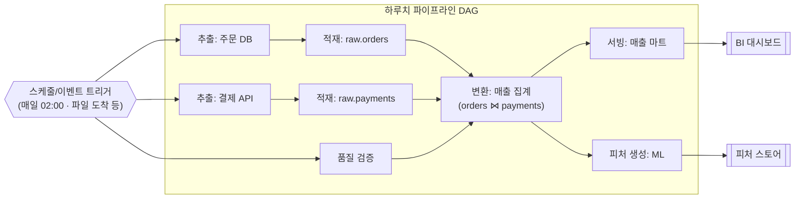

<figure class="post-figure post-figure--header">
<svg role="img" aria-label="오케스트레이터를 파이프라인의 두뇌이자 지휘자로 표현한 그림: 가운데 지휘자가 시계(스케줄)의 박자에 맞춰 지휘봉을 들고, 그 아래로 추출·적재·변환·검증·서빙이라는 여러 작업이 화살표로 이어진 방향성 비순환 그래프(DAG)를 이루며 의존성 순서대로 실행된다. 지휘자는 각 작업의 실행 시점과 순서를 조율하고, 실패한 작업에는 재시도 신호를 보낸다." viewBox="0 0 660 300" xmlns="http://www.w3.org/2000/svg">
  <title>오케스트레이션 — 스케줄의 박자에 맞춰 DAG 위의 작업들을 지휘하는 두뇌</title>
  <!-- TOP: the clock / schedule that sets the beat -->
  <text x="330" y="26" text-anchor="middle" font-size="13" fill="currentColor" font-weight="700" opacity="0.75">스케줄 · 트리거 — 언제 시작할지</text>
  <circle cx="330" cy="62" r="20" fill="var(--bg-light)" stroke="var(--gold)" stroke-width="2.5"/>
  <line x1="330" y1="62" x2="330" y2="49" stroke="currentColor" stroke-width="2"/>
  <line x1="330" y1="62" x2="340" y2="68" stroke="currentColor" stroke-width="2"/>
  <!-- beat ticks radiating from the clock -->
  <g stroke="var(--gold)" stroke-width="1.5" opacity="0.7">
    <line x1="296" y1="48" x2="284" y2="40"/>
    <line x1="364" y1="48" x2="376" y2="40"/>
  </g>
  <!-- the conductor / brain that translates the beat into commands -->
  <line x1="330" y1="82" x2="330" y2="104" stroke="var(--secondary-color)" stroke-width="2.5" marker-end="url(#or-arrow)"/>
  <rect x="246" y="106" width="168" height="46" rx="4" fill="var(--bg-panel)" stroke="var(--accent-color)" stroke-width="2.5"/>
  <text x="330" y="128" text-anchor="middle" font-size="12" fill="currentColor" font-weight="700">오케스트레이터 (두뇌·지휘자)</text>
  <text x="330" y="144" text-anchor="middle" font-size="9" fill="currentColor" opacity="0.8">실행 순서·의존성·재시도 조율</text>

  <!-- batons reaching down to the DAG tasks -->
  <g stroke="var(--secondary-color)" stroke-width="2" opacity="0.85">
    <line x1="290" y1="152" x2="120" y2="196" marker-end="url(#or-arrow)"/>
    <line x1="330" y1="152" x2="330" y2="190" marker-end="url(#or-arrow)"/>
    <line x1="370" y1="152" x2="540" y2="196" marker-end="url(#or-arrow)"/>
  </g>

  <!-- BOTTOM: the DAG of tasks -->
  <text x="330" y="180" text-anchor="middle" font-size="11" fill="currentColor" font-weight="700" opacity="0.7">DAG — 무엇을 어떤 순서로</text>
  <g font-size="10" font-weight="700">
    <!-- extract -->
    <rect x="74" y="200" width="92" height="40" rx="3" fill="var(--bg-light)" stroke="currentColor" stroke-width="2"/>
    <text x="120" y="224" text-anchor="middle" fill="currentColor">추출</text>
    <!-- load -->
    <rect x="284" y="200" width="92" height="40" rx="3" fill="var(--bg-light)" stroke="currentColor" stroke-width="2"/>
    <text x="330" y="224" text-anchor="middle" fill="currentColor">적재</text>
    <!-- another extract on the right -->
    <rect x="494" y="200" width="92" height="40" rx="3" fill="var(--bg-light)" stroke="currentColor" stroke-width="2"/>
    <text x="540" y="224" text-anchor="middle" fill="currentColor">검증</text>
    <!-- transform (merge point) -->
    <rect x="284" y="256" width="92" height="40" rx="3" fill="var(--bg-light)" stroke="var(--accent-color)" stroke-width="2.5"/>
    <text x="330" y="280" text-anchor="middle" fill="currentColor">변환</text>
    <!-- serve -->
    <rect x="494" y="256" width="92" height="40" rx="3" fill="var(--bg-light)" stroke="currentColor" stroke-width="2"/>
    <text x="540" y="280" text-anchor="middle" fill="currentColor">서빙</text>
  </g>
  <!-- DAG edges: dependencies between tasks -->
  <g stroke="currentColor" stroke-width="2" opacity="0.75">
    <line x1="166" y1="220" x2="282" y2="220" marker-end="url(#or-edge)"/>
    <line x1="330" y1="240" x2="330" y2="254" marker-end="url(#or-edge)"/>
    <line x1="494" y1="232" x2="378" y2="262" marker-end="url(#or-edge)"/>
    <line x1="376" y1="276" x2="492" y2="276" marker-end="url(#or-edge)"/>
  </g>
  <defs>
    <marker id="or-arrow" markerWidth="8" markerHeight="8" refX="6" refY="4" orient="auto">
      <path d="M0,0 L8,4 L0,8 z" fill="var(--secondary-color)"/>
    </marker>
    <marker id="or-edge" markerWidth="8" markerHeight="8" refX="6" refY="4" orient="auto">
      <path d="M0,0 L8,4 L0,8 z" fill="currentColor"/>
    </marker>
  </defs>
</svg>
<figcaption>오케스트레이터는 파이프라인의 두뇌이자 지휘자다 — 위쪽 스케줄·트리거가 "언제 시작할지"의 박자를 주면, 가운데 오케스트레이터가 그 박자를 받아 아래 DAG 위의 작업들을 의존성 순서대로 지휘한다. 추출이 끝나야 적재가, 적재와 검증이 끝나야 변환이, 변환이 끝나야 서빙이 돈다.</figcaption>
</figure>

## 들어가며

데이터 파이프라인은 결코 하나의 작업으로 끝나지 않습니다. 원천에서 데이터를 끌어오고, 저장소에 적재하고, 변환하고, 품질을 검증한 뒤, 마트로 서빙하고, 어쩌면 모델 학습까지 — 수십, 수백 개의 작업이 **정해진 순서와 조건**에 따라 돌아갑니다. 어떤 작업은 다른 작업이 끝나야 시작할 수 있고, 어떤 작업은 동시에 돌아도 무방하며, 또 어떤 작업은 매일 새벽 2시에 정확히 한 번만 실행되어야 합니다.

이 복잡한 실행을 손으로 챙기는 것은 금세 한계에 부딪힙니다. cron 잡 수십 개를 흩뿌려 두면, 어느 잡이 실패했는지, 그 실패가 어떤 하류 잡을 망쳤는지, 무엇을 어떤 순서로 다시 돌려야 하는지 아무도 알 수 없게 됩니다. **오케스트레이션(Orchestration)**은 바로 이 문제를 푸는 분야입니다. 1단계에서 만난 저류(Undercurrents) 중 하나였던 오케스트레이션을, 이번 글에서는 본격적으로 파고듭니다.

이 글은 `Data-Engineering-Essential` 시리즈의 6단계로, 작업들을 **DAG로 모델링**하고 의존성·스케줄에 따라 실행하는 원리, 대표 오케스트레이터들의 철학 차이, 그리고 어떤 실패에도 데이터가 망가지지 않는 **견고한 파이프라인**을 만드는 기법을 다룹니다.

### 📌 이 글에서 다루는 내용

#### 🔍 핵심 주제

- **DAG와 스케줄링**: 작업을 방향성 비순환 그래프로 모델링하고, 스케줄·이벤트·센서로 트리거하기
- **오케스트레이터 비교**: Airflow(task-centric)와 Dagster·Prefect(asset·flow-centric)의 철학 차이
- **견고한 파이프라인**: 멱등성·재시도·백오프·백필·체크포인트·파티션 단위 처리

#### 🎯 왜 중요한가

오케스트레이션은 개별 작업의 합 이상을 만듭니다. **무엇이 무엇에 의존하는지**를 명시적으로 선언해 두면, 실패는 국소화되고, 재실행은 안전해지며, 파이프라인 전체가 관측 가능한 하나의 시스템이 됩니다.

## 한눈에 보기 — DAG 위에서 흐르는 작업들

오케스트레이션의 핵심은 파이프라인을 **DAG(Directed Acyclic Graph, 방향성 비순환 그래프)**로 그리는 것입니다. 노드는 작업(task)이고, 화살표는 "이 작업이 끝나야 저 작업이 시작한다"는 의존성입니다. 그래프를 한 장 그려 두면, 무엇이 병렬로 돌 수 있고 무엇이 줄 서야 하는지가 한눈에 보입니다.





추출 두 개와 품질 검증은 **서로 의존하지 않으므로 병렬**로 돌 수 있지만, 변환(`T`)은 세 작업이 모두 끝나야 시작합니다. 변환이 끝나면 서빙과 피처 생성이 다시 갈라져 병렬로 진행됩니다. 이렇게 의존성을 그래프로 선언해 두는 것이 오케스트레이션의 출발점입니다.

## DAG와 스케줄링 — 의존성을 그래프로, 실행을 트리거로

### 왜 하필 DAG인가

작업의 의존 관계를 표현하는 자료구조로 그래프는 자연스럽습니다. 다만 두 가지 제약이 붙습니다. **방향성(Directed)**은 의존이 한 방향이라는 뜻입니다 — "추출 → 적재"이지 그 반대가 아닙니다. **비순환(Acyclic)**은 사이클이 없어야 한다는 뜻입니다. A가 B에 의존하는데 B가 다시 A에 의존하면, 둘 중 무엇을 먼저 실행할지 영원히 결정할 수 없습니다(교착 상태). 사이클이 없는 방향 그래프이기에, 오케스트레이터는 **위상 정렬(topological sort)**로 "실행 가능한 순서"를 항상 계산해 낼 수 있습니다.

이 구조 덕분에 오케스트레이터는 세 가지를 자동으로 해냅니다.

- **순서 보장**: 선행 작업이 성공해야만 후행 작업을 시작합니다.
- **병렬 실행**: 서로 의존하지 않는 작업은 동시에 돌립니다.
- **실패 국소화**: 한 작업이 실패하면 그에 의존하는 하류만 멈추고, 무관한 가지는 계속 진행합니다.

### 무엇이 작업을 깨우는가 — 트리거의 종류

DAG가 "무엇을 어떤 순서로"라면, 트리거는 "언제 시작할지"입니다. 크게 두 갈래입니다.

- **스케줄 트리거(Schedule)**: 시간이 조건입니다. "매일 02:00", "매시 정각", "매주 월요일"처럼 cron 표현식이나 인터벌로 정의합니다. 배치 파이프라인의 가장 흔한 트리거이며, 예측 가능하고 단순합니다.
- **이벤트/센서 트리거(Event/Sensor)**: 외부 상태가 조건입니다. "S3에 새 파일이 도착하면", "선행 DAG가 끝나면", "특정 파티션이 채워지면" 같은 조건을 **센서(sensor)**가 지켜보다가 충족되는 순간 작업을 깨웁니다. 원천의 도착 시각이 들쭉날쭉할 때, 시간이 아니라 데이터의 **준비 여부**에 반응할 수 있습니다.

> 💡 실무에서는 둘을 섞습니다. "매일 02:00에 깨어나되(스케줄), 원천 파일이 도착할 때까지 센서로 기다렸다가(이벤트) 본 작업을 시작"하는 식이죠. 시간 기반의 예측 가능성과 이벤트 기반의 정확성을 함께 얻는 흔한 패턴입니다.

한 가지 자주 혼동되는 개념이 **데이터 인터벌(data interval)** 또는 **논리적 실행 시각**입니다. 매일 02:00에 도는 잡이 처리하는 것은 "오늘"이 아니라 보통 "어제 하루치" 데이터입니다. 오케스트레이터는 각 실행에 "이 실행이 책임지는 시간 구간"을 부여하고, 작업은 실제 벽시계 시각이 아니라 이 **논리적 구간**을 기준으로 데이터를 처리해야 합니다. 이 구분이 다음에 볼 백필을 가능케 하는 토대입니다.

## 오케스트레이터 비교 — 무엇을 일급으로 보는가

도구는 많지만, 철학은 크게 두 진영으로 갈립니다. **무엇을 파이프라인의 일급 시민(first-class citizen)으로 다루느냐**가 갈림길입니다.

### Airflow — task-centric

**Apache Airflow**는 이 분야의 사실상 표준입니다. Airflow의 세계에서 일급 시민은 **작업(task)**입니다. 개발자는 "어떤 작업을, 어떤 순서로 실행하라"를 Python으로 선언하고, Airflow는 그 DAG를 스케줄에 맞춰 실행하며 각 작업의 성공·실패·재시도를 추적합니다. 풍부한 생태계(수많은 오퍼레이터·커넥터), 성숙한 운영 도구, 거대한 커뮤니티가 강점입니다.

다만 task-centric 모델은 **"무엇을 실행했는가"는 잘 알지만 "어떤 데이터가 만들어졌는가"는 직접 알지 못합니다.** 작업이 성공했다고 해서 그 작업이 만든 테이블이 올바른지는 별개의 문제죠. 이 간극이 다음 진영의 출발점입니다.

> Airflow는 이 시리즈에서 한 단계로 짧게 다루기엔 너무 큰 주제입니다. DAG 작성, 오퍼레이터, XCom, 스케줄러 동작, 배포·운영까지는 이제 별도 시리즈 [Airflow Essential Curriculum](/2026/07/12/airflow-essential-curriculum.html)에서 깊이 다룹니다.

### Dagster·Prefect — asset·flow-centric

**Dagster**는 일급 시민을 작업이 아니라 **데이터 자산(data asset)**으로 끌어올립니다 — 즉 "이 테이블/파일/모델이 어떻게 만들어지고 무엇에 의존하는가"를 중심에 둡니다. 개발자가 자산과 그 의존성을 선언하면 Dagster가 실행 그래프를 역으로 유도하고, 자산의 신선도·품질·리니지(lineage)를 함께 추적합니다. "작업이 돌았다"가 아니라 "데이터가 최신이고 올바르다"를 묻는 관점입니다.

**Prefect**는 평범한 Python 함수를 데코레이터(`@flow`, `@task`)로 감싸 곧바로 오케스트레이션되는 **flow**로 만드는, 코드 친화적이고 동적인 접근을 취합니다. 정적인 DAG 정의보다 일반 파이썬 제어 흐름에 가깝게 파이프라인을 짤 수 있어, 실행 중에 그래프 모양이 바뀌는 동적 워크플로에 유연합니다.

| 구분 | Airflow | Dagster | Prefect |
| --- | --- | --- | --- |
| 일급 시민 | 작업(task) | 데이터 자산(asset) | 흐름(flow) |
| 중심 질문 | 무엇을 어떤 순서로 실행했나 | 어떤 데이터가 최신·정상인가 | 이 함수를 어떻게 안정 실행하나 |
| 모델 | 정적 DAG | 자산 그래프(의존성에서 유도) | 동적 파이썬 흐름 |
| 강점 | 성숙한 생태계·운영 표준 | 데이터 인지·리니지·테스트 | 코드 친화·동적 워크플로 |

어느 것이 정답이라기보다, 팀의 무게중심이 **"작업의 실행"**에 있는지 **"데이터의 정확성"**에 있는지에 따라 선택이 갈립니다. 핵심은 도구 이름이 아니라, DAG·의존성·스케줄링이라는 **공통 원리**가 그 아래 똑같이 깔려 있다는 점입니다.

## 견고한 파이프라인 — 실패를 전제로 설계하기

오케스트레이터가 작업을 순서대로 돌려 준다고 해서 파이프라인이 견고해지는 것은 아닙니다. 분산 환경에서 작업은 **반드시 실패합니다** — 네트워크가 끊기고, 원천이 늦게 도착하고, 노드가 죽습니다. 견고한 파이프라인은 실패를 예외가 아니라 **전제**로 두고 설계합니다. 그 토대가 다음의 다섯 가지입니다.

### 멱등성(Idempotency) — 같은 작업을 몇 번 돌려도 결과가 같다

**멱등성**은 견고함의 가장 근본적인 토대입니다. 같은 작업을 한 번 돌리든 다섯 번 돌리든 **최종 상태가 동일**하다는 성질입니다. 작업이 절반쯤 실행되다 죽었을 때, 오케스트레이터는 그 작업을 그냥 다시 돌립니다. 이때 멱등하지 않다면 — 가령 "테이블에 행을 INSERT한다"면 — 재시도할 때마다 데이터가 중복으로 불어납니다.

멱등성을 얻는 실무적 방법은 명확합니다. **"추가(append)" 대신 "덮어쓰기(overwrite)"** 로 사고하는 것입니다. "어제치 파티션을 INSERT" 대신 "어제치 파티션을 통째로 DELETE 후 다시 쓰기(혹은 동등한 `INSERT OVERWRITE`, `MERGE`)"로 짜면, 몇 번을 재실행해도 그 파티션의 내용은 항상 같은 한 벌이 됩니다.

<figure class="post-figure">
<svg role="img" aria-label="멱등성을 위와 아래 두 줄로 비교한 그림. 위쪽은 멱등하지 않은 INSERT 방식: 같은 작업을 세 번 재실행하면 어제치 데이터가 1벌, 2벌, 3벌로 계속 중복 누적된다. 아래쪽은 멱등한 덮어쓰기 방식: 같은 작업을 세 번 재실행해도 어제치 파티션은 항상 깔끔한 1벌로 동일하게 유지된다. 결론은, 추가가 아니라 파티션 단위 덮어쓰기로 설계하면 재실행이 안전해진다는 것이다." viewBox="0 0 660 320" xmlns="http://www.w3.org/2000/svg">
  <title>멱등성 — 추가(INSERT)는 재실행마다 중복되고, 덮어쓰기(OVERWRITE)는 몇 번을 돌려도 같은 한 벌</title>

  <!-- ===== NON-idempotent row (append/INSERT) ===== -->
  <text x="40" y="36" text-anchor="start" font-size="13" fill="currentColor" font-weight="700">멱등하지 않음 — INSERT(추가)</text>
  <text x="40" y="52" text-anchor="start" font-size="9" fill="currentColor" opacity="0.7">재실행할수록 어제치가 중복 누적</text>

  <!-- three runs -->
  <g font-size="9" font-weight="700">
    <text x="120" y="78" text-anchor="middle" font-size="9" font-weight="400" fill="currentColor" opacity="0.7">1회차</text>
    <rect x="80" y="84" width="80" height="26" rx="2" fill="var(--bg-light)" stroke="currentColor" stroke-width="1.5"/>
    <text x="120" y="101" text-anchor="middle" fill="currentColor">어제치 ×1</text>

    <text x="300" y="78" text-anchor="middle" font-size="9" font-weight="400" fill="currentColor" opacity="0.7">재실행 2회차</text>
    <rect x="260" y="84" width="80" height="26" rx="2" fill="var(--bg-light)" stroke="currentColor" stroke-width="1.5"/>
    <text x="300" y="101" text-anchor="middle" fill="currentColor">어제치 ×1</text>
    <rect x="260" y="114" width="80" height="26" rx="2" fill="var(--bg-light)" stroke="var(--accent-color)" stroke-width="1.5"/>
    <text x="300" y="131" text-anchor="middle" fill="currentColor">어제치 ×1</text>

    <text x="520" y="78" text-anchor="middle" font-size="9" font-weight="400" fill="currentColor" opacity="0.7">재실행 3회차</text>
    <rect x="480" y="84" width="80" height="26" rx="2" fill="var(--bg-light)" stroke="currentColor" stroke-width="1.5"/>
    <text x="520" y="101" text-anchor="middle" fill="currentColor">어제치 ×1</text>
    <rect x="480" y="114" width="80" height="26" rx="2" fill="var(--bg-light)" stroke="var(--accent-color)" stroke-width="1.5"/>
    <text x="520" y="131" text-anchor="middle" fill="currentColor">어제치 ×1</text>
    <rect x="480" y="144" width="80" height="26" rx="2" fill="var(--bg-light)" stroke="var(--accent-color)" stroke-width="1.5"/>
    <text x="520" y="161" text-anchor="middle" fill="currentColor">어제치 ×1</text>
  </g>
  <g stroke="var(--secondary-color)" stroke-width="2.5">
    <line x1="170" y1="97" x2="252" y2="97" marker-end="url(#idem-arrow)"/>
    <line x1="350" y1="97" x2="472" y2="97" marker-end="url(#idem-arrow)"/>
  </g>
  <text x="600" y="131" text-anchor="middle" font-size="10" fill="var(--accent-color)" font-weight="700">중복 ✕</text>

  <!-- divider -->
  <line x1="40" y1="190" x2="620" y2="190" stroke="currentColor" stroke-width="1" opacity="0.25"/>

  <!-- ===== Idempotent row (overwrite) ===== -->
  <text x="40" y="216" text-anchor="start" font-size="13" fill="currentColor" font-weight="700">멱등함 — OVERWRITE(파티션 덮어쓰기)</text>
  <text x="40" y="232" text-anchor="start" font-size="9" fill="currentColor" opacity="0.7">몇 번을 재실행해도 어제치는 항상 깔끔한 1벌</text>

  <g font-size="9" font-weight="700">
    <text x="120" y="256" text-anchor="middle" font-size="9" font-weight="400" fill="currentColor" opacity="0.7">1회차</text>
    <rect x="80" y="262" width="80" height="28" rx="2" fill="var(--bg-panel)" stroke="var(--gold)" stroke-width="2"/>
    <text x="120" y="280" text-anchor="middle" fill="currentColor">어제치 ×1</text>

    <text x="300" y="256" text-anchor="middle" font-size="9" font-weight="400" fill="currentColor" opacity="0.7">재실행 2회차</text>
    <rect x="260" y="262" width="80" height="28" rx="2" fill="var(--bg-panel)" stroke="var(--gold)" stroke-width="2"/>
    <text x="300" y="280" text-anchor="middle" fill="currentColor">어제치 ×1</text>

    <text x="520" y="256" text-anchor="middle" font-size="9" font-weight="400" fill="currentColor" opacity="0.7">재실행 3회차</text>
    <rect x="480" y="262" width="80" height="28" rx="2" fill="var(--bg-panel)" stroke="var(--gold)" stroke-width="2"/>
    <text x="520" y="280" text-anchor="middle" fill="currentColor">어제치 ×1</text>
  </g>
  <g stroke="var(--secondary-color)" stroke-width="2.5">
    <line x1="170" y1="276" x2="252" y2="276" marker-end="url(#idem-arrow)"/>
    <line x1="350" y1="276" x2="472" y2="276" marker-end="url(#idem-arrow)"/>
  </g>
  <text x="600" y="280" text-anchor="middle" font-size="10" fill="var(--gold)" font-weight="700">동일 ✓</text>

  <defs>
    <marker id="idem-arrow" markerWidth="8" markerHeight="8" refX="6" refY="4" orient="auto">
      <path d="M0,0 L8,4 L0,8 z" fill="var(--secondary-color)"/>
    </marker>
  </defs>
</svg>
<figcaption>멱등성의 핵심 — INSERT(추가)로 짜면 재실행할 때마다 어제치 데이터가 중복 누적되지만, 파티션 단위 OVERWRITE(덮어쓰기)로 짜면 몇 번을 다시 돌려도 그 파티션은 항상 같은 한 벌로 유지된다. 그래서 오케스트레이터가 마음 놓고 재시도할 수 있다.</figcaption>
</figure>

### 재시도와 백오프(Retry & Backoff)

일시적 실패(transient failure) — 잠깐의 네트워크 단절, 원천의 순간적 과부하 — 는 대개 다시 시도하면 성공합니다. 그래서 오케스트레이터는 작업마다 **재시도 횟수**를 지정할 수 있습니다. 다만 실패하자마자 곧바로 몰아치듯 재시도하면 이미 힘겨운 원천을 더 망가뜨릴 수 있으므로, 재시도 간격을 점점 늘리는 **지수 백오프(exponential backoff)**를 씁니다(1분 → 2분 → 4분 …). 재시도가 안전하려면 작업이 **멱등해야 한다**는 점에 주목하세요 — 멱등성은 재시도의 전제 조건입니다.

### 백필(Backfill) — 과거 구간을 다시 채우기

변환 로직에 버그가 있었거나, 새 컬럼을 추가하느라 지난 6개월치를 다시 계산해야 할 때가 있습니다. 이것이 **백필**입니다. 과거의 여러 논리적 구간(예: 지난 180일의 일별 파티션)을 거슬러 올라가며 다시 실행하는 것이죠. 백필이 안전하고 단순해지는 비결은 두 가지입니다. 첫째, 작업이 벽시계가 아니라 앞서 본 **논리적 구간(data interval)**을 기준으로 동작해야 합니다 — 그래야 "2025-01-01 구간을 처리하라"고 과거 날짜를 주입해도 그 시점의 데이터를 올바르게 다룹니다. 둘째, 작업이 **멱등**해야 합니다 — 이미 일부 채워져 있든 비어 있든, 각 구간을 덮어쓰면 항상 올바른 한 벌이 됩니다. 멱등성이 다시 한번 모든 것을 떠받칩니다.

### 체크포인트와 파티션 단위 처리

마지막 두 가지는 "실패의 비용을 줄이는" 기법입니다.

- **체크포인트(Checkpoint)**: 긴 작업이나 스트림 처리에서 **어디까지 처리했는지**를 주기적으로 기록합니다. 작업이 90%에서 죽었을 때 처음부터가 아니라 마지막 체크포인트부터 재개하면, 재처리 비용이 크게 줄고 정확히-한-번(exactly-once) 의미론에도 가까워집니다. 스트림 엔진(Spark Structured Streaming, Flink 등)의 핵심 메커니즘이기도 합니다.
- **파티션 단위 처리(Partition-based processing)**: 데이터를 날짜·지역 같은 **파티션**으로 잘라 처리 단위를 작게 만듭니다. 그러면 "전체 다시 계산" 대신 "문제가 생긴 그 파티션만" 다시 돌릴 수 있어 실패의 영향 범위가 좁아지고, 멱등한 덮어쓰기·백필·병렬 실행이 모두 자연스럽게 맞물립니다.

이 다섯 가지는 따로 노는 기법이 아닙니다. **파티션 단위로 자르고, 그 파티션을 멱등하게 덮어쓰며, 실패하면 백오프하며 재시도하고, 필요하면 백필로 과거를 다시 채운다** — 견고한 파이프라인은 이 원칙들이 서로를 떠받치며 하나의 일관된 설계로 엮인 결과입니다.

## 정리

오케스트레이션은 흩어진 작업들을 **하나의 관측 가능한 시스템**으로 묶는 데이터 엔지니어링의 두뇌입니다. 이 글의 요점을 정리하면 다음과 같습니다.

- 파이프라인은 **DAG**로 모델링됩니다 — 방향성·비순환 덕분에 오케스트레이터가 순서 보장·병렬 실행·실패 국소화를 자동으로 해냅니다.
- 트리거에는 **스케줄**(시간 조건)과 **이벤트/센서**(상태 조건)가 있고, 실무에서는 둘을 섞습니다. 작업은 벽시계가 아니라 **논리적 구간**을 기준으로 동작해야 합니다.
- 오케스트레이터는 무엇을 일급으로 보느냐로 갈립니다 — Airflow는 **작업**, Dagster는 **데이터 자산**, Prefect는 **흐름**. 그러나 그 아래 깔린 DAG·의존성·스케줄링 원리는 공통입니다.
- 견고함의 토대는 **멱등성**입니다. 그 위에 재시도·백오프, 백필, 체크포인트, 파티션 단위 처리가 서로를 떠받치며, **실패를 전제로 한 설계**를 완성합니다.

다음에 파이프라인을 짤 때는 작업 하나하나에 대해 물어보세요 — "이 작업을 두 번 돌려도 안전한가? 실패하면 어디서부터 재개하는가? 과거 6개월을 다시 채우라면 그대로 돌아가는가?" 이 세 질문에 "예"라고 답할 수 있으면, 그것이 견고한 파이프라인입니다.

### 다음 학습 (Next Learning)

- [Data Engineering Essential Curriculum](/2026/06/25/data-engineering-essential-curriculum.html) — 전체 로드맵으로 돌아가 진행 상황 확인하기
- [데이터 변환·처리(Processing): 배치·스트림 엔진과 SQL 변환](/2026/06/25/data-processing.html) — 5단계: 오케스트레이터가 지휘하는 변환 작업의 내부
- [데이터 아키텍처 패턴: Lambda·Kappa·Medallion·Data Mesh](/2026/06/25/architecture-patterns.html) — 7단계: 배치·스트림·계층화를 아우르는 아키텍처 패턴
