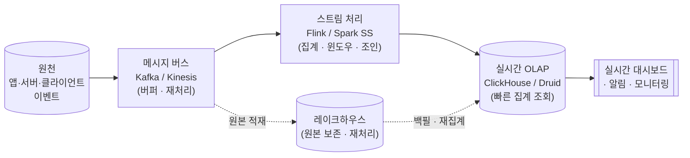

<figure class="post-figure post-figure--header">
<svg role="img" aria-label="네 가지 대표 파이프라인 시나리오가 같은 요구사항 → 설계 → 트레이드오프의 틀을 공유하는 그림: 왼쪽에 실시간 분석, 로그·이벤트, ML 피처, CDC 리포팅이라는 네 사례가 카드로 놓여 있고, 가운데 공통 깔때기를 지나 오른쪽에서 각자 다른 수집·저장·처리·오케스트레이션 조합으로 갈라진다. 같은 질문을 다르게 답하면 다른 파이프라인이 나온다는 점을 보여 준다." viewBox="0 0 680 300" xmlns="http://www.w3.org/2000/svg">
  <title>사례별 파이프라인 설계 — 같은 요구사항 틀, 네 가지 다른 답</title>
  <!-- LEFT: four cases -->
  <text x="78" y="28" text-anchor="middle" font-size="12" fill="currentColor" font-weight="700" opacity="0.75">네 가지 사례</text>
  <g font-size="10" font-weight="700">
    <rect x="16" y="44" width="124" height="42" rx="3" fill="var(--bg-light)" stroke="currentColor" stroke-width="2"/>
    <text x="78" y="62" text-anchor="middle" fill="currentColor">실시간 분석</text>
    <text x="78" y="77" text-anchor="middle" font-size="8" font-weight="400" fill="currentColor" opacity="0.8">초 단위 지연</text>

    <rect x="16" y="96" width="124" height="42" rx="3" fill="var(--bg-light)" stroke="currentColor" stroke-width="2"/>
    <text x="78" y="114" text-anchor="middle" fill="currentColor">로그 · 이벤트</text>
    <text x="78" y="129" text-anchor="middle" font-size="8" font-weight="400" fill="currentColor" opacity="0.8">대용량 · 스키마</text>

    <rect x="16" y="148" width="124" height="42" rx="3" fill="var(--bg-light)" stroke="currentColor" stroke-width="2"/>
    <text x="78" y="166" text-anchor="middle" fill="currentColor">ML 피처</text>
    <text x="78" y="181" text-anchor="middle" font-size="8" font-weight="400" fill="currentColor" opacity="0.8">학습/서빙 일관성</text>

    <rect x="16" y="200" width="124" height="42" rx="3" fill="var(--bg-light)" stroke="currentColor" stroke-width="2"/>
    <text x="78" y="218" text-anchor="middle" fill="currentColor">CDC 리포팅</text>
    <text x="78" y="233" text-anchor="middle" font-size="8" font-weight="400" fill="currentColor" opacity="0.8">DB→DW 동기화</text>
  </g>
  <!-- converging arrows into the shared funnel -->
  <g stroke="var(--secondary-color)" stroke-width="2" opacity="0.85">
    <line x1="140" y1="65" x2="250" y2="128" marker-end="url(#cs-arrow)"/>
    <line x1="140" y1="117" x2="250" y2="138" marker-end="url(#cs-arrow)"/>
    <line x1="140" y1="169" x2="250" y2="152" marker-end="url(#cs-arrow)"/>
    <line x1="140" y1="221" x2="250" y2="162" marker-end="url(#cs-arrow)"/>
  </g>
  <!-- CENTER: shared requirements lens -->
  <rect x="252" y="112" width="150" height="68" rx="4" fill="var(--bg-panel)" stroke="var(--accent-color)" stroke-width="2.5"/>
  <text x="327" y="134" text-anchor="middle" font-size="11" fill="currentColor" font-weight="700">같은 질문</text>
  <text x="327" y="152" text-anchor="middle" font-size="9" fill="currentColor" opacity="0.85">지연 · 정확성 · 규모</text>
  <text x="327" y="168" text-anchor="middle" font-size="9" fill="currentColor" opacity="0.85">→ 설계 → 트레이드오프</text>
  <line x1="402" y1="146" x2="442" y2="146" stroke="var(--secondary-color)" stroke-width="2.5" marker-end="url(#cs-arrow)"/>
  <!-- RIGHT: diverging design choices -->
  <text x="566" y="28" text-anchor="middle" font-size="12" fill="currentColor" font-weight="700" opacity="0.75">네 가지 다른 답</text>
  <g font-size="9.5" font-weight="700">
    <rect x="444" y="48" width="220" height="38" rx="3" fill="var(--bg-light)" stroke="var(--gold)" stroke-width="2"/>
    <text x="554" y="71" text-anchor="middle" fill="currentColor">Kafka → 스트림 처리 → 실시간 OLAP</text>

    <rect x="444" y="94" width="220" height="38" rx="3" fill="var(--bg-light)" stroke="currentColor" stroke-width="2"/>
    <text x="554" y="117" text-anchor="middle" fill="currentColor">수집 → 정제·집계 → 레이크하우스</text>

    <rect x="444" y="140" width="220" height="38" rx="3" fill="var(--bg-light)" stroke="currentColor" stroke-width="2"/>
    <text x="554" y="163" text-anchor="middle" fill="currentColor">오프라인/온라인 피처 스토어</text>

    <rect x="444" y="186" width="220" height="38" rx="3" fill="var(--bg-light)" stroke="currentColor" stroke-width="2"/>
    <text x="554" y="209" text-anchor="middle" fill="currentColor">CDC 로그 → DW → 배치 리포트</text>
  </g>
  <!-- fan-out arrows from the lens -->
  <g stroke="var(--secondary-color)" stroke-width="1.5" opacity="0.7">
    <line x1="402" y1="130" x2="442" y2="68" marker-end="url(#cs-arrow)"/>
    <line x1="402" y1="140" x2="442" y2="113" marker-end="url(#cs-arrow)"/>
    <line x1="402" y1="160" x2="442" y2="159" marker-end="url(#cs-arrow)"/>
    <line x1="402" y1="170" x2="442" y2="205" marker-end="url(#cs-arrow)"/>
  </g>
  <text x="340" y="262" text-anchor="middle" font-size="10" fill="currentColor" opacity="0.7">같은 수명주기를 다른 요구가 다르게 자른다</text>
  <defs>
    <marker id="cs-arrow" markerWidth="8" markerHeight="8" refX="6" refY="4" orient="auto">
      <path d="M0,0 L8,4 L0,8 z" fill="var(--secondary-color)"/>
    </marker>
  </defs>
</svg>
<figcaption>네 가지 대표 파이프라인은 모두 "지연·정확성·규모"라는 같은 질문을 통과하지만, 답이 다르기에 수집·저장·처리·오케스트레이션의 조합도 갈라진다. 도구가 먼저가 아니라 요구사항이 먼저다.</figcaption>
</figure>

## 들어가며

지금까지 이 시리즈는 데이터 엔지니어링의 **부품**을 하나씩 익혀 왔습니다. [수명주기](/2026/06/25/what-is-data-engineering.html)라는 사고의 틀, [ETL→ELT·레이크하우스](/2026/06/25/data-pipeline-history-and-evolution.html)로 이어진 진화의 맥락, 그리고 수집·저장·변환·오케스트레이션·[아키텍처 패턴](/2026/06/25/architecture-patterns.html)까지. 그런데 실무에서 마주하는 질문은 "Kafka를 쓸까 Airflow를 쓸까"가 아니라 **"이 요구사항을 어떻게 충족하는 파이프라인을 설계할까"**입니다. 부품을 아는 것과 부품을 조립해 시스템을 만드는 것은 다른 능력입니다.

이 글은 `Data-Engineering-Essential` 시리즈의 응용 단계로, 현장에서 반복적으로 등장하는 **네 가지 대표 시나리오**를 직접 설계해 봅니다. 각 사례는 일부러 같은 틀로 풀어냅니다 — 먼저 **요구사항(지연·정확성·규모)**을 못 박고, 거기서 **설계(어떤 수집·저장·처리·오케스트레이션을 고르는가)**를 끌어낸 뒤, 그 선택이 치르는 **트레이드오프**를 드러냅니다. 핵심 메시지는 하나입니다 — **도구가 설계를 정하는 게 아니라, 요구사항이 설계를 정하고 설계가 도구를 부른다.**

### 📌 이 글에서 다루는 내용

#### 🔍 핵심 주제

- **실시간 분석 파이프라인**: 이벤트 → 스트림 처리 → 실시간 OLAP(ClickHouse·Druid)으로 초 단위 대시보드 만들기
- **로그·이벤트 파이프라인**: 대용량 로그의 수집·정제·집계와 스키마 관리, 깨지지 않는 이벤트 계약
- **ML 피처 파이프라인**: 피처 스토어와 온라인/오프라인 일관성, training-serving skew 막기
- **CDC 기반 복제 & 배치 리포팅**: 운영 DB → 분석 DW 동기화와 정기 리포트 배치 설계

#### 🎯 왜 중요한가

각 사례를 **요구사항 → 설계 → 트레이드오프**의 동일한 흐름으로 풀면, 새로운 문제를 만나도 "지연은 얼마나 빠듯한가? 정확성은 어느 수준이 필요한가? 규모는 어디까지 가는가?"를 먼저 묻고 거기서 설계를 도출하는 **사고 습관**이 생깁니다. 도구는 그 다음입니다.

## 한눈에 보기 — 대표 실시간 파이프라인의 골격

네 사례 중 가장 부품이 많은 **실시간 분석 파이프라인**을 골격으로 먼저 그려 두면, 나머지 사례가 이 골격을 어떻게 변형·축약하는지 한눈에 들어옵니다. 원천에서 이벤트가 태어나 메시지 버스를 거쳐 스트림 처리기를 지나, 빠른 조회에 최적화된 저장소로 들어가 대시보드로 환원되는 흐름입니다.

이 한 장에 이 글의 핵심 부품이 거의 다 들어 있습니다 — **메시지 버스**가 원천과 처리를 분리하고, **스트림 처리**가 윈도우 집계를 수행하며, **실시간 OLAP**이 빠른 조회를 책임지고, 그 옆에서 **레이크하우스**가 원본을 보존해 재처리(backfill)를 가능케 합니다. 네 사례는 이 골격의 부분집합이거나 변형입니다.

## 사례 1 — 실시간 분석 파이프라인

전자상거래 서비스의 "실시간 운영 대시보드"를 떠올려 봅시다. 분당 거래액, 지역별 활성 사용자, 결제 실패율이 **수 초 지연**으로 갱신되어야 하고, 이상 징후가 보이면 곧장 알림이 떠야 합니다.

### 요구사항 — 지연·정확성·규모

- **지연(Latency)**: 이벤트 발생부터 대시보드 반영까지 **수 초~십수 초**. 야간 배치로는 절대 충족할 수 없습니다.
- **정확성(Accuracy)**: 운영 모니터링 용도라 **근사치라도 충분(approximate)**합니다. 정산·회계처럼 1원도 틀리면 안 되는 수준이 아니라, "지금 추세"를 빠르게 보는 게 목적입니다. 다만 늦게 도착한 이벤트(late-arriving)를 어느 정도 흡수해야 합니다.
- **규모(Scale)**: 초당 수만~수십만 이벤트, 피크 트래픽에서 폭증. 수평 확장이 전제입니다.

### 설계 — 스트림 + 실시간 OLAP

지연 요구가 빠듯하므로 [수집 단계](/2026/06/25/data-ingestion.html)에서 **배치가 아닌 스트리밍**을, 푸시 기반으로 선택합니다. 골격대로 조립하면 다음과 같습니다.

- **수집**: 클라이언트·서버가 이벤트를 **Kafka(또는 Kinesis)**로 푸시합니다. 메시지 버스는 단순한 통로가 아니라 **버퍼**이자 **재처리 가능한 로그**입니다 — 다운스트림이 잠시 느려져도 이벤트가 유실되지 않고, 처리 로직을 고치면 같은 로그를 다시 흘려보내 재집계할 수 있습니다.
- **스트림 처리**: **Apache Flink**(또는 Spark Structured Streaming)가 **이벤트 시간(event-time) 윈도우**로 분당 집계를 계산합니다. 여기서 **워터마크(watermark)**가 핵심입니다 — "이 시점 이후로는 더 늦은 이벤트가 거의 없다"고 판단하는 기준선으로, 늦게 도착한 이벤트를 얼마나 기다렸다가 윈도우를 닫을지를 결정합니다.
- **저장(서빙)**: 집계 결과를 **실시간 OLAP 엔진**에 적재합니다. **ClickHouse**나 **Apache Druid**는 컬럼 지향·대량 삽입·고속 집계 쿼리에 특화되어, 수십억 행 위에서도 대시보드 쿼리를 밀리초~수백 밀리초에 돌려줍니다. 일반 OLTP DB나 무거운 클라우드 DW로는 이 동시 조회 부하와 지연을 맞추기 어렵습니다.
- **오케스트레이션**: 스트리밍 파이프라인은 Airflow 같은 배치 스케줄러로 "돌리는" 대상이 아니라 **상시 가동(long-running)**되는 서비스입니다. 오케스트레이터의 역할은 잡 실행이 아니라 **배포·체크포인트·재시작·모니터링**으로 옮겨갑니다.
- **레이크하우스 병행**: 같은 Kafka 토픽에서 원본 이벤트를 [레이크하우스](/2026/06/25/data-pipeline-history-and-evolution.html)에도 적재해 둡니다. 실시간 경로가 근사치를 빠르게 내는 동안, 배치 경로가 원본에서 **정확한 값을 나중에 재계산**합니다 — 이것이 바로 [Lambda 아키텍처](/2026/06/25/architecture-patterns.html)의 속도 계층/배치 계층 분리입니다. 스트림 처리기가 충분히 정확하다면 Kappa로 단순화할 수도 있습니다.

<figure class="post-figure">
<svg role="img" aria-label="실시간 분석 파이프라인의 아키텍처를 단계별로 그린 그림. 왼쪽에서 앱·서버 이벤트가 메시지 버스(Kafka)로 푸시되고, 버스는 두 갈래로 나뉜다. 위쪽 빠른 경로는 스트림 처리기(Flink)가 이벤트 시간 윈도우와 워터마크로 분당 집계를 계산해 실시간 OLAP(ClickHouse·Druid)에 적재하고, 그 결과가 초 단위로 대시보드와 알림에 반영된다. 아래쪽 느린 경로는 같은 원본 이벤트를 레이크하우스에 보존해 두었다가 배치로 정확한 값을 재계산해 OLAP에 백필한다. 빠른 경로는 근사치를 빠르게, 느린 경로는 정확한 값을 나중에 제공한다." viewBox="0 0 680 320" xmlns="http://www.w3.org/2000/svg">
  <title>실시간 분석 파이프라인 — 빠른 경로(근사·실시간)와 느린 경로(정확·배치)의 분리</title>

  <!-- source -->
  <rect x="20" y="124" width="96" height="64" rx="3" fill="var(--bg-light)" stroke="currentColor" stroke-width="2"/>
  <text x="68" y="150" text-anchor="middle" font-size="10.5" fill="currentColor" font-weight="700">앱 · 서버</text>
  <text x="68" y="166" text-anchor="middle" font-size="9" fill="currentColor" opacity="0.8">이벤트 발생</text>

  <!-- message bus -->
  <line x1="116" y1="156" x2="152" y2="156" stroke="var(--secondary-color)" stroke-width="2.5" marker-end="url(#rt-arrow)"/>
  <rect x="156" y="116" width="104" height="80" rx="3" fill="var(--bg-panel)" stroke="var(--accent-color)" stroke-width="2.5"/>
  <text x="208" y="142" text-anchor="middle" font-size="11" fill="currentColor" font-weight="700">메시지 버스</text>
  <text x="208" y="159" text-anchor="middle" font-size="9" fill="currentColor" opacity="0.85">Kafka / Kinesis</text>
  <text x="208" y="176" text-anchor="middle" font-size="8" fill="currentColor" opacity="0.7">버퍼 · 재처리 로그</text>

  <!-- FAST path (top) -->
  <text x="208" y="44" text-anchor="middle" font-size="10" fill="var(--gold)" font-weight="700">① 빠른 경로 — 근사치를 즉시</text>
  <line x1="240" y1="116" x2="300" y2="84" stroke="var(--secondary-color)" stroke-width="2.5" marker-end="url(#rt-arrow)"/>
  <rect x="304" y="52" width="132" height="64" rx="3" fill="var(--bg-light)" stroke="currentColor" stroke-width="2"/>
  <text x="370" y="76" text-anchor="middle" font-size="10.5" fill="currentColor" font-weight="700">스트림 처리</text>
  <text x="370" y="92" text-anchor="middle" font-size="8.5" fill="currentColor" opacity="0.85">Flink · 윈도우</text>
  <text x="370" y="106" text-anchor="middle" font-size="8.5" fill="currentColor" opacity="0.85">워터마크</text>
  <line x1="436" y1="84" x2="476" y2="84" stroke="var(--secondary-color)" stroke-width="2.5" marker-end="url(#rt-arrow)"/>
  <rect x="480" y="52" width="120" height="64" rx="3" fill="var(--bg-light)" stroke="var(--gold)" stroke-width="2.5"/>
  <text x="540" y="78" text-anchor="middle" font-size="10.5" fill="currentColor" font-weight="700">실시간 OLAP</text>
  <text x="540" y="94" text-anchor="middle" font-size="8.5" fill="currentColor" opacity="0.85">ClickHouse</text>
  <text x="540" y="107" text-anchor="middle" font-size="8.5" fill="currentColor" opacity="0.85">Druid</text>

  <!-- SLOW path (bottom) -->
  <text x="208" y="292" text-anchor="middle" font-size="10" fill="currentColor" opacity="0.7" font-weight="700">② 느린 경로 — 정확한 값을 나중에</text>
  <line x1="240" y1="196" x2="300" y2="232" stroke="currentColor" stroke-width="2" stroke-dasharray="3 3" marker-end="url(#rt-arrow-d)"/>
  <rect x="304" y="208" width="132" height="56" rx="3" fill="var(--bg-light)" stroke="currentColor" stroke-width="2"/>
  <text x="370" y="232" text-anchor="middle" font-size="10.5" fill="currentColor" font-weight="700">레이크하우스</text>
  <text x="370" y="248" text-anchor="middle" font-size="8.5" fill="currentColor" opacity="0.8">원본 보존 · 배치 재계산</text>
  <line x1="436" y1="236" x2="510" y2="236" stroke="currentColor" stroke-width="2" stroke-dasharray="3 3" marker-end="url(#rt-arrow-d)"/>
  <text x="476" y="226" text-anchor="middle" font-size="8.5" fill="currentColor" opacity="0.7">백필</text>
  <!-- backfill curves up into OLAP -->
  <path d="M540,208 C540,180 540,150 540,118" fill="none" stroke="currentColor" stroke-width="1.5" stroke-dasharray="2 4" opacity="0.6" marker-end="url(#rt-arrow-d)"/>

  <!-- serving -->
  <line x1="600" y1="84" x2="636" y2="84" stroke="var(--secondary-color)" stroke-width="2.5" marker-end="url(#rt-arrow)"/>
  <rect x="612" y="52" width="60" height="64" rx="3" fill="var(--bg-panel)" stroke="currentColor" stroke-width="2"/>
  <text x="642" y="80" text-anchor="middle" font-size="9.5" fill="currentColor" font-weight="700">대시</text>
  <text x="642" y="94" text-anchor="middle" font-size="9.5" fill="currentColor" font-weight="700">보드</text>
  <text x="642" y="108" text-anchor="middle" font-size="8" fill="currentColor" opacity="0.75">· 알림</text>

  <defs>
    <marker id="rt-arrow" markerWidth="8" markerHeight="8" refX="6" refY="4" orient="auto">
      <path d="M0,0 L8,4 L0,8 z" fill="var(--secondary-color)"/>
    </marker>
    <marker id="rt-arrow-d" markerWidth="8" markerHeight="8" refX="6" refY="4" orient="auto">
      <path d="M0,0 L8,4 L0,8 z" fill="currentColor"/>
    </marker>
  </defs>
</svg>
<figcaption>실시간 분석은 같은 이벤트 스트림을 두 경로로 가른다 — 빠른 경로(Flink → 실시간 OLAP)는 근사치를 초 단위로 내고, 느린 경로(레이크하우스 → 배치 재계산)는 원본에서 정확한 값을 구해 OLAP을 백필한다. Lambda 아키텍처의 속도/배치 계층이 그대로 드러난다.</figcaption>
</figure>

### 트레이드오프

- **복잡성 vs 신선도**: 스트리밍 + 실시간 OLAP은 배치 대비 운영 복잡도가 크게 올라갑니다(상태 관리, 워터마크 튜닝, 정확히 한 번 보장). 초 단위 신선도가 정말 필요한지부터 자문해야 합니다 — 5분 지연으로 충분하다면 마이크로배치가 훨씬 싸고 단순합니다.
- **근사 vs 정확**: 실시간 경로는 늦게 온 이벤트를 일부 놓치거나 중복 계산할 수 있습니다. 이를 받아들이는 대신 배치 경로로 보정하느냐(Lambda), 스트림 처리기의 정확히 한 번 의미론을 신뢰해 단일 경로로 가느냐(Kappa)가 큰 갈림길입니다.
- **비용**: 실시간 OLAP과 상시 가동 스트림 클러스터는 야간 배치보다 비쌉니다. "모니터링용 근사치"라는 정확성 완화가 이 비용을 정당화하는 근거입니다.

## 사례 2 — 로그·이벤트 파이프라인

이번엔 수십 개 마이크로서비스가 쏟아내는 **애플리케이션·서버 로그와 행동 이벤트**를 모아, 디버깅·집계·분석에 쓸 수 있게 만드는 파이프라인입니다. 사례 1과 부품은 비슷하지만 **요구사항의 무게중심이 다릅니다** — 실시간성보다 **대용량 처리, 스키마 관리, 비용**이 전면에 옵니다.

### 요구사항 — 지연·정확성·규모

- **지연**: 대부분 **분 단위면 충분**합니다. 로그 분석은 보통 "방금 막"이 아니라 "최근 몇 분~몇 시간"을 봅니다. 실시간 모니터링이 일부 필요해도 핵심 부하는 준실시간/배치입니다.
- **정확성**: **유실 최소화가 중요**하지만(특히 과금·감사 관련 이벤트), 완벽한 순서 보장까지는 대개 불필요합니다. 핵심은 **스키마가 깨지지 않는 것** — 원천 서비스가 필드를 바꾸면 다운스트림 집계가 조용히 망가집니다.
- **규모**: 가장 큰 변수입니다. **하루 수 TB**의 로그가 쏟아질 수 있어, 비용 효율적인 대용량 저장·처리가 설계를 지배합니다.

### 설계 — 수집·정제·집계와 스키마 계약

- **수집**: 각 서비스에 로그 수집기(예: Fluent Bit·Vector)를 붙여 **Kafka**로 흘려보냅니다. 메시지 버스를 두는 이유는 사례 1과 같습니다 — 폭증하는 로그의 **버퍼** 역할, 그리고 여러 다운스트림(검색·분석·아카이브)이 같은 스트림을 각자 구독하게 만드는 **팬아웃**입니다.
- **스키마 관리**: 이 사례의 핵심입니다. 이벤트를 **Avro/Protobuf** 같은 스키마 포맷으로 직렬화하고 **스키마 레지스트리(Schema Registry)**로 버전을 관리합니다. 생산자와 소비자 사이에 **스키마 = 계약**을 세우고, **호환성 규칙(예: backward-compatible 변경만 허용)**을 강제하면, 원천의 무심한 필드 변경이 다운스트림을 깨뜨리는 사고를 막을 수 있습니다.
- **저장 & 변환**: 원본 로그는 [메달리온 아키텍처](/2026/06/25/architecture-patterns.html)의 **Bronze(원본)** 레이어로 레이크하우스에 값싸게 적재합니다. 그 위에서 정제·표준화한 **Silver**, 비즈니스 집계인 **Gold**로 다듬습니다. 원본을 보존하므로 집계 로직이 바뀌어도 [ELT](/2026/06/25/data-pipeline-history-and-evolution.html)답게 다시 변환하면 됩니다. 검색·트러블슈팅용으로는 별도로 OpenSearch 같은 엔진에 일부를 색인합니다.
- **오케스트레이션 & 파티셔닝**: 집계 잡은 **Airflow/Dagster**로 시간 파티션(예: 시간별·일별) 단위로 스케줄링합니다. 대용량의 열쇠는 **파티셔닝**입니다 — 날짜/시간으로 파티션을 나눠 두면 쿼리가 필요한 구간만 스캔하고(partition pruning), 비용과 시간이 데이터 전체가 아니라 관심 구간에 비례하게 됩니다.

### 트레이드오프

- **유연성 vs 거버넌스**: 스키마 레지스트리는 사고를 막아 주지만, 모든 이벤트에 스키마 계약을 강제하면 빠르게 움직이는 팀에는 마찰이 됩니다. 호환성 정책을 너무 느슨하게 하면 데이터 늪, 너무 빡빡하게 하면 개발 속도 저하 — 그 사이에서 균형점을 잡아야 합니다.
- **저장 비용 vs 보존**: "일단 다 저장"은 매력적이지만 TB 단위 로그는 비용이 됩니다. 핫(최근, 빠른 조회)/콜드(과거, 아카이브) 계층 분리와 **보존 기간(retention) 정책**이 필수입니다.
- **순서·정확히 한 번**: 완벽한 순서·중복 제거를 요구할수록 처리가 무거워집니다. 로그 분석에서는 대개 "거의 정확"으로 충분하다는 점을 활용해 설계를 단순화합니다.

## 사례 3 — ML 피처 파이프라인

머신러닝 모델은 결국 **피처(feature)**를 먹고 자랍니다. 추천·이상탐지·랭킹 모델을 운영하려면, 학습에 쓸 피처와 실시간 추론에 쓸 피처를 모두 안정적으로 공급해야 합니다. 이 사례의 고유한 어려움은 **같은 피처를 두 세계(학습·서빙)에서 일관되게 제공**하는 것입니다.

### 요구사항 — 지연·정확성·규모

- **지연**: **이중적**입니다. 학습용 피처는 배치(시간~일 단위)면 되지만, 추론용 피처는 요청 시점에 **수~수십 밀리초** 안에 조회되어야 합니다.
- **정확성**: 가장 까다로운 요구입니다. **학습 때 본 피처와 서빙 때 보는 피처가 같은 정의로 계산**되어야 합니다. 둘이 어긋나면 **training-serving skew**가 생겨, 오프라인 평가는 좋은데 실서비스 성능이 떨어지는 전형적 함정에 빠집니다. 또한 학습 데이터에는 **미래 정보가 새지 않아야**(point-in-time correctness) 합니다.
- **규모**: 학습은 수억 행의 과거 데이터를 한 번에 처리하는 대용량 배치, 서빙은 초당 수천~수만 건의 저지연 점 조회 — 부하 성격이 완전히 다릅니다.

### 설계 — 피처 스토어와 온라인/오프라인 분리

지연과 부하 성격이 양극단이므로, 저장을 **두 종류로 분리**하는 것이 자연스러운 답입니다. 이것이 **피처 스토어(Feature Store)**(예: Feast)의 핵심 발상입니다.

- **피처 정의의 단일화**: 피처를 계산하는 **로직을 한 곳에서 정의**하고, 그 정의로 오프라인·온라인 양쪽을 채웁니다. 같은 정의에서 두 저장소를 채우는 것이 skew를 막는 근본 장치입니다.
- **오프라인 스토어(Offline Store)**: 과거 전체 피처를 보관하는 대용량 저장소(레이크하우스·DW). 학습 데이터셋 생성과 **point-in-time 조인**에 쓰입니다 — "이 라벨이 만들어진 그 시점에 알 수 있었던 피처 값"만 가져와 미래 정보 누수를 막습니다.
- **온라인 스토어(Online Store)**: 추론 시 저지연 조회를 위한 키-값 저장소(Redis·DynamoDB 등). **가장 최신 피처 값**만 들고 있어 밀리초 조회를 보장합니다.
- **수집·변환의 두 경로**: 배치 변환(Spark/dbt)이 오프라인 스토어를 채우고 온라인 스토어로 **물질화(materialize)**합니다. 실시간 피처(예: "최근 5분 클릭 수")가 필요하면 사례 1의 스트림 처리(Flink)가 온라인 스토어를 직접 갱신합니다.
- **오케스트레이션**: Airflow/Dagster가 피처 백필·물질화·데이터 검증을 주기적으로 돌리고, 피처 신선도(staleness)를 모니터링합니다.

<figure class="post-figure">
<svg role="img" aria-label="피처 스토어의 온라인/오프라인 분리를 그린 그림. 가운데 위에 하나의 피처 정의가 있고, 거기서 두 갈래로 같은 로직이 흘러내려 두 저장소를 채운다. 왼쪽 오프라인 스토어(레이크하우스·DW)는 과거 전체 피처를 담아 학습 데이터셋을 point-in-time 조인으로 만들고, 오른쪽 온라인 스토어(Redis·DynamoDB)는 최신 피처만 담아 추론 시 밀리초 조회를 제공한다. 한 정의에서 양쪽을 채우기 때문에 학습과 서빙이 어긋나는 training-serving skew를 막는다." viewBox="0 0 660 350" xmlns="http://www.w3.org/2000/svg">
  <title>피처 스토어 — 하나의 피처 정의가 오프라인·온라인 두 스토어를 채워 skew를 막는다</title>

  <!-- single feature definition (top center) -->
  <rect x="226" y="28" width="208" height="58" rx="4" fill="var(--bg-panel)" stroke="var(--accent-color)" stroke-width="2.5"/>
  <text x="330" y="52" text-anchor="middle" font-size="12" fill="currentColor" font-weight="700">하나의 피처 정의</text>
  <text x="330" y="70" text-anchor="middle" font-size="9" fill="currentColor" opacity="0.85">계산 로직을 한 곳에서 — skew 방지의 핵심</text>

  <!-- split arrows -->
  <line x1="280" y1="86" x2="170" y2="128" stroke="var(--secondary-color)" stroke-width="2.5" marker-end="url(#fs-arrow)"/>
  <line x1="380" y1="86" x2="490" y2="128" stroke="var(--secondary-color)" stroke-width="2.5" marker-end="url(#fs-arrow)"/>
  <text x="208" y="110" text-anchor="middle" font-size="9" fill="currentColor" opacity="0.7">배치 물질화</text>
  <text x="452" y="110" text-anchor="middle" font-size="9" fill="currentColor" opacity="0.7">물질화 / 스트림 갱신</text>

  <!-- OFFLINE store (left) -->
  <rect x="48" y="132" width="244" height="120" rx="3" fill="var(--bg-light)" stroke="currentColor" stroke-width="2"/>
  <text x="170" y="156" text-anchor="middle" font-size="11.5" fill="currentColor" font-weight="700">오프라인 스토어</text>
  <text x="170" y="173" text-anchor="middle" font-size="9" fill="currentColor" opacity="0.8">레이크하우스 · DW</text>
  <text x="170" y="196" text-anchor="middle" font-size="9.5" fill="currentColor" opacity="0.9">과거 전체 피처 보관</text>
  <text x="170" y="214" text-anchor="middle" font-size="9.5" fill="currentColor" opacity="0.9">point-in-time 조인</text>
  <text x="170" y="236" text-anchor="middle" font-size="8.5" fill="currentColor" opacity="0.7">대용량 배치 · 미래 누수 차단</text>

  <!-- ONLINE store (right) -->
  <rect x="368" y="132" width="244" height="120" rx="3" fill="var(--bg-light)" stroke="var(--gold)" stroke-width="2.5"/>
  <text x="490" y="156" text-anchor="middle" font-size="11.5" fill="currentColor" font-weight="700">온라인 스토어</text>
  <text x="490" y="173" text-anchor="middle" font-size="9" fill="currentColor" opacity="0.8">Redis · DynamoDB</text>
  <text x="490" y="196" text-anchor="middle" font-size="9.5" fill="currentColor" opacity="0.9">최신 피처 값만 보관</text>
  <text x="490" y="214" text-anchor="middle" font-size="9.5" fill="currentColor" opacity="0.9">밀리초 점 조회</text>
  <text x="490" y="236" text-anchor="middle" font-size="8.5" fill="currentColor" opacity="0.7">저지연 · 고동시성</text>

  <!-- consumers -->
  <line x1="170" y1="252" x2="170" y2="288" stroke="var(--secondary-color)" stroke-width="2.5" marker-end="url(#fs-arrow)"/>
  <rect x="62" y="292" width="216" height="46" rx="3" fill="var(--bg-panel)" stroke="currentColor" stroke-width="2"/>
  <text x="170" y="312" text-anchor="middle" font-size="10.5" fill="currentColor" font-weight="700">모델 학습 (오프라인)</text>
  <text x="170" y="328" text-anchor="middle" font-size="8.5" fill="currentColor" opacity="0.8">학습 데이터셋 생성</text>

  <line x1="490" y1="252" x2="490" y2="288" stroke="var(--secondary-color)" stroke-width="2.5" marker-end="url(#fs-arrow)"/>
  <rect x="382" y="292" width="216" height="46" rx="3" fill="var(--bg-panel)" stroke="currentColor" stroke-width="2"/>
  <text x="490" y="312" text-anchor="middle" font-size="10.5" fill="currentColor" font-weight="700">실시간 추론 (서빙)</text>
  <text x="490" y="328" text-anchor="middle" font-size="8.5" fill="currentColor" opacity="0.8">요청 시 피처 조회</text>

  <!-- consistency tie between the two stores -->
  <path d="M292,200 C320,200 340,200 368,200" fill="none" stroke="var(--gold)" stroke-width="1.5" stroke-dasharray="3 4" opacity="0.7"/>
  <text x="330" y="194" text-anchor="middle" font-size="8.5" fill="var(--gold)" font-weight="700">같은 정의 = 일관</text>

  <defs>
    <marker id="fs-arrow" markerWidth="8" markerHeight="8" refX="6" refY="4" orient="auto">
      <path d="M0,0 L8,4 L0,8 z" fill="var(--secondary-color)"/>
    </marker>
  </defs>
</svg>
<figcaption>피처 스토어는 하나의 피처 정의에서 두 저장소를 채운다 — 오프라인 스토어(과거 전체 · point-in-time 조인)는 학습을, 온라인 스토어(최신 값 · 밀리초 조회)는 서빙을 맡는다. 한 정의로 양쪽을 채우는 것이 학습과 서빙이 어긋나는 training-serving skew를 막는 핵심 장치다.</figcaption>
</figure>

### 트레이드오프

- **신선도 vs 비용·복잡성**: 실시간 피처(스트림으로 온라인 스토어를 즉시 갱신)는 정확하지만 사례 1의 스트리밍 복잡성을 그대로 떠안습니다. 많은 피처는 배치 물질화로 충분하니, **어떤 피처에만 실시간이 필요한지**를 가려야 합니다.
- **이중 저장의 운영 부담**: 오프라인/온라인 두 저장소를 유지·동기화하는 비용이 듭니다. 작은 조직이라면 피처 스토어를 풀 도입하기보다, 단순한 배치 테이블 + 캐시로 시작해 필요할 때 키워 가는 편이 적정 기술입니다.
- **올바름의 어려움**: point-in-time correctness와 skew 방지는 개념적으로 까다롭고, 틀려도 시스템은 멀쩡히 돌아가며 **모델 성능으로만 조용히 드러납니다**. 그래서 피처 검증·모니터링이라는 데이터 품질 관심사가 특히 중요합니다.

## 사례 4 — CDC 기반 복제 & 배치 리포팅

마지막은 가장 고전적이면서도 여전히 흔한 시나리오입니다 — **운영 DB(OLTP)의 데이터를 분석 DW로 가져와 정기 리포트를 만드는** 일. 매출·정산·KPI 리포트가 여기 해당합니다. 사례 1~3이 "새로 발생하는 이벤트"를 다뤘다면, 이 사례는 **이미 운영 DB 안에 있는, 계속 바뀌는 상태(state)**를 어떻게 분석계로 옮기느냐가 관건입니다.

### 요구사항 — 지연·정확성·규모

- **지연**: 리포트는 보통 **시간~일 단위**면 충분합니다. "어제까지의 정확한 수치"가 핵심이지 초 단위 신선도가 아닙니다.
- **정확성**: 가장 엄격합니다. 정산·회계용이라면 **단 한 건의 누락·중복도 허용되지 않습니다**. 운영 DB와 DW의 수치가 정확히 일치해야 하고, 삭제·수정도 빠짐없이 반영되어야 합니다.
- **규모**: 테이블이 수억 행이라도 **매번 전체를 복사(full load)하는 것은 비효율**입니다. 바뀐 부분만 효율적으로 옮기는 증분(incremental) 방식이 필요합니다.

### 설계 — CDC로 동기화하고 배치로 리포트

전체 재적재는 부담이고 그렇다고 주기적 쿼리(타임스탬프 기반 풀)는 **삭제(delete)를 놓치고** 운영 DB에 부하를 줍니다. 그래서 **CDC(Change Data Capture)**가 정석입니다.

- **수집 — CDC**: [수집 단계](/2026/06/25/data-ingestion.html)에서 배운 CDC를 **로그 기반(log-based)**으로 적용합니다. **Debezium** 같은 도구가 DB의 트랜잭션 로그(MySQL binlog, PostgreSQL WAL)를 읽어 INSERT/UPDATE/**DELETE**를 모두 이벤트로 포착합니다. 운영 DB에 쿼리 부하를 거의 주지 않으면서 삭제까지 정확히 잡는 것이 로그 기반 CDC의 결정적 장점입니다. 변경 이벤트는 **Kafka**로 흘려보냅니다.
- **저장 — 원본 변경 로그 보존**: 변경 이벤트를 레이크하우스의 **Bronze**에 append-only로 쌓습니다. 이 변경 스트림 자체가 감사 추적(audit trail)이 됩니다.
- **변환 — 변경 로그를 현재 상태로**: Bronze의 변경 이벤트들을 정리해 "현재 시점의 테이블 상태"를 만듭니다. 같은 키의 여러 변경 중 **최신만 남기는 upsert/merge**(레이크하우스 테이블 포맷의 ACID·merge 기능이 여기서 빛납니다)로 운영 DB를 거울처럼 복제하고, 필요하면 SCD(Slowly Changing Dimensions) 방식으로 이력까지 보존합니다.
- **리포팅 — 배치**: 복제된 테이블 위에서 **dbt** 모델이 비즈니스 집계(Gold)를 계산하고, **Airflow**가 매일 정해진 시각에 "CDC 머지 → 변환 → 리포트 갱신 → 검증"을 의존성 순서대로 실행합니다. 배치 오케스트레이션의 전형적 무대입니다.

### 트레이드오프

- **CDC vs 단순 배치 추출**: 로그 기반 CDC는 삭제 포착·저부하·준실시간이라는 큰 이점이 있지만, 트랜잭션 로그 접근 권한·커넥터 운영·스키마 변경 대응이라는 운영 부담이 따릅니다. 테이블이 작고 삭제가 드물다면 그냥 **타임스탬프 기반 증분 풀**이 훨씬 단순하고 충분합니다 — 적정 기술의 판단이 또 등장합니다.
- **정확성의 비용**: "단 한 건도 틀리면 안 된다"는 요구는 멱등(idempotent) 머지, 재처리 안전성, 행 수 대조 같은 **검증 장치**를 강제합니다. 정확성은 공짜가 아니라 설계와 운영으로 사야 합니다.
- **신선도 vs 단순성**: CDC는 준실시간 동기화도 가능하지만, 리포트가 일 배치로 충분하다면 굳이 실시간으로 머지할 필요가 없습니다. 요구되는 신선도에 맞춰 머지 주기를 정하는 것이 비용을 아끼는 길입니다.

## 정리

네 사례를 같은 틀로 풀고 나면, 표면의 다양함 아래 흐르는 공통의 사고법이 또렷해집니다.

| 사례 | 지연 | 정확성 | 핵심 설계 선택 |
| --- | --- | --- | --- |
| **실시간 분석** | 초 단위 | 근사 허용 | 스트림 처리 + 실시간 OLAP, (선택) Lambda 보정 |
| **로그·이벤트** | 분 단위 | 유실 최소·스키마 안정 | 메시지 버스 + 스키마 레지스트리 + 메달리온 |
| **ML 피처** | 이중(배치+ms) | skew·미래 누수 차단 | 피처 스토어의 오프라인/온라인 분리 |
| **CDC 리포팅** | 시간~일 | 무결성 최우선 | 로그 기반 CDC + ACID merge + 배치 리포트 |

가장 중요한 교훈 세 가지로 정리합니다.

- **요구사항이 설계를, 설계가 도구를 부른다.** 같은 부품(Kafka·레이크하우스·스트림 처리·오케스트레이터)도 지연·정확성·규모 요구가 다르면 전혀 다르게 조립됩니다. "무엇을 쓸까"가 아니라 "무엇이 필요한가"에서 출발하세요.
- **정확성은 공짜가 아니다.** 근사로 충분한가, 단 한 건도 틀리면 안 되는가에 따라 설계 복잡도와 비용이 크게 갈립니다. 정확성을 완화할 수 있는 곳에서는 과감히 완화해 단순함과 비용을 얻으세요.
- **적정 기술을 고르라.** 실시간 OLAP·피처 스토어·로그 기반 CDC는 강력하지만 그만큼 무겁습니다. 요구가 그것을 정당화할 때만 도입하고, 그렇지 않다면 마이크로배치·캐시·타임스탬프 증분 같은 단순한 답에서 시작하는 것이 좋은 엔지니어링입니다.

이 네 골격은 현장에서 만날 대부분의 파이프라인의 변형 원형입니다. 다음 글에서는 이렇게 설계한 파이프라인이 **실제로 믿을 만한지**를 보장하는 데이터 품질·거버넌스·관측가능성을 다룹니다.

### 다음 학습 (Next Learning)

- [Data Engineering Essential Curriculum](/2026/06/25/data-engineering-essential-curriculum.html) — 전체 로드맵으로 돌아가 진행 상황 확인하기
- [데이터 아키텍처 패턴: Lambda·Kappa·Medallion·Data Mesh](/2026/06/25/architecture-patterns.html) — 이 글이 조립한 패턴들의 원리 복습
- [데이터 품질·거버넌스·관측가능성: 믿을 수 있는 데이터 만들기](/2026/06/25/data-quality-governance.html) — 설계한 파이프라인을 신뢰할 수 있게 만들기
