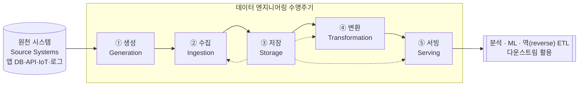

<figure class="post-figure post-figure--header">
<svg role="img" aria-label="데이터 엔지니어링의 핵심을 한 장으로 표현한 그림: 왼쪽의 흩어진 원천 데이터(앱 DB·API·IoT·로그)가 생성→수집→저장→변환→서빙의 다섯 단계 파이프라인을 통과하며 점점 정돈되고, 마지막에는 분석·ML·역 ETL로 쓰이는 가치로 환원된다." viewBox="0 0 660 280" xmlns="http://www.w3.org/2000/svg">
  <title>데이터 엔지니어링 — 흩어진 원천 데이터가 수명주기 파이프라인을 지나 가치로 환원된다</title>
  <!-- LEFT: scattered raw data -->
  <text x="64" y="32" text-anchor="middle" font-size="13" fill="currentColor" font-weight="700" opacity="0.75">원천 데이터</text>
  <rect x="20" y="58" width="22" height="22" rx="2" fill="none" stroke="currentColor" stroke-width="2" transform="rotate(-12 31 69)"/>
  <circle cx="78" cy="64" r="11" fill="none" stroke="currentColor" stroke-width="2"/>
  <rect x="30" y="108" width="20" height="20" rx="2" fill="none" stroke="currentColor" stroke-width="2" transform="rotate(18 40 118)"/>
  <path d="M70,108 l13,8 l-13,8 l-13,-8 z" fill="none" stroke="currentColor" stroke-width="2"/>
  <circle cx="42" cy="160" r="9" fill="none" stroke="currentColor" stroke-width="2"/>
  <rect x="66" y="150" width="20" height="20" rx="2" fill="none" stroke="currentColor" stroke-width="2" transform="rotate(-22 76 160)"/>
  <text x="56" y="206" text-anchor="middle" font-size="10" fill="currentColor" opacity="0.7">앱 DB · API</text>
  <text x="56" y="220" text-anchor="middle" font-size="10" fill="currentColor" opacity="0.7">IoT · 로그</text>
  <!-- intake arrow -->
  <line x1="98" y1="118" x2="138" y2="118" stroke="var(--secondary-color)" stroke-width="2.5" marker-end="url(#de-arrow)"/>
  <!-- PIPELINE: five stages, progressively more ordered -->
  <text x="378" y="32" text-anchor="middle" font-size="13" fill="currentColor" font-weight="700" opacity="0.75">데이터 엔지니어링 수명주기</text>
  <g font-size="11" font-weight="700">
    <rect x="146" y="92" width="78" height="52" rx="3" fill="var(--bg-light)" stroke="currentColor" stroke-width="2"/>
    <text x="185" y="115" text-anchor="middle" fill="currentColor">① 생성</text>
    <text x="185" y="131" text-anchor="middle" font-size="9" font-weight="400" fill="currentColor" opacity="0.8">Generation</text>

    <rect x="240" y="92" width="78" height="52" rx="3" fill="var(--bg-light)" stroke="currentColor" stroke-width="2"/>
    <text x="279" y="115" text-anchor="middle" fill="currentColor">② 수집</text>
    <text x="279" y="131" text-anchor="middle" font-size="9" font-weight="400" fill="currentColor" opacity="0.8">Ingestion</text>

    <rect x="334" y="84" width="78" height="68" rx="3" fill="var(--bg-light)" stroke="var(--accent-color)" stroke-width="2.5"/>
    <text x="373" y="113" text-anchor="middle" fill="currentColor">③ 저장</text>
    <text x="373" y="129" text-anchor="middle" font-size="9" font-weight="400" fill="currentColor" opacity="0.8">Storage</text>
    <text x="373" y="143" text-anchor="middle" font-size="8" font-weight="400" fill="currentColor" opacity="0.7">기반</text>

    <rect x="428" y="92" width="78" height="52" rx="3" fill="var(--bg-light)" stroke="currentColor" stroke-width="2"/>
    <text x="467" y="115" text-anchor="middle" fill="currentColor">④ 변환</text>
    <text x="467" y="131" text-anchor="middle" font-size="9" font-weight="400" fill="currentColor" opacity="0.8">Transform</text>

    <rect x="522" y="92" width="78" height="52" rx="3" fill="var(--bg-light)" stroke="currentColor" stroke-width="2"/>
    <text x="561" y="115" text-anchor="middle" fill="currentColor">⑤ 서빙</text>
    <text x="561" y="131" text-anchor="middle" font-size="9" font-weight="400" fill="currentColor" opacity="0.8">Serving</text>
  </g>
  <!-- flow arrows between stages -->
  <g stroke="var(--secondary-color)" stroke-width="2.5">
    <line x1="226" y1="118" x2="238" y2="118" marker-end="url(#de-arrow)"/>
    <line x1="320" y1="118" x2="332" y2="118" marker-end="url(#de-arrow)"/>
    <line x1="414" y1="118" x2="426" y2="118" marker-end="url(#de-arrow)"/>
    <line x1="508" y1="118" x2="520" y2="118" marker-end="url(#de-arrow)"/>
  </g>
  <!-- storage as the central base: dashed ties to ingestion / transform / serving -->
  <g stroke="var(--accent-color)" stroke-width="1.5" stroke-dasharray="3 4" opacity="0.7" fill="none">
    <path d="M373,152 C373,172 279,164 279,144"/>
    <path d="M373,152 C373,176 467,168 467,144"/>
    <path d="M373,152 C373,182 561,176 561,144"/>
  </g>
  <!-- output arrow -->
  <line x1="600" y1="170" x2="600" y2="200" stroke="var(--secondary-color)" stroke-width="2.5" marker-end="url(#de-arrow)"/>
  <!-- VALUE: ordered, usable output -->
  <rect x="470" y="206" width="180" height="56" rx="4" fill="var(--bg-panel)" stroke="var(--gold)" stroke-width="2.5"/>
  <text x="560" y="230" text-anchor="middle" font-size="12" fill="currentColor" font-weight="700">가치로 환원</text>
  <text x="560" y="248" text-anchor="middle" font-size="10" fill="currentColor" opacity="0.85">분석 · ML · 역 ETL</text>
  <!-- caption tie under the pipeline: ordered grid (data is now clean) -->
  <g stroke="currentColor" stroke-width="1.5" opacity="0.45">
    <rect x="150" y="216" width="14" height="14" rx="2" fill="none"/>
    <rect x="170" y="216" width="14" height="14" rx="2" fill="none"/>
    <rect x="190" y="216" width="14" height="14" rx="2" fill="none"/>
    <rect x="150" y="236" width="14" height="14" rx="2" fill="none"/>
    <rect x="170" y="236" width="14" height="14" rx="2" fill="none"/>
    <rect x="190" y="236" width="14" height="14" rx="2" fill="none"/>
  </g>
  <text x="240" y="231" text-anchor="start" font-size="10" fill="currentColor" opacity="0.7">흩어진 원천이</text>
  <text x="240" y="247" text-anchor="start" font-size="10" fill="currentColor" opacity="0.7">정돈된 데이터로</text>
  <defs>
    <marker id="de-arrow" markerWidth="8" markerHeight="8" refX="6" refY="4" orient="auto">
      <path d="M0,0 L8,4 L0,8 z" fill="var(--secondary-color)"/>
    </marker>
  </defs>
</svg>
<figcaption>데이터 엔지니어링의 한 장 요약 — 흩어진 원천 데이터가 생성→수집→저장→변환→서빙의 수명주기를 지나며 정돈되고, 마침내 분석·ML·역 ETL로 쓰이는 가치로 환원된다. 가운데 저장(③)이 수집·변환·서빙 모두와 맞닿은 기반이라는 점에 주목.</figcaption>
</figure>

## 들어가며

"데이터가 새로운 석유"라는 말은 익숙하지만, 정작 그 원유를 캐서 정제하고 송유관으로 흘려보내는 일을 누가 하는지는 잘 이야기되지 않습니다. 대시보드의 숫자, 추천 모델의 예측, A/B 테스트의 결과는 모두 **누군가 미리 데이터를 모으고, 쌓고, 다듬어 적시에 흘려보냈기 때문에** 가능합니다. 그 토대를 책임지는 분야가 바로 **데이터 엔지니어링(Data Engineering)**입니다.

이 글은 `Data-Engineering-Essential` 시리즈의 1단계로, 분야 전체의 **지도**를 그리는 것을 목표로 합니다. 데이터 엔지니어링이 정확히 무엇이고, 데이터 엔지니어가 분석가·사이언티스트와 어떻게 다른지, 그리고 앞으로 만날 모든 기술을 정리하는 틀이 될 **데이터 엔지니어링 수명주기(Data Engineering Lifecycle)**를 익힙니다.

### 📌 이 글에서 다루는 내용

#### 🔍 핵심 주제

- **데이터 엔지니어링의 정의**: 무엇을 책임지는 분야이며, 왜 별도의 직무로 자리 잡았는가
- **역할 구분**: 데이터 엔지니어 vs 데이터 분석가 vs 데이터 사이언티스트
- **데이터 엔지니어링 수명주기**: 생성→수집→저장→변환→서빙이라는 사고의 틀
- **저류(Undercurrents)**: 수명주기 전체를 떠받치는 6가지 횡단 관심사

#### 🎯 왜 중요한가

개별 도구(Kafka, Spark, Airflow…)는 빠르게 바뀌지만, **수명주기라는 사고의 틀**은 오래 갑니다. 새 기술을 만날 때마다 "이건 수명주기의 어느 칸을 푸는가?"라고 물을 수 있으면, 도구의 홍수 속에서도 길을 잃지 않습니다.

## 데이터 엔지니어링이란 무엇인가

데이터 엔지니어링을 한 문장으로 정의하면 다음과 같습니다.

> **데이터 엔지니어링은 원천 데이터를 받아 분석·머신러닝 등 다운스트림(downstream)에서 곧바로 쓸 수 있는 고품질·일관된 정보로 바꾸는 시스템과 프로세스를 설계·구축·운영하는 일이다.**

여기서 핵심은 "시스템과 프로세스"입니다. 데이터 엔지니어는 일회성으로 데이터를 한 번 옮기는 사람이 아니라, **매일·매시간 자동으로 데이터가 흐르도록 만드는 파이프라인을 만드는 사람**입니다. 분석가가 신뢰할 수 있는 테이블을 조회하고, 사이언티스트가 깨끗한 학습 데이터를 받고, 서비스가 실시간 집계를 사용할 수 있는 것은 그 아래에서 파이프라인이 묵묵히 돌고 있기 때문입니다.

이 분야가 독립된 직무로 부상한 이유는 데이터의 **규모(Volume)·속도(Velocity)·다양성(Variety)**이 폭발하면서, "분석"과 "데이터를 분석 가능한 상태로 만드는 일"이 더 이상 한 사람의 일로 묶이기 어려워졌기 때문입니다. 테라바이트 단위의 데이터를 분산 시스템으로 처리하고, 수십 개의 원천을 안정적으로 통합하며, 장애에도 데이터가 유실되지 않도록 보장하는 것은 그 자체로 본격적인 **엔지니어링** 문제입니다.

## 데이터 엔지니어 vs 분석가 vs 사이언티스트

데이터 직무는 종종 혼동되지만, 가치 사슬에서 서로 다른 지점을 맡습니다. 데이터 엔지니어는 **상류(upstream)**에서 토대를 닦고, 분석가와 사이언티스트는 그 토대 위에서 **가치를 추출**합니다.

| 구분 | 주로 답하는 질문 | 핵심 산출물 | 대표 도구 |
| --- | --- | --- | --- |
| **데이터 엔지니어** | 데이터를 어떻게 안정적으로 모으고·쌓고·다듬어 공급할까? | 파이프라인, 데이터 모델, 신뢰할 수 있는 테이블 | SQL, Spark, Kafka, Airflow, dbt, 클라우드 |
| **데이터 분석가** | 무슨 일이 일어났고 왜 일어났는가? | 대시보드, 리포트, 인사이트 | SQL, BI 도구(Looker, Tableau), 스프레드시트 |
| **데이터 사이언티스트** | 앞으로 무슨 일이 일어날까, 무엇을 해야 할까? | 예측 모델, 실험 결과 | Python, 노트북, ML 프레임워크, 통계 |

이 경계는 조직마다 다르고 자주 겹칩니다. 작은 팀에서는 한 사람이 세 역할을 모두 하기도 하고, 큰 조직에서는 **데이터 플랫폼 엔지니어**, **애널리틱스 엔지니어(Analytics Engineer)**, **ML 엔지니어**처럼 더 세분화됩니다. 다만 방향성은 일정합니다 — 데이터 엔지니어는 **데이터를 쓸 수 있게 만드는 쪽**, 나머지는 **만들어진 데이터를 쓰는 쪽**입니다.

## 데이터 성숙도(Data Maturity)에 따라 달라지는 일

같은 "데이터 엔지니어"라도 조직의 **데이터 성숙도**에 따라 하는 일이 크게 달라집니다. 성숙도는 보통 세 단계로 나뉩니다.

1. **시작 단계 (Starting with data)** — 데이터 인프라가 거의 없는 조직. 이때 데이터 엔지니어는 폭넓은 제너럴리스트로서 첫 파이프라인과 기본 저장소를 깔고, "데이터로 무엇을 할 수 있는지"를 증명합니다. 화려한 실시간 스트리밍보다 **단순하고 동작하는 배치 파이프라인**이 훨씬 가치 있습니다.
2. **확장 단계 (Scaling with data)** — 데이터 활용이 늘며 파이프라인이 많아지고 복잡해지는 조직. 이제 **확장성·표준화·자동화**가 중요해지고, 데이터 엔지니어는 재사용 가능한 플랫폼과 견고한 오케스트레이션을 구축합니다.
3. **선도 단계 (Leading with data)** — 데이터가 의사결정과 제품의 핵심인 조직. 셀프서비스 분석, 자동화된 데이터 품질, 거버넌스가 자리 잡고, 데이터 엔지니어는 **플랫폼을 다른 팀이 스스로 쓰도록** 만드는 데 집중합니다.

<figure class="post-figure">
<svg role="img" aria-label="데이터 성숙도 3단계를 오르막 계단으로 표현한 그림: 시작 단계에서는 제너럴리스트가 첫 파이프라인을 깔고, 확장 단계에서는 확장성·표준화·자동화를 갖춘 플랫폼을 구축하며, 선도 단계에서는 다른 팀이 스스로 쓰는 셀프서비스·거버넌스를 만든다. 위로 갈수록 데이터 엔지니어의 일은 '깔기'에서 '떠받치기'로 옮겨간다." viewBox="0 0 640 320" xmlns="http://www.w3.org/2000/svg">
  <title>데이터 성숙도 3단계 — 시작 · 확장 · 선도</title>
  <!-- ascending direction arrow -->
  <line x1="40" y1="288" x2="600" y2="288" stroke="currentColor" stroke-width="1.5" opacity="0.35"/>
  <text x="320" y="308" text-anchor="middle" font-size="11" fill="currentColor" opacity="0.65">조직의 데이터 성숙도 →</text>

  <!-- Step 1: Starting -->
  <rect x="40" y="190" width="172" height="92" rx="3" fill="var(--bg-light)" stroke="currentColor" stroke-width="2"/>
  <text x="126" y="172" text-anchor="middle" font-size="13" fill="currentColor" font-weight="700">① 시작 단계</text>
  <text x="126" y="216" text-anchor="middle" font-size="11" fill="currentColor" font-weight="700">제너럴리스트</text>
  <text x="126" y="236" text-anchor="middle" font-size="10" fill="currentColor" opacity="0.85">첫 파이프라인 ·</text>
  <text x="126" y="251" text-anchor="middle" font-size="10" fill="currentColor" opacity="0.85">기본 저장소</text>
  <text x="126" y="270" text-anchor="middle" font-size="9" fill="currentColor" opacity="0.7">"단순하지만 동작하는 배치"</text>

  <!-- Step 2: Scaling -->
  <rect x="234" y="130" width="172" height="152" rx="3" fill="var(--bg-light)" stroke="currentColor" stroke-width="2"/>
  <text x="320" y="112" text-anchor="middle" font-size="13" fill="currentColor" font-weight="700">② 확장 단계</text>
  <text x="320" y="160" text-anchor="middle" font-size="11" fill="currentColor" font-weight="700">플랫폼 구축</text>
  <text x="320" y="184" text-anchor="middle" font-size="10" fill="currentColor" opacity="0.85">확장성 · 표준화 ·</text>
  <text x="320" y="199" text-anchor="middle" font-size="10" fill="currentColor" opacity="0.85">자동화</text>
  <text x="320" y="223" text-anchor="middle" font-size="10" fill="currentColor" opacity="0.85">재사용 플랫폼 ·</text>
  <text x="320" y="238" text-anchor="middle" font-size="10" fill="currentColor" opacity="0.85">견고한 오케스트레이션</text>

  <!-- Step 3: Leading -->
  <rect x="428" y="64" width="172" height="218" rx="3" fill="var(--bg-light)" stroke="var(--accent-color)" stroke-width="2.5"/>
  <text x="514" y="46" text-anchor="middle" font-size="13" fill="currentColor" font-weight="700">③ 선도 단계</text>
  <text x="514" y="94" text-anchor="middle" font-size="11" fill="currentColor" font-weight="700">셀프서비스</text>
  <text x="514" y="120" text-anchor="middle" font-size="10" fill="currentColor" opacity="0.85">셀프서비스 분석 ·</text>
  <text x="514" y="135" text-anchor="middle" font-size="10" fill="currentColor" opacity="0.85">자동 데이터 품질 ·</text>
  <text x="514" y="150" text-anchor="middle" font-size="10" fill="currentColor" opacity="0.85">거버넌스</text>
  <text x="514" y="178" text-anchor="middle" font-size="10" fill="currentColor" opacity="0.85">다른 팀이 스스로</text>
  <text x="514" y="193" text-anchor="middle" font-size="10" fill="currentColor" opacity="0.85">쓰도록 플랫폼화</text>

  <!-- rising arrows between steps -->
  <line x1="216" y1="200" x2="230" y2="180" stroke="var(--secondary-color)" stroke-width="2.5" marker-end="url(#dm-arrow)"/>
  <line x1="410" y1="148" x2="424" y2="128" stroke="var(--secondary-color)" stroke-width="2.5" marker-end="url(#dm-arrow)"/>

  <!-- the shift label, riding up the steps -->
  <text x="320" y="30" text-anchor="middle" font-size="11" fill="currentColor" opacity="0.7" font-weight="700">일의 무게중심: "깔기" → "떠받치기" → "남에게 넘기기"</text>
  <defs>
    <marker id="dm-arrow" markerWidth="8" markerHeight="8" refX="6" refY="4" orient="auto">
      <path d="M0,0 L8,4 L0,8 z" fill="var(--secondary-color)"/>
    </marker>
  </defs>
</svg>
<figcaption>데이터 성숙도가 오를수록 데이터 엔지니어의 일은 "첫 파이프라인을 깔기"에서 "재사용 플랫폼으로 떠받치기", 다시 "다른 팀이 스스로 쓰게 넘기기"로 옮겨간다. 단계에 맞는 적정 기술을 고르는 것이 핵심.</figcaption>
</figure>

> 💡 흔한 실수는 성숙도 1단계 조직에서 3단계의 도구(복잡한 스트리밍, 화려한 카탈로그)를 도입하는 것입니다. **조직의 성숙도에 맞는 적정 기술**을 고르는 것이 데이터 엔지니어의 중요한 판단력입니다.

## 데이터 엔지니어링 수명주기

데이터 엔지니어링의 모든 작업은 결국 다섯 단계의 흐름으로 정리됩니다. Joe Reis와 Matt Housley가 *Fundamentals of Data Engineering*에서 제시한 이 **데이터 엔지니어링 수명주기**는 이 시리즈 전체를 관통하는 사고의 틀입니다. 앞으로 배울 모든 기술은 이 다섯 칸 중 어딘가에 들어갑니다.

수명주기에서 **저장(Storage)**이 가운데에 놓여 수집·변환·서빙 모두와 맞닿아 있다는 점에 주목하세요. 저장은 단순한 한 단계가 아니라 **수명주기 전반을 떠받치는 기반**입니다.

### ① 생성 (Generation)

데이터가 태어나는 곳, 즉 **원천 시스템**입니다. 애플리케이션 데이터베이스, 외부 API, 사용자 행동 이벤트, IoT 센서, 서버 로그 등이 여기에 속합니다. 데이터 엔지니어가 원천 시스템을 직접 소유하지 않는 경우가 많지만, **스키마가 언제 바뀌는지, 데이터가 어떻게 생성되는지**를 이해하는 것은 안정적인 파이프라인의 전제 조건입니다. 원천의 변경은 곧바로 하류 전체를 무너뜨릴 수 있기 때문입니다.

### ② 수집 (Ingestion)

원천에서 데이터를 **가져오는** 단계입니다. 데이터 엔지니어링에서 가장 큰 병목이 자주 발생하는 지점이기도 합니다. 핵심 결정은 두 가지입니다.

- **배치(Batch) vs 스트리밍(Streaming)**: 하루에 한 번 모아서 가져올 것인가, 발생하는 즉시 흘려보낼 것인가?
- **풀(Pull) vs 푸시(Push)**: 파이프라인이 원천을 주기적으로 조회할 것인가, 원천이 이벤트를 밀어 넣을 것인가?

이 단계의 구체적인 기술(CDC, Kafka, 커넥터 등)은 [3단계: 데이터 수집](/2026/06/25/data-engineering-essential-curriculum.html)에서 다룹니다.

### ③ 저장 (Storage)

가져온 데이터를 **어디에 어떤 형태로 쌓을 것인가**. 데이터 웨어하우스(분석에 최적화된 정형 저장소), 데이터 레이크(원본을 그대로 보존하는 오브젝트 스토리지), 그리고 둘을 통합한 레이크하우스가 대표적입니다. 저장 계층의 선택은 비용·쿼리 성능·확장성을 모두 좌우하므로, 수명주기에서 가장 신중해야 할 결정 중 하나입니다.

### ④ 변환 (Transformation)

원본(raw) 데이터를 **쓸모 있는 형태로 다듬는** 단계입니다. 타입 정리, 결측치 처리, 조인과 집계, 비즈니스 로직 적용, 분석용 데이터 모델(예: 스타 스키마) 구성이 여기서 일어납니다. "데이터를 가치로 바꾸는" 가장 핵심적인 작업이며, ETL과 ELT의 차이도 바로 이 변환을 **언제·어디서** 수행하느냐에서 갈립니다.

### ⑤ 서빙 (Serving)

다듬어진 데이터를 **실제 사용처로 전달하는** 마지막 단계입니다. BI 대시보드를 위한 데이터 마트, 머신러닝 학습/서빙용 피처, 그리고 분석 결과를 다시 운영 시스템(CRM 등)으로 보내는 **역 ETL(Reverse ETL)**이 대표적인 서빙 형태입니다. 데이터가 비로소 비즈니스 가치로 환원되는 지점입니다.

## 저류(Undercurrents) — 수명주기를 떠받치는 6가지

수명주기의 다섯 단계가 "데이터가 흘러가는 가로축"이라면, **저류(Undercurrents)**는 그 다섯 단계 전체를 아래에서 떠받치는 **세로축**입니다. 좋은 데이터 엔지니어와 그렇지 않은 사람을 가르는 것은 대개 이 횡단 관심사를 얼마나 챙기느냐입니다.

- **보안(Security)**: 최소 권한 원칙, 접근 제어, 민감 데이터 암호화·마스킹. 데이터 엔지니어링에서 가장 먼저 고려해야 할 저류입니다.
- **데이터 관리(Data Management)**: 거버넌스, 데이터 카탈로그, 리니지(lineage), 마스터 데이터 관리 — 데이터를 자산으로 다루는 체계.
- **DataOps**: 소프트웨어의 DevOps를 데이터에 적용한 것. 자동화·관측가능성·신속한 사고 대응으로 파이프라인의 신뢰성을 높입니다.
- **데이터 아키텍처(Data Architecture)**: 비용·확장성·요구사항을 균형 있게 반영해 시스템 전체를 설계하는 일.
- **오케스트레이션(Orchestration)**: 수많은 작업의 실행 순서와 의존성을 조율하는 두뇌(예: Airflow).
- **소프트웨어 엔지니어링(Software Engineering)**: 버전 관리, 테스트, 코드 리뷰, 좋은 추상화 — 데이터 코드도 결국 **소프트웨어**라는 사실.

<figure class="post-figure">
<svg role="img" aria-label="저류와 수명주기의 관계를 표현한 그림: 위쪽 가로축에는 생성·수집·저장·변환·서빙의 다섯 단계가 데이터가 흐르는 방향으로 놓여 있고, 그 아래를 보안·데이터 관리·DataOps·데이터 아키텍처·오케스트레이션·소프트웨어 엔지니어링이라는 여섯 가지 저류가 기둥처럼 세로로 떠받친다. 모든 저류는 다섯 단계 전체를 가로질러 관통한다." viewBox="0 0 640 360" xmlns="http://www.w3.org/2000/svg">
  <title>저류(Undercurrents) — 수명주기 다섯 단계 전체를 떠받치는 6가지 횡단 관심사</title>
  <!-- TOP: lifecycle horizontal axis (가로축) -->
  <text x="320" y="24" text-anchor="middle" font-size="12" fill="currentColor" font-weight="700" opacity="0.75">가로축 — 데이터가 흐르는 수명주기</text>
  <g font-size="10" font-weight="700">
    <rect x="36" y="36" width="104" height="40" rx="3" fill="var(--bg-light)" stroke="currentColor" stroke-width="2"/>
    <text x="88" y="61" text-anchor="middle" fill="currentColor">① 생성</text>
    <rect x="148" y="36" width="104" height="40" rx="3" fill="var(--bg-light)" stroke="currentColor" stroke-width="2"/>
    <text x="200" y="61" text-anchor="middle" fill="currentColor">② 수집</text>
    <rect x="260" y="36" width="104" height="40" rx="3" fill="var(--bg-light)" stroke="currentColor" stroke-width="2"/>
    <text x="312" y="61" text-anchor="middle" fill="currentColor">③ 저장</text>
    <rect x="372" y="36" width="104" height="40" rx="3" fill="var(--bg-light)" stroke="currentColor" stroke-width="2"/>
    <text x="424" y="61" text-anchor="middle" fill="currentColor">④ 변환</text>
    <rect x="484" y="36" width="104" height="40" rx="3" fill="var(--bg-light)" stroke="currentColor" stroke-width="2"/>
    <text x="536" y="61" text-anchor="middle" fill="currentColor">⑤ 서빙</text>
  </g>
  <!-- flow arrows along the top axis -->
  <g stroke="var(--secondary-color)" stroke-width="2" opacity="0.85">
    <line x1="140" y1="56" x2="148" y2="56" marker-end="url(#uc-arrow)"/>
    <line x1="252" y1="56" x2="260" y2="56" marker-end="url(#uc-arrow)"/>
    <line x1="364" y1="56" x2="372" y2="56" marker-end="url(#uc-arrow)"/>
    <line x1="476" y1="56" x2="484" y2="56" marker-end="url(#uc-arrow)"/>
  </g>

  <!-- vertical brace: the undercurrents hold the axis up (세로축이 떠받친다) -->
  <text x="20" y="200" text-anchor="middle" font-size="12" fill="currentColor" font-weight="700" opacity="0.75" transform="rotate(-90 20 200)">세로축 — 전체를 떠받치는 저류</text>

  <!-- six undercurrents as columns that span the FULL width of the lifecycle -->
  <g font-size="11" font-weight="700">
    <rect x="36" y="92" width="552" height="34" rx="3" fill="var(--bg-panel)" stroke="var(--accent-color)" stroke-width="2"/>
    <text x="312" y="114" text-anchor="middle" fill="currentColor">보안 (Security)</text>

    <rect x="36" y="132" width="552" height="34" rx="3" fill="var(--bg-panel)" stroke="currentColor" stroke-width="2"/>
    <text x="312" y="154" text-anchor="middle" fill="currentColor">데이터 관리 (Data Management)</text>

    <rect x="36" y="172" width="552" height="34" rx="3" fill="var(--bg-panel)" stroke="currentColor" stroke-width="2"/>
    <text x="312" y="194" text-anchor="middle" fill="currentColor">DataOps</text>

    <rect x="36" y="212" width="552" height="34" rx="3" fill="var(--bg-panel)" stroke="currentColor" stroke-width="2"/>
    <text x="312" y="234" text-anchor="middle" fill="currentColor">데이터 아키텍처 (Architecture)</text>

    <rect x="36" y="252" width="552" height="34" rx="3" fill="var(--bg-panel)" stroke="currentColor" stroke-width="2"/>
    <text x="312" y="274" text-anchor="middle" fill="currentColor">오케스트레이션 (Orchestration)</text>

    <rect x="36" y="292" width="552" height="34" rx="3" fill="var(--bg-panel)" stroke="currentColor" stroke-width="2"/>
    <text x="312" y="314" text-anchor="middle" fill="currentColor">소프트웨어 엔지니어링 (Software Eng.)</text>
  </g>

  <!-- dashed verticals showing each undercurrent cuts across all five stages -->
  <g stroke="currentColor" stroke-width="1" stroke-dasharray="2 5" opacity="0.3">
    <line x1="88" y1="92" x2="88" y2="326"/>
    <line x1="200" y1="92" x2="200" y2="326"/>
    <line x1="312" y1="92" x2="312" y2="326"/>
    <line x1="424" y1="92" x2="424" y2="326"/>
    <line x1="536" y1="92" x2="536" y2="326"/>
  </g>

  <!-- "holds up" arrows from the stack up to the axis -->
  <g stroke="var(--gold)" stroke-width="2" opacity="0.9">
    <line x1="88" y1="92" x2="88" y2="78" marker-end="url(#uc-up)"/>
    <line x1="312" y1="92" x2="312" y2="78" marker-end="url(#uc-up)"/>
    <line x1="536" y1="92" x2="536" y2="78" marker-end="url(#uc-up)"/>
  </g>
  <defs>
    <marker id="uc-arrow" markerWidth="7" markerHeight="7" refX="5" refY="3.5" orient="auto">
      <path d="M0,0 L7,3.5 L0,7 z" fill="var(--secondary-color)"/>
    </marker>
    <marker id="uc-up" markerWidth="7" markerHeight="7" refX="3.5" refY="2" orient="auto">
      <path d="M0,7 L3.5,0 L7,7 z" fill="var(--gold)"/>
    </marker>
  </defs>
</svg>
<figcaption>수명주기 다섯 단계가 "데이터가 흐르는 가로축"이라면, 여섯 저류는 그 전체를 아래에서 떠받치는 "세로축"이다 — 각 저류는 한 단계가 아니라 다섯 단계 전체를 가로질러 관통한다. 보안·테스트·모니터링은 단계마다 따로가 아니라 처음부터 함께 묻는 기본값.</figcaption>
</figure>

> 핵심은 저류가 **선택이 아니라 기본**이라는 점입니다. 수명주기 단계를 구현할 때마다 "이 단계의 보안은? 테스트는? 모니터링은?"을 함께 물어야 합니다.

## 좋은 데이터 엔지니어의 역량

마지막으로, 어떤 역량을 길러야 할까요? 기술 스택은 끊임없이 바뀌므로, **원칙과 도구를 분리**해서 보는 것이 중요합니다.

- **탄탄한 SQL과 데이터 모델링**: 도구가 바뀌어도 변하지 않는 핵심. 분석용 데이터를 어떻게 구조화할지 아는 능력.
- **분산 시스템 감각**: 규모가 커지면 모든 것이 달라집니다. 파티셔닝, 셔플, 일관성, 장애 내성에 대한 이해.
- **소프트웨어 엔지니어링 기본기**: 데이터 파이프라인도 코드입니다. 버전 관리·테스트·CI/CD·좋은 설계가 그대로 적용됩니다.
- **요구사항에서 출발하는 사고**: "이 도구가 멋있어서"가 아니라 "지연·규모·정확성 요구가 이러하므로"라는 판단. 적정 기술을 고르는 안목.
- **소통과 비즈니스 이해**: 데이터 엔지니어는 원천(개발팀)과 활용처(분석·사이언스) 사이의 다리입니다. 양쪽의 요구를 번역하는 능력이 기술만큼 중요합니다.

## 정리

데이터 엔지니어링은 "데이터를 옮기는 잡일"이 아니라, **신뢰할 수 있는 데이터 흐름을 설계하고 운영하는 본격적인 엔지니어링**입니다. 이 글에서 그린 지도를 요약하면 다음과 같습니다.

- 데이터 엔지니어는 데이터를 **쓸 수 있게 만드는** 사람이고, 분석가·사이언티스트는 그것을 **쓰는** 사람입니다.
- 같은 직무라도 조직의 **데이터 성숙도**에 따라 적정 기술과 우선순위가 달라집니다.
- 모든 작업은 **생성→수집→저장→변환→서빙**이라는 수명주기로 정리되며, 앞으로 배울 모든 기술은 이 다섯 칸 중 하나에 들어갑니다.
- 보안·데이터 관리·DataOps·아키텍처·오케스트레이션·소프트웨어 엔지니어링이라는 **저류**가 그 전체를 떠받칩니다.

이 수명주기와 저류는 이 시리즈를 읽는 내내 다시 꺼내 쓸 **기준 좌표**입니다. 다음 글부터는 이 좌표 위에서 각 칸을 하나씩 깊이 파고듭니다.

### 다음 학습 (Next Learning)

- [Data Engineering Essential Curriculum](/2026/06/25/data-engineering-essential-curriculum.html) — 전체 로드맵으로 돌아가 진행 상황 확인하기
- [데이터 파이프라인의 역사와 진화: ETL에서 Lakehouse까지](/2026/06/25/data-pipeline-history-and-evolution.html) — 2단계: ETL→ELT, DW→Lakehouse, 배치→스트리밍
- [Designing Data-Intensive Applications](/2026/06/19/designing-data-intensive-applications.html) — 데이터 시스템의 이론적 토대 깊이 파기
