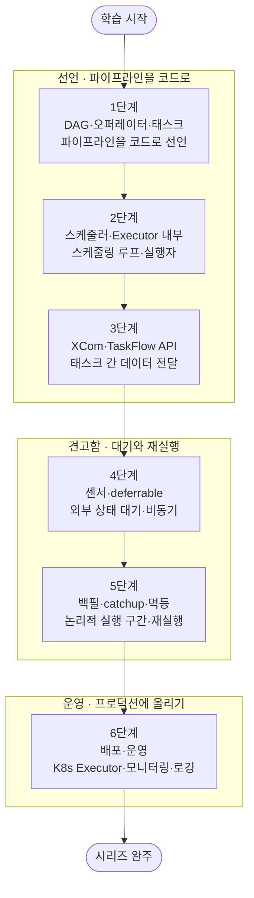

<figure class="post-figure post-figure--header">
<svg role="img" aria-label="Airflow Essential 시리즈를 한 장으로 정리한 그림. 위쪽은 Airflow의 실행 구조로, 왼쪽 스케줄러가 스케줄링 루프를 돌며 가운데 DAG(방향성 비순환 그래프로 이어진 태스크들)를 훑어 실행 대상을 고르고, 오른쪽 세 종류의 Executor(Local·Celery·Kubernetes)에게 task를 배분한다. 아래쪽은 DAG·오퍼레이터부터 배포·운영까지 6단계 도장깨기 로드맵 타임라인이며, 끝에는 시리즈 완주를 뜻하는 트로피가 놓여 있다." viewBox="0 0 680 360" xmlns="http://www.w3.org/2000/svg">
  <title>Airflow Essential — 스케줄러·DAG·Executor 실행 구조와 6단계 도장깨기 로드맵</title>
  <defs>
    <marker id="af-arrow" viewBox="0 0 10 10" refX="8" refY="5" markerWidth="6" markerHeight="6" orient="auto-start-reverse">
      <path d="M0,0 L10,5 L0,10 z" fill="var(--secondary-color)"/>
    </marker>
    <marker id="af-loop" viewBox="0 0 10 10" refX="5" refY="5" markerWidth="6" markerHeight="6" orient="auto">
      <path d="M0,0 L10,5 L0,10 z" fill="var(--secondary-color)"/>
    </marker>
  </defs>

  <!-- ===== title ===== -->
  <text x="340" y="24" text-anchor="middle" font-size="17" font-weight="800" fill="currentColor" letter-spacing="1.5">AIRFLOW ESSENTIAL</text>

  <!-- ===== SECTION A: execution structure ===== -->
  <text x="30" y="50" text-anchor="start" font-size="11" font-weight="700" fill="currentColor" opacity="0.72">실행 구조 — 스케줄러가 DAG를 훑어 실행 대상을 고르고, Executor가 task를 나눠 수행한다</text>

  <!-- Scheduler -->
  <rect x="24" y="84" width="100" height="80" rx="4" fill="var(--bg-light)" stroke="currentColor" stroke-width="2.5"/>
  <text x="74" y="104" text-anchor="middle" font-size="12.5" font-weight="700" fill="currentColor">스케줄러</text>
  <!-- scheduling loop arrow -->
  <path d="M74,116 A16,16 0 1 1 60,124" fill="none" stroke="var(--secondary-color)" stroke-width="2.5" marker-end="url(#af-loop)"/>
  <text x="74" y="182" text-anchor="middle" font-size="9" fill="currentColor" opacity="0.75">스케줄링 루프</text>

  <!-- DAG (middle) -->
  <text x="286" y="72" text-anchor="middle" font-size="10.5" font-weight="700" fill="currentColor" opacity="0.82">DAG · 방향성 비순환 그래프</text>
  <g stroke="var(--secondary-color)" stroke-width="1.8" fill="none">
    <line x1="219" y1="122" x2="268" y2="98" marker-end="url(#af-arrow)"/>
    <line x1="219" y1="122" x2="268" y2="146" marker-end="url(#af-arrow)"/>
    <line x1="293" y1="98" x2="342" y2="122" marker-end="url(#af-arrow)"/>
    <line x1="293" y1="146" x2="342" y2="122" marker-end="url(#af-arrow)"/>
  </g>
  <g fill="var(--bg-panel)" stroke="currentColor" stroke-width="2">
    <circle cx="206" cy="122" r="13"/>
    <circle cx="280" cy="96" r="13"/>
    <circle cx="280" cy="148" r="13"/>
    <circle cx="354" cy="122" r="13"/>
  </g>
  <text x="280" y="182" text-anchor="middle" font-size="9" fill="currentColor" opacity="0.75">태스크 · 의존성</text>

  <!-- Executors (right) -->
  <text x="516" y="72" text-anchor="middle" font-size="10.5" font-weight="700" fill="currentColor" opacity="0.82">Executor · 워커</text>
  <g>
    <rect x="440" y="82" width="152" height="32" rx="3" fill="var(--bg-light)" stroke="currentColor" stroke-width="2"/>
    <rect x="440" y="122" width="152" height="32" rx="3" fill="var(--bg-light)" stroke="currentColor" stroke-width="2"/>
    <rect x="440" y="162" width="152" height="32" rx="3" fill="var(--bg-panel)" stroke="var(--gold)" stroke-width="2"/>
  </g>
  <g font-size="10.5" font-weight="700" fill="currentColor" text-anchor="middle">
    <text x="516" y="102">LocalExecutor</text>
    <text x="516" y="142">CeleryExecutor</text>
    <text x="516" y="182">KubernetesExecutor</text>
  </g>

  <!-- Scheduler -> DAG -->
  <line x1="126" y1="122" x2="189" y2="122" stroke="var(--secondary-color)" stroke-width="2.5" marker-end="url(#af-arrow)"/>
  <text x="158" y="114" text-anchor="middle" font-size="8.5" fill="currentColor" opacity="0.7">훑기</text>

  <!-- DAG -> Executors -->
  <g stroke="var(--secondary-color)" stroke-width="2" fill="none">
    <line x1="367" y1="120" x2="436" y2="98" marker-end="url(#af-arrow)"/>
    <line x1="368" y1="122" x2="436" y2="138" marker-end="url(#af-arrow)"/>
    <line x1="367" y1="124" x2="436" y2="178" marker-end="url(#af-arrow)"/>
  </g>
  <text x="404" y="112" text-anchor="middle" font-size="8.5" fill="currentColor" opacity="0.7">task 배분</text>

  <!-- ===== divider ===== -->
  <line x1="30" y1="216" x2="650" y2="216" stroke="currentColor" stroke-width="1.4" opacity="0.25"/>

  <!-- ===== SECTION B: 6-step roadmap ===== -->
  <text x="30" y="240" text-anchor="start" font-size="11" font-weight="700" fill="currentColor" opacity="0.72">6단계 로드맵 — 선언 → 견고함 → 운영, 그리고 완주</text>

  <!-- act labels + underlines -->
  <g font-size="9" font-weight="700" text-anchor="middle">
    <text x="146" y="266" fill="var(--secondary-color)">선언 (1–3)</text>
    <text x="351" y="266" fill="var(--accent-color)">견고함 (4–5)</text>
    <text x="474" y="266" fill="var(--gold)">운영 (6)</text>
  </g>
  <g stroke-width="2" opacity="0.45">
    <line x1="54" y1="272" x2="238" y2="272" stroke="var(--secondary-color)"/>
    <line x1="302" y1="272" x2="400" y2="272" stroke="var(--accent-color)"/>
    <line x1="456" y1="272" x2="492" y2="272" stroke="var(--gold)"/>
  </g>

  <!-- baseline -->
  <line x1="52" y1="304" x2="489" y2="304" stroke="currentColor" stroke-width="2" opacity="0.4"/>

  <!-- stamps -->
  <g font-weight="800" text-anchor="middle">
    <!-- 1 -->
    <circle cx="64" cy="304" r="15" fill="var(--bg-light)" stroke="var(--secondary-color)" stroke-width="2.5"/>
    <text x="64" y="308" font-size="12" fill="currentColor">1</text>
    <text x="64" y="334" font-size="8.5" font-weight="700" fill="currentColor">DAG·오퍼레이터</text>
    <!-- 2 -->
    <circle cx="146" cy="304" r="15" fill="var(--bg-light)" stroke="var(--secondary-color)" stroke-width="2.5"/>
    <text x="146" y="308" font-size="12" fill="currentColor">2</text>
    <text x="146" y="334" font-size="8.5" font-weight="700" fill="currentColor">스케줄러</text>
    <!-- 3 -->
    <circle cx="228" cy="304" r="15" fill="var(--bg-light)" stroke="var(--secondary-color)" stroke-width="2.5"/>
    <text x="228" y="308" font-size="12" fill="currentColor">3</text>
    <text x="228" y="334" font-size="8.5" font-weight="700" fill="currentColor">XCom·TaskFlow</text>
    <!-- 4 -->
    <circle cx="310" cy="304" r="15" fill="var(--bg-light)" stroke="var(--accent-color)" stroke-width="2.5"/>
    <text x="310" y="308" font-size="12" fill="currentColor">4</text>
    <text x="310" y="334" font-size="8.5" font-weight="700" fill="currentColor">센서·deferrable</text>
    <!-- 5 -->
    <circle cx="392" cy="304" r="15" fill="var(--bg-light)" stroke="var(--accent-color)" stroke-width="2.5"/>
    <text x="392" y="308" font-size="12" fill="currentColor">5</text>
    <text x="392" y="334" font-size="8.5" font-weight="700" fill="currentColor">백필·멱등</text>
    <!-- 6 -->
    <circle cx="474" cy="304" r="15" fill="var(--bg-panel)" stroke="var(--gold)" stroke-width="3"/>
    <text x="474" y="308" font-size="12" fill="currentColor">6</text>
    <text x="474" y="334" font-size="8.5" font-weight="700" fill="currentColor">배포·운영</text>
  </g>

  <!-- arrow to trophy -->
  <line x1="492" y1="304" x2="596" y2="304" stroke="var(--secondary-color)" stroke-width="2" marker-end="url(#af-arrow)"/>

  <!-- ===== victory trophy ===== -->
  <g>
    <path d="M602,288 L636,288 Q634,310 619,312 Q604,310 602,288 Z" fill="var(--bg-light)" stroke="var(--gold)" stroke-width="2.5"/>
    <path d="M602,292 q-10,1 -3,13" fill="none" stroke="var(--gold)" stroke-width="2"/>
    <path d="M636,292 q10,1 3,13" fill="none" stroke="var(--gold)" stroke-width="2"/>
    <rect x="615" y="312" width="8" height="8" fill="var(--gold)"/>
    <rect x="606" y="320" width="26" height="5" rx="1" fill="var(--gold)"/>
    <polygon points="619,294 621.8,300 628,300.5 623,304.5 624.8,310.5 619,307 613.2,310.5 615,304.5 610,300.5 616.2,300" fill="var(--gold-bright)"/>
  </g>
  <text x="619" y="340" text-anchor="middle" font-size="9" font-weight="800" fill="var(--gold)">완주</text>
</svg>
<figcaption>이 시리즈를 한 장으로 — 스케줄러·DAG·Executor 실행 구조와 DAG·오퍼레이터부터 배포·운영까지 6단계 도장깨기 로드맵, 그리고 완주 트로피</figcaption>
</figure>

## 소개

`Data-Engineering-Essential` 오버뷰 시리즈는 데이터 엔지니어링 수명주기 전체의 **지도**를 그렸습니다. 그 6단계 [오케스트레이션(Orchestration)](/2026/06/25/orchestration.html)에서 우리는 수많은 수집·변환 작업을 **언제·어떤 순서로·어떤 의존성으로** 실행할지 조율하는 두뇌가 왜 필요한지, DAG·스케줄링·멱등성의 큰 틀을 짚었습니다. 다만 거기서는 "파이프라인 지도 안에서 오케스트레이터가 어떤 역할을 하는가"까지만 다루고, **DAG 작성·오퍼레이터·XCom·스케줄러·배포·운영의 깊은 이야기는 별도 시리즈로 미뤄** 두었습니다. 이 글이 바로 그 예고된 스핀오프, `Airflow-Essential` 시리즈의 **마스터 로드맵**입니다.

Apache Airflow는 2026년 현재도 데이터 파이프라인 오케스트레이션의 지배적 선택입니다. 데이터 엔지니어 채용에서 거의 빠지지 않는 도구이자, 배치 ETL·ML 워크플로·리버스 ETL을 하나의 코드베이스로 조율하는 기반 기술입니다. 그런데 Airflow로 DAG를 "돌아가게" 만드는 것과 "견고하고 운영 가능하게" 만드는 것은 전혀 다른 문제입니다. 후자는 내부 구조 — 스케줄러가 무엇을 언제 큐에 넣는지, Executor가 어떻게 task를 실행하는지, 재실행이 왜 안전하거나 위험한지 — 를 이해해야 비로소 손에 잡힙니다.

이 시리즈는 그 내부로 들어갑니다. **DAG·오퍼레이터·태스크**(파이프라인을 코드로 선언한다)에서 출발해, **스케줄러·Executor 내부**(무엇이 어떻게 실행되는가)와 **XCom·TaskFlow API**(태스크 사이로 데이터를 어떻게 흘리는가)로 선언의 기초를 다지고, **센서·deferrable 오퍼레이터**(외부 상태를 효율적으로 기다린다)와 **백필·catchup·멱등**(재실행해도 안전하게 만든다)으로 파이프라인을 견고하게 만든 뒤, 마지막으로 **배포·운영**(K8s Executor·모니터링·로깅)으로 프로덕션에 올립니다. 각 단계를 정복할 때마다 상세 딥다이브 포스트를 작성하고 체크박스를 채우는 **도장깨기** 방식으로 진행합니다.

<figure class="post-figure">
<svg role="img" aria-label="이 시리즈의 학습 여정을 세 막으로 나눈 개념도. 제1막 '선언'은 DAG·오퍼레이터, 스케줄러·Executor, XCom·TaskFlow(1~3단계)로 파이프라인을 코드로 선언하고 무엇이 어떻게 실행되는지 이해한다. 제2막 '견고하게'는 센서·deferrable와 백필·catchup·멱등(4~5단계)으로 외부 상태 대기와 재실행 안전성을 확보한다. 제3막 '운영'은 배포·모니터링·로깅(6단계)으로 프로덕션에 올린다. 세 막은 왼쪽에서 오른쪽으로 굵은 화살표로 이어진다." viewBox="0 0 680 280" xmlns="http://www.w3.org/2000/svg">
  <title>세 막으로 보는 Airflow 학습 여정 — 선언 → 견고하게 → 운영</title>

  <!-- title -->
  <text x="340" y="26" text-anchor="middle" font-size="15" font-weight="800" fill="currentColor">세 막으로 보는 학습 여정</text>

  <!-- ===== ACT 1: 선언 (steps 1-3) ===== -->
  <rect x="16" y="52" width="214" height="210" rx="6" fill="var(--bg-light)" stroke="var(--secondary-color)" stroke-width="2.5"/>
  <circle cx="34" cy="74" r="12" fill="var(--bg-panel)" stroke="var(--secondary-color)" stroke-width="2"/>
  <text x="34" y="78" text-anchor="middle" font-size="11" font-weight="800" fill="currentColor">1</text>
  <text x="128" y="78" text-anchor="middle" font-size="13" font-weight="800" fill="var(--secondary-color)">선언</text>
  <text x="128" y="96" text-anchor="middle" font-size="9" fill="currentColor" opacity="0.72">파이프라인을 코드로 선언한다</text>
  <!-- mini DAG icon -->
  <g>
    <g stroke="var(--secondary-color)" stroke-width="1.8" fill="none">
      <line x1="108" y1="132" x2="140" y2="132"/>
      <line x1="105" y1="136" x2="123" y2="153"/>
      <line x1="143" y1="136" x2="125" y2="153"/>
    </g>
    <g fill="var(--bg-panel)" stroke="var(--secondary-color)" stroke-width="2">
      <circle cx="103" cy="132" r="6"/>
      <circle cx="145" cy="132" r="6"/>
      <circle cx="124" cy="156" r="6"/>
    </g>
  </g>
  <!-- step chips -->
  <g font-size="9.5" font-weight="700">
    <rect x="34" y="176" width="180" height="22" rx="4" fill="var(--bg-panel)" stroke="currentColor" stroke-width="1" opacity="0.9"/>
    <circle cx="48" cy="187" r="7" fill="var(--bg-light)" stroke="var(--secondary-color)" stroke-width="1.6"/><text x="48" y="190" text-anchor="middle" font-size="8" fill="currentColor">1</text><text x="62" y="190" fill="currentColor">DAG·오퍼레이터·태스크</text>
    <rect x="34" y="202" width="180" height="22" rx="4" fill="var(--bg-panel)" stroke="currentColor" stroke-width="1" opacity="0.9"/>
    <circle cx="48" cy="213" r="7" fill="var(--bg-light)" stroke="var(--secondary-color)" stroke-width="1.6"/><text x="48" y="216" text-anchor="middle" font-size="8" fill="currentColor">2</text><text x="62" y="216" fill="currentColor">스케줄러·Executor 내부</text>
    <rect x="34" y="228" width="180" height="22" rx="4" fill="var(--bg-panel)" stroke="currentColor" stroke-width="1" opacity="0.9"/>
    <circle cx="48" cy="239" r="7" fill="var(--bg-light)" stroke="var(--secondary-color)" stroke-width="1.6"/><text x="48" y="242" text-anchor="middle" font-size="8" fill="currentColor">3</text><text x="62" y="242" fill="currentColor">XCom·TaskFlow API</text>
  </g>

  <!-- arrow ACT1 -> ACT2 -->
  <polygon points="232,148 246,148 246,141 260,157 246,173 246,166 232,166" fill="currentColor" opacity="0.5"/>

  <!-- ===== ACT 2: 견고하게 (steps 4-5) ===== -->
  <rect x="262" y="52" width="186" height="210" rx="6" fill="var(--bg-light)" stroke="var(--accent-color)" stroke-width="2.5"/>
  <circle cx="280" cy="74" r="12" fill="var(--bg-panel)" stroke="var(--accent-color)" stroke-width="2"/>
  <text x="280" y="78" text-anchor="middle" font-size="11" font-weight="800" fill="currentColor">2</text>
  <text x="360" y="78" text-anchor="middle" font-size="13" font-weight="800" fill="var(--accent-color)">견고하게</text>
  <text x="360" y="96" text-anchor="middle" font-size="9" fill="currentColor" opacity="0.72">대기와 재실행 안전성 확보</text>
  <!-- shield icon -->
  <g>
    <path d="M355,120 L373,127 L373,145 Q373,158 355,165 Q337,158 337,145 L337,127 Z" fill="var(--bg-light)" stroke="var(--accent-color)" stroke-width="2.5"/>
    <polyline points="347,142 353,149 365,133" fill="none" stroke="var(--accent-color)" stroke-width="2.5" stroke-linecap="round" stroke-linejoin="round"/>
  </g>
  <!-- step chips -->
  <g font-size="9.5" font-weight="700">
    <rect x="276" y="190" width="158" height="22" rx="4" fill="var(--bg-panel)" stroke="currentColor" stroke-width="1" opacity="0.9"/>
    <circle cx="290" cy="201" r="7" fill="var(--bg-light)" stroke="var(--accent-color)" stroke-width="1.6"/><text x="290" y="204" text-anchor="middle" font-size="8" fill="currentColor">4</text><text x="304" y="204" fill="currentColor">센서·deferrable</text>
    <rect x="276" y="216" width="158" height="22" rx="4" fill="var(--bg-panel)" stroke="currentColor" stroke-width="1" opacity="0.9"/>
    <circle cx="290" cy="227" r="7" fill="var(--bg-light)" stroke="var(--accent-color)" stroke-width="1.6"/><text x="290" y="230" text-anchor="middle" font-size="8" fill="currentColor">5</text><text x="304" y="230" fill="currentColor">백필·catchup·멱등</text>
  </g>
  <text x="360" y="252" text-anchor="middle" font-size="8.5" font-weight="700" fill="var(--accent-color)">재실행해도 안전하게</text>

  <!-- arrow ACT2 -> ACT3 -->
  <polygon points="450,148 464,148 464,141 478,157 464,173 464,166 450,166" fill="currentColor" opacity="0.5"/>

  <!-- ===== ACT 3: 운영 (step 6) ===== -->
  <rect x="480" y="52" width="184" height="210" rx="6" fill="var(--bg-light)" stroke="var(--gold)" stroke-width="2.5"/>
  <circle cx="498" cy="74" r="12" fill="var(--bg-panel)" stroke="var(--gold)" stroke-width="2"/>
  <text x="498" y="78" text-anchor="middle" font-size="11" font-weight="800" fill="currentColor">3</text>
  <text x="576" y="78" text-anchor="middle" font-size="13" font-weight="800" fill="var(--gold)">운영</text>
  <text x="576" y="96" text-anchor="middle" font-size="9" fill="currentColor" opacity="0.72">프로덕션에 올린다</text>
  <!-- monitor icon -->
  <g>
    <rect x="549" y="123" width="46" height="30" rx="2" fill="var(--bg-light)" stroke="var(--gold)" stroke-width="2.5"/>
    <polyline points="553,140 561,140 565,130 571,148 575,140 591,140" fill="none" stroke="var(--gold)" stroke-width="2" stroke-linecap="round" stroke-linejoin="round"/>
    <rect x="567" y="153" width="10" height="6" fill="var(--gold)"/>
    <rect x="558" y="160" width="28" height="4" rx="1" fill="var(--gold)"/>
  </g>
  <!-- step chip -->
  <g font-size="9.5" font-weight="700">
    <rect x="494" y="200" width="156" height="22" rx="4" fill="var(--bg-panel)" stroke="currentColor" stroke-width="1" opacity="0.9"/>
    <circle cx="508" cy="211" r="7" fill="var(--bg-light)" stroke="var(--gold)" stroke-width="1.6"/><text x="508" y="214" text-anchor="middle" font-size="8" fill="currentColor">6</text><text x="522" y="214" fill="currentColor">배포·모니터링·로깅</text>
  </g>
  <text x="576" y="244" text-anchor="middle" font-size="8.5" fill="currentColor" opacity="0.7">K8s Executor · SLA · 원격 로깅</text>
</svg>
<figcaption>학습 스파인을 세 막으로 — ① 선언(DAG·스케줄러·XCom) → ② 견고하게(센서·백필·멱등) → ③ 운영(배포·모니터링·로깅)</figcaption>
</figure>

## 학습 흐름

6단계는 아래 순서대로 진행하는 것을 권장합니다. 파이프라인을 **코드로 선언하는 법**(DAG·오퍼레이터)을 먼저 익히고, 그 선언이 **무엇에 의해 어떻게 실행되는지**(스케줄러·Executor)와 **태스크 사이로 데이터가 어떻게 흐르는지**(XCom·TaskFlow)로 기초를 완성합니다. 그다음 실무에서 반드시 부딪히는 **외부 상태 대기**(센서·deferrable)와 **재실행 안전성**(백필·catchup·멱등)으로 파이프라인을 견고하게 만들고, 마지막으로 **배포·운영**으로 프로덕션 스택에 Airflow를 얹는 흐름입니다.

## 학습 진행 현황

> 완료한 항목에는 상세 포스트 링크가 연결됩니다. 학습이 진행될 때마다 체크박스와 진행률을 갱신합니다.

- 현재 완료한 항목: **0개**
- 전체 항목: **6개**
- 진행률: **0%**

## 1단계: DAG · 오퍼레이터 · 태스크 — 파이프라인을 코드로 선언

Airflow의 모든 것이 여기서 출발합니다. 파이프라인을 방향성 비순환 그래프(**DAG**)로 모델링하고, 각 작업 단위를 **오퍼레이터**(무엇을 할지의 템플릿)와 그 인스턴스인 **태스크**로 선언하며, 태스크 사이 실행 순서를 **의존성**으로 잇는 법을 익힙니다. Bash·Python·SQL 같은 오퍼레이터의 종류와, 파이프라인 전체를 파이썬 코드로 표현한다는 "configuration as code" 철학을 여기서 잡으면 이후 모든 단계가 이 DAG 그림 위에 얹힙니다.

- [ ] **DAG의 구조**: 방향성 비순환 그래프로 파이프라인 모델링, `schedule`·`start_date`·기본 인자
- [ ] **오퍼레이터와 태스크**: Bash/Python/SQL 등 오퍼레이터 종류, 태스크 인스턴스와 의존성(`>>`) 정의
- [ ] **configuration as code**: 파이프라인을 파이썬으로 선언하는 철학과 동적 DAG 생성

## 2단계: 스케줄러 · Executor 내부 — 스케줄링 루프와 실행자

DAG를 선언했을 때 **무엇이 그것을 언제 실행하는가**를 다루는 단계입니다. 파일을 파싱하고 실행 대상 task를 큐에 넣는 **스케줄러의 스케줄링 루프**, 그리고 큐에 들어온 task를 실제로 돌리는 **Executor**의 종류 — 단일 노드의 LocalExecutor, 분산 워커의 CeleryExecutor, 파드 단위로 격리 실행하는 KubernetesExecutor — 의 차이와 선택 기준을 익힙니다. task가 queued → running → success/failed로 넘어가는 상태 전이까지 잡으면 "왜 내 DAG가 안 도는가"를 구조적으로 진단하게 됩니다.

- [ ] **스케줄러 루프**: DAG 파싱, task 인스턴스 생성, 실행 조건 판단과 큐잉
- [ ] **Executor 종류**: Local · Celery · Kubernetes의 아키텍처와 트레이드오프
- [ ] **task 생명주기**: queued → running → success/failed 상태 전이와 재시도

## 3단계: XCom · TaskFlow API — 태스크 간 데이터 전달과 파이썬 네이티브 DAG

태스크는 서로 격리된 채 실행되는데, 그렇다면 앞 태스크의 결과를 뒤 태스크로 어떻게 넘길까요. 그 답이 **XCom**(cross-communication)입니다. XCom의 동작 원리와 메타데이터 DB에 저장되는 특성상의 **크기 한계**, 그리고 큰 데이터에는 XCom 대신 외부 스토리지를 쓰는 패턴을 익힙니다. 아울러 데코레이터(`@task`)로 파이썬 함수를 그대로 태스크로 만들고 XCom 전달을 암묵적으로 처리해 주는 **TaskFlow API**로, 훨씬 파이썬 네이티브하게 DAG를 작성하는 법을 다룹니다.

- [ ] **XCom 기초**: push/pull 메커니즘, 메타데이터 DB 저장과 크기 한계
- [ ] **TaskFlow API**: `@task`·`@dag` 데코레이터, 함수 반환값의 자동 XCom 전달
- [ ] **대용량 데이터 전달**: XCom 대신 외부 스토리지 참조를 넘기는 패턴, custom XCom backend

## 4단계: 센서 · deferrable 오퍼레이터 — 외부 상태 대기와 비동기 효율

파이프라인은 종종 "파일이 도착할 때까지", "외부 잡이 끝날 때까지" 기다려야 합니다. 그 대기를 담당하는 것이 **센서(Sensor)**입니다. 그런데 전통적 센서는 대기하는 내내 워커 슬롯을 점유해 자원을 낭비합니다. 이를 해결하는 것이 **deferrable 오퍼레이터**와 **triggerer** — 대기 상태를 워커에서 떼어 비동기 이벤트 루프로 넘겨, 슬롯을 점유하지 않고 수천 개의 대기를 효율적으로 처리합니다. 센서의 `poke` vs `reschedule` 모드와 deferrable 전환까지 익히면 대규모 파이프라인의 자원 효율이 달라집니다.

- [ ] **센서 기초**: FileSensor·ExternalTaskSensor 등, `poke` vs `reschedule` 모드
- [ ] **deferrable 오퍼레이터**: async 대기, triggerer 프로세스, 워커 슬롯 절약
- [ ] **대기 패턴 설계**: 타임아웃·포크 간격·외부 의존성 대기의 안티패턴 피하기

## 5단계: 백필 · catchup · 멱등 — 논리적 실행 구간과 재실행 안전성

Airflow에서 가장 헷갈리면서도 가장 중요한 개념 — **시간**입니다. 각 DAG 실행은 물리적 실행 시각이 아니라 **논리적 실행 구간**(data interval)에 묶여 있고, 이를 이해해야 과거 구간을 다시 도는 **백필(backfill)**과, 놓친 구간을 자동으로 따라잡는 **catchup**을 안전하게 다룰 수 있습니다. 그리고 그 재실행이 데이터를 오염시키지 않으려면 태스크가 **멱등(idempotent)** — 같은 구간을 몇 번 돌려도 결과가 같아야 — 해야 합니다. 논리 구간·백필·catchup·멱등을 하나로 꿰면 "재실행해도 안전한 파이프라인"의 설계 원칙이 손에 잡힙니다.

- [ ] **논리적 실행 구간**: data interval, `logical_date`, 물리 실행 시각과의 구분
- [ ] **백필과 catchup**: 과거 구간 재실행, `catchup` 동작과 누락 구간 따라잡기
- [ ] **멱등 설계**: 파티션 덮어쓰기·업서트로 재실행 안전성 확보, 부작용 있는 태스크 피하기

## 6단계: 배포 · 운영 — K8s Executor · 모니터링 · 로깅

마지막은 Airflow를 프로덕션에 올려 **믿고 운영**하는 단계입니다. 컨테이너 이미지·DAG 배포 전략과 파드 단위로 격리 실행하는 **KubernetesExecutor** 운영, 태스크 실행 로그를 오브젝트 스토리지 등으로 모으는 **원격 로깅**, 그리고 SLA·경보·메트릭으로 파이프라인 건강을 지키는 **모니터링**을 다룹니다. 연결·변수·시크릿 관리와 스케줄러 이중화까지 짚어, "돌아가는 Airflow"를 "장애에 견디는 Airflow"로 끌어올립니다.

- [ ] **배포와 KubernetesExecutor**: 이미지·DAG 배포, 파드 격리 실행, 자원 격리
- [ ] **모니터링과 로깅**: 원격 로깅, 메트릭·SLA·경보, Airflow UI로 병목 읽기
- [ ] **운영 견고성**: Connection·Variable·Secrets 관리, 스케줄러 HA와 장애 대응

## 핵심 포인트

- **파이프라인은 코드다**: Airflow의 힘은 DAG를 GUI가 아니라 파이썬 코드로 선언하는 데서 나옵니다. 버전 관리·리뷰·테스트·동적 생성이 모두 여기서 따라옵니다.
- **스케줄러와 Executor를 알아야 디버깅이 보인다**: "DAG가 안 돈다"의 대부분은 스케줄링 루프와 Executor 큐잉의 구조를 모를 때 생깁니다. 무엇이 언제 큐에 들어가는지 그림을 쥐어야 진단이 됩니다.
- **논리 구간이 Airflow 사고의 핵심이다**: Airflow는 물리 시각이 아니라 논리적 실행 구간으로 사고합니다. 이걸 놓치면 백필·catchup·멱등이 모두 미궁에 빠집니다.
- **멱등이 재실행 안전성의 전제다**: 백필과 재시도는 태스크가 멱등할 때만 안전합니다. "몇 번 돌려도 같은 결과"는 견고한 파이프라인의 제1원칙입니다.
- **대기도 자원이다**: 센서가 슬롯을 점유하는 대신 deferrable로 비동기 대기하면, 수천 개의 외부 의존성을 적은 자원으로 다스릴 수 있습니다.

## 추천 학습 순서

위 단계 번호 순서대로 진행하는 것을 권합니다.

1. **선언(1~3단계)** — DAG·오퍼레이터로 파이프라인을 코드로 쓰는 법을 익히고, 스케줄러·Executor로 "무엇이 어떻게 실행되는가"를, XCom·TaskFlow로 "데이터가 어떻게 흐르는가"를 이해합니다. 이 토대 없이 운영부터 손대면 증상만 쫓게 됩니다.
2. **견고함(4~5단계)** — 센서·deferrable로 외부 상태를 효율적으로 기다리고, 백필·catchup·멱등으로 재실행해도 안전한 파이프라인을 설계합니다. 실무 사고의 대부분이 이 두 단계에서 갈립니다.
3. **운영(6단계)** — K8s Executor·모니터링·로깅으로 Airflow를 프로덕션 스택에 올려 장애에 견디게 만듭니다.

각 단계는 앞 단계의 토대 위에 쌓이므로, 순서대로 정복하며 체크박스를 채워 나가길 권합니다.

## 결론

Airflow는 "작업을 언제·어떤 순서로·어떤 의존성으로 실행할지 코드로 조율한다"는 단순한 발상 위에, 그것을 대규모로 견고하게 만들기 위한 스케줄러·Executor·센서·백필의 정교한 구조를 얹은 시스템입니다. 개별 오퍼레이터와 프로바이더는 계속 늘어나지만, **DAG로 선언하고, 스케줄러가 큐에 넣고, Executor가 실행하며, 논리 구간과 멱등으로 재실행을 안전하게 만든다**는 뼈대는 오래 갑니다. 이 6단계를 순서대로 정복하면, Airflow DAG의 실행을 읽고 병목·장애를 짚어내는 안목, 그리고 배치에서 프로덕션 운영까지 파이프라인을 견고하게 세우는 실무 감각을 갖추게 됩니다.

이 `Airflow-Essential` 시리즈는 `Data-Engineering-Essential` 오버뷰가 예고한 심화 스핀오프 중 하나입니다. 이미 시작한 처리의 [Spark-Essential](/2026/07/12/spark-essential-curriculum.html)과 나란히, 오버뷰가 함께 약속한 수집의 **Kafka**, 변환의 **dbt** 역시 각각 별도의 `*-Essential` 시리즈로 이어질 예정입니다.

### 다음 학습 (Next Learning)

- [오케스트레이션(Orchestration): DAG·스케줄링과 견고한 파이프라인](/2026/06/25/orchestration.html) — 이 시리즈가 갈라져 나온 오버뷰 6단계, Airflow의 위치를 복습
- [Data Engineering Essential Curriculum](/2026/06/25/data-engineering-essential-curriculum.html) — 전체 데이터 엔지니어링 로드맵으로 돌아가기
- [Spark Essential Curriculum](/2026/07/12/spark-essential-curriculum.html) — 자매 심화 시리즈, 처리 엔진 Apache Spark 정복
