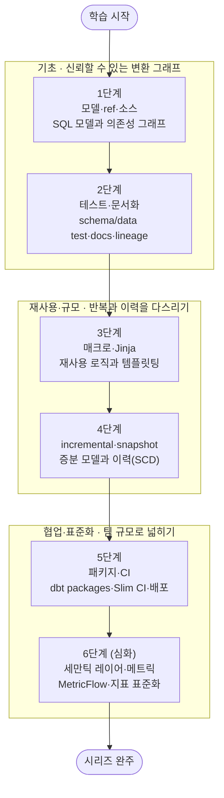

<!-- ILLUSTRATION(header): dbt-Essential 시리즈를 한 장으로 요약하는 헤더 일러스트. 위쪽에는 dbt의 변환 흐름 — 왼쪽의 source(원천 테이블)에서 ref()로 이어지는 여러 SQL 모델 노드가 DAG(의존성 그래프)를 이루며 오른쪽의 mart(최종 테이블)로 수렴하는 그림. 아래쪽에는 모델·ref → 테스트·문서화 → 매크로·Jinja → incremental·snapshot → 패키지·CI → 세만틱 레이어로 이어지는 6단계 도장깨기 로드맵 타임라인과, 끝의 완주 트로피. 테마 인식(currentColor/var(--...) 토큰), post-figure--header 래핑. -->

## 소개

`Data-Engineering-Essential` 오버뷰 시리즈는 데이터 엔지니어링 수명주기 전체의 **지도**를 그렸습니다. 그 5단계 [데이터 변환·처리(Processing)](/2026/06/25/data-processing.html)에서 우리는 처리를 "엔진으로 옮기는 일"(Spark 같은 분산 처리)과 "웨어하우스 안에서 SQL로 다듬는 일"(ELT·애널리틱스 엔지니어링)로 나누어 짚었고, 후자의 사실상 표준 도구로 **dbt**를 소개했습니다. 다만 거기서는 "처리 지도 안에서 dbt가 어디에 있는가"까지만 다루고, **모델링·테스트·매크로·배포의 깊은 이야기는 별도 시리즈로 미뤄** 두었습니다. 이 글이 바로 그 예고된 스핀오프, `dbt-Essential` 시리즈의 **마스터 로드맵**입니다.

dbt(data build tool)는 2026년 현재 애널리틱스 엔지니어링의 사실상 표준입니다. "웨어하우스 안의 원천 데이터를 신뢰할 수 있는 분석용 테이블로 변환한다"는 ELT의 T(Transform)를 담당하며, **SQL SELECT 문을 버전 관리·테스트·문서화 가능한 소프트웨어 자산으로** 바꿔 놓았습니다. 분석가와 엔지니어가 만나는 접점에서 생산성 차이를 만드는 핵심 도구이자, 데이터 파이프라인에 소프트웨어 공학의 규율(모듈화·테스트·CI)을 들여온 프레임워크입니다.

그런데 dbt로 모델 하나를 "돌아가게" 만드는 것과, 수백 개 모델을 **신뢰할 수 있고 유지보수 가능한 파이프라인**으로 키우는 것은 전혀 다른 문제입니다. 후자는 `ref()`가 만드는 의존성 그래프, 테스트와 문서로 세우는 신뢰, Jinja 매크로로 다스리는 반복, incremental·snapshot으로 감당하는 규모와 이력, 그리고 CI로 지키는 배포 안정성을 이해해야 비로소 손에 잡힙니다. 이 시리즈는 그 내부로 들어갑니다. 각 단계를 정복할 때마다 상세 딥다이브 포스트를 작성하고 체크박스를 채우는 **도장깨기** 방식으로 진행합니다.

<!-- ILLUSTRATION(through-line): 이 시리즈의 학습 여정을 세 막으로 나눈 개념도. 제1막 '모델링 기초'는 모델·ref·소스와 테스트·문서화(1~2단계)로 신뢰할 수 있는 변환 그래프를 세우고, 제2막 '재사용과 규모'는 매크로·Jinja와 incremental·snapshot(3~4단계)으로 반복과 규모·이력을 다스리며, 제3막 '협업과 표준화'는 패키지·CI와 세만틱 레이어(5~6단계)로 팀 규모의 배포와 지표 표준화로 넓힌다. 세 막은 왼쪽에서 오른쪽으로 굵은 화살표로 이어진다. post-figure 래핑. -->

## 학습 흐름

6단계는 아래 순서대로 진행하는 것을 권장합니다. dbt가 **무엇을 어떻게 변환하는지**(모델·ref·소스)를 먼저 그리고, 그 위에 **테스트·문서화**로 신뢰를 얹습니다. 그다음 **매크로·Jinja**로 반복 로직을 재사용 가능하게 만들고, **incremental·snapshot**으로 규모와 이력을 감당한 뒤, **패키지·CI**로 팀 규모의 배포를, 마지막으로 **세만틱 레이어·메트릭**으로 지표 표준화까지 넓히는 흐름입니다.

## 학습 진행 현황

> 완료한 항목에는 상세 포스트 링크가 연결됩니다. 학습이 진행될 때마다 체크박스와 진행률을 갱신합니다.

- 현재 완료한 항목: **0개**
- 전체 항목: **6개**
- 진행률: **0%**

## 1단계: 모델 · ref · 소스 — SQL 모델과 의존성 그래프

dbt의 모든 것이 여기서 출발합니다. dbt에서 **모델(model)**은 하나의 `SELECT` 문을 담은 `.sql` 파일이며, dbt가 이를 웨어하우스에 뷰나 테이블로 구체화(materialize)합니다. 모델이 다른 모델을 참조할 때 쓰는 `ref()`와 원천 테이블을 선언·참조하는 `source()`가 만드는 **의존성 그래프(DAG)**야말로 dbt의 심장입니다. 이 그래프 덕분에 dbt는 빌드 순서를 스스로 정하고, staging → intermediate → marts로 이어지는 계층형 모델링을 가능하게 합니다.

- [ ] **모델과 materialization**: `SELECT` = 모델, view/table/ephemeral/incremental 구체화 전략
- [ ] **ref와 source**: `ref()`가 세우는 모델 간 의존성, `source()`로 원천 선언·freshness
- [ ] **DAG와 계층형 모델링**: staging → intermediate → marts, dbt가 빌드 순서를 정하는 원리

## 2단계: 테스트 · 문서화 — schema/data test · docs · lineage

dbt가 "SQL 쿼리"를 "신뢰할 수 있는 데이터 자산"으로 바꾸는 지점입니다. **테스트**로 데이터의 가정을 코드로 못 박고, **문서화**로 그 자산을 팀이 이해하게 만듭니다. 컬럼에 거는 내장 **schema test**(`unique`·`not_null`·`accepted_values`·`relationships`)와 임의 SQL로 표현하는 **data test**, 모델·컬럼 설명을 담는 **docs**, 그리고 그 메타데이터로 자동 생성되는 **lineage 그래프**(데이터 계보)를 다룹니다. 여기까지 하면 "이 숫자를 믿어도 되는가"에 코드로 답할 수 있게 됩니다.

- [ ] **schema test와 data test**: 내장 제네릭 테스트, 커스텀 SQL 테스트, 심각도(severity) 설정
- [ ] **문서화**: `description`, `docs` 블록, `dbt docs generate`로 만드는 데이터 카탈로그
- [ ] **lineage**: 자동 생성 계보 그래프로 영향 분석(impact analysis)과 디버깅

## 3단계: 매크로 · Jinja — 재사용 로직과 템플릿팅

dbt SQL이 일반 SQL보다 강력한 **이유**가 여기 있습니다. dbt는 SQL을 **Jinja 템플릿**으로 컴파일하므로, 변수·조건문·반복문으로 SQL을 프로그래밍할 수 있습니다. 반복되는 로직을 함수처럼 묶는 **매크로(macro)**, 컴파일 시점에 실행되는 제어 흐름, 그리고 `dbt_utils` 같은 널리 쓰이는 매크로 패키지를 다룹니다. 매크로를 손에 쥐면 수십 개 모델에 흩어진 중복을 한 곳으로 모으고, "SQL을 생성하는 SQL"로 반복 작업을 자동화할 수 있습니다.

- [ ] **Jinja 기초**: 변수·`if`·`for` 블록, 컴파일 시점 실행 모델, `dbt compile`로 생성된 SQL 읽기
- [ ] **매크로**: 재사용 로직을 함수로, 인자와 반환, 프로젝트 전역에서 호출하기
- [ ] **매크로 패키지**: `dbt_utils` 등 커뮤니티 매크로 활용과 직접 만든 매크로의 조합

## 4단계: incremental · snapshot(SCD) — 증분 모델과 이력 관리

규모와 시간을 감당하는 단계입니다. 매번 전체를 다시 만드는 대신 **바뀐 행만** 처리하는 **incremental 모델**은 대용량 파이프라인의 비용과 시간을 좌우합니다. `is_incremental()` 분기, 유니크 키 기반 병합, `on_schema_change` 같은 전략을 익힙니다. 한편 원천이 덮어써 버리는 값의 **변화 이력**을 보존하는 **snapshot**은 dbt가 SCD Type 2(Slowly Changing Dimension)를 구현하는 방법입니다. 증분과 이력, 이 둘이 dbt를 장난감에서 프로덕션 도구로 끌어올립니다.

- [ ] **incremental 모델**: `is_incremental()`, `unique_key` 병합, `on_schema_change`, full-refresh
- [ ] **incremental 전략**: append·merge·delete+insert, 웨어하우스별 차이와 선택 기준
- [ ] **snapshot과 SCD Type 2**: `timestamp`/`check` 전략으로 변화 이력 보존하기

## 5단계: 패키지 · CI — dbt packages · Slim CI · 배포

혼자 쓰던 dbt를 **팀의 것**으로 만드는 단계입니다. 공통 로직·매크로·모델을 재사용 가능한 단위로 묶는 **dbt packages**(`packages.yml`·`dbt hub`), 그리고 PR마다 변경된 모델만 골라 검증하는 **Slim CI**(state 비교·`--defer`)를 다룹니다. 무엇이 바뀌었는지 알아내는 dbt의 **상태(state) 비교**가 CI의 핵심이며, 이를 GitHub Actions 같은 파이프라인에 얹어 "테스트를 통과한 변경만 배포"하는 안전한 릴리스 흐름을 세웁니다. dbt를 스케줄러(예: Airflow)에서 실행하는 배포 패턴까지 짚습니다.

- [ ] **dbt packages**: `packages.yml`, 버전 관리, 사내 공통 모듈을 패키지로 뽑기
- [ ] **Slim CI와 state**: `state:modified` 선택, `--defer`, PR에서 바뀐 모델만 빌드/테스트
- [ ] **배포 파이프라인**: CI/CD 통합, 스케줄 실행(오케스트레이터 연동), 환경 분리(dev/prod)

## 6단계 (심화): 세만틱 레이어 · 메트릭 — MetricFlow · 지표 표준화

마지막은 dbt를 **지표의 단일 진실 공급원**으로 끌어올리는 심화 단계입니다. "매출"이나 "활성 사용자"가 대시보드마다 다르게 계산되는 문제 — 지표 정의의 파편화 — 를, dbt **세만틱 레이어(Semantic Layer)**는 지표를 코드로 한 번만 정의하고 여러 도구가 공유하게 함으로써 해결합니다. **MetricFlow**로 semantic model·measure·metric·dimension을 선언하고, 그 정의에서 일관된 SQL을 생성하는 원리를 다룹니다. 여기까지 하면 dbt는 변환 도구를 넘어 **조직의 지표 표준을 강제하는 계층**이 됩니다.

- [ ] **세만틱 레이어의 문제의식**: 지표 정의 파편화, 단일 정의 → 다중 소비의 가치
- [ ] **MetricFlow**: semantic model, measure/metric/dimension, entity와 조인 해석
- [ ] **지표 표준화**: BI·노트북에서 동일 정의 재사용, 거버넌스와 신뢰

## 핵심 포인트

- **ref가 그래프를 만든다**: dbt의 힘은 `SELECT` 자체가 아니라 `ref()`가 엮어내는 **의존성 그래프**에서 나옵니다. 빌드 순서·계보·영향 분석이 모두 이 그래프 위에 얹힙니다.
- **테스트·문서가 신뢰를 만든다**: SQL을 "자산"으로 만드는 것은 테스트와 문서입니다. "이 숫자를 믿어도 되는가"에 코드로 답할 수 있어야 프로덕션입니다.
- **Jinja가 반복을 없앤다**: 매크로와 Jinja는 취향이 아니라 규모의 문제입니다. 수십 모델의 중복을 한 곳으로 모으는 것이 유지보수의 핵심입니다.
- **증분과 이력이 규모를 감당한다**: incremental은 비용·시간을, snapshot(SCD)은 변화 이력을 감당합니다. 이 둘이 dbt를 프로덕션 도구로 만듭니다.
- **dbt는 파이프라인에 소프트웨어 규율을 들인다**: 패키지·CI·상태 비교는 dbt가 "SQL 스크립트 모음"이 아니라 **버전 관리·테스트·배포되는 소프트웨어**임을 보여 줍니다.

## 추천 학습 순서

위 단계 번호 순서대로 진행하는 것을 권합니다.

1. **기초(1~2단계)** — 모델·ref·소스로 "무엇이 어떻게 변환되는가"를 그리고, 테스트·문서화로 그 위에 신뢰를 얹습니다. 이 토대 없이 매크로부터 손대면 관리되지 않는 복잡도만 쌓입니다.
2. **재사용·규모(3~4단계)** — 매크로·Jinja로 반복을 없애고, incremental·snapshot으로 규모와 이력을 감당합니다. 실무 파이프라인의 지속가능성이 여기서 갈립니다.
3. **협업·표준화(5~6단계)** — 패키지·CI로 팀 규모의 안전한 배포를, 세만틱 레이어로 조직의 지표 표준화를 이룹니다.

각 단계는 앞 단계의 토대 위에 쌓이므로, 순서대로 정복하며 체크박스를 채워 나가길 권합니다.

## 결론

dbt는 "웨어하우스 안의 SQL 변환을 소프트웨어처럼 다룬다"는 단순한 발상 위에, 그것을 신뢰할 수 있고 재사용 가능하며 배포 가능하게 만드는 규율을 얹은 도구입니다. 개별 문법과 기능은 계속 진화하지만, **`ref()`로 그래프를 세우고, 테스트로 신뢰를 얹고, Jinja로 반복을 없애고, incremental·snapshot으로 규모를 감당한다**는 뼈대는 오래 갑니다. 이 6단계를 순서대로 정복하면, dbt 프로젝트의 모델 그래프를 읽고 신뢰할 수 있는 변환 파이프라인을 설계·운영하며, 팀 규모로 배포하고 조직의 지표를 표준화하는 애널리틱스 엔지니어링 실무 감각을 갖추게 됩니다.

이 `dbt-Essential` 시리즈는 `Data-Engineering-Essential` 오버뷰가 예고한 심화 스핀오프의 하나입니다. 처리 스케일을 담당하는 자매 시리즈 [Spark-Essential](/2026/07/12/spark-essential-curriculum.html)과 짝을 이루며 — Spark가 "대용량을 나눠서 처리"한다면 dbt는 "웨어하우스 안에서 신뢰할 수 있게 변환"합니다 — 오버뷰가 함께 약속한 수집의 **Kafka**, 오케스트레이션의 **Airflow** 역시 각각 별도의 `*-Essential` 시리즈로 이어질 예정입니다.

### 다음 학습 (Next Learning)

- [데이터 변환·처리(Processing): 배치·스트림 엔진과 SQL 변환](/2026/06/25/data-processing.html) — 이 시리즈가 갈라져 나온 오버뷰 5단계, dbt의 위치를 복습
- [Data Engineering Essential Curriculum](/2026/06/25/data-engineering-essential-curriculum.html) — 전체 데이터 엔지니어링 로드맵으로 돌아가기
- [Spark Essential Curriculum](/2026/07/12/spark-essential-curriculum.html) — 처리 스케일을 담당하는 자매 심화 시리즈
