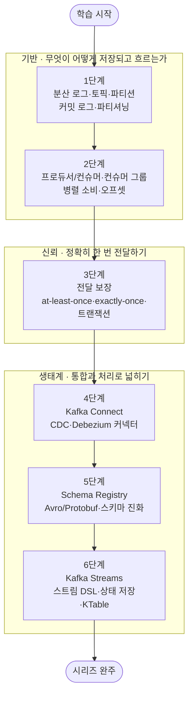

<!-- ILLUSTRATION(header): 이 시리즈를 한 장으로 요약하는 헤더 일러스트. 위쪽은 Kafka의 핵심 데이터 모델 — 왼쪽 여러 Producer가 가운데의 append-only 커밋 로그(파티션 여러 개로 나뉜 토픽, 각 칸에 오프셋 0·1·2… 번호가 붙은 레코드)에 기록하고, 오른쪽 여러 Consumer(컨슈머 그룹으로 묶임)가 각자의 오프셋 위치에서 순서대로 읽어 간다. 로그는 지워지지 않고 계속 오른쪽으로 자란다는 느낌. 아래쪽은 분산 로그 → 프로듀서/컨슈머 → 전달 보장 → Connect → Schema Registry → Kafka Streams로 이어지는 6단계 로드맵 타임라인이며, 끝에는 시리즈 완주를 뜻하는 트로피. 자매 커리큘럼(Spark-Essential)의 헤더 SVG와 동일한 톤: theme-aware(currentColor/var(--bg-light)/var(--gold) 등 토큰), .post-figure post-figure--header 래핑, viewBox 약 680x360. -->

## 소개

`Data-Engineering-Essential` 오버뷰 시리즈는 데이터 엔지니어링 수명주기 전체의 **지도**를 그렸습니다. 그 3단계 [데이터 수집(Ingestion)](/2026/06/25/data-ingestion.html)에서 우리는 원천 시스템의 데이터를 어떻게 안정적으로 가져오는지 — 배치와 스트리밍, 변경 데이터 캡처(CDC), 그리고 메시징·스트리밍 플랫폼의 역할 — 을 짚었습니다. 거기서 **Apache Kafka**는 "실시간 파이프라인의 관문"으로 소개되었지만, 분산 로그의 내부 구조·전달 보장·스트림 처리 같은 깊은 이야기는 **별도 시리즈로 미뤄** 두었습니다. 이 글이 바로 그 예고된 스핀오프, `Kafka-Essential` 시리즈의 **마스터 로드맵**입니다.

Apache Kafka는 2026년 현재도 실시간 데이터 파이프라인의 사실상 표준입니다. 데이터 엔지니어 채용 공고의 약 4분의 1에 등장하는, 이벤트 스트리밍의 관문 기술이자 수집·복제·스트림 처리를 하나의 로그 위에서 아우르는 기반 인프라입니다. 그런데 Kafka를 "메시지 큐"로 이해하는 것과 "분산 커밋 로그"로 이해하는 것은 전혀 다른 깊이입니다. 후자를 잡아야 비로소 파티셔닝·컨슈머 그룹·오프셋·전달 보장이 하나의 그림으로 연결되고, 왜 Kafka가 단순 큐가 아니라 데이터 플랫폼의 중추가 되었는지 이해할 수 있습니다.

이 시리즈는 그 내부로 들어갑니다. **분산 로그·토픽·파티션**(무엇이 어떻게 저장되는가)에서 출발해, **프로듀서/컨슈머와 컨슈머 그룹**(어떻게 쓰고 병렬로 읽는가)으로 데이터 흐름을 익히고, **전달 보장**(exactly-once까지 어떻게 신뢰를 확보하는가)으로 정확성을 다룬 뒤, **Kafka Connect**(CDC로 시스템을 잇기)와 **Schema Registry**(계약으로 데이터를 지키기)로 생태계를 넓히고, 마지막으로 **Kafka Streams**(로그 위에서 바로 스트림을 처리하기)로 마무리합니다. 각 단계를 정복할 때마다 상세 딥다이브 포스트를 작성하고 체크박스를 채우는 **도장깨기** 방식으로 진행합니다.

<!-- ILLUSTRATION(through-line): 이 시리즈의 학습 여정을 세 막으로 나눈 개념도(Spark 커리큘럼의 '세 막으로 보는 학습 여정' SVG와 같은 형식·톤). 제1막 '로그를 이해하기'는 분산 로그·프로듀서/컨슈머(1~2단계)로 Kafka의 데이터 모델과 읽기/쓰기를 익히고, 제2막 '신뢰를 확보하기'는 전달 보장(3단계)으로 exactly-once·멱등·트랜잭션을 다스리며, 제3막 '생태계로 넓히기'는 Connect·Schema Registry·Kafka Streams(4~6단계)로 통합·계약·스트림 처리로 활용 범위를 넓힌다. 세 막은 왼쪽에서 오른쪽으로 굵은 화살표로 이어진다. theme-aware 토큰 사용, .post-figure 래핑, viewBox 약 680x280. -->

## 학습 흐름

6단계는 아래 순서대로 진행하는 것을 권장합니다. Kafka가 **무엇을 어떻게 저장하는지**(분산 로그·파티션)를 먼저 그리고, 그 위에서 데이터를 **어떻게 쓰고 병렬로 읽는지**(프로듀서/컨슈머·컨슈머 그룹)를 익힙니다. 그다음 실무에서 반드시 부딪히는 **전달 보장**(중복 없이 정확히 한 번)으로 신뢰성을 다스리고, **Connect**와 **Schema Registry**로 시스템 통합과 데이터 계약을 얹은 뒤, **Kafka Streams**로 로그 위에서 바로 스트림을 처리하는 흐름입니다.

## 학습 진행 현황

> 완료한 항목에는 상세 포스트 링크가 연결됩니다. 학습이 진행될 때마다 체크박스와 진행률을 갱신합니다.

- 현재 완료한 항목: **0개**
- 전체 항목: **6개**
- 진행률: **0%**

## 1단계: 분산 로그 · 토픽 · 파티션 — 커밋 로그 모델과 파티셔닝

Kafka의 모든 것이 여기서 출발합니다. Kafka는 메시지 큐가 아니라, 지워지지 않고 계속 뒤에 덧붙는 **append-only 커밋 로그**입니다. 데이터가 담기는 논리 단위인 **토픽(topic)**, 그 토픽을 병렬 처리와 확장의 단위로 쪼갠 **파티션(partition)**, 그리고 각 레코드의 순번인 **오프셋(offset)**이 어떻게 맞물리는지를 익힙니다. 파티션이 순서 보장과 병렬성의 경계라는 사실, 파티셔닝 키가 처리량과 순서를 어떻게 가르는지, 복제(replication)와 리더/팔로워로 내구성을 확보하는 원리까지 잡으면 이후 모든 단계가 이 그림 위에 얹힙니다.

- [ ] **커밋 로그 모델**: 큐가 아닌 append-only 로그, 보존(retention)과 재생(replay)이 주는 힘
- [ ] **토픽과 파티션**: 파티션 = 병렬성·순서 보장의 단위, 파티셔닝 키의 선택
- [ ] **복제와 내구성**: 리더/팔로워, ISR(In-Sync Replica), 복제 계수로 확보하는 내결함성

## 2단계: 프로듀서 / 컨슈머 · 컨슈머 그룹 — 병렬 소비와 오프셋

로그에 **어떻게 쓰고, 어떻게 병렬로 읽는가**를 다루는 단계입니다. **프로듀서**가 레코드를 어느 파티션에 보낼지 정하고 배치·압축·`acks`로 처리량과 내구성을 조율하는 법, **컨슈머**가 로그를 순서대로 당겨(pull) 읽으며 어디까지 읽었는지를 **오프셋 커밋**으로 기록하는 법을 익힙니다. 핵심은 **컨슈머 그룹**입니다. 여러 컨슈머를 하나의 그룹으로 묶으면 파티션이 자동으로 나눠 배정되어 수평 확장이 되고, 컨슈머가 죽거나 추가되면 **리밸런싱(rebalancing)**이 일어납니다. 그룹 안에서 파티션 수가 병렬성의 상한이라는 점, 오프셋 커밋 시점이 전달 보장과 직결된다는 점을 여기서 잡습니다.

- [ ] **프로듀서**: 파티션 배정·배치·압축, `acks`(0/1/all)로 처리량 vs 내구성 조율
- [ ] **컨슈머와 오프셋**: pull 기반 소비, 오프셋 커밋(자동 vs 수동)과 재처리
- [ ] **컨슈머 그룹과 리밸런싱**: 파티션 분배로 수평 확장, 리밸런싱과 그 비용

## 3단계: 전달 보장 — at-least-once · exactly-once · 멱등 프로듀서 · 트랜잭션

Kafka 실무에서 가장 자주 오해되고, 가장 중요한 주제입니다. "메시지가 유실되지 않는가", "중복되지 않는가"는 서로 다른 문제이고, Kafka는 이를 **세 가지 전달 의미**로 정리합니다. 유실은 없지만 중복이 가능한 **at-least-once**, 중복 위험을 감수하고 최소 지연을 택하는 **at-most-once**, 그리고 중복도 유실도 없는 **exactly-once**입니다. exactly-once를 가능하게 하는 두 축 — 재시도 중복을 막는 **멱등 프로듀서(idempotent producer)**와 여러 파티션에 걸친 쓰기를 원자적으로 묶는 **트랜잭션(transaction)** — 을 익힙니다. 오프셋 커밋 시점과 처리의 순서가 왜 전달 의미를 가르는지, exactly-once가 왜 "consume-process-produce" 루프에서만 온전히 성립하는지를 여기서 확실히 잡습니다.

- [ ] **세 가지 전달 의미**: at-most-once vs at-least-once vs exactly-once의 트레이드오프
- [ ] **멱등 프로듀서**: 프로듀서 재시도로 인한 중복을 시퀀스 번호로 제거하기
- [ ] **트랜잭션과 EOS**: 다중 파티션 원자적 쓰기, read-process-write의 exactly-once 보장

## 4단계: Kafka Connect — CDC · Debezium 커넥터

Kafka를 **다른 시스템과 잇는** 표준 방법입니다. 프로듀서·컨슈머를 매번 직접 짜는 대신, **Kafka Connect**는 소스(외부 → Kafka)와 싱크(Kafka → 외부) 커넥터를 선언적 설정만으로 운영하게 해 줍니다. 특히 데이터 엔지니어링에서 결정적인 쓰임은 **변경 데이터 캡처(CDC)**입니다. **Debezium** 같은 커넥터가 원천 DB의 트랜잭션 로그(WAL/binlog)를 읽어 INSERT·UPDATE·DELETE를 이벤트 스트림으로 바꿔 Kafka에 흘려보내면, 운영 DB의 변경이 거의 실시간으로 분석계·검색·캐시에 전파됩니다. 커넥터의 분산 실행 모델(worker·task), 오프셋 관리, 그리고 스냅샷 → 스트리밍 전환 같은 CDC 실무 감각을 익힙니다. (수집 관점의 CDC 개념은 오버뷰 [수집 포스트](/2026/06/25/data-ingestion.html)의 CDC 절이 좋은 사전 지식입니다.)

- [ ] **Connect 아키텍처**: 소스/싱크 커넥터, worker·task 분산 실행, 선언적 설정
- [ ] **CDC와 Debezium**: DB 트랜잭션 로그 기반 변경 캡처, 스냅샷 → 스트리밍
- [ ] **운영 실무**: 오프셋·상태 관리, 스키마 전달, 흔한 장애 패턴

## 5단계: Schema Registry — Avro/Protobuf · 스키마 진화 · 호환성

로그를 여러 팀이 오래 공유하면, 데이터의 **형태(스키마)**가 곧 시스템 간 **계약**이 됩니다. 프로듀서가 필드를 바꾸면 컨슈머가 깨지는 문제를 막기 위해 **Schema Registry**는 스키마를 중앙에서 등록·버전 관리하고, 메시지에는 스키마 ID만 실어 보내 효율과 안전을 함께 확보합니다. **Avro·Protobuf** 같은 이진 직렬화 포맷과, 스키마를 안전하게 바꾸는 **스키마 진화(schema evolution)**, 그리고 어떤 변경이 허용되는지를 규정하는 **호환성(backward/forward/full)** 규칙을 익힙니다. 이 단계를 잡으면 "데이터 계약(Data Contracts)"이 추상적 구호가 아니라 실제로 강제되는 메커니즘임을 이해하게 됩니다.

- [ ] **Schema Registry의 역할**: 스키마 중앙 등록·버전 관리, 메시지에는 스키마 ID만
- [ ] **직렬화 포맷**: Avro vs Protobuf vs JSON Schema, 이진 포맷의 이점
- [ ] **스키마 진화와 호환성**: backward/forward/full 호환성 규칙과 안전한 필드 변경

## 6단계: Kafka Streams — 스트림 처리 DSL · 상태 저장 · KTable

마지막은 로그 위에서 **바로 스트림을 처리하는** 단계입니다. 별도 처리 클러스터 없이, 애플리케이션 라이브러리만으로 Kafka 토픽을 입력받아 변환·집계·조인해 다시 토픽으로 내보내는 **Kafka Streams**를 다룹니다. 흐르는 이벤트를 다루는 **KStream**과, 최신 상태의 테이블로 보는 **KTable**의 이원성(stream-table duality), 집계·조인을 위한 **상태 저장(state store)**과 그 내결함성(changelog 토픽), 그리고 이벤트 시간 **윈도잉**과 exactly-once 처리를 익힙니다. Structured Streaming·Flink 같은 외부 엔진과의 경계 — 언제 Streams로 충분하고 언제 전용 엔진이 필요한지 — 도 함께 짚습니다. (스트림 처리의 시간·윈도 개념은 오버뷰 [처리 포스트](/2026/06/25/data-processing.html)의 이벤트 시간·윈도잉 절과 이어집니다.)

- [ ] **스트림 처리 DSL**: KStream·KTable, map/filter/aggregate/join, 토폴로지
- [ ] **상태 저장과 내결함성**: state store, changelog 토픽으로 복원되는 로컬 상태
- [ ] **윈도잉과 정확성**: 이벤트 시간 윈도(텀블링/슬라이딩/세션), exactly-once 처리

## 핵심 포인트

- **큐가 아니라 로그다**: Kafka를 "메시지 큐"로 보면 절반만 이해한 것입니다. 지워지지 않고 재생 가능한 **분산 커밋 로그**로 볼 때, 파티셔닝·컨슈머 그룹·CDC·스트림 처리가 하나의 그림으로 연결됩니다.
- **파티션이 병렬성과 순서의 경계다**: 순서 보장도, 수평 확장도, 컨슈머 병렬성의 상한도 모두 파티션 단위에서 결정됩니다. 파티션 수와 파티셔닝 키 설계가 곧 성능·정합성 설계입니다.
- **전달 보장은 오프셋 커밋 시점의 문제다**: exactly-once는 마법이 아니라 멱등 프로듀서 + 트랜잭션 + 올바른 오프셋 관리의 합입니다. "유실 없음"과 "중복 없음"을 분리해 사고해야 합니다.
- **스키마가 곧 계약이다**: 여러 팀이 오래 공유하는 로그에서 데이터의 형태는 시스템 간 계약입니다. Schema Registry와 호환성 규칙이 이 계약을 실제로 강제합니다.
- **Kafka는 파이프라인의 중추다**: Connect로 시스템을 잇고, Streams로 처리까지 얹으면, Kafka는 단순 전송 수단을 넘어 수집·통합·처리를 아우르는 데이터 플랫폼의 중추가 됩니다.

## 추천 학습 순서

위 단계 번호 순서대로 진행하는 것을 권합니다.

1. **기반(1~2단계)** — 분산 로그·파티션으로 "무엇이 어떻게 저장되는가"를 그리고, 프로듀서/컨슈머·컨슈머 그룹으로 "어떻게 쓰고 병렬로 읽는가"를 이해합니다. 이 토대 없이 전달 보장부터 손대면 개념이 겉돕니다.
2. **신뢰(3단계)** — 전달 보장으로 "어떻게 정확히 한 번 전달하는가"를 다룹니다. 실무에서 가장 자주 오해되고 가장 중요한 단계입니다.
3. **생태계(4~6단계)** — Connect로 시스템 통합(CDC)을, Schema Registry로 데이터 계약을, Kafka Streams로 로그 위 스트림 처리를 얹어 Kafka의 활용 범위를 넓힙니다.

각 단계는 앞 단계의 토대 위에 쌓이므로, 순서대로 정복하며 체크박스를 채워 나가길 권합니다.

## 결론

Kafka는 "이벤트를 로그에 쌓고, 그 로그를 여럿이 각자의 속도로 읽는다"는 단순한 발상 위에, 그것을 대규모로 신뢰할 수 있게 만드는 정교한 분산 시스템을 얹은 기술입니다. 클라이언트 API와 주변 도구는 계속 진화하지만, **파티션으로 나누고, 오프셋으로 위치를 기억하고, 컨슈머 그룹으로 확장한다**는 뼈대와 "재생 가능한 로그가 시스템을 느슨하게 잇는다"는 원리는 오래 갑니다. 이 6단계를 순서대로 정복하면, 실시간 파이프라인을 설계하고 전달 보장을 따져 묻고 CDC·스트림 처리까지 얹는 실무 안목을 갖추게 됩니다.

이 `Kafka-Essential` 시리즈는 `Data-Engineering-Essential` 오버뷰가 예고한 심화 스핀오프 중 **수집·스트리밍** 축을 담당합니다. 이미 공개된 처리 축의 [Spark-Essential 시리즈](/2026/07/12/spark-essential-curriculum.html)와 짝을 이루며, 변환의 **dbt**, 오케스트레이션의 **Airflow** 역시 각각 별도의 `*-Essential` 시리즈로 이어질 예정입니다.

### 다음 학습 (Next Learning)

- [데이터 수집(Ingestion): 배치·스트리밍·CDC와 수집 도구](/2026/06/25/data-ingestion.html) — 이 시리즈가 갈라져 나온 오버뷰 3단계, Kafka의 위치를 복습
- [Data Engineering Essential Curriculum](/2026/06/25/data-engineering-essential-curriculum.html) — 전체 데이터 엔지니어링 로드맵으로 돌아가기
- [Spark Essential Curriculum](/2026/07/12/spark-essential-curriculum.html) — 처리 축의 자매 심화 시리즈
