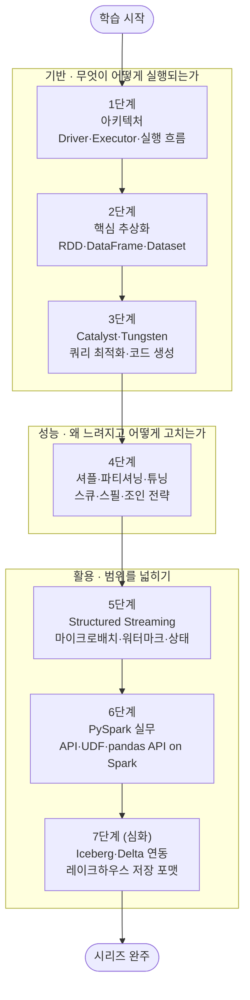

<figure class="post-figure post-figure--header">
<svg role="img" aria-label="Spark Essential 시리즈를 한 장으로 정리한 그림. 위쪽은 Spark 실행 구조로, 왼쪽 Driver가 DAG를 세워 세 개의 Executor에 task를 나눠 보내고, 가운데 셔플에서 키가 재배치된 뒤 오른쪽 결과 테이블로 모인다. 아래쪽은 아키텍처·추상화·옵티마이저·셔플과 튜닝·스트리밍·PySpark·레이크하우스로 이어지는 7단계 로드맵 타임라인이며, 끝에는 시리즈 완주를 뜻하는 트로피가 놓여 있다." viewBox="0 0 680 360" xmlns="http://www.w3.org/2000/svg">
  <title>Spark Essential — Driver/Executor 실행 구조와 7단계 도장깨기 로드맵</title>
  <defs>
    <marker id="spk-arrow" viewBox="0 0 10 10" refX="8" refY="5" markerWidth="6" markerHeight="6" orient="auto-start-reverse">
      <path d="M0,0 L10,5 L0,10 z" fill="var(--secondary-color)"/>
    </marker>
  </defs>

  <!-- ===== title ===== -->
  <text x="340" y="24" text-anchor="middle" font-size="17" font-weight="800" fill="currentColor" letter-spacing="1.5">SPARK ESSENTIAL</text>

  <!-- ===== SECTION A: execution structure ===== -->
  <text x="30" y="50" text-anchor="start" font-size="11" font-weight="700" fill="currentColor" opacity="0.72">실행 구조 — Driver가 세우고, Executor가 나눠 수행하고, 셔플로 다시 모은다</text>

  <!-- Driver -->
  <rect x="28" y="84" width="96" height="78" rx="4" fill="var(--bg-light)" stroke="currentColor" stroke-width="2.5"/>
  <text x="76" y="105" text-anchor="middle" font-size="13" font-weight="700" fill="currentColor">Driver</text>
  <!-- mini DAG inside driver -->
  <g opacity="0.6">
    <line x1="50" y1="130" x2="76" y2="144" stroke="currentColor" stroke-width="1.5"/>
    <line x1="76" y1="144" x2="102" y2="130" stroke="currentColor" stroke-width="1.5"/>
    <line x1="50" y1="130" x2="102" y2="130" stroke="currentColor" stroke-width="1.5"/>
    <circle cx="50" cy="130" r="4.5" fill="var(--bg-panel)" stroke="currentColor" stroke-width="1.5"/>
    <circle cx="76" cy="144" r="4.5" fill="var(--bg-panel)" stroke="currentColor" stroke-width="1.5"/>
    <circle cx="102" cy="130" r="4.5" fill="var(--bg-panel)" stroke="currentColor" stroke-width="1.5"/>
  </g>
  <text x="76" y="180" text-anchor="middle" font-size="9" fill="currentColor" opacity="0.75">DAG 수립 · 분배</text>

  <!-- Executors -->
  <g>
    <rect x="192" y="50" width="118" height="42" rx="3" fill="var(--bg-light)" stroke="currentColor" stroke-width="2"/>
    <rect x="192" y="100" width="118" height="42" rx="3" fill="var(--bg-light)" stroke="currentColor" stroke-width="2"/>
    <rect x="192" y="150" width="118" height="42" rx="3" fill="var(--bg-light)" stroke="currentColor" stroke-width="2"/>
  </g>
  <g font-size="10.5" font-weight="700" fill="currentColor" text-anchor="middle">
    <text x="251" y="68">Executor</text>
    <text x="251" y="118">Executor</text>
    <text x="251" y="168">Executor</text>
  </g>
  <!-- task squares inside each executor -->
  <g fill="var(--bg-panel)" stroke="currentColor" stroke-width="1.2" opacity="0.8">
    <rect x="234" y="76" width="8" height="8" rx="1"/><rect x="248" y="76" width="8" height="8" rx="1"/><rect x="262" y="76" width="8" height="8" rx="1"/>
    <rect x="234" y="126" width="8" height="8" rx="1"/><rect x="248" y="126" width="8" height="8" rx="1"/><rect x="262" y="126" width="8" height="8" rx="1"/>
    <rect x="234" y="176" width="8" height="8" rx="1"/><rect x="248" y="176" width="8" height="8" rx="1"/><rect x="262" y="176" width="8" height="8" rx="1"/>
  </g>
  <text x="251" y="206" text-anchor="middle" font-size="9" fill="currentColor" opacity="0.75">task 수행</text>

  <!-- Driver -> Executor arrows -->
  <g stroke="var(--secondary-color)" stroke-width="2" fill="none">
    <line x1="124" y1="110" x2="188" y2="71" marker-end="url(#spk-arrow)"/>
    <line x1="124" y1="123" x2="188" y2="121" marker-end="url(#spk-arrow)"/>
    <line x1="124" y1="136" x2="188" y2="171" marker-end="url(#spk-arrow)"/>
  </g>

  <!-- Shuffle zone -->
  <text x="388" y="46" text-anchor="middle" font-size="11" font-weight="700" fill="currentColor" opacity="0.82">셔플 · 키 재배치</text>
  <g stroke="currentColor" stroke-width="0.9" opacity="0.28" stroke-dasharray="2 3">
    <line x1="324" y1="56" x2="324" y2="188"/>
    <line x1="452" y1="56" x2="452" y2="188"/>
  </g>
  <g stroke="currentColor" stroke-width="1.6" opacity="0.5" fill="none">
    <line x1="312" y1="71" x2="452" y2="171"/>
    <line x1="312" y1="71" x2="452" y2="121"/>
    <line x1="312" y1="121" x2="452" y2="121"/>
    <line x1="312" y1="171" x2="452" y2="71"/>
    <line x1="312" y1="171" x2="452" y2="121"/>
  </g>

  <!-- Result -->
  <rect x="470" y="84" width="116" height="78" rx="4" fill="var(--bg-panel)" stroke="var(--gold)" stroke-width="2.5"/>
  <text x="528" y="106" text-anchor="middle" font-size="13" font-weight="700" fill="currentColor">결과</text>
  <g stroke="currentColor" stroke-width="1.1" opacity="0.4">
    <line x1="488" y1="120" x2="568" y2="120"/>
    <line x1="488" y1="132" x2="568" y2="132"/>
    <line x1="488" y1="144" x2="568" y2="144"/>
    <line x1="528" y1="114" x2="528" y2="150"/>
  </g>
  <text x="528" y="180" text-anchor="middle" font-size="9" fill="currentColor" opacity="0.75">집계·조인 완료</text>
  <!-- Shuffle -> Result arrows -->
  <g stroke="var(--secondary-color)" stroke-width="2" fill="none">
    <line x1="452" y1="71" x2="468" y2="112" marker-end="url(#spk-arrow)"/>
    <line x1="452" y1="121" x2="468" y2="122" marker-end="url(#spk-arrow)"/>
    <line x1="452" y1="171" x2="468" y2="134" marker-end="url(#spk-arrow)"/>
  </g>

  <!-- ===== divider ===== -->
  <line x1="30" y1="216" x2="650" y2="216" stroke="currentColor" stroke-width="1.4" opacity="0.25"/>

  <!-- ===== SECTION B: 7-step roadmap ===== -->
  <text x="30" y="240" text-anchor="start" font-size="11" font-weight="700" fill="currentColor" opacity="0.72">7단계 로드맵 — 기반 → 성능 → 활용, 그리고 완주</text>

  <!-- act labels + underlines -->
  <g font-size="9" font-weight="700" text-anchor="middle">
    <text x="140" y="266" fill="var(--secondary-color)">기반 (1–3)</text>
    <text x="300" y="266" fill="var(--accent-color)">성능 (4)</text>
    <text x="460" y="266" fill="var(--gold)">활용 (5–7)</text>
  </g>
  <g stroke-width="2" opacity="0.45">
    <line x1="60" y1="272" x2="220" y2="272" stroke="var(--secondary-color)"/>
    <line x1="286" y1="272" x2="314" y2="272" stroke="var(--accent-color)"/>
    <line x1="380" y1="272" x2="540" y2="272" stroke="var(--gold)"/>
  </g>

  <!-- baseline -->
  <line x1="52" y1="304" x2="556" y2="304" stroke="currentColor" stroke-width="2" opacity="0.4"/>

  <!-- stamps -->
  <g font-weight="800" text-anchor="middle">
    <!-- 1 -->
    <circle cx="60" cy="304" r="15" fill="var(--bg-light)" stroke="var(--secondary-color)" stroke-width="2.5"/>
    <text x="60" y="308" font-size="12" fill="currentColor">1</text>
    <text x="60" y="334" font-size="8.5" font-weight="700" fill="currentColor">아키텍처</text>
    <!-- 2 -->
    <circle cx="140" cy="304" r="15" fill="var(--bg-light)" stroke="var(--secondary-color)" stroke-width="2.5"/>
    <text x="140" y="308" font-size="12" fill="currentColor">2</text>
    <text x="140" y="334" font-size="8.5" font-weight="700" fill="currentColor">추상화</text>
    <!-- 3 -->
    <circle cx="220" cy="304" r="15" fill="var(--bg-light)" stroke="var(--secondary-color)" stroke-width="2.5"/>
    <text x="220" y="308" font-size="12" fill="currentColor">3</text>
    <text x="220" y="334" font-size="8.5" font-weight="700" fill="currentColor">옵티마이저</text>
    <!-- 4 -->
    <circle cx="300" cy="304" r="15" fill="var(--bg-light)" stroke="var(--accent-color)" stroke-width="2.5"/>
    <text x="300" y="308" font-size="12" fill="currentColor">4</text>
    <text x="300" y="334" font-size="8.5" font-weight="700" fill="currentColor">셔플·튜닝</text>
    <!-- 5 -->
    <circle cx="380" cy="304" r="15" fill="var(--bg-light)" stroke="var(--gold)" stroke-width="2.5"/>
    <text x="380" y="308" font-size="12" fill="currentColor">5</text>
    <text x="380" y="334" font-size="8.5" font-weight="700" fill="currentColor">스트리밍</text>
    <!-- 6 -->
    <circle cx="460" cy="304" r="15" fill="var(--bg-light)" stroke="var(--gold)" stroke-width="2.5"/>
    <text x="460" y="308" font-size="12" fill="currentColor">6</text>
    <text x="460" y="334" font-size="8.5" font-weight="700" fill="currentColor">PySpark</text>
    <!-- 7 -->
    <circle cx="540" cy="304" r="15" fill="var(--bg-panel)" stroke="var(--gold)" stroke-width="3"/>
    <text x="540" y="308" font-size="12" fill="currentColor">7</text>
    <text x="540" y="334" font-size="8.5" font-weight="700" fill="currentColor">레이크하우스</text>
  </g>

  <!-- arrow to trophy -->
  <line x1="558" y1="304" x2="592" y2="304" stroke="var(--secondary-color)" stroke-width="2" marker-end="url(#spk-arrow)"/>

  <!-- ===== victory trophy ===== -->
  <g>
    <path d="M602,288 L636,288 Q634,310 619,312 Q604,310 602,288 Z" fill="var(--bg-light)" stroke="var(--gold)" stroke-width="2.5"/>
    <path d="M602,292 q-10,1 -3,13" fill="none" stroke="var(--gold)" stroke-width="2"/>
    <path d="M636,292 q10,1 3,13" fill="none" stroke="var(--gold)" stroke-width="2"/>
    <rect x="615" y="312" width="8" height="8" fill="var(--gold)"/>
    <rect x="606" y="320" width="26" height="5" rx="1" fill="var(--gold)"/>
    <polygon points="619,294 621.8,300 628,300.5 623,304.5 624.8,310.5 619,307 613.2,310.5 615,304.5 610,300.5 616.2,300" fill="var(--gold-bright)"/>
  </g>
  <text x="619" y="340" text-anchor="middle" font-size="9" font-weight="800" fill="var(--gold)">완주</text>
</svg>
<figcaption>이 시리즈를 한 장으로 — Spark 실행 구조(Driver·Executor·셔플)와 아키텍처부터 레이크하우스까지 7단계 도장깨기 로드맵, 그리고 완주 트로피</figcaption>
</figure>

## 소개

`Data-Engineering-Essential` 오버뷰 시리즈는 데이터 엔지니어링 수명주기 전체의 **지도**를 그렸습니다. 그 5단계 [데이터 변환·처리(Processing)](/2026/06/25/data-processing.html)에서 우리는 분산 처리가 왜 MapReduce에서 **Apache Spark**로 넘어왔는지, Driver/Executor 구조와 lazy evaluation의 큰 틀을 짚었습니다. 다만 거기서는 "처리 지도 안에서 Spark가 어디에 있는가"까지만 다루고, **구조·튜닝·API의 깊은 이야기는 별도 시리즈로 미뤄** 두었습니다. 이 글이 바로 그 예고된 스핀오프, `Spark-Essential` 시리즈의 **마스터 로드맵**입니다.

Apache Spark는 2026년 현재도 대규모 분산 처리의 사실상 표준입니다. 데이터 엔지니어 채용에서 가장 높은 수요를 차지하는 처리 프레임워크이자, 배치·스트리밍·머신러닝을 하나의 엔진으로 아우르는 기반 기술입니다. 그런데 Spark를 "돌아가게" 만드는 것과 "빠르고 안정적으로" 만드는 것은 전혀 다른 문제입니다. 후자는 내부 구조 — 실행이 어떻게 스테이지로 쪼개지고, 셔플이 어디서 일어나며, 옵티마이저가 무엇을 바꾸는지 — 를 이해해야 비로소 손에 잡힙니다.

이 시리즈는 그 내부로 들어갑니다. **아키텍처**(무엇이 어떻게 실행되는가)에서 출발해, **핵심 추상화**(RDD/DataFrame/Dataset)와 **최적화 엔진**(Catalyst·Tungsten)으로 "왜 빠른가"를 이해하고, **셔플·파티셔닝·튜닝**으로 "왜 느려지고 어떻게 고치는가"를 익힌 뒤, **Structured Streaming**과 **PySpark 실무**로 활용을 넓히고, 마지막으로 **Iceberg/Delta 연동**(레이크하우스 저장 포맷과의 결합)으로 마무리합니다. 각 단계를 정복할 때마다 상세 딥다이브 포스트를 작성하고 체크박스를 채우는 **도장깨기** 방식으로 진행합니다.

<figure class="post-figure">
<svg role="img" aria-label="이 시리즈의 학습 여정을 세 막으로 나눈 개념도. 제1막 '돌아가게 하기'는 구조·추상화·옵티마이저(1~3단계)로 Spark를 실행되게 만들고, 제2막 '빠르고 안정적으로'는 셔플과 튜닝(4단계)으로 성능을 다스리며, 제3막 '활용 넓히기'는 스트리밍·PySpark·레이크하우스(5~7단계)로 활용 범위를 넓힌다. 세 막은 왼쪽에서 오른쪽으로 굵은 화살표로 이어진다." viewBox="0 0 680 280" xmlns="http://www.w3.org/2000/svg">
  <title>세 막으로 보는 Spark 학습 여정 — 돌아가게 하기 → 빠르고 안정적으로 → 활용 넓히기</title>
  <defs>
    <marker id="tl-arrow" viewBox="0 0 10 10" refX="8" refY="5" markerWidth="6" markerHeight="6" orient="auto-start-reverse">
      <path d="M0,0 L10,5 L0,10 z" fill="var(--gold)"/>
    </marker>
  </defs>

  <!-- title -->
  <text x="340" y="26" text-anchor="middle" font-size="15" font-weight="800" fill="currentColor">세 막으로 보는 학습 여정</text>

  <!-- ===== ACT 1: 돌아가게 하기 (steps 1-3) ===== -->
  <rect x="16" y="52" width="200" height="210" rx="6" fill="var(--bg-light)" stroke="var(--secondary-color)" stroke-width="2.5"/>
  <circle cx="34" cy="74" r="12" fill="var(--bg-panel)" stroke="var(--secondary-color)" stroke-width="2"/>
  <text x="34" y="78" text-anchor="middle" font-size="11" font-weight="800" fill="currentColor">1</text>
  <text x="122" y="78" text-anchor="middle" font-size="13" font-weight="800" fill="var(--secondary-color)">돌아가게 하기</text>
  <text x="122" y="96" text-anchor="middle" font-size="9" fill="currentColor" opacity="0.72">무엇이 어떻게 실행되고, 왜 빠른가</text>
  <!-- gear icon -->
  <g>
    <g fill="var(--secondary-color)">
      <rect x="107.5" y="118.5" width="5" height="5"/><rect x="119.5" y="123.5" width="5" height="5"/>
      <rect x="124.5" y="135.5" width="5" height="5"/><rect x="119.5" y="147.5" width="5" height="5"/>
      <rect x="107.5" y="152.5" width="5" height="5"/><rect x="95.5" y="147.5" width="5" height="5"/>
      <rect x="90.5" y="135.5" width="5" height="5"/><rect x="95.5" y="123.5" width="5" height="5"/>
    </g>
    <circle cx="110" cy="138" r="12" fill="var(--bg-light)" stroke="var(--secondary-color)" stroke-width="2.5"/>
    <circle cx="110" cy="138" r="4" fill="var(--secondary-color)"/>
  </g>
  <!-- step chips -->
  <g font-size="9.5" font-weight="700">
    <rect x="34" y="176" width="164" height="22" rx="4" fill="var(--bg-panel)" stroke="currentColor" stroke-width="1" opacity="0.9"/>
    <circle cx="48" cy="187" r="7" fill="var(--bg-light)" stroke="var(--secondary-color)" stroke-width="1.6"/><text x="48" y="190" text-anchor="middle" font-size="8" fill="currentColor">1</text><text x="62" y="190" fill="currentColor">아키텍처</text>
    <rect x="34" y="202" width="164" height="22" rx="4" fill="var(--bg-panel)" stroke="currentColor" stroke-width="1" opacity="0.9"/>
    <circle cx="48" cy="213" r="7" fill="var(--bg-light)" stroke="var(--secondary-color)" stroke-width="1.6"/><text x="48" y="216" text-anchor="middle" font-size="8" fill="currentColor">2</text><text x="62" y="216" fill="currentColor">추상화 (RDD·DF·DS)</text>
    <rect x="34" y="228" width="164" height="22" rx="4" fill="var(--bg-panel)" stroke="currentColor" stroke-width="1" opacity="0.9"/>
    <circle cx="48" cy="239" r="7" fill="var(--bg-light)" stroke="var(--secondary-color)" stroke-width="1.6"/><text x="48" y="242" text-anchor="middle" font-size="8" fill="currentColor">3</text><text x="62" y="242" fill="currentColor">Catalyst·Tungsten</text>
  </g>

  <!-- arrow ACT1 -> ACT2 -->
  <polygon points="218,148 232,148 232,141 246,157 232,173 232,166 218,166" fill="currentColor" opacity="0.5"/>

  <!-- ===== ACT 2: 빠르고 안정적으로 (step 4) ===== -->
  <rect x="248" y="52" width="150" height="210" rx="6" fill="var(--bg-light)" stroke="var(--accent-color)" stroke-width="2.5"/>
  <circle cx="266" cy="74" r="12" fill="var(--bg-panel)" stroke="var(--accent-color)" stroke-width="2"/>
  <text x="266" y="78" text-anchor="middle" font-size="11" font-weight="800" fill="currentColor">2</text>
  <text x="323" y="76" text-anchor="middle" font-size="12.5" font-weight="800" fill="var(--accent-color)">빠르고</text>
  <text x="323" y="93" text-anchor="middle" font-size="12.5" font-weight="800" fill="var(--accent-color)">안정적으로</text>
  <text x="323" y="111" text-anchor="middle" font-size="9" fill="currentColor" opacity="0.72">셔플을 줄이고 다스리기</text>
  <!-- gauge icon -->
  <g>
    <path d="M301,156 A22,22 0 0 1 345,156" fill="none" stroke="var(--accent-color)" stroke-width="2.5"/>
    <g stroke="currentColor" stroke-width="1.4" opacity="0.55">
      <line x1="305" y1="146" x2="309" y2="149"/>
      <line x1="323" y1="134" x2="323" y2="139"/>
      <line x1="341" y1="146" x2="337" y2="149"/>
    </g>
    <line x1="323" y1="156" x2="338" y2="141" stroke="var(--accent-color)" stroke-width="2.5" stroke-linecap="round"/>
    <circle cx="323" cy="156" r="3.5" fill="var(--accent-color)"/>
  </g>
  <!-- step chip -->
  <g font-size="9.5" font-weight="700">
    <rect x="266" y="188" width="114" height="22" rx="4" fill="var(--bg-panel)" stroke="currentColor" stroke-width="1" opacity="0.9"/>
    <circle cx="280" cy="199" r="7" fill="var(--bg-light)" stroke="var(--accent-color)" stroke-width="1.6"/><text x="280" y="202" text-anchor="middle" font-size="8" fill="currentColor">4</text><text x="294" y="202" fill="currentColor">셔플·튜닝</text>
  </g>
  <text x="323" y="234" text-anchor="middle" font-size="8.5" fill="currentColor" opacity="0.7">스큐 · 스필 · 조인 전략</text>
  <text x="323" y="249" text-anchor="middle" font-size="8.5" font-weight="700" fill="var(--accent-color)">실무 가치가 가장 큰 단계</text>

  <!-- arrow ACT2 -> ACT3 -->
  <polygon points="400,148 414,148 414,141 428,157 414,173 414,166 400,166" fill="currentColor" opacity="0.5"/>

  <!-- ===== ACT 3: 활용 넓히기 (steps 5-7) ===== -->
  <rect x="430" y="52" width="234" height="210" rx="6" fill="var(--bg-light)" stroke="var(--gold)" stroke-width="2.5"/>
  <circle cx="448" cy="74" r="12" fill="var(--bg-panel)" stroke="var(--gold)" stroke-width="2"/>
  <text x="448" y="78" text-anchor="middle" font-size="11" font-weight="800" fill="currentColor">3</text>
  <text x="551" y="78" text-anchor="middle" font-size="13" font-weight="800" fill="var(--gold)">활용 넓히기</text>
  <text x="551" y="96" text-anchor="middle" font-size="9" fill="currentColor" opacity="0.72">배치를 넘어 스트림·레이크하우스로</text>
  <!-- branching icon -->
  <g>
    <circle cx="512" cy="138" r="6" fill="var(--gold)"/>
    <g stroke="var(--gold)" stroke-width="2" fill="none">
      <line x1="518" y1="134" x2="562" y2="120" marker-end="url(#tl-arrow)"/>
      <line x1="519" y1="138" x2="564" y2="138" marker-end="url(#tl-arrow)"/>
      <line x1="518" y1="142" x2="562" y2="156" marker-end="url(#tl-arrow)"/>
    </g>
  </g>
  <!-- step chips -->
  <g font-size="9.5" font-weight="700">
    <rect x="448" y="176" width="198" height="22" rx="4" fill="var(--bg-panel)" stroke="currentColor" stroke-width="1" opacity="0.9"/>
    <circle cx="462" cy="187" r="7" fill="var(--bg-light)" stroke="var(--gold)" stroke-width="1.6"/><text x="462" y="190" text-anchor="middle" font-size="8" fill="currentColor">5</text><text x="476" y="190" fill="currentColor">Structured Streaming</text>
    <rect x="448" y="202" width="198" height="22" rx="4" fill="var(--bg-panel)" stroke="currentColor" stroke-width="1" opacity="0.9"/>
    <circle cx="462" cy="213" r="7" fill="var(--bg-light)" stroke="var(--gold)" stroke-width="1.6"/><text x="462" y="216" text-anchor="middle" font-size="8" fill="currentColor">6</text><text x="476" y="216" fill="currentColor">PySpark 실무</text>
    <rect x="448" y="228" width="198" height="22" rx="4" fill="var(--bg-panel)" stroke="currentColor" stroke-width="1" opacity="0.9"/>
    <circle cx="462" cy="239" r="7" fill="var(--bg-light)" stroke="var(--gold)" stroke-width="1.6"/><text x="462" y="242" text-anchor="middle" font-size="8" fill="currentColor">7</text><text x="476" y="242" fill="currentColor">Iceberg·Delta 연동</text>
  </g>
</svg>
<figcaption>학습 스파인을 세 막으로 — ① 돌아가게 하기(구조·추상화·옵티마이저) → ② 빠르고 안정적으로(셔플·튜닝) → ③ 활용 넓히기(스트리밍·PySpark·레이크하우스)</figcaption>
</figure>

## 학습 흐름

7단계는 아래 순서대로 진행하는 것을 권장합니다. Spark가 **무엇을 어떻게 실행하는지**(아키텍처)를 먼저 그리고, 그 위에서 다루는 **데이터 추상화**와 그것을 빠르게 만드는 **옵티마이저**로 "왜 빠른가"를 이해합니다. 그다음 실무에서 반드시 부딪히는 **셔플·성능 튜닝**으로 "왜 느려지는가"를 다스리고, **스트리밍**과 **PySpark**로 활용 범위를 넓힌 뒤, **레이크하우스 저장 포맷 연동**으로 최신 데이터 스택에 Spark를 얹는 흐름입니다.

## 학습 진행 현황

> 완료한 항목에는 상세 포스트 링크가 연결됩니다. 학습이 진행될 때마다 체크박스와 진행률을 갱신합니다.

- 현재 완료한 항목: **7개**
- 전체 항목: **7개**
- 진행률: **100%**

## 1단계: 아키텍처 — Driver/Executor·클러스터 매니저·실행 흐름

Spark 성능과 디버깅의 모든 것이 여기서 출발합니다. 하나의 **Driver**가 사용자 코드를 실행 계획(DAG)으로 세워 작업을 분배하고, 여러 **Executor**가 클러스터 각 노드에서 실제 task를 수행합니다. 그 사이에서 자원을 배분하는 **클러스터 매니저**(YARN·Kubernetes·Standalone)의 역할과, 하나의 액션이 Job → Stage → Task로 쪼개지는 **실행 흐름**을 익힙니다. 스테이지의 경계가 왜 셔플 지점인지까지 잡으면 이후 모든 단계가 이 그림 위에 얹힙니다.

- [x] **Driver와 Executor**: 실행 계획을 세우는 두뇌와 task를 수행하는 일꾼, 그리고 둘의 통신 — [[상세](/2026/07/16/spark-architecture-driver-executor.html)]
- [x] **클러스터 매니저**: YARN·Kubernetes·Standalone의 자원 배분과 배포 모델(client vs cluster) — [[상세](/2026/07/16/spark-architecture-driver-executor.html)]
- [x] **실행 흐름**: 액션 → Job → Stage → Task 분해, 스테이지 경계와 셔플의 관계 — [[상세](/2026/07/16/spark-architecture-driver-executor.html)]

## 2단계: RDD / DataFrame / Dataset — 핵심 추상화와 차이

Spark로 다루는 데이터의 세 가지 얼굴을 구분하는 단계입니다. 1세대 저수준 추상화인 **RDD**(계보 기반 내결함성을 주지만 최적화 여지가 적음), 스키마가 있어 옵티마이저가 개입할 수 있는 **DataFrame**, 그리고 타입 안전성을 더한 **Dataset**의 차이와 각각을 언제 쓰는지를 익힙니다. 아울러 변환은 계획만 쌓고 액션에서 한꺼번에 실행하는 **lazy evaluation**, 노드 안에서 끝나는 narrow와 셔플을 부르는 wide **트랜스포메이션**의 구분을 여기서 확실히 잡습니다.

- [x] **RDD**: 분산 불변 컬렉션, 계보(lineage) 기반 내결함성, 저수준 제어의 쓰임새 — [[상세](/2026/07/16/spark-rdd-dataframe-dataset.html)]
- [x] **DataFrame / Dataset**: 스키마 기반 고수준 API, 타입 안전성, 무엇을 언제 선택할까 — [[상세](/2026/07/16/spark-rdd-dataframe-dataset.html)]
- [x] **lazy evaluation과 트랜스포메이션**: 변환 vs 액션, narrow vs wide 트랜스포메이션 — [[상세](/2026/07/16/spark-rdd-dataframe-dataset.html)]

## 3단계: Catalyst 옵티마이저 · Tungsten 실행 엔진 — 쿼리 최적화/코드 생성

DataFrame이 RDD보다 빠른 **이유**가 여기 있습니다. **Catalyst 옵티마이저**는 사용자 쿼리를 논리 계획 → 최적화된 논리 계획 → 물리 계획으로 변환하며 조건 푸시다운·컬럼 프루닝·조인 재정렬 같은 최적화를 적용합니다. **Tungsten 실행 엔진**은 그 물리 계획을 JVM 오버헤드를 줄인 메모리 관리와 whole-stage code generation으로 실행합니다. 여기에 런타임 통계로 계획을 다시 짜는 **AQE(Adaptive Query Execution)**까지 이해하면 "왜 이 쿼리가 이렇게 실행되는가"를 읽을 수 있게 됩니다.

- [x] **Catalyst 옵티마이저**: 논리 → 물리 계획 변환, 규칙 기반·비용 기반 최적화 — [[상세](/2026/07/16/spark-catalyst-tungsten-aqe.html)]
- [x] **Tungsten 실행 엔진**: 메모리 관리, whole-stage code generation — [[상세](/2026/07/16/spark-catalyst-tungsten-aqe.html)]
- [x] **Adaptive Query Execution(AQE)**: 런타임 통계 기반 계획 재조정 — [[상세](/2026/07/16/spark-catalyst-tungsten-aqe.html)]

## 4단계: 셔플 · 파티셔닝 · 성능 튜닝 — 스큐·스필·조인 전략

Spark 실무에서 가장 자주, 가장 아프게 부딪히는 지점입니다. 노드 사이에서 키를 재배치하는 **셔플**은 늘 가장 비싼 연산이고, 성능 튜닝의 대부분은 셔플을 줄이거나 다스리는 일입니다. **파티셔닝** 전략(파티션 수·`repartition` vs `coalesce`·파티션 프루닝), 한 키에 데이터가 쏠리는 **데이터 스큐**와 메모리를 넘겨 디스크로 흘리는 **스필(spill)**, 그리고 broadcast·sort-merge·shuffle-hash 같은 **조인 전략** 선택을 다룹니다. Spark UI로 병목을 읽는 법까지 함께 익힙니다.

- [x] **셔플과 파티셔닝**: 셔플의 비용, 파티션 수 조정, `repartition`/`coalesce`, 파티션 프루닝 — [[상세](/2026/07/16/spark-shuffle-partitioning-tuning.html)]
- [x] **스큐와 스필**: 데이터 스큐 완화(salting·AQE skew join), 메모리/디스크 스필 진단 — [[상세](/2026/07/16/spark-shuffle-partitioning-tuning.html)]
- [x] **조인 전략**: broadcast · sort-merge · shuffle-hash join의 선택 기준과 Spark UI 읽기 — [[상세](/2026/07/16/spark-shuffle-partitioning-tuning.html)]

## 5단계: Spark Structured Streaming — 마이크로배치·워터마크·상태

Spark를 배치 너머 **실시간**으로 확장하는 단계입니다. Structured Streaming은 무한한 스트림을 계속 자라는 테이블로 보고, 배치와 거의 같은 DataFrame API로 다루게 해 줍니다. 흐름을 잘게 나눠 처리하는 **마이크로배치** 모델, 이벤트 시간 집계에서 언제 윈도를 닫을지 정하는 **워터마크**, 집계·조인·중복 제거를 위한 **상태(state) 관리**, 그리고 정확히 한 번 처리를 보장하는 체크포인트와 출력 모드를 익힙니다. (스트림 처리의 시간 개념은 오버뷰 [처리 포스트](/2026/06/25/data-processing.html)의 이벤트 시간·워터마크·윈도잉 절이 좋은 사전 지식입니다.)

- [x] **마이크로배치 모델**: 스트림을 계속 자라는 테이블로 보기, 배치와 통합된 API — [[상세](/2026/07/16/spark-structured-streaming.html)]
- [x] **워터마크와 윈도잉**: 이벤트 시간 집계, 지각 데이터 처리, 텀블링/슬라이딩/세션 — [[상세](/2026/07/16/spark-structured-streaming.html)]
- [x] **상태와 정확성**: 상태 저장 연산, 체크포인트, 출력 모드와 exactly-once 보장 — [[상세](/2026/07/16/spark-structured-streaming.html)]

## 6단계: PySpark 실무 — API·UDF·pandas API on Spark

현실의 Spark 코드 대부분은 **PySpark**로 작성됩니다. Python API의 구조와 JVM과의 경계, 성능을 좌우하는 **UDF**의 종류(Python UDF vs Pandas UDF/Arrow 기반 벡터화 UDF)와 그 비용, 그리고 기존 pandas 코드를 분산 실행으로 옮기는 **pandas API on Spark**를 다룹니다. Python↔JVM 직렬화 오버헤드를 어떻게 피하는지, 언제 UDF 대신 내장 함수를 써야 하는지 같은 실무 감각을 함께 익힙니다.

- [x] **PySpark API**: Python 진입점과 JVM 경계, DataFrame/SQL 실무 패턴 — [[상세](/2026/07/16/spark-pyspark-udf-pandas-api.html)]
- [x] **UDF**: Python UDF vs Pandas(벡터화) UDF, 직렬화 비용과 내장 함수 우선 원칙 — [[상세](/2026/07/16/spark-pyspark-udf-pandas-api.html)]
- [x] **pandas API on Spark**: 기존 pandas 코드를 분산 실행으로 확장하기 — [[상세](/2026/07/16/spark-pyspark-udf-pandas-api.html)]

## 7단계 (심화): Iceberg / Delta 연동 — 레이크하우스 저장 포맷과의 결합

마지막은 Spark를 2026년 **레이크하우스** 스택에 얹는 심화 단계입니다. 오버뷰 [저장 포스트](/2026/06/25/data-storage.html)에서 소개한 오픈 테이블 포맷 — **Apache Iceberg**·**Delta Lake** — 을 Spark에서 읽고 쓰는 법을 다룹니다. 레이크 위에 ACID·시간여행(time travel)·스키마 진화를 얹는 테이블 포맷과 Spark를 결합하면, MERGE·업서트·증분 처리 같은 웨어하우스급 연산을 오브젝트 스토리지 위에서 수행할 수 있습니다. compaction·스냅샷 관리 같은 유지보수까지 짚습니다.

- [x] **테이블 포맷 기초**: Iceberg·Delta의 메타데이터·스냅샷·ACID·시간여행 — [[상세](/2026/07/16/spark-iceberg-delta-lakehouse.html)]
- [x] **Spark에서 읽고 쓰기**: MERGE/업서트, 스키마 진화, 파티션 진화 — [[상세](/2026/07/16/spark-iceberg-delta-lakehouse.html)]
- [x] **유지보수**: compaction, 스냅샷 만료, 증분 처리 패턴 — [[상세](/2026/07/16/spark-iceberg-delta-lakehouse.html)]

## 핵심 포인트

- **구조를 알아야 튜닝이 보인다**: Spark를 돌아가게 만드는 것과 빠르게 만드는 것은 다른 문제입니다. Driver/Executor·Stage/Task·셔플이라는 실행 그림을 손에 쥐면, 성능 문제를 "느리다"가 아니라 "여기 셔플이 과하다"로 읽게 됩니다.
- **추상화가 최적화를 부른다**: RDD 대신 DataFrame/SQL을 쓰는 이유는 취향이 아니라 **Catalyst·Tungsten이 개입할 수 있기 때문**입니다. 고수준 API가 대개 더 빠릅니다.
- **셔플이 늘 범인이다**: 대규모 처리 성능 튜닝의 대부분은 "셔플을 줄이거나 다스리는 것"으로 귀결됩니다. 스큐·스필·조인 전략은 모두 셔플을 둘러싼 문제입니다.
- **배치와 스트림은 하나의 엔진에서**: Structured Streaming은 배치와 거의 같은 API로 스트림을 다룹니다. 배치에서 익힌 것이 그대로 실시간으로 이어집니다.
- **Spark는 레이크하우스의 처리 엔진이다**: Iceberg·Delta 같은 테이블 포맷과 결합할 때, Spark는 단순 배치 도구를 넘어 오브젝트 스토리지 위의 웨어하우스급 처리 엔진이 됩니다.

## 추천 학습 순서

위 단계 번호 순서대로 진행하는 것을 권합니다.

1. **기반(1~3단계)** — 아키텍처로 "무엇이 어떻게 실행되는가"를 그리고, 추상화와 옵티마이저로 "왜 빠른가"를 이해합니다. 이 토대 없이 튜닝부터 손대면 증상만 쫓게 됩니다.
2. **성능(4단계)** — 셔플·파티셔닝·조인 전략으로 "왜 느려지고 어떻게 고치는가"를 다룹니다. 실무에서 가장 가치가 큰 단계입니다.
3. **활용(5~7단계)** — Structured Streaming으로 실시간을, PySpark로 실무 코드를, 그리고 Iceberg/Delta 연동으로 최신 레이크하우스 스택으로 Spark의 활용 범위를 넓힙니다.

각 단계는 앞 단계의 토대 위에 쌓이므로, 순서대로 정복하며 체크박스를 채워 나가길 권합니다.

## 결론

Spark는 "대용량을 나눠서 처리한다"는 단순한 발상 위에, 그것을 빠르고 안정적으로 만들기 위한 정교한 실행 엔진을 얹은 시스템입니다. 개별 API는 계속 진화하지만, **Driver/Executor로 일을 나누고, DAG로 최적화하고, 셔플로 다시 모은다**는 뼈대와 "고수준 추상화가 옵티마이저를 부른다"는 원리는 오래 갑니다. 이 7단계를 순서대로 정복하면, Spark 잡의 실행 계획과 Spark UI를 읽고 병목을 짚어내는 안목, 그리고 배치에서 스트리밍·레이크하우스까지 Spark를 확장하는 실무 감각을 갖추게 됩니다.

이 `Spark-Essential` 시리즈는 `Data-Engineering-Essential` 오버뷰가 예고한 심화 스핀오프의 **첫 시리즈**입니다. 오버뷰가 함께 약속한 수집의 **Kafka**, 변환의 **dbt**, 오케스트레이션의 **Airflow** 역시 각각 별도의 `*-Essential` 시리즈로 이어질 예정입니다.

### 다음 학습 (Next Learning)

- [데이터 변환·처리(Processing): 배치·스트림 엔진과 SQL 변환](/2026/06/25/data-processing.html) — 이 시리즈가 갈라져 나온 오버뷰 5단계, Spark의 위치를 복습
- [Data Engineering Essential Curriculum](/2026/06/25/data-engineering-essential-curriculum.html) — 전체 데이터 엔지니어링 로드맵으로 돌아가기
- [데이터 저장(Storage): 웨어하우스·레이크·레이크하우스와 파일·테이블 포맷](/2026/06/25/data-storage.html) — 7단계 Iceberg/Delta 연동의 사전 지식
