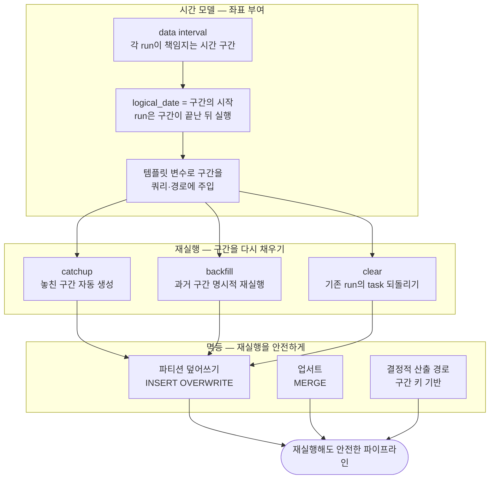

<figure class="post-figure post-figure--header">
<svg role="img" aria-label="백필·catchup·멱등을 한 장으로 정리한 그림. 위쪽은 시간축으로, 하루씩 잘린 data interval 칸 다섯 개가 나란히 놓여 있고 그중 두 칸(6/30, 7/1)이 놓친·틀린 구간으로 비어 있으며, 오른쪽 '지금'에서 출발한 backfill·catchup 화살표가 그 구간만 다시 채우러 되돌아간다. 아래쪽은 멱등 개념으로, 같은 구간의 1·2·3번째 실행이 모두 하나의 파티션(ds=6/30)으로 수렴해 결과는 언제나 같은 한 벌임을 보여준다." viewBox="0 0 680 350" xmlns="http://www.w3.org/2000/svg">
  <title>백필 · Catchup · 멱등 — 놓친 구간을 다시 채워도 결과는 같은 한 벌</title>
  <defs>
    <marker id="bfh-arrow" viewBox="0 0 10 10" refX="8" refY="5" markerWidth="6" markerHeight="6" orient="auto-start-reverse">
      <path d="M0,0 L10,5 L0,10 z" fill="var(--secondary-color)"/>
    </marker>
    <marker id="bfh-arrow-accent" viewBox="0 0 10 10" refX="8" refY="5" markerWidth="6" markerHeight="6" orient="auto-start-reverse">
      <path d="M0,0 L10,5 L0,10 z" fill="var(--accent-color)"/>
    </marker>
  </defs>

  <text x="340" y="24" text-anchor="middle" font-size="17" font-weight="800" fill="currentColor" letter-spacing="1.5">백필 · CATCHUP · 멱등</text>

  <!-- ===== SECTION A: time axis of data intervals ===== -->
  <text x="30" y="46" text-anchor="start" font-size="11" font-weight="700" fill="currentColor" opacity="0.72">시간축 — 하루씩 잘린 data interval</text>

  <!-- backfill arrow going back to the missed intervals -->
  <text x="522" y="40" text-anchor="middle" font-size="10" font-weight="700" fill="var(--accent-color)">backfill · catchup — 그 구간만 다시</text>
  <path d="M636,72 C570,44 480,44 410,72" fill="none" stroke="var(--accent-color)" stroke-width="2.5" marker-end="url(#bfh-arrow-accent)"/>

  <!-- interval cells -->
  <g>
    <rect x="40" y="76" width="112" height="56" rx="3" fill="var(--bg-light)" stroke="currentColor" stroke-width="2"/>
    <rect x="162" y="76" width="112" height="56" rx="3" fill="var(--bg-light)" stroke="currentColor" stroke-width="2"/>
    <rect x="284" y="76" width="112" height="56" rx="3" fill="var(--bg-panel)" stroke="var(--accent-color)" stroke-width="2" stroke-dasharray="6 4"/>
    <rect x="406" y="76" width="112" height="56" rx="3" fill="var(--bg-panel)" stroke="var(--accent-color)" stroke-width="2" stroke-dasharray="6 4"/>
    <rect x="528" y="76" width="112" height="56" rx="3" fill="var(--bg-light)" stroke="currentColor" stroke-width="2"/>
  </g>
  <!-- check marks on completed intervals -->
  <g fill="none" stroke="var(--secondary-color)" stroke-width="3" stroke-linecap="round" stroke-linejoin="round">
    <path d="M85,100 l8,9 l15,-18"/>
    <path d="M207,100 l8,9 l15,-18"/>
    <path d="M573,100 l8,9 l15,-18"/>
  </g>
  <!-- question marks on missed intervals -->
  <g font-size="20" font-weight="800" fill="var(--accent-color)" text-anchor="middle">
    <text x="340" y="108">?</text>
    <text x="462" y="108">?</text>
  </g>
  <!-- interval start dates -->
  <g font-size="9" fill="currentColor" opacity="0.75" text-anchor="middle">
    <text x="96" y="126">6/28</text>
    <text x="218" y="126">6/29</text>
    <text x="340" y="126">6/30</text>
    <text x="462" y="126">7/1</text>
    <text x="584" y="126">7/2</text>
  </g>
  <!-- "now" marker -->
  <line x1="652" y1="76" x2="652" y2="132" stroke="currentColor" stroke-width="2" stroke-dasharray="3 3"/>
  <text x="652" y="148" text-anchor="middle" font-size="9" fill="currentColor" opacity="0.75">지금</text>
  <text x="40" y="150" text-anchor="start" font-size="9" fill="currentColor" opacity="0.75">✓ 처리 완료 · ? 놓친/틀린 구간 — 칸마다 run 하나가 책임진다</text>

  <!-- ===== divider ===== -->
  <line x1="30" y1="168" x2="650" y2="168" stroke="currentColor" stroke-width="1.4" opacity="0.25"/>

  <!-- ===== SECTION B: idempotency ===== -->
  <text x="30" y="192" text-anchor="start" font-size="11" font-weight="700" fill="currentColor" opacity="0.72">멱등 — 같은 구간을 몇 번 돌려도, 결과는 같은 한 벌</text>

  <!-- three runs of the same interval -->
  <g>
    <rect x="50" y="210" width="112" height="28" rx="3" fill="var(--bg-light)" stroke="currentColor" stroke-width="1.8"/>
    <rect x="50" y="246" width="112" height="28" rx="3" fill="var(--bg-light)" stroke="currentColor" stroke-width="1.8"/>
    <rect x="50" y="282" width="112" height="28" rx="3" fill="var(--bg-light)" stroke="currentColor" stroke-width="1.8"/>
  </g>
  <g font-size="10" font-weight="700" fill="currentColor" text-anchor="middle">
    <text x="106" y="228">1번째 실행</text>
    <text x="106" y="264">2번째 실행</text>
    <text x="106" y="300">3번째 실행</text>
  </g>
  <g stroke="var(--secondary-color)" stroke-width="2" fill="none">
    <line x1="166" y1="224" x2="292" y2="252" marker-end="url(#bfh-arrow)"/>
    <line x1="166" y1="260" x2="292" y2="262" marker-end="url(#bfh-arrow)"/>
    <line x1="166" y1="296" x2="292" y2="272" marker-end="url(#bfh-arrow)"/>
  </g>

  <!-- the one partition they all converge to -->
  <rect x="298" y="232" width="150" height="60" rx="4" fill="var(--bg-light)" stroke="var(--gold)" stroke-width="2.5"/>
  <text x="373" y="257" text-anchor="middle" font-size="11" font-weight="700" fill="currentColor">파티션</text>
  <text x="373" y="277" text-anchor="middle" font-size="12" font-weight="800" fill="currentColor">ds = 6/30</text>

  <text x="474" y="270" text-anchor="middle" font-size="22" font-weight="800" fill="currentColor">=</text>

  <rect x="500" y="232" width="140" height="60" rx="4" fill="var(--bg-panel)" stroke="currentColor" stroke-width="2"/>
  <text x="570" y="257" text-anchor="middle" font-size="10" fill="currentColor" opacity="0.8">결과는 언제나</text>
  <text x="570" y="278" text-anchor="middle" font-size="12.5" font-weight="800" fill="currentColor">같은 한 벌</text>

  <text x="340" y="332" text-anchor="middle" font-size="9.5" fill="currentColor" opacity="0.8">주소를 구간으로 결정하고, 통째로 대체한다 — 덮어쓰기 · 업서트 · 결정적 경로</text>
</svg>
<figcaption>논리 구간 · 백필 · 멱등 — 놓친 구간을 다시 채워도 결과는 같은 한 벌</figcaption>
</figure>

## 들어가며

[4단계](/2026/07/13/airflow-sensors-deferrable-operators.html)에서 센서와 deferrable 오퍼레이터로 **외부 상태를 효율적으로 기다리는 법**을 익혔습니다. 이제 견고함의 나머지 절반, 어쩌면 더 중요한 절반을 다룰 차례입니다 — **재실행**입니다.

파이프라인은 반드시 다시 돌게 됩니다. 변환 로직에 버그가 있어서 지난 한 달치를 다시 계산해야 하고, 스케줄러가 점검으로 내려가 있던 사이 놓친 구간을 따라잡아야 하고, 원천 데이터가 늦게 도착해 어제치 태스크를 clear하고 재실행해야 합니다. 이때 두 가지 질문에 답할 수 있어야 합니다. 첫째, **"지난 6월 3일치"를 어떻게 특정해서 다시 돌리는가?** 둘째, **다시 돌렸을 때 데이터가 중복되거나 망가지지 않는가?**

첫 질문의 답이 Airflow의 시간 모델인 **논리적 실행 구간(data interval)**과 그 위의 **백필(backfill)·catchup**이고, 둘째 질문의 답이 **멱등(idempotent) 설계**입니다. [오케스트레이션 오버뷰](/2026/06/25/orchestration.html)에서 이 개념들의 큰 틀을 짚었다면, 이 글은 Airflow가 실제로 시간을 어떻게 다루는지 — `logical_date`가 왜 실행 시각보다 하루 이르게 보이는지, `catchup=True`가 무엇을 만들어내는지, `INSERT OVERWRITE`가 왜 재실행의 면허인지 — 그 구체적 메커니즘으로 들어갑니다.

이 글은 [Airflow Essential Curriculum](/2026/07/12/airflow-essential-curriculum.html)의 **5단계**로, "견고함" 막(4~5단계)을 마무리하는 편입니다.

<div class="post-summary-box" markdown="1">

### 📌 이 글에서 다루는 내용

- **논리적 실행 구간**: DAG run은 물리적 실행 시각이 아니라 data interval에 묶인다 — `logical_date`, `data_interval_start/end`, "구간이 끝난 뒤 실행된다"는 규칙과 대표적 혼란 포인트
- **템플릿 변수**: `{{ ds }}`, `{{ data_interval_start }}`로 구간을 쿼리·경로에 주입하는 패턴
- **catchup과 백필**: 놓친 구간의 자동 따라잡기, `airflow dags backfill`로 과거 구간 재실행, `max_active_runs`로 폭주 제어, clear와 task 상태
- **멱등 설계**: 파티션 덮어쓰기 · 업서트(MERGE) · 결정적 산출 경로 — 그리고 append-only INSERT, `now()` 의존 같은 안티패턴

</div>

## 한눈에 보기 — 논리 구간에서 멱등까지

이 글의 서사는 하나의 인과 사슬입니다. Airflow가 각 실행에 **논리적 구간**이라는 좌표를 부여하기 때문에 "그 구간만 다시 돌려라"(백필·catchup)가 가능해지고, 그 재실행이 안전하려면 태스크가 그 구간에 대해 **멱등**해야 합니다. 셋 중 하나라도 빠지면 재실행은 도박이 됩니다.





## 논리적 실행 구간 — Airflow는 물리 시각이 아니라 구간으로 사고한다

### DAG run은 data interval에 묶인다

Airflow에서 가장 먼저 교정해야 할 직관이 있습니다. **DAG run의 정체성은 "언제 실행됐는가"가 아니라 "어느 시간 구간의 데이터를 책임지는가"입니다.** 매일 자정에 도는 일별 배치를 생각해 보세요. 7월 1일 00:00에 시작한 run이 처리하는 데이터는 "7월 1일치"가 아니라 **6월 30일 00:00 ~ 7월 1일 00:00 사이에 쌓인 하루치**입니다. 그 하루가 다 지나야 비로소 처리할 수 있으니까요.

Airflow는 이 구간을 각 run의 일급 속성으로 만들어 두었습니다.

- **`data_interval_start`** — 이 run이 책임지는 구간의 시작 (위 예에서 6/30 00:00)
- **`data_interval_end`** — 구간의 끝이자 실제 실행이 시작될 수 있는 가장 이른 시각 (7/1 00:00)
- **`logical_date`** — run의 논리적 식별자. 스케줄 기반 run에서는 `data_interval_start`와 같습니다

그리고 하나의 규칙이 모든 것을 지배합니다. **"run은 자신의 구간이 끝난 뒤에 실행된다."** 구간 `[6/30, 7/1)`을 맡은 run은 7/1 00:00 이후에야 스케줄됩니다.

### 대표적 혼란 포인트: 7/1 자정 run의 logical_date는 6/30

이 규칙에서 Airflow 입문자의 8할이 걸려 넘어지는 지점이 나옵니다. **7월 1일 자정에 돈 run의 `logical_date`는 6월 30일입니다.** UI에서 "왜 오늘 돈 run이 어제 날짜를 달고 있지?"라고 당황하는 바로 그 장면이죠. 물리 시각(7/1 00:00에 실행됨)과 논리 좌표(6/30 구간을 책임짐)를 분리해서 보면 전혀 이상하지 않습니다 — run의 이름표는 실행 시각이 아니라 **담당 구간**이니까요.

<figure class="post-figure">
<svg role="img" aria-label="data interval의 해부도. 시간축 위에 6/30 00:00부터 7/1 00:00까지의 구간 박스가 놓여 있고, 구간의 왼쪽 끝에는 logical_date이자 data_interval_start(6/30 00:00, 포함), 오른쪽 끝에는 data_interval_end(7/1 00:00, 배타) 라벨이 붙어 있다. 구간이 끝난 직후인 7/1 00:00 이후 지점에 실제 실행 시작 표시가 있어, 실행 시각은 7/1이지만 run의 이름표인 logical_date는 6/30인 이유를 보여준다." viewBox="0 0 640 245" xmlns="http://www.w3.org/2000/svg">
  <title>data interval 해부 — 실행은 7/1, 이름표(logical_date)는 6/30</title>
  <defs>
    <marker id="dif-arrow" viewBox="0 0 10 10" refX="8" refY="5" markerWidth="6" markerHeight="6" orient="auto-start-reverse">
      <path d="M0,0 L10,5 L0,10 z" fill="var(--secondary-color)"/>
    </marker>
    <marker id="dif-arrow-accent" viewBox="0 0 10 10" refX="8" refY="5" markerWidth="6" markerHeight="6" orient="auto-start-reverse">
      <path d="M0,0 L10,5 L0,10 z" fill="var(--accent-color)"/>
    </marker>
    <marker id="dif-arrow-cur" viewBox="0 0 10 10" refX="8" refY="5" markerWidth="6" markerHeight="6" orient="auto-start-reverse">
      <path d="M0,0 L10,5 L0,10 z" fill="currentColor"/>
    </marker>
  </defs>

  <!-- annotations: interval start -->
  <text x="40" y="44" text-anchor="start" font-size="11" font-weight="700" fill="var(--secondary-color)">logical_date = data_interval_start</text>
  <text x="40" y="60" text-anchor="start" font-size="9" fill="currentColor" opacity="0.8">구간의 시작 — 이 run의 이름표는 6/30</text>
  <line x1="112" y1="66" x2="120" y2="84" stroke="var(--secondary-color)" stroke-width="2" marker-end="url(#dif-arrow)"/>

  <!-- annotations: interval end -->
  <text x="600" y="44" text-anchor="end" font-size="11" font-weight="700" fill="var(--secondary-color)">data_interval_end</text>
  <text x="600" y="60" text-anchor="end" font-size="9" fill="currentColor" opacity="0.8">구간의 끝 — 7/1 00:00, 배타적</text>
  <line x1="510" y1="66" x2="443" y2="84" stroke="var(--secondary-color)" stroke-width="2" marker-end="url(#dif-arrow)"/>

  <!-- interval box -->
  <rect x="120" y="88" width="320" height="52" fill="var(--bg-light)" stroke="currentColor" stroke-width="2"/>
  <text x="280" y="110" text-anchor="middle" font-size="10.5" font-weight="700" fill="currentColor">data interval</text>
  <text x="280" y="126" text-anchor="middle" font-size="9" fill="currentColor" opacity="0.8">이 run이 책임지는 하루</text>
  <text x="112" y="122" text-anchor="middle" font-size="20" font-weight="700" fill="currentColor">[</text>
  <text x="448" y="122" text-anchor="middle" font-size="20" font-weight="700" fill="currentColor">)</text>

  <!-- time axis -->
  <line x1="40" y1="140" x2="596" y2="140" stroke="currentColor" stroke-width="2" opacity="0.5" marker-end="url(#dif-arrow-cur)"/>
  <line x1="120" y1="130" x2="120" y2="150" stroke="currentColor" stroke-width="2"/>
  <line x1="440" y1="130" x2="440" y2="150" stroke="currentColor" stroke-width="2"/>
  <text x="120" y="164" text-anchor="middle" font-size="9.5" fill="currentColor" opacity="0.8">6/30 00:00</text>
  <text x="436" y="164" text-anchor="end" font-size="9.5" fill="currentColor" opacity="0.8">7/1 00:00</text>

  <!-- actual execution start, just after the interval closes -->
  <circle cx="466" cy="140" r="5" fill="var(--accent-color)"/>
  <line x1="466" y1="178" x2="466" y2="150" stroke="var(--accent-color)" stroke-width="2" marker-end="url(#dif-arrow-accent)"/>
  <text x="466" y="194" text-anchor="middle" font-size="10.5" font-weight="700" fill="var(--accent-color)">실제 실행 시작</text>
  <text x="466" y="209" text-anchor="middle" font-size="9" fill="currentColor" opacity="0.8">구간이 끝난 뒤 — 7/1 00:00 이후</text>

  <text x="320" y="236" text-anchor="middle" font-size="10" font-weight="700" fill="currentColor" opacity="0.85">규칙: run은 자신의 구간이 끝난 뒤 실행된다 — 실행 시각은 7/1, 이름표는 6/30</text>
</svg>
<figcaption>run은 자신의 data interval이 끝난 뒤 실행된다 — 7/1 자정에 돈 run의 이름표(logical_date)는 구간의 시작인 6/30이다</figcaption>
</figure>

이 개념의 옛 이름이 **`execution_date`**입니다. "실행 날짜"라는 이름이 실제 실행 시각으로 오해되기 딱 좋았기에, Airflow 2.2에서 `logical_date`와 명시적인 data interval로 재정비되었고 Airflow 3에서는 `execution_date`가 완전히 제거되었습니다. 옛 문서나 코드에서 `execution_date`를 만나면 `logical_date`로 읽으면 됩니다 — 구 명칭 이야기는 여기까지만 하겠습니다.

한 가지 최신 흐름도 짚어 두면, Airflow 3부터는 수동 트리거나 asset 이벤트로 생성된 run처럼 스케줄 구간이 없는 run은 `logical_date`가 `None`일 수 있습니다. "모든 run에 반드시 구간 날짜가 있다"는 가정 대신, 스케줄된 run이라면 구간이 있고 그 구간을 기준으로 처리한다고 사고하는 편이 안전합니다.

### 템플릿 변수 — 구간을 쿼리에 주입하기

논리 구간이 강력해지는 순간은, 태스크가 **자기 구간을 파라미터로 받아** 동작할 때입니다. Airflow는 실행 시점에 Jinja 템플릿으로 구간 정보를 주입해 줍니다. 자주 쓰는 변수는 다음과 같습니다.

| 템플릿 변수 | 의미 | 예시 값 |
| --- | --- | --- |
| `{{ ds }}` | `logical_date`의 `YYYY-MM-DD` 문자열 | `2026-06-30` |
| `{{ ds_nodash }}` | 같은 값, 구분자 없음 | `20260630` |
| `{{ data_interval_start }}` | 구간 시작 (pendulum DateTime) | `2026-06-30T00:00:00+00:00` |
| `{{ data_interval_end }}` | 구간 끝 (pendulum DateTime) | `2026-07-01T00:00:00+00:00` |

SQL 태스크라면 구간의 양 끝을 `WHERE` 절에 그대로 흘려 넣습니다.


```python
from airflow.providers.common.sql.operators.sql import SQLExecuteQueryOperator

# 이 run이 책임지는 구간의 주문만 집계한다.
# 백필로 과거 구간을 돌리면 그 구간의 날짜가 자동으로 주입된다.
aggregate_orders = SQLExecuteQueryOperator(
    task_id="aggregate_orders",
    conn_id="warehouse",
    sql="""
        SELECT customer_id, SUM(amount) AS daily_amount
        FROM raw.orders
        WHERE created_at >= '{{ data_interval_start }}'
          AND created_at <  '{{ data_interval_end }}'   -- 끝은 배타(exclusive)
        GROUP BY customer_id
    """,
)
```


구간의 끝을 배타(`<`)로 두는 것이 관례입니다. `[start, end)` 반개구간으로 자르면 인접한 두 구간이 겹치지도, 빈틈을 남기지도 않습니다.

TaskFlow API에서는 같은 정보를 파이썬 값으로 직접 받습니다.

```python
from airflow.sdk import dag, task  # Airflow 2.x에서는 airflow.decorators
import pendulum


@dag(
    schedule="@daily",
    start_date=pendulum.datetime(2026, 6, 1, tz="Asia/Seoul"),
    catchup=False,
)
def daily_revenue():

    @task
    def extract(data_interval_start: pendulum.DateTime = None,
                data_interval_end: pendulum.DateTime = None):
        # 템플릿 변수와 동일한 값이 함수 인자로 주입된다
        print(f"이 run의 담당 구간: [{data_interval_start}, {data_interval_end})")
        return fetch_orders(start=data_interval_start, end=data_interval_end)

    extract()


daily_revenue()
```

핵심은 이것입니다. **태스크 코드 어디에도 "오늘", "현재 시각"이 등장하지 않습니다.** 태스크는 오직 주입받은 구간만 바라봅니다. 그래서 같은 태스크에 6월 3일 구간을 주면 6월 3일치를, 오늘 구간을 주면 오늘치를 처리합니다 — 이 성질이 다음 절의 백필과 catchup을 가능하게 하는 토대입니다.

## 백필과 catchup — 놓친 구간, 틀린 구간을 다시 채우기

### catchup — 놓친 구간의 자동 따라잡기

DAG에는 `start_date`가 있고, 스케줄러는 `start_date`부터 현재까지의 시간을 스케줄 간격대로 잘라 구간의 목록을 계산할 수 있습니다. **`catchup=True`**면 스케줄러는 이 중 아직 run이 만들어지지 않은 모든 구간에 대해 DAG run을 자동 생성합니다.

```python
@dag(
    schedule="@daily",
    start_date=pendulum.datetime(2026, 6, 1, tz="Asia/Seoul"),
    catchup=True,   # 6/1부터 오늘까지 놓친 모든 일별 구간의 run을 생성
)
def historical_load():
    ...
```

오늘이 7월 13일이고 이 DAG를 처음 배포했다면, 활성화하는 순간 6/1 ~ 7/12 구간의 run 약 40개가 한꺼번에 생성되어 돌기 시작합니다. 과거 이력을 처음부터 적재해야 하는 DAG라면 이것이 정확히 원하는 동작이고, "지금부터의 데이터만 처리하면 되는" DAG라면 재앙입니다. 그래서 대부분의 DAG는 `catchup=False`로 두고, 이력 적재가 필요할 때만 의도적으로 켜거나 백필을 씁니다. 참고로 기본값 자체도 위험성을 반영해 바뀌었습니다 — Airflow 2.x의 기본은 `True`였지만(설정 `catchup_by_default`), Airflow 3.0부터 기본이 `False`입니다. 어느 버전이든 **DAG에 명시적으로 적어 두는 것**이 정답입니다.

`catchup=False`여도 놓친 구간이 완전히 무시되는 것은 아니고, 가장 최근 구간 하나는 실행됩니다. "스케줄러가 이틀 죽어 있었다면, 깨어난 뒤 마지막 구간만 돈다"는 뜻입니다.

### backfill — 과거 구간을 명시적으로 다시 돌리기

catchup이 "빈 구간의 자동 채움"이라면, **백필은 지정한 과거 구간을 의도적으로 (다시) 실행하는 작업**입니다. 변환 로직을 고친 뒤 지난 한 달치를 다시 계산하는 전형적인 시나리오가 여기 해당합니다.

```bash
# Airflow 2.x — 6월 한 달치 구간을 재실행
airflow dags backfill \
    --start-date 2026-06-01 \
    --end-date 2026-06-30 \
    daily_revenue

# Airflow 3.x — 백필이 스케줄러 관할의 일급 개념이 되었고 UI에서도 실행 가능
airflow backfill create \
    --dag-id daily_revenue \
    --from-date 2026-06-01 \
    --to-date 2026-06-30
```

두 버전의 차이는 실행 주체입니다. 2.x의 `dags backfill`은 명령을 실행한 터미널 프로세스가 직접 run을 만들어 돌리는 반면, 3.x의 백필은 스케줄러가 관리하는 정식 워크로드가 되어 UI에서 생성·일시정지·취소까지 됩니다. 어느 쪽이든 본질은 같습니다 — **지정한 범위의 각 구간에 대해 run을 만들고, 태스크에 그 구간의 날짜를 주입해서 돌린다.** 앞 절에서 태스크가 구간만 바라보도록 짜 두었다면, 백필은 "과거 날짜를 주입한 평범한 실행"일 뿐입니다.

### 폭주 제어 — max_active_runs

백필과 catchup의 공통 위험은 **run이 한꺼번에 쏟아진다**는 점입니다. 한 달치 백필이면 run 30개가 동시에 뜨려 하고, 그 모두가 같은 웨어하우스를 두드리면 원천이든 대상이든 무너집니다. 제어 장치는 DAG 수준의 동시 실행 한도입니다.

```python
@dag(
    schedule="@daily",
    start_date=pendulum.datetime(2026, 6, 1, tz="Asia/Seoul"),
    catchup=False,
    max_active_runs=3,   # 이 DAG의 run은 동시에 3개까지만
)
def daily_revenue():
    ...
```

`max_active_runs`는 catchup이 만들어내는 run에도, 백필 run에도 적용되어 30개의 구간이 3개씩 줄 서서 처리되게 합니다. (2.x CLI 백필은 `--max-active-runs` 플래그로 별도 지정할 수도 있습니다.) 구간 사이에 순서 의존이 있는 파이프라인 — 예컨대 어제 스냅샷 위에 오늘 증분을 얹는 구조 — 라면 태스크에 `depends_on_past=True`를 걸어 아예 구간을 직렬화하기도 합니다.

### clear — 이미 존재하는 run을 다시 돌리기

백필이 "구간 범위의 재실행"이라면, **clear는 이미 존재하는 run 안의 task 인스턴스 상태를 지워 재실행을 유도하는** 더 국소적인 도구입니다. Airflow에서 "재실행"이라는 별도 동작은 사실 없습니다 — task의 상태(`success`, `failed`)를 지우면 스케줄러가 "아직 안 돈 task"로 보고 다시 큐에 넣는 것이 재실행의 실체입니다.

```bash
# 6/3 구간 run의 aggregate_orders와 그 하류(downstream)를 모두 clear
airflow tasks clear daily_revenue \
    --task-regex aggregate_orders \
    --downstream \
    --start-date 2026-06-03 \
    --end-date 2026-06-03
```

`--downstream`이 중요합니다. 중간 태스크만 다시 돌리고 하류를 그대로 두면, 하류는 옛 입력으로 만든 결과를 그대로 안고 있게 됩니다. UI에서 task를 clear할 때 기본으로 downstream이 함께 선택되는 것도 같은 이유입니다. clear든 백필이든 결론은 하나로 수렴합니다 — **Airflow는 같은 구간을 여러 번 돌리는 것을 전제로 설계된 시스템**이고, 그 전제를 받아낼 준비가 태스크 쪽에 되어 있어야 합니다. 그것이 멱등입니다.

## 멱등 설계 — 재실행이 안전해지는 조건

**멱등(idempotent)**: 같은 data interval에 대해 태스크를 한 번 돌리든 다섯 번 돌리든 **최종 상태가 동일**하다. 재시도·clear·백필·catchup — 지금까지 본 모든 재실행 메커니즘은 태스크가 멱등할 때만 안전합니다. 멱등하지 않은 태스크에 백필을 걸면, 30개 구간을 다시 채우는 게 아니라 30개 구간을 이중으로 오염시킵니다.

멱등을 달성하는 실무 패턴은 세 가지로 수렴합니다. 공통 원리는 하나입니다 — **산출물의 "주소"를 data interval로 결정하고, 그 주소를 통째로 대체한다.**

### 패턴 1 — 파티션 덮어쓰기 (DELETE+INSERT / INSERT OVERWRITE)

가장 널리 쓰이는 패턴입니다. 대상 테이블을 구간 키(보통 날짜)로 파티셔닝하고, 태스크는 자기 구간의 파티션을 **지우고 다시 씁니다**. 트랜잭션을 지원하는 웨어하우스라면 DELETE+INSERT를 한 트랜잭션으로 묶습니다.


```sql
-- 내 구간의 파티션을 통째로 대체한다: 몇 번을 돌려도 결과는 같은 한 벌
BEGIN;

DELETE FROM mart.daily_revenue
WHERE ds = '{{ ds }}';                     -- 이 run의 담당 구간만 제거

INSERT INTO mart.daily_revenue (ds, customer_id, daily_amount)
SELECT DATE '{{ ds }}', customer_id, SUM(amount)
FROM raw.orders
WHERE created_at >= '{{ data_interval_start }}'
  AND created_at <  '{{ data_interval_end }}'
GROUP BY customer_id;

COMMIT;
```


Hive·Spark·BigQuery 계열이라면 같은 의도를 `INSERT OVERWRITE`(정적 파티션 덮어쓰기) 한 문장으로 표현합니다. 어느 문법이든 성질은 동일합니다 — 첫 실행이면 빈 파티션에 쓰고, 재실행이면 기존 파티션을 대체하므로, **실행 횟수가 결과에 나타나지 않습니다.**

### 패턴 2 — 업서트 (MERGE)

파티션 단위 대체가 어려운 경우 — 대상이 파티션 없는 차원 테이블이거나, 한 구간의 데이터가 여러 파티션에 걸치는 경우 — 에는 **키 기준 업서트**로 멱등을 얻습니다. "있으면 갱신, 없으면 삽입"은 정의상 몇 번을 반복해도 같은 상태로 수렴합니다.


```sql
-- 고객별 최신 상태를 유지하는 테이블: 재실행해도 행이 늘지 않는다
MERGE INTO mart.customer_stats AS t
USING (
    SELECT customer_id, SUM(amount) AS amount, MAX(created_at) AS last_order_at
    FROM raw.orders
    WHERE created_at >= '{{ data_interval_start }}'
      AND created_at <  '{{ data_interval_end }}'
    GROUP BY customer_id
) AS s
ON t.customer_id = s.customer_id
WHEN MATCHED THEN
    UPDATE SET last_order_at = s.last_order_at
WHEN NOT MATCHED THEN
    INSERT (customer_id, last_order_at) VALUES (s.customer_id, s.last_order_at);
```


단, 업서트의 멱등성은 **"같은 입력이면 같은 갱신"일 때만** 성립합니다. `UPDATE SET total = t.total + s.amount`처럼 기존 값에 누적하는 갱신은 재실행마다 값이 불어나므로 멱등이 깨집니다 — MERGE라는 문법이 아니라 갱신 로직의 성질이 멱등을 결정합니다.

### 패턴 3 — 결정적 산출 경로

파일을 쓰는 태스크라면, **산출 경로를 data interval에서 결정적으로 유도**하는 것이 멱등의 열쇠입니다.


```python
@task
def export_daily(ds: str = None):
    # 경로가 구간 키에서 결정된다: 같은 구간의 재실행은 같은 파일을 덮어쓴다
    path = f"s3://lake/daily_revenue/ds={ds}/data.parquet"
    df = build_daily_revenue(ds)
    df.to_parquet(path)   # 같은 키 → 같은 경로 → 덮어쓰기

    # 안티패턴: 실행할 때마다 새 경로가 생겨 재실행마다 파일이 불어난다
    # path = f"s3://lake/daily_revenue/{uuid.uuid4()}.parquet"
    # path = f"s3://lake/daily_revenue/{datetime.now():%Y%m%d%H%M%S}.parquet"
```


`ds=2026-06-30` 구간을 열 번 돌려도 파일은 `ds=2026-06-30/data.parquet` 하나뿐입니다. 반면 UUID나 현재 시각으로 경로를 만들면 재실행마다 파일이 하나씩 늘고, 그 디렉터리를 읽는 하류는 같은 데이터를 여러 벌 집계하게 됩니다.

<figure class="post-figure">
<svg role="img" aria-label="멱등을 달성하는 세 가지 패턴을 나란히 놓은 개념도. 첫째, 파티션 덮어쓰기 — 날짜별 파티션 칸(6/29, 6/30, 7/1) 중 자기 구간인 6/30 칸만 지우고 다시 채우는 순환 화살표. 둘째, 업서트(MERGE) — 대상 테이블에 같은 키는 갱신으로, 새 키는 삽입으로 들어가 행 수가 수렴한다. 셋째, 결정적 산출 경로 — 구간 키 ds=6/30이 항상 같은 파일 주소를 가리켜, 재실행이 덮어쓰기가 된다. 세 패턴에서 뻗어 나온 화살표가 하나의 공통 원리, 즉 산출물의 주소를 구간으로 결정하고 통째로 대체한다는 문장으로 모인다." viewBox="0 0 680 285" xmlns="http://www.w3.org/2000/svg">
  <title>멱등 3패턴 — 파티션 덮어쓰기 · 업서트 · 결정적 경로, 하나의 공통 원리</title>
  <defs>
    <marker id="idm-arrow" viewBox="0 0 10 10" refX="8" refY="5" markerWidth="6" markerHeight="6" orient="auto-start-reverse">
      <path d="M0,0 L10,5 L0,10 z" fill="var(--secondary-color)"/>
    </marker>
  </defs>

  <g font-size="11.5" font-weight="700" fill="currentColor" text-anchor="middle">
    <text x="121" y="34">① 파티션 덮어쓰기</text>
    <text x="340" y="34">② 업서트 (MERGE)</text>
    <text x="565" y="34">③ 결정적 산출 경로</text>
  </g>

  <!-- ===== pattern 1: partition overwrite ===== -->
  <g>
    <rect x="38" y="56" width="54" height="46" rx="3" fill="var(--bg-light)" stroke="currentColor" stroke-width="1.8"/>
    <rect x="94" y="56" width="54" height="46" rx="3" fill="var(--bg-panel)" stroke="var(--gold)" stroke-width="2.5"/>
    <rect x="150" y="56" width="54" height="46" rx="3" fill="var(--bg-light)" stroke="currentColor" stroke-width="1.8"/>
  </g>
  <g font-size="9.5" fill="currentColor" text-anchor="middle">
    <text x="65" y="83" opacity="0.8">6/29</text>
    <text x="121" y="83" font-weight="800">6/30</text>
    <text x="177" y="83" opacity="0.8">7/1</text>
  </g>
  <path d="M121,111 A13,13 0 1 1 108,122" fill="none" stroke="var(--secondary-color)" stroke-width="2.2" marker-end="url(#idm-arrow)"/>
  <text x="121" y="152" text-anchor="middle" font-size="9" fill="currentColor" opacity="0.8">DELETE + INSERT</text>
  <text x="121" y="168" text-anchor="middle" font-size="9" fill="currentColor" opacity="0.8">내 구간 칸만 지우고 다시 채움</text>

  <!-- ===== pattern 2: upsert ===== -->
  <rect x="300" y="52" width="130" height="96" rx="3" fill="var(--bg-light)" stroke="currentColor" stroke-width="2"/>
  <line x1="300" y1="84" x2="430" y2="84" stroke="currentColor" stroke-width="1" opacity="0.4"/>
  <line x1="300" y1="116" x2="430" y2="116" stroke="currentColor" stroke-width="1" opacity="0.4" stroke-dasharray="4 3"/>
  <g font-size="9" fill="currentColor" text-anchor="middle">
    <text x="365" y="72">key A</text>
    <text x="365" y="104">key B</text>
    <text x="365" y="136" opacity="0.8">key C (새 행)</text>
  </g>
  <text x="294" y="58" text-anchor="end" font-size="8.5" fill="currentColor" opacity="0.8">같은 키 → 갱신</text>
  <line x1="246" y1="68" x2="296" y2="68" stroke="var(--secondary-color)" stroke-width="2" marker-end="url(#idm-arrow)"/>
  <text x="294" y="122" text-anchor="end" font-size="8.5" fill="currentColor" opacity="0.8">새 키 → 삽입</text>
  <line x1="246" y1="132" x2="296" y2="132" stroke="var(--secondary-color)" stroke-width="2" marker-end="url(#idm-arrow)"/>
  <text x="340" y="168" text-anchor="middle" font-size="9" fill="currentColor" opacity="0.8">행 수가 수렴 — 반복해도 늘지 않는다</text>

  <!-- ===== pattern 3: deterministic path ===== -->
  <rect x="464" y="58" width="84" height="32" rx="3" fill="var(--bg-light)" stroke="currentColor" stroke-width="1.8"/>
  <text x="506" y="78" text-anchor="middle" font-size="10" font-weight="700" fill="currentColor">ds = 6/30</text>
  <rect x="464" y="112" width="84" height="32" rx="3" fill="var(--bg-light)" stroke="currentColor" stroke-width="1.8"/>
  <text x="506" y="132" text-anchor="middle" font-size="10" font-weight="700" fill="currentColor">재실행</text>
  <rect x="584" y="70" width="84" height="52" rx="3" fill="var(--bg-panel)" stroke="var(--gold)" stroke-width="2.5"/>
  <text x="626" y="92" text-anchor="middle" font-size="8.5" fill="currentColor" opacity="0.8">ds=6/30/</text>
  <text x="626" y="108" text-anchor="middle" font-size="8.5" font-weight="700" fill="currentColor">data.parquet</text>
  <g stroke="var(--secondary-color)" stroke-width="2" fill="none">
    <line x1="552" y1="74" x2="580" y2="88" marker-end="url(#idm-arrow)"/>
    <line x1="552" y1="128" x2="580" y2="108" marker-end="url(#idm-arrow)"/>
  </g>
  <text x="565" y="168" text-anchor="middle" font-size="9" fill="currentColor" opacity="0.8">같은 키 → 같은 경로 → 덮어쓰기</text>

  <!-- ===== common principle ===== -->
  <g stroke="var(--secondary-color)" stroke-width="1.8" fill="none" opacity="0.85">
    <line x1="121" y1="178" x2="238" y2="206" marker-end="url(#idm-arrow)"/>
    <line x1="340" y1="178" x2="340" y2="206" marker-end="url(#idm-arrow)"/>
    <line x1="565" y1="178" x2="442" y2="206" marker-end="url(#idm-arrow)"/>
  </g>
  <rect x="110" y="210" width="460" height="52" rx="4" fill="var(--bg-light)" stroke="var(--gold)" stroke-width="2"/>
  <text x="340" y="230" text-anchor="middle" font-size="9.5" font-weight="700" fill="var(--gold)">공통 원리</text>
  <text x="340" y="250" text-anchor="middle" font-size="11" font-weight="800" fill="currentColor">산출물의 주소를 구간으로 결정하고, 통째로 대체한다</text>
</svg>
<figcaption>멱등 3패턴 — 파티션 덮어쓰기 · 업서트 · 결정적 경로, 모두 "주소를 구간으로 결정하고 통째로 대체한다"로 수렴한다</figcaption>
</figure>

### 안티패턴 — 멱등이 깨지는 세 가지 방식

패턴을 아는 것만큼, 멱등이 어디서 새는지 아는 것이 중요합니다.

- **Append-only INSERT.** `INSERT INTO ... SELECT ...`만 있고 대체·중복 제거가 없는 태스크는 재실행마다 같은 구간의 행이 한 벌씩 쌓입니다. 재시도 한 번(자동 retry 포함!)에 매출이 두 배로 잡히는 사고의 정체가 대부분 이것입니다.
- **`now()` 의존.** 태스크 안에서 `datetime.now()`, SQL의 `CURRENT_DATE`로 처리 범위를 정하면, 그 태스크는 "언제 실행됐는가"에 종속됩니다. 6월 3일 구간을 백필해도 `now()`는 7월 13일이므로 엉뚱한 데이터를 처리합니다. 처리 범위는 언제나 주입받은 `data_interval_start/end`에서 와야 합니다. (`now()`가 허용되는 곳은 `updated_at` 같은 감사용 메타데이터 정도입니다.)
- **비결정적 소스 읽기.** "원천 테이블의 현재 전체 상태"나 "API의 최신 스냅샷"처럼 시간이 흐르면 내용이 변하는 소스를 읽는 태스크는, 같은 구간을 다시 돌려도 같은 입력을 받는다는 보장이 없습니다. 가능하면 원천을 구간으로 자를 수 있는 형태(이벤트 로그, 날짜 파티션된 raw 계층)로 먼저 적재해 두고, 변환은 그 불변 구간을 읽게 하세요. raw 계층을 시간 기준으로 잘라 보존하는 것이 파이프라인 전체의 재현 가능성(reproducibility)을 떠받칩니다.

세 안티패턴의 공통점이 보일 겁니다 — 모두 **태스크의 입력이나 출력이 "구간" 바깥의 무언가(실행 시각, 실행 횟수, 현재 상태)에 의존**합니다. 뒤집으면 멱등의 정의가 됩니다. **입력은 구간에서 오고, 출력의 주소도 구간에서 오며, 실행은 그 주소를 통째로 대체한다.** 이 한 문장이 논리 구간(1절) → 백필·catchup(2절) → 멱등(3절)을 하나로 꿰는 설계 원칙입니다.

## 정리

- **DAG run의 정체성은 data interval이다.** run은 물리적 실행 시각이 아니라 자신이 책임지는 시간 구간에 묶이며, "구간이 끝난 뒤 실행된다"는 규칙 때문에 7/1 자정 run의 `logical_date`는 6/30입니다. 옛 이름 `execution_date`는 이 개념의 오해되기 쉬운 과거형입니다.
- **태스크는 주입받은 구간만 바라보게 짠다.** `{{ ds }}`, `{{ data_interval_start }}`를 쿼리와 경로에 흘려 넣으면, 태스크는 어느 구간을 주든 그 구간을 처리하는 함수가 됩니다.
- **catchup은 놓친 구간의 자동 생성, backfill은 지정 구간의 명시적 재실행, clear는 기존 run의 되돌리기다.** 셋 다 "구간에 날짜를 주입해 다시 돌린다"는 같은 메커니즘이며, `max_active_runs`로 폭주를 제어합니다. catchup 기본값은 Airflow 3.0에서 `False`로 바뀌었으니 DAG에 항상 명시하세요.
- **멱등이 모든 재실행의 면허다.** 파티션 덮어쓰기 · 업서트 · 결정적 산출 경로 — 산출물의 주소를 구간으로 결정하고 통째로 대체하면 멱등이 되고, append-only INSERT · `now()` 의존 · 비결정적 소스 읽기는 멱등을 깨뜨립니다.

새 DAG를 리뷰할 때 이렇게 물어보세요 — "이 태스크에 2026-06-03 구간을 주입해 지금 당장 다시 돌리면, 결과가 정확히 같은가?" 예라고 답할 수 있으면, 이제 남은 것은 이 파이프라인을 프로덕션에 올려 운영하는 일뿐입니다.

### 다음 학습 (Next Learning)

- [Airflow 배포와 운영](/2026/07/13/airflow-deployment-operations.html) — 6단계: KubernetesExecutor·원격 로깅·모니터링으로 프로덕션에 올리기
- [센서 · Deferrable 오퍼레이터](/2026/07/13/airflow-sensors-deferrable-operators.html) — 4단계: 외부 상태 대기와 비동기 효율 복습
- [Airflow Essential Curriculum](/2026/07/12/airflow-essential-curriculum.html) — 시리즈 로드맵으로 돌아가 진행 상황 확인하기
